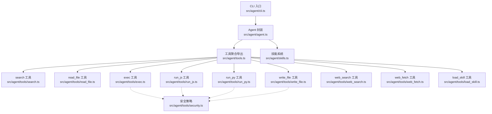
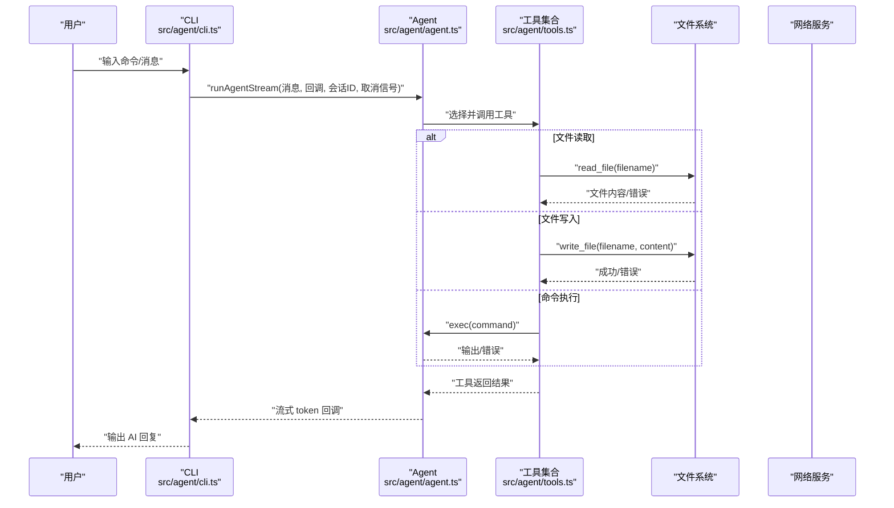
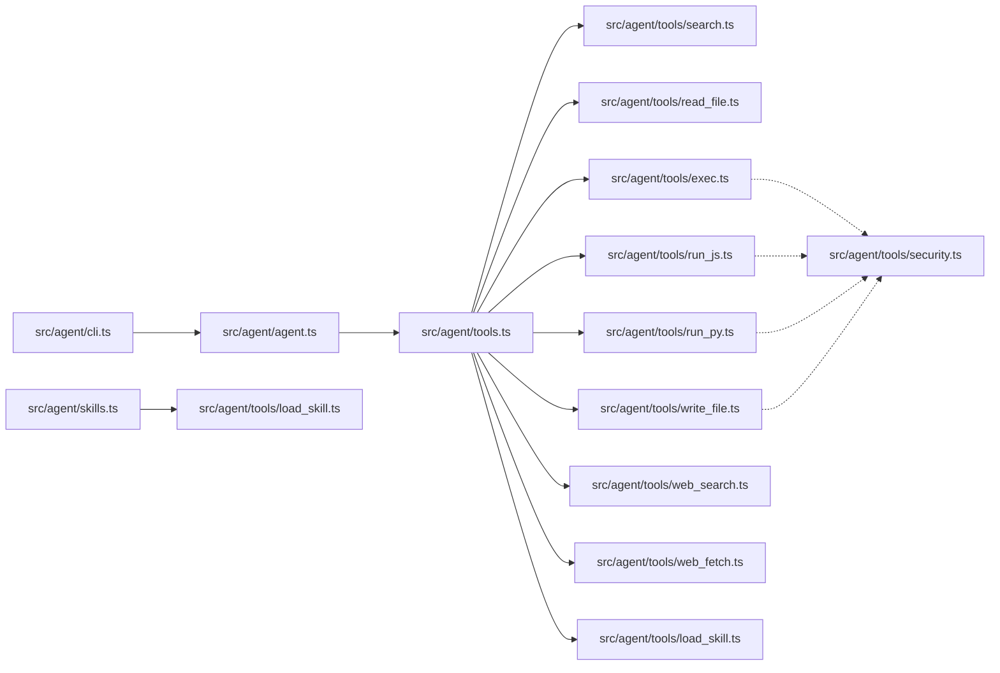
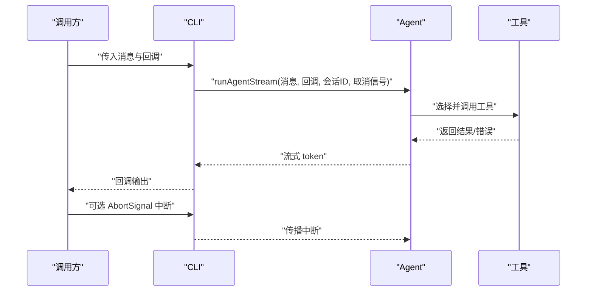
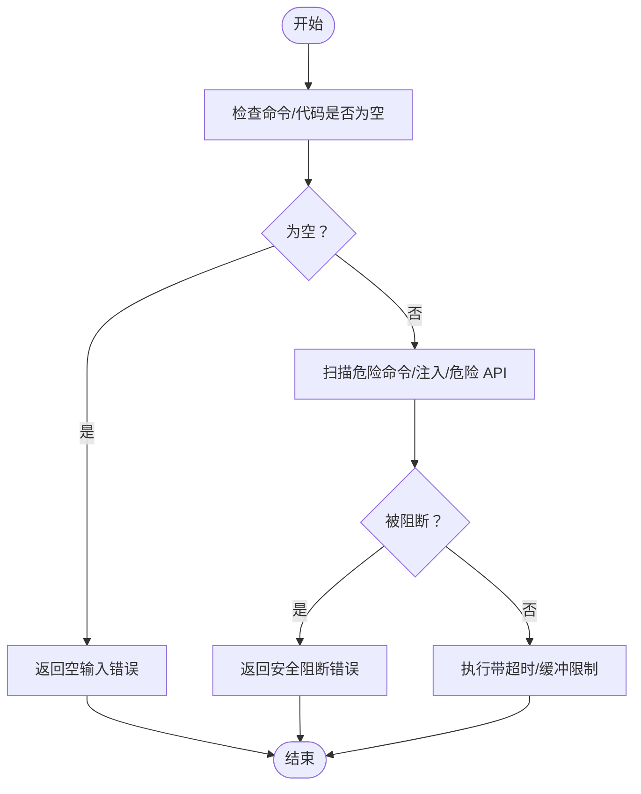

# API 参考

<cite>
**本文档引用的文件**
- [package.json](file://package.json)
- [src/agent/tools.ts](file://src/agent/tools.ts)
- [src/agent/skills.ts](file://src/agent/skills.ts)
- [src/agent/agent.ts](file://src/agent/agent.ts)
- [src/agent/cli.ts](file://src/agent/cli.ts)
- [src/agent/tools/search.ts](file://src/agent/tools/search.ts)
- [src/agent/tools/read_file.ts](file://src/agent/tools/read_file.ts)
- [src/agent/tools/write_file.ts](file://src/agent/tools/write_file.ts)
- [src/agent/tools/exec.ts](file://src/agent/tools/exec.ts)
- [src/agent/tools/run_js.ts](file://src/agent/tools/run_js.ts)
- [src/agent/tools/run_py.ts](file://src/agent/tools/run_py.ts)
- [src/agent/tools/web_search.ts](file://src/agent/tools/web_search.ts)
- [src/agent/tools/web_fetch.ts](file://src/agent/tools/web_fetch.ts)
- [src/agent/tools/load_skill.ts](file://src/agent/tools/load_skill.ts)
- [src/agent/tools/security.ts](file://src/agent/tools/security.ts)
- [src/agent/tools/exec.test.ts](file://src/agent/tools/exec.test.ts)
- [src/agent/tools/run_js.test.ts](file://src/agent/tools/run_js.test.ts)
- [src/agent/tools/run_py.test.ts](file://src/agent/tools/run_py.test.ts)
- [src/agent/tools/search.test.ts](file://src/agent/tools/search.test.ts)
</cite>

## 目录
1. [简介](#简介)
2. [项目结构](#项目结构)
3. [核心组件](#核心组件)
4. [架构总览](#架构总览)
5. [详细组件分析](#详细组件分析)
6. [依赖关系分析](#依赖关系分析)
7. [性能考量](#性能考量)
8. [故障排查指南](#故障排查指南)
9. [结论](#结论)
10. [附录](#附录)

## 简介
本参考文档面向使用者与集成开发者，系统性梳理本项目的公共 API，包括工具 API、技能 API 与配置 API 的接口规范、参数与返回值、错误码与异常处理、版本兼容与废弃策略、最佳实践、性能与安全注意事项，以及测试与调试方法。项目基于 CLI 与 LangGraph Agent 架构，提供多种工具能力（文件读写、命令执行、脚本运行、网络检索与抓取、技能加载）与交互式对话体验。

## 项目结构
- 包元信息与入口
  - 包信息与二进制入口位于 package.json，CLI 可执行名为 onionCode。
  - CLI 入口文件为 src/agent/cli.ts，负责命令解析、交互式会话与错误格式化。
- Agent 与工具
  - Agent 定义与流式运行封装位于 src/agent/agent.ts。
  - 工具聚合导出位于 src/agent/tools.ts，统一对外暴露各工具。
  - 各工具实现位于 src/agent/tools/ 下，涵盖 search、read_file、write_file、exec、run_js、run_py、web_search、web_fetch、load_skill。
  - 安全策略集中于 src/agent/tools/security.ts，提供危险 API 模式匹配。
- 技能系统
  - 技能清单与加载逻辑位于 src/agent/skills.ts，支持遍历 skills 目录、解析 SKILL.md frontmatter 并按名称加载完整内容。

图表来源
- [src/agent/cli.ts:1-126](file://src/agent/cli.ts#L1-L126)
- [src/agent/agent.ts:1-98](file://src/agent/agent.ts#L1-L98)
- [src/agent/tools.ts:1-10](file://src/agent/tools.ts#L1-L10)
- [src/agent/skills.ts:1-139](file://src/agent/skills.ts#L1-L139)
- [src/agent/tools/search.ts:1-24](file://src/agent/tools/search.ts#L1-L24)
- [src/agent/tools/read_file.ts:1-41](file://src/agent/tools/read_file.ts#L1-L41)
- [src/agent/tools/write_file.ts:1-55](file://src/agent/tools/write_file.ts#L1-L55)
- [src/agent/tools/exec.ts:1-143](file://src/agent/tools/exec.ts#L1-L143)
- [src/agent/tools/run_js.ts:1-90](file://src/agent/tools/run_js.ts#L1-L90)
- [src/agent/tools/run_py.ts:1-90](file://src/agent/tools/run_py.ts#L1-L90)
- [src/agent/tools/web_search.ts:1-41](file://src/agent/tools/web_search.ts#L1-L41)
- [src/agent/tools/web_fetch.ts:1-83](file://src/agent/tools/web_fetch.ts#L1-L83)
- [src/agent/tools/load_skill.ts:1-34](file://src/agent/tools/load_skill.ts#L1-L34)
- [src/agent/tools/security.ts:1-27](file://src/agent/tools/security.ts#L1-L27)

章节来源
- [package.json:1-38](file://package.json#L1-L38)
- [src/agent/cli.ts:1-126](file://src/agent/cli.ts#L1-L126)
- [src/agent/agent.ts:1-98](file://src/agent/agent.ts#L1-L98)
- [src/agent/tools.ts:1-10](file://src/agent/tools.ts#L1-L10)
- [src/agent/skills.ts:1-139](file://src/agent/skills.ts#L1-L139)

## 核心组件
- CLI 命令与交互
  - 命令：onionCode，支持子命令 ask 与默认交互式聊天；版本来自 package.json。
  - 错误格式化：针对内容安全拦截、认证失败、额度不足、超时等常见错误进行友好提示。
- Agent 运行
  - 使用 LangGraph 创建 Agent，注册工具集合，设置系统提示（含可用技能列表）与内存检查点。
  - 提供 runAgentStream 流式运行接口，支持线程 ID 维持会话历史、AbortSignal 中断。
- 工具聚合
  - 通过 tools.ts 统一导出九类工具：search、read_file、write_file、exec、run_js、run_py、web_search、web_fetch、load_skill。
- 技能系统
  - discoverSkills：遍历 skills 目录，解析 SKILL.md frontmatter，返回 name/description/dir。
  - loadSkill：按 name 加载完整 SKILL.md 内容；getSkillText：生成注入 system prompt 的技能文本。

章节来源
- [src/agent/cli.ts:1-126](file://src/agent/cli.ts#L1-L126)
- [src/agent/agent.ts:1-98](file://src/agent/agent.ts#L1-L98)
- [src/agent/tools.ts:1-10](file://src/agent/tools.ts#L1-L10)
- [src/agent/skills.ts:1-139](file://src/agent/skills.ts#L1-L139)

## 架构总览
下图展示 CLI、Agent、工具与技能系统的交互流程，以及关键数据流与错误处理路径。

图表来源
- [src/agent/cli.ts:1-126](file://src/agent/cli.ts#L1-L126)
- [src/agent/agent.ts:1-98](file://src/agent/agent.ts#L1-L98)
- [src/agent/tools.ts:1-10](file://src/agent/tools.ts#L1-L10)
- [src/agent/tools/read_file.ts:1-41](file://src/agent/tools/read_file.ts#L1-L41)
- [src/agent/tools/write_file.ts:1-55](file://src/agent/tools/write_file.ts#L1-L55)
- [src/agent/tools/exec.ts:1-143](file://src/agent/tools/exec.ts#L1-L143)

## 详细组件分析

### 工具 API 规范

#### search 工具
- 功能：根据查询字符串返回天气信息（示例逻辑）。
- 参数
  - query: string（必填）
- 返回
  - 成功：字符串（天气描述）
  - 失败：字符串（错误信息）
- 错误与边界
  - 参数缺失：Zod 校验拒绝调用
- 使用示例
  - 查询“旧金山天气”返回雾天描述；其他查询返回晴天描述
- 安全与限制
  - 无外部执行，仅本地逻辑
- 测试要点
  - 不同关键词命中分支、空查询、参数缺失校验

章节来源
- [src/agent/tools/search.ts:1-24](file://src/agent/tools/search.ts#L1-L24)
- [src/agent/tools/search.test.ts:1-34](file://src/agent/tools/search.test.ts#L1-L34)

#### read_file 工具
- 功能：读取当前工作目录下的文件内容。
- 参数
  - filename: string（必填）
- 返回
  - 成功：文件内容字符串
  - 失败：错误信息字符串（越界、不存在、目录等）
- 安全与限制
  - 路径安全：禁止访问当前目录之外；相对路径规范化
- 使用示例
  - 读取 package.json、README 等
- 测试要点
  - 越界路径、目录读取、文件不存在、正常读取

章节来源
- [src/agent/tools/read_file.ts:1-41](file://src/agent/tools/read_file.ts#L1-L41)

#### write_file 工具
- 功能：在当前工作目录创建或覆盖文件。
- 参数
  - filename: string（必填）
  - content: string（必填）
- 返回
  - 成功：成功信息字符串
  - 失败：错误信息字符串（越界、危险内容、IO 异常）
- 安全与限制
  - 路径安全：禁止越界
  - 内容安全：阻断危险 API 调用模式（来自 shared security）
- 使用示例
  - 写入配置文件、日志文件
- 测试要点
  - 越界路径、危险内容阻断、文件 IO 异常

章节来源
- [src/agent/tools/write_file.ts:1-55](file://src/agent/tools/write_file.ts#L1-L55)
- [src/agent/tools/security.ts:1-27](file://src/agent/tools/security.ts#L1-L27)

#### exec 工具
- 功能：在当前工作目录执行 shell 命令。
- 参数
  - command: string（必填）
- 返回
  - 成功：命令输出（stdout）
  - 失败：错误信息字符串（空命令、超时、IO 错误、安全阻断）
- 安全与限制
  - 命令黑名单：rm、mv、cp、sudo、chmod、kill、wget、curl 等
  - Eval 注入防护：node/python/ruby/perl/php 等 -e/-c/-r 等模式
  - 内容安全：阻断危险 API 调用（来自 shared security）
  - 超时：30 秒；缓冲区上限：1MB
- 使用示例
  - echo、ls、pwd 等基础命令；危险命令被阻断
- 测试要点
  - 黑名单命令、eval 注入、危险 API、空命令、超时、IO 错误

章节来源
- [src/agent/tools/exec.ts:1-143](file://src/agent/tools/exec.ts#L1-L143)
- [src/agent/tools/security.ts:1-27](file://src/agent/tools/security.ts#L1-L27)
- [src/agent/tools/exec.test.ts:1-150](file://src/agent/tools/exec.test.ts#L1-L150)

#### run_js 工具
- 功能：通过 Node.js 执行 JavaScript 代码（写入临时文件执行）。
- 参数
  - code: string（必填）
- 返回
  - 成功：标准输出
  - 失败：错误信息字符串（空代码、Node 不可用、超时、语法/运行时错误、危险内容）
- 安全与限制
  - 内容安全：阻断危险 API 调用（来自 shared security）
  - 超时：15 秒；缓冲区上限：512KB
- 使用示例
  - 计算、字符串处理、JSON 输出
- 测试要点
  - 语法错误、运行时异常、危险内容阻断、空代码、Node 可用性

章节来源
- [src/agent/tools/run_js.ts:1-90](file://src/agent/tools/run_js.ts#L1-L90)
- [src/agent/tools/security.ts:1-27](file://src/agent/tools/security.ts#L1-L27)
- [src/agent/tools/run_js.test.ts:1-85](file://src/agent/tools/run_js.test.ts#L1-L85)

#### run_py 工具
- 功能：通过 python3 执行 Python 代码（写入临时文件执行）。
- 参数
  - code: string（必填）
- 返回
  - 成功：标准输出
  - 失败：错误信息字符串（空代码、Python 不可用、超时、语法/运行时错误、危险内容）
- 安全与限制
  - 内容安全：阻断危险 API 调用（来自 shared security）
  - 超时：15 秒；缓冲区上限：512KB
- 使用示例
  - 计算、JSON 输出、数据处理
- 测试要点
  - 语法错误、运行时异常、危险内容阻断、空代码、Python 可用性

章节来源
- [src/agent/tools/run_py.ts:1-90](file://src/agent/tools/run_py.ts#L1-L90)
- [src/agent/tools/security.ts:1-27](file://src/agent/tools/security.ts#L1-L27)
- [src/agent/tools/run_py.test.ts:1-85](file://src/agent/tools/run_py.test.ts#L1-L85)

#### web_search 工具
- 功能：使用 Tavily 搜索引擎进行网络检索。
- 参数
  - query: string（必填）
- 返回
  - 成功：搜索结果对象
  - 失败：错误信息字符串（API Key 缺失、网络异常）
- 安全与限制
  - 依赖环境变量 TAVILY_API_KEY
- 使用示例
  - 实时信息检索
- 测试要点
  - API Key 缺失、网络异常、正常检索

章节来源
- [src/agent/tools/web_search.ts:1-41](file://src/agent/tools/web_search.ts#L1-L41)

#### web_fetch 工具
- 功能：抓取指定 URL 的网页内容。
- 参数
  - url: string（必填）
- 返回
  - 成功：页面文本
  - 失败：错误信息字符串（URL 为空/非法、超时、DNS/连接/状态码错误、响应过大）
- 安全与限制
  - 仅允许 http/https；超时 15 秒；最大响应 512KB
- 使用示例
  - 抓取网页、API 响应
- 测试要点
  - 非法 URL、超时、DNS/连接错误、响应过大、HTTP 非 OK

章节来源
- [src/agent/tools/web_fetch.ts:1-83](file://src/agent/tools/web_fetch.ts#L1-L83)

#### load_skill 工具
- 功能：按技能名称加载完整 SKILL.md 内容。
- 参数
  - skillName: string（必填）
- 返回
  - 成功：SKILL.md 完整内容
  - 失败：错误信息字符串（技能不存在、加载失败）
- 安全与限制
  - 通过 discoverSkills 校验技能存在性
- 使用示例
  - 激活技能以获得完整指导
- 测试要点
  - 技能不存在、正常加载、可用技能列表

章节来源
- [src/agent/tools/load_skill.ts:1-34](file://src/agent/tools/load_skill.ts#L1-L34)
- [src/agent/skills.ts:1-139](file://src/agent/skills.ts#L1-L139)

### 技能 API 规范

#### discoverSkills
- 功能：遍历 skills 目录，解析每个 SKILL.md 的 frontmatter，返回 name/description/dir 列表。
- 返回
  - SkillInfo[]：包含 name、description、dir
- 异常
  - 目录不存在或读取异常时返回空数组
- 使用示例
  - 生成 system prompt 中的技能列表

章节来源
- [src/agent/skills.ts:53-84](file://src/agent/skills.ts#L53-L84)

#### loadSkill
- 功能：根据 name 加载完整 SKILL.md 内容。
- 参数
  - name: string（必填）
- 返回
  - 成功：SKILL.md 内容字符串；失败：null
- 使用示例
  - 通过 load_skill 工具激活具体技能

章节来源
- [src/agent/skills.ts:91-119](file://src/agent/skills.ts#L91-L119)

#### getSkillText
- 功能：将所有技能拼接为用于注入 system prompt 的文本。
- 返回
  - 字符串（包含技能列表与使用指引）
- 使用示例
  - 注入到 Agent 的 systemPrompt

章节来源
- [src/agent/skills.ts:127-138](file://src/agent/skills.ts#L127-L138)

### 配置 API 规范

- 环境变量
  - OPENAI_API_KEY：模型 API Key
  - OPENAI_MODEL：模型名称，默认 deepseek-v4-flash
  - TAVILY_API_KEY：网络搜索 API Key（web_search 使用）
- CLI 版本
  - 来自 package.json 的 version 字段
- Agent 配置
  - 模型：ChatOpenAI（支持 baseURL 指向 DeepSeek）
  - 工具：九类工具集合
  - 系统提示：包含 getSkillText 生成的技能列表
  - 检查点：MemorySaver（内存持久化）

章节来源
- [src/agent/agent.ts:26-51](file://src/agent/agent.ts#L26-L51)
- [src/agent/cli.ts:8](file://src/agent/cli.ts#L8)
- [package.json:3](file://package.json#L3)

## 依赖关系分析

图表来源
- [src/agent/tools.ts:1-10](file://src/agent/tools.ts#L1-L10)
- [src/agent/tools/exec.ts:1-143](file://src/agent/tools/exec.ts#L1-L143)
- [src/agent/tools/run_js.ts:1-90](file://src/agent/tools/run_js.ts#L1-L90)
- [src/agent/tools/run_py.ts:1-90](file://src/agent/tools/run_py.ts#L1-L90)
- [src/agent/tools/write_file.ts:1-55](file://src/agent/tools/write_file.ts#L1-L55)
- [src/agent/tools/load_skill.ts:1-34](file://src/agent/tools/load_skill.ts#L1-L34)
- [src/agent/tools/security.ts:1-27](file://src/agent/tools/security.ts#L1-L27)
- [src/agent/agent.ts:1-98](file://src/agent/agent.ts#L1-L98)
- [src/agent/cli.ts:1-126](file://src/agent/cli.ts#L1-L126)
- [src/agent/skills.ts:1-139](file://src/agent/skills.ts#L1-L139)

章节来源
- [src/agent/tools.ts:1-10](file://src/agent/tools.ts#L1-L10)
- [src/agent/agent.ts:1-98](file://src/agent/agent.ts#L1-L98)
- [src/agent/cli.ts:1-126](file://src/agent/cli.ts#L1-L126)
- [src/agent/skills.ts:1-139](file://src/agent/skills.ts#L1-L139)

## 性能考量
- 流式输出
  - runAgentStream 支持边生成边回调，降低首 Token 延迟，适合长回复场景。
- 超时与缓冲
  - exec/web_fetch/run_js/run_py 设置了明确的超时与输出缓冲上限，防止资源耗尽。
- I/O 与网络
  - read_file/write_file 对路径进行严格限制，避免不必要的磁盘扫描；web_fetch 限制响应大小与协议。
- 并发与会话
  - 通过 thread_id 维持会话历史，减少重复上下文传输；MemorySaver 作为检查点提升多轮对话效率。

[本节为通用性能建议，不直接分析特定文件]

## 故障排查指南
- 常见错误与处理
  - 内容安全拦截：DeepSeek 安全审查拦截（Content Exists Risk）——换问法或简化查询
  - 认证失败：API Key 无效或未配置（OPENAI_API_KEY）
  - 额度不足：429/insufficient_quota
  - 超时：ETIMEDOUT/timeout
  - 网络异常：DNS/ECONN 系列错误
- 工具级错误
  - exec：空命令、超时、危险命令/注入、IO 错误
  - run_js/run_py：空代码、Node/Python 不可用、超时、语法/运行时错误、危险内容
  - write_file：越界路径、危险内容、IO 错误
  - web_fetch：URL 非法、超时、DNS/连接/状态码错误、响应过大
  - web_search：TAVILY_API_KEY 未配置
- 调试技巧
  - 启用流式回调观察增量输出，定位卡顿阶段
  - 使用 ask 子命令快速验证单轮交互
  - 在本地打印与日志中确认工具调用参数与返回
  - 分离测试用例：exec.test.ts、run_js.test.ts、run_py.test.ts、search.test.ts

章节来源
- [src/agent/cli.ts:10-38](file://src/agent/cli.ts#L10-L38)
- [src/agent/tools/exec.ts:94-142](file://src/agent/tools/exec.ts#L94-L142)
- [src/agent/tools/run_js.ts:22-89](file://src/agent/tools/run_js.ts#L22-L89)
- [src/agent/tools/run_py.ts:22-89](file://src/agent/tools/run_py.ts#L22-L89)
- [src/agent/tools/write_file.ts:7-54](file://src/agent/tools/write_file.ts#L7-L54)
- [src/agent/tools/web_fetch.ts:20-82](file://src/agent/tools/web_fetch.ts#L20-L82)
- [src/agent/tools/web_search.ts:16-40](file://src/agent/tools/web_search.ts#L16-L40)
- [src/agent/tools/exec.test.ts:1-150](file://src/agent/tools/exec.test.ts#L1-L150)
- [src/agent/tools/run_js.test.ts:1-85](file://src/agent/tools/run_js.test.ts#L1-L85)
- [src/agent/tools/run_py.test.ts:1-85](file://src/agent/tools/run_py.test.ts#L1-L85)
- [src/agent/tools/search.test.ts:1-34](file://src/agent/tools/search.test.ts#L1-L34)

## 结论
本项目提供了清晰的工具 API 与技能 API，结合 CLI 与 Agent 的流式运行机制，形成可扩展、可测试且具备多层次安全防护的本地智能体平台。遵循本文档的参数规范、错误处理与最佳实践，可在保证安全的前提下高效集成与扩展。

[本节为总结性内容，不直接分析特定文件]

## 附录

### API 调用序列（runAgentStream）

图表来源
- [src/agent/agent.ts:61-97](file://src/agent/agent.ts#L61-L97)
- [src/agent/cli.ts:66-125](file://src/agent/cli.ts#L66-L125)

### 安全策略流程（exec 与脚本工具）

图表来源
- [src/agent/tools/exec.ts:94-142](file://src/agent/tools/exec.ts#L94-L142)
- [src/agent/tools/run_js.ts:22-89](file://src/agent/tools/run_js.ts#L22-L89)
- [src/agent/tools/run_py.ts:22-89](file://src/agent/tools/run_py.ts#L22-L89)
- [src/agent/tools/security.ts:24-26](file://src/agent/tools/security.ts#L24-L26)

### 版本兼容性与废弃策略
- 版本来源：package.json 的 version 字段（例如 1.0.0）
- 兼容性建议
  - 语义化版本：主版本变更可能引入破坏性更新；次版本与修订版本通常向后兼容
  - 工具参数与返回值保持稳定；新增工具不改变既有工具签名
- 废弃策略
  - 新增工具时保留旧工具接口一段时间，并在 CLI/文档中标注迁移路径
  - 通过 CLI 错误格式化对用户进行引导（如 API Key 无效、额度不足等）
- 迁移指南
  - 环境变量变更：逐步替换 OPENAI_* 为新的模型配置项
  - 工具调用：优先使用 load_skill 工具激活技能，再按技能内指导调用

章节来源
- [package.json:3](file://package.json#L3)
- [src/agent/cli.ts:10-38](file://src/agent/cli.ts#L10-L38)

### 最佳实践
- 安全
  - 优先使用 web_search/web_fetch 替代直接网络访问；避免在命令/脚本中使用危险 API
  - 严格限制文件读写范围，避免越界路径
- 性能
  - 使用流式输出处理长回复；合理设置超时与缓冲上限
  - 复用会话 thread_id，减少重复上下文
- 可靠性
  - 在调用方监听 AbortSignal 实现中断；对工具返回进行显式错误判断
  - 使用 CLI 的 ask 子命令进行快速验证

[本节为通用建议，不直接分析特定文件]

### API 测试方法与调试技巧
- 单元测试
  - exec.test.ts：覆盖危险命令、eval 注入、危险 API、空命令、IO 错误
  - run_js.test.ts：覆盖语法/运行时错误、危险内容、空代码
  - run_py.test.ts：覆盖语法/运行时错误、危险内容、空代码
  - search.test.ts：覆盖关键词分支与参数缺失
- 调试
  - 在工具内部打印调用参数与返回，便于定位问题
  - 使用 ask 子命令快速验证工具与 Agent 行为
  - 通过 CLI 错误格式化区分不同错误类型，快速定位原因

章节来源
- [src/agent/tools/exec.test.ts:1-150](file://src/agent/tools/exec.test.ts#L1-L150)
- [src/agent/tools/run_js.test.ts:1-85](file://src/agent/tools/run_js.test.ts#L1-L85)
- [src/agent/tools/run_py.test.ts:1-85](file://src/agent/tools/run_py.test.ts#L1-L85)
- [src/agent/tools/search.test.ts:1-34](file://src/agent/tools/search.test.ts#L1-L34)