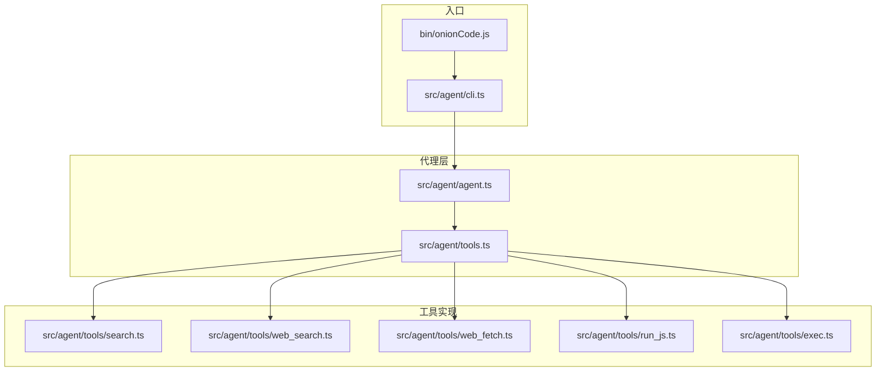
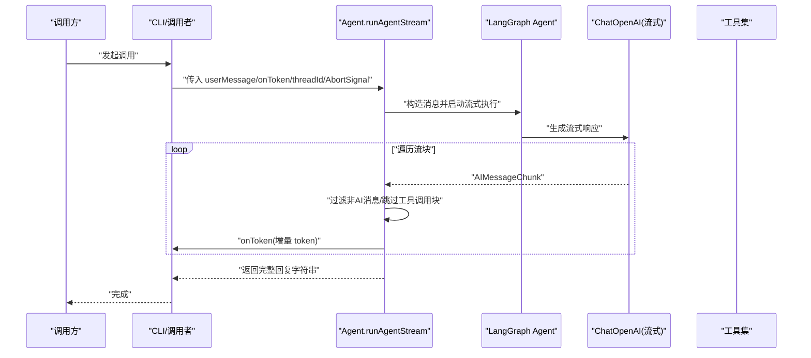
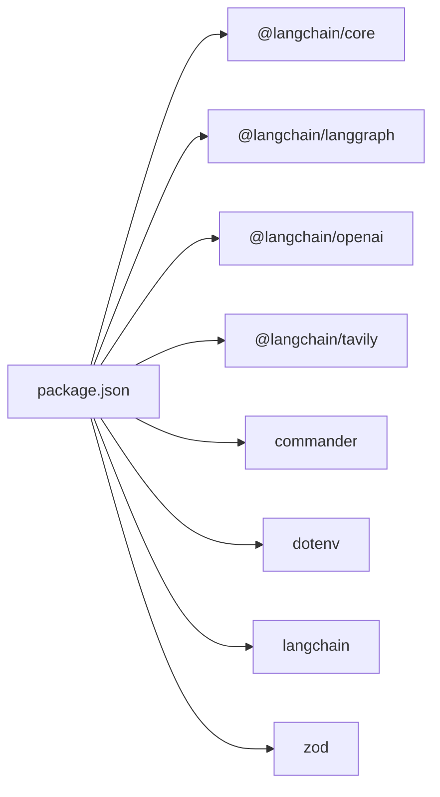

# 代理 API

<cite>
**本文引用的文件列表**
- [agent.ts](file://src/agent/agent.ts)
- [cli.ts](file://src/agent/cli.ts)
- [tools.ts](file://src/agent/tools.ts)
- [search.ts](file://src/agent/tools/search.ts)
- [web_search.ts](file://src/agent/tools/web_search.ts)
- [web_fetch.ts](file://src/agent/tools/web_fetch.ts)
- [run_js.ts](file://src/agent/tools/run_js.ts)
- [exec.ts](file://src/agent/tools/exec.ts)
- [onionCode.js](file://bin/onionCode.js)
- [package.json](file://package.json)
</cite>

## 目录
1. [简介](#简介)
2. [项目结构](#项目结构)
3. [核心组件](#核心组件)
4. [架构总览](#架构总览)
5. [详细组件分析](#详细组件分析)
6. [依赖关系分析](#依赖关系分析)
7. [性能考量与优化建议](#性能考量与优化建议)
8. [故障排查指南](#故障排查指南)
9. [结论](#结论)
10. [附录](#附录)

## 简介
本文件面向“代理 API”的使用者与维护者，聚焦于 runAgentStream 函数的完整接口规范、流式响应处理机制、会话管理与内存检查点、AbortSignal 中断机制与错误处理策略，并提供代理配置选项、模型参数设置与系统提示词的使用方法，以及性能优化建议与最佳实践。

## 项目结构
该项目采用分层组织方式：
- 顶层 CLI 入口负责启动交互式聊天与命令行子命令
- 代理层封装 LangChain/LangGraph Agent，集成工具集与内存检查点
- 工具层提供多种工具（搜索、读写文件、执行脚本/命令、网络抓取等）

图表来源
- [onionCode.js:1-3](file://bin/onionCode.js#L1-L3)
- [cli.ts:1-126](file://src/agent/cli.ts#L1-L126)
- [agent.ts:1-98](file://src/agent/agent.ts#L1-L98)
- [tools.ts:1-10](file://src/agent/tools.ts#L1-L10)
- [search.ts:1-24](file://src/agent/tools/search.ts#L1-L24)
- [web_search.ts:1-41](file://src/agent/tools/web_search.ts#L1-L41)
- [web_fetch.ts:1-82](file://src/agent/tools/web_fetch.ts#L1-L82)
- [run_js.ts:1-89](file://src/agent/tools/run_js.ts#L1-L89)
- [exec.ts:1-142](file://src/agent/tools/exec.ts#L1-L142)

章节来源
- [onionCode.js:1-3](file://bin/onionCode.js#L1-L3)
- [cli.ts:1-126](file://src/agent/cli.ts#L1-L126)
- [agent.ts:1-98](file://src/agent/agent.ts#L1-L98)
- [tools.ts:1-10](file://src/agent/tools.ts#L1-L10)

## 核心组件
- 代理实例与内存检查点：通过 LangGraph 的 MemorySaver 实现会话状态持久化，支持多轮对话的历史续接
- 模型配置：基于 ChatOpenAI，启用流式输出，支持自定义 base URL 与模型名称
- 工具集合：包含本地搜索、网络搜索、网页抓取、文件读写、JS/Python 执行、命令执行等
- CLI 交互：提供 ask 子命令与交互式聊天，支持 ESC 中断

章节来源
- [agent.ts:22-51](file://src/agent/agent.ts#L22-L51)
- [cli.ts:40-125](file://src/agent/cli.ts#L40-L125)
- [tools.ts:1-10](file://src/agent/tools.ts#L1-L10)

## 架构总览
下图展示 runAgentStream 的调用链路与关键参与者之间的交互。

图表来源
- [agent.ts:61-97](file://src/agent/agent.ts#L61-L97)
- [cli.ts:94-106](file://src/agent/cli.ts#L94-L106)

## 详细组件分析

### runAgentStream 接口规范
- 函数签名与用途
  - 名称：runAgentStream
  - 作用：以流式方式运行代理，将每个 token 逐个回调给调用方，同时返回完整回复文本
- 参数
  - userMessage: string
    - 类型：字符串
    - 含义：当前用户输入；历史消息由内存检查点自动续接
  - onToken: (token: string) => void
    - 类型：回调函数
    - 含义：每收到一个 token 时调用，用于实时渲染或处理
  - threadId: string = "default-session"
    - 类型：字符串
    - 含义：会话标识符；相同 threadId 会自动续接历史记录
  - signal?: AbortSignal
    - 类型：可选的中止信号
    - 含义：当 signal.aborted 为真时，循环提前退出，实现 ESC 中断
- 返回值
  - Promise<string>
  - 含义：完整 AI 回复文本（拼接所有 token）
- 流式处理要点
  - 使用 agent.stream 并指定 streamMode 为 "messages"
  - 迭代流块时仅处理类型为 AI 的消息，忽略工具调用块
  - 将 content 作为增量 token 传递给 onToken，并累积到 fullResponse
- 中断机制
  - 在每次迭代开始检查 signal?.aborted，若为真则立即 break
  - CLI 侧通过监听 ESC（ASCII 27）触发 AbortController.abort()

章节来源
- [agent.ts:53-97](file://src/agent/agent.ts#L53-L97)
- [cli.ts:81-106](file://src/agent/cli.ts#L81-L106)

### 会话管理与内存检查点
- 内存检查点
  - 使用 MemorySaver 实例保存与恢复会话状态
  - 通过 config 中的 configurable.thread_id 关联不同会话
- 多轮对话
  - 每次调用 runAgentStream 会基于 thread_id 续接历史
  - 不同 threadId 对应不同上下文，互不干扰
- 系统提示词
  - systemPrompt 注入技能描述文本，增强代理能力边界
  - 通过 getSkillText 动态聚合可用技能清单

章节来源
- [agent.ts:22-51](file://src/agent/agent.ts#L22-L51)
- [agent.ts:127-138](file://src/agent/agent.ts#L127-L138)

### AbortSignal 中断机制与错误处理策略
- 中断机制
  - CLI 侧创建 AbortController，并监听标准输入 ESC（ASCII 27）
  - 触发后调用 abort()，随后在 runAgentStream 循环中检测 signal.aborted 并提前退出
- 错误处理
  - CLI 侧统一格式化错误信息，针对常见场景（内容安全、认证失败、配额不足、超时）给出明确提示
  - 工具层对网络请求、命令执行、代码执行等场景进行异常捕获与分类返回
  - 工具层对危险操作进行白名单/黑名单校验，阻断高风险调用

章节来源
- [cli.ts:11-38](file://src/agent/cli.ts#L11-L38)
- [cli.ts:81-106](file://src/agent/cli.ts#L81-L106)
- [web_fetch.ts:55-82](file://src/agent/tools/web_fetch.ts#L55-L82)
- [exec.ts:94-142](file://src/agent/tools/exec.ts#L94-L142)
- [run_js.ts:22-89](file://src/agent/tools/run_js.ts#L22-L89)

### 代理配置选项、模型参数与系统提示词
- 模型配置
  - ChatOpenAI：启用 streaming=true
  - 支持通过环境变量 OPENAI_MODEL 指定模型名，默认 deepseek-v4-flash
  - 支持通过 OPENAI_API_KEY 设置密钥
  - 支持通过 baseURL 指向 DeepSeek API
- 环境变量
  - OPENAI_MODEL：模型名称
  - OPENAI_API_KEY：API 密钥
  - TAVILY_API_KEY：网络搜索所需密钥（可选）
- 系统提示词
  - systemPrompt 注入技能清单文本，帮助代理理解可用能力
  - 技能清单通过 getSkillText 动态发现并拼接

章节来源
- [agent.ts:25-33](file://src/agent/agent.ts#L25-L33)
- [agent.ts:49-49](file://src/agent/agent.ts#L49-L49)
- [agent.ts:127-138](file://src/agent/agent.ts#L127-L138)
- [web_search.ts:5-14](file://src/agent/tools/web_search.ts#L5-L14)

### 工具集概览与使用方法
- 搜索工具
  - search：本地模拟搜索，返回天气信息示例
  - web_search：基于 Tavily 的真实网络搜索，需设置 TAVILY_API_KEY
- 文件与执行工具
  - readFile/writeFile：文件读写
  - run_js：Node.js 代码执行，带安全扫描与超时限制
  - exec：系统命令执行，带危险命令/模式检测与超时限制
- 网络工具
  - web_fetch：HTTP/HTTPS 抓取网页内容，带超时与错误分类

章节来源
- [tools.ts:1-10](file://src/agent/tools.ts#L1-L10)
- [search.ts:1-24](file://src/agent/tools/search.ts#L1-L24)
- [web_search.ts:1-41](file://src/agent/tools/web_search.ts#L1-L41)
- [web_fetch.ts:1-82](file://src/agent/tools/web_fetch.ts#L1-L82)
- [run_js.ts:1-89](file://src/agent/tools/run_js.ts#L1-L89)
- [exec.ts:1-142](file://src/agent/tools/exec.ts#L1-L142)

## 依赖关系分析
- 运行时依赖
  - @langchain/core、@langchain/langgraph、@langchain/openai：代理与流式模型
  - @langchain/tavily：网络搜索
  - commander：CLI 命令解析
  - dotenv：环境变量加载
  - langchain：底层框架
  - zod：Schema 校验
- 开发依赖
  - ts-node、tsx、typescript、vitest：开发与测试

图表来源
- [package.json:20-36](file://package.json#L20-L36)

章节来源
- [package.json:1-38](file://package.json#L1-L38)

## 性能考量与优化建议
- 流式渲染
  - 使用 onToken 实时消费 token，避免一次性等待完整响应，提升感知速度
- 会话复用
  - 通过 threadId 复用历史上下文，减少重复输入与模型负担
- 工具选择
  - 优先使用本地搜索与文件读写，降低网络延迟与外部依赖
  - 网络搜索与网页抓取应设置合理超时，避免长时间阻塞
- 资源限制
  - 代码执行与命令执行设置超时与缓冲区上限，防止资源耗尽
- 模型参数
  - 根据任务复杂度调整模型与 base URL，平衡成本与质量
- 最佳实践
  - 在 CLI 侧统一处理中断与错误，保证用户体验与可观测性
  - 对高风险操作进行严格白/黑名单校验，确保安全

[本节为通用性能建议，无需特定文件引用]

## 故障排查指南
- 常见错误与定位
  - 内容安全拦截：DeepSeek 安全审查触发，提示更换问法或简化查询
  - 认证失败：OPENAI_API_KEY 无效或未配置
  - 配额不足：API 返回 429 或 insufficient_quota
  - 网络超时：ETIMEDOUT 或 timeout
- CLI 错误格式化
  - CLI 提供 formatError，将底层错误映射为用户可理解的信息
- 工具层错误处理
  - 网络请求：DNS 解析失败、连接被拒、连接重置等分类返回
  - 命令执行：超时、stdout/stderr 分离返回
  - 代码执行：空代码、危险操作阻断、Node.js 可用性检查
- 中断与恢复
  - ESC 中断：CLI 监听 ESC 触发 AbortController.abort，runAgentStream 检测 signal.aborted 并提前退出
  - 重新开始：切换 threadId 或清除历史，重新发起对话

章节来源
- [cli.ts:11-38](file://src/agent/cli.ts#L11-L38)
- [cli.ts:81-106](file://src/agent/cli.ts#L81-L106)
- [web_fetch.ts:55-82](file://src/agent/tools/web_fetch.ts#L55-L82)
- [exec.ts:111-132](file://src/agent/tools/exec.ts#L111-L132)
- [run_js.ts:22-89](file://src/agent/tools/run_js.ts#L22-L89)

## 结论
本代理 API 通过 LangGraph 与 LangChain 实现了具备工具调用、记忆与流式输出能力的智能体。runAgentStream 提供简洁而强大的接口，结合 AbortSignal 中断机制与完善的错误处理策略，既满足交互式体验，又兼顾生产环境的稳定性与安全性。通过合理的会话管理、工具选择与性能优化，可在多场景下获得一致且高效的体验。

[本节为总结性内容，无需特定文件引用]

## 附录

### 使用示例（路径指引）
- CLI 单轮问答
  - 示例：onionCode ask "你好"
  - 路径：[cli.ts:40-57](file://src/agent/cli.ts#L40-L57)
- 交互式聊天与 ESC 中断
  - 示例：直接运行 onionCode，输入内容后按 ESC 中断
  - 路径：[cli.ts:66-125](file://src/agent/cli.ts#L66-L125)
- 编程式调用 runAgentStream
  - 示例：传入 userMessage、onToken、threadId、AbortSignal
  - 路径：[agent.ts:61-97](file://src/agent/agent.ts#L61-L97)

### 环境变量与配置
- OPENAI_MODEL：模型名称
- OPENAI_API_KEY：API 密钥
- TAVILY_API_KEY：网络搜索密钥（可选）
- 路径：[agent.ts:25-33](file://src/agent/agent.ts#L25-L33)，[web_search.ts:5-14](file://src/agent/tools/web_search.ts#L5-L14)