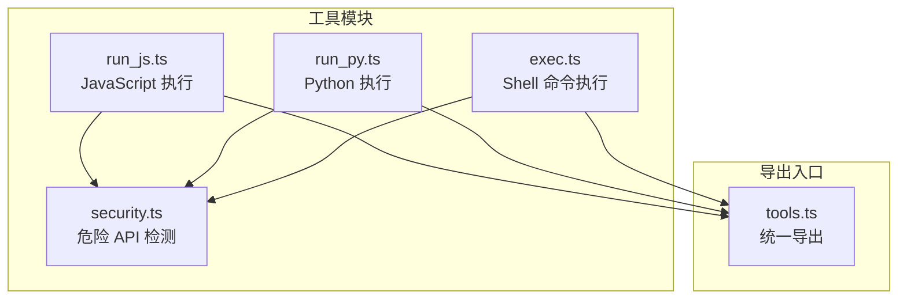
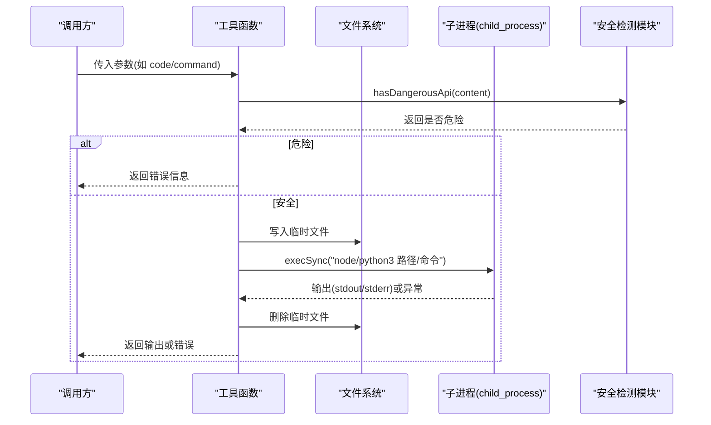
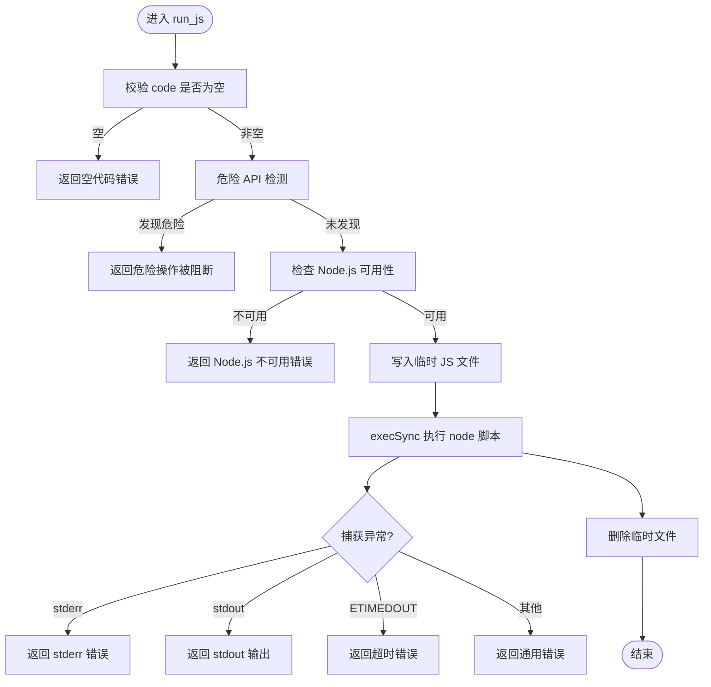
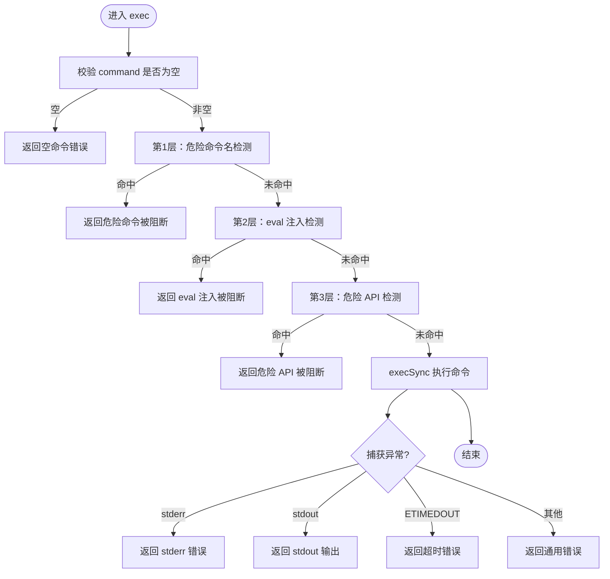
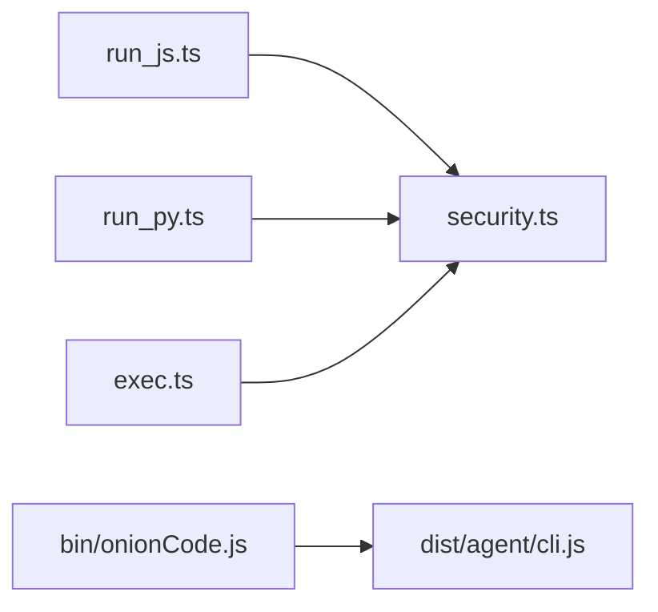

# 代码执行工具

<cite>
**本文档引用的文件**
- [run_js.ts](file://src/agent/tools/run_js.ts)
- [run_py.ts](file://src/agent/tools/run_py.ts)
- [exec.ts](file://src/agent/tools/exec.ts)
- [security.ts](file://src/agent/tools/security.ts)
- [run_js.test.ts](file://src/agent/tools/run_js.test.ts)
- [run_py.test.ts](file://src/agent/tools/run_py.test.ts)
- [exec.test.ts](file://src/agent/tools/exec.test.ts)
- [tools.ts](file://src/agent/tools.ts)
- [package.json](file://package.json)
- [onionCode.js](file://bin/onionCode.js)
</cite>

## 目录
1. [简介](#简介)
2. [项目结构](#项目结构)
3. [核心组件](#核心组件)
4. [架构总览](#架构总览)
5. [详细组件分析](#详细组件分析)
6. [依赖关系分析](#依赖关系分析)
7. [性能考虑](#性能考虑)
8. [故障排除指南](#故障排除指南)
9. [结论](#结论)

## 简介
本文件为代码执行工具的详细 API 文档，重点覆盖以下能力：
- run_js：在 Node.js 环境中执行 JavaScript/TypeScript 代码
- run_py：在 Python 3 环境中执行 Python 代码
- exec：在当前工作目录执行系统 Shell 命令（带多层安全防护）

文档将从接口规范、执行环境、返回值处理、安全沙箱机制、时间与内存限制、错误捕获与结果解析、安全边界与隔离策略、以及审计日志等方面进行系统化说明，并提供 JavaScript 与 Python 的实际执行示例与限制条件。

## 项目结构
该工具集位于 src/agent/tools 目录下，核心文件包括：
- run_js.ts：JavaScript 执行工具
- run_py.ts：Python 执行工具
- exec.ts：Shell 命令执行工具
- security.ts：危险 API 模式检测共享模块
- 对应的单元测试文件用于验证行为
- tools.ts：导出所有工具的统一入口

图表来源
- [run_js.ts:1-90](file://src/agent/tools/run_js.ts#L1-L90)
- [run_py.ts:1-90](file://src/agent/tools/run_py.ts#L1-L90)
- [exec.ts:1-143](file://src/agent/tools/exec.ts#L1-L143)
- [security.ts:1-27](file://src/agent/tools/security.ts#L1-L27)
- [tools.ts:1-10](file://src/agent/tools.ts#L1-L10)

章节来源
- [tools.ts:1-10](file://src/agent/tools.ts#L1-L10)

## 核心组件
- run_js：面向 Node.js 的代码执行工具，支持计算、数据转换、字符串处理等场景；通过临时文件执行规避命令行转义问题；内置危险 API 检测与超时控制。
- run_py：面向 Python 3 的代码执行工具，支持计算、数据转换、字符串处理等场景；通过临时文件执行规避命令行转义问题；内置危险 API 检测与超时控制。
- exec：通用 Shell 命令执行工具，提供三层安全防护（危险命令名黑名单、eval 注入模式、危险 API 调用），并支持超时与缓冲区限制。

章节来源
- [run_js.ts:22-89](file://src/agent/tools/run_js.ts#L22-L89)
- [run_py.ts:22-89](file://src/agent/tools/run_py.ts#L22-L89)
- [exec.ts:94-142](file://src/agent/tools/exec.ts#L94-L142)

## 架构总览
三类工具均基于 Node.js 的 child_process.execSync 同步执行，采用“临时文件 + 执行 + 清理”的流程，结合多层安全策略实现隔离与防护。

图表来源
- [run_js.ts:22-76](file://src/agent/tools/run_js.ts#L22-L76)
- [run_py.ts:22-76](file://src/agent/tools/run_py.ts#L22-L76)
- [exec.ts:94-133](file://src/agent/tools/exec.ts#L94-L133)
- [security.ts:24-26](file://src/agent/tools/security.ts#L24-L26)

## 详细组件分析

### run_js 接口规范
- 工具名称：run_js
- 功能描述：在 Node.js 环境中执行 JavaScript/TypeScript 代码。代码写入临时文件后执行，返回标准输出。危险操作（如 fs.rmSync、child_process、exec、spawn 等）会被阻断。
- 输入参数
  - code: string（必填）。要执行的 JavaScript 代码。使用 console.log() 输出结果。
- 执行环境
  - 依赖 Node.js 可用性检测（通过命令行查询版本），若不可用则直接返回错误。
  - 使用临时文件执行，避免命令行转义问题。
- 时间与内存限制
  - 超时：15 秒
  - 最大输出缓冲：512 KB
- 返回值处理
  - 成功：返回标准输出；若无输出，返回特定提示文本。
  - 失败：根据错误类型返回相应错误信息（语法错误、运行时异常、超时等）。
- 安全机制
  - 危险 API 检测：基于正则匹配危险调用（fs、child_process、exec/spawn 等）。
  - 临时文件清理：无论成功与否，最终都会尝试删除临时文件。
- 审计日志
  - 控制台打印工具调用信息（行数统计等）。

图表来源
- [run_js.ts:22-76](file://src/agent/tools/run_js.ts#L22-L76)

章节来源
- [run_js.ts:22-89](file://src/agent/tools/run_js.ts#L22-L89)
- [run_js.test.ts:1-85](file://src/agent/tools/run_js.test.ts#L1-L85)

### run_py 接口规范
- 工具名称：run_py
- 功能描述：在 Python 3 环境中执行 Python 代码。代码写入临时文件后执行，返回标准输出。危险操作（如 os.remove、subprocess、shutil.rmtree 等）会被阻断。
- 输入参数
  - code: string（必填）。要执行的 Python 代码。使用 print() 输出结果。
- 执行环境
  - 依赖 Python 3 可用性检测（通过命令行查询版本），若不可用则直接返回错误。
  - 使用临时文件执行，避免命令行转义问题。
- 时间与内存限制
  - 超时：15 秒
  - 最大输出缓冲：512 KB
- 返回值处理
  - 成功：返回标准输出；若无输出，返回特定提示文本。
  - 失败：根据错误类型返回相应错误信息（语法错误、运行时异常、超时等）。
- 安全机制
  - 危险 API 检测：基于正则匹配危险调用（os、shutil、subprocess、pathlib 等）。
  - 临时文件清理：无论成功与否，最终都会尝试删除临时文件。
- 审计日志
  - 控制台打印工具调用信息（行数统计等）。

图表来源
- [run_py.ts:22-76](file://src/agent/tools/run_py.ts#L22-L76)

章节来源
- [run_py.ts:22-89](file://src/agent/tools/run_py.ts#L22-L89)
- [run_py.test.ts:1-85](file://src/agent/tools/run_py.test.ts#L1-L85)

### exec 接口规范
- 工具名称：exec
- 功能描述：在当前工作目录执行系统 Shell 命令。对危险命令（如 rm、mv、cp、sudo、chmod、kill 等）、eval 注入（node -e、python -c 等）以及危险 API 调用进行阻断。
- 输入参数
  - command: string（必填）。要执行的 Shell 命令。
- 执行环境
  - 当前工作目录执行，支持管道、重定向等常规 Shell 特性。
- 时间与内存限制
  - 超时：30 秒
  - 最大输出缓冲：1 MB
- 返回值处理
  - 成功：返回标准输出；若无输出，返回特定提示文本。
  - 失败：根据错误类型返回相应错误信息（命令不存在、语法错误、运行时异常、超时等）。
- 安全机制
  - 第 1 层：危险命令名黑名单（删除、移动、复制、格式化、关机、提权、用户管理、进程管理、链接、危险网络、压缩等）。
  - 第 2 层：eval 注入模式检测（node -e/--eval/-p、python -c、ruby -e、perl -e、php -r、deno eval、bun -e 等）。
  - 第 3 层：危险 API 调用模式检测（复用 shared security.ts）。
- 审计日志
  - 控制台打印工具调用信息（原始命令）。

图表来源
- [exec.ts:94-133](file://src/agent/tools/exec.ts#L94-L133)
- [security.ts:24-26](file://src/agent/tools/security.ts#L24-L26)

章节来源
- [exec.ts:94-142](file://src/agent/tools/exec.ts#L94-L142)
- [exec.test.ts:1-150](file://src/agent/tools/exec.test.ts#L1-L150)

### 安全沙箱与隔离策略
- 危险 API 检测（shared）
  - Node.js：fs 删除/写入/权限/链接、child_process、exec/spawn、require 引用核心模块等。
  - Python：shutil rmtree/move/copy、os remove/unlink/rmdir/system、subprocess run/call/Popen、pathlib unlink/rmdir 等。
- 命令级安全
  - 危险命令名黑名单：覆盖破坏性、系统级、网络与压缩等操作。
  - eval 注入模式：拦截 node -e/--eval/-p、python -c、ruby -e、perl -e、php -r、deno eval、bun -e 等。
- 执行隔离
  - 通过临时文件执行，避免命令行参数注入与转义问题。
  - 严格超时与缓冲区限制，防止长时间占用与内存溢出。
  - 执行后清理临时文件，降低持久化风险。

章节来源
- [security.ts:4-26](file://src/agent/tools/security.ts#L4-L26)
- [exec.ts:6-64](file://src/agent/tools/exec.ts#L6-L64)
- [exec.ts:66-76](file://src/agent/tools/exec.ts#L66-L76)

### 时间超时与内存限制策略
- run_js：超时 15 秒，最大输出缓冲 512 KB
- run_py：超时 15 秒，最大输出缓冲 512 KB
- exec：超时 30 秒，最大输出缓冲 1 MB

章节来源
- [run_js.ts:46-51](file://src/agent/tools/run_js.ts#L46-L51)
- [run_py.ts:46-51](file://src/agent/tools/run_py.ts#L46-L51)
- [exec.ts:112-117](file://src/agent/tools/exec.ts#L112-L117)

### 错误捕获与结果解析
- 统一处理逻辑
  - 若存在 stderr，则优先返回错误信息。
  - 若存在 stdout，则返回输出。
  - 若超时（ETIMEDOUT），返回超时错误。
  - 其他异常，返回通用错误消息。
- 结果解析
  - run_js/run_py：返回标准输出字符串；无输出时返回特定提示。
  - exec：返回命令执行的标准输出；无输出时返回特定提示。

章节来源
- [run_js.ts:55-75](file://src/agent/tools/run_js.ts#L55-L75)
- [run_py.ts:55-75](file://src/agent/tools/run_py.ts#L55-L75)
- [exec.ts:120-132](file://src/agent/tools/exec.ts#L120-L132)

### 审计日志
- run_js：控制台记录工具调用与代码行数统计。
- run_py：控制台记录工具调用与代码行数统计。
- exec：控制台记录原始命令。

章节来源
- [run_js.ts:53-54](file://src/agent/tools/run_js.ts#L53-L54)
- [run_py.ts:53-54](file://src/agent/tools/run_py.ts#L53-L54)
- [exec.ts:118-119](file://src/agent/tools/exec.ts#L118-L119)

## 依赖关系分析
- 工具依赖
  - run_js/run_py：依赖 Node.js/Python 可用性检测、临时文件写入、execSync 执行、危险 API 检测。
  - exec：依赖危险命令名黑名单、eval 注入模式、危险 API 检测、execSync 执行。
- 共享模块
  - security.ts：提供危险 API 模式集合与检测函数，供 run_js/run_py/exec 共享。
- CLI 入口
  - bin/onionCode.js：作为可执行脚本入口，加载构建后的 CLI。

图表来源
- [run_js.ts:1-7](file://src/agent/tools/run_js.ts#L1-L7)
- [run_py.ts:1-7](file://src/agent/tools/run_py.ts#L1-L7)
- [exec.ts:1-4](file://src/agent/tools/exec.ts#L1-L4)
- [security.ts:1-27](file://src/agent/tools/security.ts#L1-L27)
- [onionCode.js:1-3](file://bin/onionCode.js#L1-L3)

章节来源
- [package.json:1-38](file://package.json#L1-L38)
- [onionCode.js:1-3](file://bin/onionCode.js#L1-L3)

## 性能考虑
- 超时与缓冲区限制：三类工具均设置合理超时与输出缓冲上限，避免长时间阻塞与内存膨胀。
- 临时文件策略：通过写入临时文件执行，减少命令行参数处理复杂度，同时便于清理。
- 并发建议：由于工具使用同步执行，建议在上层控制并发数量，避免资源争用。

## 故障排除指南
- Node.js/Python 未安装
  - 现象：返回“不可用”相关错误。
  - 处理：确保系统已安装 Node.js 或 Python 3，并在 PATH 中可用。
- 代码为空或仅空白字符
  - 现象：返回“代码不能为空”错误。
  - 处理：提供有效代码片段。
- 危险 API 被阻断
  - 现象：返回“危险操作被阻断”错误。
  - 处理：移除危险调用（如 fs.rmSync、child_process、shutil.rmtree、os.remove、subprocess 等）。
- eval 注入被阻断
  - 现象：返回“eval 注入被阻断”错误。
  - 处理：避免使用 node -e/--eval/-p、python -c 等注入方式。
- 命令不存在或执行失败
  - 现象：返回“命令不存在”或通用错误。
  - 处理：确认命令拼写与可用性，检查工作目录与权限。
- 超时
  - 现象：返回“执行超时”错误。
  - 处理：优化代码逻辑，减少循环与 IO；必要时拆分任务。
- 无输出
  - 现象：返回“已完成但无输出”提示。
  - 处理：确保使用 console.log/print 输出结果。

章节来源
- [run_js.ts:33-35](file://src/agent/tools/run_js.ts#L33-L35)
- [run_py.ts:33-35](file://src/agent/tools/run_py.ts#L33-L35)
- [exec.ts:100-109](file://src/agent/tools/exec.ts#L100-L109)
- [exec.test.ts:133-144](file://src/agent/tools/exec.test.ts#L133-L144)

## 结论
本工具集提供了安全可控的代码执行能力，分别针对 JavaScript 与 Python 场景，以及通用 Shell 命令执行。通过多层安全防护（危险命令名、eval 注入、危险 API）、严格的超时与缓冲区限制、临时文件执行与清理策略，实现了良好的隔离与审计能力。建议在生产环境中配合上层调度与并发控制，确保稳定与安全。