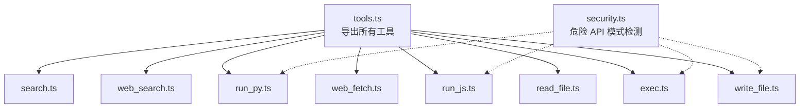
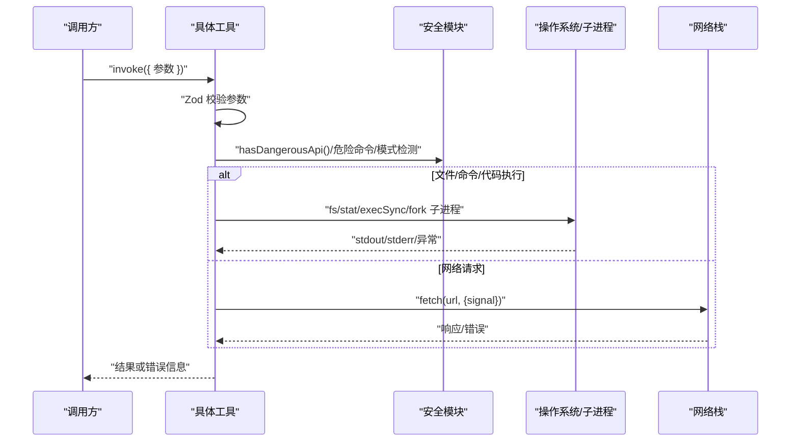
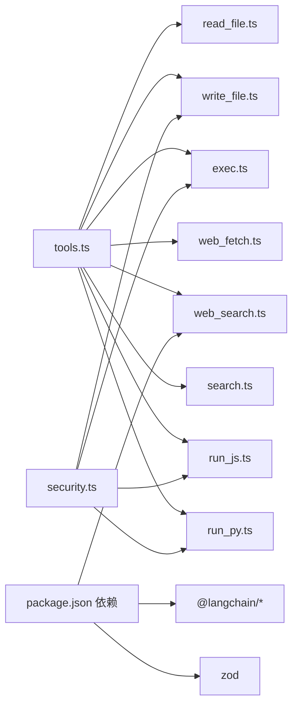

# 工具 API

<cite>
**本文引用的文件**
- [src/agent/tools.ts](file://src/agent/tools.ts)
- [src/agent/tools/read_file.ts](file://src/agent/tools/read_file.ts)
- [src/agent/tools/write_file.ts](file://src/agent/tools/write_file.ts)
- [src/agent/tools/exec.ts](file://src/agent/tools/exec.ts)
- [src/agent/tools/web_fetch.ts](file://src/agent/tools/web_fetch.ts)
- [src/agent/tools/web_search.ts](file://src/agent/tools/web_search.ts)
- [src/agent/tools/search.ts](file://src/agent/tools/search.ts)
- [src/agent/tools/run_js.ts](file://src/agent/tools/run_js.ts)
- [src/agent/tools/run_py.ts](file://src/agent/tools/run_py.ts)
- [src/agent/tools/security.ts](file://src/agent/tools/security.ts)
- [src/agent/tools/read_file.test.ts](file://src/agent/tools/read_file.test.ts)
- [src/agent/tools/web_fetch.test.ts](file://src/agent/tools/web_fetch.test.ts)
- [src/agent/tools/exec.test.ts](file://src/agent/tools/exec.test.ts)
- [src/agent/tools/run_js.test.ts](file://src/agent/tools/run_js.test.ts)
- [src/agent/tools/run_py.test.ts](file://src/agent/tools/run_py.test.ts)
- [src/agent/tools/web_search.test.ts](file://src/agent/tools/web_search.test.ts)
- [package.json](file://package.json)
</cite>

## 目录
1. [简介](#简介)
2. [项目结构](#项目结构)
3. [核心组件](#核心组件)
4. [架构总览](#架构总览)
5. [详细组件分析](#详细组件分析)
6. [依赖关系分析](#依赖关系分析)
7. [性能考量](#性能考量)
8. [故障排查指南](#故障排查指南)
9. [结论](#结论)
10. [附录](#附录)

## 简介
本文件为“工具 API”的综合技术文档，覆盖以下工具族的完整 API 规范与实现要点：
- 文件操作工具：read_file、write_file、exec
- 网络工具：web_fetch、web_search、search
- 代码执行工具：run_js、run_py

文档内容包括：
- 函数签名、参数定义、返回值规范
- 安全机制、错误处理与使用限制
- 参数校验规则与性能考虑
- 工具调用示例与最佳实践
- 工具扩展指南与自定义工具开发方法

## 项目结构
工具模块集中于 src/agent/tools 目录，统一通过 src/agent/tools.ts 汇总导出，便于上层 Agent 使用。

**图示来源**
- [src/agent/tools.ts:1-10](file://src/agent/tools.ts#L1-L10)
- [src/agent/tools/read_file.ts:1-41](file://src/agent/tools/read_file.ts#L1-L41)
- [src/agent/tools/write_file.ts:1-55](file://src/agent/tools/write_file.ts#L1-L55)
- [src/agent/tools/exec.ts:1-143](file://src/agent/tools/exec.ts#L1-L143)
- [src/agent/tools/web_fetch.ts:1-83](file://src/agent/tools/web_fetch.ts#L1-L83)
- [src/agent/tools/web_search.ts:1-41](file://src/agent/tools/web_search.ts#L1-L41)
- [src/agent/tools/search.ts:1-24](file://src/agent/tools/search.ts#L1-L24)
- [src/agent/tools/run_js.ts:1-90](file://src/agent/tools/run_js.ts#L1-L90)
- [src/agent/tools/run_py.ts:1-90](file://src/agent/tools/run_py.ts#L1-L90)
- [src/agent/tools/security.ts:1-27](file://src/agent/tools/security.ts#L1-L27)

**章节来源**
- [src/agent/tools.ts:1-10](file://src/agent/tools.ts#L1-L10)

## 核心组件
本节概述各工具族的职责与通用约束：
- 文件操作工具：在当前工作目录内进行安全读写；禁止路径逃逸与危险 API 调用。
- 网络工具：支持网页抓取与在线搜索；对 URL、响应大小与超时进行严格控制。
- 代码执行工具：在隔离环境中执行 JS/Python 代码；依赖 Node.js/python3 可用性与危险 API 检测。

**章节来源**
- [src/agent/tools/read_file.ts:6-40](file://src/agent/tools/read_file.ts#L6-L40)
- [src/agent/tools/write_file.ts:7-54](file://src/agent/tools/write_file.ts#L7-L54)
- [src/agent/tools/exec.ts:94-142](file://src/agent/tools/exec.ts#L94-L142)
- [src/agent/tools/web_fetch.ts:20-82](file://src/agent/tools/web_fetch.ts#L20-L82)
- [src/agent/tools/web_search.ts:16-40](file://src/agent/tools/web_search.ts#L16-L40)
- [src/agent/tools/search.ts:4-23](file://src/agent/tools/search.ts#L4-L23)
- [src/agent/tools/run_js.ts:22-89](file://src/agent/tools/run_js.ts#L22-L89)
- [src/agent/tools/run_py.ts:22-89](file://src/agent/tools/run_py.ts#L22-L89)

## 架构总览
工具以 LangChain 的 tool 包装器形式暴露，内部通过 Zod schema 做参数校验，并在执行前进行多层安全检查。网络类工具使用 AbortController 控制超时，文件/命令执行工具设置超时与缓冲区上限。

**图示来源**
- [src/agent/tools/read_file.ts:7-32](file://src/agent/tools/read_file.ts#L7-L32)
- [src/agent/tools/write_file.ts:8-42](file://src/agent/tools/write_file.ts#L8-L42)
- [src/agent/tools/exec.ts:94-133](file://src/agent/tools/exec.ts#L94-L133)
- [src/agent/tools/web_fetch.ts:20-73](file://src/agent/tools/web_fetch.ts#L20-L73)
- [src/agent/tools/run_js.ts:22-76](file://src/agent/tools/run_js.ts#L22-L76)
- [src/agent/tools/run_py.ts:22-76](file://src/agent/tools/run_py.ts#L22-L76)
- [src/agent/tools/security.ts:24-26](file://src/agent/tools/security.ts#L24-L26)

## 详细组件分析

### 文件操作工具

#### read_file
- 功能：读取当前目录下的文件内容。
- 参数
  - filename: string（文件名）
- 返回值
  - 成功：文件文本内容
  - 失败：错误字符串（路径越权、目录、不存在等）
- 安全机制
  - 路径解析后与当前工作目录比较，禁止路径逃逸
  - 若目标是目录而非文件，直接拒绝
- 错误处理
  - 文件不存在、读取异常、目录判断失败均返回错误信息
- 性能与限制
  - 同步 stat/读取，建议仅用于小文件
- 使用示例（参考测试）
  - 读取 package.json：[read_file.test.ts:5-8](file://src/agent/tools/read_file.test.ts#L5-L8)
  - 路径逃逸防护：[read_file.test.ts:22-35](file://src/agent/tools/read_file.test.ts#L22-L35)

**章节来源**
- [src/agent/tools/read_file.ts:6-40](file://src/agent/tools/read_file.ts#L6-L40)
- [src/agent/tools/read_file.test.ts:1-47](file://src/agent/tools/read_file.test.ts#L1-L47)

#### write_file
- 功能：在当前目录创建或覆盖文件。
- 参数
  - filename: string（文件名）
  - content: string（写入内容）
- 返回值
  - 成功：成功消息
  - 失败：错误字符串（路径越权、目录、危险内容等）
- 安全机制
  - 路径越权检测
  - 内容危险 API 检测（共享模块）
- 错误处理
  - 文件状态检查、写入异常、危险内容阻断
- 性能与限制
  - UTF-8 写入，建议控制单次写入大小
- 使用示例（参考测试）
  - 写入成功与危险内容阻断：[write_file.test.ts:1-55](file://src/agent/tools/write_file.test.ts#L1-L55)

**章节来源**
- [src/agent/tools/write_file.ts:7-54](file://src/agent/tools/write_file.ts#L7-L54)
- [src/agent/tools/security.ts:24-26](file://src/agent/tools/security.ts#L24-L26)

#### exec
- 功能：在当前目录执行系统命令。
- 参数
  - command: string（待执行命令）
- 返回值
  - 成功：命令输出（stdout）
  - 失败：错误字符串（空命令、超时、危险命令/模式、API 调用等）
- 安全机制
  - 危险命令名黑名单（rm、mv、cp、sudo、chmod、kill、wget、curl 等）
  - Eval 注入模式检测（node -e、python -c 等）
  - 危险 API 模式检测（共享模块）
- 错误处理
  - 空命令、超时（30 秒）、stderr/stdout 分支、未知错误
- 性能与限制
  - 设置超时与最大缓冲区，避免长时间阻塞
- 使用示例（参考测试）
  - 危险命令阻断与 Eval 注入阻断：[exec.test.ts:24-131](file://src/agent/tools/exec.test.ts#L24-L131)

**章节来源**
- [src/agent/tools/exec.ts:94-142](file://src/agent/tools/exec.ts#L94-L142)
- [src/agent/tools/exec.test.ts:1-150](file://src/agent/tools/exec.test.ts#L1-L150)
- [src/agent/tools/security.ts:24-26](file://src/agent/tools/security.ts#L24-L26)

### 网络工具

#### web_fetch
- 功能：按 URL 获取网页/资源内容。
- 参数
  - url: string（URL）
- 返回值
  - 成功：响应文本
  - 失败：错误字符串（空 URL、协议不支持、超时、HTTP 错误、DNS/连接错误、响应过大等）
- 安全机制
  - 仅允许 http/https 协议
  - 超时控制（15 秒），响应大小上限（512KB）
- 错误处理
  - URL 校验、AbortError、DNS/ECONN 等网络错误、HTTP 非 OK
- 性能与限制
  - 超时与大小限制保障稳定性
- 使用示例（参考测试）
  - 正常抓取与错误场景覆盖：[web_fetch.test.ts:1-145](file://src/agent/tools/web_fetch.test.ts#L1-L145)

**章节来源**
- [src/agent/tools/web_fetch.ts:20-82](file://src/agent/tools/web_fetch.ts#L20-L82)
- [src/agent/tools/web_fetch.test.ts:1-145](file://src/agent/tools/web_fetch.test.ts#L1-L145)

#### web_search
- 功能：使用 Tavily 引擎进行网络搜索。
- 参数
  - query: string（搜索关键词）
- 返回值
  - 成功：搜索结果（由 Tavily 返回）
  - 失败：错误字符串（API key 缺失、调用异常）
- 安全机制
  - 无直接网络风险，但需正确配置 API key
- 错误处理
  - 构造函数抛错（API key 缺失）、invoke 异常
- 性能与限制
  - 结果数量与主题可配置（默认最多 3 条）
- 使用示例（参考测试）
  - API key 缺失与正常调用：[web_search.test.ts:1-95](file://src/agent/tools/web_search.test.ts#L1-L95)

**章节来源**
- [src/agent/tools/web_search.ts:16-40](file://src/agent/tools/web_search.ts#L16-L40)
- [src/agent/tools/web_search.test.ts:1-95](file://src/agent/tools/web_search.test.ts#L1-L95)

#### search
- 功能：占位/演示用途的简单搜索工具。
- 参数
  - query: string（查询词）
- 返回值
  - 成功：固定天气描述（含 San Francisco 关键字时返回特定天气）
- 使用示例
  - 包含 sf/san francisco 的查询返回特定天气：[search.ts:8-14](file://src/agent/tools/search.ts#L8-L14)

**章节来源**
- [src/agent/tools/search.ts:4-23](file://src/agent/tools/search.ts#L4-L23)

### 代码执行工具

#### run_js
- 功能：执行 JavaScript/Node.js 代码，返回 stdout 输出。
- 参数
  - code: string（待执行代码）
- 返回值
  - 成功：标准输出
  - 失败：错误字符串（空代码、Node 不可用、超时、危险 API、语法/运行时错误）
- 安全机制
  - 危险 API 检测（共享模块）
  - 依赖 Node.js 可用性
  - 通过临时文件执行，避免命令行转义问题
- 错误处理
  - 空代码、超时（15 秒）、stderr/stdout 分支、清理失败忽略
- 性能与限制
  - 设置超时与缓冲区上限
- 使用示例（参考测试）
  - 正常执行、语法/运行时错误、危险 API 阻断：[run_js.test.ts:1-85](file://src/agent/tools/run_js.test.ts#L1-L85)

**章节来源**
- [src/agent/tools/run_js.ts:22-89](file://src/agent/tools/run_js.ts#L22-L89)
- [src/agent/tools/run_js.test.ts:1-85](file://src/agent/tools/run_js.test.ts#L1-L85)
- [src/agent/tools/security.ts:24-26](file://src/agent/tools/security.ts#L24-L26)

#### run_py
- 功能：执行 Python 代码，返回 stdout 输出。
- 参数
  - code: string（待执行代码）
- 返回值
  - 成功：标准输出
  - 失败：错误字符串（空代码、python3 不可用、超时、危险 API、语法/运行时错误）
- 安全机制
  - 危险 API 检测（共享模块）
  - 依赖 python3 可用性
  - 通过临时文件执行，避免命令行转义问题
- 错误处理
  - 空代码、超时（15 秒）、stderr/stdout 分支、清理失败忽略
- 性能与限制
  - 设置超时与缓冲区上限
- 使用示例（参考测试）
  - 正常执行、语法/运行时错误、危险 API 阻断：[run_py.test.ts:1-85](file://src/agent/tools/run_py.test.ts#L1-L85)

**章节来源**
- [src/agent/tools/run_py.ts:22-89](file://src/agent/tools/run_py.ts#L22-L89)
- [src/agent/tools/run_py.test.ts:1-85](file://src/agent/tools/run_py.test.ts#L1-L85)
- [src/agent/tools/security.ts:24-26](file://src/agent/tools/security.ts#L24-L26)

### 安全机制与危险 API 检测
- 危险 API 模式集合（正则）涵盖：
  - Node.js fs 模块（删除/写入/权限/链接）、child_process、exec/spawn、require 引入
  - Python 模块（shutil/os/subprocess/pathlib）等高危调用
- 检测函数 hasDangerousApi(content) 返回布尔值，用于阻断危险内容
- 适用范围：write_file、exec、run_js、run_py

**章节来源**
- [src/agent/tools/security.ts:4-26](file://src/agent/tools/security.ts#L4-L26)

## 依赖关系分析
- 工具统一导出入口：tools.ts
- 外部依赖：LangChain 工具包装器、Zod 参数校验、@langchain/tavily（web_search）
- Node/Python 可执行环境：exec、run_js、run_py 依赖系统命令

**图示来源**
- [src/agent/tools.ts:1-10](file://src/agent/tools.ts#L1-L10)
- [src/agent/tools/security.ts:1-27](file://src/agent/tools/security.ts#L1-L27)
- [package.json:20-36](file://package.json#L20-L36)

**章节来源**
- [src/agent/tools.ts:1-10](file://src/agent/tools.ts#L1-L10)
- [package.json:20-36](file://package.json#L20-L36)

## 性能考量
- 超时控制
  - exec：30 秒
  - run_js/run_py：15 秒
  - web_fetch：15 秒
- 缓冲区限制
  - exec：1MB
  - run_js/run_py：512KB
- 响应大小限制
  - web_fetch：512KB
- I/O 与并发
  - read_file/write_file 为同步操作，建议小文件使用
  - web_fetch 采用 AbortController 控制请求生命周期
- 资源清理
  - run_js/run_py 在 finally 中清理临时文件，忽略清理失败

**章节来源**
- [src/agent/tools/exec.ts:112-117](file://src/agent/tools/exec.ts#L112-L117)
- [src/agent/tools/run_js.ts:46-51](file://src/agent/tools/run_js.ts#L46-L51)
- [src/agent/tools/run_py.ts:46-51](file://src/agent/tools/run_py.ts#L46-L51)
- [src/agent/tools/web_fetch.ts:4-5](file://src/agent/tools/web_fetch.ts#L4-L5)
- [src/agent/tools/run_js.ts:67-74](file://src/agent/tools/run_js.ts#L67-L74)
- [src/agent/tools/run_py.ts:67-74](file://src/agent/tools/run_py.ts#L67-L74)

## 故障排查指南
- 参数校验失败
  - 症状：调用时报错或被拒绝
  - 排查：确认必填字段存在且类型匹配（Zod schema）
  - 参考：各工具 schema 定义
- 路径越权/目录错误（read_file/write_file）
  - 症状：提示无法读取/写入越权路径或目标是目录
  - 排查：避免使用 ..、/ 绝对路径；确认目标为文件
  - 参考：路径解析与相对路径检查逻辑
- 危险内容阻断（write_file/exec/run_js/run_py）
  - 症状：返回“危险操作被阻断”
  - 排查：移除危险 API 调用（fs.rmSync、child_process、shutil.rmtree 等）
  - 参考：危险 API 模式集合与检测函数
- 命令/代码为空（exec/run_js/run_py）
  - 症状：返回“命令/代码不能为空”
  - 排查：确保传入有效内容
- 超时（exec/run_js/run_py/web_fetch）
  - 症状：返回“超时”或无输出
  - 排查：缩短复杂任务、拆分步骤、检查网络连通性
- Node.js/python3 不可用（run_js/run_py）
  - 症状：返回“未安装或不在 PATH”
  - 排查：安装对应运行时并加入 PATH
- 网络错误（web_fetch）
  - 症状：DNS 失败、连接被拒、连接重置、HTTP 非 OK
  - 排查：检查 URL 协议（仅 http/https）、网络连通性、服务端可达性
- Tavily API（web_search）
  - 症状：提示缺少 API key 或调用异常
  - 排查：设置 TAVILY_API_KEY 环境变量并确保网络可用

**章节来源**
- [src/agent/tools/read_file.ts:17-31](file://src/agent/tools/read_file.ts#L17-L31)
- [src/agent/tools/write_file.ts:18-41](file://src/agent/tools/write_file.ts#L18-L41)
- [src/agent/tools/exec.ts:96-132](file://src/agent/tools/exec.ts#L96-L132)
- [src/agent/tools/run_js.ts:24-75](file://src/agent/tools/run_js.ts#L24-L75)
- [src/agent/tools/run_py.ts:24-75](file://src/agent/tools/run_py.ts#L24-L75)
- [src/agent/tools/web_fetch.ts:22-72](file://src/agent/tools/web_fetch.ts#L22-L72)
- [src/agent/tools/web_search.ts:21-30](file://src/agent/tools/web_search.ts#L21-L30)
- [src/agent/tools/security.ts:24-26](file://src/agent/tools/security.ts#L24-L26)

## 结论
本工具集在保证功能完备的同时，通过多层安全策略（路径越权、危险命令/模式、危险 API 检测、超时与缓冲限制）有效降低了风险。建议在生产使用中：
- 明确最小权限原则，避免危险命令与 API
- 对外部输入进行严格校验与限流
- 合理设置超时与缓冲上限，防止资源耗尽
- 为网络类工具准备备用方案与降级策略

## 附录

### API 规范汇总表
- read_file
  - 参数：filename: string
  - 返回：string（文本或错误）
  - 安全：路径越权检测、目录拒绝
- write_file
  - 参数：filename: string, content: string
  - 返回：string（成功消息或错误）
  - 安全：路径越权检测、危险内容阻断
- exec
  - 参数：command: string
  - 返回：string（输出或错误）
  - 安全：危险命令黑名单、Eval 注入检测、危险 API 检测
- web_fetch
  - 参数：url: string
  - 返回：string（内容或错误）
  - 安全：仅 http/https、超时与大小限制
- web_search
  - 参数：query: string
  - 返回：string（搜索结果或错误）
  - 安全：API key 校验
- search
  - 参数：query: string
  - 返回：string（天气描述或通用结果）
- run_js
  - 参数：code: string
  - 返回：string（输出或错误）
  - 安全：危险 API 检测、Node 可用性、临时文件执行
- run_py
  - 参数：code: string
  - 返回：string（输出或错误）
  - 安全：危险 API 检测、python3 可用性、临时文件执行

**章节来源**
- [src/agent/tools/read_file.ts:36-38](file://src/agent/tools/read_file.ts#L36-L38)
- [src/agent/tools/write_file.ts:47-52](file://src/agent/tools/write_file.ts#L47-L52)
- [src/agent/tools/exec.ts:138-140](file://src/agent/tools/exec.ts#L138-L140)
- [src/agent/tools/web_fetch.ts:78-80](file://src/agent/tools/web_fetch.ts#L78-L80)
- [src/agent/tools/web_search.ts:36-38](file://src/agent/tools/web_search.ts#L36-L38)
- [src/agent/tools/search.ts:19-21](file://src/agent/tools/search.ts#L19-L21)
- [src/agent/tools/run_js.ts:81-87](file://src/agent/tools/run_js.ts#L81-L87)
- [src/agent/tools/run_py.ts:81-87](file://src/agent/tools/run_py.ts#L81-L87)

### 工具调用示例（路径指引）
- 读取文件：[read_file.test.ts:5-8](file://src/agent/tools/read_file.test.ts#L5-L8)
- 写入文件（含危险内容阻断）：[write_file.test.ts:1-55](file://src/agent/tools/write_file.test.ts#L1-L55)
- 执行系统命令（含危险命令阻断）：[exec.test.ts:24-57](file://src/agent/tools/exec.test.ts#L24-L57)
- 抓取网页（含超时/DNS/HTTP 错误）：[web_fetch.test.ts:78-138](file://src/agent/tools/web_fetch.test.ts#L78-L138)
- 搜索（Tavily API key 缺失）：[web_search.test.ts:74-80](file://src/agent/tools/web_search.test.ts#L74-L80)
- 执行 JS 代码（语法/运行时错误与危险 API）：[run_js.test.ts:34-68](file://src/agent/tools/run_js.test.ts#L34-L68)
- 执行 Python 代码（语法/运行时错误与危险 API）：[run_py.test.ts:34-68](file://src/agent/tools/run_py.test.ts#L34-L68)

### 参数验证规则
- 必填字段：各工具 schema 明确要求
- 类型约束：Zod 校验
- 特定校验：
  - read_file：禁止路径逃逸、禁止目录
  - write_file：禁止路径逃逸、禁止目录、禁止危险内容
  - exec：禁止空命令、危险命令、Eval 注入、危险 API
  - web_fetch：禁止空 URL、仅 http/https、超时与大小限制
  - run_js/run_py：禁止空代码、危险 API、依赖运行时可用

**章节来源**
- [src/agent/tools/read_file.ts:36-38](file://src/agent/tools/read_file.ts#L36-L38)
- [src/agent/tools/write_file.ts:47-52](file://src/agent/tools/write_file.ts#L47-L52)
- [src/agent/tools/exec.ts:96-109](file://src/agent/tools/exec.ts#L96-L109)
- [src/agent/tools/web_fetch.ts:22-28](file://src/agent/tools/web_fetch.ts#L22-L28)
- [src/agent/tools/run_js.ts:24-35](file://src/agent/tools/run_js.ts#L24-L35)
- [src/agent/tools/run_py.ts:24-35](file://src/agent/tools/run_py.ts#L24-L35)

### 性能与资源限制
- 超时：exec（30s）、run_js/run_py（15s）、web_fetch（15s）
- 缓冲区：exec（1MB）、run_js/run_py（512KB）
- 响应大小：web_fetch（512KB）
- 临时文件：run_js/run_py 执行后清理

**章节来源**
- [src/agent/tools/exec.ts:112-117](file://src/agent/tools/exec.ts#L112-L117)
- [src/agent/tools/run_js.ts:46-51](file://src/agent/tools/run_js.ts#L46-L51)
- [src/agent/tools/run_py.ts:46-51](file://src/agent/tools/run_py.ts#L46-L51)
- [src/agent/tools/web_fetch.ts:4-5](file://src/agent/tools/web_fetch.ts#L4-L5)
- [src/agent/tools/run_js.ts:67-74](file://src/agent/tools/run_js.ts#L67-L74)
- [src/agent/tools/run_py.ts:67-74](file://src/agent/tools/run_py.ts#L67-L74)

### 工具扩展指南与自定义工具开发方法
- 新增工具步骤
  - 在 src/agent/tools 下创建新文件，使用 tool 包装器与 Zod schema
  - 实现 invoke 函数，完成参数校验、安全检查与业务逻辑
  - 将工具导出至 src/agent/tools.ts
- 安全检查复用
  - 危险 API 检测：导入 hasDangerousApi 并在必要时调用
  - 路径越权：解析绝对路径并与当前工作目录比较
- 错误处理规范
  - 明确区分用户输入错误、系统/网络错误、超时与资源限制
  - 统一返回字符串格式的错误信息，便于上层展示
- 测试建议
  - 覆盖正常流程、边界条件与典型错误场景
  - 对网络类工具使用模拟 fetch 与环境变量控制
- 性能与稳定性
  - 设置超时与缓冲上限
  - 对 I/O 操作进行大小与频率限制
  - 对外部依赖（如 Node.js/python3）进行可用性检查

**章节来源**
- [src/agent/tools.ts:1-10](file://src/agent/tools.ts#L1-L10)
- [src/agent/tools/security.ts:24-26](file://src/agent/tools/security.ts#L24-L26)
- [src/agent/tools/exec.ts:94-142](file://src/agent/tools/exec.ts#L94-L142)
- [src/agent/tools/web_fetch.ts:20-82](file://src/agent/tools/web_fetch.ts#L20-L82)
- [src/agent/tools/run_js.ts:22-89](file://src/agent/tools/run_js.ts#L22-L89)
- [src/agent/tools/run_py.ts:22-89](file://src/agent/tools/run_py.ts#L22-L89)