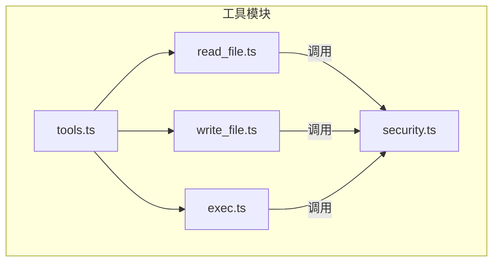
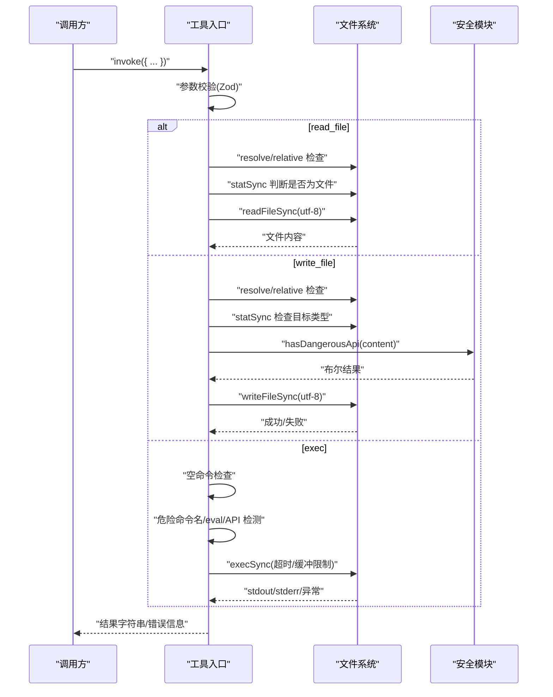
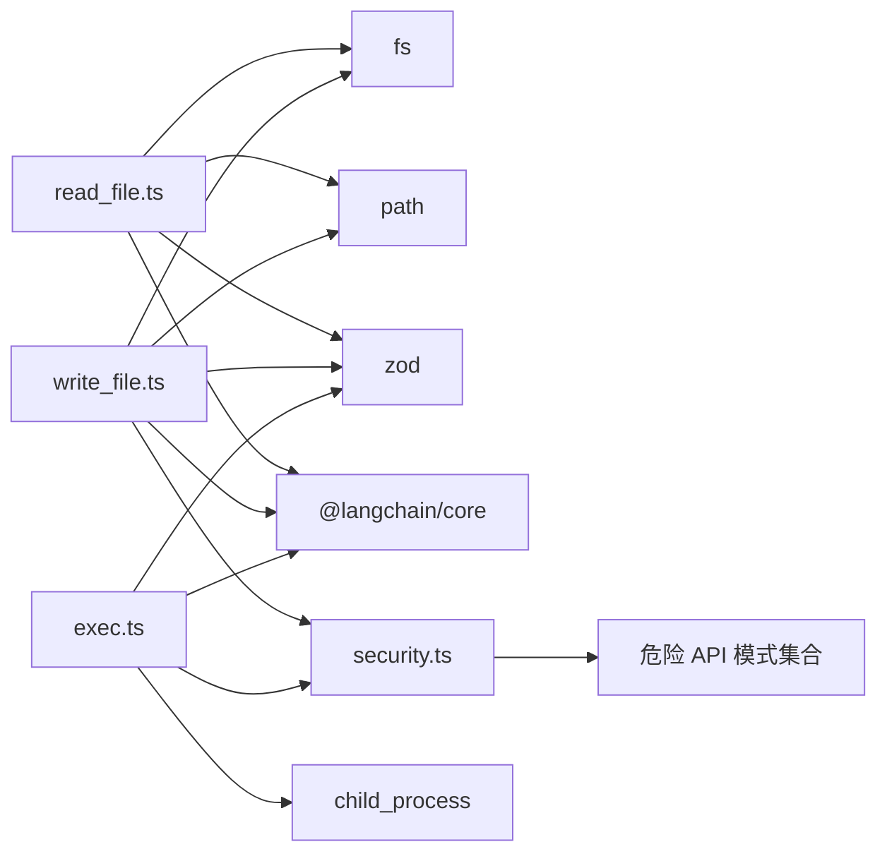

# 文件操作工具

<cite>
**本文引用的文件**
- [read_file.ts](file://src/agent/tools/read_file.ts)
- [write_file.ts](file://src/agent/tools/write_file.ts)
- [exec.ts](file://src/agent/tools/exec.ts)
- [security.ts](file://src/agent/tools/security.ts)
- [tools.ts](file://src/agent/tools.ts)
- [read_file.test.ts](file://src/agent/tools/read_file.test.ts)
- [write_file.test.ts](file://src/agent/tools/write_file.test.ts)
- [exec.test.ts](file://src/agent/tools/exec.test.ts)
- [package.json](file://package.json)
</cite>

## 目录
1. [简介](#简介)
2. [项目结构](#项目结构)
3. [核心组件](#核心组件)
4. [架构总览](#架构总览)
5. [详细组件分析](#详细组件分析)
6. [依赖分析](#依赖分析)
7. [性能考虑](#性能考虑)
8. [故障排查指南](#故障排查指南)
9. [结论](#结论)
10. [附录](#附录)

## 简介
本文件操作工具集提供三类能力：
- 读取文件：在当前工作目录内安全地读取文件内容。
- 写入文件：在当前工作目录内创建或覆盖文件，并对内容进行安全扫描。
- 执行命令：在当前工作目录内执行受限的 shell 命令，具备多层安全防护。

这些工具均基于 LangChain 的工具抽象与 Zod 参数校验，统一返回字符串形式的结果或错误信息；同时内置路径解析与越权保护、危险命令与 API 模式检测、超时与缓冲区限制等安全与性能策略。

## 项目结构
文件操作工具位于 src/agent/tools 目录下，分别实现 read_file、write_file、exec 三个工具，并共享一个安全模块 security.ts。工具通过 tools.ts 汇总导出，供上层 Agent 使用。

图表来源
- [read_file.ts:1-41](file://src/agent/tools/read_file.ts#L1-L41)
- [write_file.ts:1-55](file://src/agent/tools/write_file.ts#L1-L55)
- [exec.ts:1-143](file://src/agent/tools/exec.ts#L1-L143)
- [security.ts:1-27](file://src/agent/tools/security.ts#L1-L27)
- [tools.ts:1-10](file://src/agent/tools.ts#L1-L10)

章节来源
- [tools.ts:1-10](file://src/agent/tools.ts#L1-L10)

## 核心组件
- read_file 工具：读取当前工作目录内的文件内容，严格限制路径不得越权。
- write_file 工具：在当前工作目录内创建/覆盖文件，禁止写入包含危险 API 的内容。
- exec 工具：在当前工作目录内执行 shell 命令，阻断危险命令名、eval 注入与危险 API 调用。

章节来源
- [read_file.ts:6-40](file://src/agent/tools/read_file.ts#L6-L40)
- [write_file.ts:7-54](file://src/agent/tools/write_file.ts#L7-L54)
- [exec.ts:94-142](file://src/agent/tools/exec.ts#L94-L142)

## 架构总览
以下序列图展示了工具的调用流程与安全检查点。

图表来源
- [read_file.ts:7-32](file://src/agent/tools/read_file.ts#L7-L32)
- [write_file.ts:8-42](file://src/agent/tools/write_file.ts#L8-L42)
- [exec.ts:95-133](file://src/agent/tools/exec.ts#L95-L133)
- [security.ts:24-26](file://src/agent/tools/security.ts#L24-L26)

## 详细组件分析

### read_file 工具
- 功能概述
  - 在当前工作目录内读取指定文件内容。
  - 对路径进行解析与相对化检查，防止越权访问。
  - 若目标是目录或文件不存在，返回相应错误信息。
- 函数签名与参数
  - 工具名称："read_file"
  - 参数对象字段：
    - filename: string（文件名）
  - 返回值：string（文件内容或错误信息）
- 路径解析与安全
  - 使用 process.cwd() 作为根目录，通过 path.resolve 与 path.relative 计算并校验相对路径。
  - 若相对路径以 ".." 开头或为绝对路径，则判定越权并返回错误。
- 错误处理
  - 文件不存在：返回“未找到”错误。
  - 目标为目录：返回“不是文件”错误。
  - 其他读取异常：返回通用错误信息。
- 性能与限制
  - 同步读取，适合小文件；大文件可能导致阻塞。
  - 无显式超时设置，建议调用方控制命令级超时。
- 使用示例（来自测试）
  - 读取现有文件：参见 [read_file.test.ts:5-8](file://src/agent/tools/read_file.test.ts#L5-L8)
  - 读取不存在的文件：参见 [read_file.test.ts:10-15](file://src/agent/tools/read_file.test.ts#L10-L15)
  - 读取目录：参见 [read_file.test.ts:17-20](file://src/agent/tools/read_file.test.ts#L17-L20)
  - 路径越权（..）：参见 [read_file.test.ts:22-27](file://src/agent/tools/read_file.test.ts#L22-L27)
  - 空文件名解析为目录：参见 [read_file.test.ts:38-41](file://src/agent/tools/read_file.test.ts#L38-L41)

章节来源
- [read_file.ts:6-40](file://src/agent/tools/read_file.ts#L6-L40)
- [read_file.test.ts:1-47](file://src/agent/tools/read_file.test.ts#L1-L47)

### write_file 工具
- 功能概述
  - 在当前工作目录内创建或覆盖文件。
  - 写入前对内容进行危险 API 模式扫描，阻止潜在破坏性脚本。
  - 对路径进行越权检查。
- 函数签名与参数
  - 工具名称："write_file"
  - 参数对象字段：
    - filename: string（文件名）
    - content: string（要写入的内容）
  - 返回值：string（成功消息或错误信息）
- 路径解析与安全
  - 解析与相对化检查同 read_file，越权则拒绝。
- 内容安全检查
  - 通过 security.hasDangerousApi 对内容进行正则匹配，拦截 Node.js fs、child_process、Python shutil/os/subprocess 等高危 API 调用。
- 错误处理
  - 路径越权：返回“越权”错误。
  - 目标为目录：返回“不是文件”错误。
  - 危险内容：返回“内容包含危险操作”错误。
  - 写入异常：返回通用错误信息。
- 使用示例（来自测试）
  - 创建新文件并验证内容：参见 [write_file.test.ts:19-32](file://src/agent/tools/write_file.test.ts#L19-L32)
  - 覆盖已有文件：参见 [write_file.test.ts:34-55](file://src/agent/tools/write_file.test.ts#L34-L55)
  - 路径越权（..）：参见 [write_file.test.ts:57-75](file://src/agent/tools/write_file.test.ts#L57-L75)
  - 目标为目录：参见 [write_file.test.ts:77-83](file://src/agent/tools/write_file.test.ts#L77-L83)
  - 危险内容（fs.rmSync）：参见 [write_file.test.ts:86-95](file://src/agent/tools/write_file.test.ts#L86-L95)
  - 危险内容（shutil.rmtree）：参见 [write_file.test.ts:97-105](file://src/agent/tools/write_file.test.ts#L97-L105)
  - 危险内容（os.remove）：参见 [write_file.test.ts:107-115](file://src/agent/tools/write_file.test.ts#L107-L115)
  - 危险内容（require("child_process")）：参见 [write_file.test.ts:117-125](file://src/agent/tools/write_file.test.ts#L117-L125)
  - 危险内容（subprocess.run）：参见 [write_file.test.ts:127-135](file://src/agent/tools/write_file.test.ts#L127-L135)
  - 正常内容：参见 [write_file.test.ts:137-143](file://src/agent/tools/write_file.test.ts#L137-L143)

章节来源
- [write_file.ts:7-54](file://src/agent/tools/write_file.ts#L7-L54)
- [security.ts:24-26](file://src/agent/tools/security.ts#L24-L26)
- [write_file.test.ts:1-157](file://src/agent/tools/write_file.test.ts#L1-L157)

### exec 工具
- 功能概述
  - 在当前工作目录内执行 shell 命令，支持输出捕获与错误处理。
  - 三层安全防护：危险命令名黑名单、eval 注入模式、危险 API 调用。
- 函数签名与参数
  - 工具名称："exec"
  - 参数对象字段：
    - command: string（待执行的 shell 命令）
  - 返回值：string（命令输出或错误信息）
- 安全策略
  - 危险命令名黑名单（如 rm、mv、cp、sudo、chmod、kill、wget、curl、gzip 等）。
  - eval 注入模式检测（node -e/--eval/-p、python -c、ruby -e、perl -e、php -r、deno eval、bun -e 等）。
  - 危险 API 调用检测（通过 security.hasDangerousApi）。
- 执行细节
  - 使用同步执行，设置超时时间与最大缓冲区大小，避免长时间运行与内存膨胀。
  - 捕获 stderr/stdout 并在异常时优先返回 stderr。
- 错误处理
  - 空命令：返回“命令不能为空”。
  - 命令越权/危险：返回“命令包含危险操作”或“eval 注入被阻止”。
  - 超时：返回“命令超时”。
  - 其他异常：返回“错误信息”。
- 使用示例（来自测试）
  - 正常命令（echo/pwd/ls）：参见 [exec.test.ts:7-22](file://src/agent/tools/exec.test.ts#L7-L22)
  - 危险命令（rm/sudo/chmod/mv/cp）：参见 [exec.test.ts:24-57](file://src/agent/tools/exec.test.ts#L24-L57)
  - eval 注入（node -e/--eval/-p/python -c）：参见 [exec.test.ts:60-94](file://src/agent/tools/exec.test.ts#L60-L94)
  - 危险 API（fs.rmSync/shutil.rmtree/require("fs")/child_process）：参见 [exec.test.ts:97-131](file://src/agent/tools/exec.test.ts#L97-L131)
  - 空命令与不存在的命令：参见 [exec.test.ts:134-144](file://src/agent/tools/exec.test.ts#L134-L144)

章节来源
- [exec.ts:94-142](file://src/agent/tools/exec.ts#L94-L142)
- [security.ts:24-26](file://src/agent/tools/security.ts#L24-L26)
- [exec.test.ts:1-150](file://src/agent/tools/exec.test.ts#L1-L150)

## 依赖分析
- 工具依赖
  - read_file：依赖 fs、path、zod、@langchain/core 工具封装。
  - write_file：依赖 fs、path、zod、@langchain/core 工具封装、security 模块。
  - exec：依赖 child_process、zod、@langchain/core 工具封装、security 模块。
- 安全模块
  - security.ts 提供危险 API 模式集合与检测函数，被 read_file 与 exec 共享。
- 导出与聚合
  - tools.ts 将 read_file、write_file、exec 等工具统一导出，便于上层 Agent 使用。

图表来源
- [read_file.ts:1-5](file://src/agent/tools/read_file.ts#L1-L5)
- [write_file.ts:1-5](file://src/agent/tools/write_file.ts#L1-L5)
- [exec.ts:1-4](file://src/agent/tools/exec.ts#L1-L4)
- [security.ts:1-27](file://src/agent/tools/security.ts#L1-L27)
- [tools.ts:1-10](file://src/agent/tools.ts#L1-L10)

章节来源
- [package.json:20-36](file://package.json#L20-L36)
- [tools.ts:1-10](file://src/agent/tools.ts#L1-L10)

## 性能考虑
- 同步 I/O
  - read_file 与 write_file 使用同步文件 API，适合小文件与短生命周期任务；大文件或频繁 I/O 可能导致阻塞。
- 命令执行限制
  - exec 已设置超时与缓冲区上限，避免长时间运行与内存占用过高。
- 建议
  - 对大文件读写建议改用异步流式处理或分块读取。
  - 对高频调用场景可引入缓存与去重策略。
  - 控制命令粒度，避免一次性执行耗时长的命令。

## 故障排查指南
- 路径越权
  - 症状：返回“无法在当前目录外读取/写入文件”。
  - 排查：确认传入的 filename 是否包含 “..” 或绝对路径；确保在正确的工作目录下执行。
  - 参考：[read_file.ts:11-16](file://src/agent/tools/read_file.ts#L11-L16)、[write_file.ts:12-17](file://src/agent/tools/write_file.ts#L12-L17)
- 目标为目录
  - 症状：返回“... 是目录，不是文件”。
  - 排查：确认 filename 指向的是文件而非目录。
  - 参考：[read_file.ts:18-22](file://src/agent/tools/read_file.ts#L18-L22)、[write_file.ts:18-23](file://src/agent/tools/write_file.ts#L18-L23)
- 文件不存在
  - 症状：返回“文件未找到”。
  - 排查：确认文件名拼写与存在性。
  - 参考：[read_file.ts:27-30](file://src/agent/tools/read_file.ts#L27-L30)
- 危险内容被阻止
  - 症状：返回“内容包含危险操作（例如 fs.rmSync, shutil.rmtree）被阻止”。
  - 排查：检查写入内容是否包含危险 API 调用模式。
  - 参考：[security.ts:4-22](file://src/agent/tools/security.ts#L4-L22)、[write_file.ts:30-33](file://src/agent/tools/write_file.ts#L30-L33)
- 危险命令被阻止
  - 症状：返回“命令包含危险操作被阻止”或“eval 注入被阻止”。
  - 排查：检查命令是否命中黑名单、eval 注入模式或危险 API。
  - 参考：[exec.ts:6-64](file://src/agent/tools/exec.ts#L6-L64)、[exec.ts:68-76](file://src/agent/tools/exec.ts#L68-L76)、[security.ts:4-22](file://src/agent/tools/security.ts#L4-L22)
- 命令超时
  - 症状：返回“命令超时”。
  - 排查：缩短命令执行时间或拆分为多个子任务。
  - 参考：[exec.ts:112-117](file://src/agent/tools/exec.ts#L112-L117)、[exec.ts:128-131](file://src/agent/tools/exec.ts#L128-L131)
- 空命令
  - 症状：返回“命令不能为空”。
  - 排查：确保传入非空字符串。
  - 参考：[exec.ts:96-98](file://src/agent/tools/exec.ts#L96-L98)

章节来源
- [read_file.ts:17-31](file://src/agent/tools/read_file.ts#L17-L31)
- [write_file.ts:18-41](file://src/agent/tools/write_file.ts#L18-L41)
- [exec.ts:95-133](file://src/agent/tools/exec.ts#L95-L133)
- [security.ts:24-26](file://src/agent/tools/security.ts#L24-L26)

## 结论
文件操作工具通过严格的路径解析、内容与命令安全扫描以及执行限制，构建了面向 AI Agent 的安全文件系统与命令执行环境。在保证安全性的同时，提供了清晰的错误反馈与可预期的行为，适用于受限场景下的自动化文件读写与命令执行任务。

## 附录

### API 规范汇总
- read_file
  - 名称："read_file"
  - 参数：filename(string)
  - 返回：string（文件内容或错误信息）
  - 安全：路径越权检查、目录/文件类型检查
- write_file
  - 名称："write_file"
  - 参数：filename(string), content(string)
  - 返回：string（成功消息或错误信息）
  - 安全：路径越权检查、目录/文件类型检查、危险 API 内容扫描
- exec
  - 名称："exec"
  - 参数：command(string)
  - 返回：string（命令输出或错误信息）
  - 安全：危险命令名黑名单、eval 注入检测、危险 API 调用检测、超时与缓冲限制

### 路径解析与权限要求
- 当前工作目录：以 process.cwd() 为根目录。
- 路径解析：使用 path.resolve 与 path.relative 计算并校验相对路径。
- 权限要求：仅允许在当前工作目录内读取/写入；禁止绝对路径与父目录访问。
- 安全限制：禁止目录作为目标；禁止危险命令与危险 API。

### 错误处理与异常情况
- 文件系统错误：返回“未找到/不是文件/读取/写入错误”等信息。
- 命令执行错误：返回“命令为空/危险/超时/其他错误”等信息。
- 参数校验失败：由 Zod 抛出异常，调用方需捕获。

### 性能优化建议
- 使用异步 I/O 替代同步 API，减少阻塞。
- 对大文件采用分块读取与流式写入。
- 合理拆分复杂命令，避免超时与高内存占用。
- 引入缓存与去重，降低重复 I/O 与命令执行频率。