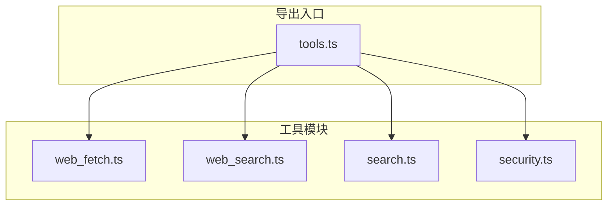
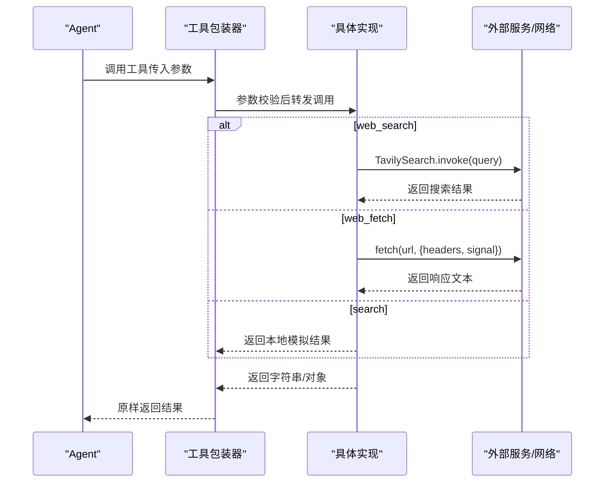
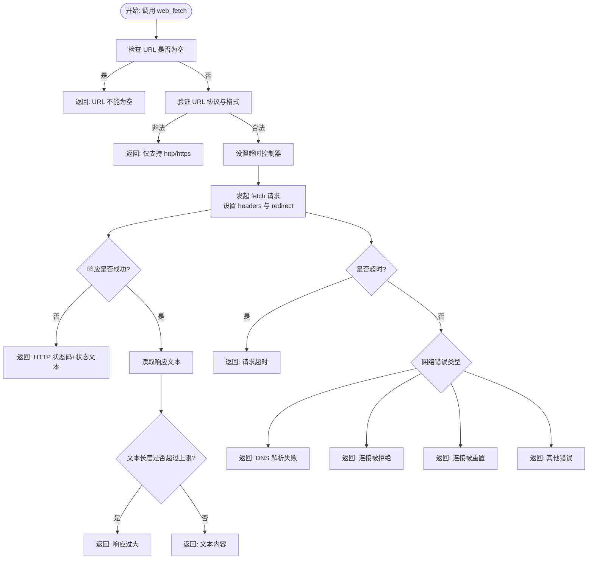
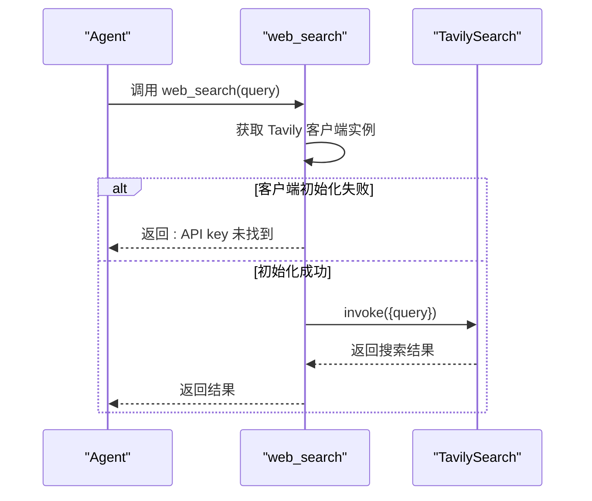
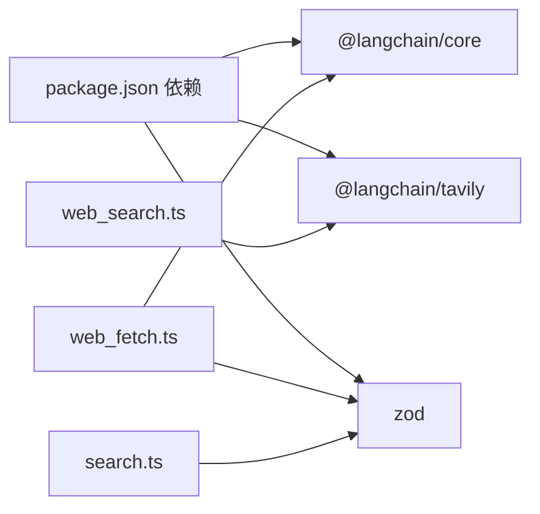

# 网络工具

<cite>
**本文引用的文件**
- [web_fetch.ts](file://src/agent/tools/web_fetch.ts)
- [web_search.ts](file://src/agent/tools/web_search.ts)
- [search.ts](file://src/agent/tools/search.ts)
- [security.ts](file://src/agent/tools/security.ts)
- [tools.ts](file://src/agent/tools.ts)
- [web_fetch.test.ts](file://src/agent/tools/web_fetch.test.ts)
- [web_search.test.ts](file://src/agent/tools/web_search.test.ts)
- [search.test.ts](file://src/agent/tools/search.test.ts)
- [package.json](file://package.json)
</cite>

## 目录
1. [简介](#简介)
2. [项目结构](#项目结构)
3. [核心组件](#核心组件)
4. [架构总览](#架构总览)
5. [详细组件分析](#详细组件分析)
6. [依赖关系分析](#依赖关系分析)
7. [性能与安全考虑](#性能与安全考虑)
8. [故障排查指南](#故障排查指南)
9. [结论](#结论)
10. [附录：使用示例与最佳实践](#附录使用示例与最佳实践)

## 简介
本文件为网络工具的综合 API 文档，覆盖以下三个工具：
- web_fetch：抓取指定 URL 的网页或资源内容，支持超时控制、大小限制与协议校验。
- web_search：通过 Tavily 搜索引擎进行实时网络检索，返回结构化结果。
- search：基于关键词的本地天气模拟工具（用于演示与测试）。

文档将从接口规范、请求参数、响应格式、错误处理、安全机制、超时与重试策略、代理与请求头、缓存与速率限制、隐私保护等方面进行全面说明，并提供可操作的使用示例与排障建议。

## 项目结构
网络工具位于 src/agent/tools 目录下，分别实现独立的功能模块并通过统一导出入口集中管理。

图表来源
- [tools.ts:1-10](file://src/agent/tools.ts#L1-L10)

章节来源
- [tools.ts:1-10](file://src/agent/tools.ts#L1-L10)

## 核心组件
- web_fetch：面向 URL 抓取，内置 URL 合法性检查、超时控制、响应大小限制、HTTP 状态码处理与常见网络错误映射。
- web_search：封装 TavilySearch 客户端，负责环境变量校验与调用，返回搜索结果。
- search：本地天气模拟工具，根据查询是否包含特定关键词返回不同天气描述。

章节来源
- [web_fetch.ts:1-83](file://src/agent/tools/web_fetch.ts#L1-L83)
- [web_search.ts:1-41](file://src/agent/tools/web_search.ts#L1-L41)
- [search.ts:1-24](file://src/agent/tools/search.ts#L1-L24)

## 架构总览
网络工具通过 LangChain 的工具包装器对外暴露，具备参数校验（Zod）、日志输出与错误处理。web_search 依赖外部服务（Tavily），其他两个工具在本地运行。

图表来源
- [web_fetch.ts:20-82](file://src/agent/tools/web_fetch.ts#L20-L82)
- [web_search.ts:16-40](file://src/agent/tools/web_search.ts#L16-L40)
- [search.ts:4-23](file://src/agent/tools/search.ts#L4-L23)

## 详细组件分析

### web_fetch 接口规范
- 工具名称：web_fetch
- 功能：抓取给定 URL 的内容，仅支持 http/https 协议，自动跟随重定向。
- 请求参数
  - url: string（必填；必须为非空且符合 URL 规范）
- 响应格式
  - 成功：返回页面文本内容（字符串）
  - 失败：返回错误信息字符串（包含具体原因）
- 错误处理
  - URL 非法：提示仅支持 http/https
  - 空 URL：提示不能为空
  - HTTP 非 2xx：返回 HTTP 状态码与状态文本
  - 响应过大：超过最大允许大小（约 512KB）时拒绝
  - 超时：默认超时约 15 秒
  - DNS/连接错误：对常见网络错误进行分类并返回可读信息
- 安全与限制
  - 仅允许 http/https 协议
  - 最大响应大小限制
  - 使用 AbortController 控制超时
  - 设置标准 User-Agent
  - 自动跟随重定向
- 性能与可靠性
  - 超时控制：15 秒
  - 响应大小限制：512KB
  - 无重试逻辑（由上层决定是否重试）

图表来源
- [web_fetch.ts:20-82](file://src/agent/tools/web_fetch.ts#L20-L82)

章节来源
- [web_fetch.ts:1-83](file://src/agent/tools/web_fetch.ts#L1-L83)
- [web_fetch.test.ts:1-145](file://src/agent/tools/web_fetch.test.ts#L1-L145)

### web_search 接口规范
- 工具名称：web_search
- 功能：使用 Tavily 搜索引擎进行实时网络检索，返回搜索结果。
- 请求参数
  - query: string（必填；搜索关键词）
- 响应格式
  - 成功：返回搜索结果对象（由 Tavily 客户端定义）
  - 失败：返回错误信息字符串
- 错误处理
  - 环境变量缺失：提示需要设置 TAVILY_API_KEY
  - Tavily 调用异常：捕获并返回可读错误
  - 网络异常：捕获并返回可读错误
- 安全与限制
  - 依赖外部 API 密钥，需妥善保管
  - 结果由第三方提供，不保证时效性
- 性能与可靠性
  - 无显式超时/重试逻辑（由 Tavily SDK 决定）
  - 建议上层根据业务需求添加重试与退避策略

图表来源
- [web_search.ts:16-40](file://src/agent/tools/web_search.ts#L16-L40)

章节来源
- [web_search.ts:1-41](file://src/agent/tools/web_search.ts#L1-L41)
- [web_search.test.ts:1-95](file://src/agent/tools/web_search.test.ts#L1-L95)

### search 接口规范
- 工具名称：search
- 功能：本地天气模拟工具，根据查询是否包含“sf”或“san francisco”返回不同的天气描述。
- 请求参数
  - query: string（必填；搜索关键词）
- 响应格式
  - 字符串：天气描述
- 错误处理
  - 无复杂错误处理，直接返回固定字符串
- 安全与限制
  - 本地模拟，无外部依赖
- 性能与可靠性
  - 无网络开销，响应极快

章节来源
- [search.ts:1-24](file://src/agent/tools/search.ts#L1-L24)
- [search.test.ts:1-34](file://src/agent/tools/search.test.ts#L1-L34)

## 依赖关系分析
- web_search 依赖 @langchain/tavily，需要 TAVILY_API_KEY 环境变量。
- web_fetch 依赖浏览器/Node fetch（含 AbortController），无需额外密钥。
- search 为纯本地逻辑，无外部依赖。
- tools.ts 统一导出各工具，便于上层按需引入。

图表来源
- [package.json:20-36](file://package.json#L20-L36)
- [web_search.ts:1-41](file://src/agent/tools/web_search.ts#L1-L41)
- [web_fetch.ts:1-83](file://src/agent/tools/web_fetch.ts#L1-L83)
- [search.ts:1-24](file://src/agent/tools/search.ts#L1-L24)

章节来源
- [package.json:1-38](file://package.json#L1-L38)
- [tools.ts:1-10](file://src/agent/tools.ts#L1-L10)

## 性能与安全考虑
- 超时控制
  - web_fetch 默认超时约 15 秒，避免长时间阻塞。
  - web_search 无显式超时，建议上层自行设置。
- 重试策略
  - 三个工具均未内置重试逻辑，建议在调用侧根据场景添加指数退避重试。
- 响应大小限制
  - web_fetch 对响应大小进行限制（约 512KB），防止内存占用过高。
- 代理与请求头
  - web_fetch 设置了标准 User-Agent，未暴露代理配置选项。
  - 如需代理，请在运行环境中配置系统级代理或使用支持代理的 fetch 实现。
- 缓存策略
  - 未实现缓存逻辑，建议在上层根据 URL 做缓存。
- 速率限制
  - 未内置速率限制，建议结合业务场景在调用侧做限流。
- 隐私保护
  - web_search 会向第三方发送查询，注意敏感信息脱敏。
  - web_fetch 抓取的内容可能包含隐私信息，建议在上层做内容过滤。
- 安全机制
  - web_fetch 仅允许 http/https 协议，避免本地文件等危险协议。
  - security.ts 提供危险 API 模式检测（供其他工具复用），但 web_fetch 不直接使用该模块。

章节来源
- [web_fetch.ts:4-82](file://src/agent/tools/web_fetch.ts#L4-L82)
- [security.ts:1-27](file://src/agent/tools/security.ts#L1-L27)

## 故障排查指南
- web_fetch 常见问题
  - URL 为空：检查调用参数，确保 url 非空。
  - URL 非法：确认使用 http/https，避免 file://、ftp:// 等协议。
  - 超时：适当提高超时时间或在网络状况良好时重试。
  - 响应过大：分页或选择更精确的 URL。
  - DNS/连接错误：检查域名可用性与网络连通性。
- web_search 常见问题
  - API key 未设置：设置 TAVILY_API_KEY 环境变量。
  - 第三方服务异常：检查 Tavily 服务状态与配额。
- search 常见问题
  - 查询包含“sf”或“san francisco”：返回雾天；否则返回晴天。

章节来源
- [web_fetch.test.ts:90-144](file://src/agent/tools/web_fetch.test.ts#L90-L144)
- [web_search.test.ts:74-94](file://src/agent/tools/web_search.test.ts#L74-L94)
- [search.test.ts:4-33](file://src/agent/tools/search.test.ts#L4-L33)

## 结论
本网络工具集提供了基础的网页抓取、实时搜索与本地模拟能力。web_fetch 注重安全性与稳定性，具备严格的 URL 校验、超时与大小限制；web_search 依赖外部 API，适合获取最新网络信息；search 则用于演示与测试。建议在生产环境中结合代理、缓存、重试与限流策略，并对敏感数据与第三方服务调用做好合规与隐私保护。

## 附录：使用示例与最佳实践
- 使用 web_fetch
  - 场景：抓取公开网页内容或 API 响应。
  - 注意：确保 URL 合法、关注超时与大小限制。
  - 参考路径：[web_fetch.ts:20-82](file://src/agent/tools/web_fetch.ts#L20-L82)，[web_fetch.test.ts:16-144](file://src/agent/tools/web_fetch.test.ts#L16-L144)
- 使用 web_search
  - 场景：实时网络检索与新闻资讯。
  - 注意：正确配置 TAVILY_API_KEY，必要时添加重试与退避。
  - 参考路径：[web_search.ts:16-40](file://src/agent/tools/web_search.ts#L16-L40)，[web_search.test.ts:26-94](file://src/agent/tools/web_search.test.ts#L26-L94)
- 使用 search
  - 场景：演示与测试，快速返回天气描述。
  - 参考路径：[search.ts:4-23](file://src/agent/tools/search.ts#L4-L23)，[search.test.ts:5-33](file://src/agent/tools/search.test.ts#L5-L33)