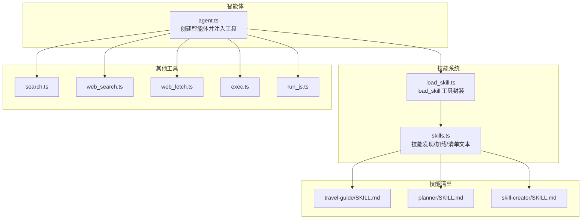
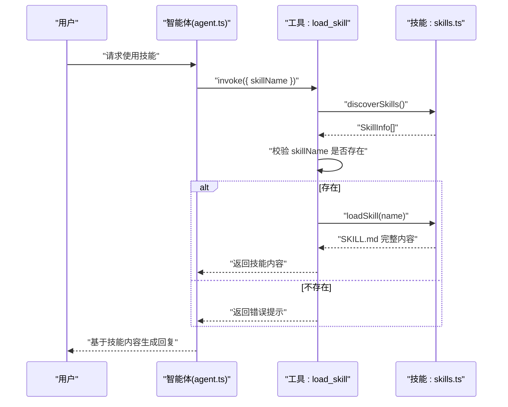
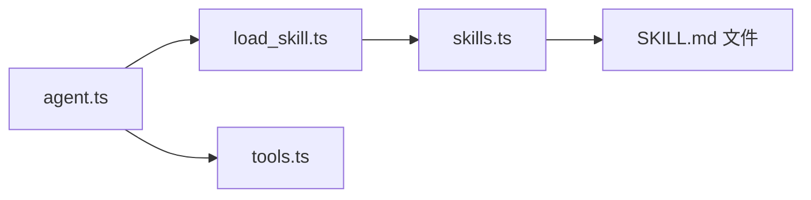

# 技能 API

<cite>
**本文引用的文件**
- [src/agent/skills.ts](file://src/agent/skills.ts)
- [src/agent/tools/load_skill.ts](file://src/agent/tools/load_skill.ts)
- [src/agent/tools.ts](file://src/agent/tools.ts)
- [src/agent/agent.ts](file://src/agent/agent.ts)
- [src/agent/skills/travel-guide/SKILL.md](file://src/agent/skills/travel-guide/SKILL.md)
- [src/agent/skills/planner/SKILL.md](file://src/agent/skills/planner/SKILL.md)
- [src/agent/skills/skill-creator/SKILL.md](file://src/agent/skills/skill-creator/SKILL.md)
- [src/agent/tools/search.ts](file://src/agent/tools/search.ts)
- [src/agent/tools/web_search.ts](file://src/agent/tools/web_search.ts)
- [src/agent/tools/web_fetch.ts](file://src/agent/tools/web_fetch.ts)
- [src/agent/tools/exec.ts](file://src/agent/tools/exec.ts)
- [src/agent/tools/run_js.ts](file://src/agent/tools/run_js.ts)
- [src/agent/tools/load_skill.test.ts](file://src/agent/tools/load_skill.test.ts)
</cite>

## 目录
1. [简介](#简介)
2. [项目结构](#项目结构)
3. [核心组件](#核心组件)
4. [架构总览](#架构总览)
5. [详细组件分析](#详细组件分析)
6. [依赖分析](#依赖分析)
7. [性能考虑](#性能考虑)
8. [故障排查指南](#故障排查指南)
9. [结论](#结论)
10. [附录](#附录)

## 简介
本文件系统化梳理“技能 API”的设计与实现，涵盖技能发现、加载与执行的接口规范；重点解析 loadSkill 函数的参数、返回值与错误处理；说明技能清单管理、技能信息获取与技能执行流程；提供技能开发接口、配置选项与生命周期管理；并给出技能扩展方法、自定义技能开发指南与技能测试策略。

## 项目结构
技能系统围绕“技能清单”和“技能加载工具”展开，核心位于 src/agent/skills.ts 与 src/agent/tools/load_skill.ts，并在 src/agent/agent.ts 中作为工具集成到智能体工作流中。技能内容以 SKILL.md 文件形式组织，位于 src/agent/skills/<技能名>/SKILL.md。

图表来源
- [src/agent/agent.ts:36-51](file://src/agent/agent.ts#L36-L51)
- [src/agent/tools/load_skill.ts:5-33](file://src/agent/tools/load_skill.ts#L5-L33)
- [src/agent/skills.ts:53-138](file://src/agent/skills.ts#L53-L138)
- [src/agent/skills/travel-guide/SKILL.md:1-105](file://src/agent/skills/travel-guide/SKILL.md#L1-L105)
- [src/agent/skills/planner/SKILL.md:1-91](file://src/agent/skills/planner/SKILL.md#L1-L91)
- [src/agent/skills/skill-creator/SKILL.md:1-486](file://src/agent/skills/skill-creator/SKILL.md#L1-L486)

章节来源
- [src/agent/agent.ts:36-51](file://src/agent/agent.ts#L36-L51)
- [src/agent/tools.ts:1-10](file://src/agent/tools.ts#L1-L10)
- [src/agent/skills.ts:53-138](file://src/agent/skills.ts#L53-L138)

## 核心组件
- 技能清单数据模型
  - SkillManifest：name、description
  - SkillInfo：在 SkillManifest 基础上增加 dir（技能目录）
- 技能发现与加载
  - discoverSkills：遍历技能目录，解析每个 SKILL.md 的 YAML frontmatter，返回 SkillInfo[]
  - loadSkill：按 name 查找并返回完整 SKILL.md 文本，未找到返回 null
  - getSkillText：将所有技能 name/description 拼接为系统提示片段，便于模型检索
- 技能加载工具
  - load_skill：LangChain 工具包装器，接收 skillName，先校验是否存在，再调用 loadSkill 返回内容或错误消息

章节来源
- [src/agent/skills.ts:4-11](file://src/agent/skills.ts#L4-L11)
- [src/agent/skills.ts:53-84](file://src/agent/skills.ts#L53-L84)
- [src/agent/skills.ts:91-119](file://src/agent/skills.ts#L91-L119)
- [src/agent/skills.ts:127-138](file://src/agent/skills.ts#L127-L138)
- [src/agent/tools/load_skill.ts:5-33](file://src/agent/tools/load_skill.ts#L5-L33)

## 架构总览
技能 API 的调用链路如下：智能体通过 load_skill 工具请求加载指定技能；工具内部先进行存在性校验，再委托 skills.ts 的 loadSkill 完成实际加载；最终将技能内容返回给智能体，注入到系统提示中参与后续推理。

图表来源
- [src/agent/agent.ts:36-51](file://src/agent/agent.ts#L36-L51)
- [src/agent/tools/load_skill.ts:5-33](file://src/agent/tools/load_skill.ts#L5-L33)
- [src/agent/skills.ts:53-84](file://src/agent/skills.ts#L53-L84)
- [src/agent/skills.ts:91-119](file://src/agent/skills.ts#L91-L119)

## 详细组件分析

### loadSkill 函数详解
- 功能：根据技能名称精确匹配 SKILL.md 的 name 字段，返回该技能的完整内容；若未找到返回 null
- 参数
  - name: string（必填，对应 SKILL.md frontmatter 中的 name）
- 返回值
  - 成功：string（完整 SKILL.md 文本）
  - 失败：null
- 错误处理
  - 目录读取异常：捕获异常并返回 null
  - 文件读取异常：跳过该技能条目，继续遍历
  - 未找到匹配：返回 null
- 性能特征
  - 时间复杂度：O(N)，N 为技能目录下子项数量
  - 空间复杂度：O(M)，M 为命中技能的 SKILL.md 字符长度
- 使用建议
  - 优先在调用前通过 discoverSkills 获取可用技能列表，提升用户体验
  - 对于大体量技能库，可考虑缓存已加载内容或引入索引

章节来源
- [src/agent/skills.ts:91-119](file://src/agent/skills.ts#L91-L119)

### 技能发现与清单文本
- discoverSkills
  - 遍历技能目录，读取每个子目录下的 SKILL.md，解析 YAML frontmatter，组装 SkillInfo[]
  - 异常处理：目录读取失败直接返回空数组；单个技能读取失败跳过该项
- getSkillText
  - 将 discoverSkills 的结果格式化为系统提示片段，便于模型检索与选择
  - 格式：以“可用 Skills”标题开头，逐条列出“技能名：描述”，并在末尾提示如何使用 load_skill 工具

章节来源
- [src/agent/skills.ts:53-84](file://src/agent/skills.ts#L53-L84)
- [src/agent/skills.ts:127-138](file://src/agent/skills.ts#L127-L138)

### load_skill 工具
- 输入
  - skillName: string（必填）
- 行为
  - 先调用 discoverSkills 校验技能是否存在；若不存在，返回包含可用技能列表的错误消息
  - 存在时调用 loadSkill 加载内容；若加载失败，返回通用错误消息
  - 成功时返回 SKILL.md 完整内容
- 错误处理
  - 参数缺失：Zod 校验抛错
  - 技能不存在：返回包含可用技能列表的错误消息
  - 加载失败：返回通用错误消息
- 测试策略
  - 已有单元测试覆盖：加载存在的技能、加载不存在的技能、空名称、缺少字段等边界情况

章节来源
- [src/agent/tools/load_skill.ts:5-33](file://src/agent/tools/load_skill.ts#L5-L33)
- [src/agent/tools/load_skill.test.ts:1-45](file://src/agent/tools/load_skill.test.ts#L1-L45)

### 智能体集成与执行流程
- agent.ts
  - 注入 load_skill 工具与其他工具
  - 通过 getSkillText 生成系统提示，向模型暴露技能清单
  - 提供 runAgentStream 支持流式响应
- 执行流程
  - 用户输入 → 智能体判断是否需要调用技能 → 调用 load_skill 工具 → 返回技能内容 → 智能体结合上下文生成最终回复

章节来源
- [src/agent/agent.ts:36-51](file://src/agent/agent.ts#L36-L51)
- [src/agent/agent.ts:61-97](file://src/agent/agent.ts#L61-L97)

### 技能内容与开发规范
- travel-guide：旅行路书规划与攻略助手，包含角色定位、工作流程、输出格式与注意事项
- planner：任务清单与日程计划助手，强调可执行性、分组与优先级
- skill-creator：技能创建、评测、优化与打包的全流程指南，含评估脚本、评审器与描述优化流程

章节来源
- [src/agent/skills/travel-guide/SKILL.md:1-105](file://src/agent/skills/travel-guide/SKILL.md#L1-L105)
- [src/agent/skills/planner/SKILL.md:1-91](file://src/agent/skills/planner/SKILL.md#L1-L91)
- [src/agent/skills/skill-creator/SKILL.md:1-486](file://src/agent/skills/skill-creator/SKILL.md#L1-L486)

### 其他工具与安全边界
- search/web_search/web_fetch：搜索与网页抓取工具，具备基础参数校验与错误提示
- exec：命令执行工具，内置三重安全检查（危险命令黑名单、eval 注入模式、危险 API）
- run_js：JavaScript 执行工具，写入临时文件执行，避免命令行转义问题，并进行危险 API 检测

章节来源
- [src/agent/tools/search.ts:4-23](file://src/agent/tools/search.ts#L4-L23)
- [src/agent/tools/web_search.ts:16-40](file://src/agent/tools/web_search.ts#L16-L40)
- [src/agent/tools/web_fetch.ts:20-82](file://src/agent/tools/web_fetch.ts#L20-L82)
- [src/agent/tools/exec.ts:94-142](file://src/agent/tools/exec.ts#L94-L142)
- [src/agent/tools/run_js.ts:22-89](file://src/agent/tools/run_js.ts#L22-L89)

## 依赖分析
- 组件耦合
  - load_skill 工具依赖 skills.ts 的 discoverSkills 与 loadSkill
  - agent.ts 依赖 tools.ts 导出的工具集合，其中包含 load_skill
- 外部依赖
  - LangChain 工具装饰器与 Zod 参数校验
  - Node.js 文件系统与进程执行能力
- 潜在循环依赖
  - 当前结构为单向依赖（工具 → 技能模块 → 技能文件），无循环依赖风险

图表来源
- [src/agent/tools/load_skill.ts:3](file://src/agent/tools/load_skill.ts#L3)
- [src/agent/skills.ts:1-3](file://src/agent/skills.ts#L1-L3)
- [src/agent/agent.ts:14](file://src/agent/agent.ts#L14)
- [src/agent/tools.ts:9](file://src/agent/tools.ts#L9)

章节来源
- [src/agent/tools/load_skill.ts:3](file://src/agent/tools/load_skill.ts#L3)
- [src/agent/skills.ts:1-3](file://src/agent/skills.ts#L1-L3)
- [src/agent/agent.ts:14](file://src/agent/agent.ts#L14)
- [src/agent/tools.ts:9](file://src/agent/tools.ts#L9)

## 性能考虑
- 发现与加载
  - discoverSkills 与 loadSkill 均为线性扫描，适合中小规模技能库
  - 建议对频繁访问的技能内容进行内存缓存，减少重复读取
- I/O 与异常
  - 目录读取与文件读取异常被吞并并返回空结果，确保稳定性但可能掩盖问题
  - 建议在生产环境增加日志记录与告警
- 工具链路
  - load_skill 工具在调用前进行一次 discoverSkills 校验，避免无效请求
  - 建议在前端或调用侧缓存 discoverSkills 结果，降低重复查询成本

[本节为通用性能讨论，不直接分析特定文件]

## 故障排查指南
- load_skill 工具报错
  - 技能不存在：返回包含可用技能列表的错误消息
  - 加载失败：返回通用错误消息
  - 参数缺失：Zod 校验抛错
- discoverSkills 返回空列表
  - 检查技能目录是否存在且包含有效 SKILL.md
  - 确认文件权限与编码（UTF-8）
- loadSkill 返回 null
  - 确认 SKILL.md frontmatter 中 name 字段与请求一致
  - 检查文件是否存在且可读
- 单元测试参考
  - 已覆盖加载存在技能、加载不存在技能、空名称、缺少字段等场景

章节来源
- [src/agent/tools/load_skill.ts:5-33](file://src/agent/tools/load_skill.ts#L5-L33)
- [src/agent/tools/load_skill.test.ts:1-45](file://src/agent/tools/load_skill.test.ts#L1-L45)

## 结论
技能 API 通过 discoverSkills 与 loadSkill 提供了简洁稳定的技能发现与加载能力，并以 load_skill 工具无缝接入智能体工作流。配合 getSkillText 将技能清单注入系统提示，使模型能够按需激活技能。建议在生产环境中增加缓存、日志与告警，完善异常处理与可观测性，以提升稳定性与可维护性。

[本节为总结性内容，不直接分析特定文件]

## 附录

### 接口规范摘要
- discoverSkills
  - 输入：无
  - 输出：SkillInfo[]（包含 name、description、dir）
  - 异常：目录读取失败返回空数组；单个文件读取失败跳过
- loadSkill(name)
  - 输入：name: string
  - 输出：string 或 null
  - 异常：目录读取失败返回 null；文件读取失败返回 null
- getSkillText
  - 输入：无
  - 输出：字符串（技能清单文本片段）
- load_skill 工具
  - 输入：skillName: string
  - 输出：技能内容或错误消息
  - 异常：参数缺失抛错；技能不存在返回可用列表；加载失败返回错误

章节来源
- [src/agent/skills.ts:53-84](file://src/agent/skills.ts#L53-L84)
- [src/agent/skills.ts:91-119](file://src/agent/skills.ts#L91-L119)
- [src/agent/skills.ts:127-138](file://src/agent/skills.ts#L127-L138)
- [src/agent/tools/load_skill.ts:5-33](file://src/agent/tools/load_skill.ts#L5-L33)

### 技能开发接口与配置
- 技能目录结构
  - 必须包含 SKILL.md（frontmatter：name、description；正文：技能说明与流程）
  - 可选：scripts/（可执行脚本）、references/（参考文档）、assets/（资源文件）
- 开发要点
  - frontmatter 描述应明确触发条件与用途，有助于提升触发准确率
  - SKILL.md 控制在合理长度，必要时分层组织与指明后续阅读位置
  - 输出格式与示例应清晰，便于评测与迭代

章节来源
- [src/agent/skills/skill-creator/SKILL.md:71-110](file://src/agent/skills/skill-creator/SKILL.md#L71-L110)
- [src/agent/skills/skill-creator/SKILL.md:141-162](file://src/agent/skills/skill-creator/SKILL.md#L141-L162)

### 技能生命周期管理
- 创建：编写 SKILL.md，补充测试用例与评测脚本
- 评测：并行运行带技能与基线版本，采集指标，生成评审报告
- 优化：根据用户反馈与评测结果改进技能描述与实现
- 打包：导出 .skill 文件以便安装与分发

章节来源
- [src/agent/skills/skill-creator/SKILL.md:45-60](file://src/agent/skills/skill-creator/SKILL.md#L45-L60)
- [src/agent/skills/skill-creator/SKILL.md:163-252](file://src/agent/skills/skill-creator/SKILL.md#L163-L252)
- [src/agent/skills/skill-creator/SKILL.md:325-405](file://src/agent/skills/skill-creator/SKILL.md#L325-L405)

### 技能扩展方法
- 新增技能：在 skills 目录下新建子目录并添加 SKILL.md
- 修改技能：更新 SKILL.md 与相关资源文件
- 评测与对比：使用 skill-creator 提供的脚本与评审器进行量化与定性评估
- 触发优化：利用描述优化流程，生成触发评估集并自动迭代优化

章节来源
- [src/agent/skills/skill-creator/SKILL.md:333-405](file://src/agent/skills/skill-creator/SKILL.md#L333-L405)

### 自定义技能开发指南
- 明确意图与触发条件，编写清晰的 frontmatter
- 设计可验证的输出格式与示例
- 组织资源文件，保持 SKILL.md 简洁可读
- 使用评测脚本与评审器持续迭代

章节来源
- [src/agent/skills/skill-creator/SKILL.md:45-60](file://src/agent/skills/skill-creator/SKILL.md#L45-L60)
- [src/agent/skills/skill-creator/SKILL.md:115-139](file://src/agent/skills/skill-creator/SKILL.md#L115-L139)

### 技能测试策略
- 单元测试：验证 load_skill 工具在存在/不存在技能、空名称、缺少字段等场景的行为
- 集成测试：在 agent.ts 中集成工具后，验证系统提示与技能加载后的对话效果
- 评测套件：使用 skill-creator 的脚本生成评测集，运行带技能与基线版本对比，生成评审报告

章节来源
- [src/agent/tools/load_skill.test.ts:1-45](file://src/agent/tools/load_skill.test.ts#L1-L45)
- [src/agent/skills/skill-creator/SKILL.md:163-252](file://src/agent/skills/skill-creator/SKILL.md#L163-L252)