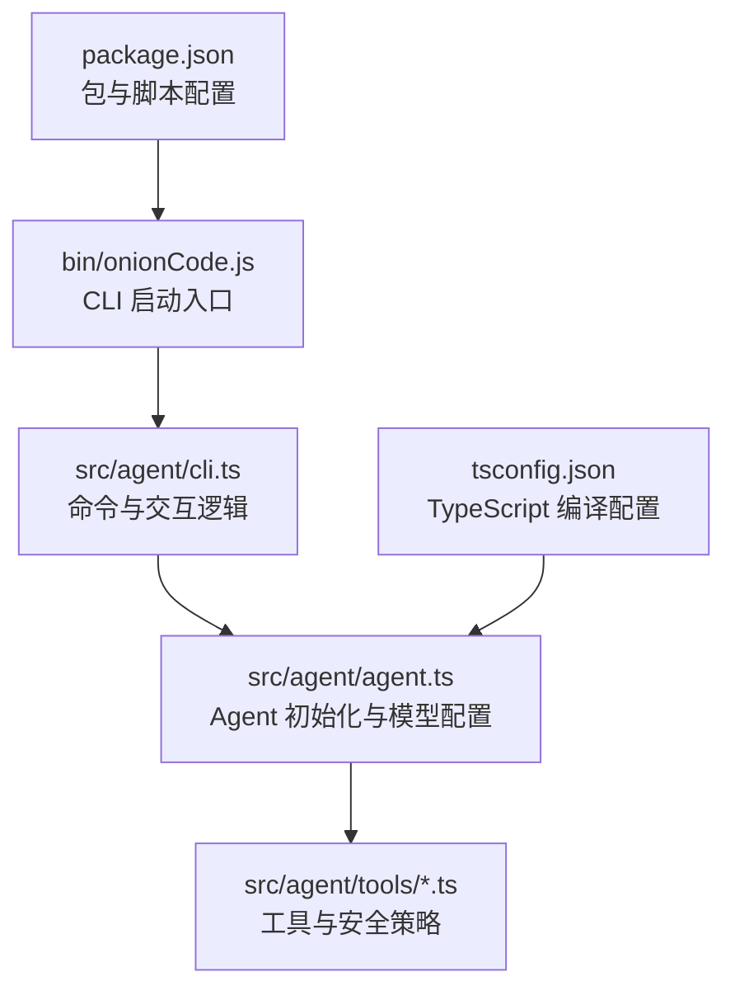
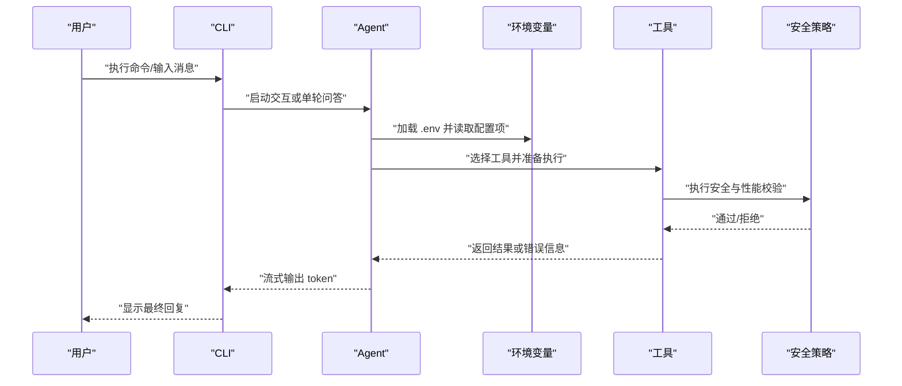
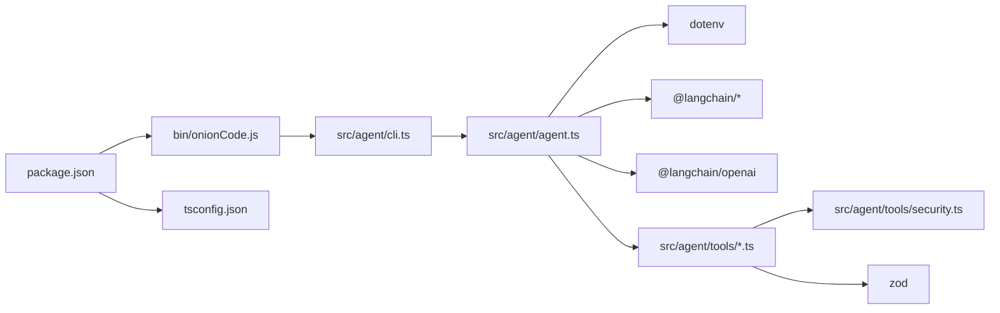

# 配置 API

<cite>
**本文引用的文件**
- [package.json](file://package.json)
- [tsconfig.json](file://tsconfig.json)
- [bin/onionCode.js](file://bin/onionCode.js)
- [src/agent/cli.ts](file://src/agent/cli.ts)
- [src/agent/agent.ts](file://src/agent/agent.ts)
- [src/agent/tools/security.ts](file://src/agent/tools/security.ts)
- [src/agent/tools/exec.ts](file://src/agent/tools/exec.ts)
- [src/agent/tools/write_file.ts](file://src/agent/tools/write_file.ts)
- [src/agent/tools/web_fetch.ts](file://src/agent/tools/web_fetch.ts)
</cite>

## 目录
1. [简介](#简介)
2. [项目结构](#项目结构)
3. [核心组件](#核心组件)
4. [架构总览](#架构总览)
5. [详细组件分析](#详细组件分析)
6. [依赖关系分析](#依赖关系分析)
7. [性能考量](#性能考量)
8. [故障排除指南](#故障排除指南)
9. [结论](#结论)
10. [附录](#附录)

## 简介
本文件系统性梳理本项目的“配置 API”，涵盖以下方面：
- 环境变量配置与加载优先级
- 包配置选项（构建、脚本、类型声明）
- TypeScript 编译配置
- OpenAI/DeepSeek 模型配置与安全策略
- 工具链的安全与性能参数
- 配置验证规则与默认值
- 配置示例、最佳实践与故障排除
- 配置迁移与版本兼容性建议

## 项目结构
本项目采用“命令行入口 + Agent 核心 + 工具集”的分层组织方式。配置相关的关键位置包括：
- CLI 入口负责解析命令与错误格式化
- Agent 初始化负责加载环境变量、创建模型与工具集合
- 工具模块内置安全校验与性能限制
- 构建与类型配置位于包与 TS 配置文件中

图表来源
- [bin/onionCode.js:1-3](file://bin/onionCode.js#L1-L3)
- [src/agent/cli.ts:1-126](file://src/agent/cli.ts#L1-L126)
- [src/agent/agent.ts:1-98](file://src/agent/agent.ts#L1-L98)
- [package.json:1-38](file://package.json#L1-L38)
- [tsconfig.json:1-20](file://tsconfig.json#L1-L20)

章节来源
- [bin/onionCode.js:1-3](file://bin/onionCode.js#L1-L3)
- [src/agent/cli.ts:1-126](file://src/agent/cli.ts#L1-L126)
- [src/agent/agent.ts:1-98](file://src/agent/agent.ts#L1-L98)
- [package.json:1-38](file://package.json#L1-L38)
- [tsconfig.json:1-20](file://tsconfig.json#L1-L20)

## 核心组件
- CLI 入口与命令解析：负责启动交互式聊天、单轮问答以及错误消息格式化
- Agent 初始化：加载 .env，创建内存检查点，初始化模型与工具集合
- 工具与安全：执行命令、写文件、网络抓取等工具均内置安全与性能限制
- 包与编译配置：定义构建产物、类型声明、脚本与 TS 编译选项

章节来源
- [src/agent/cli.ts:1-126](file://src/agent/cli.ts#L1-L126)
- [src/agent/agent.ts:1-98](file://src/agent/agent.ts#L1-L98)
- [src/agent/tools/exec.ts:1-143](file://src/agent/tools/exec.ts#L1-L143)
- [src/agent/tools/write_file.ts:1-55](file://src/agent/tools/write_file.ts#L1-L55)
- [src/agent/tools/web_fetch.ts:1-82](file://src/agent/tools/web_fetch.ts#L1-L82)
- [package.json:1-38](file://package.json#L1-L38)
- [tsconfig.json:1-20](file://tsconfig.json#L1-L20)

## 架构总览
下图展示配置在系统中的作用与流向：CLI 解析命令 → Agent 加载环境变量与工具 → 工具执行前进行安全与性能校验。

图表来源
- [src/agent/cli.ts:1-126](file://src/agent/cli.ts#L1-L126)
- [src/agent/agent.ts:1-98](file://src/agent/agent.ts#L1-L98)
- [src/agent/tools/exec.ts:1-143](file://src/agent/tools/exec.ts#L1-L143)
- [src/agent/tools/write_file.ts:1-55](file://src/agent/tools/write_file.ts#L1-L55)
- [src/agent/tools/web_fetch.ts:1-82](file://src/agent/tools/web_fetch.ts#L1-L82)

## 详细组件分析

### 环境变量与配置加载
- .env 加载位置：Agent 初始化时以项目根目录为基准加载 .env，避免受当前工作目录影响
- 关键配置项：
  - OPENAI_API_KEY：模型访问密钥
  - OPENAI_MODEL：模型名称，默认值为 deepseek-v4-flash
  - baseURL：DeepSeek 接口地址（用于兼容 OpenAI SDK 的 ChatOpenAI）
- CLI 错误映射：针对常见错误（如 401、额度不足、超时、内容安全拦截）提供用户可读提示

章节来源
- [src/agent/agent.ts:19-33](file://src/agent/agent.ts#L19-L33)
- [src/agent/cli.ts:11-38](file://src/agent/cli.ts#L11-L38)

### 包配置选项（package.json）
- 入口与二进制：
  - main/types 指向 dist 输出
  - bin 将可执行文件绑定到 onionCode
- 构建与脚本：
  - build：TypeScript 编译并复制技能资源
  - dev/start/test：开发、运行与测试脚本
- 依赖：
  - @langchain/*：智能体与模型集成
  - commander：命令行解析
  - dotenv：环境变量加载
  - langchain/zod：框架与数据校验

章节来源
- [package.json:1-38](file://package.json#L1-L38)

### TypeScript 配置（tsconfig.json）
- 编译目标与模块：
  - target/module/moduleResolution：ES2022/CommonJS/Node
- 类型与声明：
  - declaration：生成 d.ts
  - types：包含 Node 类型
- 构建范围：
  - include/exclude：仅编译 src，排除测试与 node_modules

章节来源
- [tsconfig.json:1-20](file://tsconfig.json#L1-L20)

### OpenAI/DeepSeek 模型配置
- 模型实例化：通过 ChatOpenAI 创建，支持 OpenAI 兼容接口
- 配置要点：
  - model：默认 deepseek-v4-flash
  - apiKey：来自 OPENAI_API_KEY
  - baseURL：指向 DeepSeek v1 接口
  - streaming：启用流式输出
- 注意事项：
  - 若需切换至其他 OpenAI 兼容服务，可调整 baseURL
  - 模型名称与密钥需与服务端一致

章节来源
- [src/agent/agent.ts:26-33](file://src/agent/agent.ts#L26-L33)

### 安全设置与验证规则
- 危险模式检测（共享模块）：
  - Node.js fs/child_process、Python shutil/os/subprocess/pathlib 等高危 API 模式
- 工具级安全策略：
  - exec：黑名单命令、eval 注入模式、危险 API 模式三重校验；带超时与缓冲区限制
  - write_file：路径逃逸检测、内容危险 API 检测
  - web_fetch：URL 协议白名单、超时与响应大小限制、DNS/连接错误处理

章节来源
- [src/agent/tools/security.ts:1-27](file://src/agent/tools/security.ts#L1-L27)
- [src/agent/tools/exec.ts:6-143](file://src/agent/tools/exec.ts#L6-L143)
- [src/agent/tools/write_file.ts:1-55](file://src/agent/tools/write_file.ts#L1-L55)
- [src/agent/tools/web_fetch.ts:1-82](file://src/agent/tools/web_fetch.ts#L1-L82)

### 性能参数与默认值
- exec 工具：
  - 超时：30 秒
  - 最大缓冲区：1MB
- web_fetch 工具：
  - 超时：15 秒
  - 最大响应：512KB
- Agent 流式输出：
  - streaming: true，按 token 逐步回调

章节来源
- [src/agent/tools/exec.ts:112-117](file://src/agent/tools/exec.ts#L112-L117)
- [src/agent/tools/web_fetch.ts:4-5](file://src/agent/tools/web_fetch.ts#L4-L5)
- [src/agent/agent.ts:32-33](file://src/agent/agent.ts#L32-L33)

### 配置优先级与默认值
- 环境变量优先级：
  - OPENAI_MODEL 未设置时回退为 deepseek-v4-flash
  - OPENAI_API_KEY 必填，否则认证失败
- baseURL 与模型：
  - 显式配置 baseURL 以适配不同供应商
- CLI 行为：
  - 未显式传参时使用默认线程 ID 与流式模式

章节来源
- [src/agent/agent.ts:27-33](file://src/agent/agent.ts#L27-L33)
- [src/agent/cli.ts:66-125](file://src/agent/cli.ts#L66-L125)

### 配置示例与最佳实践
- 示例 .env
  - OPENAI_API_KEY：必填
  - OPENAI_MODEL：可选（默认 deepseek-v4-flash）
  - baseURL：可选（默认 DeepSeek v1）
- 最佳实践
  - 使用独立的 .env 文件并加入 .gitignore
  - 严格限制工具调用范围，避免危险命令与高危 API
  - 对外部网络请求设置合理超时与大小限制
  - 在生产环境启用更严格的日志与审计

章节来源
- [src/agent/agent.ts:19-33](file://src/agent/agent.ts#L19-L33)
- [src/agent/tools/exec.ts:6-143](file://src/agent/tools/exec.ts#L6-L143)
- [src/agent/tools/web_fetch.ts:1-82](file://src/agent/tools/web_fetch.ts#L1-L82)

### 故障排除指南
- 常见错误与定位
  - 401/Incorrect API key：检查 OPENAI_API_KEY 是否正确
  - insufficient_quota/429：检查账户余额与配额
  - ETIMEDOUT/timeout：检查网络与工具超时设置
  - Content Exists Risk：内容安全拦截，调整表述或查询
- 工具侧排查
  - exec：确认命令不在黑名单、未使用 eval 注入、未包含危险 API
  - write_file：确认路径未逃逸、内容不包含危险 API
  - web_fetch：确认 URL 协议为 http/https、未超时或过大

章节来源
- [src/agent/cli.ts:11-38](file://src/agent/cli.ts#L11-L38)
- [src/agent/tools/exec.ts:94-143](file://src/agent/tools/exec.ts#L94-L143)
- [src/agent/tools/write_file.ts:7-55](file://src/agent/tools/write_file.ts#L7-L55)
- [src/agent/tools/web_fetch.ts:20-82](file://src/agent/tools/web_fetch.ts#L20-L82)

### 配置迁移与版本兼容性
- 从 OpenAI 切换至 DeepSeek
  - 设置 baseURL 为 DeepSeek v1
  - 确认模型名称与密钥兼容
- 从旧版本迁移
  - 检查 .env 中新增字段（如 baseURL）是否需要补充
  - 确保依赖版本满足 LangChain 与 OpenAI SDK 要求
- 版本注意
  - ChatOpenAI 与 OpenAI SDK 的兼容性需关注
  - TypeScript 目标与模块需与运行时匹配

章节来源
- [src/agent/agent.ts:29-31](file://src/agent/agent.ts#L29-L31)
- [package.json:20-29](file://package.json#L20-L29)
- [tsconfig.json:2-16](file://tsconfig.json#L2-L16)

## 依赖关系分析
- CLI 依赖 Commander 与 Agent
- Agent 依赖 LangChain/LangGraph、OpenAI SDK、dotenv
- 工具依赖 Zod 进行参数校验，共享安全模块
- 构建与类型由 TypeScript 与包脚本驱动

图表来源
- [package.json:1-38](file://package.json#L1-L38)
- [tsconfig.json:1-20](file://tsconfig.json#L1-L20)
- [bin/onionCode.js:1-3](file://bin/onionCode.js#L1-L3)
- [src/agent/cli.ts:1-126](file://src/agent/cli.ts#L1-L126)
- [src/agent/agent.ts:1-98](file://src/agent/agent.ts#L1-L98)
- [src/agent/tools/security.ts:1-27](file://src/agent/tools/security.ts#L1-L27)

章节来源
- [package.json:1-38](file://package.json#L1-L38)
- [tsconfig.json:1-20](file://tsconfig.json#L1-L20)
- [src/agent/agent.ts:1-98](file://src/agent/agent.ts#L1-L98)
- [src/agent/tools/security.ts:1-27](file://src/agent/tools/security.ts#L1-L27)

## 性能考量
- 流式输出：Agent 启用 streaming，降低首 token 延迟
- 工具超时与缓冲：exec 设置超时与最大缓冲，避免阻塞
- 网络抓取限制：web_fetch 控制超时与响应大小，防止资源滥用
- 内存检查点：MemorySaver 支持多轮对话状态保存

章节来源
- [src/agent/agent.ts:32-33](file://src/agent/agent.ts#L32-L33)
- [src/agent/tools/exec.ts:112-117](file://src/agent/tools/exec.ts#L112-L117)
- [src/agent/tools/web_fetch.ts:4-5](file://src/agent/tools/web_fetch.ts#L4-L5)

## 故障排除指南
- 认证与额度
  - 检查 OPENAI_API_KEY 是否存在且有效
  - 关注 401/429 错误并核对账户余额
- 安全拦截
  - 避免触发内容安全策略，调整提问方式
- 工具调用失败
  - exec：确认不在黑名单、无 eval 注入、无危险 API
  - write_file：确认路径合法、内容安全
  - web_fetch：确认 URL 协议与可达性

章节来源
- [src/agent/cli.ts:11-38](file://src/agent/cli.ts#L11-L38)
- [src/agent/tools/exec.ts:94-143](file://src/agent/tools/exec.ts#L94-L143)
- [src/agent/tools/write_file.ts:7-55](file://src/agent/tools/write_file.ts#L7-L55)
- [src/agent/tools/web_fetch.ts:20-82](file://src/agent/tools/web_fetch.ts#L20-L82)

## 结论
本项目的配置 API 以环境变量为核心，结合 CLI、Agent 与工具的安全与性能策略，形成一套可维护、可扩展且安全可控的运行时配置体系。通过明确的默认值、严格的验证规则与清晰的错误提示，能够帮助用户快速上手并在生产环境中稳定运行。

## 附录
- 配置清单
  - OPENAI_API_KEY：必填
  - OPENAI_MODEL：可选（默认 deepseek-v4-flash）
  - baseURL：可选（默认 DeepSeek v1）
- 建议
  - 将敏感配置放入 .env 并纳入忽略列表
  - 在 CI/CD 中统一注入环境变量
  - 对外部网络与文件操作保持最小权限原则