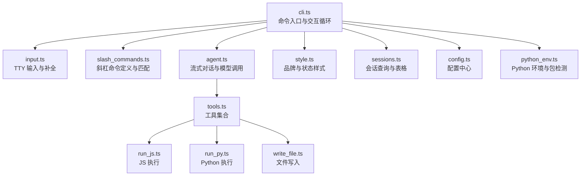
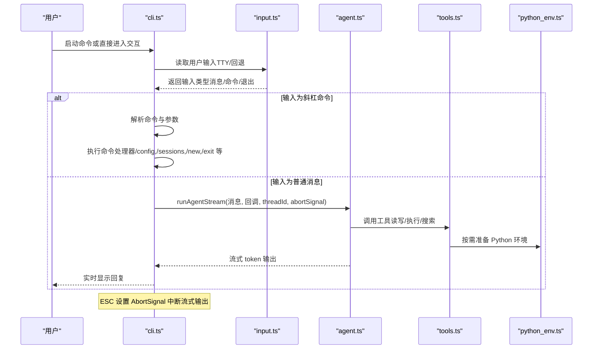
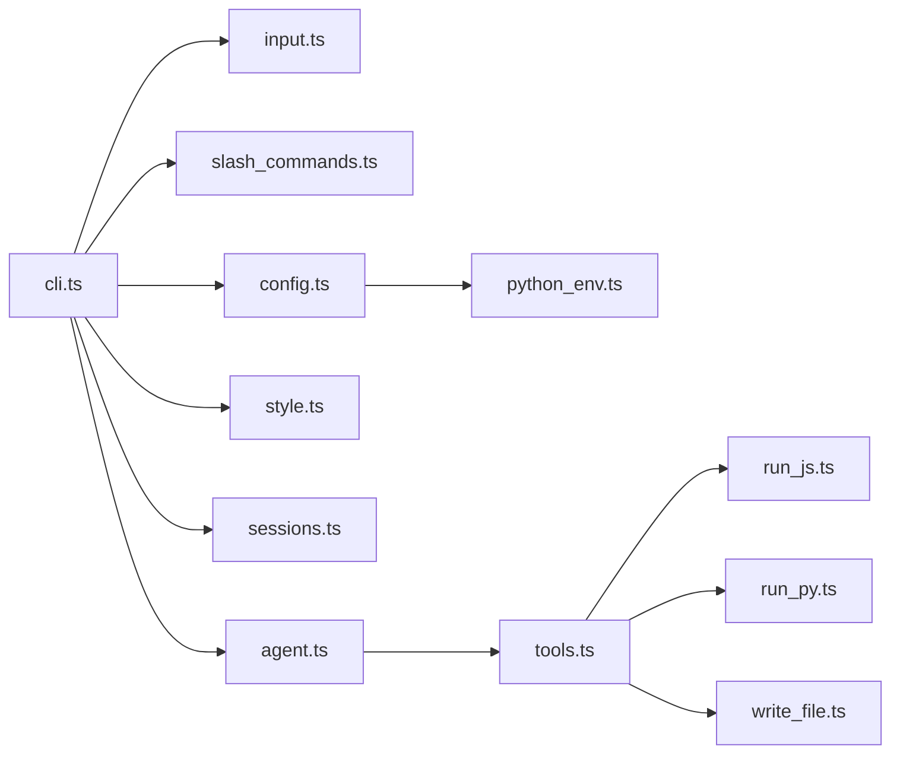

# CLI 界面

<cite>
**本文引用的文件**
- [src/agent/cli.ts](file://src/agent/cli.ts)
- [src/agent/input.ts](file://src/agent/input.ts)
- [src/agent/slash_commands.ts](file://src/agent/slash_commands.ts)
- [src/agent/agent.ts](file://src/agent/agent.ts)
- [src/agent/style.ts](file://src/agent/style.ts)
- [src/agent/sessions.ts](file://src/agent/sessions.ts)
- [src/agent/config.ts](file://src/agent/config.ts)
- [src/agent/python_env.ts](file://src/agent/python_env.ts)
- [src/agent/tools.ts](file://src/agent/tools.ts)
- [src/agent/tools/run_js.ts](file://src/agent/tools/run_js.ts)
- [src/agent/tools/run_py.ts](file://src/agent/tools/run_py.ts)
- [src/agent/tools/write_file.ts](file://src/agent/tools/write_file.ts)
- [package.json](file://package.json)
</cite>

## 目录
1. [简介](#简介)
2. [项目结构](#项目结构)
3. [核心组件](#核心组件)
4. [架构总览](#架构总览)
5. [详细组件分析](#详细组件分析)
6. [依赖关系分析](#依赖关系分析)
7. [性能与体验特性](#性能与体验特性)
8. [故障排查指南](#故障排查指南)
9. [结论](#结论)
10. [附录：使用示例与最佳实践](#附录使用示例与最佳实践)

## 简介
本文件面向使用者与开发者，系统性阐述 CLI 界面的设计与实现，覆盖命令行交互、输入处理、流式响应显示、ESC 中断控制、斜杠命令系统（/config、/skill、/exit 等）、用户输入处理流程（文本输入、文件操作、代码执行）以及实际使用示例与最佳实践。目标是帮助用户高效、安全地使用 CLI 工具完成从日常问答到代码执行与文件管理的任务。

## 项目结构
CLI 子系统围绕“命令解析 → 输入采集 → 流式对话 → 斜杠命令处理 → 会话持久化”展开，主要文件职责如下：
- 入口与命令定义：cli.ts
- 交互式输入与补全：input.ts
- 斜杠命令与上下文：slash_commands.ts
- 对话与流式输出：agent.ts
- 视觉风格与状态提示：style.ts
- 会话查询与表格渲染：sessions.ts
- 配置中心与 Python 环境：config.ts、python_env.ts
- 工具导出与安全策略：tools.ts、tools/run_js.ts、tools/run_py.ts、tools/write_file.ts
- 包与二进制入口：package.json

图表来源
- [src/agent/cli.ts:1-186](file://src/agent/cli.ts#L1-L186)
- [src/agent/input.ts:138-261](file://src/agent/input.ts#L138-L261)
- [src/agent/slash_commands.ts:21-92](file://src/agent/slash_commands.ts#L21-L92)
- [src/agent/agent.ts:102-142](file://src/agent/agent.ts#L102-L142)
- [src/agent/style.ts:54-97](file://src/agent/style.ts#L54-L97)
- [src/agent/sessions.ts:59-178](file://src/agent/sessions.ts#L59-L178)
- [src/agent/config.ts:71-146](file://src/agent/config.ts#L71-L146)
- [src/agent/python_env.ts:161-223](file://src/agent/python_env.ts#L161-L223)
- [src/agent/tools.ts:1-10](file://src/agent/tools.ts#L1-L10)

章节来源
- [src/agent/cli.ts:1-186](file://src/agent/cli.ts#L1-L186)
- [src/agent/input.ts:138-261](file://src/agent/input.ts#L138-L261)
- [src/agent/slash_commands.ts:21-92](file://src/agent/slash_commands.ts#L21-L92)
- [src/agent/agent.ts:102-142](file://src/agent/agent.ts#L102-L142)
- [src/agent/style.ts:54-97](file://src/agent/style.ts#L54-L97)
- [src/agent/sessions.ts:59-178](file://src/agent/sessions.ts#L59-L178)
- [src/agent/config.ts:71-146](file://src/agent/config.ts#L71-L146)
- [src/agent/python_env.ts:161-223](file://src/agent/python_env.ts#L161-L223)
- [src/agent/tools.ts:1-10](file://src/agent/tools.ts#L1-L10)

## 核心组件
- 命令入口与交互循环：负责解析命令、启动交互式聊天、处理 ESC 中断、展示错误与状态。
- 输入采集与补全：在 TTY 模式下提供键盘事件监听、斜杠命令面板、上下键选择、Tab 补全、Ctrl+C 退出等能力。
- 斜杠命令系统：统一的命令注册表与匹配逻辑，支持别名、帮助、会话管理、配置中心等。
- 流式对话引擎：基于 LangGraph 的流式输出，支持中断、历史续接与工具调用。
- 会话与持久化：SQLite 检查点存储，查询最近会话、渲染表格、按 thread_id 恢复。
- 配置中心与 Python 环境：交互式配置 Python 运行环境、镜像源、自动安装策略，并按需初始化虚拟环境与依赖。
- 工具集与安全：文件读写、代码执行（JS/Python）、系统命令、网络检索等；内置安全扫描与危险 API 阻断。

章节来源
- [src/agent/cli.ts:53-186](file://src/agent/cli.ts#L53-L186)
- [src/agent/input.ts:138-261](file://src/agent/input.ts#L138-L261)
- [src/agent/slash_commands.ts:21-92](file://src/agent/slash_commands.ts#L21-L92)
- [src/agent/agent.ts:102-142](file://src/agent/agent.ts#L102-L142)
- [src/agent/sessions.ts:59-178](file://src/agent/sessions.ts#L59-L178)
- [src/agent/config.ts:71-146](file://src/agent/config.ts#L71-L146)
- [src/agent/python_env.ts:161-223](file://src/agent/python_env.ts#L161-L223)
- [src/agent/tools.ts:1-10](file://src/agent/tools.ts#L1-L10)

## 架构总览
CLI 采用“命令层 → 输入层 → 对话层 → 工具层”的分层设计，通过 AbortSignal 实现 ESC 中断，通过 checkpointer 实现会话历史续接，通过 inquirer 提供交互式配置。

图表来源
- [src/agent/cli.ts:79-186](file://src/agent/cli.ts#L79-L186)
- [src/agent/input.ts:138-261](file://src/agent/input.ts#L138-L261)
- [src/agent/agent.ts:102-142](file://src/agent/agent.ts#L102-L142)
- [src/agent/tools.ts:1-10](file://src/agent/tools.ts#L1-L10)
- [src/agent/python_env.ts:161-223](file://src/agent/python_env.ts#L161-L223)

## 详细组件分析

### 命令入口与交互循环（cli.ts）
- 支持子命令 ask 与默认交互模式；交互模式下维护 threadId 并持续读取输入。
- ESC 中断：设置 raw 模式监听数据，遇到 ASCII 27（ESC）触发 AbortController.abort，输出“已停止”提示。
- 错误格式化：针对不同异常（内容安全、认证、配额、递归限制、超时）给出友好提示。
- 斜杠命令上下文：提供新建会话、查看会话、切换会话、帮助等能力。

章节来源
- [src/agent/cli.ts:53-186](file://src/agent/cli.ts#L53-L186)

### 输入处理与补全（input.ts）
- TTY 模式：启用按键事件、raw 模式，渲染斜杠命令面板，支持上下键选择、Tab 补全、Esc 关闭、Ctrl+U 清空、Backspace 删除等。
- 回退模式：在非 TTY 环境使用 readline 问答式输入，支持 exit 退出。
- 命令解析：以 “/” 开头的输入进行斜杠命令匹配，支持别名与模糊前缀匹配；解析命令后的参数部分。

章节来源
- [src/agent/input.ts:138-261](file://src/agent/input.ts#L138-L261)

### 斜杠命令系统（slash_commands.ts）
- 命令注册：统一的 SlashCommand 接口，支持 name、aliases、description、handler。
- 内置命令：
  - /config：打开配置中心（Python 运行环境、镜像源、自动安装策略）。
  - /rewind <thread_id>：切换到指定历史会话。
  - /sessions：查看最近 20 条会话。
  - /new：新建会话。
  - /theme：占位命令（提示暂未实现）。
  - /help：打印可用斜杠命令。
  - /exit：退出程序。
- 命令匹配：根据输入前缀与别名进行筛选，支持 Tab 补全与上下选择。

章节来源
- [src/agent/slash_commands.ts:21-92](file://src/agent/slash_commands.ts#L21-L92)

### 流式对话与 ESC 中断（agent.ts）
- 流式输出：基于 LangGraph 的 streamMode="messages"，逐个 token 回调 onToken。
- 中断机制：接收 AbortSignal，当 aborted 时提前结束循环，保证 ESC 及时生效。
- 历史续接：通过 configurable.thread_id 续接会话历史，recursionLimit 控制最大步数。
- 工具集成：搜索、读写文件、执行代码、系统命令、网络检索、技能加载等。

章节来源
- [src/agent/agent.ts:102-142](file://src/agent/agent.ts#L102-L142)

### 会话管理与持久化（sessions.ts）
- 会话查询：从 SQLite 检查点数据库中提取最近 N 条会话，按活跃度排序。
- 会话表格：渲染 thread_id、最后用户输入（截断）、相对时间。
- thread_id 校验：确认目标会话是否存在，用于 /rewind 命令。

章节来源
- [src/agent/sessions.ts:59-178](file://src/agent/sessions.ts#L59-L178)

### 配置中心与 Python 环境（config.ts、python_env.ts）
- 配置中心：交互式选择模块（Python/pip 镜像源、自动安装策略），保存到 .data/config.json。
- Python 环境：检测基础 Python3、创建虚拟环境、安装缺失包、缓存路径；按代码需求动态检测 pandas/numpy/openpyxl 并安装。
- 运行时选择：优先使用虚拟环境中的 Python，否则回退到系统 Python。

章节来源
- [src/agent/config.ts:71-146](file://src/agent/config.ts#L71-L146)
- [src/agent/python_env.ts:161-223](file://src/agent/python_env.ts#L161-L223)

### 工具与安全（tools.ts、run_js.ts、run_py.ts、write_file.ts）
- 工具导出：集中导出所有工具，便于 agent.ts 注入。
- run_js：Node.js 可用性检查、危险 API 阻断、临时文件执行、输出捕获与清理。
- run_py：Python 运行时选择、危险 API 阻断、临时文件执行、输出捕获与清理。
- write_file：路径安全检查（防止目录外写入）、内容危险 API 阻断、UTF-8 写入与错误反馈。

章节来源
- [src/agent/tools.ts:1-10](file://src/agent/tools.ts#L1-L10)
- [src/agent/tools/run_js.ts:23-91](file://src/agent/tools/run_js.ts#L23-L91)
- [src/agent/tools/run_py.ts:12-96](file://src/agent/tools/run_py.ts#L12-L96)
- [src/agent/tools/write_file.ts:8-56](file://src/agent/tools/write_file.ts#L8-L56)

## 依赖关系分析
- CLI 依赖输入层、斜杠命令、对话引擎、样式、会话与配置模块。
- 对话引擎依赖工具集与 Python 环境模块。
- 工具集依赖安全扫描与 Python 环境模块。

图表来源
- [src/agent/cli.ts:1-186](file://src/agent/cli.ts#L1-L186)
- [src/agent/input.ts:1-261](file://src/agent/input.ts#L1-L261)
- [src/agent/slash_commands.ts:1-92](file://src/agent/slash_commands.ts#L1-L92)
- [src/agent/agent.ts:1-142](file://src/agent/agent.ts#L1-L142)
- [src/agent/style.ts:1-97](file://src/agent/style.ts#L1-L97)
- [src/agent/sessions.ts:1-178](file://src/agent/sessions.ts#L1-L178)
- [src/agent/config.ts:1-146](file://src/agent/config.ts#L1-L146)
- [src/agent/python_env.ts:1-223](file://src/agent/python_env.ts#L1-L223)
- [src/agent/tools.ts:1-10](file://src/agent/tools.ts#L1-L10)
- [src/agent/tools/run_js.ts:1-91](file://src/agent/tools/run_js.ts#L1-L91)
- [src/agent/tools/run_py.ts:1-96](file://src/agent/tools/run_py.ts#L1-L96)
- [src/agent/tools/write_file.ts:1-56](file://src/agent/tools/write_file.ts#L1-L56)

## 性能与体验特性
- 流式输出：边生成边显示，降低感知延迟。
- ESC 中断：即时终止长文本生成，提升交互效率。
- TTY 优化：键盘事件直连，命令面板与补全减少重复输入。
- 会话续接：基于 SQLite 检查点，避免重复计算与上下文丢失。
- Python 环境按需初始化：仅在需要时创建虚拟环境与安装依赖，减少冷启动成本。

[本节为通用性能讨论，不直接分析具体文件]

## 故障排查指南
- API Key/认证失败：检查 OPENAI_API_KEY 或代理配置，参考错误格式化提示。
- 额度不足/429：检查账户余额与配额，等待重试。
- 内容安全拦截：DeepSeek 安全审查触发，更换表述或简化查询。
- 网络超时：检查网络与代理，重试请求。
- 递归限制：任务过于复杂，建议拆分为多步执行。
- ESC 不生效：确认在 TTY 模式下运行，raw 模式已启用。
- /rewind 无法切换：先用 /sessions 获取 thread_id，再执行 /rewind <thread_id>。
- Python/Node 不可用：/config 中启用自动安装或手动安装对应运行时。

章节来源
- [src/agent/cli.ts:16-51](file://src/agent/cli.ts#L16-L51)
- [src/agent/slash_commands.ts:32-42](file://src/agent/slash_commands.ts#L32-L42)
- [src/agent/sessions.ts:42-56](file://src/agent/sessions.ts#L42-L56)

## 结论
该 CLI 界面以清晰的分层设计实现了从输入到流式输出的完整链路，结合斜杠命令系统与会话持久化，既满足日常问答，又支持文件与代码执行等高级能力。ESC 中断与 TTY 优化显著提升了交互体验；配置中心与 Python 环境按需初始化保障了易用性与安全性。

[本节为总结性内容，不直接分析具体文件]

## 附录：使用示例与最佳实践

### 基本使用
- 启动交互：直接运行命令进入交互模式，输入任意文本发起对话。
- 单轮问答：使用 ask 子命令快速获得一次性回答。
- 退出：输入 exit 或使用 /exit 命令退出。

章节来源
- [src/agent/cli.ts:53-75](file://src/agent/cli.ts#L53-L75)

### 斜杠命令速览与示例
- /config：打开配置中心，设置 Python 镜像源、自动安装策略，可立即初始化常用数据分析包。
- /sessions：查看最近 20 条会话，复制 thread_id。
- /rewind <thread_id>：切换到指定历史会话继续对话。
- /new：新建会话，清空历史。
- /help：列出所有斜杠命令及简要说明。
- /exit：退出程序。

章节来源
- [src/agent/slash_commands.ts:21-77](file://src/agent/slash_commands.ts#L21-L77)
- [src/agent/sessions.ts:59-178](file://src/agent/sessions.ts#L59-L178)

### ESC 中断控制
- 在对话过程中按 ESC 可立即中断生成，避免长时间等待。
- 中断后会输出“已停止”，随后可继续输入新消息或执行命令。

章节来源
- [src/agent/cli.ts:116-145](file://src/agent/cli.ts#L116-L145)

### 文本输入与文件操作
- 文本输入：在交互模式下直接输入消息，支持多行输入（TTY 下的自然输入）。
- 文件写入：使用工具写入文件，注意路径必须位于当前目录内，且内容不得包含危险 API。
- 读取文件：通过工具读取文件内容，支持 UTF-8 编码。
- 系统命令：使用工具执行 shell 命令（如 ls、pwd、git），谨慎使用以避免风险。

章节来源
- [src/agent/tools/write_file.ts:8-56](file://src/agent/tools/write_file.ts#L8-L56)
- [src/agent/agent.ts:77-92](file://src/agent/agent.ts#L77-L92)

### 代码执行（JS/Python）
- JS 执行：使用 run_js 工具，推荐通过工具调用而非手动拼接命令；代码需使用 console.log 输出结果。
- Python 执行：使用 run_py 工具，自动检测并安装所需包（pandas/numpy/openpyxl），推荐通过工具调用而非手动拼接命令。
- 安全策略：内置危险 API 阻断（如 fs.rmSync、child_process、shutil.rmtree 等），禁止直接执行高危操作。

章节来源
- [src/agent/tools/run_js.ts:23-91](file://src/agent/tools/run_js.ts#L23-L91)
- [src/agent/tools/run_py.ts:12-96](file://src/agent/tools/run_py.ts#L12-L96)
- [src/agent/python_env.ts:161-223](file://src/agent/python_env.ts#L161-L223)

### 最佳实践
- 使用 /sessions 查看历史会话，必要时用 /rewind 切换到合适上下文。
- 对于复杂任务，建议拆分为多步执行，避免超过递归限制。
- Python 代码尽量显式导入所需库，以便自动检测与安装依赖。
- JS/Python 代码应避免高危 API，遵循工具的安全约束。
- 在 TTY 模式下使用 ESC 中断，提高交互效率。
- 通过 /config 调整 Python 镜像源与自动安装策略，提升开发体验。

[本节为通用指导，不直接分析具体文件]