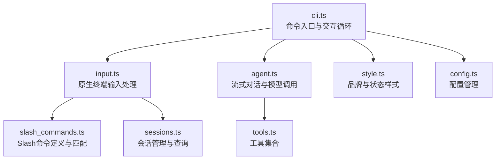
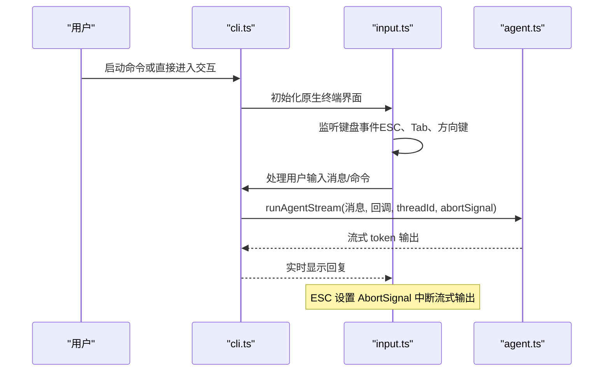
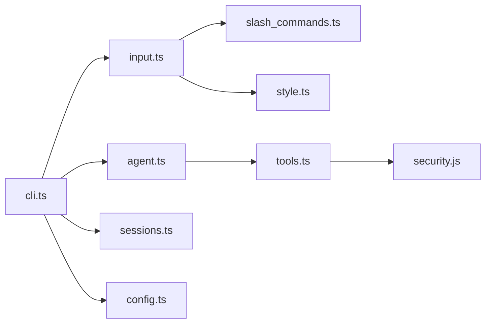

# CLI 界面

<cite>
**本文档引用的文件**
- [src/agent/cli.ts](file://src/agent/cli.ts)
- [src/agent/input.ts](file://src/agent/input.ts)
- [src/agent/agent.ts](file://src/agent/agent.ts)
- [src/agent/slash_commands.ts](file://src/agent/slash_commands.ts)
- [src/agent/sessions.ts](file://src/agent/sessions.ts)
- [src/agent/style.ts](file://src/agent/style.ts)
- [src/agent/config.ts](file://src/agent/config.ts)
- [src/agent/tools.ts](file://src/agent/tools.ts)
- [src/agent/tools/exec.ts](file://src/agent/tools/exec.ts)
- [src/agent/tools/run_js.ts](file://src/agent/tools/run_js.ts)
- [src/agent/tools/run_py.ts](file://src/agent/tools/run_py.ts)
- [package.json](file://package.json)
</cite>

## 更新摘要
**变更内容**
- 完整实现Slash命令系统：包括命令注册、匹配、执行和键盘导航支持
- 增强会话管理能力：支持会话查询、切换、新建和历史恢复
- 键盘导航支持：实现Tab补全、上下箭头选择、Enter执行等交互功能
- 会话持久化：基于SQLite的检查点存储，支持thread_id恢复历史对话
- 现代化终端UI：基于原生Node.js readline的组件化设计
- 流式对话与ESC中断：支持实时流式输出和即时中断
- 增强错误处理：完善的错误消息格式化和用户友好提示
- 工具安全系统：多层安全防护，防止危险操作和代码注入

## 目录
1. [简介](#简介)
2. [项目结构](#项目结构)
3. [核心组件](#核心组件)
4. [架构总览](#架构总览)
5. [详细组件分析](#详细组件分析)
6. [依赖关系分析](#依赖关系分析)
7. [性能与体验特性](#性能与体验特性)
8. [故障排查指南](#故障排查指南)
9. [结论](#结论)
10. [附录：使用示例与最佳实践](#附录使用示例与最佳实践)

## 简介
本文件面向使用者与开发者，系统性阐述 CLI 界面的设计与实现，覆盖命令行交互、原生终端界面、Slash命令系统（/config、/skill、/exit 等）、用户输入处理流程（文本输入、文件操作、代码执行）以及实际使用示例与最佳实践。目标是帮助用户高效、安全地使用 CLI 工具完成从日常问答到代码执行与文件管理的任务。

**更新** CLI 已实现完整的Slash命令系统和会话管理功能，提供现代化的终端交互体验，支持键盘导航、会话恢复、流式输出和ESC中断控制。

## 项目结构
CLI 子系统围绕"命令解析 → 原生终端界面 → 流式对话 → Slash命令处理 → 会话持久化"展开，主要文件职责如下：
- 入口与命令定义：cli.ts
- 用户输入处理：input.ts
- 对话界面组件：原生终端界面
- Slash命令面板组件：原生终端命令面板
- LangGraph适配器：agent.ts
- Slash命令与上下文：slash_commands.ts
- 会话管理：sessions.ts
- 对话与流式输出：agent.ts
- 视觉风格与状态提示：style.ts
- 配置管理：config.ts
- 工具集合：tools.ts
- 包与二进制入口：package.json

**图表来源**
- [src/agent/cli.ts:1-245](file://src/agent/cli.ts#L1-L245)
- [src/agent/input.ts:1-347](file://src/agent/input.ts#L1-L347)
- [src/agent/slash_commands.ts:1-92](file://src/agent/slash_commands.ts#L1-L92)
- [src/agent/sessions.ts:1-172](file://src/agent/sessions.ts#L1-L172)
- [src/agent/agent.ts:1-181](file://src/agent/agent.ts#L1-L181)
- [src/agent/style.ts:1-217](file://src/agent/style.ts#L1-L217)
- [src/agent/config.ts:1-146](file://src/agent/config.ts#L1-L146)
- [src/agent/tools.ts:1-10](file://src/agent/tools.ts#L1-L10)

## 核心组件
- 命令入口与交互循环：负责解析命令、启动原生终端界面、处理ask单轮问答、展示错误与状态。
- 原生终端界面系统：基于Node.js readline构建的现代化终端UI，提供流式对话、Slash命令面板、状态显示等功能。
- Slash命令系统：统一的命令注册表与匹配逻辑，支持别名、帮助、会话管理、配置中心等。
- 会话管理：基于SQLite的检查点存储，支持会话查询、切换、新建和历史恢复。
- 流式对话引擎：基于LangGraph的流式输出，支持中断、历史续接与工具调用。
- 配置中心与Python环境：交互式配置Python运行环境、镜像源、自动安装策略，并按需初始化虚拟环境与依赖。
- 工具集与安全：文件读写、代码执行（JS/Python）、系统命令、网络检索等；内置多层安全扫描与危险API阻断。

**章节来源**
- [src/agent/cli.ts:92-245](file://src/agent/cli.ts#L92-L245)
- [src/agent/input.ts:199-347](file://src/agent/input.ts#L199-L347)
- [src/agent/slash_commands.ts:21-92](file://src/agent/slash_commands.ts#L21-L92)
- [src/agent/sessions.ts:60-172](file://src/agent/sessions.ts#L60-L172)
- [src/agent/agent.ts:106-181](file://src/agent/agent.ts#L106-L181)
- [src/agent/style.ts:127-135](file://src/agent/style.ts#L127-L135)

## 架构总览
CLI 采用"命令层 → 原生终端界面层 → 对话层 → 工具层"的分层设计，通过AbortSignal实现ESC中断，通过checkpointer实现会话历史续接，通过原生终端界面提供现代化交互体验。

**图表来源**
- [src/agent/cli.ts:134-198](file://src/agent/cli.ts#L134-L198)
- [src/agent/input.ts:256-342](file://src/agent/input.ts#L256-L342)
- [src/agent/agent.ts:106-181](file://src/agent/agent.ts#L106-L181)

## 详细组件分析

### 命令入口与交互循环（cli.ts）
- 支持子命令ask与默认交互模式；ask命令提供单轮问答能力，不进入交互界面。
- 原生终端界面：默认模式下初始化输入处理，提供完整的交互式聊天界面。
- ESC中断：在原生终端界面中通过AbortSignal实现中断，输出"已停止"提示。
- 错误消息格式化：改进了错误消息格式化，针对不同异常（内容安全、认证、配额、递归限制、超时）给出友好提示。
- 流式输出：支持工具调用日志的流式输出，不打断主对话流。

**章节来源**
- [src/agent/cli.ts:28-83](file://src/agent/cli.ts#L28-L83)
- [src/agent/cli.ts:134-198](file://src/agent/cli.ts#L134-L198)
- [src/agent/cli.ts:28-63](file://src/agent/cli.ts#L28-L63)

### 原生终端输入处理（input.ts）
- 输入状态管理：维护缓冲区、选中索引、面板状态等输入状态。
- Slash命令面板：动态显示匹配的Slash命令，支持Tab补全、上下箭头选择、Enter执行、ESC关闭。
- 键盘事件处理：支持Ctrl+C退出、回车发送、Backspace删除、Tab补全、方向键导航等。
- 自定义光标：使用闪烁的█字符模拟输入框光标，隐藏终端原生光标。
- 全量重绘：面板出现/消失时进行全量重绘，普通输入时使用快速路径更新。

**章节来源**
- [src/agent/input.ts:199-347](file://src/agent/input.ts#L199-L347)
- [src/agent/input.ts:72-107](file://src/agent/input.ts#L72-L107)
- [src/agent/input.ts:125-183](file://src/agent/input.ts#L125-L183)

### Slash命令系统（slash_commands.ts）
- 命令注册：统一的SlashCommand接口，支持name、aliases、description、handler。
- 内置命令：
  - /config：打开配置中心（Python运行环境、镜像源、自动安装策略）。
  - /rewind <thread_id>：切换到指定历史会话。
  - /sessions：查看最近20条会话。
  - /new：新建会话。
  - /theme：占位命令（提示暂未实现）。
  - /help：打印可用Slash命令。
  - /exit：退出程序。
- 命令匹配：根据输入前缀与别名进行筛选，支持Tab补全与上下选择。

**章节来源**
- [src/agent/slash_commands.ts:21-92](file://src/agent/slash_commands.ts#L21-L92)

### 会话管理系统（sessions.ts）
- 会话查询：查询最近20条会话，提取thread_id、最后用户输入和时间信息。
- 时间格式化：将UUIDv7时间戳转换为相对时间格式。
- 会话验证：校验thread_id是否存在，确保会话有效性。
- 表格渲染：使用cli-table3渲染会话列表表格，支持中文字符。

**章节来源**
- [src/agent/sessions.ts:60-172](file://src/agent/sessions.ts#L60-L172)

### 流式对话与ESC中断（agent.ts）
- 流式输出：基于LangGraph的streamMode="messages"，逐个token回调onToken。
- 中断机制：接收AbortSignal，当aborted时提前结束循环，保证ESC及时生效。
- 历史续接：通过configurable.thread_id续接会话历史，recursionLimit控制最大步数。
- 工具调用：支持工具调用的累积和解析，提供详细的工具执行日志。

**章节来源**
- [src/agent/agent.ts:106-181](file://src/agent/agent.ts#L106-L181)

### 工具与安全系统
- exec工具：多层安全防护，包括危险命令黑名单、eval模式检测、危险API调用模式检测。
- run_js工具：Node.js可用性检查、危险API阻断、临时文件执行、输出捕获与清理。
- run_py工具：Python运行时选择、危险API阻断、临时文件执行、输出捕获与清理。
- 安全扫描：共享的危险API检测功能，防止恶意代码执行。

**章节来源**
- [src/agent/tools/exec.ts:6-92](file://src/agent/tools/exec.ts#L6-L92)
- [src/agent/tools/run_js.ts:22-89](file://src/agent/tools/run_js.ts#L22-L89)
- [src/agent/tools/run_py.ts:11-94](file://src/agent/tools/run_py.ts#L11-L94)

### 配置管理系统（config.ts）
- 配置结构：Python运行环境、pip镜像源、自动安装策略等配置项。
- 默认配置：提供合理的默认值，支持清华源等国内镜像。
- 配置对话框：基于inquirer的交互式配置界面。
- 环境初始化：支持立即初始化Python环境并安装常用数据分析依赖。

**章节来源**
- [src/agent/config.ts:22-69](file://src/agent/config.ts#L22-L69)
- [src/agent/config.ts:71-146](file://src/agent/config.ts#L71-L146)

### 工具日志系统（style.ts）
- 工具调用日志：生成带颜色图标和详情的工具调用日志，支持每个工具有独立图标和颜色。
- 多行代码块处理：新增toolLogLines函数，专门处理多行代码块的行数统计和显示。
- 详细信息截断：对工具调用的详细信息进行截断处理，避免过长信息影响界面显示。

**章节来源**
- [src/agent/style.ts:106-124](file://src/agent/style.ts#L106-L124)

## 依赖关系分析
- CLI依赖原生终端输入、Slash命令、对话引擎、样式模块。
- 原生终端输入依赖Slash命令和样式模块。
- 对话引擎依赖工具集模块。
- 工具集依赖安全扫描模块。

**图表来源**
- [src/agent/cli.ts:1-245](file://src/agent/cli.ts#L1-L245)
- [src/agent/input.ts:1-347](file://src/agent/input.ts#L1-L347)
- [src/agent/slash_commands.ts:1-92](file://src/agent/slash_commands.ts#L1-L92)
- [src/agent/agent.ts:1-181](file://src/agent/agent.ts#L1-L181)
- [src/agent/style.ts:1-217](file://src/agent/style.ts#L1-L217)
- [src/agent/sessions.ts:1-172](file://src/agent/sessions.ts#L1-L172)
- [src/agent/config.ts:1-146](file://src/agent/config.ts#L1-L146)

## 性能与体验特性
- 流式输出：边生成边显示，降低感知延迟。
- ESC中断：即时终止长文本生成，提升交互效率。
- 原生终端界面：基于Node.js readline的组件化设计，提供更好的用户体验。
- Slash命令面板：智能命令建议和选择功能。
- 键盘导航：支持Tab补全、上下箭头选择、Enter执行等交互。
- 会话管理：支持会话查询、切换、新建和历史恢复。
- 状态显示：实时显示模型名称、消息数量和运行状态。
- 主题色彩：统一的色彩方案，提升界面美观度。
- 错误处理：友好的错误消息格式化，帮助用户快速定位问题。
- 多层安全防护：防止危险操作和代码注入，保障系统安全。

## 故障排查指南
- **API Key/认证失败**：检查OPENAI_API_KEY或代理配置，参考错误格式化提示。
- **额度不足/429**：检查账户余额与配额，等待重试。
- **内容安全拦截**：安全审查触发，更换表述或简化查询。
- **网络超时**：检查网络与代理，重试请求。
- **递归限制**：任务过于复杂，建议拆分为多步执行。
- **ESC不生效**：确认在原生终端界面中运行，检查AbortSignal设置。
- **Slash命令无效**：确认命令格式正确，使用/help查看可用命令。
- **会话切换失败**：先用/sessions获取thread_id，再执行/rewind <thread_id>。
- **Python/Node不可用**：/config中启用自动安装或手动安装对应运行时。
- **工具执行失败**：检查危险API检测规则，避免使用被阻断的操作。
- **界面显示异常**：确认终端支持ANSI转义序列，检查依赖版本兼容性。
- **启动缓慢**：检查网络连接和依赖安装。

**章节来源**
- [src/agent/cli.ts:28-63](file://src/agent/cli.ts#L28-L63)
- [src/agent/slash_commands.ts:21-92](file://src/agent/slash_commands.ts#L21-L92)

## 结论
该CLI界面以原生Node.js终端为基础实现了现代化的交互体验，结合完整的Slash命令系统与会话持久化，既满足日常问答，又支持文件与代码执行等高级能力。最新的改进包括完整的Slash命令系统实现、会话管理能力增强、键盘导航支持、流式输出和ESC中断控制等，提供了更加丰富和高效的交互体验。

## 附录：使用示例与最佳实践

### 基本使用
- 启动交互：直接运行命令进入交互模式，使用输入框发起对话。
- 单轮问答：使用ask子命令快速获得一次性回答。
- 退出：使用/exit命令退出程序或按Ctrl+C优雅关闭。

**章节来源**
- [src/agent/cli.ts:65-83](file://src/agent/cli.ts#L65-L83)

### Slash命令速览与示例
- /config：打开配置中心，设置Python镜像源、自动安装策略，可立即初始化常用数据分析包。
- /sessions：查看最近20条会话，复制thread_id。
- /rewind <thread_id>：切换到指定历史会话继续对话。
- /new：新建会话，清空历史。
- /help：列出所有Slash命令及简要说明。
- /exit：退出程序。

**章节来源**
- [src/agent/slash_commands.ts:21-92](file://src/agent/slash_commands.ts#L21-L92)

### ESC中断控制
- 在对话过程中按ESC可立即中断生成，避免长时间等待。
- 中断后会输出"已停止"，随后可继续输入新消息或执行命令。

**章节来源**
- [src/agent/cli.ts:140-149](file://src/agent/cli.ts#L140-L149)
- [src/agent/style.ts:127-134](file://src/agent/style.ts#L127-L134)

### 键盘导航与Slash命令面板
- Slash命令面板：输入/触发命令面板，支持Tab补全、上下箭头选择、Enter执行、ESC关闭。
- 命令建议：根据输入前缀动态显示匹配的Slash命令。
- 快速访问：使用/help快速查看所有可用命令。

**章节来源**
- [src/agent/input.ts:72-107](file://src/agent/input.ts#L72-L107)
- [src/agent/input.ts:256-342](file://src/agent/input.ts#L256-L342)

### 会话管理最佳实践
- 使用/sessions查看历史会话，必要时用/rewind切换到合适上下文。
- 新建会话：使用/new创建全新对话，避免历史干扰。
- 会话恢复：通过thread_id恢复之前的对话内容。
- 会话查询：定期查看/sessions了解当前对话状态。

**章节来源**
- [src/agent/sessions.ts:60-172](file://src/agent/sessions.ts#L60-L172)

### 文本输入与文件操作
- 文本输入：在交互模式下直接输入消息，支持多行输入。
- 文件写入：使用工具写入文件，注意路径必须位于当前目录内，且内容不得包含危险API。
- 读取文件：通过工具读取文件内容，支持UTF-8编码。
- 系统命令：使用工具执行shell命令（如ls、pwd、git），谨慎使用以避免风险。

**章节来源**
- [src/agent/tools/exec.ts:94-142](file://src/agent/tools/exec.ts#L94-L142)

### 代码执行（JS/Python）
- **JS执行**：使用run_js工具，推荐通过工具调用而非手动拼接命令；代码需使用console.log输出结果。
- **Python执行**：使用run_py工具，自动检测并安装所需包（pandas/numpy/openpyxl），推荐通过工具调用而非手动拼接命令。
- **安全策略**：内置多层危险API阻断（如fs.rmSync、child_process、shutil.rmtree等），禁止直接执行高危操作。
- **执行过程可视化**：工具执行过程会在界面上显示详细的日志信息，包括代码行数统计等。

**章节来源**
- [src/agent/tools/run_js.ts:22-89](file://src/agent/tools/run_js.ts#L22-L89)
- [src/agent/tools/run_py.ts:11-94](file://src/agent/tools/run_py.ts#L11-L94)

### 工具日志与执行监控
- 工具调用日志：每个工具调用都会在界面上显示详细的执行信息，包括工具名称、参数详情等。
- 多行代码块处理：对于JS/Python代码执行，会显示代码的行数统计，便于了解执行规模。
- 实时进度反馈：工具执行过程中的详细信息会实时显示，提供良好的用户体验。

**章节来源**
- [src/agent/style.ts:106-124](file://src/agent/style.ts#L106-L124)

### 原生终端界面使用指南
- **界面布局**：顶部显示品牌标识，中间显示消息列表，底部显示输入框和状态栏。
- **输入体验**：输入框支持多行输入，Slash命令面板提供智能建议。
- **状态显示**：状态栏实时显示模型名称、消息数量和运行状态。
- **中断控制**：ESC键可随时中断生成过程。
- **主题色彩**：统一的色彩方案提供良好的视觉体验。

**使用注意事项**：
- 确保终端支持ANSI转义序列
- 检查依赖版本兼容性
- 在某些终端中可能需要调整字体设置

**章节来源**
- [src/agent/input.ts:125-183](file://src/agent/input.ts#L125-L183)
- [src/agent/style.ts:177-209](file://src/agent/style.ts#L177-L209)

### 配置管理最佳实践
- 使用/config打开配置中心，设置Python镜像源和自动安装策略。
- 推荐使用国内镜像源（如清华源）提升下载速度。
- 可以立即初始化Python环境并安装常用数据分析依赖包。
- 配置文件保存在.data/config.json中，支持自定义路径。

**章节来源**
- [src/agent/config.ts:71-146](file://src/agent/config.ts#L71-L146)

### 安全最佳实践
- 避免使用危险命令（rm、mv、cp、sudo等）。
- 不要使用eval模式执行代码（node -e、python -c等）。
- 遵循工具的安全约束，不要直接调用危险API。
- 定期检查和更新Python环境。
- 使用工具执行代码时，确保代码中不包含危险操作。

**章节来源**
- [src/agent/tools/exec.ts:6-92](file://src/agent/tools/exec.ts#L6-L92)
- [src/agent/tools/run_js.ts:28-31](file://src/agent/tools/run_js.ts#L28-L31)
- [src/agent/tools/run_py.ts:17-20](file://src/agent/tools/run_py.ts#L17-L20)

### 最佳实践
- 使用/sessions查看历史会话，必要时用/rewind切换到合适上下文。
- 对于复杂任务，建议拆分为多步执行，避免超过递归限制。
- Python代码尽量显式导入所需库，以便自动检测与安装依赖。
- JS/Python代码应避免高危API，遵循工具的安全约束。
- 在原生终端界面中使用ESC中断，提高交互效率。
- 通过/config调整Python镜像源与自动安装策略，提升开发体验。
- 利用工具日志功能监控代码执行过程，及时发现问题。
- 充分利用Slash命令面板的智能建议功能，提高输入效率。
- 使用键盘导航（Tab、上下箭头、Enter）提升交互效率。
- 定期使用/sessions检查会话状态，避免意外的数据丢失。
- 启动时观察启动画面，了解快捷操作和版本信息。