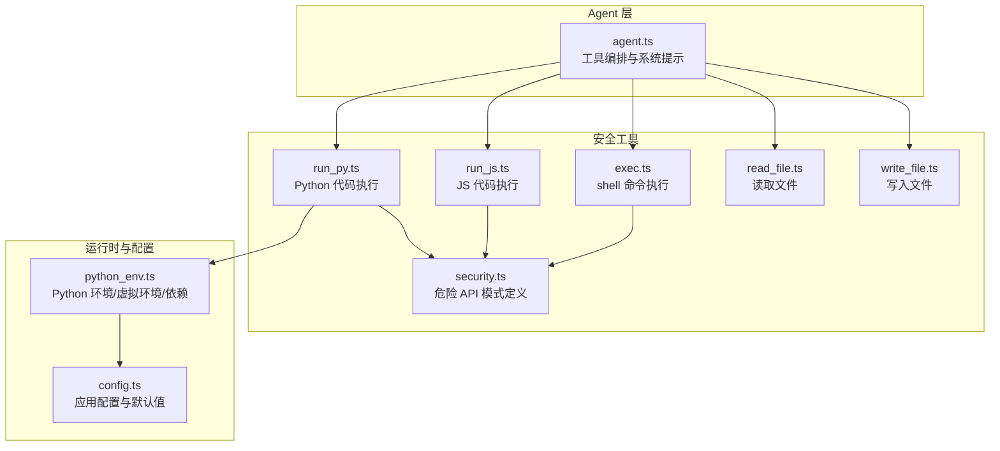
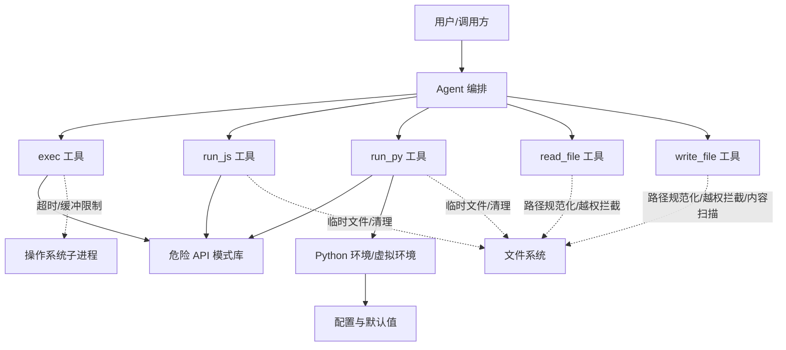
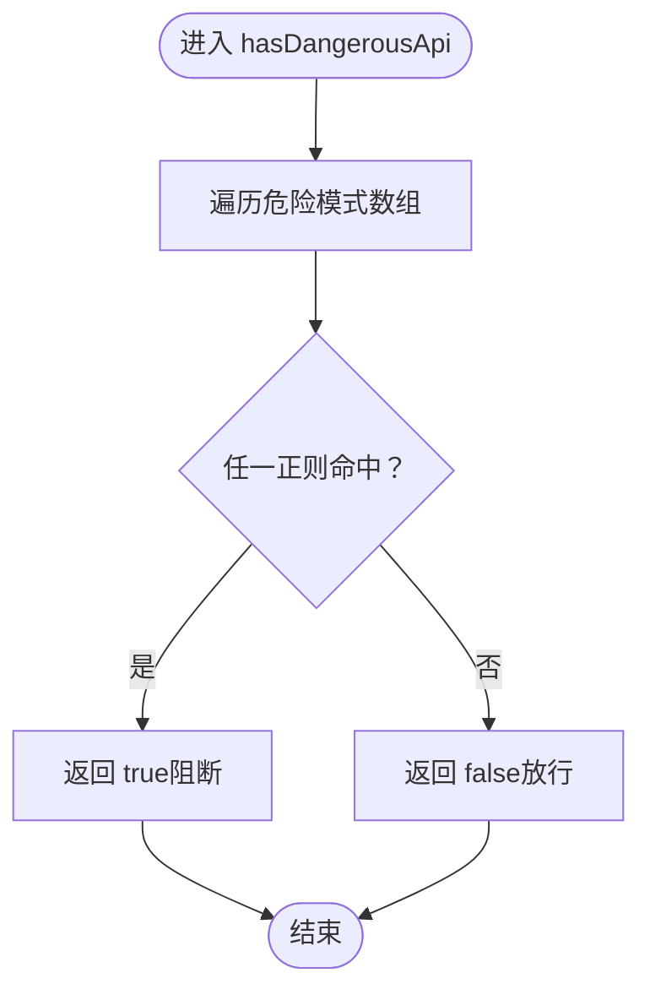
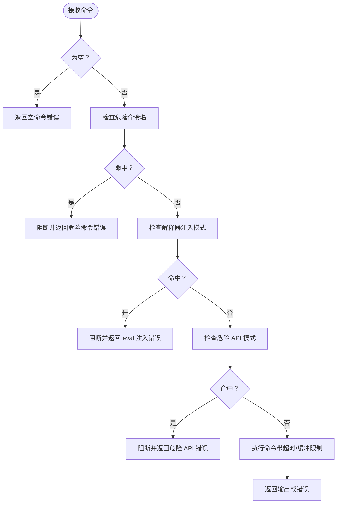
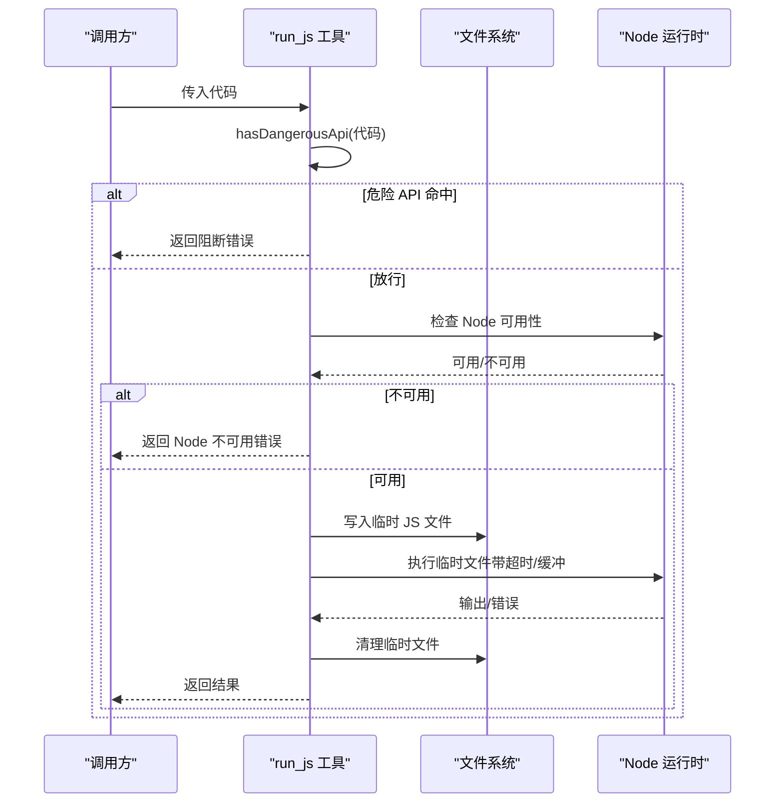
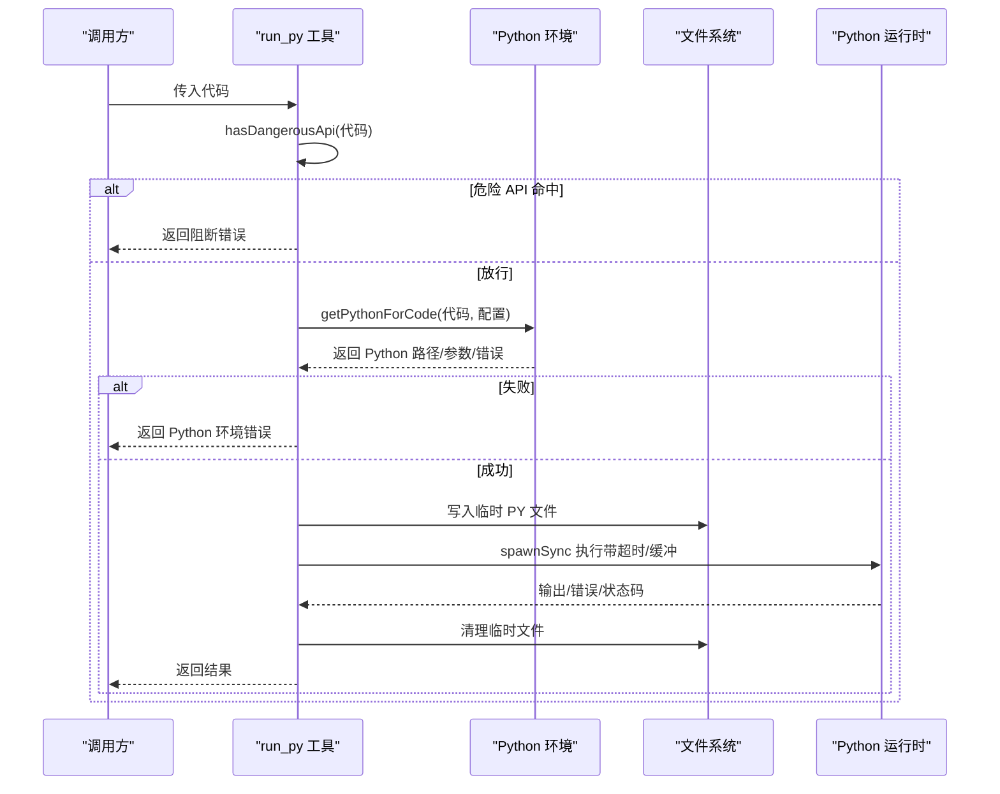
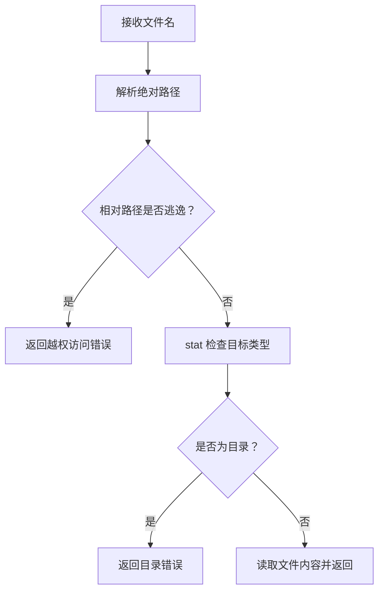
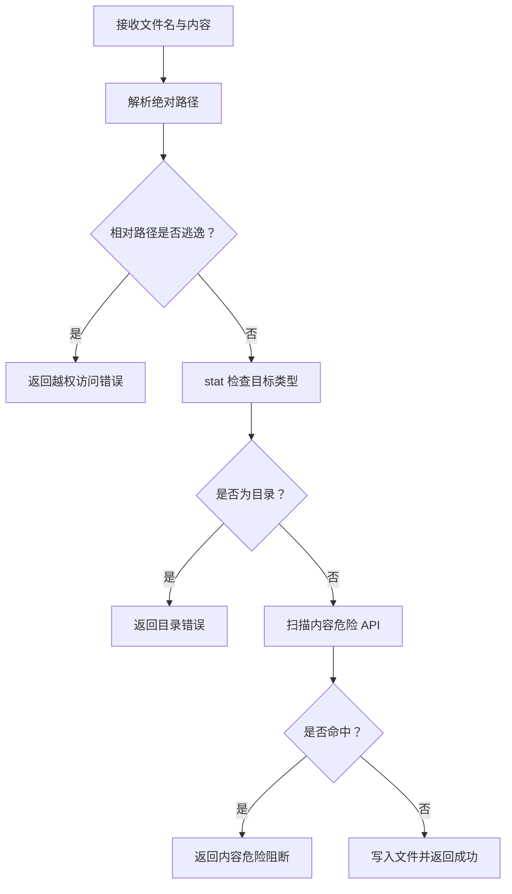
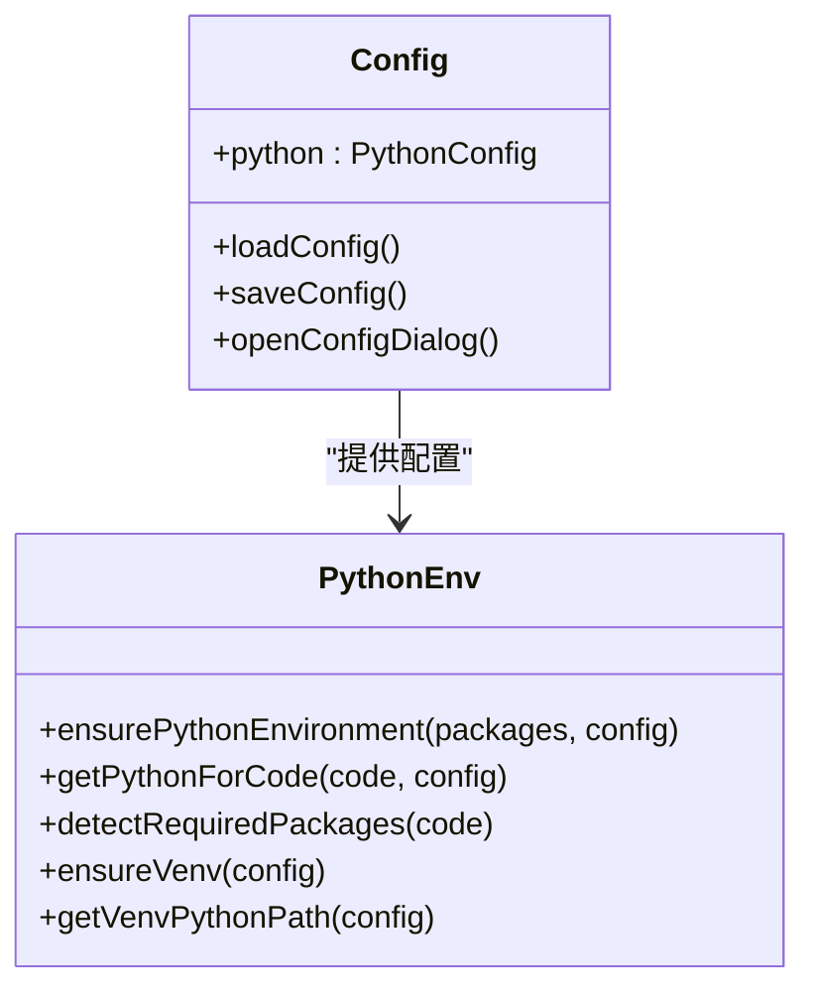
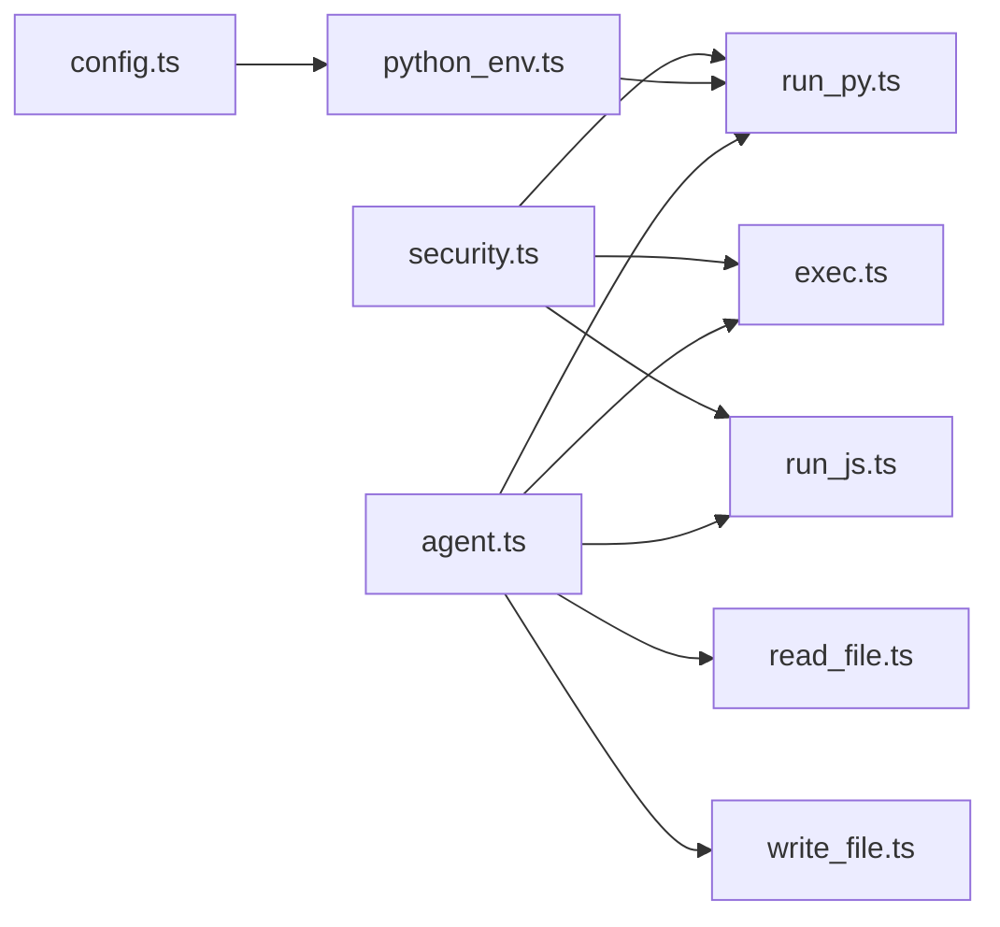

# 安全设计

<cite>
**本文引用的文件**
- [security.ts](file://src/agent/tools/security.ts)
- [exec.ts](file://src/agent/tools/exec.ts)
- [run_js.ts](file://src/agent/tools/run_js.ts)
- [run_py.ts](file://src/agent/tools/run_py.ts)
- [read_file.ts](file://src/agent/tools/read_file.ts)
- [write_file.ts](file://src/agent/tools/write_file.ts)
- [python_env.ts](file://src/agent/python_env.ts)
- [config.ts](file://src/agent/config.ts)
- [agent.ts](file://src/agent/agent.ts)
- [exec.test.ts](file://src/agent/tools/exec.test.ts)
- [run_js.test.ts](file://src/agent/tools/run_js.test.ts)
- [run_py.test.ts](file://src/agent/tools/run_py.test.ts)
- [read_file.test.ts](file://src/agent/tools/read_file.test.ts)
- [write_file.test.ts](file://src/agent/tools/write_file.test.ts)
</cite>

## 目录
1. [简介](#简介)
2. [项目结构](#项目结构)
3. [核心组件](#核心组件)
4. [架构总览](#架构总览)
5. [详细组件分析](#详细组件分析)
6. [依赖关系分析](#依赖关系分析)
7. [性能考量](#性能考量)
8. [故障排查指南](#故障排查指南)
9. [结论](#结论)
10. [附录](#附录)

## 简介
本文件系统性阐述本项目的“安全设计”，聚焦于以下目标：
- 整体安全策略与架构：代码执行安全、文件操作保护、危险操作检测机制
- 安全沙箱实现原理：进程隔离、资源限制、权限控制
- 安全检查触发条件与防护措施：恶意代码检测、文件路径验证、系统命令过滤
- 安全配置最佳实践：最小权限原则、安全审计日志
- 安全事件处理流程与应急响应机制

本项目通过多层安全检查（命令名黑名单、解释器注入检测、危险 API 模式匹配）、路径规范化与限制、临时文件执行与清理、Python 运行时环境隔离与依赖管理等手段，构建了面向开发辅助场景的可执行代码与文件操作的安全基线。

## 项目结构
本项目采用按“能力域”组织的模块化结构，安全相关能力主要集中在 tools 目录下的执行与文件工具，以及独立的 security.ts 模块；Python 运行时环境与配置位于 python_env.ts 与 config.ts；Agent 层统一编排工具并提供系统提示约束。

图表来源
- [agent.ts:80-95](file://src/agent/agent.ts#L80-L95)
- [exec.ts:4](file://src/agent/tools/exec.ts#L4)
- [run_js.ts:7](file://src/agent/tools/run_js.ts#L7)
- [run_py.ts:7](file://src/agent/tools/run_py.ts#L7)
- [read_file.ts:3](file://src/agent/tools/read_file.ts#L3)
- [write_file.ts:5](file://src/agent/tools/write_file.ts#L5)
- [security.ts:4](file://src/agent/tools/security.ts#L4)
- [python_env.ts:161](file://src/agent/python_env.ts#L161)
- [config.ts:54](file://src/agent/config.ts#L54)

章节来源
- [agent.ts:80-95](file://src/agent/agent.ts#L80-L95)
- [exec.ts:94-141](file://src/agent/tools/exec.ts#L94-L141)
- [run_js.ts:22-88](file://src/agent/tools/run_js.ts#L22-L88)
- [run_py.ts:11-93](file://src/agent/tools/run_py.ts#L11-L93)
- [read_file.ts:6-39](file://src/agent/tools/read_file.ts#L6-L39)
- [write_file.ts:7-53](file://src/agent/tools/write_file.ts#L7-L53)
- [security.ts:1-27](file://src/agent/tools/security.ts#L1-L27)
- [python_env.ts:161-223](file://src/agent/python_env.ts#L161-L223)
- [config.ts:54-69](file://src/agent/config.ts#L54-L69)

## 核心组件
- 危险 API 模式库（security.ts）：集中定义跨语言的高危调用模式，用于检测潜在破坏性 API 使用。
- 执行工具链：
  - exec.ts：Shell 命令执行，实施三重安全检查（危险命令名、解释器注入、危险 API 模式）。
  - run_js.ts：JavaScript/Node 代码执行，通过临时文件与超时限制保障安全。
  - run_py.ts：Python 代码执行，基于虚拟环境与依赖管理，临时文件执行并清理。
- 文件操作工具：
  - read_file.ts：仅允许在当前工作目录内读取文件，严格路径规范化与越权拦截。
  - write_file.ts：仅允许在当前工作目录内写入文件，禁止目录覆盖与路径逃逸，并对内容进行危险 API 检测。
- 运行时与配置：
  - python_env.ts：Python 环境探测、虚拟环境创建与缓存、缺失包自动安装与镜像源配置。
  - config.ts：应用配置加载、合并默认值、持久化保存与交互式配置对话。

章节来源
- [security.ts:4-26](file://src/agent/tools/security.ts#L4-L26)
- [exec.ts:6-109](file://src/agent/tools/exec.ts#L6-L109)
- [run_js.ts:22-88](file://src/agent/tools/run_js.ts#L22-L88)
- [run_py.ts:11-93](file://src/agent/tools/run_py.ts#L11-L93)
- [read_file.ts:6-39](file://src/agent/tools/read_file.ts#L6-L39)
- [write_file.ts:7-53](file://src/agent/tools/write_file.ts#L7-L53)
- [python_env.ts:161-223](file://src/agent/python_env.ts#L161-L223)
- [config.ts:54-69](file://src/agent/config.ts#L54-L69)

## 架构总览
下图展示安全策略在各组件间的协作关系与数据流：

图表来源
- [agent.ts:80-95](file://src/agent/agent.ts#L80-L95)
- [exec.ts:94-141](file://src/agent/tools/exec.ts#L94-L141)
- [run_js.ts:22-88](file://src/agent/tools/run_js.ts#L22-L88)
- [run_py.ts:11-93](file://src/agent/tools/run_py.ts#L11-L93)
- [read_file.ts:6-39](file://src/agent/tools/read_file.ts#L6-L39)
- [write_file.ts:7-53](file://src/agent/tools/write_file.ts#L7-L53)
- [security.ts:4-26](file://src/agent/tools/security.ts#L4-L26)
- [python_env.ts:161-223](file://src/agent/python_env.ts#L161-L223)
- [config.ts:54-69](file://src/agent/config.ts#L54-L69)

## 详细组件分析

### 危险 API 模式库（security.ts）
- 设计要点
  - 将跨语言的高危调用模式集中定义，便于在多处工具共享复用。
  - 覆盖 Node.js fs、child_process、require 引用，以及 Python shutil/os/subprocess/pathlib 等常见破坏性 API。
- 复杂度与性能
  - 检测为 O(k) 模式匹配，k 为危险模式数量，常数小且正则简单，开销极低。
- 错误处理
  - 作为纯函数，无异常抛出；调用方负责根据返回布尔值决定阻断或放行。

图表来源
- [security.ts:24-26](file://src/agent/tools/security.ts#L24-L26)

章节来源
- [security.ts:1-27](file://src/agent/tools/security.ts#L1-L27)

### Shell 命令执行（exec.ts）
- 安全检查层级
  - 第一层：危险命令名黑名单（如 rm、mv、cp、sudo、chmod、kill、wget、curl、压缩工具等）
  - 第二层：解释器注入模式（node -e/--eval/-p、python -c/--command、ruby -e、perl -e、php -r、deno eval、bun -e 等）
  - 第三层：危险 API 模式匹配（共享 security.ts）
- 资源限制
  - 超时：30 秒
  - 输出缓冲：最大 1MB
- 错误处理
  - 对 execSync 抛出的错误进行细分处理，优先返回 stderr/stdout，其次处理超时与通用错误消息。
- 触发条件
  - 任一安全检查命中即阻断；空命令直接拒绝。

图表来源
- [exec.ts:94-141](file://src/agent/tools/exec.ts#L94-L141)

章节来源
- [exec.ts:6-109](file://src/agent/tools/exec.ts#L6-L109)
- [exec.test.ts:23-149](file://src/agent/tools/exec.test.ts#L23-L149)

### JavaScript 代码执行（run_js.ts）
- 安全策略
  - 内容安全：调用 hasDangerousApi 对代码进行扫描
  - 环境可用性：检测 Node.js 是否可用
  - 临时文件执行：将代码写入系统临时目录，执行后清理
  - 资源限制：超时 15 秒，输出缓冲 512KB
- 触发条件
  - 代码为空或空白字符串直接拒绝；危险 API 命中阻断；Node 不可用返回错误；执行异常按错误类型细分返回；最终清理临时文件。

图表来源
- [run_js.ts:22-88](file://src/agent/tools/run_js.ts#L22-L88)

章节来源
- [run_js.ts:9-75](file://src/agent/tools/run_js.ts#L9-L75)
- [run_js.test.ts:4-84](file://src/agent/tools/run_js.test.ts#L4-L84)

### Python 代码执行（run_py.ts）
- 安全策略
  - 内容安全：调用 hasDangerousApi 对代码进行扫描
  - 环境准备：通过 getPythonForCode 获取/确保 Python 运行时（含虚拟环境与依赖）
  - 临时文件执行：将代码写入系统临时目录，执行后清理
  - 资源限制：超时 15 秒，输出缓冲 512KB
- 触发条件
  - 代码为空或空白字符串直接拒绝；危险 API 命中阻断；Python 不可用返回错误；执行状态码非零返回 stderr/stdout 或状态码信息；异常按错误类型细分返回；最终清理临时文件。

图表来源
- [run_py.ts:11-93](file://src/agent/tools/run_py.ts#L11-L93)
- [python_env.ts:189-223](file://src/agent/python_env.ts#L189-L223)

章节来源
- [run_py.ts:11-93](file://src/agent/tools/run_py.ts#L11-L93)
- [run_py.test.ts:4-84](file://src/agent/tools/run_py.test.ts#L4-L84)
- [python_env.ts:161-223](file://src/agent/python_env.ts#L161-L223)

### 文件读取（read_file.ts）
- 安全策略
  - 路径规范化：使用 path.resolve 与 path.relative，严格禁止路径逃逸到当前工作目录之外
  - 类型校验：若目标为目录，直接拒绝
  - 错误处理：针对不同错误码（如 ENOENT）给出明确提示
- 触发条件
  - 路径逃逸阻断；目录访问阻断；文件不存在/读取异常返回相应错误。

图表来源
- [read_file.ts:6-39](file://src/agent/tools/read_file.ts#L6-L39)

章节来源
- [read_file.ts:6-39](file://src/agent/tools/read_file.ts#L6-L39)
- [read_file.test.ts:22-41](file://src/agent/tools/read_file.test.ts#L22-L41)

### 文件写入（write_file.ts）
- 安全策略
  - 路径规范化与越权拦截：同读取工具
  - 内容安全：对写入内容进行危险 API 模式扫描，防止通过 write→exec 绕过
  - 类型校验：若目标为目录，直接拒绝
- 触发条件
  - 路径逃逸阻断；目录覆盖阻断；内容包含危险 API 阻断；写入异常返回相应错误。

图表来源
- [write_file.ts:7-53](file://src/agent/tools/write_file.ts#L7-L53)

章节来源
- [write_file.ts:7-53](file://src/agent/tools/write_file.ts#L7-L53)
- [write_file.test.ts:57-135](file://src/agent/tools/write_file.test.ts#L57-L135)

### Python 运行时与配置（python_env.ts、config.ts）
- Python 环境管理
  - 探测候选 Python 命令，验证版本为 Python 3
  - 虚拟环境创建与缓存，支持 Windows 与类 Unix 平台差异
  - 缺失包检测与自动安装，支持镜像源与可信主机配置
- 配置管理
  - 默认配置合并与持久化保存
  - 交互式配置对话，支持修改 pip 源、自动安装开关与一次性初始化常用数据包

图表来源
- [config.ts:18-69](file://src/agent/config.ts#L18-L69)
- [python_env.ts:161-223](file://src/agent/python_env.ts#L161-L223)

章节来源
- [python_env.ts:161-223](file://src/agent/python_env.ts#L161-L223)
- [config.ts:54-145](file://src/agent/config.ts#L54-L145)

## 依赖关系分析
- 组件耦合
  - exec.ts、run_js.ts、run_py.ts 共享 security.ts 的危险 API 模式，降低重复与维护成本
  - run_py.ts 依赖 python_env.ts 与 config.ts，形成“配置驱动”的运行时环境管理
  - agent.ts 统一注册工具，体现“最小权限”与“工具边界清晰”的设计
- 外部依赖
  - Node.js child_process/spawnSync/execSync
  - 文件系统 fs、路径 path、临时目录 os.tmpdir
  - Python 运行时与虚拟环境（venv）

图表来源
- [exec.ts:4](file://src/agent/tools/exec.ts#L4)
- [run_js.ts:7](file://src/agent/tools/run_js.ts#L7)
- [run_py.ts:7](file://src/agent/tools/run_py.ts#L7)
- [python_env.ts:5](file://src/agent/python_env.ts#L5)
- [config.ts:5](file://src/agent/config.ts#L5)
- [agent.ts:14](file://src/agent/agent.ts#L14)

章节来源
- [exec.ts:4](file://src/agent/tools/exec.ts#L4)
- [run_js.ts:7](file://src/agent/tools/run_js.ts#L7)
- [run_py.ts:7](file://src/agent/tools/run_py.ts#L7)
- [python_env.ts:5](file://src/agent/python_env.ts#L5)
- [config.ts:5](file://src/agent/config.ts#L5)
- [agent.ts:14](file://src/agent/agent.ts#L14)

## 性能考量
- 检测开销
  - 危险 API 模式匹配为固定数量的正则扫描，时间复杂度 O(k)，k 很小，几乎无性能影响
- 执行开销
  - exec.ts 设置 30 秒超时与 1MB 缓冲，run_js/run_py 设置 15 秒超时与 512KB 缓冲，兼顾安全性与响应性
- I/O 与临时文件
  - 临时文件写入与清理在本地磁盘，建议确保系统临时目录具备足够空间与权限
- Python 环境
  - 虚拟环境创建与依赖安装为一次性开销，后续执行通过缓存路径复用，减少重复成本

## 故障排查指南
- 常见阻断原因
  - exec：命令名在黑名单、解释器注入模式、危险 API 模式
  - run_js/run_py：代码包含危险 API、Node/Python 不可用、超时或依赖安装失败
  - read_file/write_file：路径逃逸、目标为目录、内容危险（写入）
- 日志与可观测性
  - 当前实现返回错误消息，未内置统一审计日志；可在工具层增加可配置的日志记录（例如将阻断事件写入本地文件或上报服务）
- 修复建议
  - 若误报危险 API 模式，需评估正则覆盖范围与上下文匹配，必要时调整模式或放宽条件
  - 若超时频繁，检查目标命令复杂度与系统负载，适当提升超时阈值或优化命令
  - 若 Python 依赖安装失败，确认镜像源配置与网络连通性

章节来源
- [exec.ts:100-131](file://src/agent/tools/exec.ts#L100-L131)
- [run_js.ts:54-74](file://src/agent/tools/run_js.ts#L54-L74)
- [run_py.ts:48-81](file://src/agent/tools/run_py.ts#L48-L81)
- [read_file.ts:25-30](file://src/agent/tools/read_file.ts#L25-L30)
- [write_file.ts:35-40](file://src/agent/tools/write_file.ts#L35-L40)

## 结论
本项目通过“多层安全检查 + 路径与内容双重限制 + 临时文件执行 + 运行时环境隔离”的组合拳，有效降低了代码执行与文件操作带来的风险。建议在现有基础上补充统一审计日志与告警机制，完善安全事件处置流程，并持续优化危险模式库以应对新威胁。

## 附录
- 最小权限原则
  - 仅授予执行所需最小权限；避免使用提权命令（如 sudo/su/doas）
  - 限制命令与脚本执行范围，优先使用 run_js/run_py 的临时文件执行模式
- 安全审计日志
  - 记录阻断事件（时间、工具名、输入摘要、阻断原因）、执行结果与异常
  - 对敏感操作（rm/mv/cp、chmod/chown、网络下载）设置重点监控
- 应急响应
  - 发现异常阻断或误报时，暂停相关工具使用，回溯最近变更
  - 对 Python 环境问题，检查虚拟环境路径与依赖安装状态，必要时重建环境
  - 对文件操作异常，核查路径规范化逻辑与权限设置