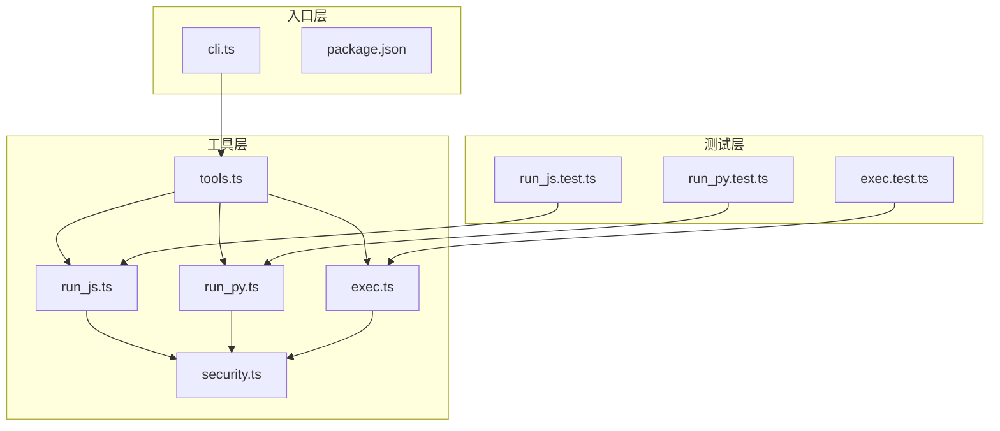
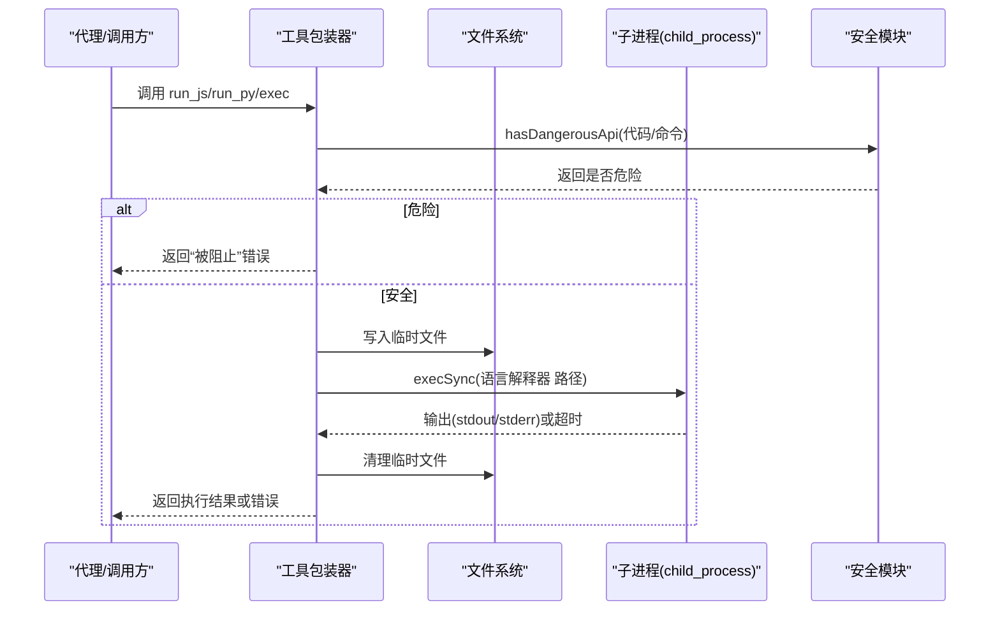
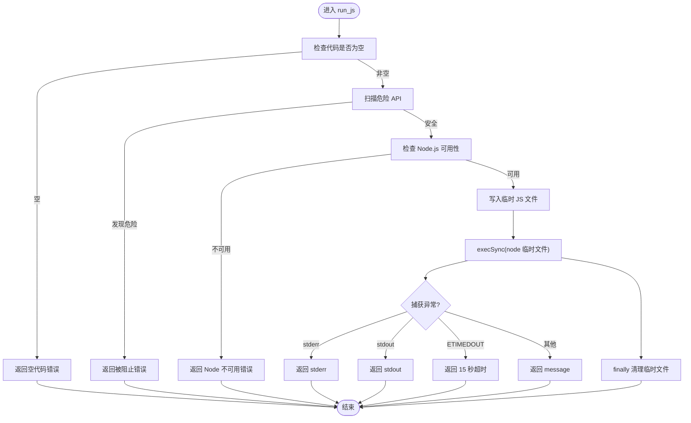
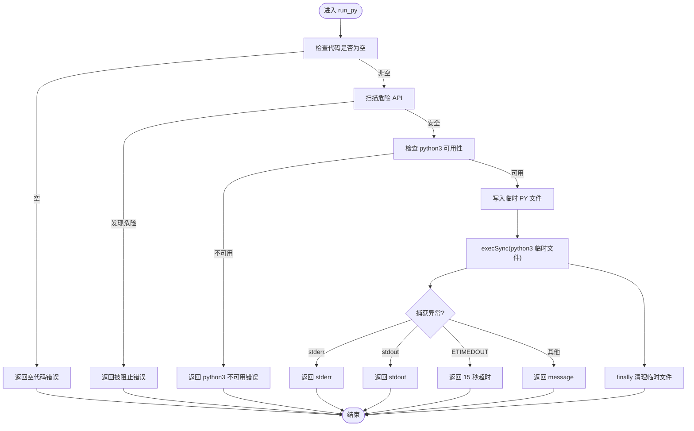
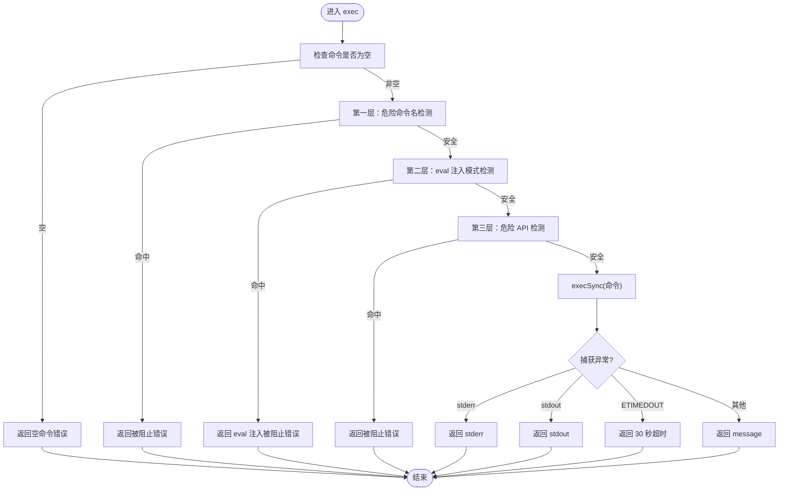
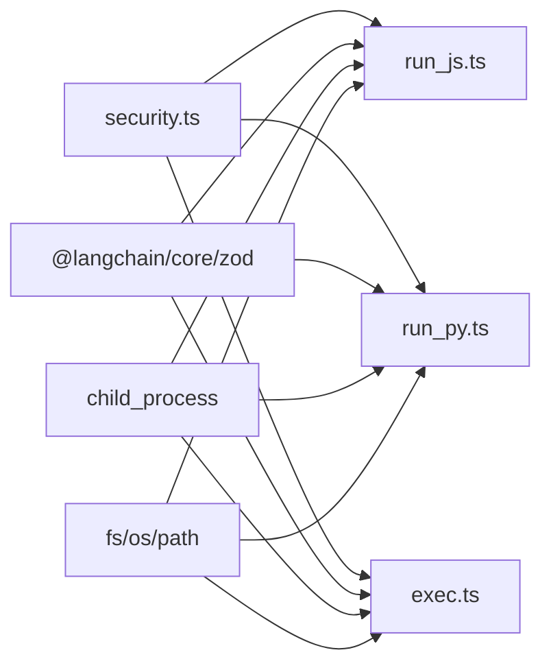

# 代码执行工具

<cite>
**本文引用的文件列表**
- [run_js.ts](file://src/agent/tools/run_js.ts)
- [run_py.ts](file://src/agent/tools/run_py.ts)
- [exec.ts](file://src/agent/tools/exec.ts)
- [security.ts](file://src/agent/tools/security.ts)
- [run_js.test.ts](file://src/agent/tools/run_js.test.ts)
- [run_py.test.ts](file://src/agent/tools/run_py.test.ts)
- [exec.test.ts](file://src/agent/tools/exec.test.ts)
- [tools.ts](file://src/agent/tools.ts)
- [cli.ts](file://src/agent/cli.ts)
- [package.json](file://package.json)
</cite>

## 目录
1. [简介](#简介)
2. [项目结构](#项目结构)
3. [核心组件](#核心组件)
4. [架构总览](#架构总览)
5. [详细组件分析](#详细组件分析)
6. [依赖关系分析](#依赖关系分析)
7. [性能与资源限制](#性能与资源限制)
8. [故障排查指南](#故障排查指南)
9. [结论](#结论)
10. [附录](#附录)

## 简介
本文件面向“代码执行工具”的技术文档，重点解析以下能力：
- JavaScript 执行工具（run_js）与 Python 执行工具（run_py）的功能实现、安全机制与使用限制
- 安全沙箱的工作原理（基于多层检测与隔离）
- 时间超时控制与输出缓冲区限制
- 代码执行生命周期管理、错误处理与异常恢复策略
- 使用示例与最佳实践
- 性能监控与调试方法
- 常见风险与防护措施

## 项目结构
该仓库采用按功能分层的组织方式，代码执行工具位于 src/agent/tools 目录下，分别提供：
- run_js.ts：通过 Node.js 执行 JavaScript/Node 代码
- run_py.ts：通过 python3 执行 Python 代码
- exec.ts：执行系统 Shell 命令（含三层安全检测）
- security.ts：危险 API 模式检测规则与函数
- 对应的单元测试文件用于验证功能与安全策略
- 工具导出入口 tools.ts 将各工具统一导出
- CLI 入口 cli.ts 提供交互式会话与错误格式化

图表来源
- [run_js.ts:1-90](file://src/agent/tools/run_js.ts#L1-L90)
- [run_py.ts:1-90](file://src/agent/tools/run_py.ts#L1-L90)
- [exec.ts:1-143](file://src/agent/tools/exec.ts#L1-L143)
- [security.ts:1-27](file://src/agent/tools/security.ts#L1-L27)
- [tools.ts:1-10](file://src/agent/tools.ts#L1-L10)
- [run_js.test.ts:1-85](file://src/agent/tools/run_js.test.ts#L1-L85)
- [run_py.test.ts:1-85](file://src/agent/tools/run_py.test.ts#L1-L85)
- [exec.test.ts:1-150](file://src/agent/tools/exec.test.ts#L1-L150)
- [cli.ts:1-126](file://src/agent/cli.ts#L1-L126)
- [package.json:1-38](file://package.json#L1-L38)

章节来源
- [run_js.ts:1-90](file://src/agent/tools/run_js.ts#L1-L90)
- [run_py.ts:1-90](file://src/agent/tools/run_py.ts#L1-L90)
- [exec.ts:1-143](file://src/agent/tools/exec.ts#L1-L143)
- [security.ts:1-27](file://src/agent/tools/security.ts#L1-L27)
- [tools.ts:1-10](file://src/agent/tools.ts#L1-L10)
- [cli.ts:1-126](file://src/agent/cli.ts#L1-L126)
- [package.json:1-38](file://package.json#L1-L38)

## 核心组件
- run_js：将待执行的 JavaScript 代码写入临时文件，调用 Node.js 执行，支持超时与输出缓冲限制，并在 finally 中清理临时文件。
- run_py：将待执行的 Python 代码写入临时文件，调用 python3 执行，同样具备超时与输出缓冲限制，并在 finally 中清理临时文件。
- exec：执行系统 Shell 命令，包含三层安全检测（危险命令名黑名单、eval 注入模式、危险 API 调用），并设置较长超时与更大的输出缓冲。
- security：集中定义危险 API 模式（Node fs、child_process、Python shutil/os/subprocess 等），提供 hasDangerousApi 检测函数，供多个工具复用。

章节来源
- [run_js.ts:22-90](file://src/agent/tools/run_js.ts#L22-L90)
- [run_py.ts:22-90](file://src/agent/tools/run_py.ts#L22-L90)
- [exec.ts:94-143](file://src/agent/tools/exec.ts#L94-L143)
- [security.ts:1-27](file://src/agent/tools/security.ts#L1-L27)

## 架构总览
代码执行工具通过 LangChain 的 tool 包装器对外暴露，内部采用“临时文件 + 同步子进程执行”的模式，结合多层安全检测与严格的超时/缓冲限制，形成轻量级的执行沙箱。

图表来源
- [run_js.ts:22-76](file://src/agent/tools/run_js.ts#L22-L76)
- [run_py.ts:22-76](file://src/agent/tools/run_py.ts#L22-L76)
- [exec.ts:94-133](file://src/agent/tools/exec.ts#L94-L133)
- [security.ts:24-26](file://src/agent/tools/security.ts#L24-L26)

## 详细组件分析

### JavaScript 执行工具（run_js）
- 功能要点
  - 输入校验：禁止空代码；检测危险 API 调用；检查 Node.js 是否可用；写入临时文件执行；捕获 stdout/stderr/超时；finally 清理临时文件。
  - 超时与缓冲：执行超时为 15 秒，最大输出缓冲为 512KB。
  - 输出：若无输出则返回“完成但无输出”的占位字符串。
- 生命周期
  - 初始化：参数校验与安全检查
  - 执行：写入临时文件 -> execSync(node "...") -> 捕获输出
  - 清理：finally 删除临时文件
- 错误处理
  - 语法/运行时错误：返回 stderr 或 stdout
  - 超时：返回“15 秒超时”
  - 其他异常：返回 message
- 安全机制
  - 危险 API 检测：通过 security.hasDangerousApi
  - Node.js 可用性检查：通过 execSync("node --version") 并设置短超时
  - 临时文件：避免命令行转义问题，降低注入风险

图表来源
- [run_js.ts:22-76](file://src/agent/tools/run_js.ts#L22-L76)

章节来源
- [run_js.ts:1-90](file://src/agent/tools/run_js.ts#L1-L90)
- [run_js.test.ts:1-85](file://src/agent/tools/run_js.test.ts#L1-L85)
- [security.ts:1-27](file://src/agent/tools/security.ts#L1-L27)

### Python 执行工具（run_py）
- 功能要点
  - 与 run_js 类似：空代码校验、危险 API 检测、检查 python3 可用性、写入临时文件、execSync(python3 ...)、finally 清理。
  - 超时与缓冲：执行超时为 15 秒，最大输出缓冲为 512KB。
- 错误处理与生命周期同 run_js，差异在于语言环境与错误消息来源。
- 安全机制
  - 危险 API 检测：覆盖 Python 常见危险模块（os/shutil/subprocess/pathlib 等）

图表来源
- [run_py.ts:22-76](file://src/agent/tools/run_py.ts#L22-L76)

章节来源
- [run_py.ts:1-90](file://src/agent/tools/run_py.ts#L1-L90)
- [run_py.test.ts:1-85](file://src/agent/tools/run_py.test.ts#L1-L85)
- [security.ts:1-27](file://src/agent/tools/security.ts#L1-L27)

### Shell 命令执行工具（exec）
- 三层安全检测
  - 第一层：危险命令名黑名单（删除/移动/复制/格式化/提权/进程管理/网络下载/压缩等）
  - 第二层：eval 注入模式（node -e/--eval/-p/--print、python -c/--command、ruby -e、perl -e、php -r、deno eval、bun -e 等）
  - 第三层：危险 API 调用（复用 security.hasDangerousApi）
- 执行参数
  - 超时：30 秒
  - 最大输出缓冲：1MB
- 错误处理
  - stderr/stdout 优先返回
  - ETIMEDOUT 返回“30 秒超时”
  - 其他异常返回 message
- 生命周期与清理
  - 本工具直接执行命令，不涉及临时文件清理

图表来源
- [exec.ts:94-133](file://src/agent/tools/exec.ts#L94-L133)
- [security.ts:24-26](file://src/agent/tools/security.ts#L24-L26)

章节来源
- [exec.ts:1-143](file://src/agent/tools/exec.ts#L1-L143)
- [exec.test.ts:1-150](file://src/agent/tools/exec.test.ts#L1-L150)
- [security.ts:1-27](file://src/agent/tools/security.ts#L1-L27)

### 安全模块（security）
- 危险 API 模式集合
  - Node.js fs/rm/chmod/link/子进程 exec/spawn 等
  - require 引入危险模块
  - Python shutil/os/subprocess/pathlib 等
- 检测函数 hasDangerousApi：对输入内容进行正则匹配，返回布尔值
- 作用范围：run_js/run_py/exec/write_file 等工具均复用该模块

章节来源
- [security.ts:1-27](file://src/agent/tools/security.ts#L1-L27)

### 工具导出与 CLI 集成
- 工具导出：tools.ts 统一导出 run_js/run_py/exec 等工具，便于上层使用
- CLI：cli.ts 提供交互式聊天与 ask 命令，内置错误格式化逻辑，帮助用户快速定位问题（如 API Key、额度、网络超时等）

章节来源
- [tools.ts:1-10](file://src/agent/tools.ts#L1-L10)
- [cli.ts:1-126](file://src/agent/cli.ts#L1-L126)
- [package.json:1-38](file://package.json#L1-L38)

## 依赖关系分析
- 工具间耦合
  - run_js/run_py/exec 均依赖 security.hasDangerousApi
  - exec 还维护独立的危险命令名黑名单与 eval 注入模式检测
- 外部依赖
  - @langchain/core/zod：工具包装与参数校验
  - child_process.execSync：同步执行外部命令
  - fs/os/path：临时文件与路径处理
- 潜在循环依赖
  - 当前模块结构清晰，无循环导入迹象

图表来源
- [run_js.ts:1-8](file://src/agent/tools/run_js.ts#L1-L8)
- [run_py.ts:1-8](file://src/agent/tools/run_py.ts#L1-L8)
- [exec.ts:1-5](file://src/agent/tools/exec.ts#L1-L5)
- [security.ts:1-27](file://src/agent/tools/security.ts#L1-L27)

章节来源
- [run_js.ts:1-8](file://src/agent/tools/run_js.ts#L1-L8)
- [run_py.ts:1-8](file://src/agent/tools/run_py.ts#L1-L8)
- [exec.ts:1-5](file://src/agent/tools/exec.ts#L1-L5)
- [security.ts:1-27](file://src/agent/tools/security.ts#L1-L27)

## 性能与资源限制
- 超时控制
  - run_js/run_py：15 秒
  - exec：30 秒
- 输出缓冲限制
  - run_js/run_py：512KB
  - exec：1MB
- 临时文件清理
  - finally 中删除临时文件，避免磁盘占用累积
- 性能建议
  - 控制代码体量与 I/O 操作，避免长时间阻塞
  - 合理拆分任务，减少单次执行时间
  - 使用 print/console 输出结构化数据，便于上层解析
- 监控与调试
  - 工具内部打印调用日志（例如“run_js 被调用”）
  - CLI 提供友好的错误格式化，辅助定位问题

章节来源
- [run_js.ts:46-51](file://src/agent/tools/run_js.ts#L46-L51)
- [run_py.ts:46-51](file://src/agent/tools/run_py.ts#L46-L51)
- [exec.ts:112-117](file://src/agent/tools/exec.ts#L112-L117)
- [cli.ts:10-38](file://src/agent/cli.ts#L10-L38)

## 故障排查指南
- 常见错误类型与定位
  - 空代码/空白代码：返回明确的“空代码”错误
  - 危险 API 被阻止：返回“被阻止”错误，提示危险操作类型
  - Node.js/python3 不可用：返回“未安装或不在 PATH 中”
  - 超时：返回“执行超时”信息
  - 语法/运行时错误：返回 stderr/stdout
- 测试用例参考
  - run_js：语法错误、运行时异常、危险 API 被阻止、空代码、缺失字段
  - run_py：语法错误、运行时异常、危险 API 被阻止、空代码、缺失字段
  - exec：危险命令名、eval 注入、危险 API、空命令、不存在的命令
- 修复建议
  - 确保目标解释器已安装且在 PATH 中
  - 简化代码，避免长时间阻塞与大输出
  - 使用 print()/console.log() 输出结果
  - 避免调用危险 API（fs.rmSync、child_process、shutil.rmtree 等）

章节来源
- [run_js.test.ts:1-85](file://src/agent/tools/run_js.test.ts#L1-L85)
- [run_py.test.ts:1-85](file://src/agent/tools/run_py.test.ts#L1-L85)
- [exec.test.ts:1-150](file://src/agent/tools/exec.test.ts#L1-L150)
- [run_js.ts:55-66](file://src/agent/tools/run_js.ts#L55-L66)
- [run_py.ts:55-66](file://src/agent/tools/run_py.ts#L55-L66)
- [exec.ts:120-132](file://src/agent/tools/exec.ts#L120-L132)

## 结论
本代码执行工具通过“临时文件 + 同步子进程执行 + 多层安全检测 + 超时/缓冲限制”的组合，构建了一个轻量级但有效的执行沙箱。run_js 与 run_py 适合在受控环境中执行计算、数据转换与字符串处理等任务；exec 则提供更广泛的系统命令执行能力，同时严格限制危险操作。配合完善的测试与 CLI 错误格式化，能够有效提升安全性与可维护性。

## 附录

### 使用示例（概念性说明）
- 在交互式会话中调用工具
  - 使用 CLI 的 ask 命令或交互式聊天，向代理描述需要执行的任务
  - 代理根据需求调用 run_js/run_py/exec 工具
- 示例场景
  - JavaScript：计算表达式、JSON 处理、字符串拼接
  - Python：数据分析、文本处理、简单算法
  - Shell：列出文件、查看目录、简单的系统状态检查

章节来源
- [cli.ts:40-62](file://src/agent/cli.ts#L40-L62)
- [tools.ts:1-10](file://src/agent/tools.ts#L1-L10)

### 安全最佳实践
- 仅在受信任的环境中启用这些工具
- 限制执行时间与输出大小，避免资源滥用
- 避免在代码中调用危险 API（fs.rmSync、child_process、shutil.rmtree、os.remove、subprocess 等）
- 使用最小权限原则，尽量避免提权与系统级操作
- 对外部输入进行严格校验与白名单化

章节来源
- [security.ts:1-27](file://src/agent/tools/security.ts#L1-L27)
- [exec.ts:6-64](file://src/agent/tools/exec.ts#L6-L64)
- [exec.ts:68-76](file://src/agent/tools/exec.ts#L68-L76)