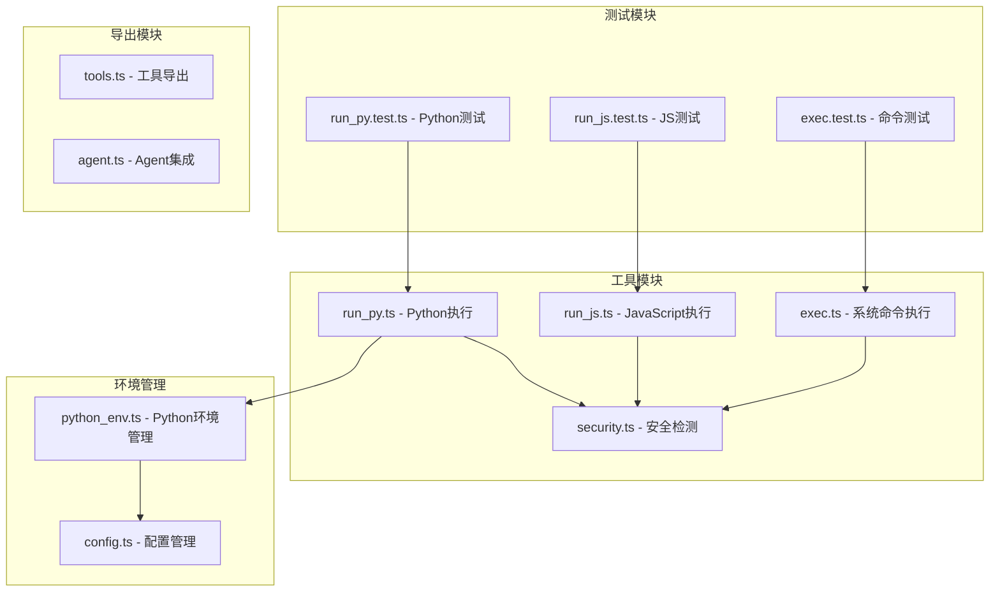
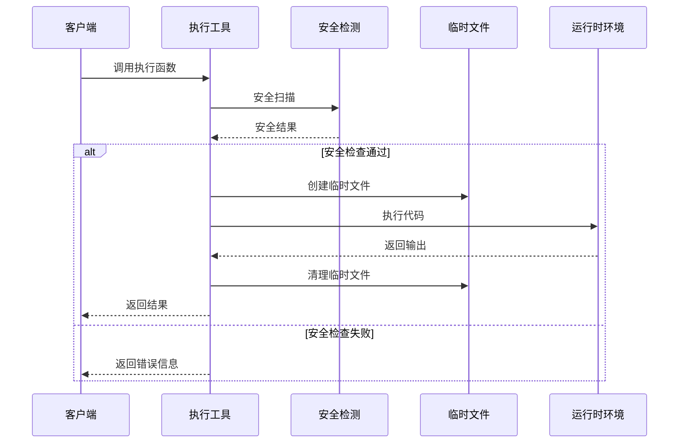
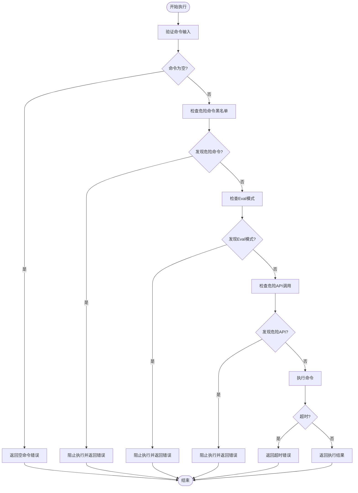
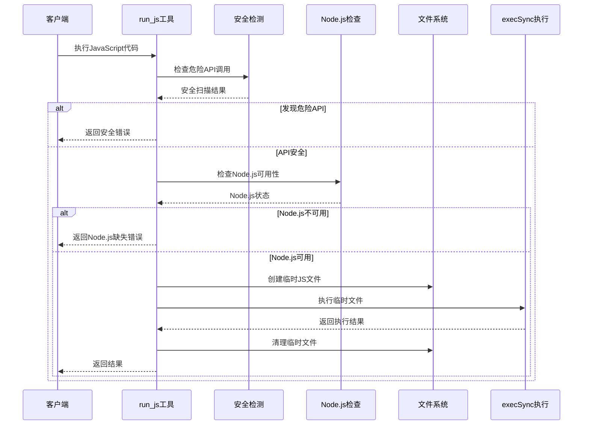
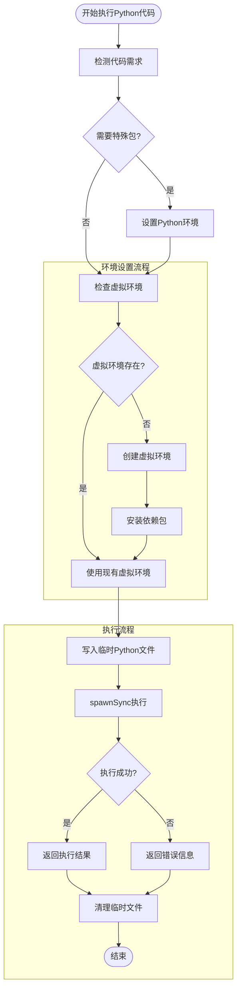
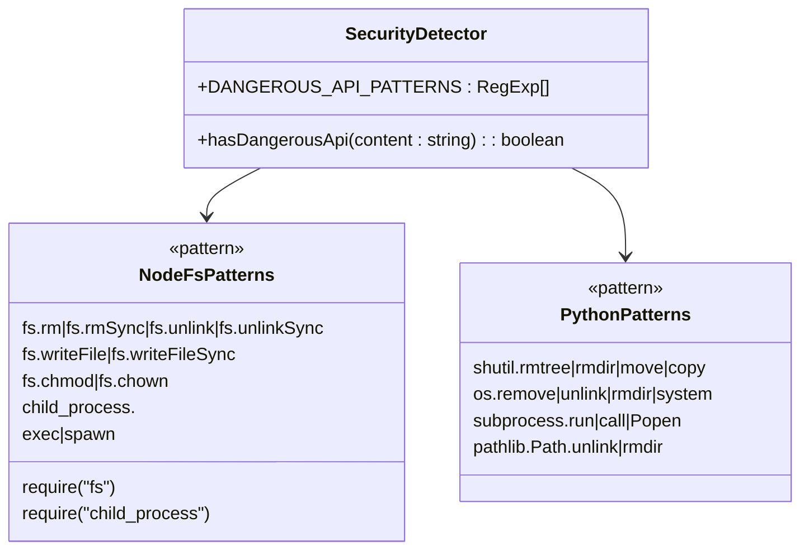
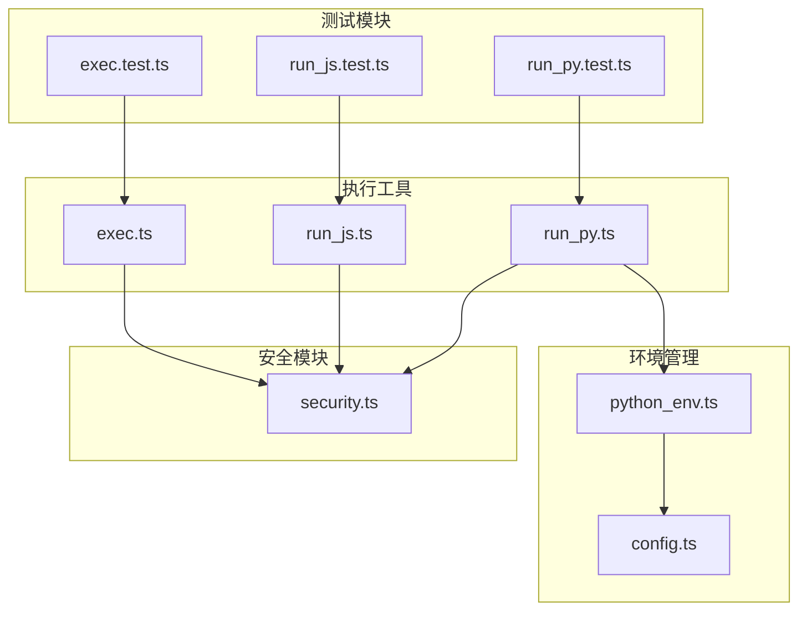

# 代码执行工具

<cite>
**本文档引用的文件**
- [exec.ts](file://src/agent/tools/exec.ts)
- [run_js.ts](file://src/agent/tools/run_js.ts)
- [run_py.ts](file://src/agent/tools/run_py.ts)
- [security.ts](file://src/agent/tools/security.ts)
- [python_env.ts](file://src/agent/python_env.ts)
- [config.ts](file://src/agent/config.ts)
- [exec.test.ts](file://src/agent/tools/exec.test.ts)
- [run_js.test.ts](file://src/agent/tools/run_js.test.ts)
- [run_py.test.ts](file://src/agent/tools/run_py.test.ts)
- [tools.ts](file://src/agent/tools.ts)
- [agent.ts](file://src/agent/agent.ts)
- [package.json](file://package.json)
</cite>

## 目录
1. [简介](#简介)
2. [项目结构](#项目结构)
3. [核心组件](#核心组件)
4. [架构概览](#架构概览)
5. [详细组件分析](#详细组件分析)
6. [依赖关系分析](#依赖关系分析)
7. [性能考虑](#性能考虑)
8. [故障排除指南](#故障排除指南)
9. [结论](#结论)

## 简介

代码执行工具是一个安全的代码执行框架，提供了三种主要的代码执行能力：
- **系统命令执行工具**：安全的shell命令执行，具备多层安全防护
- **JavaScript执行工具**：基于Node.js的代码执行，支持临时文件隔离
- **Python执行工具**：智能Python环境管理，支持虚拟环境和依赖管理

该系统采用多层安全防护机制，包括命令黑名单、危险API检测和临时文件隔离，确保代码执行的安全性。

## 项目结构

项目采用模块化的架构设计，主要分为以下几个核心模块：

**图表来源**
- [exec.ts:1-142](file://src/agent/tools/exec.ts#L1-L142)
- [run_js.ts:1-89](file://src/agent/tools/run_js.ts#L1-L89)
- [run_py.ts:1-94](file://src/agent/tools/run_py.ts#L1-L94)
- [security.ts:1-27](file://src/agent/tools/security.ts#L1-L27)
- [python_env.ts:1-223](file://src/agent/python_env.ts#L1-L223)
- [config.ts:1-146](file://src/agent/config.ts#L1-L146)

**章节来源**
- [exec.ts:1-142](file://src/agent/tools/exec.ts#L1-L142)
- [run_js.ts:1-89](file://src/agent/tools/run_js.ts#L1-L89)
- [run_py.ts:1-94](file://src/agent/tools/run_py.ts#L1-L94)
- [python_env.ts:1-223](file://src/agent/python_env.ts#L1-L223)
- [config.ts:1-146](file://src/agent/config.ts#L1-L146)

## 核心组件

### 安全防护体系

系统实现了三层安全防护机制：

1. **命令黑名单过滤**：阻止危险系统命令
2. **Eval模式检测**：防止通过解释器注入代码
3. **危险API调用检测**：扫描代码中的高危API调用

### 执行工具对比

| 特性 | exec工具 | run_js工具 | run_py工具 |
|------|----------|------------|------------|
| 执行方式 | 直接shell命令 | 临时文件执行 | 临时文件执行 |
| 超时控制 | 30秒 | 15秒 | 15秒 |
| 缓冲区限制 | 1MB | 512KB | 512KB |
| 安全检查 | ✓ | ✓ | ✓ |
| 临时文件清理 | ✗ | ✓ | ✓ |
| 平台支持 | 所有平台 | Windows/Linux/macOS | Windows/Linux/macOS |

**章节来源**
- [exec.ts:94-142](file://src/agent/tools/exec.ts#L94-L142)
- [run_js.ts:22-89](file://src/agent/tools/run_js.ts#L22-L89)
- [run_py.ts:11-94](file://src/agent/tools/run_py.ts#L11-L94)

## 架构概览

系统采用分层架构设计，每个执行工具都遵循相似的模式：

**图表来源**
- [exec.ts:94-142](file://src/agent/tools/exec.ts#L94-L142)
- [run_js.ts:22-89](file://src/agent/tools/run_js.ts#L22-L89)
- [run_py.ts:11-94](file://src/agent/tools/run_py.ts#L11-L94)

## 详细组件分析

### 系统命令执行工具 (exec.ts)

#### 安全防护机制

系统命令执行工具实现了完整的安全防护体系：

**图表来源**
- [exec.ts:94-142](file://src/agent/tools/exec.ts#L94-L142)

#### 危险命令黑名单

系统维护了完整的危险命令列表，包括但不限于：

- **文件操作类**：rm, rmdir, del, erase, rd
- **移动重命名类**：mv, move, ren, rename
- **复制覆盖类**：cp, copy, xcopy, robocopy
- **系统管理类**：shutdown, reboot, halt, poweroff
- **权限管理类**：chmod, chown, chattr
- **提权类**：sudo, su, doas
- **进程管理类**：kill, pkill, killall, taskkill

**章节来源**
- [exec.ts:6-64](file://src/agent/tools/exec.ts#L6-L64)
- [exec.ts:94-142](file://src/agent/tools/exec.ts#L94-L142)

### JavaScript执行工具 (run_js.ts)

#### 执行流程

JavaScript执行工具采用了更严格的安全措施：

**图表来源**
- [run_js.ts:22-89](file://src/agent/tools/run_js.ts#L22-L89)

#### 临时文件管理

JavaScript执行工具通过临时文件机制确保安全性：

- **文件命名**：使用随机字符串确保唯一性
- **位置选择**：使用系统临时目录
- **自动清理**：无论成功与否都会清理临时文件
- **编码设置**：统一使用UTF-8编码

**章节来源**
- [run_js.ts:22-89](file://src/agent/tools/run_js.ts#L22-L89)

### Python执行工具 (run_py.ts)

#### Python环境管理

Python执行工具集成了完整的环境管理系统：

**图表来源**
- [run_py.ts:11-94](file://src/agent/tools/run_py.ts#L11-L94)
- [python_env.ts:161-170](file://src/agent/python_env.ts#L161-L170)

#### Python环境配置

系统支持多种Python环境配置：

- **虚拟环境路径**：默认位于`.data/python-venv`
- **自动安装**：可配置是否自动安装缺失的依赖
- **镜像源配置**：支持自定义pip镜像源
- **平台兼容**：支持Windows和Unix系统

**章节来源**
- [run_py.ts:11-94](file://src/agent/tools/run_py.ts#L11-L94)
- [python_env.ts:161-223](file://src/agent/python_env.ts#L161-L223)
- [config.ts:22-31](file://src/agent/config.ts#L22-L31)

### 安全检测机制 (security.ts)

#### 危险API模式检测

系统实现了全面的危险API检测机制：

**图表来源**
- [security.ts:1-27](file://src/agent/tools/security.ts#L1-L27)

**章节来源**
- [security.ts:1-27](file://src/agent/tools/security.ts#L1-L27)

## 依赖关系分析

### 核心依赖关系

**图表来源**
- [tools.ts:1-10](file://src/agent/tools.ts#L1-L10)
- [exec.ts:1-4](file://src/agent/tools/exec.ts#L1-L4)
- [run_js.ts:1-7](file://src/agent/tools/run_js.ts#L1-L7)
- [run_py.ts:1-9](file://src/agent/tools/run_py.ts#L1-L9)

### 外部依赖

系统的主要外部依赖包括：

- **@langchain/core**：LangChain核心工具框架
- **zod**：类型验证和参数校验
- **Node.js内置模块**：child_process, fs, os, path等

**章节来源**
- [package.json:21-37](file://package.json#L21-L37)

## 性能考虑

### 超时控制

系统为不同类型的执行设置了合理的超时时间：

- **系统命令执行**：30秒超时，适合一般shell操作
- **JavaScript执行**：15秒超时，避免长时间运行的JS代码
- **Python执行**：15秒超时，考虑到Python启动时间

### 内存管理

系统在内存管理方面采取了以下措施：

- **缓冲区限制**：限制标准输出和错误输出大小
- **临时文件清理**：确保执行完成后清理临时文件
- **进程隔离**：每个执行都在独立的子进程中进行

### 平台兼容性

系统支持多平台运行，针对不同平台进行了优化：

- **Windows系统**：支持`py -3`命令行参数
- **Unix系统**：支持多个Python路径
- **macOS系统**：支持Homebrew安装路径

## 故障排除指南

### 常见问题及解决方案

#### Node.js环境问题

**问题**：JavaScript执行工具报错提示Node.js不可用
**解决方案**：
1. 确认Node.js已正确安装
2. 检查PATH环境变量
3. 重新启动终端或IDE

#### Python环境问题

**问题**：Python执行工具无法找到Python环境
**解决方案**：
1. 使用配置工具初始化Python环境
2. 检查Python安装路径
3. 验证虚拟环境创建状态

#### 权限问题

**问题**：系统命令执行被拒绝
**解决方案**：
1. 检查命令是否在黑名单中
2. 验证用户权限
3. 使用更安全的替代方案

#### 超时问题

**问题**：代码执行超时
**解决方案**：
1. 优化代码逻辑
2. 减少不必要的计算
3. 检查是否有死循环

**章节来源**
- [exec.test.ts:133-149](file://src/agent/tools/exec.test.ts#L133-L149)
- [run_js.test.ts:70-84](file://src/agent/tools/run_js.test.ts#L70-L84)
- [run_py.test.ts:70-84](file://src/agent/tools/run_py.test.ts#L70-L84)

## 结论

代码执行工具提供了一个安全、可靠的代码执行框架，具有以下特点：

### 安全特性
- 多层安全防护机制
- 危险API调用检测
- 临时文件隔离执行
- 进程级隔离

### 功能特性
- 支持多种编程语言
- 智能环境管理
- 完善的错误处理
- 可配置的超时控制

### 最佳实践建议
1. **优先使用run_js和run_py工具**而不是write_file + exec组合
2. **定期更新安全规则**以应对新的威胁
3. **合理配置超时时间**平衡性能和安全性
4. **监控执行日志**及时发现异常行为
5. **最小权限原则**确保执行环境权限受限

该系统为AI代理提供了安全的代码执行能力，同时保持了良好的用户体验和开发效率。