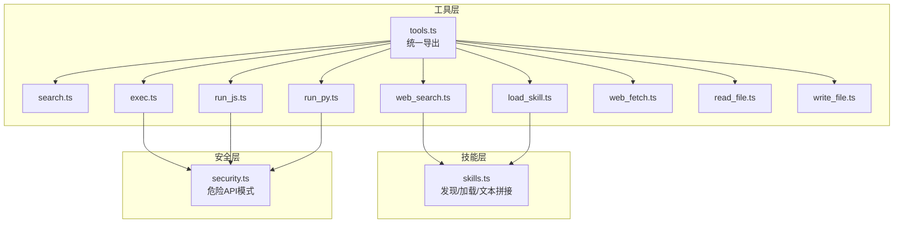
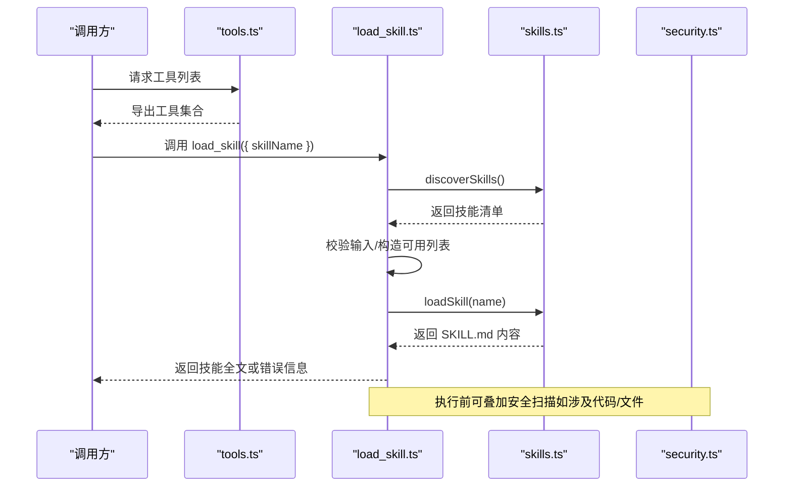
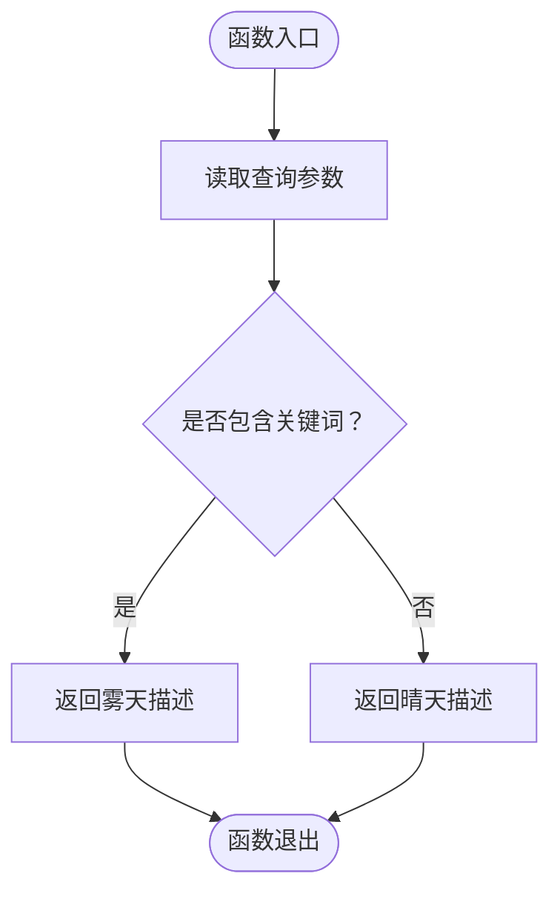
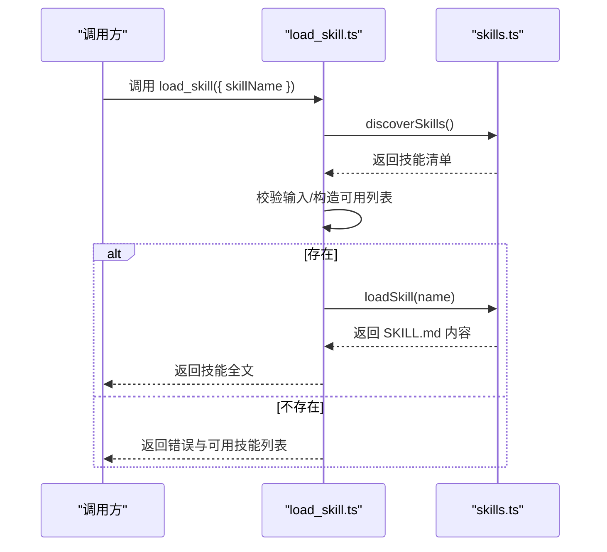
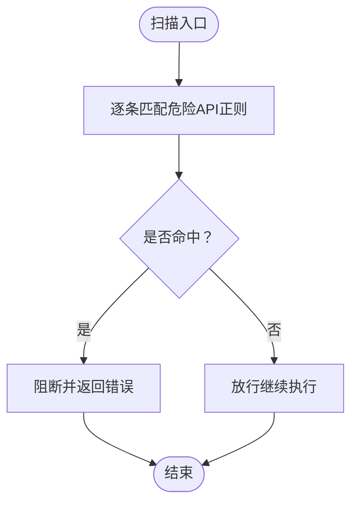
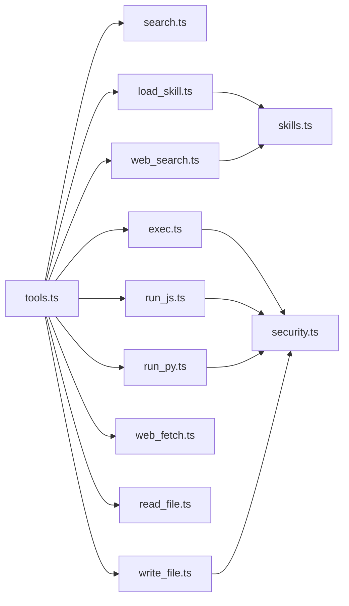

# 实用工具

<cite>
**本文引用的文件**
- [tools.ts](file://src/agent/tools.ts)
- [search.ts](file://src/agent/tools/search.ts)
- [load_skill.ts](file://src/agent/tools/load_skill.ts)
- [exec.ts](file://src/agent/tools/exec.ts)
- [run_js.ts](file://src/agent/tools/run_js.ts)
- [run_py.ts](file://src/agent/tools/run_py.ts)
- [web_search.ts](file://src/agent/tools/web_search.ts)
- [web_fetch.ts](file://src/agent/tools/web_fetch.ts)
- [read_file.ts](file://src/agent/tools/read_file.ts)
- [write_file.ts](file://src/agent/tools/write_file.ts)
- [security.ts](file://src/agent/tools/security.ts)
- [skills.ts](file://src/agent/skills.ts)
- [package.json](file://package.json)
- [search.test.ts](file://src/agent/tools/search.test.ts)
- [load_skill.test.ts](file://src/agent/tools/load_skill.test.ts)
</cite>

## 目录
1. [简介](#简介)
2. [项目结构](#项目结构)
3. [核心组件](#核心组件)
4. [架构总览](#架构总览)
5. [详细组件分析](#详细组件分析)
6. [依赖关系分析](#依赖关系分析)
7. [性能考量](#性能考量)
8. [故障排查指南](#故障排查指南)
9. [结论](#结论)
10. [附录](#附录)

## 简介
本文件面向“实用工具”模块，系统性阐述以下能力与机制：
- 通用搜索工具：基于规则的简单模糊匹配与结果分发
- 技能加载工具：技能发现、动态加载与依赖解析（通过安全扫描与前端数据）
- 工具注册与发现：统一导出入口与类型化工具定义
- 使用示例与配置：如何调用各工具、环境变量与参数校验
- 扩展与定制：新增工具、安全策略与最佳实践

## 项目结构
实用工具位于 src/agent/tools 下，采用按功能拆分的文件组织方式；技能发现与加载逻辑集中在 src/agent/skills.ts；安全策略由 src/agent/tools/security.ts 提供。

**图表来源**
- [tools.ts:1-10](file://src/agent/tools.ts#L1-L10)
- [search.ts:1-22](file://src/agent/tools/search.ts#L1-L22)
- [load_skill.ts:1-32](file://src/agent/tools/load_skill.ts#L1-L32)
- [exec.ts:1-142](file://src/agent/tools/exec.ts#L1-L142)
- [run_js.ts:1-89](file://src/agent/tools/run_js.ts#L1-L89)
- [run_py.ts:1-94](file://src/agent/tools/run_py.ts#L1-L94)
- [web_search.ts:1-39](file://src/agent/tools/web_search.ts#L1-L39)
- [web_fetch.ts:1-81](file://src/agent/tools/web_fetch.ts#L1-L81)
- [read_file.ts:1-40](file://src/agent/tools/read_file.ts#L1-L40)
- [write_file.ts:1-54](file://src/agent/tools/write_file.ts#L1-L54)
- [security.ts:1-27](file://src/agent/tools/security.ts#L1-L27)
- [skills.ts:1-142](file://src/agent/skills.ts#L1-L142)

**章节来源**
- [tools.ts:1-10](file://src/agent/tools.ts#L1-L10)
- [package.json:1-54](file://package.json#L1-L54)

## 核心组件
- 通用搜索工具：根据查询是否包含特定关键词进行分支返回，体现简单模糊匹配与结果分发。
- 技能加载工具：先发现可用技能列表，再按名称精确匹配并加载完整内容，提供可用技能清单与错误提示。
- 安全工具集：统一的危险API模式检测，覆盖Node.js fs、child_process、Python等常见高危调用。
- 文件与网络工具：读写文件的安全路径限制、Web抓取的URL校验与超时控制、Web搜索的外部服务集成。
- 代码执行工具：JavaScript与Python的沙箱式临时文件执行，结合超时与缓冲区限制，避免直接命令注入风险。

**章节来源**
- [search.ts:1-22](file://src/agent/tools/search.ts#L1-L22)
- [load_skill.ts:1-32](file://src/agent/tools/load_skill.ts#L1-L32)
- [security.ts:1-27](file://src/agent/tools/security.ts#L1-L27)
- [read_file.ts:1-40](file://src/agent/tools/read_file.ts#L1-L40)
- [write_file.ts:1-54](file://src/agent/tools/write_file.ts#L1-L54)
- [web_fetch.ts:1-81](file://src/agent/tools/web_fetch.ts#L1-L81)
- [web_search.ts:1-39](file://src/agent/tools/web_search.ts#L1-L39)
- [run_js.ts:1-89](file://src/agent/tools/run_js.ts#L1-L89)
- [run_py.ts:1-94](file://src/agent/tools/run_py.ts#L1-L94)

## 架构总览
工具体系以“类型化工具 + 安全扫描 + 技能发现”为核心，通过统一导出入口集中暴露给上层调用方。

**图表来源**
- [tools.ts:1-10](file://src/agent/tools.ts#L1-L10)
- [load_skill.ts:1-32](file://src/agent/tools/load_skill.ts#L1-L32)
- [skills.ts:56-86](file://src/agent/skills.ts#L56-L86)
- [skills.ts:93-121](file://src/agent/skills.ts#L93-L121)
- [security.ts:24-26](file://src/agent/tools/security.ts#L24-L26)

## 详细组件分析

### 通用搜索工具（searchTool）
- 功能概述：接收查询字符串，若包含特定关键词则返回特定天气描述，否则返回另一默认描述。体现简单规则驱动的“模糊匹配”与结果分发。
- 输入输出与约束：使用Zod Schema校验输入字段；无复杂排序/过滤逻辑。
- 测试要点：覆盖关键词命中、大小写不敏感、空查询等场景。

**图表来源**
- [search.ts:4-13](file://src/agent/tools/search.ts#L4-L13)

**章节来源**
- [search.ts:1-22](file://src/agent/tools/search.ts#L1-L22)
- [search.test.ts:1-34](file://src/agent/tools/search.test.ts#L1-L34)

### 技能加载工具（loadSkillTool）
- 发现与加载：先调用 discoverSkills 获取技能清单，再按名称精确匹配；若未找到则汇总可用技能名称作为友好提示；成功后调用 loadSkill 返回完整 SKILL.md 内容。
- 错误处理：缺失参数、技能不存在、加载失败均返回明确错误信息。
- 与技能层协作：依赖 skills.ts 的目录遍历、Frontmatter 解析与内容读取。

**图表来源**
- [load_skill.ts:5-22](file://src/agent/tools/load_skill.ts#L5-L22)
- [skills.ts:56-86](file://src/agent/skills.ts#L56-L86)
- [skills.ts:93-121](file://src/agent/skills.ts#L93-L121)

**章节来源**
- [load_skill.ts:1-32](file://src/agent/tools/load_skill.ts#L1-L32)
- [load_skill.test.ts:1-45](file://src/agent/tools/load_skill.test.ts#L1-L45)
- [skills.ts:1-142](file://src/agent/skills.ts#L1-L142)

### 安全扫描（security.ts）
- 模式覆盖：Node.js fs 模块的删除/写入/权限/链接；child_process 子进程调用；Python shutil/os/subprocess/pathlib 等高危模块。
- 使用方式：在文件写入、代码执行等高风险路径前置调用，返回布尔值决定是否阻断。

**图表来源**
- [security.ts:4-26](file://src/agent/tools/security.ts#L4-L26)

**章节来源**
- [security.ts:1-27](file://src/agent/tools/security.ts#L1-L27)

### 文件读取（readFileTool）
- 安全策略：解析相对路径，禁止越权访问当前工作目录之外的文件；拒绝目录读取。
- 异常处理：文件不存在、权限不足、IO异常等均返回明确错误信息。

**章节来源**
- [read_file.ts:1-40](file://src/agent/tools/read_file.ts#L1-L40)

### 文件写入（writeFileTool）
- 安全策略：路径越权检查；内容中禁止危险API调用。
- 行为：新建或覆盖写入UTF-8文本；返回成功消息或错误信息。

**章节来源**
- [write_file.ts:1-54](file://src/agent/tools/write_file.ts#L1-L54)
- [security.ts:24-26](file://src/agent/tools/security.ts#L24-L26)

### Shell 执行（execTool）
- 多层安全防护：危险命令名黑名单、eval风格注入模式、危险API调用检测。
- 执行细节：设置超时、缓冲区上限；捕获标准输出/错误输出；返回人类可读的错误信息。
- 使用建议：优先使用专用代码执行工具替代直接shell命令。

**章节来源**
- [exec.ts:1-142](file://src/agent/tools/exec.ts#L1-L142)
- [security.ts:24-26](file://src/agent/tools/security.ts#L24-L26)

### JavaScript 代码执行（runJsTool）
- 执行流程：前置安全扫描；检测Node可用性；写入临时文件；执行并清理；超时与缓冲区限制。
- 输出：返回stdout；错误时返回stderr或通用错误信息。

**章节来源**
- [run_js.ts:1-89](file://src/agent/tools/run_js.ts#L1-L89)
- [security.ts:24-26](file://src/agent/tools/security.ts#L24-L26)

### Python 代码执行（runPyTool）
- 执行流程：前置安全扫描；解析Python运行时；写入临时文件；执行并清理；超时与缓冲区限制。
- 输出：返回stdout；错误时返回stderr或通用错误信息。

**章节来源**
- [run_py.ts:1-94](file://src/agent/tools/run_py.ts#L1-L94)
- [security.ts:24-26](file://src/agent/tools/security.ts#L24-L26)

### Web 搜索（webSearchTool）
- 依赖：TavilySearch客户端；需要环境变量提供API密钥。
- 行为：封装调用并返回结果；异常时返回错误信息。

**章节来源**
- [web_search.ts:1-39](file://src/agent/tools/web_search.ts#L1-L39)

### Web 抓取（webFetchTool）
- 校验：URL协议仅允许http/https；超时控制；响应体大小限制。
- 行为：返回页面内容；异常时返回明确错误码与原因。

**章节来源**
- [web_fetch.ts:1-81](file://src/agent/tools/web_fetch.ts#L1-L81)

## 依赖关系分析
- 工具导出：tools.ts 统一导出各工具，便于上层按需引入。
- 技能依赖：load_skill.ts 依赖 skills.ts 的发现与加载能力。
- 安全依赖：exec、run_js、run_py、write_file 均依赖 security.ts 的危险API检测。
- 外部依赖：web_search 依赖 @langchain/tavily；整体工具链依赖 @langchain/core/zod 等。

**图表来源**
- [tools.ts:1-10](file://src/agent/tools.ts#L1-L10)
- [load_skill.ts:1-32](file://src/agent/tools/load_skill.ts#L1-L32)
- [exec.ts:1-142](file://src/agent/tools/exec.ts#L1-L142)
- [run_js.ts:1-89](file://src/agent/tools/run_js.ts#L1-L89)
- [run_py.ts:1-94](file://src/agent/tools/run_py.ts#L1-L94)
- [web_search.ts:1-39](file://src/agent/tools/web_search.ts#L1-L39)
- [web_fetch.ts:1-81](file://src/agent/tools/web_fetch.ts#L1-L81)
- [read_file.ts:1-40](file://src/agent/tools/read_file.ts#L1-L40)
- [write_file.ts:1-54](file://src/agent/tools/write_file.ts#L1-L54)
- [security.ts:1-27](file://src/agent/tools/security.ts#L1-L27)
- [skills.ts:1-142](file://src/agent/skills.ts#L1-L142)

**章节来源**
- [tools.ts:1-10](file://src/agent/tools.ts#L1-L10)
- [package.json:21-36](file://package.json#L21-L36)

## 性能考量
- 超时与缓冲：Shell执行与代码执行工具均设置超时与最大缓冲区，防止长时间阻塞与内存膨胀。
- I/O 限制：Web抓取限制响应大小，避免大体积内容导致资源占用过高。
- 目录遍历：技能发现对目录进行顺序遍历，建议保持技能数量合理增长，必要时可引入缓存或索引。

[本节为通用指导，无需列出章节来源]

## 故障排查指南
- 环境变量缺失：Web搜索工具需要API密钥；未设置时会返回错误提示。
- 路径越权：文件读写工具会拒绝越权访问，检查工作目录与相对路径。
- 危险操作阻断：任何触发危险API模式的代码或文件内容会被阻断；请移除高危调用。
- 超时与错误：执行类工具在超时或非零退出时返回明确错误信息；检查命令/代码与运行时环境。
- 技能不存在：技能加载工具会返回可用技能列表，确认名称一致且大小写正确。

**章节来源**
- [web_search.ts:16-28](file://src/agent/tools/web_search.ts#L16-L28)
- [read_file.ts:6-31](file://src/agent/tools/read_file.ts#L6-L31)
- [write_file.ts:7-41](file://src/agent/tools/write_file.ts#L7-L41)
- [exec.ts:94-132](file://src/agent/tools/exec.ts#L94-L132)
- [run_js.ts:22-75](file://src/agent/tools/run_js.ts#L22-L75)
- [run_py.ts:11-82](file://src/agent/tools/run_py.ts#L11-L82)
- [load_skill.ts:5-22](file://src/agent/tools/load_skill.ts#L5-L22)

## 结论
本实用工具体系以“安全优先、职责清晰、易于扩展”为目标：通过统一导出与类型化定义降低使用成本；通过多层安全扫描保障执行安全；通过技能发现与加载实现知识型工具的动态激活。建议在新增工具时遵循现有模式：类型化Schema、最小权限原则、明确错误反馈与超时控制。

[本节为总结性内容，无需列出章节来源]

## 附录

### 工具使用示例与配置
- 通用搜索工具：传入查询字符串，依据规则返回不同描述。
- 技能加载工具：传入技能名称，返回完整SKILL.md内容；若不存在则返回可用技能列表。
- 文件读取/写入：传入文件名，自动解析相对路径并进行越权检查；写入前进行危险API扫描。
- Shell执行：传入命令字符串，自动进行三重安全检查；建议优先使用专用代码执行工具。
- JavaScript/Python执行：传入代码字符串，自动写入临时文件执行并清理；超时与缓冲区限制已内置。
- Web搜索：设置环境变量后传入查询词；返回结构化结果。
- Web抓取：传入URL，自动校验协议与大小限制；返回页面内容或错误信息。

**章节来源**
- [search.ts:4-21](file://src/agent/tools/search.ts#L4-L21)
- [load_skill.ts:5-31](file://src/agent/tools/load_skill.ts#L5-L31)
- [read_file.ts:6-39](file://src/agent/tools/read_file.ts#L6-L39)
- [write_file.ts:7-53](file://src/agent/tools/write_file.ts#L7-L53)
- [exec.ts:94-141](file://src/agent/tools/exec.ts#L94-L141)
- [run_js.ts:22-88](file://src/agent/tools/run_js.ts#L22-L88)
- [run_py.ts:11-93](file://src/agent/tools/run_py.ts#L11-L93)
- [web_search.ts:16-38](file://src/agent/tools/web_search.ts#L16-L38)
- [web_fetch.ts:20-80](file://src/agent/tools/web_fetch.ts#L20-L80)

### 工具扩展与自定义开发指导
- 新增工具步骤
  - 在 src/agent/tools 下创建工具文件，使用工具工厂函数定义工具与Schema。
  - 如涉及高风险操作，复用安全扫描模块；在执行前进行阻断判断。
  - 在 tools.ts 中统一导出新工具，便于上层按需引入。
- 技能扩展步骤
  - 在 skills 目录下创建子目录并编写 SKILL.md（包含name与description的Frontmatter）。
  - 通过 discoverSkills 自动发现；通过 loadSkill 加载完整内容。
- 最佳实践
  - 明确输入输出与错误边界，使用Zod进行严格校验。
  - 对外暴露的工具应具备清晰的描述与用途说明。
  - 执行类工具务必设置超时与缓冲区上限，避免资源耗尽。
  - 优先采用临时文件执行代码，减少命令行转义与注入风险。

**章节来源**
- [tools.ts:1-10](file://src/agent/tools.ts#L1-L10)
- [security.ts:1-27](file://src/agent/tools/security.ts#L1-L27)
- [skills.ts:56-86](file://src/agent/skills.ts#L56-L86)
- [skills.ts:93-121](file://src/agent/skills.ts#L93-L121)