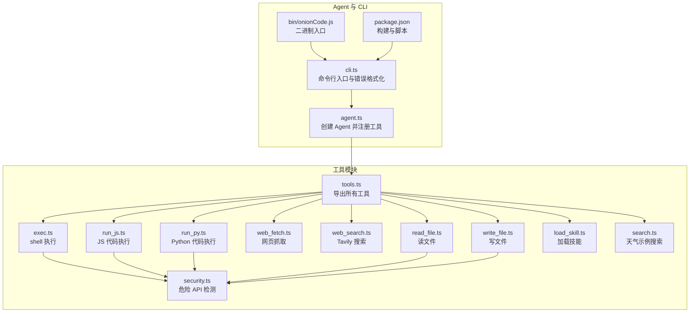
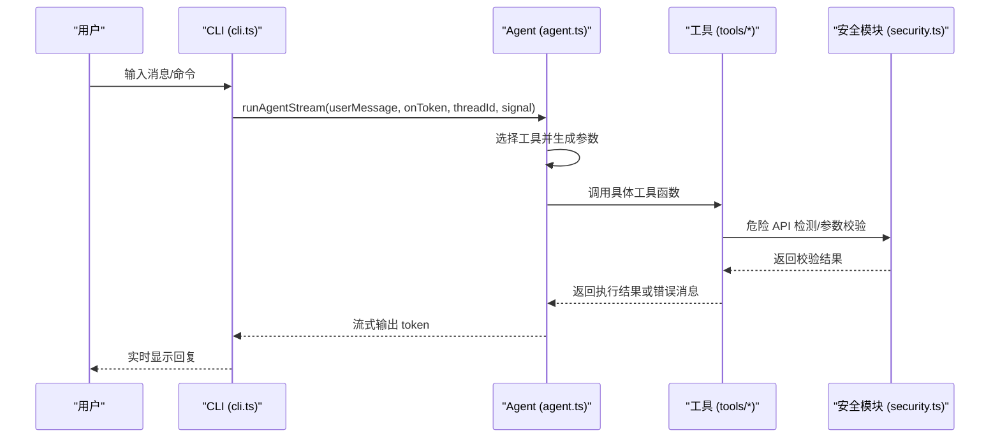
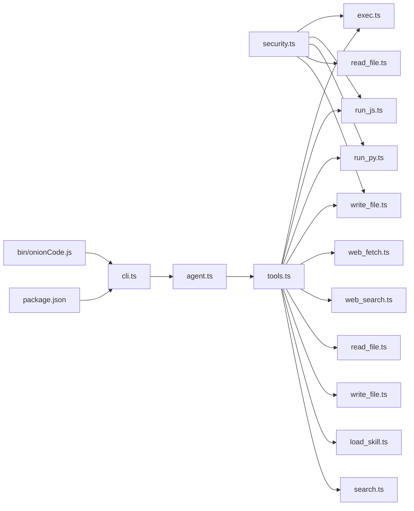

# 工具开发指南

<cite>
**本文引用的文件**
- [src/agent/tools.ts](file://src/agent/tools.ts)
- [src/agent/tools/exec.ts](file://src/agent/tools/exec.ts)
- [src/agent/tools/run_js.ts](file://src/agent/tools/run_js.ts)
- [src/agent/tools/run_py.ts](file://src/agent/tools/run_py.ts)
- [src/agent/tools/web_fetch.ts](file://src/agent/tools/web_fetch.ts)
- [src/agent/tools/security.ts](file://src/agent/tools/security.ts)
- [src/agent/tools/search.ts](file://src/agent/tools/search.ts)
- [src/agent/tools/read_file.ts](file://src/agent/tools/read_file.ts)
- [src/agent/tools/write_file.ts](file://src/agent/tools/write_file.ts)
- [src/agent/tools/web_search.ts](file://src/agent/tools/web_search.ts)
- [src/agent/tools/load_skill.ts](file://src/agent/tools/load_skill.ts)
- [src/agent/agent.ts](file://src/agent/agent.ts)
- [src/agent/cli.ts](file://src/agent/cli.ts)
- [bin/onionCode.js](file://bin/onionCode.js)
- [package.json](file://package.json)
</cite>

## 目录
1. 引言
2. 项目结构
3. 核心组件
4. 架构总览
5. 详细组件分析
6. 依赖关系分析
7. 性能考量
8. 故障排查指南
9. 结论
10. 附录

## 引言
本指南面向需要在本项目中开发、扩展与维护“工具”的工程师与高级用户。文档系统性阐述工具接口规范、参数校验与错误处理标准；解释工具注册、模块导入与动态加载策略；给出自定义工具的开发步骤、测试方法与部署流程；总结最佳实践（代码结构、安全性、性能）；说明工具与 Agent 系统的集成方式、数据流转与状态管理；并通过具体示例展示如何创建符合规范的新工具；最后提供版本管理、兼容性维护与文档编写的建议。

## 项目结构
本项目采用按功能域分层的组织方式：核心 Agent 位于 src/agent 下，工具集合位于 src/agent/tools，技能（skills）位于 src/agent/skills。入口 CLI 位于 src/agent/cli.ts，打包后的可执行文件通过 bin/onionCode.js 指向 dist/agent/cli.js。包管理与构建脚本位于 package.json。

图表来源
- [src/agent/tools.ts:1-10](file://src/agent/tools.ts#L1-L10)
- [src/agent/tools/exec.ts:1-143](file://src/agent/tools/exec.ts#L1-L143)
- [src/agent/tools/run_js.ts:1-90](file://src/agent/tools/run_js.ts#L1-L90)
- [src/agent/tools/run_py.ts:1-90](file://src/agent/tools/run_py.ts#L1-L90)
- [src/agent/tools/web_fetch.ts:1-83](file://src/agent/tools/web_fetch.ts#L1-L83)
- [src/agent/tools/web_search.ts:1-41](file://src/agent/tools/web_search.ts#L1-L41)
- [src/agent/tools/read_file.ts:1-41](file://src/agent/tools/read_file.ts#L1-L41)
- [src/agent/tools/write_file.ts:1-55](file://src/agent/tools/write_file.ts#L1-L55)
- [src/agent/tools/load_skill.ts:1-34](file://src/agent/tools/load_skill.ts#L1-L34)
- [src/agent/tools/security.ts:1-27](file://src/agent/tools/security.ts#L1-L27)
- [src/agent/tools/search.ts:1-24](file://src/agent/tools/search.ts#L1-L24)
- [src/agent/agent.ts:1-98](file://src/agent/agent.ts#L1-L98)
- [src/agent/cli.ts:1-126](file://src/agent/cli.ts#L1-L126)
- [bin/onionCode.js:1-3](file://bin/onionCode.js#L1-L3)
- [package.json:1-38](file://package.json#L1-L38)

章节来源
- [src/agent/tools.ts:1-10](file://src/agent/tools.ts#L1-L10)
- [src/agent/agent.ts:1-98](file://src/agent/agent.ts#L1-L98)
- [src/agent/cli.ts:1-126](file://src/agent/cli.ts#L1-L126)
- [bin/onionCode.js:1-3](file://bin/onionCode.js#L1-L3)
- [package.json:1-38](file://package.json#L1-L38)

## 核心组件
- 工具接口规范
  - 统一使用 LangChain 工具包装器创建工具函数，并提供明确的名称、描述与 Zod 参数模式(schema)，便于 LLM 正确调用与参数校验。
  - 工具函数签名统一为异步函数，接收一个对象参数，返回字符串或结构化结果；错误通过返回特定错误消息字符串进行标准化。
- 参数验证机制
  - 使用 Zod schema 对输入参数进行类型与约束校验；对空值、非法格式、越界长度等进行前置校验。
  - 对外部资源访问（URL、文件路径、命令行）进行白/黑名单与正则匹配校验，阻断潜在危险。
- 错误处理标准
  - 明确区分业务错误（如文件不存在、URL 不合法）、系统错误（超时、DNS 失败）、API 错误（认证失败、配额不足）与安全拦截（内容安全审查）。
  - 返回统一的错误消息格式，必要时携带上下文信息（如具体错误码、域名、大小限制等）。

章节来源
- [src/agent/tools/exec.ts:94-143](file://src/agent/tools/exec.ts#L94-L143)
- [src/agent/tools/run_js.ts:22-90](file://src/agent/tools/run_js.ts#L22-L90)
- [src/agent/tools/run_py.ts:22-90](file://src/agent/tools/run_py.ts#L22-L90)
- [src/agent/tools/web_fetch.ts:20-83](file://src/agent/tools/web_fetch.ts#L20-L83)
- [src/agent/tools/web_search.ts:16-41](file://src/agent/tools/web_search.ts#L16-L41)
- [src/agent/tools/read_file.ts:6-41](file://src/agent/tools/read_file.ts#L6-L41)
- [src/agent/tools/write_file.ts:7-55](file://src/agent/tools/write_file.ts#L7-L55)
- [src/agent/tools/load_skill.ts:5-34](file://src/agent/tools/load_skill.ts#L5-L34)
- [src/agent/tools/search.ts:4-24](file://src/agent/tools/search.ts#L4-L24)

## 架构总览
Agent 通过 LangGraph 创建，注册一组工具；CLI 提供命令行交互与流式输出；工具模块按职责拆分，共享安全检测与通用校验逻辑；构建产物通过二进制入口启动。

图表来源
- [src/agent/agent.ts:36-51](file://src/agent/agent.ts#L36-L51)
- [src/agent/cli.ts:46-57](file://src/agent/cli.ts#L46-L57)
- [src/agent/tools.ts:1-10](file://src/agent/tools.ts#L1-L10)
- [src/agent/tools/security.ts:24-27](file://src/agent/tools/security.ts#L24-L27)

## 详细组件分析

### 工具注册与导出
- 工具统一在 tools.ts 中集中导出，便于 Agent 侧一次性引入并注册。
- Agent 侧在创建 Agent 时将工具数组传入，完成工具注册与可用性声明。

章节来源
- [src/agent/tools.ts:1-10](file://src/agent/tools.ts#L1-L10)
- [src/agent/agent.ts:36-51](file://src/agent/agent.ts#L36-L51)

### 安全模块（危险 API 检测）
- 提供危险 API 模式列表与检测函数，覆盖 Node.js fs、子进程、核心模块 require/import，以及 Python shutil/os/subprocess/pathlib 等高危调用。
- 各工具在执行前调用该模块进行内容扫描，阻断潜在破坏性操作。

章节来源
- [src/agent/tools/security.ts:1-27](file://src/agent/tools/security.ts#L1-L27)
- [src/agent/tools/exec.ts:4-4](file://src/agent/tools/exec.ts#L4-L4)
- [src/agent/tools/run_js.ts:7-7](file://src/agent/tools/run_js.ts#L7-L7)
- [src/agent/tools/run_py.ts:7-7](file://src/agent/tools/run_py.ts#L7-L7)
- [src/agent/tools/read_file.ts:3-3](file://src/agent/tools/read_file.ts#L3-L3)
- [src/agent/tools/write_file.ts:5-5](file://src/agent/tools/write_file.ts#L5-L5)

### 文件读取工具（read_file）
- 路径解析与安全边界检查：基于当前工作目录解析目标路径，禁止路径逃逸至当前目录之外。
- 文件存在性与类型检查：若目标为目录则拒绝读取；文件不存在返回明确错误。
- 成功读取后返回文件内容；异常捕获并返回友好错误信息。

章节来源
- [src/agent/tools/read_file.ts:6-41](file://src/agent/tools/read_file.ts#L6-L41)

### 文件写入工具（write_file）
- 路径安全检查与类型检查同读取工具。
- 内容安全扫描：调用危险 API 检测函数，阻断包含破坏性 API 的内容。
- 成功写入后返回成功消息；异常捕获并返回错误信息。

章节来源
- [src/agent/tools/write_file.ts:7-55](file://src/agent/tools/write_file.ts#L7-L55)
- [src/agent/tools/security.ts:24-27](file://src/agent/tools/security.ts#L24-L27)

### Shell 命令执行工具（exec）
- 多层安全防护：
  - 黑名单命令集：覆盖删除、移动、复制、格式化、关机、提权、用户管理、进程管理、链接、危险网络下载、压缩等命令。
  - Eval 模式检测：识别 node -e、python -c 等注入式命令。
  - 危险 API 检测：共享模块扫描内容中的高危调用。
- 参数校验：空命令直接返回错误。
- 执行与错误处理：设置超时与缓冲区上限；捕获 stderr/stdout 与超时错误，返回统一错误消息。

章节来源
- [src/agent/tools/exec.ts:6-143](file://src/agent/tools/exec.ts#L6-L143)
- [src/agent/tools/security.ts:24-27](file://src/agent/tools/security.ts#L24-L27)

### JS 代码执行工具（run_js）
- 环境检测：检查 Node.js 是否可用。
- 临时文件执行：将代码写入系统临时目录并调用 node 执行，避免命令行转义复杂性。
- 安全扫描与错误处理：与 exec 类似，统一超时与缓冲区限制，finally 清理临时文件。

章节来源
- [src/agent/tools/run_js.ts:22-90](file://src/agent/tools/run_js.ts#L22-L90)
- [src/agent/tools/security.ts:24-27](file://src/agent/tools/security.ts#L24-L27)

### Python 代码执行工具（run_py）
- 环境检测：检查 python3 是否可用。
- 临时文件执行：将代码写入临时目录并调用 python3 执行。
- 安全扫描与错误处理：与 run_js 类似，finally 清理临时文件。

章节来源
- [src/agent/tools/run_py.ts:22-90](file://src/agent/tools/run_py.ts#L22-L90)
- [src/agent/tools/security.ts:24-27](file://src/agent/tools/security.ts#L24-L27)

### 网页抓取工具（web_fetch）
- URL 校验：仅允许 http/https 协议，非法协议直接返回错误。
- 请求控制：设置超时与最大响应大小，防止资源滥用。
- 错误处理：区分超时、DNS 解析失败、连接被拒、连接重置等场景，返回明确错误信息。

章节来源
- [src/agent/tools/web_fetch.ts:20-83](file://src/agent/tools/web_fetch.ts#L20-L83)

### Tavily 搜索工具（web_search）
- 初始化客户端：封装 TavilySearch 客户端，提供最大结果数与主题配置。
- 环境变量校验：若未配置 API Key，返回明确错误提示。
- 错误处理：捕获并返回底层异常信息。

章节来源
- [src/agent/tools/web_search.ts:16-41](file://src/agent/tools/web_search.ts#L16-L41)

### 技能加载工具（load_skill）
- 技能发现与校验：先列出可用技能，再根据名称精确匹配，不存在时返回可用技能清单。
- 加载与回传：成功加载后返回技能完整内容；失败返回错误消息。

章节来源
- [src/agent/tools/load_skill.ts:5-34](file://src/agent/tools/load_skill.ts#L5-L34)

### 示例搜索工具（search）
- 简单示例：用于演示工具的基本结构与日志输出，不涉及外部依赖或安全风险。

章节来源
- [src/agent/tools/search.ts:4-24](file://src/agent/tools/search.ts#L4-L24)

### Agent 集成与流式输出
- Agent 创建：在 agent.ts 中创建 Agent，注册工具数组，注入系统提示（含技能文本），并启用内存检查点。
- 流式运行：runAgentStream 将 token 逐个回调给调用方，支持中断信号与线程 ID 维持会话历史。

章节来源
- [src/agent/agent.ts:36-98](file://src/agent/agent.ts#L36-L98)

### CLI 与错误格式化
- 命令定义：支持 ask 子命令与默认交互式聊天。
- 错误格式化：针对内容安全拦截、API Key 无效、额度不足、超时等常见错误提供友好提示。
- 中断支持：监听 ESC 键中断当前流式输出。

章节来源
- [src/agent/cli.ts:40-126](file://src/agent/cli.ts#L40-L126)

## 依赖关系分析
- 工具与安全模块：exec、run_js、run_py、read_file、write_file 共享 security.ts 的危险 API 检测能力。
- Agent 与工具：agent.ts 通过 tools.ts 导出的工具集合完成注册。
- CLI 与 Agent：cli.ts 调用 agent.ts 的 runAgentStream 实现流式对话。
- 构建与入口：package.json 定义构建脚本与二进制入口；bin/onionCode.js 直接加载 dist/agent/cli.js。

图表来源
- [src/agent/tools.ts:1-10](file://src/agent/tools.ts#L1-L10)
- [src/agent/tools/exec.ts:1-143](file://src/agent/tools/exec.ts#L1-L143)
- [src/agent/tools/run_js.ts:1-90](file://src/agent/tools/run_js.ts#L1-L90)
- [src/agent/tools/run_py.ts:1-90](file://src/agent/tools/run_py.ts#L1-L90)
- [src/agent/tools/web_fetch.ts:1-83](file://src/agent/tools/web_fetch.ts#L1-L83)
- [src/agent/tools/web_search.ts:1-41](file://src/agent/tools/web_search.ts#L1-L41)
- [src/agent/tools/read_file.ts:1-41](file://src/agent/tools/read_file.ts#L1-L41)
- [src/agent/tools/write_file.ts:1-55](file://src/agent/tools/write_file.ts#L1-L55)
- [src/agent/tools/load_skill.ts:1-34](file://src/agent/tools/load_skill.ts#L1-L34)
- [src/agent/tools/search.ts:1-24](file://src/agent/tools/search.ts#L1-L24)
- [src/agent/agent.ts:1-98](file://src/agent/agent.ts#L1-L98)
- [src/agent/cli.ts:1-126](file://src/agent/cli.ts#L1-L126)
- [bin/onionCode.js:1-3](file://bin/onionCode.js#L1-L3)
- [package.json:1-38](file://package.json#L1-L38)

章节来源
- [src/agent/tools.ts:1-10](file://src/agent/tools.ts#L1-L10)
- [src/agent/agent.ts:36-51](file://src/agent/agent.ts#L36-L51)
- [src/agent/cli.ts:40-126](file://src/agent/cli.ts#L40-L126)
- [bin/onionCode.js:1-3](file://bin/onionCode.js#L1-L3)
- [package.json:1-38](file://package.json#L1-L38)

## 性能考量
- 超时与缓冲区限制：命令执行与代码执行工具均设置超时与 maxBuffer，避免长时间阻塞与内存膨胀。
- 网络请求限制：web_fetch 设置超时与最大响应大小，防止大体积响应导致内存压力。
- 临时文件清理：JS/Python 执行工具在 finally 中清理临时文件，降低磁盘占用与残留风险。
- 日志与可观测性：工具内部打印调用日志，便于定位问题与审计。

章节来源
- [src/agent/tools/exec.ts:111-133](file://src/agent/tools/exec.ts#L111-L133)
- [src/agent/tools/run_js.ts:46-75](file://src/agent/tools/run_js.ts#L46-L75)
- [src/agent/tools/run_py.ts:46-75](file://src/agent/tools/run_py.ts#L46-L75)
- [src/agent/tools/web_fetch.ts:30-72](file://src/agent/tools/web_fetch.ts#L30-L72)

## 故障排查指南
- 常见错误分类与处理
  - 内容安全拦截：模型返回内容触发安全拦截时，CLI 提供明确提示与改进建议。
  - 认证失败：API Key 无效或缺失时，CLI 提示检查环境变量配置。
  - 额度不足/429：提示检查账户余额与配额。
  - 超时：网络或工具执行超时，提示检查网络与资源限制。
  - 文件/路径错误：文件不存在、目录访问、路径逃逸等，返回具体错误信息。
  - 危险操作阻断：命令/代码/内容包含危险 API，返回阻断原因。
- 排查步骤
  - 检查环境变量（OPENAI_API_KEY、TAVILY_API_KEY）是否正确配置。
  - 检查工具参数是否满足 schema 与范围要求。
  - 查看工具日志与返回的错误消息，定位具体环节。
  - 对于网络类错误，确认 DNS、代理与防火墙设置。

章节来源
- [src/agent/cli.ts:10-38](file://src/agent/cli.ts#L10-L38)
- [src/agent/tools/exec.ts:96-133](file://src/agent/tools/exec.ts#L96-L133)
- [src/agent/tools/run_js.ts:24-75](file://src/agent/tools/run_js.ts#L24-L75)
- [src/agent/tools/run_py.ts:24-75](file://src/agent/tools/run_py.ts#L24-L75)
- [src/agent/tools/web_fetch.ts:22-72](file://src/agent/tools/web_fetch.ts#L22-L72)
- [src/agent/tools/web_search.ts:20-31](file://src/agent/tools/web_search.ts#L20-L31)
- [src/agent/tools/read_file.ts:17-32](file://src/agent/tools/read_file.ts#L17-L32)
- [src/agent/tools/write_file.ts:18-42](file://src/agent/tools/write_file.ts#L18-L42)

## 结论
本指南提供了从接口规范、安全与性能到部署与故障排查的完整工具开发路径。遵循统一的工具模板、参数校验与错误处理标准，结合共享的安全检测模块与 Agent 注册机制，可以高效、安全地扩展工具集并稳定集成到 Agent 系统中。

## 附录

### 开发新工具的标准流程
- 设计阶段
  - 明确工具职责、输入参数与预期输出；确定是否需要外部依赖与环境要求。
  - 规划参数校验策略（Zod schema、URL/路径合法性、大小限制等）。
  - 评估安全风险，决定是否需要危险 API 检测与黑名单/白名单策略。
- 实现阶段
  - 在 src/agent/tools 新建文件，使用工具包装器创建工具函数，定义 schema。
  - 编写参数校验与错误处理分支，确保返回统一的错误消息格式。
  - 如需，调用 shared security 模块进行内容扫描。
  - 添加必要的超时、缓冲区与资源限制。
- 集成阶段
  - 在 tools.ts 中导出新工具。
  - 在 agent.ts 的工具数组中注册新工具。
- 测试阶段
  - 编写单元测试覆盖正常路径、边界条件与错误路径。
  - 使用 CLI 进行端到端验证，关注流式输出与中断行为。
- 部署阶段
  - 执行构建脚本，确保 dist 目录包含新工具与技能资源。
  - 通过二进制入口 onionCode 进行验证。

章节来源
- [src/agent/tools.ts:1-10](file://src/agent/tools.ts#L1-L10)
- [src/agent/agent.ts:36-51](file://src/agent/agent.ts#L36-L51)
- [package.json:11-16](file://package.json#L11-L16)
- [bin/onionCode.js:1-3](file://bin/onionCode.js#L1-L3)

### 版本管理与兼容性维护
- 版本号：package.json 中的 version 字段用于标识发布版本。
- 构建与分发：构建脚本负责编译 TypeScript 并复制技能资源，确保 dist 产物完整。
- 兼容性：新增工具应保持与现有工具一致的错误消息格式与日志风格；对外部依赖（如 Tavily、Node/Python 环境）提供明确的可用性检查与降级提示。

章节来源
- [package.json:1-38](file://package.json#L1-L38)

### 文档编写指南
- 工具文档：每个工具应在注释中说明用途、参数含义、返回值与典型错误；在仓库内提供示例与使用说明。
- API 文档：基于 Zod schema 自动生成参数表；在 README 或技能目录中汇总工具清单与调用示例。
- 变更日志：记录工具新增、修改与破坏性变更，标注版本与影响范围。

[本节为通用指导，无需特定文件引用]