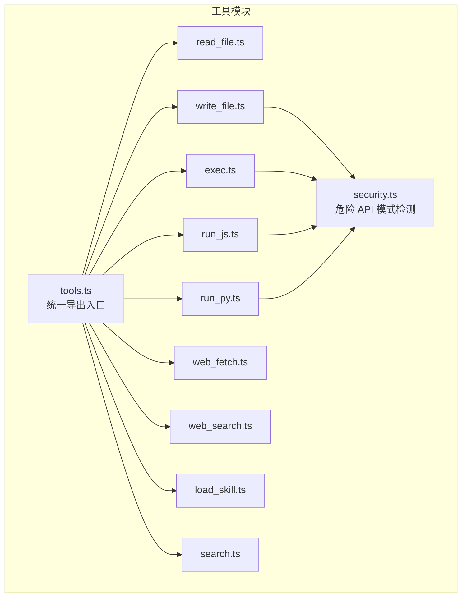
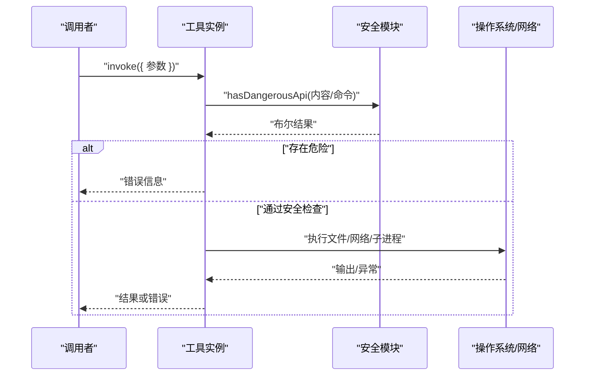
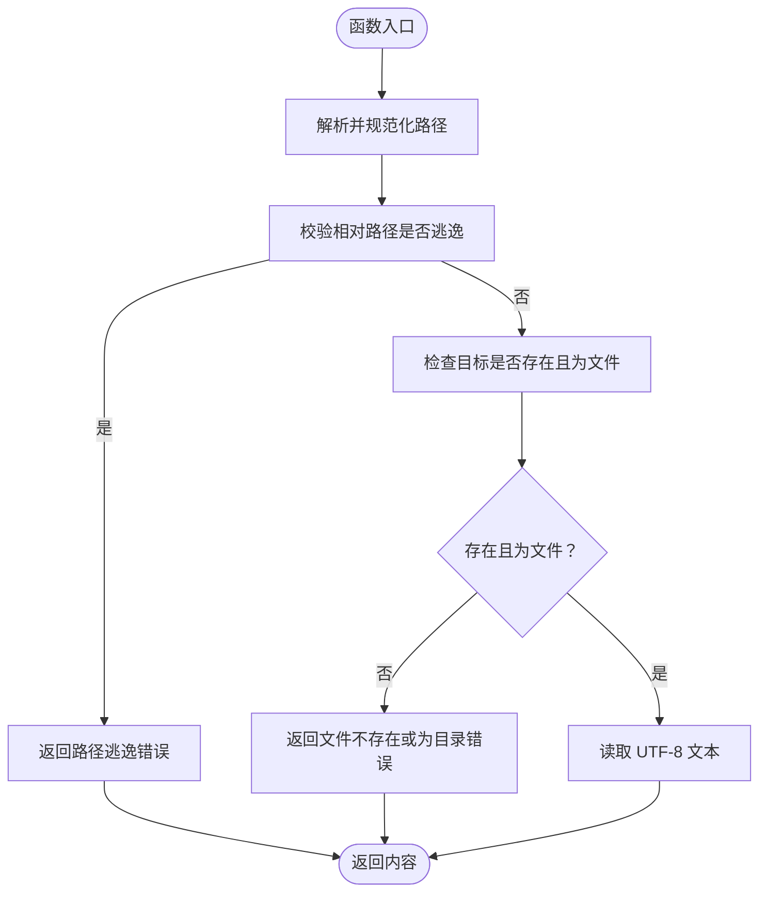
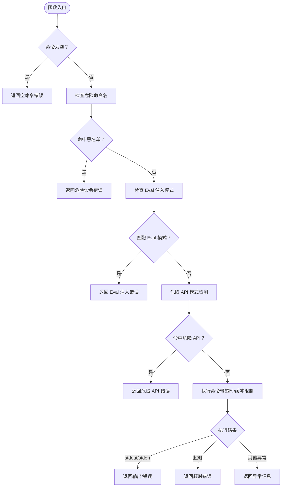
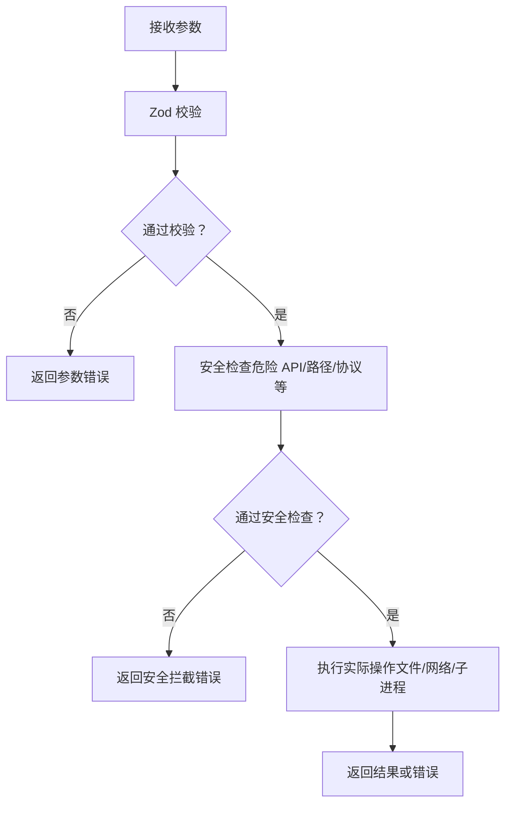
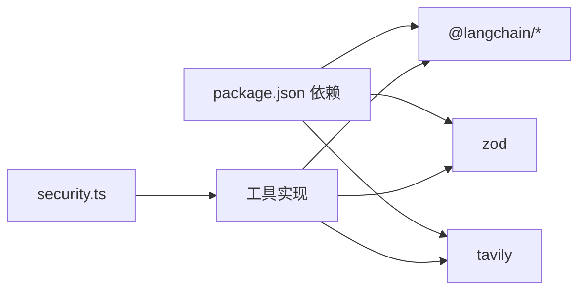

# 工具系统

<cite>
**本文引用的文件**
- [tools.ts](file://src/agent/tools.ts)
- [security.ts](file://src/agent/tools/security.ts)
- [exec.ts](file://src/agent/tools/exec.ts)
- [read_file.ts](file://src/agent/tools/read_file.ts)
- [write_file.ts](file://src/agent/tools/write_file.ts)
- [run_js.ts](file://src/agent/tools/run_js.ts)
- [run_py.ts](file://src/agent/tools/run_py.ts)
- [web_fetch.ts](file://src/agent/tools/web_fetch.ts)
- [web_search.ts](file://src/agent/tools/web_search.ts)
- [load_skill.ts](file://src/agent/tools/load_skill.ts)
- [search.ts](file://src/agent/tools/search.ts)
- [exec.test.ts](file://src/agent/tools/exec.test.ts)
- [read_file.test.ts](file://src/agent/tools/read_file.test.ts)
- [web_fetch.test.ts](file://src/agent/tools/web_fetch.test.ts)
- [package.json](file://package.json)
- [onionCode.js](file://bin/onionCode.js)
</cite>

## 目录
1. [简介](#简介)
2. [项目结构](#项目结构)
3. [核心组件](#核心组件)
4. [架构总览](#架构总览)
5. [详细组件分析](#详细组件分析)
6. [依赖关系分析](#依赖关系分析)
7. [性能考虑](#性能考虑)
8. [故障排查指南](#故障排查指南)
9. [结论](#结论)
10. [附录](#附录)

## 简介
本文件为工具系统的综合技术文档，面向开发者与使用者，系统性阐述工具架构设计、工具注册机制与统一接口规范；深入解析文件操作、网络访问与代码执行等工具的功能特性、使用方法与安全限制；提供工具开发指南（如何创建自定义工具、参数校验与错误处理）、安全沙箱机制、时间超时控制与 API 访问限制；并给出具体使用示例与性能优化建议。

## 项目结构
工具系统位于 src/agent/tools 目录下，采用“按功能分文件”的组织方式，每个工具独立实现并导出一个 LangChain 工具实例。工具通过集中导出入口统一对外暴露，便于上层 Agent 组合调用。

图表来源
- [tools.ts:1-10](file://src/agent/tools.ts#L1-L10)
- [security.ts:1-27](file://src/agent/tools/security.ts#L1-L27)
- [read_file.ts:1-41](file://src/agent/tools/read_file.ts#L1-L41)
- [write_file.ts:1-55](file://src/agent/tools/write_file.ts#L1-L55)
- [exec.ts:1-143](file://src/agent/tools/exec.ts#L1-L143)
- [run_js.ts:1-90](file://src/agent/tools/run_js.ts#L1-L90)
- [run_py.ts:1-90](file://src/agent/tools/run_py.ts#L1-L90)
- [web_fetch.ts:1-83](file://src/agent/tools/web_fetch.ts#L1-L83)
- [web_search.ts:1-41](file://src/agent/tools/web_search.ts#L1-L41)
- [load_skill.ts:1-34](file://src/agent/tools/load_skill.ts#L1-L34)
- [search.ts:1-24](file://src/agent/tools/search.ts#L1-L24)

章节来源
- [tools.ts:1-10](file://src/agent/tools.ts#L1-L10)
- [package.json:1-38](file://package.json#L1-L38)

## 核心组件
- 工具注册与导出
  - 统一导出入口负责聚合各工具实例，便于上层按名称或集合进行装配与调用。
- 安全中心模块
  - 危险 API 模式检测，跨文件操作、命令执行与代码运行工具共享使用，形成一致的安全基线。
- 文件操作工具
  - 读取与写入文件，内置路径逃逸防护与内容危险 API 检测。
- 网络工具
  - Web 页面抓取（带协议限制、超时与响应大小限制）与基于第三方服务的搜索工具。
- 代码执行工具
  - 在沙箱化临时文件中执行 JavaScript 与 Python 代码，限制危险 API 并设置超时。
- 技能加载工具
  - 加载预置技能内容，提供可用技能列表与错误提示。

章节来源
- [tools.ts:1-10](file://src/agent/tools.ts#L1-L10)
- [security.ts:1-27](file://src/agent/tools/security.ts#L1-L27)
- [read_file.ts:1-41](file://src/agent/tools/read_file.ts#L1-L41)
- [write_file.ts:1-55](file://src/agent/tools/write_file.ts#L1-L55)
- [exec.ts:1-143](file://src/agent/tools/exec.ts#L1-L143)
- [run_js.ts:1-90](file://src/agent/tools/run_js.ts#L1-L90)
- [run_py.ts:1-90](file://src/agent/tools/run_py.ts#L1-L90)
- [web_fetch.ts:1-83](file://src/agent/tools/web_fetch.ts#L1-L83)
- [web_search.ts:1-41](file://src/agent/tools/web_search.ts#L1-L41)
- [load_skill.ts:1-34](file://src/agent/tools/load_skill.ts#L1-L34)
- [search.ts:1-24](file://src/agent/tools/search.ts#L1-L24)

## 架构总览
工具系统以“LangChain 工具”为核心抽象，所有工具均遵循统一的接口规范：输入参数由 Zod Schema 描述，返回值为字符串或结构化结果；同时在实现层叠加多层安全策略与资源限制，确保在可控范围内提供强大能力。

图表来源
- [exec.ts:94-142](file://src/agent/tools/exec.ts#L94-L142)
- [security.ts:24-26](file://src/agent/tools/security.ts#L24-L26)
- [run_js.ts:22-89](file://src/agent/tools/run_js.ts#L22-L89)
- [run_py.ts:22-89](file://src/agent/tools/run_py.ts#L22-L89)
- [web_fetch.ts:20-82](file://src/agent/tools/web_fetch.ts#L20-L82)

## 详细组件分析

### 文件读取工具（read_file）
- 功能概述
  - 在当前工作目录内安全读取文件内容，拒绝路径逃逸与目录读取。
- 关键特性
  - 路径规范化与相对路径校验，防止越权访问。
  - 文件存在性与类型检查，错误信息明确。
- 使用要点
  - 仅支持当前目录内的文件读取。
  - 返回纯文本内容或错误信息。
- 安全与限制
  - 无危险 API 检测（只读），但严格限制路径范围。

图表来源
- [read_file.ts:6-32](file://src/agent/tools/read_file.ts#L6-L32)

章节来源
- [read_file.ts:1-41](file://src/agent/tools/read_file.ts#L1-L41)
- [read_file.test.ts:1-47](file://src/agent/tools/read_file.test.ts#L1-L47)

### 文件写入工具（write_file）
- 功能概述
  - 在当前工作目录内创建或覆盖文件；对内容进行危险 API 检测。
- 关键特性
  - 路径逃逸防护与文件类型检查。
  - 内容级危险 API 拦截，避免直接写入破坏性代码。
- 使用要点
  - 仅允许写入当前目录内的文件。
  - 写入成功返回确认信息。
- 安全与限制
  - 与 exec、run_js/py 共享危险 API 检测规则。

章节来源
- [write_file.ts:1-55](file://src/agent/tools/write_file.ts#L1-L55)
- [security.ts:1-27](file://src/agent/tools/security.ts#L1-L27)

### Shell 命令执行工具（exec）
- 功能概述
  - 在当前工作目录执行任意 shell 命令，内置三层安全防护与超时控制。
- 三层安全策略
  - 危险命令名黑名单（删除、移动、复制、提权、进程控制、链接、压缩、系统关机等）。
  - Eval 注入模式检测（禁止通过解释器参数注入代码）。
  - 危险 API 模式检测（跨语言危险调用）。
- 资源限制
  - 超时：30 秒。
  - 输出缓冲上限：1MB。
- 使用要点
  - 命令不能为空；返回标准输出或错误信息。
- 安全与限制
  - 任何触发拦截的行为将被拒绝并返回明确错误。

图表来源
- [exec.ts:94-142](file://src/agent/tools/exec.ts#L94-L142)
- [security.ts:24-26](file://src/agent/tools/security.ts#L24-L26)

章节来源
- [exec.ts:1-143](file://src/agent/tools/exec.ts#L1-L143)
- [exec.test.ts:1-150](file://src/agent/tools/exec.test.ts#L1-L150)
- [security.ts:1-27](file://src/agent/tools/security.ts#L1-L27)

### JavaScript 代码执行工具（run_js）
- 功能概述
  - 将代码写入临时文件后通过 Node.js 执行，返回标准输出。
- 安全与限制
  - 危险 API 检测（同上）。
  - 超时：15 秒；输出缓冲上限：512KB。
  - 依赖 Node.js 环境可用性检测。
  - 执行后清理临时文件（忽略清理失败）。
- 使用要点
  - 使用 console.log 输出结果；空代码将被拒绝。

章节来源
- [run_js.ts:1-90](file://src/agent/tools/run_js.ts#L1-L90)
- [security.ts:1-27](file://src/agent/tools/security.ts#L1-L27)

### Python 代码执行工具（run_py）
- 功能概述
  - 将代码写入临时文件后通过 python3 执行，返回标准输出。
- 安全与限制
  - 危险 API 检测（同上）。
  - 超时：15 秒；输出缓冲上限：512KB。
  - 依赖 Python3 环境可用性检测。
  - 执行后清理临时文件（忽略清理失败）。
- 使用要点
  - 使用 print 输出结果；空代码将被拒绝。

章节来源
- [run_py.ts:1-90](file://src/agent/tools/run_py.ts#L1-L90)
- [security.ts:1-27](file://src/agent/tools/security.ts#L1-L27)

### Web 页面抓取工具（web_fetch）
- 功能概述
  - 仅允许 http/https 协议，抓取网页内容并返回文本。
- 安全与限制
  - URL 校验（协议白名单）。
  - 超时：15 秒；响应体最大 512KB。
  - 明确的网络错误分类（DNS、连接被拒、连接复位等）。
- 使用要点
  - 返回原始文本或错误信息；自动跟随重定向。

章节来源
- [web_fetch.ts:1-83](file://src/agent/tools/web_fetch.ts#L1-L83)
- [web_fetch.test.ts:1-145](file://src/agent/tools/web_fetch.test.ts#L1-L145)

### Web 搜索工具（web_search）
- 功能概述
  - 基于第三方服务进行实时网络搜索，返回结构化结果。
- 安全与限制
  - 依赖环境变量配置；未配置时返回错误。
- 使用要点
  - 适合需要最新信息的场景。

章节来源
- [web_search.ts:1-41](file://src/agent/tools/web_search.ts#L1-L41)

### 技能加载工具（load_skill）
- 功能概述
  - 根据技能名称加载完整内容；提供可用技能列表与错误提示。
- 使用要点
  - 先验证技能存在性，再加载内容。

章节来源
- [load_skill.ts:1-34](file://src/agent/tools/load_skill.ts#L1-L34)

### 概念性概览
以下为概念性流程图，展示工具调用的一般过程与安全检查点，不绑定具体源码文件。

## 依赖关系分析
- 工具层依赖
  - 所有工具依赖 LangChain 的工具封装与 Zod 参数校验。
  - 文件与命令执行类工具依赖 Node.js 文件系统与子进程模块。
  - 网络类工具依赖浏览器/Node fetch 与第三方搜索 SDK。
- 安全模块依赖
  - 危险 API 模式检测作为共享模块被多个工具复用，保证一致的安全策略。
- CLI 与构建
  - CLI 入口脚本指向构建产物；构建脚本会复制技能资源。

图表来源
- [package.json:20-36](file://package.json#L20-L36)
- [tools.ts:1-10](file://src/agent/tools.ts#L1-L10)
- [security.ts:1-27](file://src/agent/tools/security.ts#L1-L27)

章节来源
- [package.json:1-38](file://package.json#L1-L38)
- [onionCode.js:1-3](file://bin/onionCode.js#L1-L3)

## 性能考虑
- 超时与缓冲
  - 命令执行与代码执行工具设置合理超时与输出缓冲上限，避免长时间阻塞与内存占用过高。
- 网络请求
  - Web 抓取设置超时与响应大小限制，降低慢响应与大流量风险。
- 临时文件
  - 代码执行通过临时文件执行，减少命令行转义复杂度与注入风险。
- 资源清理
  - 代码执行工具在 finally 中清理临时文件，避免磁盘累积。

## 故障排查指南
- 常见错误类型
  - 参数错误：缺少必填字段或类型不符（由 Zod 校验抛出）。
  - 路径逃逸：尝试读取/写入当前目录外的文件。
  - 危险操作拦截：命令/代码/内容包含危险 API 或危险命令名。
  - 超时：执行超过设定阈值。
  - 网络错误：URL 不合法、DNS 解析失败、连接被拒、连接复位等。
- 排查步骤
  - 检查输入参数是否满足 Zod 规范。
  - 确认路径是否位于当前工作目录内。
  - 检查命令/代码是否包含危险模式或危险 API。
  - 调整超时与缓冲限制（如适用）。
  - 对网络请求检查代理、域名与防火墙设置。

章节来源
- [exec.ts:120-132](file://src/agent/tools/exec.ts#L120-L132)
- [run_js.ts:55-75](file://src/agent/tools/run_js.ts#L55-L75)
- [run_py.ts:55-75](file://src/agent/tools/run_py.ts#L55-L75)
- [web_fetch.ts:56-72](file://src/agent/tools/web_fetch.ts#L56-L72)
- [read_file.ts:26-31](file://src/agent/tools/read_file.ts#L26-L31)
- [write_file.ts:39-41](file://src/agent/tools/write_file.ts#L39-L41)

## 结论
工具系统通过统一的接口规范与多层安全策略，在保障安全性的同时提供了强大的文件操作、网络访问与代码执行能力。通过共享的安全模块与一致的错误处理，开发者可以快速扩展新的工具，并在现有框架内获得稳定的运行体验。

## 附录

### 工具开发指南
- 创建新工具
  - 在 tools 目录新增文件，导出一个 LangChain 工具实例，使用 Zod 定义输入参数。
  - 如涉及危险操作，复用危险 API 检测逻辑。
- 参数验证
  - 使用 Zod schema 明确定义参数类型与描述，确保调用端与工具端一致。
- 错误处理
  - 对空参数、路径逃逸、危险操作、超时与网络异常分别返回明确错误信息。
- 安全沙箱与超时
  - 对外部进程与网络请求设置超时与输出/响应大小限制。
  - 对文件写入内容进行危险 API 检测。
- API 访问限制
  - 对网络请求限制协议白名单与域名范围（如适用）。
- 最佳实践
  - 优先使用临时文件执行代码，避免命令行转义问题。
  - 在 finally 中清理临时文件。
  - 对用户输入进行最小必要处理，避免过度解析。

### 使用示例（路径指引）
- 读取文件
  - 示例调用路径参考：[read_file.test.ts:5-8](file://src/agent/tools/read_file.test.ts#L5-L8)
- 执行命令
  - 示例调用路径参考：[exec.test.ts:7-21](file://src/agent/tools/exec.test.ts#L7-L21)
- 抓取网页
  - 示例调用路径参考：[web_fetch.test.ts:17-33](file://src/agent/tools/web_fetch.test.ts#L17-L33)
- 执行 JavaScript
  - 示例调用路径参考：[run_js.ts:22-54](file://src/agent/tools/run_js.ts#L22-L54)
- 执行 Python
  - 示例调用路径参考：[run_py.ts:22-54](file://src/agent/tools/run_py.ts#L22-L54)
- 加载技能
  - 示例调用路径参考：[load_skill.ts:5-24](file://src/agent/tools/load_skill.ts#L5-L24)