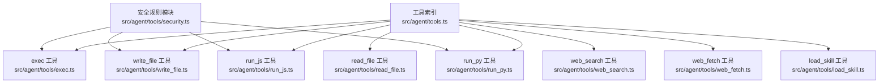
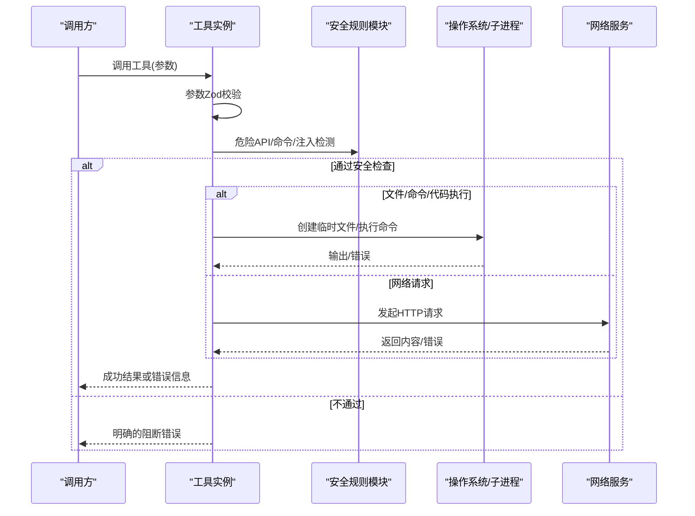
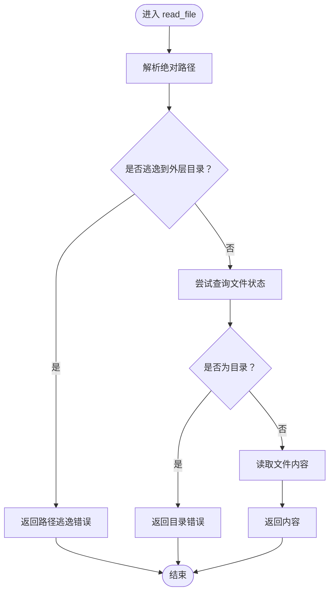
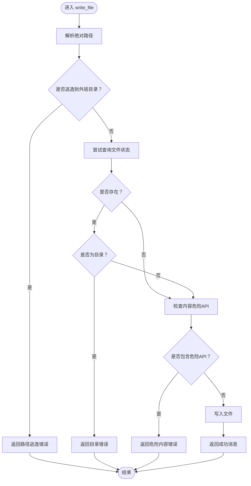
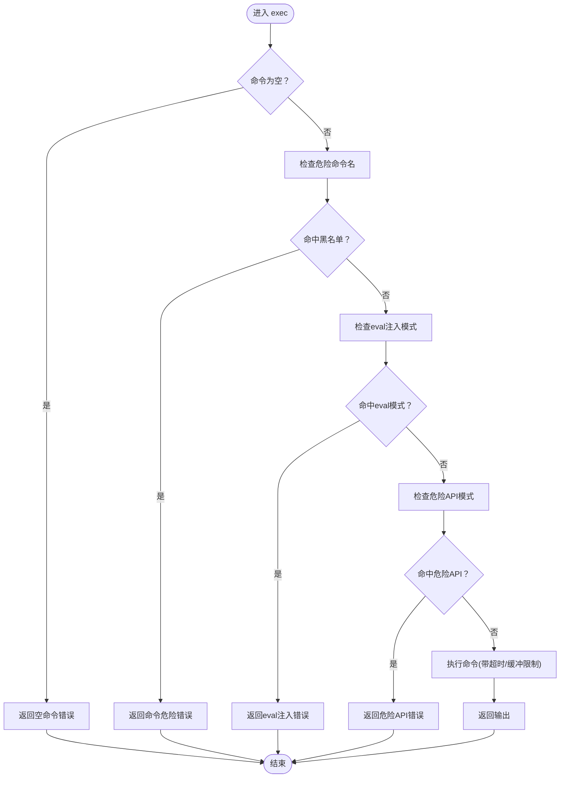
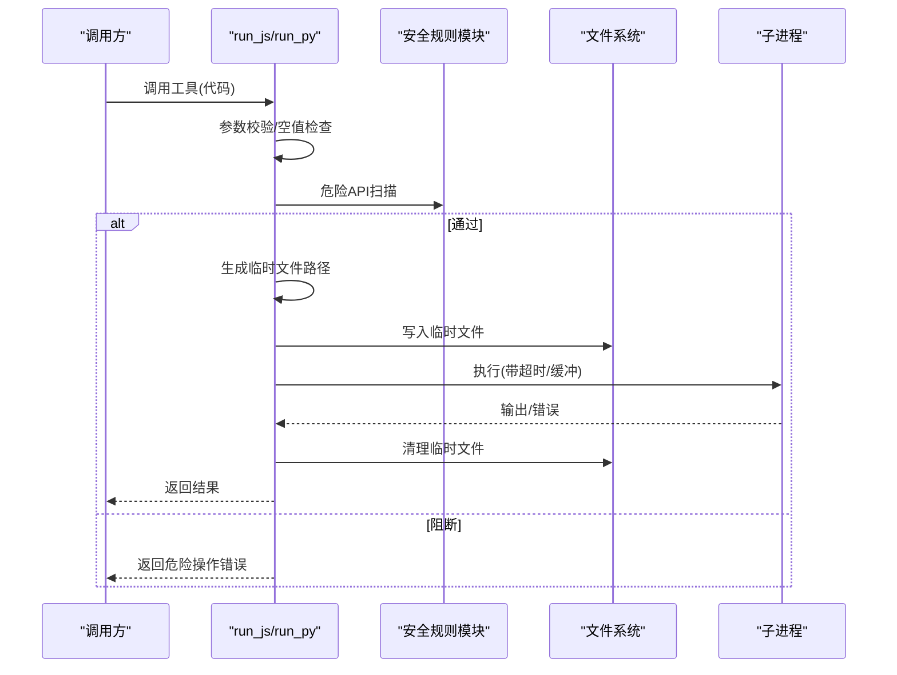
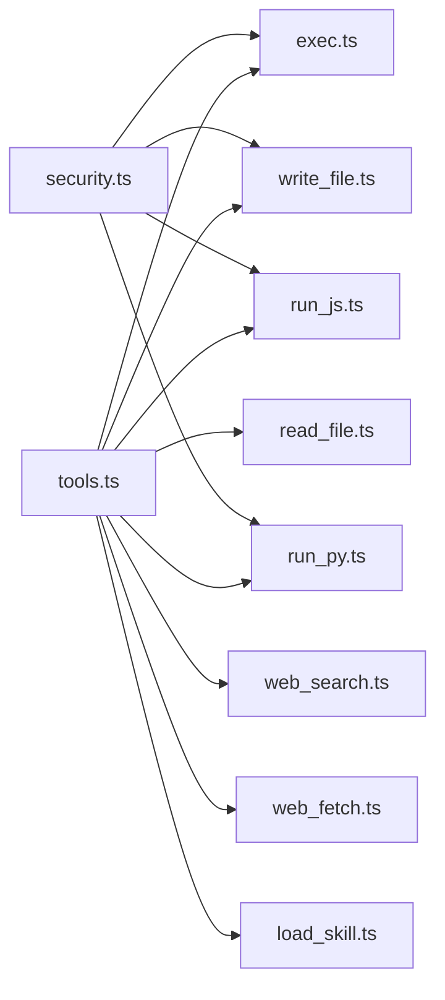

# 工具系统

<cite>
**本文引用的文件**
- [src/agent/tools.ts](file://src/agent/tools.ts)
- [src/agent/tools/exec.ts](file://src/agent/tools/exec.ts)
- [src/agent/tools/read_file.ts](file://src/agent/tools/read_file.ts)
- [src/agent/tools/write_file.ts](file://src/agent/tools/write_file.ts)
- [src/agent/tools/web_search.ts](file://src/agent/tools/web_search.ts)
- [src/agent/tools/web_fetch.ts](file://src/agent/tools/web_fetch.ts)
- [src/agent/tools/run_js.ts](file://src/agent/tools/run_js.ts)
- [src/agent/tools/run_py.ts](file://src/agent/tools/run_py.ts)
- [src/agent/tools/load_skill.ts](file://src/agent/tools/load_skill.ts)
- [src/agent/tools/security.ts](file://src/agent/tools/security.ts)
- [src/agent/tools/exec.test.ts](file://src/agent/tools/exec.test.ts)
- [src/agent/tools/read_file.test.ts](file://src/agent/tools/read_file.test.ts)
- [src/agent/tools/web_search.test.ts](file://src/agent/tools/web_search.test.ts)
- [src/agent/tools/run_js.test.ts](file://src/agent/tools/run_js.test.ts)
- [src/agent/tools/run_py.test.ts](file://src/agent/tools/run_py.test.ts)
</cite>

## 目录
1. [简介](#简介)
2. [项目结构](#项目结构)
3. [核心组件](#核心组件)
4. [架构总览](#架构总览)
5. [详细组件分析](#详细组件分析)
6. [依赖关系分析](#依赖关系分析)
7. [性能与安全考量](#性能与安全考量)
8. [故障排查指南](#故障排查指南)
9. [结论](#结论)
10. [附录：使用示例与最佳实践](#附录使用示例与最佳实践)

## 简介
本文件系统性梳理工具系统的统一接口设计与实现，涵盖工具注册机制、参数校验、错误处理、安全策略与协作模式。重点解析以下工具族的能力边界与最佳实践：
- 文件操作工具：读取与写入，基于路径逃逸防护与内容危险 API 检测
- 网络工具：网页抓取与在线检索，基于 URL 合法性、超时与响应大小限制
- 代码执行工具：JavaScript 与 Python 的安全沙箱执行流程
- 系统命令工具：多层安全过滤与超时保护
- 技能加载工具：技能发现与加载

## 项目结构
工具系统采用“按功能分文件”的组织方式，每个工具独立导出一个 LangChain 工具实例，并在统一入口集中导出，便于上层调用方按名称引用。

图表来源
- [src/agent/tools.ts:1-10](file://src/agent/tools.ts#L1-L10)
- [src/agent/tools/exec.ts:1-144](file://src/agent/tools/exec.ts#L1-L144)
- [src/agent/tools/read_file.ts:1-42](file://src/agent/tools/read_file.ts#L1-L42)
- [src/agent/tools/write_file.ts:1-56](file://src/agent/tools/write_file.ts#L1-L56)
- [src/agent/tools/run_js.ts:1-91](file://src/agent/tools/run_js.ts#L1-L91)
- [src/agent/tools/run_py.ts:1-96](file://src/agent/tools/run_py.ts#L1-L96)
- [src/agent/tools/web_search.ts:1-42](file://src/agent/tools/web_search.ts#L1-L42)
- [src/agent/tools/web_fetch.ts:1-84](file://src/agent/tools/web_fetch.ts#L1-L84)
- [src/agent/tools/load_skill.ts:1-35](file://src/agent/tools/load_skill.ts#L1-L35)
- [src/agent/tools/security.ts:1-27](file://src/agent/tools/security.ts#L1-L27)

章节来源
- [src/agent/tools.ts:1-10](file://src/agent/tools.ts#L1-L10)

## 核心组件
- 统一工具接口：所有工具均通过 LangChain 的工具工厂创建，具备一致的名称、描述与 Zod 参数模式，便于上层编排与类型校验。
- 参数验证：每个工具的 schema 使用 Zod 定义，调用前自动进行字段存在性与类型校验；调用后工具内部再做业务级校验（如空值、URL 合法性、路径逃逸等）。
- 错误处理：对底层异常进行捕获与归一化，区分超时、网络、语法/运行时错误等场景，返回可读性强的错误信息。
- 安全基线：共享安全规则模块，统一识别危险 API 调用模式，贯穿文件写入、系统命令与代码执行三类高风险工具。

章节来源
- [src/agent/tools/exec.ts:95-143](file://src/agent/tools/exec.ts#L95-L143)
- [src/agent/tools/read_file.ts:7-41](file://src/agent/tools/read_file.ts#L7-L41)
- [src/agent/tools/write_file.ts:8-55](file://src/agent/tools/write_file.ts#L8-L55)
- [src/agent/tools/web_search.ts:17-41](file://src/agent/tools/web_search.ts#L17-L41)
- [src/agent/tools/web_fetch.ts:21-83](file://src/agent/tools/web_fetch.ts#L21-L83)
- [src/agent/tools/run_js.ts:23-90](file://src/agent/tools/run_js.ts#L23-L90)
- [src/agent/tools/run_py.ts:12-95](file://src/agent/tools/run_py.ts#L12-L95)
- [src/agent/tools/load_skill.ts:6-34](file://src/agent/tools/load_skill.ts#L6-L34)
- [src/agent/tools/security.ts:1-27](file://src/agent/tools/security.ts#L1-L27)

## 架构总览
工具系统以“单一职责 + 安全前置”为核心设计原则：
- 注册与导出：工具在入口文件统一导出，便于上层按名称引用与动态装配。
- 安全前置：危险命令黑名单、eval 注入检测、危险 API 模式扫描在执行前完成，未通过则直接拒绝。
- 资源隔离：代码执行通过临时文件落地，避免命令行转义复杂性；执行后清理临时文件。
- 网络约束：Web 抓取限制协议与响应大小，设置超时；在线检索要求配置 API Key 并进行错误兜底。
- 技能加载：先发现后加载，失败时给出可用技能列表提示，提升可诊断性。

图表来源
- [src/agent/tools/exec.ts:95-143](file://src/agent/tools/exec.ts#L95-L143)
- [src/agent/tools/read_file.ts:7-41](file://src/agent/tools/read_file.ts#L7-L41)
- [src/agent/tools/write_file.ts:8-55](file://src/agent/tools/write_file.ts#L8-L55)
- [src/agent/tools/web_search.ts:17-41](file://src/agent/tools/web_search.ts#L17-L41)
- [src/agent/tools/web_fetch.ts:21-83](file://src/agent/tools/web_fetch.ts#L21-L83)
- [src/agent/tools/run_js.ts:23-90](file://src/agent/tools/run_js.ts#L23-L90)
- [src/agent/tools/run_py.ts:12-95](file://src/agent/tools/run_py.ts#L12-L95)
- [src/agent/tools/security.ts:1-27](file://src/agent/tools/security.ts#L1-L27)

## 详细组件分析

### 文件读取工具（read_file）
- 功能要点
  - 将相对路径解析为绝对路径，严格禁止路径逃逸到当前工作目录之外。
  - 若目标是目录而非文件，返回明确错误。
  - 对不存在与读取异常进行分类处理。
- 参数与返回
  - 输入：filename（字符串）
  - 输出：文件内容或错误信息
- 安全与健壮性
  - 通过路径规范化与相对路径判断，杜绝越权读取。
  - 对空输入解析为目录的边界进行覆盖。

图表来源
- [src/agent/tools/read_file.ts:7-41](file://src/agent/tools/read_file.ts#L7-L41)

章节来源
- [src/agent/tools/read_file.ts:1-42](file://src/agent/tools/read_file.ts#L1-L42)
- [src/agent/tools/read_file.test.ts:1-47](file://src/agent/tools/read_file.test.ts#L1-L47)

### 文件写入工具（write_file）
- 功能要点
  - 路径逃逸防护同读取工具。
  - 对现有目标进行存在性与类型检查；仅允许覆盖文件，不允许覆盖目录。
  - 内容层面进行危险 API 模式扫描，阻断潜在破坏性代码。
  - 写入成功后返回确认消息。
- 参数与返回
  - 输入：filename、content
  - 输出：成功消息或错误信息
- 安全与健壮性
  - 与安全模块共享危险 API 检测逻辑，降低绕过风险。

图表来源
- [src/agent/tools/write_file.ts:8-55](file://src/agent/tools/write_file.ts#L8-L55)
- [src/agent/tools/security.ts:1-27](file://src/agent/tools/security.ts#L1-L27)

章节来源
- [src/agent/tools/write_file.ts:1-56](file://src/agent/tools/write_file.ts#L1-L56)
- [src/agent/tools/security.ts:1-27](file://src/agent/tools/security.ts#L1-L27)

### 系统命令工具（exec）
- 功能要点
  - 三层安全过滤：危险命令名黑名单、eval 注入模式、危险 API 模式。
  - 执行时设置超时与输出缓冲上限，防止长时间阻塞与内存膨胀。
  - 对异常进行细分：超时、stderr/stdout 分流、未知错误。
- 参数与返回
  - 输入：command（字符串）
  - 输出：命令输出或错误信息
- 安全与健壮性
  - 黑名单覆盖 rm/mv/cp/sudo/chmod/kill 等高危命令；eval 注入检测覆盖主流解释器；危险 API 检测来自共享模块。

图表来源
- [src/agent/tools/exec.ts:95-143](file://src/agent/tools/exec.ts#L95-L143)
- [src/agent/tools/security.ts:1-27](file://src/agent/tools/security.ts#L1-L27)

章节来源
- [src/agent/tools/exec.ts:1-144](file://src/agent/tools/exec.ts#L1-L144)
- [src/agent/tools/exec.test.ts:1-150](file://src/agent/tools/exec.test.ts#L1-L150)

### 代码执行工具（run_js / run_py）
- 设计理念
  - 优先使用专用执行工具而非“写文件 + 执行”，避免命令行转义与环境差异带来的风险。
  - 通过临时文件承载代码，执行后自动清理，确保无残留。
  - 对危险 API 模式进行预扫描，阻断后再执行。
- JavaScript 执行（run_js）
  - 依赖 Node.js 可用性检测；超时 15 秒；输出缓冲上限；临时文件命名含时间戳与随机串。
- Python 执行（run_py）
  - 通过配置与环境函数选择合适的 Python 解释器；支持额外参数前缀；超时与缓冲限制同 JS 版本。
- 参数与返回
  - 输入：code（字符串）
  - 输出：标准输出或错误信息
- 安全与健壮性
  - 与安全模块共享危险 API 检测；对 Node/Python 可用性进行前置校验；finally 中清理临时文件。

图表来源
- [src/agent/tools/run_js.ts:23-90](file://src/agent/tools/run_js.ts#L23-L90)
- [src/agent/tools/run_py.ts:12-95](file://src/agent/tools/run_py.ts#L12-L95)
- [src/agent/tools/security.ts:1-27](file://src/agent/tools/security.ts#L1-L27)

章节来源
- [src/agent/tools/run_js.ts:1-91](file://src/agent/tools/run_js.ts#L1-L91)
- [src/agent/tools/run_py.ts:1-96](file://src/agent/tools/run_py.ts#L1-L96)
- [src/agent/tools/run_js.test.ts:1-85](file://src/agent/tools/run_js.test.ts#L1-L85)
- [src/agent/tools/run_py.test.ts:1-85](file://src/agent/tools/run_py.test.ts#L1-L85)

### 网络搜索工具（web_search）
- 功能要点
  - 基于 Tavily 搜索引擎，封装客户端初始化与调用。
  - 初始化阶段若缺少 API Key 则返回明确错误；调用阶段对异常进行兜底。
- 参数与返回
  - 输入：query（字符串）
  - 输出：搜索结果或错误信息
- 安全与健壮性
  - 通过环境变量驱动外部服务可用性；对外部错误进行统一格式化。

章节来源
- [src/agent/tools/web_search.ts:1-42](file://src/agent/tools/web_search.ts#L1-L42)
- [src/agent/tools/web_search.test.ts:1-95](file://src/agent/tools/web_search.test.ts#L1-L95)

### 网页抓取工具（web_fetch）
- 功能要点
  - 仅允许 http/https 协议；设置请求超时与最大响应大小；支持跟随重定向。
  - 对常见网络错误（DNS、连接被拒、连接复位等）进行分类提示。
- 参数与返回
  - 输入：url（字符串）
  - 输出：页面文本或错误信息
- 安全与健壮性
  - URL 合法性前置校验；超时与大小限制防止资源滥用。

章节来源
- [src/agent/tools/web_fetch.ts:1-84](file://src/agent/tools/web_fetch.ts#L1-L84)

### 技能加载工具（load_skill）
- 功能要点
  - 先发现可用技能，再加载指定技能内容；若技能不存在，返回可用技能清单，便于用户修正。
- 参数与返回
  - 输入：skillName（字符串）
  - 输出：技能内容或错误信息
- 安全与健壮性
  - 通过发现与加载分离，减少无效调用成本；失败时提供上下文信息。

章节来源
- [src/agent/tools/load_skill.ts:1-35](file://src/agent/tools/load_skill.ts#L1-L35)

## 依赖关系分析
- 工具入口依赖：工具索引文件集中导出各工具，上层无需关心具体实现位置。
- 安全模块依赖：文件写入、系统命令与代码执行工具共享危险 API 检测能力，形成统一安全基线。
- 外部依赖：网络搜索依赖第三方 SDK；代码执行依赖系统可执行程序；文件读写依赖 Node.js 文件系统。

图表来源
- [src/agent/tools.ts:1-10](file://src/agent/tools.ts#L1-L10)
- [src/agent/tools/exec.ts:1-144](file://src/agent/tools/exec.ts#L1-L144)
- [src/agent/tools/read_file.ts:1-42](file://src/agent/tools/read_file.ts#L1-L42)
- [src/agent/tools/write_file.ts:1-56](file://src/agent/tools/write_file.ts#L1-L56)
- [src/agent/tools/run_js.ts:1-91](file://src/agent/tools/run_js.ts#L1-L91)
- [src/agent/tools/run_py.ts:1-96](file://src/agent/tools/run_py.ts#L1-L96)
- [src/agent/tools/web_search.ts:1-42](file://src/agent/tools/web_search.ts#L1-L42)
- [src/agent/tools/web_fetch.ts:1-84](file://src/agent/tools/web_fetch.ts#L1-L84)
- [src/agent/tools/load_skill.ts:1-35](file://src/agent/tools/load_skill.ts#L1-L35)
- [src/agent/tools/security.ts:1-27](file://src/agent/tools/security.ts#L1-L27)

## 性能与安全考量
- 超时与缓冲
  - 系统命令与代码执行均设置超时与输出缓冲上限，避免长时间阻塞与内存占用过高。
- 路径逃逸防护
  - 文件读写工具通过路径规范化与相对路径判断，杜绝越权访问。
- 危险 API 检测
  - 统一的正则模式覆盖 Node.js、Python 以及子进程相关高危调用，阻断在执行前。
- 网络限制
  - 抓取工具限制协议与响应大小，配合超时保障稳定性。
- 临时文件清理
  - 代码执行工具在 finally 中清理临时文件，避免磁盘污染。

[本节为通用指导，不直接分析具体文件]

## 故障排查指南
- 空参数/缺失字段
  - 工具在调用前会进行 Zod 校验，缺失字段将导致调用抛错；请根据工具 schema 补齐必填项。
- 路径逃逸/越权访问
  - 文件读写工具会拒绝逃逸路径；请使用相对路径且限定在当前工作目录内。
- 危险操作被阻断
  - 系统命令与代码执行工具会阻断 eval 注入与危险 API；请移除相关调用或改用安全替代方案。
- 超时与网络错误
  - 代码执行与网络抓取设置超时；网络错误包含 DNS、连接被拒、连接复位等分类提示；请检查网络与目标可达性。
- 外部服务配置
  - 在线搜索需要配置 API Key；若初始化失败，请检查环境变量与网络连通性。

章节来源
- [src/agent/tools/exec.ts:95-143](file://src/agent/tools/exec.ts#L95-L143)
- [src/agent/tools/read_file.ts:7-41](file://src/agent/tools/read_file.ts#L7-L41)
- [src/agent/tools/write_file.ts:8-55](file://src/agent/tools/write_file.ts#L8-L55)
- [src/agent/tools/web_fetch.ts:21-83](file://src/agent/tools/web_fetch.ts#L21-L83)
- [src/agent/tools/web_search.ts:17-41](file://src/agent/tools/web_search.ts#L17-L41)
- [src/agent/tools/run_js.ts:23-90](file://src/agent/tools/run_js.ts#L23-L90)
- [src/agent/tools/run_py.ts:12-95](file://src/agent/tools/run_py.ts#L12-L95)

## 结论
工具系统通过统一接口、严格的参数与安全校验、清晰的错误反馈与资源隔离，构建了稳定、可维护且安全的工具集。建议在实际使用中：
- 优先使用专用执行工具而非“写文件 + 执行”
- 严格遵循路径与协议限制
- 在调用前进行必要的前置检查（如 Node/Python 可用性、API Key 配置）
- 对高风险操作保持最小授权与最小暴露面

[本节为总结性内容，不直接分析具体文件]

## 附录：使用示例与最佳实践
- 文件读取
  - 场景：读取项目配置文件
  - 最佳实践：确保传入的文件名位于当前工作目录内，避免 ../ 等路径逃逸
  - 参考测试：[src/agent/tools/read_file.test.ts:1-47](file://src/agent/tools/read_file.test.ts#L1-L47)
- 文件写入
  - 场景：生成报告或缓存文件
  - 最佳实践：写入前检查内容是否包含危险 API 调用；避免覆盖目录
  - 参考测试：[src/agent/tools/write_file.ts:8-55](file://src/agent/tools/write_file.ts#L8-L55)
- 系统命令
  - 场景：列出目录、查看当前路径
  - 最佳实践：避免使用黑名单命令与 eval 注入；必要时改用专用工具或安全 API
  - 参考测试：[src/agent/tools/exec.test.ts:1-150](file://src/agent/tools/exec.test.ts#L1-L150)
- JavaScript 执行
  - 场景：快速验证算法或脚本
  - 最佳实践：使用 run_js 工具；通过 console.log 输出结果；避免 require('fs') 等危险调用
  - 参考测试：[src/agent/tools/run_js.test.ts:1-85](file://src/agent/tools/run_js.test.ts#L1-L85)
- Python 执行
  - 场景：数据处理或算法验证
  - 最佳实践：使用 run_py 工具；通过 print 输出结果；避免 os.remove/shutil.rmtree 等危险调用
  - 参考测试：[src/agent/tools/run_py.test.ts:1-85](file://src/agent/tools/run_py.test.ts#L1-L85)
- 网络搜索
  - 场景：实时信息检索
  - 最佳实践：配置 TAVILY_API_KEY；合理设置查询词；注意外部服务可用性
  - 参考测试：[src/agent/tools/web_search.test.ts:1-95](file://src/agent/tools/web_search.test.ts#L1-L95)
- 网页抓取
  - 场景：下载网页内容或 API 响应
  - 最佳实践：仅使用 http/https；关注响应大小与超时；处理常见网络错误
- 技能加载
  - 场景：激活特定技能
  - 最佳实践：先列出可用技能，再按名称加载；加载失败时根据提示修正名称

[本节为示例与最佳实践汇总，不直接分析具体文件]