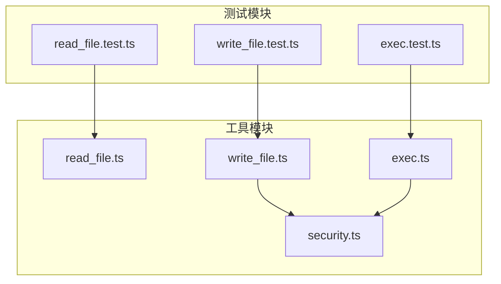
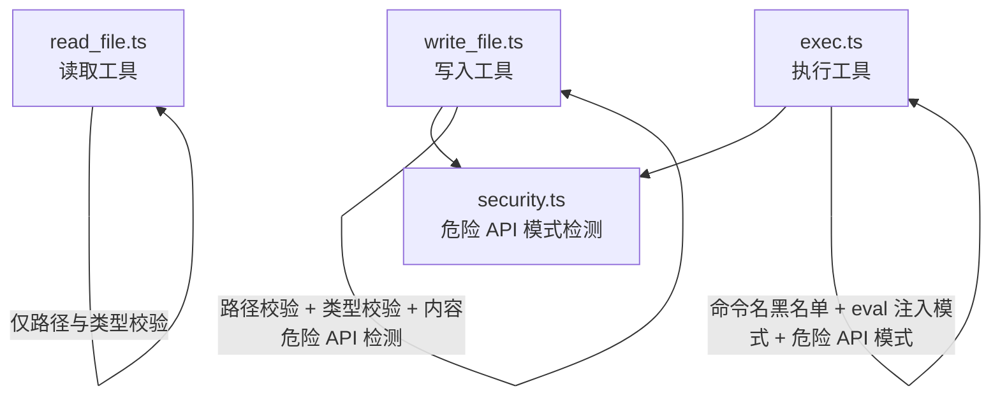
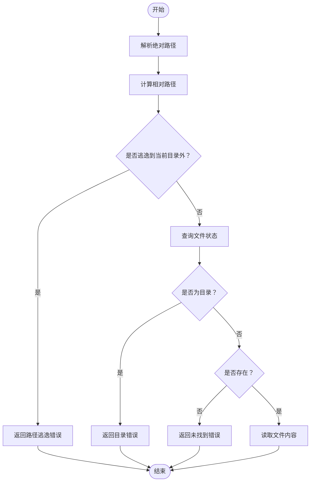
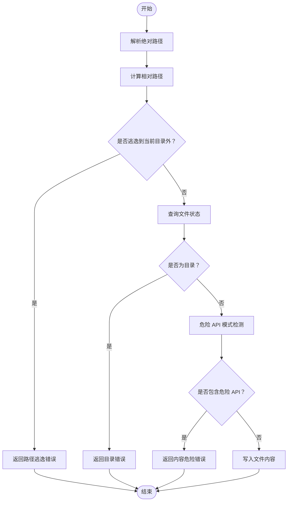
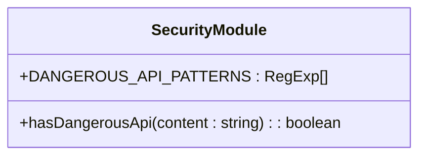
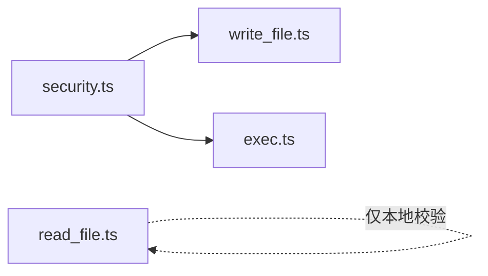

# 文件操作工具

<cite>
**本文引用的文件**
- [read_file.ts](file://src/agent/tools/read_file.ts)
- [write_file.ts](file://src/agent/tools/write_file.ts)
- [security.ts](file://src/agent/tools/security.ts)
- [exec.ts](file://src/agent/tools/exec.ts)
- [read_file.test.ts](file://src/agent/tools/read_file.test.ts)
- [write_file.test.ts](file://src/agent/tools/write_file.test.ts)
- [exec.test.ts](file://src/agent/tools/exec.test.ts)
</cite>

## 目录
1. [简介](#简介)
2. [项目结构](#项目结构)
3. [核心组件](#核心组件)
4. [架构总览](#架构总览)
5. [详细组件分析](#详细组件分析)
6. [依赖关系分析](#依赖关系分析)
7. [性能考量](#性能考量)
8. [故障排除指南](#故障排除指南)
9. [结论](#结论)
10. [附录](#附录)

## 简介
本文件操作工具集围绕“安全”这一核心目标设计，提供两类基础能力：
- 文件读取工具：在受限工作目录内进行安全读取，阻断路径遍历与目录误读。
- 文件写入工具：在受限工作目录内进行安全写入，并对内容进行危险 API 模式检测，防止潜在破坏性脚本被持久化。

同时，安全工具模块提供跨工具共享的危险 API 模式检测能力，配合执行工具形成“命令级”的多层安全防护，共同构建从文件到命令的全链路安全基线。

## 项目结构
文件操作工具位于 agent 的 tools 目录下，核心文件如下：
- 读取工具：read_file.ts
- 写入工具：write_file.ts
- 安全工具：security.ts
- 执行工具：exec.ts（用于对比命令级安全策略）
- 对应测试：read_file.test.ts、write_file.test.ts、exec.test.ts

图表来源
- [read_file.ts:1-40](file://src/agent/tools/read_file.ts#L1-L40)
- [write_file.ts:1-54](file://src/agent/tools/write_file.ts#L1-L54)
- [security.ts:1-27](file://src/agent/tools/security.ts#L1-L27)
- [exec.ts:1-142](file://src/agent/tools/exec.ts#L1-L142)
- [read_file.test.ts:1-47](file://src/agent/tools/read_file.test.ts#L1-L47)
- [write_file.test.ts:1-157](file://src/agent/tools/write_file.test.ts#L1-L157)
- [exec.test.ts:1-150](file://src/agent/tools/exec.test.ts#L1-L150)

章节来源
- [read_file.ts:1-40](file://src/agent/tools/read_file.ts#L1-L40)
- [write_file.ts:1-54](file://src/agent/tools/write_file.ts#L1-L54)
- [security.ts:1-27](file://src/agent/tools/security.ts#L1-L27)
- [exec.ts:1-142](file://src/agent/tools/exec.ts#L1-L142)

## 核心组件
- 文件读取工具：在当前工作目录范围内解析并读取文件，拒绝目录、路径遍历以及不存在的文件。
- 文件写入工具：在当前工作目录范围内创建或覆盖文件，拒绝目录、路径遍历；并对内容进行危险 API 模式检测。
- 安全工具模块：定义危险 API 模式集合与检测函数，供写入与执行工具复用。
- 执行工具：作为命令级安全的参照，展示多层安全策略（命令名黑名单、eval 注入模式、危险 API 模式）。

章节来源
- [read_file.ts:6-39](file://src/agent/tools/read_file.ts#L6-L39)
- [write_file.ts:7-53](file://src/agent/tools/write_file.ts#L7-L53)
- [security.ts:4-26](file://src/agent/tools/security.ts#L4-L26)
- [exec.ts:66-109](file://src/agent/tools/exec.ts#L66-L109)

## 架构总览
文件操作工具与安全模块之间的交互如下：
- 写入工具在落盘前调用安全模块的危险 API 检测函数，避免将破坏性内容持久化。
- 读取工具不涉及内容检测，但严格限制路径范围与对象类型。
- 执行工具与安全模块同源，形成命令级安全基线，便于横向对比与统一策略。

图表来源
- [read_file.ts:6-39](file://src/agent/tools/read_file.ts#L6-L39)
- [write_file.ts:7-53](file://src/agent/tools/write_file.ts#L7-L53)
- [security.ts:4-26](file://src/agent/tools/security.ts#L4-L26)
- [exec.ts:66-109](file://src/agent/tools/exec.ts#L66-L109)

## 详细组件分析

### 文件读取工具（read_file.ts）
- 路径验证
  - 使用工作目录与输入路径拼接后解析绝对路径。
  - 通过相对路径判断是否逃逸到当前目录之外，若逃逸则拒绝读取。
- 类型与存在性检查
  - 若目标为目录，返回错误提示。
  - 若文件不存在，返回明确的“未找到”错误。
- 错误处理
  - 捕获底层读取异常并返回可读的错误信息。

图表来源
- [read_file.ts:6-39](file://src/agent/tools/read_file.ts#L6-L39)

章节来源
- [read_file.ts:6-39](file://src/agent/tools/read_file.ts#L6-L39)
- [read_file.test.ts:4-46](file://src/agent/tools/read_file.test.ts#L4-L46)

### 文件写入工具（write_file.ts）
- 路径验证
  - 同样解析绝对路径并判断是否逃逸到当前目录之外，拒绝写入。
- 目标类型检查
  - 若目标为目录，返回错误提示；若文件不存在则允许创建。
- 内容安全检测
  - 引入安全模块的危险 API 检测函数，对内容进行模式匹配，阻止破坏性 API 调用。
- 写入与错误处理
  - 成功写入返回成功消息；捕获异常并返回可读错误信息。

图表来源
- [write_file.ts:7-53](file://src/agent/tools/write_file.ts#L7-L53)
- [security.ts:24-26](file://src/agent/tools/security.ts#L24-L26)

章节来源
- [write_file.ts:7-53](file://src/agent/tools/write_file.ts#L7-L53)
- [write_file.test.ts:18-156](file://src/agent/tools/write_file.test.ts#L18-L156)

### 安全工具模块（security.ts）
- 危险 API 模式集合
  - Node.js fs 模块的删除、写入、权限、链接等高危方法。
  - 子进程相关调用。
  - require/import 对 fs、child_process 的引用。
  - Python 的 shutil/os/subprocess/pathlib 等高危模块与方法。
- 检测函数
  - 对给定内容进行正则匹配，任一模式命中即判定为危险。

图表来源
- [security.ts:4-26](file://src/agent/tools/security.ts#L4-L26)

章节来源
- [security.ts:4-26](file://src/agent/tools/security.ts#L4-L26)

### 执行工具（exec.ts）对比参考
- 命令名黑名单：对 rm、mv、cp、sudo、chmod、kill、ln、wget、curl、gzip 等高危命令进行拦截。
- eval 注入模式：对 node -e、python -c、ruby -e、perl -e、php -r、deno eval、bun -e 等注入模式进行拦截。
- 危险 API 模式：与安全模块共享，防止通过命令参数携带破坏性 API 调用。
- 超时与缓冲区限制：设置超时与输出缓冲上限，避免长时间运行与内存溢出。

章节来源
- [exec.ts:6-64](file://src/agent/tools/exec.ts#L6-L64)
- [exec.ts:66-84](file://src/agent/tools/exec.ts#L66-L84)
- [exec.ts:94-141](file://src/agent/tools/exec.ts#L94-L141)
- [exec.test.ts:23-131](file://src/agent/tools/exec.test.ts#L23-L131)

## 依赖关系分析
- 写入工具依赖安全模块进行内容危险 API 检测。
- 执行工具同样依赖安全模块，形成统一的危险 API 检测策略。
- 读取工具不依赖安全模块，仅做路径与类型校验。

图表来源
- [write_file.ts:5-5](file://src/agent/tools/write_file.ts#L5-L5)
- [exec.ts:4-4](file://src/agent/tools/exec.ts#L4-L4)
- [read_file.ts:1-3](file://src/agent/tools/read_file.ts#L1-L3)

章节来源
- [write_file.ts:5-5](file://src/agent/tools/write_file.ts#L5-L5)
- [exec.ts:4-4](file://src/agent/tools/exec.ts#L4-L4)
- [read_file.ts:1-3](file://src/agent/tools/read_file.ts#L1-L3)

## 性能考量
- 路径解析与 stat 查询均为同步调用，单次操作耗时极短，适合在工具链中直接调用。
- 内容危险 API 检测基于正则匹配，复杂度与内容长度线性相关，建议控制写入内容规模以降低匹配成本。
- 执行工具设置了超时与输出缓冲上限，避免资源滥用；文件写入工具未设置超时，建议在上层调用处按需增加超时控制。

## 故障排除指南
- 路径逃逸错误
  - 症状：返回“无法在当前目录之外读取/写入文件”的错误。
  - 排查：确认传入的文件名不包含“..”或绝对路径；确保工作目录正确。
  - 参考测试：读取与写入工具均覆盖了路径逃逸场景。
- 目录错误
  - 症状：返回“目标是目录，不是文件”的错误。
  - 排查：确认传入的是文件而非目录；必要时先列出目录确认。
  - 参考测试：读取与写入工具均覆盖了目录误用场景。
- 文件不存在
  - 症状：读取返回“文件未找到”；写入在目标不存在时允许创建。
  - 排查：确认文件确实存在；如需新建，请确保路径合法且目标非目录。
- 内容危险被拦截
  - 症状：写入返回“内容包含危险操作”的错误。
  - 排查：移除或规避危险 API 调用；避免 require/import fs/child_process；避免 Python 的 shutil/os/subprocess 等高危模块。
  - 参考测试：写入工具覆盖了多种危险 API 模式的拦截。
- 命令被拦截（对比参考）
  - 症状：执行返回“命令包含危险操作”或“eval 注入被阻止”。
  - 排查：避免使用高危命令名与 eval 注入模式；不要在命令中携带破坏性 API 调用。
  - 参考测试：执行工具覆盖了命令名黑名单与 eval 注入模式的拦截。

章节来源
- [read_file.test.ts:22-41](file://src/agent/tools/read_file.test.ts#L22-L41)
- [write_file.test.ts:57-83](file://src/agent/tools/write_file.test.ts#L57-L83)
- [write_file.test.ts:86-135](file://src/agent/tools/write_file.test.ts#L86-L135)
- [exec.test.ts:23-131](file://src/agent/tools/exec.test.ts#L23-L131)

## 结论
文件操作工具通过“路径范围限制 + 类型校验 + 内容危险 API 检测”的组合策略，有效降低了路径遍历与恶意文件操作的风险。安全工具模块提供了跨工具共享的危险 API 检测能力，与执行工具的多层安全策略相辅相成，共同构成从文件到命令的全链路安全基线。建议在实际使用中遵循限定目录原则，避免危险 API 调用，并结合上层调用方的超时与缓冲区控制，进一步提升稳定性与安全性。

## 附录
- 使用示例（基于测试用例的模式）
  - 安全读取现有文件：传入一个存在于当前目录下的文件名，读取其内容。
  - 安全写入新文件：传入一个当前目录内的文件名与内容，成功后可验证文件内容。
  - 阻断路径逃逸：传入包含“..”的文件名，应返回路径逃逸错误。
  - 阻断目录误用：传入目录名，应返回“目标是目录”的错误。
  - 阻断危险内容：传入包含危险 API 的内容，应返回内容危险错误。
  - 命令级安全参考：执行工具展示了命令名黑名单、eval 注入模式与危险 API 模式的拦截策略。

章节来源
- [read_file.test.ts:4-46](file://src/agent/tools/read_file.test.ts#L4-L46)
- [write_file.test.ts:18-156](file://src/agent/tools/write_file.test.ts#L18-L156)
- [exec.test.ts:23-131](file://src/agent/tools/exec.test.ts#L23-L131)