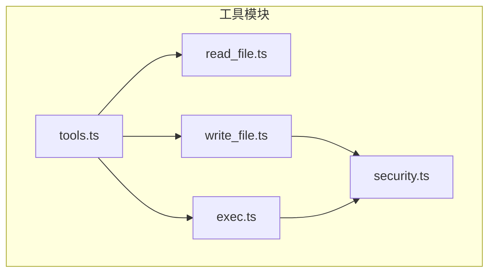
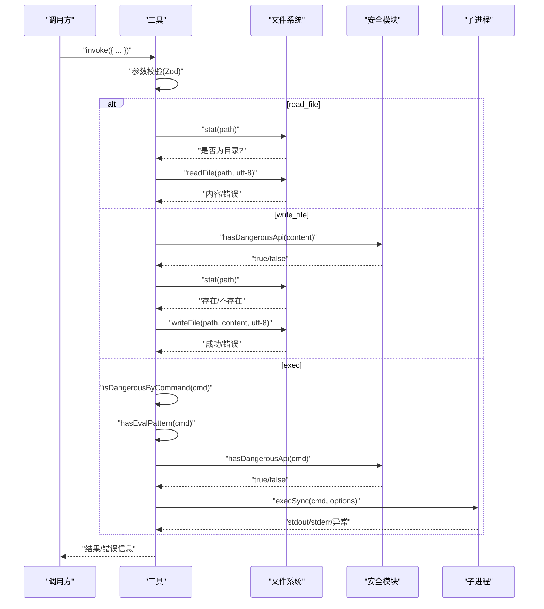
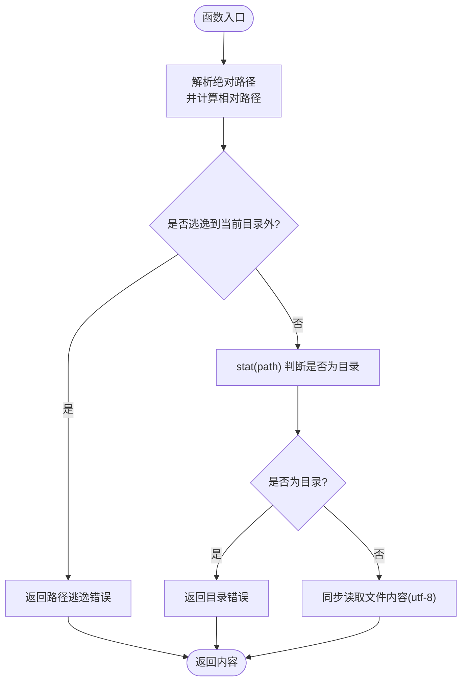
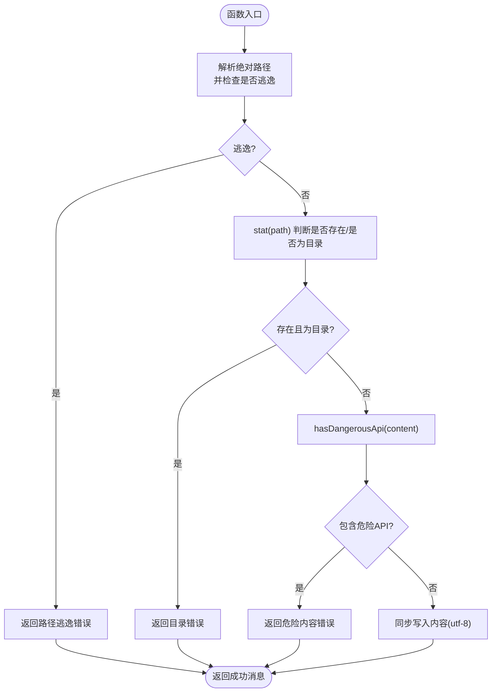
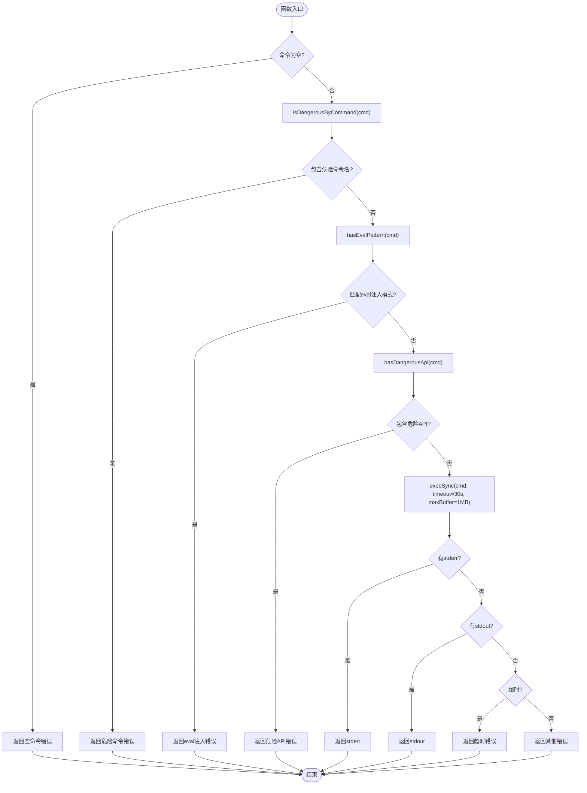
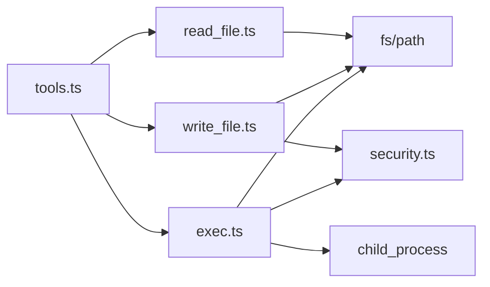

# 文件操作工具

<cite>
**本文引用的文件**
- [read_file.ts](file://src/agent/tools/read_file.ts)
- [write_file.ts](file://src/agent/tools/write_file.ts)
- [exec.ts](file://src/agent/tools/exec.ts)
- [security.ts](file://src/agent/tools/security.ts)
- [tools.ts](file://src/agent/tools.ts)
- [read_file.test.ts](file://src/agent/tools/read_file.test.ts)
- [write_file.test.ts](file://src/agent/tools/write_file.test.ts)
- [exec.test.ts](file://src/agent/tools/exec.test.ts)
- [package.json](file://package.json)
</cite>

## 目录
1. [简介](#简介)
2. [项目结构](#项目结构)
3. [核心组件](#核心组件)
4. [架构总览](#架构总览)
5. [详细组件分析](#详细组件分析)
6. [依赖关系分析](#依赖关系分析)
7. [性能考虑](#性能考虑)
8. [故障排查指南](#故障排查指南)
9. [结论](#结论)
10. [附录](#附录)

## 简介
本文件操作工具集包含三个核心工具：
- read_file：读取当前工作目录下的文件内容，并进行路径逃逸防护与类型校验。
- write_file：在当前工作目录下创建或覆盖文件，同时对文件内容进行危险 API 检测。
- exec：在当前工作目录执行系统命令，采用三层安全策略（危险命令名、eval 注入、危险 API 调用）。

这些工具均基于 LangChain 的工具封装能力，使用 Zod 对输入参数进行严格校验，并通过统一的安全模块实现跨工具的危险模式检测。

## 项目结构
- 工具入口导出位于 tools.ts，集中导出 read_file、write_file、exec 等工具。
- 安全策略集中于 security.ts，为 write_file 与 exec 提供危险 API 检测。
- 各工具文件位于 src/agent/tools/ 下，分别实现对应功能与安全策略。

图表来源
- [tools.ts:1-10](file://src/agent/tools.ts#L1-L10)
- [read_file.ts:1-41](file://src/agent/tools/read_file.ts#L1-L41)
- [write_file.ts:1-55](file://src/agent/tools/write_file.ts#L1-L55)
- [exec.ts:1-143](file://src/agent/tools/exec.ts#L1-L143)
- [security.ts:1-27](file://src/agent/tools/security.ts#L1-L27)

章节来源
- [tools.ts:1-10](file://src/agent/tools.ts#L1-L10)

## 核心组件
- read_file 工具
  - 功能：读取当前工作目录下的文件内容。
  - 参数：filename（字符串，必填）。
  - 输出：成功返回文件内容；失败返回错误信息。
  - 安全：路径解析后进行相对路径检查，禁止路径逃逸；禁止读取目录。
  - 错误处理：文件不存在、读取异常、目录读取等。
- write_file 工具
  - 功能：创建或覆盖当前工作目录下的文件。
  - 参数：filename（字符串，必填）、content（字符串，必填）。
  - 输出：成功返回成功消息；失败返回错误信息。
  - 安全：路径逃逸检查；内容危险 API 检测（阻止 fs.rmSync、shutil.rmtree 等）。
  - 错误处理：路径逃逸、目标是目录、危险内容、写入异常等。
- exec 工具
  - 功能：在当前工作目录执行系统命令。
  - 参数：command（字符串，必填）。
  - 输出：成功返回命令输出；失败返回错误信息。
  - 安全：三层检测
    - 危险命令名黑名单（rm、mv、cp、sudo、chmod、kill 等）。
    - eval 注入模式（node -e、python -c 等）。
    - 危险 API 调用（fs、child_process、shutil、os、subprocess 等）。
  - 错误处理：空命令、超时、非零退出码、缓冲区溢出等。

章节来源
- [read_file.ts:6-40](file://src/agent/tools/read_file.ts#L6-L40)
- [write_file.ts:7-54](file://src/agent/tools/write_file.ts#L7-L54)
- [exec.ts:94-142](file://src/agent/tools/exec.ts#L94-L142)
- [security.ts:4-26](file://src/agent/tools/security.ts#L4-L26)

## 架构总览
以下序列图展示了工具调用与安全检查的整体流程，以及 exec 的三层安全策略。

图表来源
- [read_file.ts:7-32](file://src/agent/tools/read_file.ts#L7-L32)
- [write_file.ts:8-41](file://src/agent/tools/write_file.ts#L8-L41)
- [exec.ts:94-133](file://src/agent/tools/exec.ts#L94-L133)
- [security.ts:24-26](file://src/agent/tools/security.ts#L24-L26)

## 详细组件分析

### read_file 工具
- 输入输出
  - 输入：filename（字符串，必填）
  - 输出：文件内容（字符串）或错误信息（字符串）
- 安全与权限
  - 使用路径解析与相对路径判断，防止路径逃逸到当前目录之外。
  - 检查目标是否为目录，避免将目录当作文件读取。
- 错误处理
  - 文件不存在：返回“未找到”错误。
  - 读取异常：返回通用错误信息。
  - 目录读取：返回“不是文件”的错误。
- 性能与优化
  - 同步读取，简单直接；对于大文件可考虑分块读取或异步流式读取以降低内存峰值。
- 使用示例（参考测试）
  - 读取现有文件：见 [read_file.test.ts:5-8](file://src/agent/tools/read_file.test.ts#L5-L8)
  - 读取不存在文件：见 [read_file.test.ts:10-15](file://src/agent/tools/read_file.test.ts#L10-L15)
  - 读取目录：见 [read_file.test.ts:17-20](file://src/agent/tools/read_file.test.ts#L17-L20)
  - 路径逃逸：见 [read_file.test.ts:22-27](file://src/agent/tools/read_file.test.ts#L22-L27)

图表来源
- [read_file.ts:7-32](file://src/agent/tools/read_file.ts#L7-L32)

章节来源
- [read_file.ts:6-40](file://src/agent/tools/read_file.ts#L6-L40)
- [read_file.test.ts:4-46](file://src/agent/tools/read_file.test.ts#L4-L46)

### write_file 工具
- 输入输出
  - 输入：filename（字符串，必填）、content（字符串，必填）
  - 输出：成功消息（字符串）或错误信息（字符串）
- 安全与权限
  - 路径逃逸检查：同 read_file。
  - 内容危险 API 检测：通过共享安全模块识别 fs、child_process、shutil、os、subprocess 等危险调用。
- 错误处理
  - 路径逃逸：返回“超出当前目录”的错误。
  - 目标是目录：返回“不是文件”的错误。
  - 危险内容：返回“包含危险操作”的错误。
  - 写入异常：返回通用错误信息。
- 性能与优化
  - 同步写入，适合小文件；大文件建议异步写入或分块写入，避免阻塞。
- 使用示例（参考测试）
  - 创建新文件：见 [write_file.test.ts:19-32](file://src/agent/tools/write_file.test.ts#L19-L32)
  - 覆盖已有文件：见 [write_file.test.ts:34-55](file://src/agent/tools/write_file.test.ts#L34-L55)
  - 路径逃逸：见 [write_file.test.ts:57-75](file://src/agent/tools/write_file.test.ts#L57-L75)
  - 目录作为目标：见 [write_file.test.ts:77-83](file://src/agent/tools/write_file.test.ts#L77-L83)
  - 危险内容检测（fs.rmSync）：见 [write_file.test.ts:86-95](file://src/agent/tools/write_file.test.ts#L86-L95)
  - 危险内容检测（shutil.rmtree）：见 [write_file.test.ts:97-105](file://src/agent/tools/write_file.test.ts#L97-L105)
  - 危险内容检测（os.remove）：见 [write_file.test.ts:107-115](file://src/agent/tools/write_file.test.ts#L107-L115)
  - 危险内容检测（require("child_process")）：见 [write_file.test.ts:117-125](file://src/agent/tools/write_file.test.ts#L117-L125)
  - 危险内容检测（subprocess.run）：见 [write_file.test.ts:127-135](file://src/agent/tools/write_file.test.ts#L127-L135)
  - 正常内容写入：见 [write_file.test.ts:137-143](file://src/agent/tools/write_file.test.ts#L137-L143)

图表来源
- [write_file.ts:8-41](file://src/agent/tools/write_file.ts#L8-L41)
- [security.ts:24-26](file://src/agent/tools/security.ts#L24-L26)

章节来源
- [write_file.ts:7-54](file://src/agent/tools/write_file.ts#L7-L54)
- [write_file.test.ts:18-156](file://src/agent/tools/write_file.test.ts#L18-L156)

### exec 工具
- 输入输出
  - 输入：command（字符串，必填）
  - 输出：命令输出（字符串）或错误信息（字符串）
- 安全与权限
  - 危险命令名黑名单：rm、rmdir、del、erase、rd、mv、move、ren、rename、cp、copy、xcopy、robocopy、dd、mkfs、format、fdisk、parted、mkfile、shutdown、reboot、halt、poweroff、chmod、chown、chattr、sudo、su、doas、passwd、useradd、userdel、usermod、kill、pkill、killall、taskkill、ln、mklink、wget、curl、gzip、gunzip、tar 等。
  - eval 注入模式：node -e/--eval/-p/--print、python -c/--command、ruby -e、perl -e、php -r、deno eval、bun -e 等。
  - 危险 API 调用：fs.rm、fs.rmSync、fs.unlink、fs.unlinkSync、fs.rmdir、fs.rmdirSync、fs.writeFile、fs.write、fs.chmod、fs.chown、fs.symlink、fs.link、child_process、exec、spawn、require("fs"/"child_process")、shutil.rmtree/os.remove/subprocess.run/pathlib.Path.unlink/rmdir、等。
- 错误处理
  - 空命令：返回“命令不能为空”的错误。
  - 超时：默认 30 秒超时，返回“命令超时”错误。
  - 非零退出码：优先返回 stderr，其次返回 stdout。
  - 缓冲区过大：默认最大缓冲区 1MB，超过会触发错误。
  - 其他异常：返回通用错误信息。
- 性能与优化
  - 默认超时 30 秒，缓冲区 1MB，避免长时间阻塞与内存占用过高。
  - 对于耗时任务，建议拆分为多个短命令或使用异步执行方案。
- 使用示例（参考测试）
  - 正常命令（echo/pwd/ls）：见 [exec.test.ts:7-21](file://src/agent/tools/exec.test.ts#L7-L21)
  - 危险命令（rm/sudo/chmod/mv/cp）：见 [exec.test.ts:24-57](file://src/agent/tools/exec.test.ts#L24-L57)
  - eval 注入（node -e/--eval/-p、python -c）：见 [exec.test.ts:60-94](file://src/agent/tools/exec.test.ts#L60-L94)
  - 危险 API（fs.rmSync/shutil.rmtree/require("fs")/child_process）：见 [exec.test.ts:97-131](file://src/agent/tools/exec.test.ts#L97-L131)
  - 边界情况（空命令/不存在命令）：见 [exec.test.ts:134-144](file://src/agent/tools/exec.test.ts#L134-L144)

图表来源
- [exec.ts:94-133](file://src/agent/tools/exec.ts#L94-L133)
- [exec.ts:86-92](file://src/agent/tools/exec.ts#L86-L92)
- [exec.ts:81-84](file://src/agent/tools/exec.ts#L81-L84)
- [security.ts:24-26](file://src/agent/tools/security.ts#L24-L26)

章节来源
- [exec.ts:6-142](file://src/agent/tools/exec.ts#L6-L142)
- [exec.test.ts:5-149](file://src/agent/tools/exec.test.ts#L5-L149)

## 依赖关系分析
- 工具导出
  - tools.ts 统一导出 read_file、write_file、exec 等工具，便于上层调用。
- 安全模块复用
  - security.ts 提供危险 API 模式集合与检测函数，被 write_file 与 exec 共同使用。
- 外部依赖
  - @langchain/core：提供工具封装与 Zod 参数校验。
  - child_process：exec 工具使用 execSync 执行命令。
  - fs/path：文件系统与路径解析。

图表来源
- [tools.ts:1-10](file://src/agent/tools.ts#L1-L10)
- [read_file.ts:1-5](file://src/agent/tools/read_file.ts#L1-L5)
- [write_file.ts:1-6](file://src/agent/tools/write_file.ts#L1-L6)
- [exec.ts:1-4](file://src/agent/tools/exec.ts#L1-L4)
- [security.ts:1-27](file://src/agent/tools/security.ts#L1-L27)

章节来源
- [tools.ts:1-10](file://src/agent/tools.ts#L1-L10)
- [package.json:20-36](file://package.json#L20-L36)

## 性能考虑
- 同步 I/O
  - read_file 与 write_file 使用同步接口，简单可靠但会阻塞事件循环。对于大文件或频繁调用，建议改用异步版本或分块处理。
- exec 工具
  - 默认超时 30 秒，最大缓冲区 1MB，避免长时间阻塞与内存占用过高。
  - 对于耗时任务，建议拆分为多个短命令或使用后台进程管理。
- 并发与资源
  - 在高并发场景下，建议限制并发数或引入队列，避免系统资源争用。
- 日志与可观测性
  - 工具内部有日志输出，便于调试；生产环境可根据需要调整日志级别。

## 故障排查指南
- read_file 常见问题
  - “超出当前目录”：检查传入的 filename 是否包含路径逃逸片段（如 ..）。
  - “不是文件”：确认目标路径指向的是文件而非目录。
  - “未找到”：确认文件是否存在，路径是否正确。
- write_file 常见问题
  - “超出当前目录”：仅能在当前工作目录内创建/覆盖文件。
  - “不是文件”：目标路径为目录时会被拒绝。
  - “包含危险操作”：检查 content 中是否包含危险 API 调用（如 fs.rmSync、shutil.rmtree 等），需移除或替换为安全替代方案。
  - “写入异常”：检查磁盘权限、磁盘空间、文件锁定状态。
- exec 常见问题
  - “命令为空”：确保传入的 command 不为空。
  - “危险命令/危险API/eval注入”：检查命令是否命中黑名单或包含危险模式，必要时改用安全命令或脚本。
  - “命令超时”：适当增加超时时间或拆分命令，避免长时间阻塞。
  - “非零退出码”：查看 stderr 获取具体错误原因。
  - “不存在的命令”：确认命令是否安装或路径是否正确。

章节来源
- [read_file.ts:17-31](file://src/agent/tools/read_file.ts#L17-L31)
- [write_file.ts:18-41](file://src/agent/tools/write_file.ts#L18-L41)
- [exec.ts:111-132](file://src/agent/tools/exec.ts#L111-L132)

## 结论
本文件操作工具集通过严格的路径检查、危险命令与 API 检测以及合理的错误处理，提供了安全可靠的文件读取、写入与命令执行能力。建议在实际使用中遵循安全最佳实践，合理设置超时与缓冲区，避免在生产环境中执行高风险命令，并对敏感操作进行审计与监控。

## 附录
- 最佳实践
  - 仅在当前工作目录内进行文件操作，避免路径逃逸。
  - 写入前对内容进行安全扫描，避免引入危险 API 调用。
  - 对 exec 命令进行最小化授权与白名单管理，避免执行高风险命令。
  - 对大文件读写与长耗时命令使用异步或分块策略，提升系统稳定性。
  - 在生产环境启用更严格的日志与审计策略，记录关键操作。