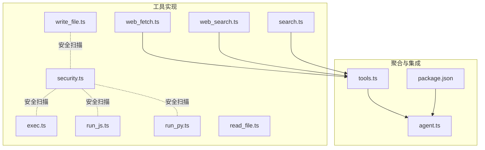
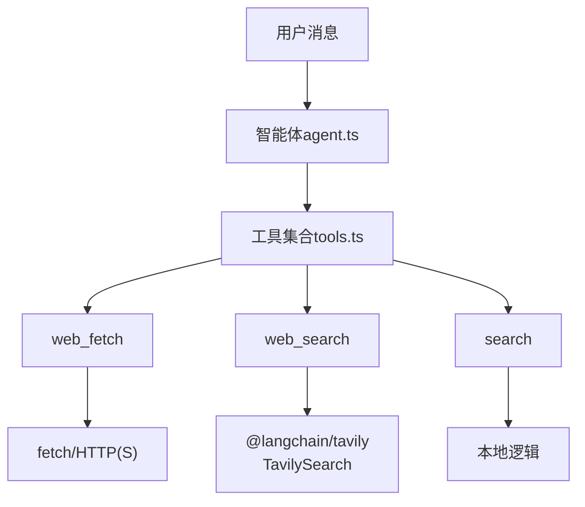
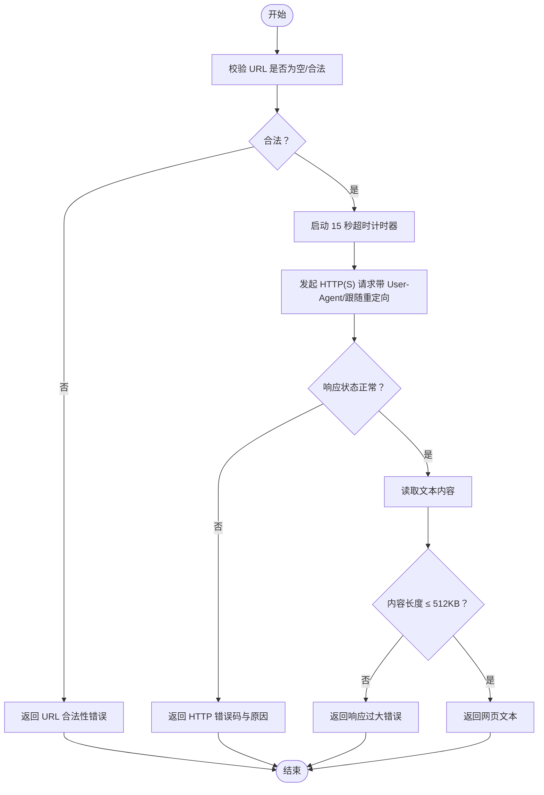
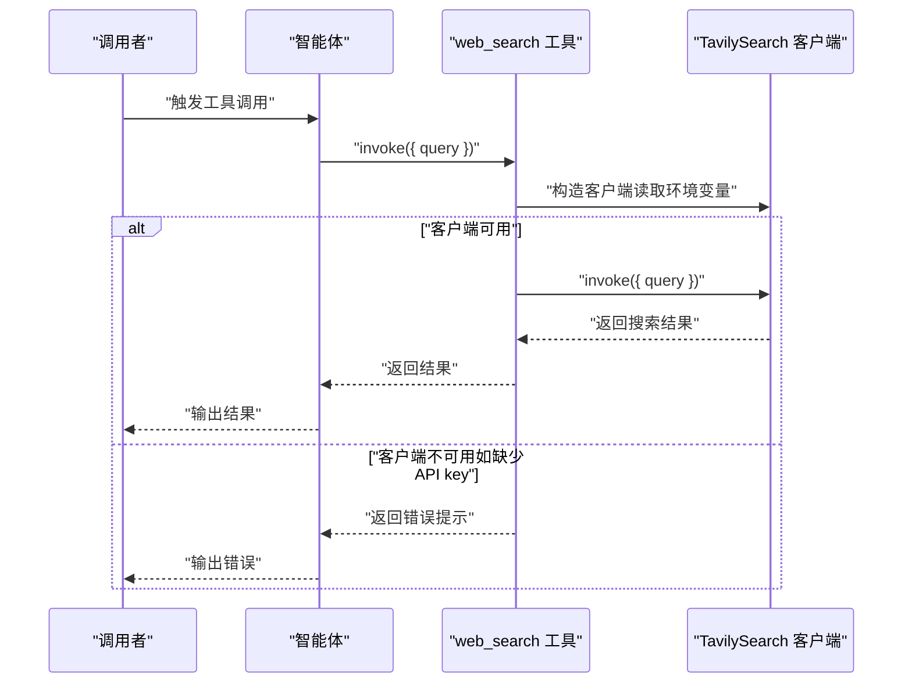
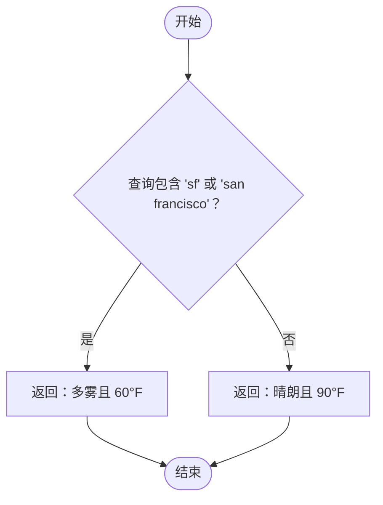
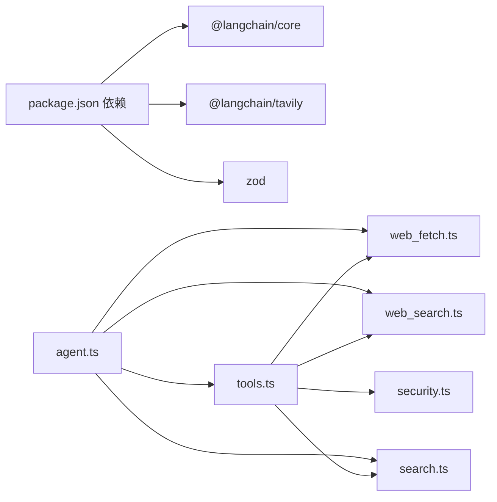

# 网络工具

<cite>
**本文引用的文件**
- [src/agent/tools/web_fetch.ts](file://src/agent/tools/web_fetch.ts)
- [src/agent/tools/web_search.ts](file://src/agent/tools/web_search.ts)
- [src/agent/tools/search.ts](file://src/agent/tools/search.ts)
- [src/agent/tools.ts](file://src/agent/tools.ts)
- [src/agent/agent.ts](file://src/agent/agent.ts)
- [package.json](file://package.json)
- [src/agent/tools/web_fetch.test.ts](file://src/agent/tools/web_fetch.test.ts)
- [src/agent/tools/web_search.test.ts](file://src/agent/tools/web_search.test.ts)
- [src/agent/tools/search.test.ts](file://src/agent/tools/search.test.ts)
- [src/agent/tools/security.ts](file://src/agent/tools/security.ts)
- [src/agent/tools/exec.ts](file://src/agent/tools/exec.ts)
- [src/agent/tools/run_js.ts](file://src/agent/tools/run_js.ts)
- [src/agent/tools/run_py.ts](file://src/agent/tools/run_py.ts)
- [src/agent/tools/read_file.ts](file://src/agent/tools/read_file.ts)
- [src/agent/tools/write_file.ts](file://src/agent/tools/write_file.ts)
</cite>

## 目录
1. [简介](#简介)
2. [项目结构](#项目结构)
3. [核心组件](#核心组件)
4. [架构总览](#架构总览)
5. [详细组件分析](#详细组件分析)
6. [依赖关系分析](#依赖关系分析)
7. [性能考虑](#性能考虑)
8. [故障排除指南](#故障排除指南)
9. [结论](#结论)
10. [附录](#附录)

## 简介
本文件面向“网络工具”子系统，聚焦三大工具：网页抓取工具（web_fetch）、网络搜索工具（web_search）与通用搜索工具（search）。文档从系统架构、组件职责、数据与控制流、错误处理与超时控制、安全与反爬策略、性能优化与故障排除等方面进行深入说明，并提供可操作的使用示例与最佳实践。

## 项目结构
网络工具位于 src/agent/tools 目录，对外通过统一导出入口暴露；实际运行时由智能体（agent）注册并调度。关键文件如下：
- 网络工具实现：web_fetch.ts、web_search.ts、search.ts
- 工具聚合导出：tools.ts
- 智能体集成：agent.ts
- 依赖声明：package.json
- 安全与通用工具：security.ts、exec.ts、run_js.ts、run_py.ts、read_file.ts、write_file.ts
- 测试用例：各工具对应的 test.ts 文件

图表来源
- [src/agent/tools.ts:1-10](file://src/agent/tools.ts#L1-L10)
- [src/agent/agent.ts:1-98](file://src/agent/agent.ts#L1-L98)
- [package.json:20-28](file://package.json#L20-L28)

章节来源
- [src/agent/tools.ts:1-10](file://src/agent/tools.ts#L1-L10)
- [src/agent/agent.ts:1-98](file://src/agent/agent.ts#L1-L98)
- [package.json:20-28](file://package.json#L20-L28)

## 核心组件
- 网页抓取工具（web_fetch）
  - 功能：根据 URL 获取网页内容，支持 http/https，带超时与响应大小限制，内置 URL 合法性校验与常见网络错误映射。
  - 关键特性：超时控制、响应大小上限、协议白名单、错误分类返回。
- 网络搜索工具（web_search）
  - 功能：基于 Tavily 引擎进行实时网络检索，需设置 TAVILY_API_KEY 环境变量。
  - 关键特性：最大结果数与主题配置、异常捕获与友好提示。
- 通用搜索工具（search）
  - 功能：简单天气模拟工具，依据查询是否包含特定关键词返回不同天气描述。
  - 关键特性：轻量、无外部依赖，适合演示或本地场景。

章节来源
- [src/agent/tools/web_fetch.ts:1-83](file://src/agent/tools/web_fetch.ts#L1-L83)
- [src/agent/tools/web_search.ts:1-41](file://src/agent/tools/web_search.ts#L1-L41)
- [src/agent/tools/search.ts:1-24](file://src/agent/tools/search.ts#L1-L24)

## 架构总览
网络工具作为 LangChain 工具被智能体注册，统一由 agent.ts 配置模型与内存检查点后进行调度。web_search 依赖外部服务（Tavily），web_fetch 使用浏览器/Node fetch，search 为本地逻辑。

图表来源
- [src/agent/agent.ts:36-51](file://src/agent/agent.ts#L36-L51)
- [src/agent/tools.ts:1-10](file://src/agent/tools.ts#L1-L10)
- [src/agent/tools/web_search.ts:1-41](file://src/agent/tools/web_search.ts#L1-L41)
- [src/agent/tools/web_fetch.ts:1-83](file://src/agent/tools/web_fetch.ts#L1-L83)

## 详细组件分析

### 网页抓取工具（web_fetch）
- 接口与参数
  - 名称：web_fetch
  - 参数：url（字符串，必填）
  - 返回：成功返回网页文本；失败返回结构化错误信息（含超时、DNS、连接拒绝、连接重置、响应过大、HTTP 错误等）
- 实现要点
  - URL 合法性：仅允许 http/https 协议，空值直接报错
  - 超时控制：默认 15 秒，使用 AbortController 中断 fetch
  - 响应大小：最大 512KB，超过时报错
  - 请求头：设置 User-Agent，跟随重定向
  - 错误映射：对常见网络错误（DNS、连接被拒、连接重置）给出明确提示
- 使用示例（路径参考）
  - 基本抓取：[src/agent/tools/web_fetch.test.ts:17-33](file://src/agent/tools/web_fetch.test.ts#L17-L33)
  - 中文站点抓取：[src/agent/tools/web_fetch.test.ts:35-47](file://src/agent/tools/web_fetch.test.ts#L35-L47)
  - HTTP 错误处理：[src/agent/tools/web_fetch.test.ts:49-76](file://src/agent/tools/web_fetch.test.ts#L49-L76)
  - 超时处理：[src/agent/tools/web_fetch.test.ts:78-88](file://src/agent/tools/web_fetch.test.ts#L78-L88)
  - URL 校验（协议/非法字符串）：[src/agent/tools/web_fetch.test.ts:90-115](file://src/agent/tools/web_fetch.test.ts#L90-L115)
  - DNS/连接错误：[src/agent/tools/web_fetch.test.ts:117-138](file://src/agent/tools/web_fetch.test.ts#L117-L138)

图表来源
- [src/agent/tools/web_fetch.ts:20-73](file://src/agent/tools/web_fetch.ts#L20-L73)

章节来源
- [src/agent/tools/web_fetch.ts:1-83](file://src/agent/tools/web_fetch.ts#L1-L83)
- [src/agent/tools/web_fetch.test.ts:1-145](file://src/agent/tools/web_fetch.test.ts#L1-L145)

### 网络搜索工具（web_search）
- 接口与参数
  - 名称：web_search
  - 参数：query（字符串，必填）
  - 返回：成功返回搜索结果；失败返回结构化错误信息（API key 缺失、网络异常、Tavily 调用异常等）
- 实现要点
  - 客户端初始化：封装 TavilySearch，设置最大结果数与主题
  - 环境变量：需要 TAVILY_API_KEY，缺失时直接报错
  - 异常处理：捕获并返回友好错误信息
- 使用示例（路径参考）
  - 正常查询：[src/agent/tools/web_search.test.ts:27-40](file://src/agent/tools/web_search.test.ts#L27-L40)
  - 新闻类查询：[src/agent/tools/web_search.test.ts:42-51](file://src/agent/tools/web_search.test.ts#L42-L51)
  - API 限流/网络错误：[src/agent/tools/web_search.test.ts:54-72](file://src/agent/tools/web_search.test.ts#L54-L72)
  - API key 缺失：[src/agent/tools/web_search.test.ts:74-80](file://src/agent/tools/web_search.test.ts#L74-L80)

图表来源
- [src/agent/tools/web_search.ts:16-31](file://src/agent/tools/web_search.ts#L16-L31)

章节来源
- [src/agent/tools/web_search.ts:1-41](file://src/agent/tools/web_search.ts#L1-L41)
- [src/agent/tools/web_search.test.ts:1-95](file://src/agent/tools/web_search.test.ts#L1-L95)

### 通用搜索工具（search）
- 接口与参数
  - 名称：search
  - 参数：query（字符串，必填）
  - 返回：若查询包含特定关键词则返回“多雾且 60°F”，否则返回“晴朗且 90°F”
- 实现要点
  - 本地逻辑，无外部依赖，适合演示与本地场景
- 使用示例（路径参考）
  - 包含“sf”或“san francisco”：[src/agent/tools/search.test.ts:5-18](file://src/agent/tools/search.test.ts#L5-L18)
  - 其他查询：[src/agent/tools/search.test.ts:20-28](file://src/agent/tools/search.test.ts#L20-L28)

图表来源
- [src/agent/tools/search.ts:4-15](file://src/agent/tools/search.ts#L4-L15)

章节来源
- [src/agent/tools/search.ts:1-24](file://src/agent/tools/search.ts#L1-L24)
- [src/agent/tools/search.test.ts:1-34](file://src/agent/tools/search.test.ts#L1-L34)

### 工具注册与调度（agent.ts）
- 工具注册：在 agent.ts 中集中导入并注册 web_fetch、web_search、search 等工具
- 模型与配置：使用 ChatOpenAI（可替换为其他模型），启用流式输出
- 会话管理：MemorySaver 作为检查点，支持按 thread_id 维持上下文

章节来源
- [src/agent/agent.ts:36-51](file://src/agent/agent.ts#L36-L51)

## 依赖关系分析
- 外部依赖
  - @langchain/core、@langchain/tavily：工具框架与 Tavily 搜索客户端
  - zod：参数校验
- 内部依赖
  - tools.ts 聚合导出，agent.ts 注册工具
  - 安全相关工具（exec、run_js、run_py、write_file）共享 security.ts 的危险模式检测

图表来源
- [package.json:20-28](file://package.json#L20-L28)
- [src/agent/tools.ts:1-10](file://src/agent/tools.ts#L1-L10)
- [src/agent/agent.ts:36-51](file://src/agent/agent.ts#L36-L51)

章节来源
- [package.json:20-28](file://package.json#L20-L28)
- [src/agent/tools.ts:1-10](file://src/agent/tools.ts#L1-L10)
- [src/agent/agent.ts:36-51](file://src/agent/agent.ts#L36-L51)

## 性能考虑
- 超时与资源限制
  - web_fetch 默认 15 秒超时，防止长时间阻塞；响应大小上限 512KB，避免内存压力
  - web_search 依赖外部 API，受网络与服务端限制影响
- 并发与重试
  - 当前实现未内置自动重试；建议在上层调用侧按业务需求增加指数退避重试
- 日志与可观测性
  - 工具内部打印调用日志，便于定位问题；建议结合应用级日志系统统一收集
- 代理与网络质量
  - 若目标站点对 UA 敏感，可考虑在 fetch 层扩展更多请求头或使用代理
- 缓存策略
  - 对重复抓取的静态页面可引入缓存层（如内存/文件缓存），减少重复请求

## 故障排除指南
- web_fetch 常见问题
  - URL 为空/不合法：检查输入是否为 http/https，避免 file://、ftp:// 等协议
  - 超时：确认网络连通性与目标服务器响应时间，必要时调整超时策略
  - 响应过大：目标页面内容超出 512KB，建议分页或选择更小片段
  - DNS/连接错误：检查域名解析与防火墙设置
  - HTTP 非 2xx：根据状态码排查目标站点状态
  - 参考测试用例定位行为：[src/agent/tools/web_fetch.test.ts:78-138](file://src/agent/tools/web_fetch.test.ts#L78-L138)
- web_search 常见问题
  - API key 缺失：设置 TAVILY_API_KEY 环境变量
  - 服务端限流/网络异常：稍后重试或切换网络
  - 参考测试用例定位行为：[src/agent/tools/web_search.test.ts:54-80](file://src/agent/tools/web_search.test.ts#L54-L80)
- search 行为
  - 仅基于关键词判断，无外部依赖，行为稳定
  - 参考测试用例定位行为：[src/agent/tools/search.test.ts:5-28](file://src/agent/tools/search.test.ts#L5-L28)

章节来源
- [src/agent/tools/web_fetch.test.ts:78-138](file://src/agent/tools/web_fetch.test.ts#L78-L138)
- [src/agent/tools/web_search.test.ts:54-80](file://src/agent/tools/web_search.test.ts#L54-L80)
- [src/agent/tools/search.test.ts:5-28](file://src/agent/tools/search.test.ts#L5-L28)

## 结论
本网络工具子系统提供了三类能力：网页抓取（web_fetch）、实时网络搜索（web_search）与本地演示工具（search）。它们通过 LangChain 工具接口统一接入智能体，具备清晰的错误处理与安全边界。生产使用建议结合超时与重试策略、代理与缓存优化，并严格遵循安全扫描与最小权限原则。

## 附录

### API 接口与参数规范
- web_fetch
  - 输入：{ url: string }
  - 输出：string（文本或错误信息）
- web_search
  - 输入：{ query: string }
  - 输出：string（结果或错误信息）
- search
  - 输入：{ query: string }
  - 输出：string（天气描述）

章节来源
- [src/agent/tools/web_fetch.ts:74-82](file://src/agent/tools/web_fetch.ts#L74-L82)
- [src/agent/tools/web_search.ts:32-40](file://src/agent/tools/web_search.ts#L32-L40)
- [src/agent/tools/search.ts:16-23](file://src/agent/tools/search.ts#L16-L23)

### 安全与反爬虫
- 协议限制：仅允许 http/https，避免本地文件与非标准协议
- 超时与大小限制：降低资源消耗与反爬虫探测风险
- User-Agent：设置为通用浏览器标识，提升兼容性
- 外部 API 依赖：Tavily 需要有效密钥，避免滥用
- 通用安全扫描：dangerous API 模式检测（fs、child_process、shutil、subprocess 等）贯穿多个工具，防止代码注入与破坏性操作

章节来源
- [src/agent/tools/web_fetch.ts:7-18](file://src/agent/tools/web_fetch.ts#L7-L18)
- [src/agent/tools/web_search.ts:5-14](file://src/agent/tools/web_search.ts#L5-L14)
- [src/agent/tools/security.ts:1-27](file://src/agent/tools/security.ts#L1-L27)
- [src/agent/tools/exec.ts:66-84](file://src/agent/tools/exec.ts#L66-L84)
- [src/agent/tools/run_js.ts:28-31](file://src/agent/tools/run_js.ts#L28-L31)
- [src/agent/tools/run_py.ts:28-31](file://src/agent/tools/run_py.ts#L28-L31)
- [src/agent/tools/write_file.ts:30-33](file://src/agent/tools/write_file.ts#L30-L33)