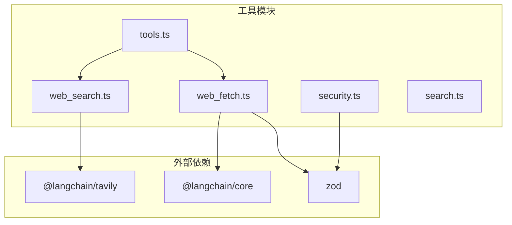
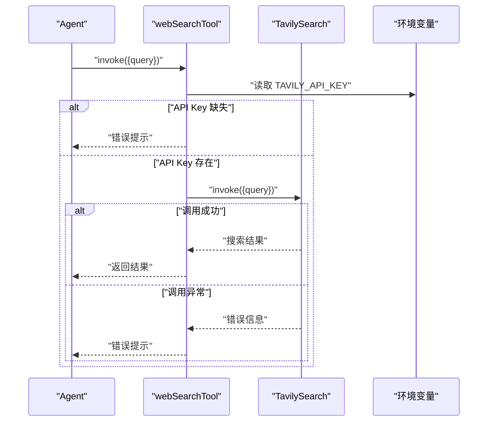
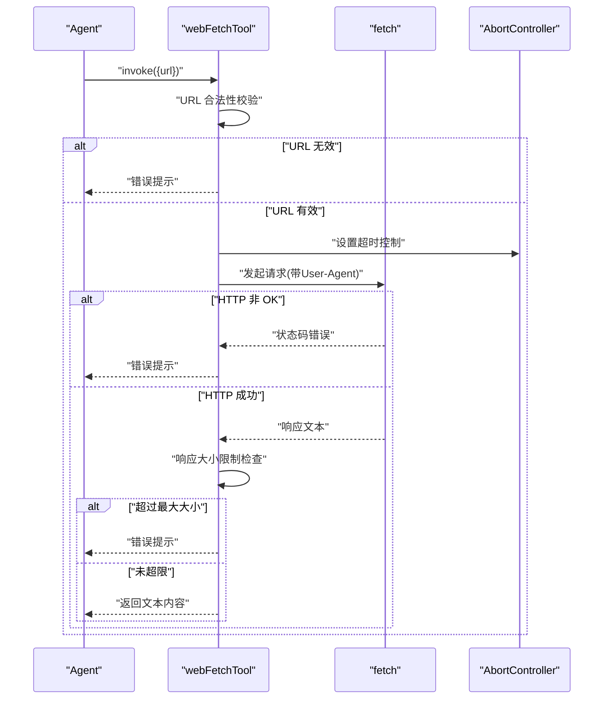
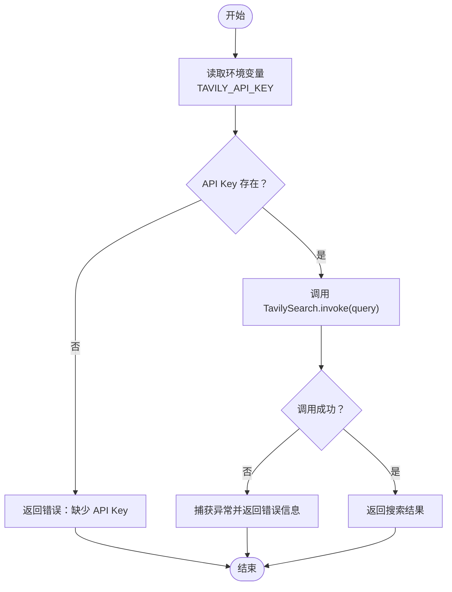
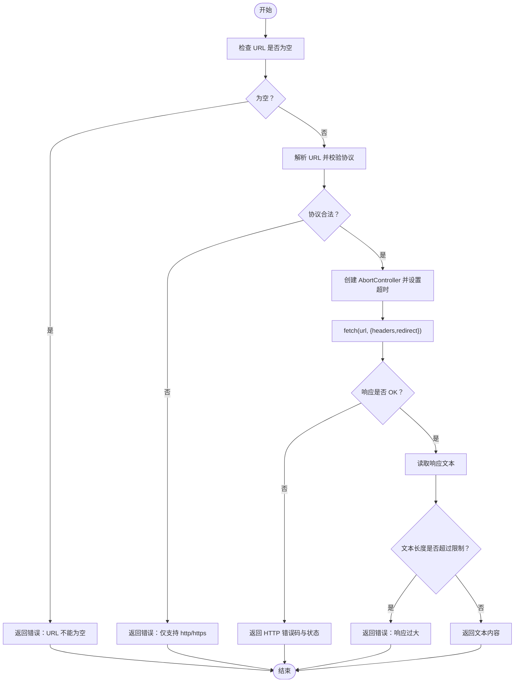
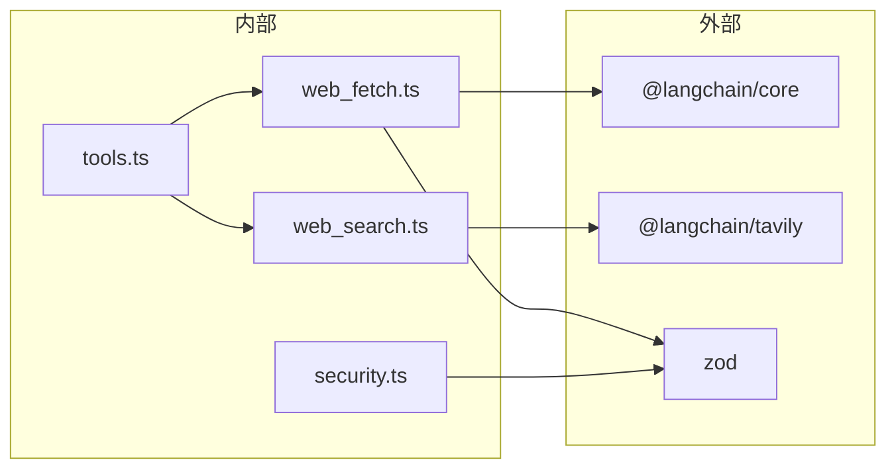

# 网络工具

<cite>
**本文引用的文件**
- [web_search.ts](file://src/agent/tools/web_search.ts)
- [web_fetch.ts](file://src/agent/tools/web_fetch.ts)
- [search.ts](file://src/agent/tools/search.ts)
- [security.ts](file://src/agent/tools/security.ts)
- [tools.ts](file://src/agent/tools.ts)
- [web_search.test.ts](file://src/agent/tools/web_search.test.ts)
- [web_fetch.test.ts](file://src/agent/tools/web_fetch.test.ts)
- [package.json](file://package.json)
- [exec.ts](file://src/agent/tools/exec.ts)
- [run_js.ts](file://src/agent/tools/run_js.ts)
- [run_py.ts](file://src/agent/tools/run_py.ts)
- [read_file.ts](file://src/agent/tools/read_file.ts)
- [write_file.ts](file://src/agent/tools/write_file.ts)
</cite>

## 目录
1. [简介](#简介)
2. [项目结构](#项目结构)
3. [核心组件](#核心组件)
4. [架构总览](#架构总览)
5. [详细组件分析](#详细组件分析)
6. [依赖关系分析](#依赖关系分析)
7. [性能考量](#性能考量)
8. [故障排除指南](#故障排除指南)
9. [结论](#结论)
10. [附录](#附录)

## 简介
本文件面向“网络工具”的使用者与维护者，系统性阐述两类核心网络能力：
- 网页搜索工具：基于外部搜索引擎（Tavily）进行实时搜索，返回结构化结果。
- 网页抓取工具：对指定 URL 发起 HTTP 请求，下载文本内容并进行安全与体积校验。

文档同时涵盖：
- 实现原理与数据流
- 查询优化与结果排序机制（由第三方服务负责）
- 抓取流程中的请求处理、响应解析、内容提取与错误重试策略
- 安全考虑与速率限制
- 使用示例与配置选项
- 性能优化建议与故障排除方法

## 项目结构
网络工具位于 src/agent/tools 目录下，采用按功能分文件的组织方式，便于扩展与测试。核心文件如下：
- web_search.ts：封装 Tavily 搜索引擎调用，提供统一的工具接口
- web_fetch.ts：封装 HTTP 抓取逻辑，含 URL 校验、超时控制、大小限制与错误映射
- search.ts：占位型通用搜索工具（演示用途）
- security.ts：危险 API 模式检测规则与辅助函数
- tools.ts：导出所有工具，供上层 Agent 使用

图表来源
- [tools.ts:1-10](file://src/agent/tools.ts#L1-L10)
- [web_search.ts:1-39](file://src/agent/tools/web_search.ts#L1-L39)
- [web_fetch.ts:1-81](file://src/agent/tools/web_fetch.ts#L1-L81)
- [security.ts:1-27](file://src/agent/tools/security.ts#L1-L27)
- [package.json:21-36](file://package.json#L21-L36)

章节来源
- [tools.ts:1-10](file://src/agent/tools.ts#L1-L10)
- [package.json:1-54](file://package.json#L1-L54)

## 核心组件
- 网页搜索工具（webSearchTool）
  - 功能：调用 Tavily 搜索引擎，返回结构化搜索结果
  - 关键点：API Key 校验、异常捕获、参数校验
- 网页抓取工具（webFetchTool）
  - 功能：对 URL 发起 HTTP 请求，返回文本内容
  - 关键点：URL 合法性校验、超时控制、响应大小限制、错误码映射
- 安全模块（security.ts）
  - 功能：检测潜在危险 API 调用模式，用于文件写入与代码执行工具
  - 关键点：正则匹配集合、辅助判断函数

章节来源
- [web_search.ts:16-38](file://src/agent/tools/web_search.ts#L16-L38)
- [web_fetch.ts:20-80](file://src/agent/tools/web_fetch.ts#L20-L80)
- [security.ts:4-26](file://src/agent/tools/security.ts#L4-L26)

## 架构总览
网络工具在 Agent 中以“工具”形式暴露，调用链路如下：
- Agent 决策 -> 工具选择 -> 参数校验 -> 外部服务调用 -> 结果返回
- 对于抓取工具，额外包含安全与体积校验步骤

图表来源
- [web_search.ts:5-28](file://src/agent/tools/web_search.ts#L5-L28)

图表来源
- [web_fetch.ts:20-70](file://src/agent/tools/web_fetch.ts#L20-L70)

## 详细组件分析

### 网页搜索工具（webSearchTool）
- 设计要点
  - 使用 LangChain 工具包装器，定义输入参数与描述
  - 通过工厂函数创建 TavilySearch 客户端，并设置默认参数（如最大结果数、主题）
  - 统一错误处理：API Key 缺失、调用异常、参数校验失败
- 数据流
  - 输入：查询字符串
  - 输出：搜索结果或错误信息
- 查询优化与排序
  - 由 Tavily 引擎负责，本工具仅透传查询参数
- 安全与稳定性
  - 通过 try/catch 包裹调用，避免崩溃
  - 未实现重试逻辑；若需增强可用在上层 Agent 层增加重试策略

图表来源
- [web_search.ts:5-28](file://src/agent/tools/web_search.ts#L5-L28)

章节来源
- [web_search.ts:16-38](file://src/agent/tools/web_search.ts#L16-L38)
- [web_search.test.ts:20-94](file://src/agent/tools/web_search.test.ts#L20-L94)

### 网页抓取工具（webFetchTool）
- 设计要点
  - URL 合法性校验：仅允许 http/https 协议
  - 超时控制：使用 AbortController 控制请求生命周期
  - 响应大小限制：防止过大响应占用内存
  - 错误映射：针对常见网络错误（DNS、连接拒绝、超时等）给出明确提示
- 数据流
  - 输入：URL 字符串
  - 输出：文本内容或错误信息
- 内容提取
  - 使用 fetch 的 text() 方法获取纯文本
- 错误重试机制
  - 当前未实现自动重试；可通过上层 Agent 的重试策略补充

图表来源
- [web_fetch.ts:20-70](file://src/agent/tools/web_fetch.ts#L20-L70)

章节来源
- [web_fetch.ts:20-80](file://src/agent/tools/web_fetch.ts#L20-L80)
- [web_fetch.test.ts:6-144](file://src/agent/tools/web_fetch.test.ts#L6-L144)

### 安全考虑与速率限制
- 安全考虑
  - 危险 API 模式检测：通过正则匹配常见危险调用（如文件删除、子进程调用、系统级操作等），用于文件写入与代码执行工具
  - URL 抓取工具仅允许 http/https，避免本地文件与不安全协议
- 速率限制
  - 网页搜索工具：由 Tavily 侧进行配额与速率限制，本工具不做客户端限速
  - 网页抓取工具：无显式限速；可通过上层 Agent 控制并发与重试策略

章节来源
- [security.ts:4-26](file://src/agent/tools/security.ts#L4-L26)
- [web_fetch.ts:7-18](file://src/agent/tools/web_fetch.ts#L7-L18)

## 依赖关系分析
- 外部依赖
  - @langchain/core：工具包装与类型约束
  - @langchain/tavily：Tavily 搜索引擎客户端
  - zod：参数 Schema 校验
- 内部依赖
  - tools.ts 统一导出各工具
  - security.ts 被 write_file、exec、run_js、run_py 等工具复用

图表来源
- [tools.ts:1-10](file://src/agent/tools.ts#L1-L10)
- [web_search.ts:1-3](file://src/agent/tools/web_search.ts#L1-L3)
- [web_fetch.ts:1-2](file://src/agent/tools/web_fetch.ts#L1-L2)
- [security.ts:1-2](file://src/agent/tools/security.ts#L1-L2)
- [package.json:21-36](file://package.json#L21-L36)

章节来源
- [package.json:21-36](file://package.json#L21-L36)

## 性能考量
- 网页搜索工具
  - 默认最大结果数较小，适合快速检索；若需要更多结果可在上层 Agent 中调整参数或切换更高配额的服务
  - 异常直接返回，避免阻塞后续任务
- 网页抓取工具
  - 超时时间固定，可根据目标站点响应时间适当调整
  - 响应大小限制可按场景放宽，但需注意内存占用
  - 建议在上层 Agent 中引入并发控制与指数退避重试，以提升成功率与稳定性
- 通用建议
  - 将频繁使用的查询结果缓存至本地或外部缓存系统
  - 对热点域名建立连接池或预热，减少 DNS 与握手开销

## 故障排除指南
- 网页搜索工具
  - 症状：返回“缺少 API Key”
    - 排查：确认环境变量 TAVILY_API_KEY 是否正确设置
  - 症状：返回“调用异常”
    - 排查：检查网络连通性与 Tavily 服务状态
- 网页抓取工具
  - 症状：返回“URL 不能为空”
    - 排查：确认调用参数是否传入 url
  - 症状：返回“仅支持 http/https”
    - 排查：确认 URL 协议是否为 http 或 https
  - 症状：返回“响应过大”
    - 排查：确认目标页面是否包含大量冗余内容，必要时改用更精确的抓取策略
  - 症状：返回“超时”
    - 排查：检查网络延迟与服务器响应时间，考虑延长超时或重试
  - 症状：返回“DNS lookup failed”
    - 排查：确认域名是否存在、DNS 解析是否正常
  - 症状：返回“连接被拒绝/重置”
    - 排查：确认目标主机与端口可达，防火墙与服务状态正常

章节来源
- [web_search.test.ts:54-80](file://src/agent/tools/web_search.test.ts#L54-L80)
- [web_fetch.test.ts:49-138](file://src/agent/tools/web_fetch.test.ts#L49-L138)
- [web_fetch.ts:54-70](file://src/agent/tools/web_fetch.ts#L54-L70)

## 结论
本网络工具提供了简洁可靠的网页搜索与抓取能力：
- 搜索工具通过 Tavily 实现实时检索，具备完善的错误处理
- 抓取工具在安全性、超时与体积限制方面做了基础保障，适合大多数场景
- 建议在上层 Agent 中结合业务需求增加重试、限速与缓存策略，进一步提升稳定性与性能

## 附录

### 使用示例与配置选项
- 网页搜索工具
  - 示例：调用 webSearchTool，传入查询字符串
  - 配置：TAVILY_API_KEY（环境变量）
- 网页抓取工具
  - 示例：调用 webFetchTool，传入 URL
  - 配置：超时时间（毫秒）、最大响应大小（字节）

章节来源
- [web_search.ts:16-38](file://src/agent/tools/web_search.ts#L16-L38)
- [web_fetch.ts:4-5](file://src/agent/tools/web_fetch.ts#L4-L5)

### 相关工具与安全联动
- 文件读取/写入工具
  - 读取：read_file.ts，路径安全检查与文件存在性校验
  - 写入：write_file.ts，路径安全检查与危险 API 模式检测
- 代码执行工具
  - exec.ts：危险命令黑名单、eval 注入模式检测、危险 API 模式检测
  - run_js.ts：Node.js 可用性检查、临时文件执行与清理
  - run_py.ts：Python 环境探测、临时文件执行与清理

章节来源
- [read_file.ts:6-39](file://src/agent/tools/read_file.ts#L6-L39)
- [write_file.ts:7-53](file://src/agent/tools/write_file.ts#L7-L53)
- [exec.ts:94-141](file://src/agent/tools/exec.ts#L94-L141)
- [run_js.ts:22-88](file://src/agent/tools/run_js.ts#L22-L88)
- [run_py.ts:11-93](file://src/agent/tools/run_py.ts#L11-L93)
- [security.ts:4-26](file://src/agent/tools/security.ts#L4-L26)