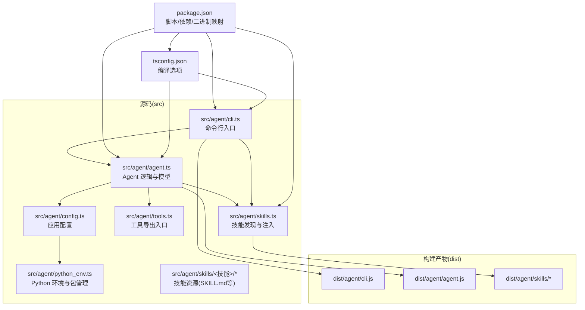
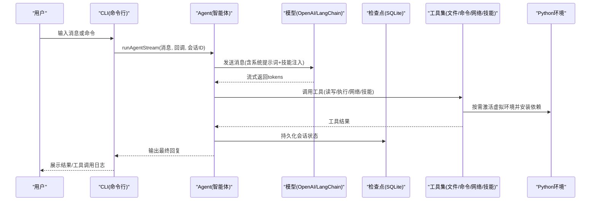
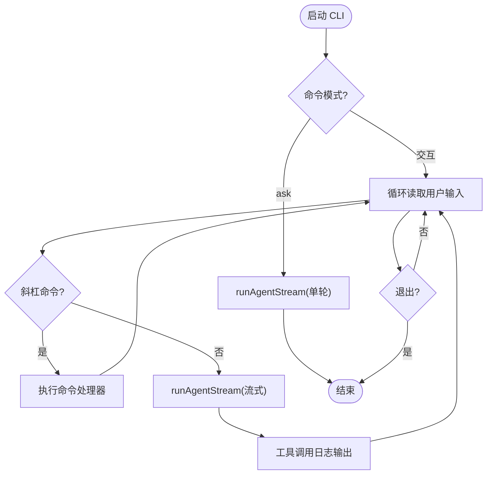
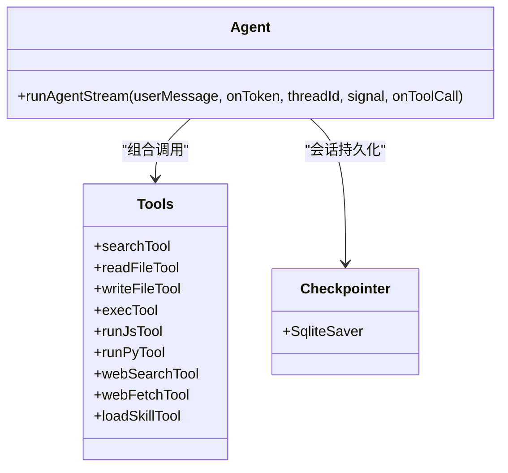
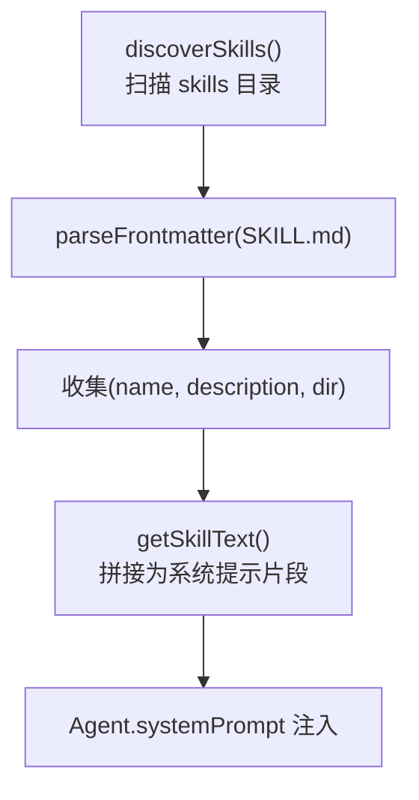
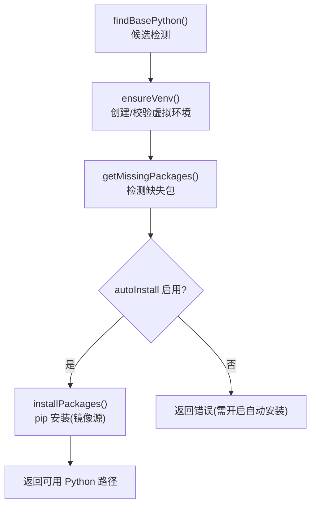
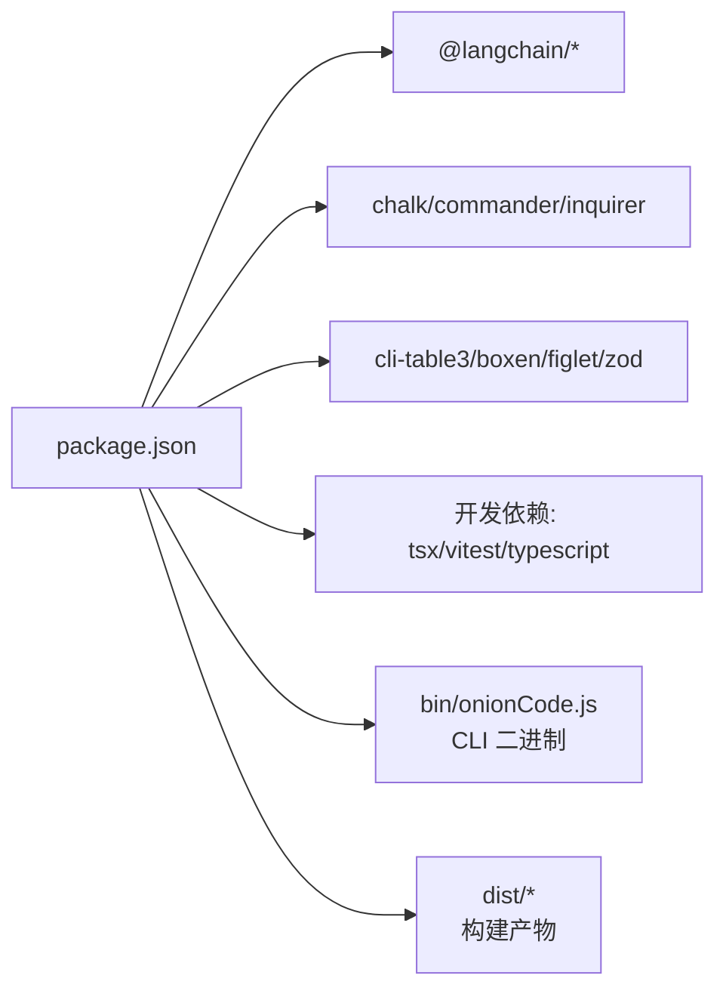

# 开发者指南

<cite>
**本文引用的文件**
- [package.json](file://package.json)
- [tsconfig.json](file://tsconfig.json)
- [src/agent/cli.ts](file://src/agent/cli.ts)
- [src/agent/agent.ts](file://src/agent/agent.ts)
- [src/agent/config.ts](file://src/agent/config.ts)
- [src/agent/python_env.ts](file://src/agent/python_env.ts)
- [src/agent/tools.ts](file://src/agent/tools.ts)
- [src/agent/skills.ts](file://src/agent/skills.ts)
- [src/agent/skills/planner/SKILL.md](file://src/agent/skills/planner/SKILL.md)
- [src/agent/skills/pdf/SKILL.md](file://src/agent/skills/pdf/SKILL.md)
- [src/agent/skills/skill-creator/SKILL.md](file://src/agent/skills/skill-creator/SKILL.md)
- [skills-lock.json](file://skills-lock.json)
- [src/agent/tools/exec.test.ts](file://src/agent/tools/exec.test.ts)
</cite>

## 目录
1. [简介](#简介)
2. [项目结构](#项目结构)
3. [核心组件](#核心组件)
4. [架构总览](#架构总览)
5. [详细组件分析](#详细组件分析)
6. [依赖分析](#依赖分析)
7. [性能考虑](#性能考虑)
8. [调试与测试指南](#调试与测试指南)
9. [构建与发布流程](#构建与发布流程)
10. [代码贡献指南](#代码贡献指南)
11. [常见问题与排错](#常见问题与排错)
12. [结论](#结论)

## 简介
本项目是一个基于 CLI 的智能体（Agent），支持工具调用、技能（Skill）扩展、会话记忆与流式输出，旨在通过自然语言完成文件操作、代码执行、网页检索与数据处理等任务。系统采用 TypeScript 编写，使用 Vitest 进行单元测试，构建产物通过 tsc 编译并复制技能资源。

## 项目结构
项目采用按功能域划分的源码组织方式，核心位于 src/agent 下，包含 CLI、Agent、工具集、技能管理、Python 环境与配置等模块；技能资源位于 src/agent/skills 下，并通过构建脚本复制到 dist/agent/skills。

图示来源
- [src/agent/cli.ts:1-225](file://src/agent/cli.ts#L1-L225)
- [src/agent/agent.ts:1-181](file://src/agent/agent.ts#L1-L181)
- [src/agent/config.ts:1-146](file://src/agent/config.ts#L1-L146)
- [src/agent/python_env.ts:1-223](file://src/agent/python_env.ts#L1-L223)
- [src/agent/tools.ts:1-10](file://src/agent/tools.ts#L1-L10)
- [src/agent/skills.ts:1-142](file://src/agent/skills.ts#L1-L142)
- [package.json:1-54](file://package.json#L1-L54)
- [tsconfig.json:1-20](file://tsconfig.json#L1-L20)

章节来源
- [package.json:1-54](file://package.json#L1-L54)
- [tsconfig.json:1-20](file://tsconfig.json#L1-L20)

## 核心组件
- 命令行入口与交互：负责解析命令、展示启动画面、处理用户输入、会话管理与中断控制。
- Agent 核心：封装模型、工具、检查点（SQLite）、系统提示词与流式输出。
- 工具集：统一导出各类工具（文件读写、命令执行、JS/Python 运行、网络检索/抓取、技能加载）。
- 技能系统：扫描并注入 SKILL.md 描述，动态加载技能内容，辅助 Agent 选择合适能力。
- Python 环境：自动探测/创建虚拟环境、按需安装数据分析依赖、安全检测命令与注入风险。
- 配置中心：提供 Python 镜像源、自动安装开关与交互式配置对话框。

章节来源
- [src/agent/cli.ts:1-225](file://src/agent/cli.ts#L1-L225)
- [src/agent/agent.ts:1-181](file://src/agent/agent.ts#L1-L181)
- [src/agent/tools.ts:1-10](file://src/agent/tools.ts#L1-L10)
- [src/agent/skills.ts:1-142](file://src/agent/skills.ts#L1-L142)
- [src/agent/python_env.ts:1-223](file://src/agent/python_env.ts#L1-L223)
- [src/agent/config.ts:1-146](file://src/agent/config.ts#L1-L146)

## 架构总览
系统以 CLI 为入口，通过 Agent 与工具链协作完成任务；技能通过 SKILL.md 注入系统提示词，增强上下文能力；Python 环境与包管理确保数据分析类任务的可执行性；SQLite 检查点持久化会话状态。

图示来源
- [src/agent/cli.ts:80-224](file://src/agent/cli.ts#L80-L224)
- [src/agent/agent.ts:106-180](file://src/agent/agent.ts#L106-L180)
- [src/agent/python_env.ts:161-170](file://src/agent/python_env.ts#L161-L170)

## 详细组件分析

### CLI 与交互流程
- 支持 ask 单轮问答与默认交互式聊天模式。
- 提供 /new、/sessions、/rewind、/help 等斜杠命令。
- 支持 ESC 中断、首 token 优化显示、工具调用日志流式输出。
- 对常见错误进行格式化提示（内容安全、认证、配额、递归限制、超时）。

图示来源
- [src/agent/cli.ts:53-224](file://src/agent/cli.ts#L53-L224)

章节来源
- [src/agent/cli.ts:1-225](file://src/agent/cli.ts#L1-L225)

### Agent 与工具链
- 使用 LangChain 的 ChatOpenAI，启用流式输出与检查点。
- 工具集统一导出，便于 Agent 组合调用。
- 工具调用分片聚合，确保工具名与参数完整后再回调。

图示来源
- [src/agent/agent.ts:80-95](file://src/agent/agent.ts#L80-L95)
- [src/agent/tools.ts:1-10](file://src/agent/tools.ts#L1-L10)

章节来源
- [src/agent/agent.ts:1-181](file://src/agent/agent.ts#L1-L181)
- [src/agent/tools.ts:1-10](file://src/agent/tools.ts#L1-L10)

### 技能系统
- 发现规则：遍历 skills 目录，读取每个子目录下的 SKILL.md frontmatter。
- 注入策略：将技能名称与描述拼接为文本注入系统提示词，指导 Agent 使用 load_skill 工具加载完整内容。
- 资源定位：优先使用构建后 dist/agent/skills，回退至 src/agent/skills。

图示来源
- [src/agent/skills.ts:56-141](file://src/agent/skills.ts#L56-L141)

章节来源
- [src/agent/skills.ts:1-142](file://src/agent/skills.ts#L1-L142)
- [src/agent/skills/planner/SKILL.md:1-91](file://src/agent/skills/planner/SKILL.md#L1-L91)
- [src/agent/skills/pdf/SKILL.md:1-315](file://src/agent/skills/pdf/SKILL.md#L1-L315)
- [src/agent/skills/skill-creator/SKILL.md:1-486](file://src/agent/skills/skill-creator/SKILL.md#L1-L486)

### Python 环境与安全
- 自动探测 Python3，创建虚拟环境，缓存路径。
- 按需检测缺失包并安装，支持镜像源与可信主机配置。
- 命令安全：阻断危险命令（rm/sudo/chmod/mv/cp）、eval 注入（node -e/python -c）、危险 API 调用模式。

图示来源
- [src/agent/python_env.ts:58-170](file://src/agent/python_env.ts#L58-L170)

章节来源
- [src/agent/python_env.ts:1-223](file://src/agent/python_env.ts#L1-L223)
- [src/agent/config.ts:1-146](file://src/agent/config.ts#L1-L146)

### 配置中心
- 默认配置：Python 虚拟环境路径、自动安装开关、pip 镜像源与可信主机。
- 交互式配置：通过 inquirer 引导用户设置镜像源、自动安装与初始化环境。
- 配置持久化：保存到 .data/config.json。

章节来源
- [src/agent/config.ts:22-145](file://src/agent/config.ts#L22-L145)

## 依赖分析
- 运行时依赖：LangChain 生态（OpenAI、LangGraph、SQLite 检查点）、命令行交互（chalk、commander、inquirer）、表格与终端美化（cli-table3、boxen、figlet）、类型验证（zod）。
- 开发时依赖：TypeScript、tsx（开发热启）、vitest（测试）、ts-node（TS 执行）。
- 构建策略：tsc 编译 + 复制技能资源到 dist。

图示来源
- [package.json:21-52](file://package.json#L21-L52)

章节来源
- [package.json:1-54](file://package.json#L1-L54)

## 性能考虑
- 流式输出：Agent 以流式方式返回 tokens，降低首屏延迟，提升交互体验。
- 会话复用：通过线程 ID 与 SQLite 检查点实现历史续接，减少重复计算。
- 工具调用聚合：对工具调用分片进行累积与解析，避免频繁回调开销。
- Python 环境缓存：首次探测与创建后缓存路径，避免重复创建。
- 镜像加速：默认清华源镜像与可信主机配置，缩短依赖安装时间。

## 调试与测试指南

### 开发环境搭建
- Node.js 与包管理：使用 pnpm，遵循 onlyBuiltDependencies 配置以正确处理原生依赖。
- TypeScript：严格模式、ESNext 模块解析、声明文件输出。
- 本地开发：使用 dev 脚本直接运行 CLI，无需预编译。
- 环境变量：OPENAI_API_KEY、OPENAI_MODEL、DeepSeek 基座地址通过环境变量配置。

章节来源
- [package.json:13-18](file://package.json#L13-L18)
- [tsconfig.json:2-16](file://tsconfig.json#L2-L16)
- [src/agent/agent.ts:60-77](file://src/agent/agent.ts#L60-L77)

### 调试技巧
- CLI 中断：在交互模式下按 ESC 中断当前执行。
- 工具调用日志：工具调用详情与行数会随流输出，便于定位执行点。
- 错误格式化：针对内容安全、认证、配额、递归限制、超时等场景提供友好提示。
- Python 环境诊断：确认虚拟环境路径、镜像源与自动安装开关。

章节来源
- [src/agent/cli.ts:16-51](file://src/agent/cli.ts#L16-L51)
- [src/agent/cli.ts:122-178](file://src/agent/cli.ts#L122-L178)
- [src/agent/config.ts:71-145](file://src/agent/config.ts#L71-L145)

### 测试策略
- 单元测试：使用 Vitest，覆盖工具安全性与边界条件。
- 示例：exec 工具测试覆盖危险命令阻断、eval 注入检测、空命令与不存在命令等场景。
- 建议：为新工具增加 invoke 参数校验与安全检测用例；为 Agent 流式输出增加分片聚合与中断处理测试。

章节来源
- [src/agent/tools/exec.test.ts:1-150](file://src/agent/tools/exec.test.ts#L1-L150)
- [package.json:17-17](file://package.json#L17-L17)

## 构建与发布流程
- 构建命令：tsc 编译 TypeScript，复制 src/agent/skills/* 到 dist/agent/skills。
- 启动命令：运行 dist/agent/cli.js。
- 二进制映射：bin/onionCode.js 由 CLI 入口生成。
- 依赖安装：pnpm 安装，原生依赖仅在构建时处理。

章节来源
- [package.json:13-18](file://package.json#L13-L18)
- [tsconfig.json:7-16](file://tsconfig.json#L7-L16)

## 代码贡献指南
- 编码规范
  - 严格 TypeScript 编译选项，保持类型安全与一致的模块解析。
  - 工具函数与类方法职责单一，错误处理显式且可恢复。
  - 命令安全：新增工具必须包含危险命令与注入检测。
- 提交规范
  - 语义化提交，变更类型（feat/fix/docs/style/refactor/test/build/ci）清晰标注。
  - 附带测试用例，尤其是安全与边界场景。
- PR 流程
  - fork -> 分支 -> 提交 -> PR -> 代码评审 -> 合并。
  - CI 通过（构建、类型检查、测试）方可合并。

## 常见问题与排错
- Python 依赖安装失败
  - 检查镜像源与可信主机配置，确认 autoInstall 开关。
  - 使用 /config 初始化环境或手动创建虚拟环境。
- 命令被阻断
  - 确认命令不在危险名单或 eval 注入模式中。
- API Key/配额问题
  - 检查 OPENAI_API_KEY、模型名称与配额状态。
- 会话异常
  - 清理 .data/checkpointer.db 或使用 /sessions 查看历史会话。

章节来源
- [src/agent/python_env.ts:127-159](file://src/agent/python_env.ts#L127-L159)
- [src/agent/config.ts:66-69](file://src/agent/config.ts#L66-L69)
- [src/agent/cli.ts:16-51](file://src/agent/cli.ts#L16-L51)

## 结论
本项目通过 CLI、Agent、工具链与技能系统的协同，提供了可扩展的终端智能体能力。借助严格的类型约束、安全的命令执行策略与完善的测试体系，开发者可以快速扩展新工具与技能，同时保证运行稳定性与安全性。