# CLAUDE 关于 assistant-ui 的使用指南

<cite>
**本文档引用的文件**
- [SKILL.md](file://.agents/skills/assistant-ui/SKILL.md)
- [architecture.md](file://.agents/skills/assistant-ui/references/architecture.md)
- [packages.md](file://.agents/skills/assistant-ui/references/packages.md)
- [App.tsx](file://src/agent/ui/App.tsx)
- [Thread.tsx](file://src/agent/ui/Thread.tsx)
- [adapter.ts](file://src/agent/ui/adapter.ts)
- [agent.ts](file://src/agent/agent.ts)
- [cli.ts](file://src/agent/cli.ts)
- [package.json](file://package.json)
- [CLAUDE.md](file://CLAUDE.md)
- [tools.ts](file://src/agent/tools.ts)
- [search.ts](file://src/agent/tools/search.ts)
- [web_search.ts](file://src/agent/tools/web_search.ts)
- [slash_commands.ts](file://src/agent/slash_commands.ts)
</cite>

## 更新摘要
**变更内容**
- 更新 Thread 组件部分以反映重大 UI 现代化改进
- 新增 MarkdownTextPrimitive 组件使用说明
- 更新输入区域视觉设计描述
- 改进状态栏格式化说明
- 更新快捷键指示符展示

## 目录
1. [简介](#简介)
2. [项目结构](#项目结构)
3. [核心组件](#核心组件)
4. [架构概览](#架构概览)
5. [详细组件分析](#详细组件分析)
6. [依赖关系分析](#依赖关系分析)
7. [性能考虑](#性能考虑)
8. [故障排除指南](#故障排除指南)
9. [结论](#结论)

## 简介

assistant-ui 是一个基于 React 的聊天界面构建库，提供了可组合的 UI 原语来构建 AI 聊天界面。该项目展示了如何在实际应用中使用 assistant-ui 构建 CLI AI 助手界面。

本项目是一个 CLI 应用，集成了 LangGraph 代理、assistant-ui 聊天界面、以及多种工具函数，提供了一个完整的 AI 助手解决方案。

## 项目结构

项目采用模块化的组织方式，主要包含以下结构：

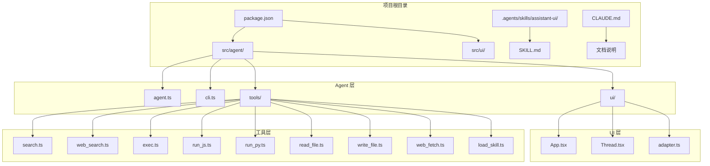

**图表来源**
- [package.json:1-61](file://package.json#L1-L61)
- [agent.ts:1-181](file://src/agent/agent.ts#L1-L181)
- [App.tsx:1-30](file://src/agent/ui/App.tsx#L1-L30)

**章节来源**
- [package.json:1-61](file://package.json#L1-L61)
- [CLAUDE.md:1-13](file://CLAUDE.md#L1-L13)

## 核心组件

### assistant-ui 核心架构

assistant-ui 采用了四层架构设计，每层只依赖于其下方的层：

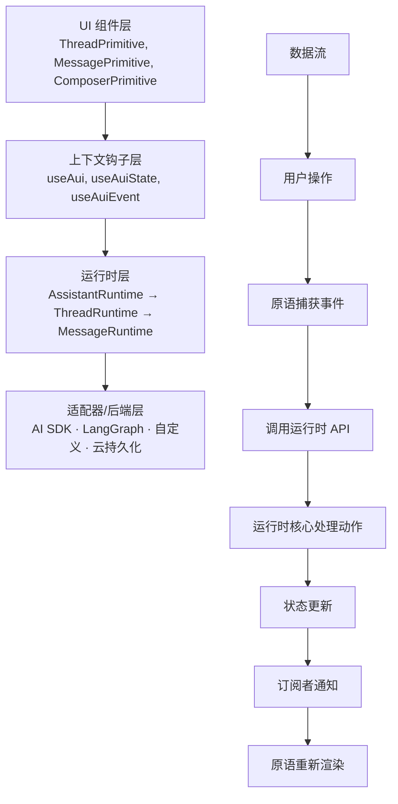

**图表来源**
- [architecture.md:26-52](file://.agents/skills/assistant-ui/references/architecture.md#L26-L52)
- [architecture.md:82-104](file://.agents/skills/assistant-ui/references/architecture.md#L82-L104)

### 消息模型

assistant-ui 支持多种消息类型和内容部分：

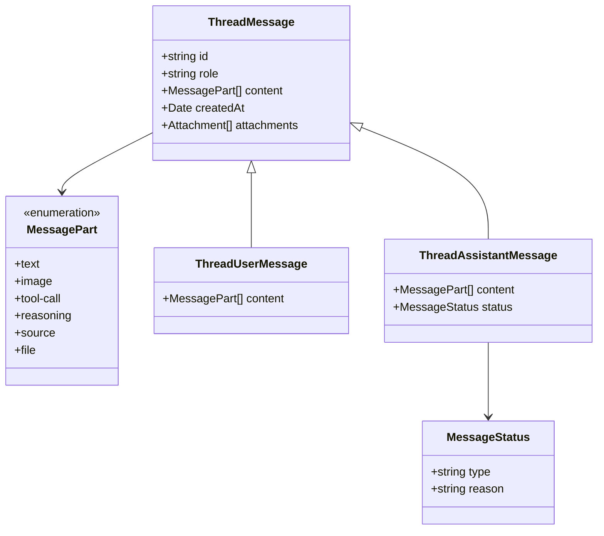

**图表来源**
- [architecture.md:106-158](file://.agents/skills/assistant-ui/references/architecture.md#L106-L158)

**章节来源**
- [architecture.md:1-174](file://.agents/skills/assistant-ui/references/architecture.md#L1-L174)

## 架构概览

### 包管理策略

项目使用了多种 assistant-ui 相关包来构建完整的聊天界面：

```mermaid
graph LR
subgraph "核心包"
A[@assistant-ui/react-ink] --> B[CLI 界面原语]
C[@assistant-ui/react-ink-markdown] --> D[Markdown 渲染]
end
subgraph "AI 集成"
E[LangChain] --> F[LangGraph]
G[OpenAI] --> H[ChatOpenAI]
end
subgraph "工具集成"
I[搜索工具] --> J[网络搜索]
K[文件工具] --> L[代码执行]
M[Web 工具] --> N[网页抓取]
end
A --> E
B --> I
C --> J
D --> K
E --> L
F --> M
G --> N
```

**图表来源**
- [packages.md:10-37](file://.agents/skills/assistant-ui/references/packages.md#L10-L37)
- [package.json:21-42](file://package.json#L21-L42)

### 运行时选择策略

根据不同的使用场景选择合适的运行时：

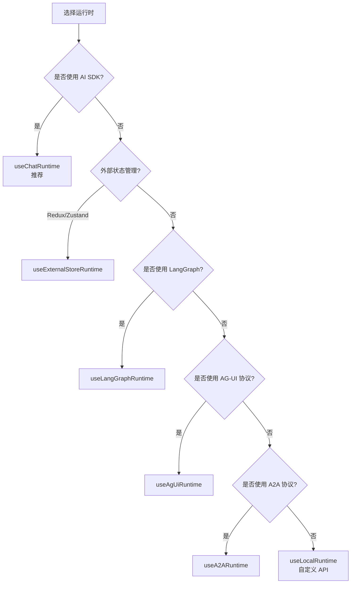

**图表来源**
- [SKILL.md:52-63](file://.agents/skills/assistant-ui/SKILL.md#L52-L63)

**章节来源**
- [packages.md:139-154](file://.agents/skills/assistant-ui/references/packages.md#L139-L154)
- [SKILL.md:52-63](file://.agents/skills/assistant-ui/SKILL.md#L52-L63)

## 详细组件分析

### 应用入口组件

App.tsx 是整个应用的根组件，负责设置运行时环境：

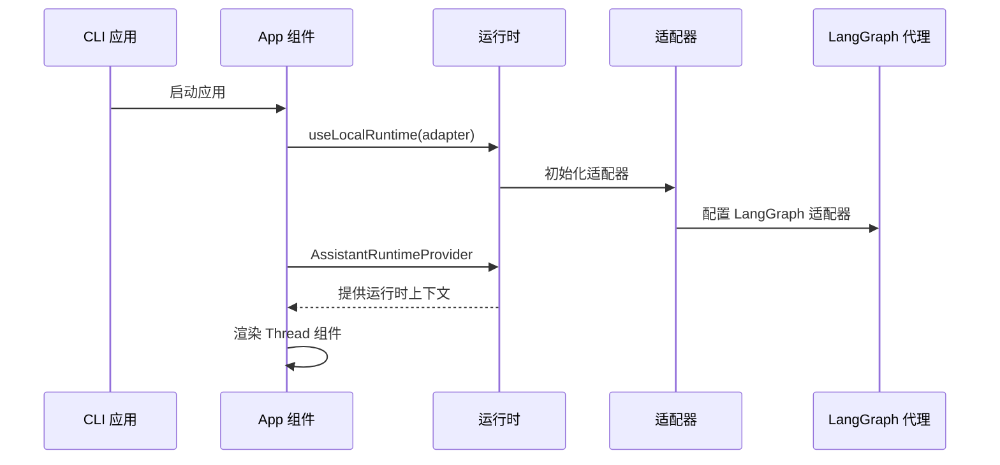

**图表来源**
- [App.tsx:15-29](file://src/agent/ui/App.tsx#L15-L29)
- [adapter.ts:16-86](file://src/agent/ui/adapter.ts#L16-L86)

### 聊天界面组件

**更新** Thread.tsx 实现了完整的聊天界面，包括用户消息、AI 消息、加载状态等，并进行了重大 UI 现代化改进：

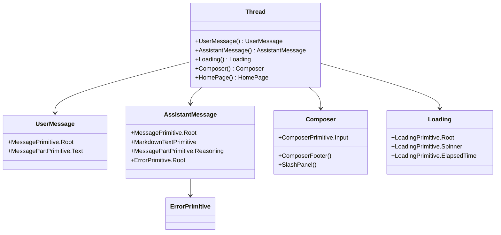

**图表来源**
- [Thread.tsx:82-137](file://src/agent/ui/Thread.tsx#L82-L137)
- [Thread.tsx:296-341](file://src/agent/ui/Thread.tsx#L296-L341)

**更新** 主要 UI 改进包括：

1. **官方 MarkdownTextPrimitive 组件**：AI 消息现在使用 `MarkdownTextPrimitive` 替代自定义文本渲染，提供更好的 Markdown 支持
2. **现代化输入区域设计**：输入区域采用灰色背景和边框设计，提升视觉一致性
3. **改进的状态栏格式化**：使用 `StatusBarPrimitive.Root` 组件提供统一的状态栏布局
4. **优化的快捷键指示符**：快捷键显示格式更加清晰易读

### 适配器实现

adapter.ts 实现了 LangGraph 与 assistant-ui 之间的适配：

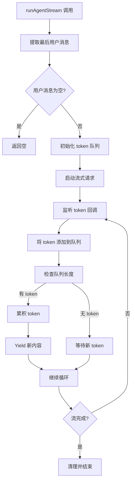

**图表来源**
- [adapter.ts:17-85](file://src/agent/ui/adapter.ts#L17-L85)

**章节来源**
- [App.tsx:1-30](file://src/agent/ui/App.tsx#L1-L30)
- [Thread.tsx:1-392](file://src/agent/ui/Thread.tsx#L1-L392)
- [adapter.ts:1-87](file://src/agent/ui/adapter.ts#L1-L87)

### 代理执行流程

agent.ts 实现了完整的代理执行逻辑，包括工具调用和流式响应：

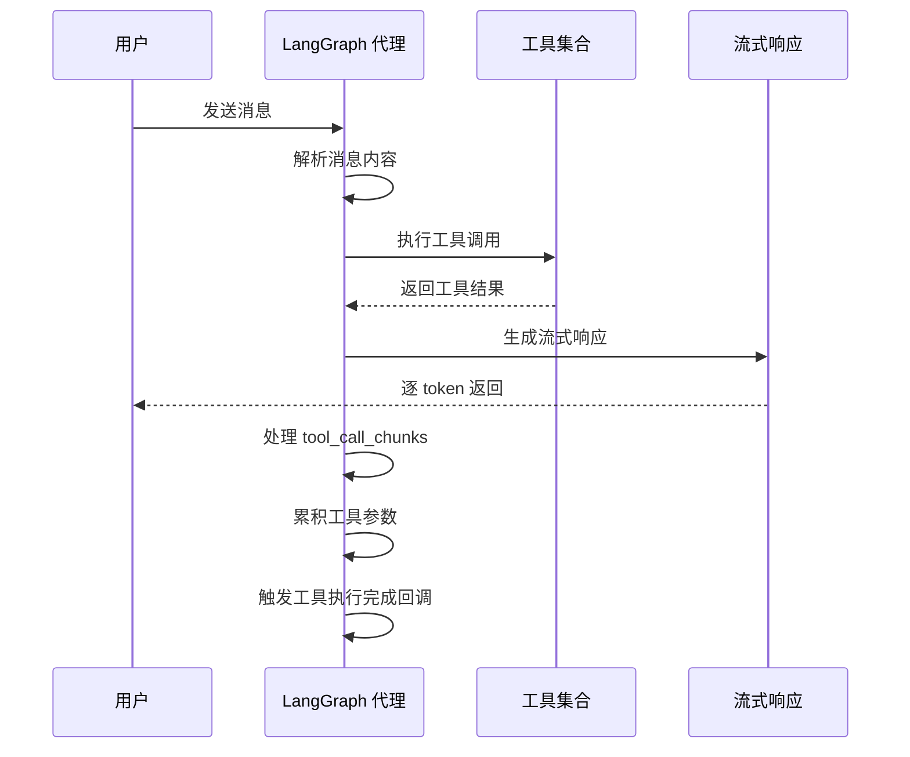

**图表来源**
- [agent.ts:106-180](file://src/agent/agent.ts#L106-L180)

**章节来源**
- [agent.ts:1-181](file://src/agent/agent.ts#L1-L181)

### CLI 命令行接口

cli.ts 提供了两种运行模式：交互模式和单轮问答模式：

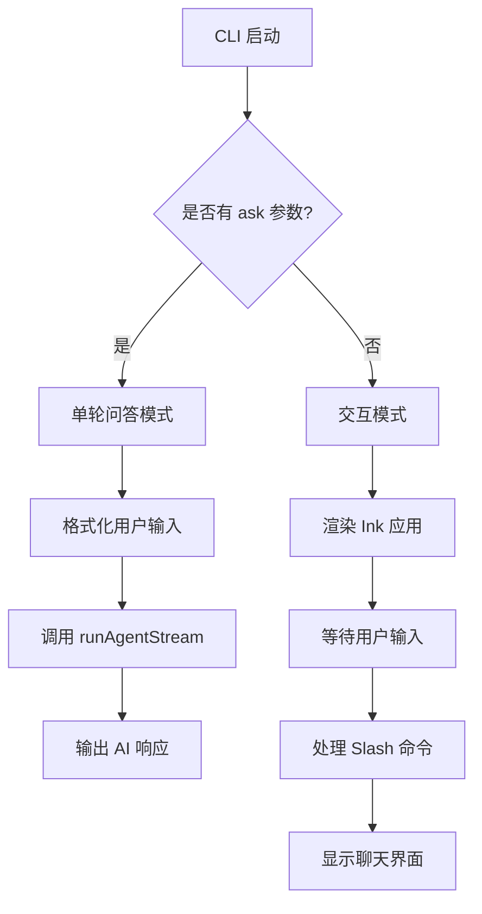

**图表来源**
- [cli.ts:28-57](file://src/agent/cli.ts#L28-L57)

**章节来源**
- [cli.ts:1-60](file://src/agent/cli.ts#L1-L60)

## 依赖关系分析

### 核心依赖关系

项目的核心依赖关系如下：

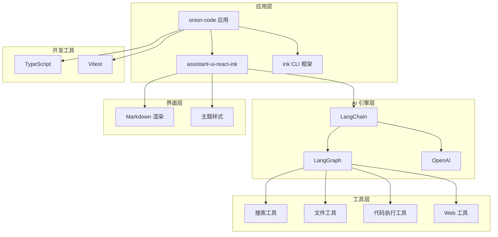

**图表来源**
- [package.json:21-42](file://package.json#L21-L42)
- [tools.ts:1-10](file://src/agent/tools.ts#L1-L10)

### 工具函数依赖

工具函数的依赖关系：

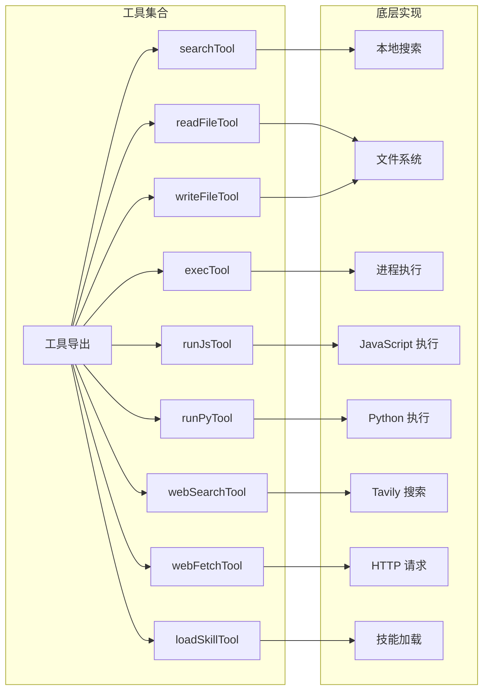

**图表来源**
- [tools.ts:1-10](file://src/agent/tools.ts#L1-L10)
- [web_search.ts:16-38](file://src/agent/tools/web_search.ts#L16-L38)

**章节来源**
- [package.json:1-61](file://package.json#L1-L61)
- [tools.ts:1-10](file://src/agent/tools.ts#L1-L10)

## 性能考虑

### 流式处理优化

项目实现了高效的流式处理机制：

1. **异步生成器模式**：使用 async generator 实现流式响应
2. **令牌队列机制**：通过队列缓冲减少频繁的 UI 更新
3. **内存管理**：及时清理工具调用累积的数据
4. **取消支持**：支持 AbortSignal 实现快速中断

### 缓存和状态管理

- **SQLite 持久化**：使用 SqliteSaver 实现状态持久化
- **会话管理**：通过 thread_id 实现多会话支持
- **递归限制**：设置 recursionLimit 防止无限递归

## 故障排除指南

### 常见错误处理

CLI 提供了详细的错误信息格式化：

| 错误类型 | 检测条件 | 用户提示 |
|---------|---------|---------|
| 安全审查拦截 | 包含 "Content Exists Risk" | "请求被安全审查拦截（Content Exists Risk）。可尝试换个问法或简化查询。" |
| API 密钥无效 | 包含 "401" 或 "Incorrect API key" | "API Key 无效或未配置，请检查 .env 中的 OPENAI_API_KEY。" |
| 额度不足 | 包含 "insufficient_quota" 或 "429" | "API 额度不足（429），请检查账户余额。" |
| 递归限制 | 包含 "Recursion limit" | "Agent 执行步数超出限制（recursionLimit）。可尝试拆分为多个小步骤。" |
| 网络超时 | 包含 "ETIMEDOUT" 或 "timeout" | "请求超时，请检查网络连接后重试。" |

### 调试建议

1. **检查环境变量**：确保 OPENAI_API_KEY 和其他必要变量已正确设置
2. **验证网络连接**：确认能够访问 OpenAI API
3. **查看日志输出**：利用 Ink 界面的详细状态信息
4. **测试工具函数**：单独测试各个工具的可用性

**章节来源**
- [cli.ts:13-26](file://src/agent/cli.ts#L13-L26)

## 结论

本项目展示了如何使用 assistant-ui 构建一个功能完整的 CLI AI 助手应用。通过合理的架构设计和模块化组织，实现了：

1. **清晰的分层架构**：从 UI 原语到运行时再到后端适配器的清晰分离
2. **灵活的运行时选择**：支持多种后端集成方案
3. **丰富的工具生态**：集成了搜索、文件操作、代码执行等多种工具
4. **优秀的用户体验**：提供了流畅的流式响应和直观的 CLI 界面

**更新** 特别值得一提的是，Thread 组件经过重大 UI 现代化改进，包括使用官方 MarkdownTextPrimitive 组件、现代化输入区域设计、改进的状态栏格式化和优化的快捷键指示符，显著提升了聊天界面的视觉设计和用户体验。

该项目为使用 assistant-ui 构建聊天界面提供了很好的参考实现，特别是在 CLI 环境下的集成方案。