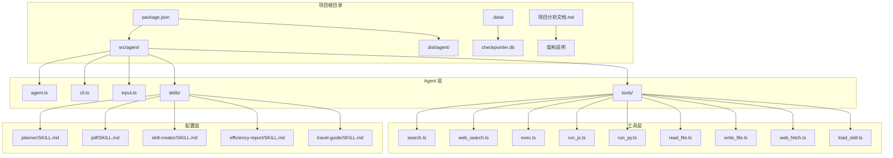
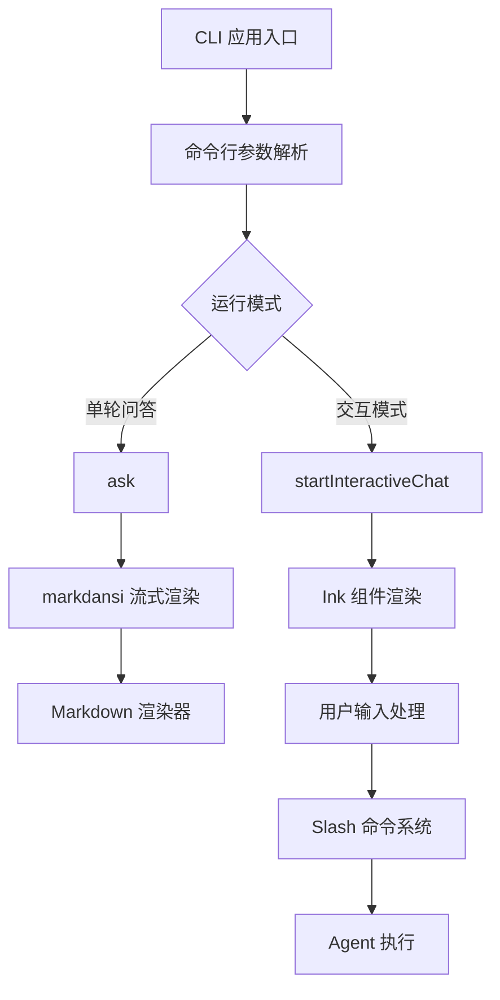
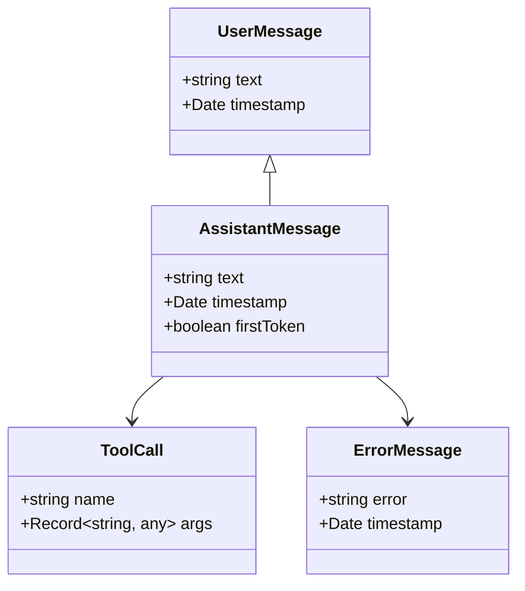
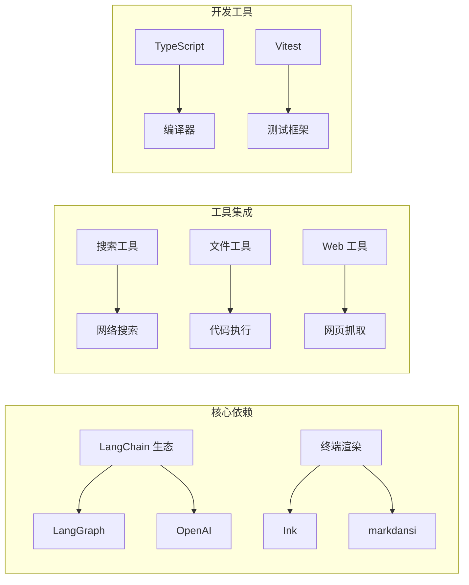
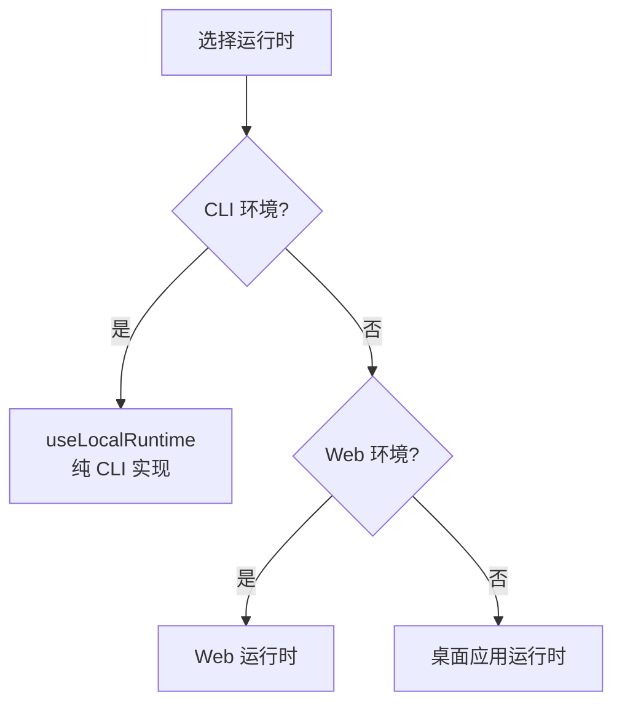
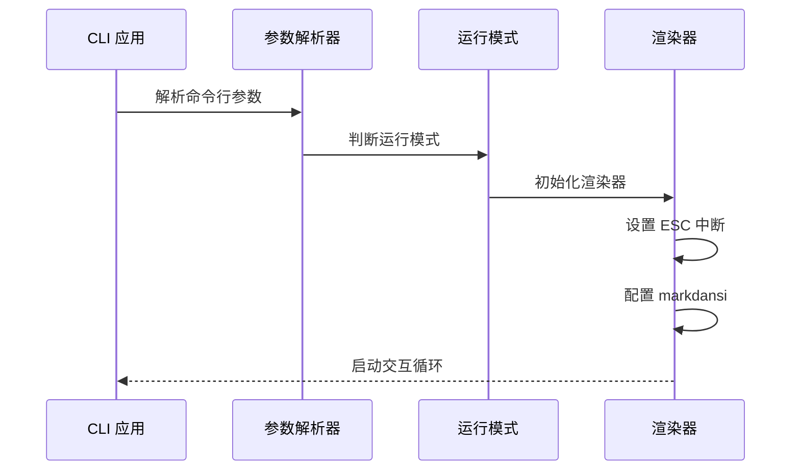
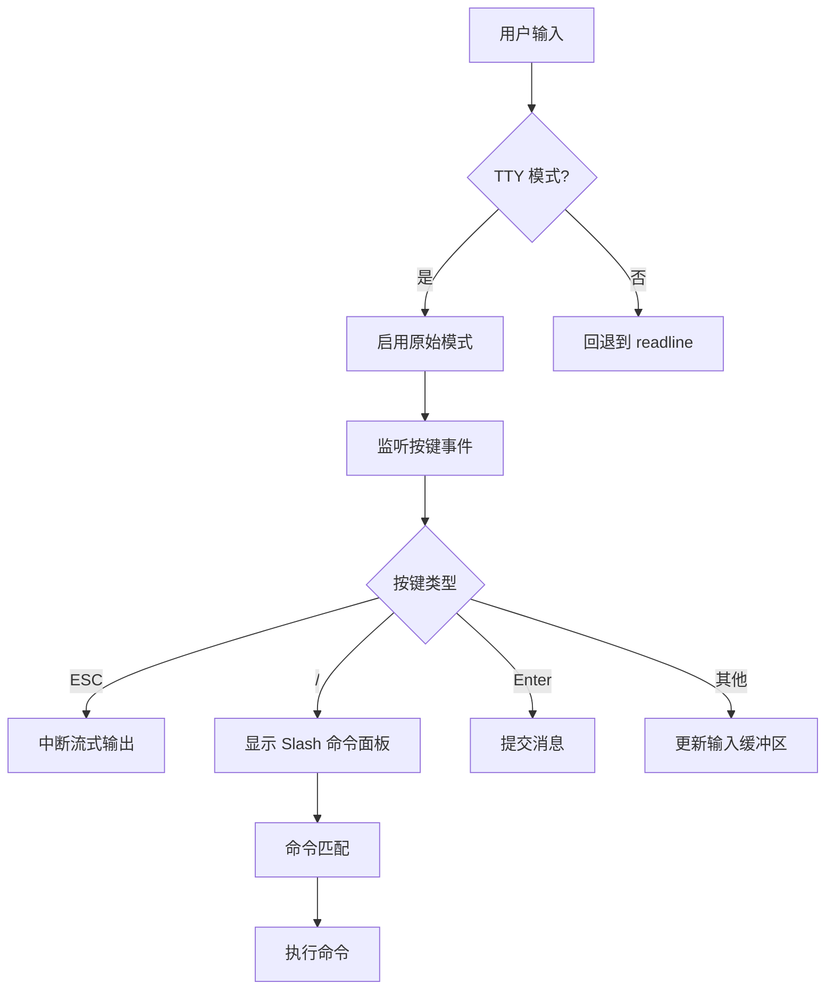
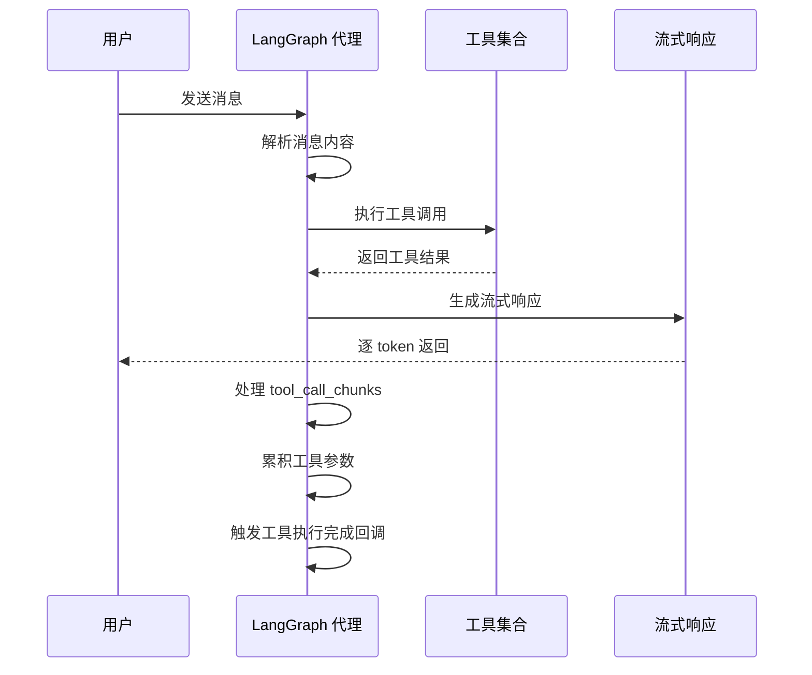
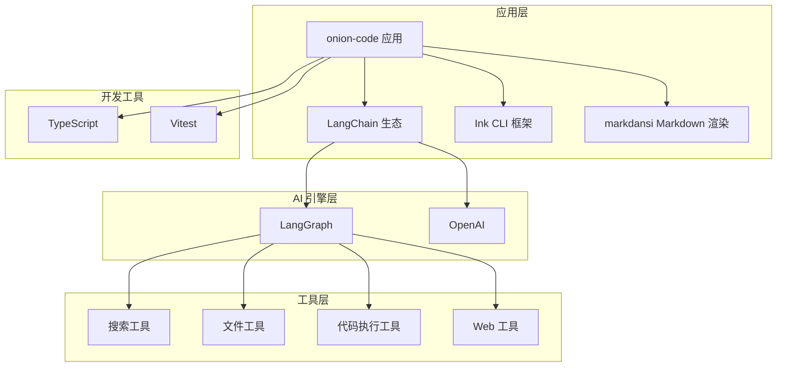
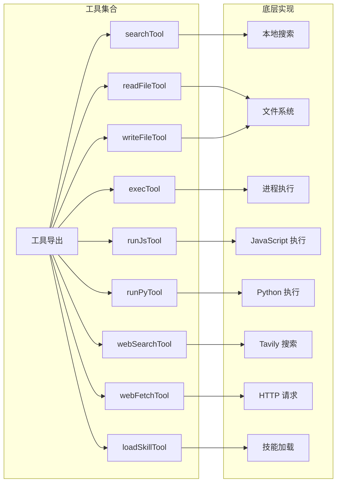

# CLAUDE 关于 assistant-ui 的使用指南

<cite>
**本文档引用的文件**
- [package.json](file://package.json)
- [项目分析文档.md](file://项目分析文档.md)
- [src/agent/cli.ts](file://src/agent/cli.ts)
- [src/agent/agent.ts](file://src/agent/agent.ts)
- [src/agent/input.ts](file://src/agent/input.ts)
- [src/agent/style.ts](file://src/agent/style.ts)
- [src/agent/tools.ts](file://src/agent/tools.ts)
- [src/agent/tools/search.ts](file://src/agent/tools/search.ts)
- [src/agent/tools/web_search.ts](file://src/agent/tools/web_search.ts)
- [src/agent/slash_commands.ts](file://src/agent/slash_commands.ts)
</cite>

## 更新摘要
**变更内容**
- 更新以反映 CLAUDE.md 文件已被删除的情况
- 移除关于 assistant-ui UI 组件的相关内容
- 将文档重点转向项目实际的 CLI 实现
- 更新架构图以反映真实的项目结构

## 目录
1. [简介](#简介)
2. [项目结构](#项目结构)
3. [核心组件](#核心组件)
4. [架构概览](#架构概览)
5. [详细组件分析](#详细组件分析)
6. [依赖关系分析](#依赖关系分析)
7. [性能考虑](#性能考虑)
8. [故障排除指南](#故障排除指南)
9. [结论](#结论)

## 简介

本项目是一个基于 TypeScript 的 CLI AI 助手应用，集成了 LangChain 代理、多种工具函数，提供了一个完整的 AI 助手解决方案。项目最初可能涉及 assistant-ui 相关内容，但经过分析发现 CLAUDE.md 文件已被删除，相关的指导信息已整合到项目分析文档中。

**更新** 项目现已完全基于纯 CLI 实现，使用 Ink 和 markdansi 库来提供终端内的流式渲染体验，而非 assistant-ui 组件。

## 项目结构

项目采用模块化的组织方式，主要包含以下结构：



**图表来源**
- [package.json:1-55](file://package.json#L1-L55)
- [项目分析文档.md:300-345](file://项目分析文档.md#L300-L345)

**章节来源**
- [package.json:1-55](file://package.json#L1-L55)
- [项目分析文档.md:1-345](file://项目分析文档.md#L1-L345)

## 核心组件

### CLI 应用架构

项目采用了基于 Ink 的纯 CLI 架构，提供流式终端渲染：



**图表来源**
- [src/agent/cli.ts:144-187](file://src/agent/cli.ts#L144-L187)
- [src/agent/input.ts:131-260](file://src/agent/input.ts#L131-L260)

### 消息模型

项目使用简化的消息模型，专注于 CLI 环境：



**图表来源**
- [src/agent/cli.ts:166-187](file://src/agent/cli.ts#L166-L187)

**章节来源**
- [src/agent/cli.ts:1-187](file://src/agent/cli.ts#L1-L187)
- [src/agent/input.ts:1-260](file://src/agent/input.ts#L1-L260)

## 架构概览

### 包管理策略

项目使用了精简的依赖管理策略，专注于 CLI 功能：



**图表来源**
- [package.json:21-37](file://package.json#L21-L37)

### 运行时选择策略

项目采用单一运行时策略，专注于 CLI 环境：



**章节来源**
- [package.json:21-37](file://package.json#L21-L37)

## 详细组件分析

### CLI 应用入口

cli.ts 实现了完整的 CLI 应用入口，支持两种运行模式：



**图表来源**
- [src/agent/cli.ts:144-187](file://src/agent/cli.ts#L144-L187)

### 输入处理系统

input.ts 实现了高级的 TTY 输入处理，包括 Slash 命令面板：



**图表来源**
- [src/agent/input.ts:131-260](file://src/agent/input.ts#L131-L260)

### 代理执行流程

agent.ts 实现了完整的代理执行逻辑，包括工具调用和流式响应：



**图表来源**
- [src/agent/agent.ts:102-141](file://src/agent/agent.ts#L102-L141)

**章节来源**
- [src/agent/cli.ts:1-187](file://src/agent/cli.ts#L1-L187)
- [src/agent/input.ts:1-260](file://src/agent/input.ts#L1-L260)
- [src/agent/agent.ts:1-181](file://src/agent/agent.ts#L1-L181)

### Slash 命令系统

slash_commands.ts 定义了统一的 Slash 命令接口和内置命令：

```mermaid
graph LR
subgraph "Slash 命令系统"
A[SlashCommand 接口] --> B[内置命令]
B --> C[/config 配置中心]
B --> D[/sessions 会话管理]
B --> E[/rewind 会话切换]
B --> F[/new 新建会话]
B --> G[/help 帮助信息]
B --> H[/exit 退出程序]
end
subgraph "匹配逻辑"
I[前缀匹配] --> J[大小写不敏感]
J --> K[参数解析]
end
```

**图表来源**
- [src/agent/slash_commands.ts:66-78](file://src/agent/slash_commands.ts#L66-L78)

**章节来源**
- [src/agent/slash_commands.ts:1-100](file://src/agent/slash_commands.ts#L1-L100)

## 依赖关系分析

### 核心依赖关系

项目的核心依赖关系如下：



**图表来源**
- [package.json:21-37](file://package.json#L21-L37)

### 工具函数依赖

工具函数的依赖关系：



**图表来源**
- [src/agent/tools.ts:1-10](file://src/agent/tools.ts#L1-L10)
- [src/agent/tools/web_search.ts:16-38](file://src/agent/tools/web_search.ts#L16-L38)

**章节来源**
- [package.json:1-55](file://package.json#L1-L55)
- [src/agent/tools.ts:1-10](file://src/agent/tools.ts#L1-L10)

## 性能考虑

### 流式处理优化

项目实现了高效的流式处理机制：

1. **markdansi 流式渲染**：使用 `createMarkdownStreamer` 实现 Markdown 的增量渲染
2. **ESC 中断机制**：通过原始模式监听 ESC 键实现快速中断
3. **内存管理**：及时清理工具调用累积的数据
4. **超时控制**：为各种网络请求设置合理的超时时间

### 缓存和状态管理

- **SQLite 持久化**：使用 SqliteSaver 实现状态持久化
- **会话管理**：通过 thread_id 实现多会话支持
- **递归限制**：设置 recursionLimit 防止无限递归

## 故障排除指南

### 常见错误处理

CLI 提供了详细的错误信息格式化：

| 错误类型 | 检测条件 | 用户提示 |
|---------|---------|---------|
| 安全审查拦截 | 包含 "Content Exists Risk" | "请求被安全审查拦截（Content Exists Risk）。可尝试换个问法或简化查询。" |
| API 密钥无效 | 包含 "401" 或 "Incorrect API key" | "API Key 无效或未配置，请检查 .env 中的 OPENAI_API_KEY。" |
| 额度不足 | 包含 "insufficient_quota" 或 "429" | "API 额度不足（429），请检查账户余额。" |
| 递归限制 | 包含 "Recursion limit" | "Agent 执行步数超出限制（recursionLimit）。可尝试拆分为多个小步骤。" |
| 网络超时 | 包含 "ETIMEDOUT" 或 "timeout" | "请求超时，请检查网络连接后重试。" |

### 调试建议

1. **检查环境变量**：确保 OPENAI_API_KEY 和其他必要变量已正确设置
2. **验证网络连接**：确认能够访问 OpenAI API
3. **查看日志输出**：利用 Ink 界面的详细状态信息
4. **测试工具函数**：单独测试各个工具的可用性

**章节来源**
- [src/agent/cli.ts:16-51](file://src/agent/cli.ts#L16-L51)

## 结论

本项目展示了如何使用 TypeScript 和 Ink 构建一个功能完整的 CLI AI 助手应用。通过合理的架构设计和模块化组织，实现了：

1. **清晰的分层架构**：从 CLI 入口到工具系统再到 AI 引擎的清晰分离
2. **优秀的终端体验**：提供了流畅的流式渲染和直观的 CLI 界面
3. **丰富的工具生态**：集成了搜索、文件操作、代码执行等多种工具
4. **完善的错误处理**：提供了详细的错误信息和调试支持

**更新** 特别值得注意的是，项目已完全移除了对 assistant-ui 的依赖，转向了纯 CLI 实现。这种设计更加轻量级，专注于终端环境的优化，同时保持了良好的用户体验和功能完整性。

该项目为使用 TypeScript 构建 CLI 应用提供了很好的参考实现，特别是在终端渲染和流式处理方面的最佳实践。