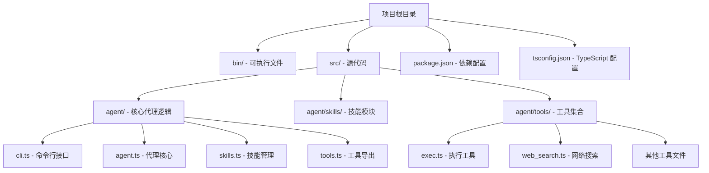
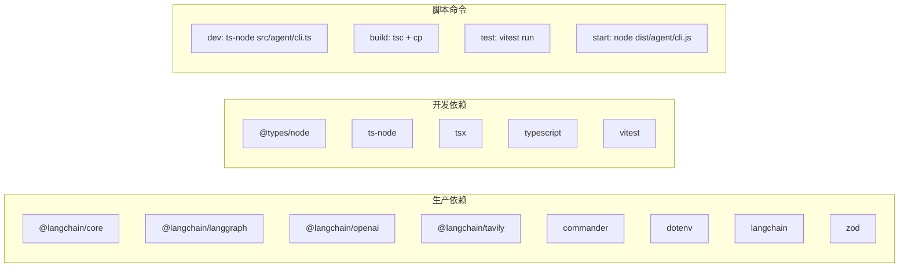
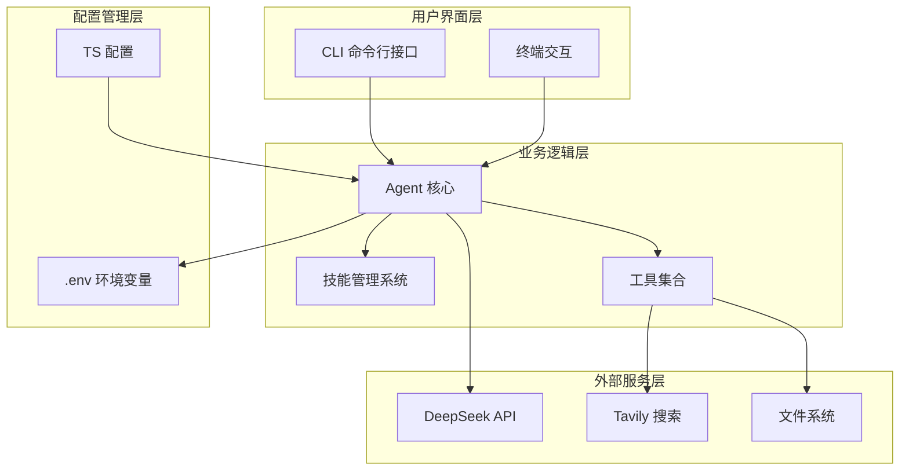
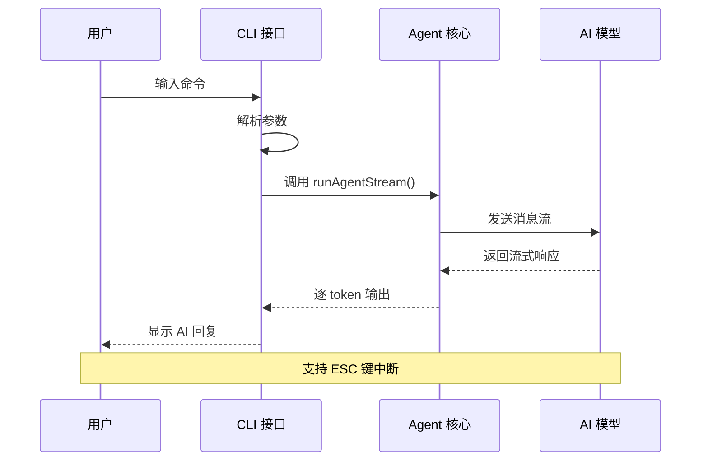
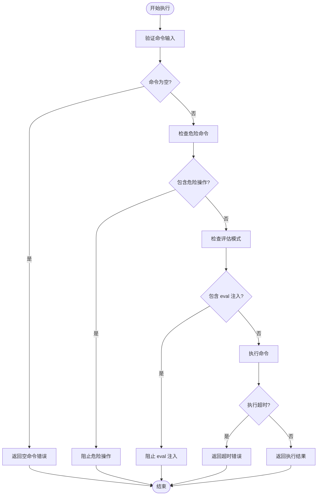
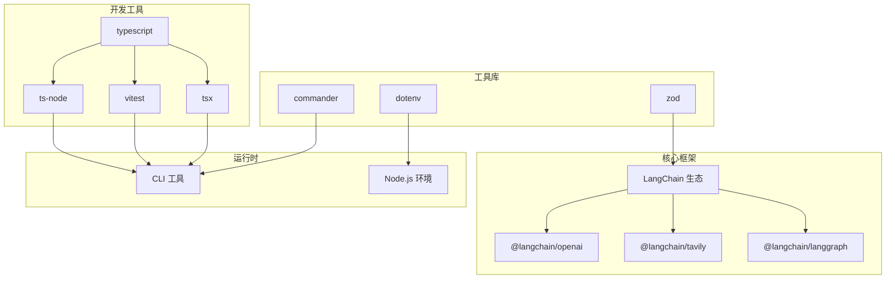

# 开发环境搭建

<cite>
**本文档引用的文件**
- [package.json](file://package.json)
- [tsconfig.json](file://tsconfig.json)
- [bin/onionCode.js](file://bin/onionCode.js)
- [src/agent/cli.ts](file://src/agent/cli.ts)
- [src/agent/agent.ts](file://src/agent/agent.ts)
- [src/agent/tools.ts](file://src/agent/tools.ts)
- [src/agent/tools/exec.ts](file://src/agent/tools/exec.ts)
- [src/agent/tools/web_search.ts](file://src/agent/tools/web_search.ts)
- [.gitignore](file://.gitignore)
</cite>

## 目录
1. [简介](#简介)
2. [项目结构](#项目结构)
3. [核心组件](#核心组件)
4. [架构概览](#架构概览)
5. [详细组件分析](#详细组件分析)
6. [依赖关系分析](#依赖关系分析)
7. [性能考虑](#性能考虑)
8. [故障排除指南](#故障排除指南)
9. [结论](#结论)

## 简介

OnionCode 是一个基于 CLI 的 AI 代理系统，支持工具调用、技能学习和内存管理。该项目使用 TypeScript 构建，集成了 LangChain 生态系统，提供了丰富的开发环境配置选项。

## 项目结构

该项目采用模块化的文件组织结构，主要包含以下核心目录：



**图表来源**
- [package.json:1-38](file://package.json#L1-L38)
- [tsconfig.json:1-20](file://tsconfig.json#L1-L20)

**章节来源**
- [package.json:1-38](file://package.json#L1-L38)
- [tsconfig.json:1-20](file://tsconfig.json#L1-L20)

## 核心组件

### 版本要求与兼容性

根据项目配置，当前支持的版本要求如下：

- **Node.js**: >= 18.x（从 pnpm-lock.yaml 中的引擎要求推断）
- **TypeScript**: ^6.0.3
- **包管理器**: pnpm（推荐）

### 依赖管理策略

项目采用分层依赖管理：



**图表来源**
- [package.json:20-36](file://package.json#L20-L36)

**章节来源**
- [package.json:20-36](file://package.json#L20-L36)

## 架构概览

系统采用模块化架构设计，核心组件之间的交互关系如下：



**图表来源**
- [src/agent/cli.ts:1-126](file://src/agent/cli.ts#L1-L126)
- [src/agent/agent.ts:1-98](file://src/agent/agent.ts#L1-L98)
- [src/agent/tools.ts:1-10](file://src/agent/tools.ts#L1-L10)

## 详细组件分析

### TypeScript 配置详解

tsconfig.json 文件定义了完整的 TypeScript 编译配置：

| 配置项 | 值 | 作用 |
|--------|-----|------|
| target | ES2022 | 目标 JavaScript 版本 |
| module | commonjs | 模块系统 |
| moduleResolution | node | 模块解析策略 |
| strict | true | 启用严格类型检查 |
| esModuleInterop | true | ES 模块互操作性 |
| skipLibCheck | true | 跳过库文件类型检查 |
| declaration | true | 生成类型声明文件 |
| resolveJsonModule | true | 支持 JSON 模块导入 |

**章节来源**
- [tsconfig.json:1-20](file://tsconfig.json#L1-L20)

### CLI 命令行接口

CLI 接口提供了两种主要交互模式：



**图表来源**
- [src/agent/cli.ts:40-125](file://src/agent/cli.ts#L40-L125)
- [src/agent/agent.ts:61-97](file://src/agent/agent.ts#L61-L97)

**章节来源**
- [src/agent/cli.ts:1-126](file://src/agent/cli.ts#L1-L126)

### 安全执行工具

exec 工具实现了多层安全防护机制：



**图表来源**
- [src/agent/tools/exec.ts:94-143](file://src/agent/tools/exec.ts#L94-L143)

**章节来源**
- [src/agent/tools/exec.ts:1-143](file://src/agent/tools/exec.ts#L1-L143)

### 网络搜索工具

Web 搜索工具提供了实时搜索功能：

**章节来源**
- [src/agent/tools/web_search.ts:1-41](file://src/agent/tools/web_search.ts#L1-L41)

## 依赖关系分析

项目的核心依赖关系如下：



**图表来源**
- [package.json:20-36](file://package.json#L20-L36)

**章节来源**
- [package.json:20-36](file://package.json#L20-L36)

## 性能考虑

### 编译优化

- 使用 `ignoreDeprecations: "6.0"` 减少废弃警告
- 启用 `declaration: true` 生成类型声明文件
- 配置 `resolveJsonModule: true` 支持 JSON 模块

### 运行时优化

- 实现流式响应处理，提升用户体验
- 添加 30 秒执行超时保护
- 使用内存检查点实现对话状态持久化

## 故障排除指南

### 环境变量配置

**必需的环境变量：**

| 变量名 | 描述 | 示例值 |
|--------|------|--------|
| OPENAI_API_KEY | AI 模型访问密钥 | sk-xxxxxxxxxxxxxxxxxxxxxxxxxxxxxxxx |
| OPENAI_MODEL | 模型名称 | deepseek-v4-flash |
| TAVILY_API_KEY | Tavily 搜索 API 密钥 | tavily-xxxxxxxx-xxxx-xxxx-xxxx-xxxxxxxxxxxx |

**章节来源**
- [src/agent/agent.ts:26-33](file://src/agent/agent.ts#L26-L33)
- [src/agent/tools/web_search.ts:20-23](file://src/agent/tools/web_search.ts#L20-L23)

### 常见问题解决

#### 1. API 密钥相关错误

**症状：** 请求被拒绝或返回认证错误
**解决方案：**
- 检查 `.env` 文件中的 API 密钥配置
- 验证网络连接和代理设置
- 确认账户余额充足

#### 2. 执行权限问题

**症状：** 命令执行被阻止
**解决方案：**
- 查看危险命令列表，避免使用受限制的命令
- 检查命令是否包含 eval 注入模式
- 确认文件系统权限

#### 3. 类型检查错误

**症状：** 编译时报类型错误
**解决方案：**
- 更新到兼容的 TypeScript 版本
- 检查依赖包的类型定义
- 清理 node_modules 并重新安装

**章节来源**
- [src/agent/cli.ts:11-38](file://src/agent/cli.ts#L11-L38)
- [src/agent/tools/exec.ts:66-92](file://src/agent/tools/exec.ts#L66-L92)

### 开发环境配置

#### VS Code 推荐扩展

| 扩展名称 | 功能描述 |
|----------|----------|
| ESLint | JavaScript/TypeScript 代码检查 |
| Prettier | 代码格式化 |
| TypeScript Importer | 自动导入 TypeScript 模块 |
| Auto Rename Tag | HTML/XML 标签自动重命名 |
| Bracket Pair Colorizer | 括号配对高亮显示 |

#### VS Code 设置建议

```json
{
    "typescript.preferences.importModuleSpecifier": "relative",
    "typescript.preferences.importModuleSpecifierEnding": "js",
    "editor.formatOnSave": true,
    "editor.codeActionsOnSave": {
        "source.fixAll.eslint": true
    },
    "files.exclude": {
        "node_modules": true,
        "dist": true
    }
}
```

**章节来源**
- [tsconfig.json:15](file://tsconfig.json#L15)
- [.gitignore:1-3](file://.gitignore#L1-L3)

## 结论

OnionCode 提供了一个完整且功能丰富的开发环境配置方案。通过合理的依赖管理和严格的类型约束，确保了代码质量和开发效率。建议开发者遵循本文档的配置指南，确保开发环境的一致性和稳定性。