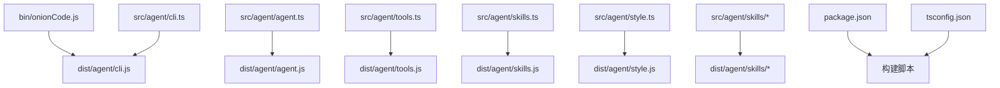
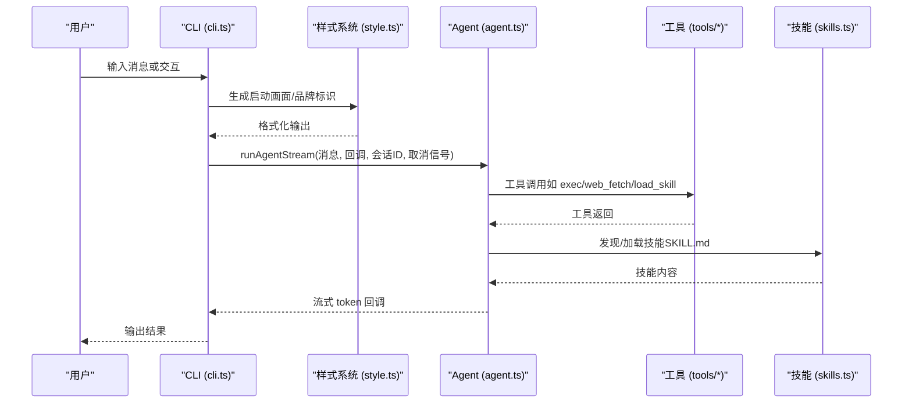
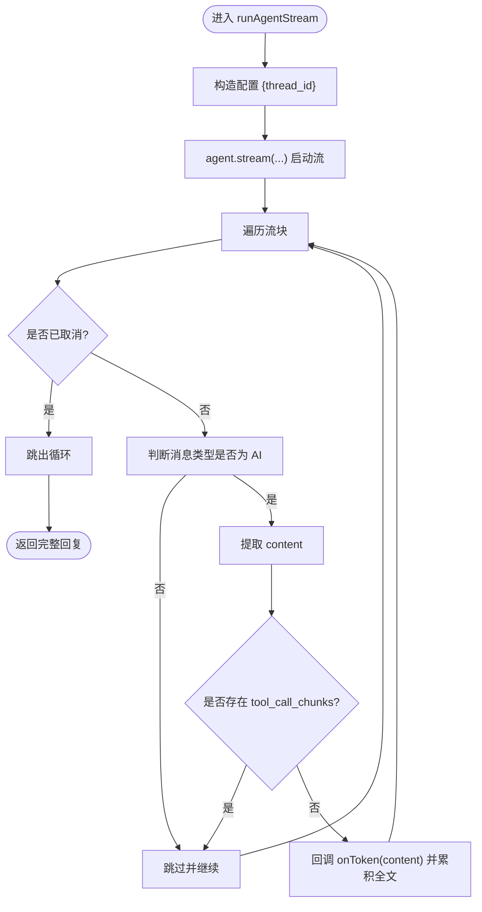
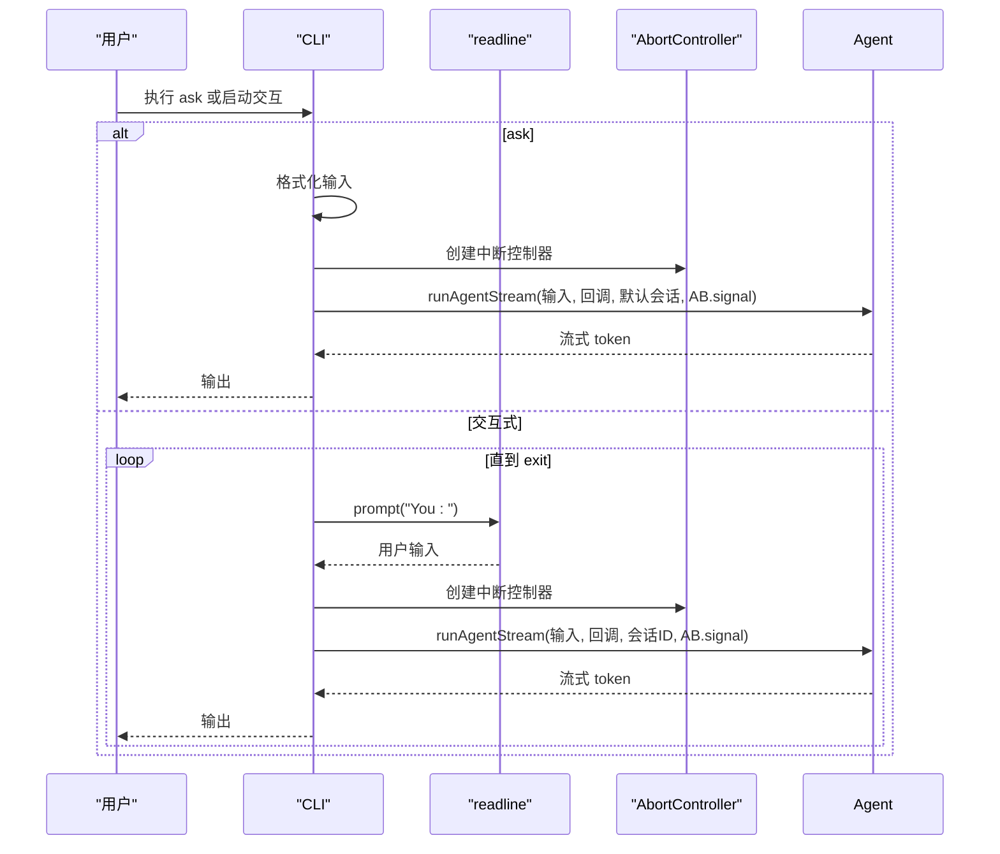
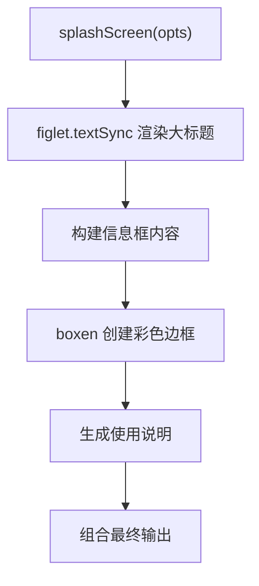
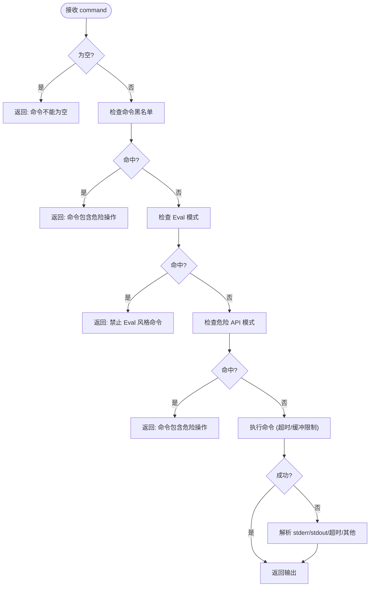
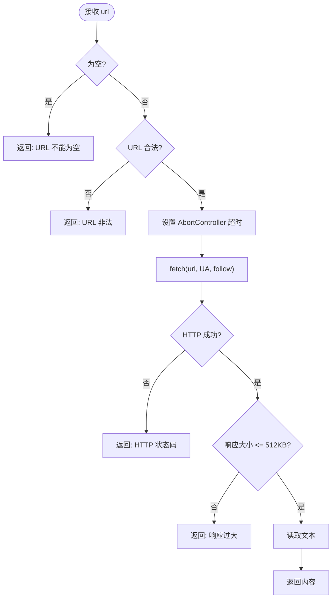
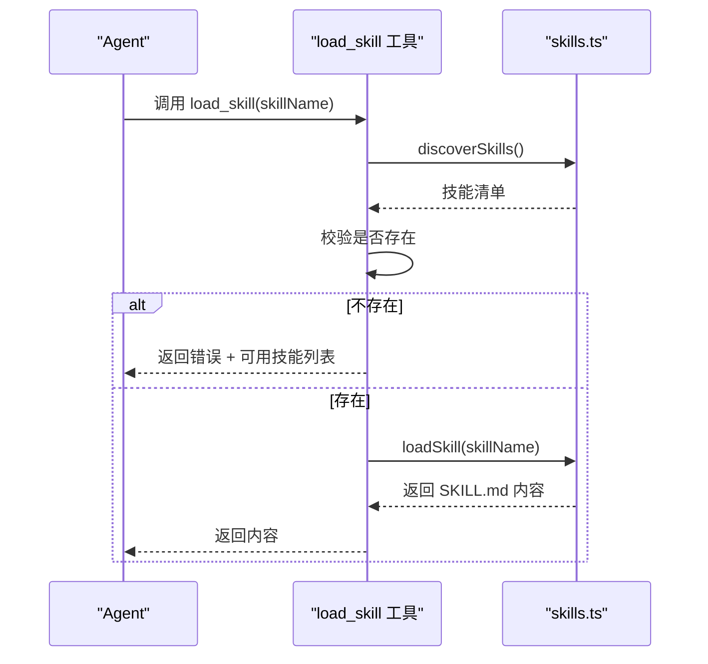
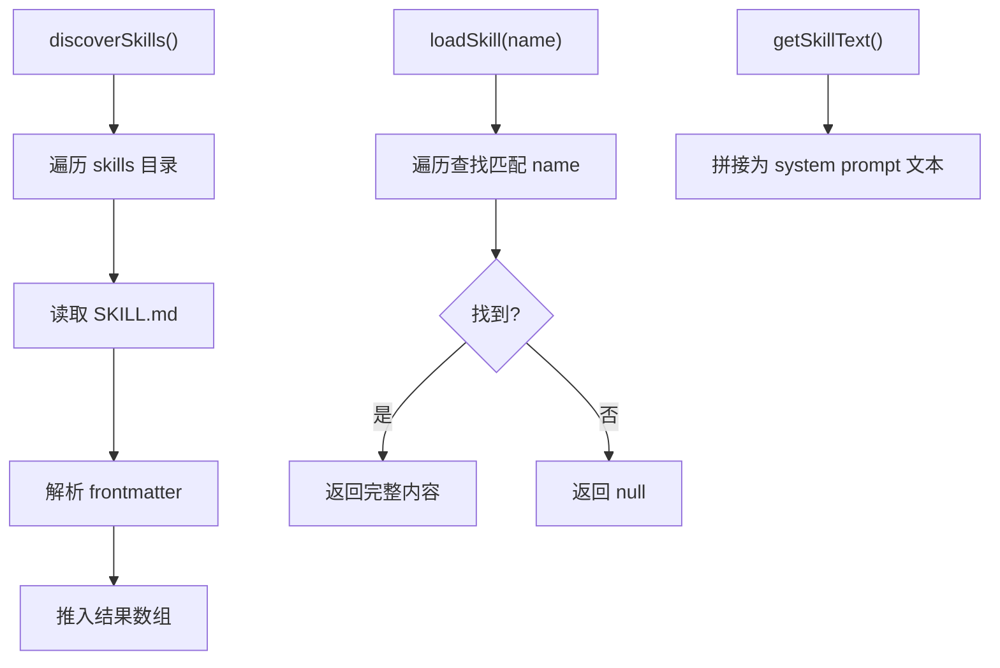
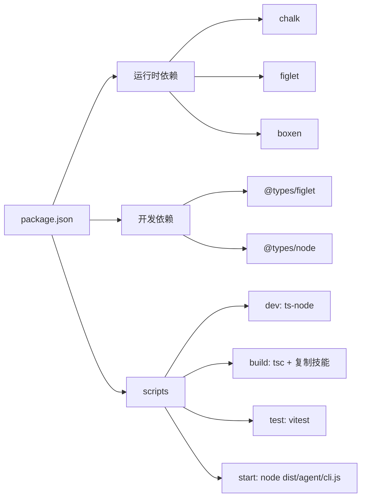

# 开发者指南

<cite>
**本文引用的文件**
- [package.json](file://package.json)
- [tsconfig.json](file://tsconfig.json)
- [src/agent/style.ts](file://src/agent/style.ts)
- [src/agent/cli.ts](file://src/agent/cli.ts)
- [src/agent/agent.ts](file://src/agent/agent.ts)
- [src/agent/tools.ts](file://src/agent/tools.ts)
- [src/agent/skills.ts](file://src/agent/skills.ts)
- [src/agent/tools/exec.ts](file://src/agent/tools/exec.ts)
- [src/agent/tools/web_fetch.ts](file://src/agent/tools/web_fetch.ts)
- [src/agent/tools/load_skill.ts](file://src/agent/tools/load_skill.ts)
- [src/agent/tools/exec.test.ts](file://src/agent/tools/exec.test.ts)
- [src/agent/skills/travel-guide/SKILL.md](file://src/agent/skills/travel-guide/SKILL.md)
- [src/agent/skills/planner/SKILL.md](file://src/agent/skills/planner/SKILL.md)
- [.gitignore](file://.gitignore)
</cite>

## 目录
1. [简介](#简介)
2. [项目结构](#项目结构)
3. [核心组件](#核心组件)
4. [架构总览](#架构总览)
5. [详细组件分析](#详细组件分析)
6. [依赖分析](#依赖分析)
7. [性能考虑](#性能考虑)
8. [故障排除指南](#故障排除指南)
9. [结论](#结论)
10. [附录](#附录)

## 简介
本指南面向希望参与开发与扩展的工程师，系统讲解项目结构、开发环境搭建、代码规范与测试策略、构建与部署流程、调试与性能分析方法，以及扩展开发（新增工具、技能与功能模块）的最佳实践。文档中的技术细节均来自仓库源码与配置文件。

## 项目结构
项目采用"功能模块化 + 工具与技能分离"的组织方式：
- CLI 入口位于 bin/onionCode.js，指向构建产物 dist/agent/cli.js
- 核心逻辑集中在 src/agent 下：
  - agent.ts：LangGraph Agent 创建与流式运行封装
  - cli.ts：命令行交互与错误格式化
  - tools.ts：工具聚合导出
  - skills.ts：技能发现与加载
  - tools 目录：具体工具实现（exec、web_fetch、load_skill 等）
  - skills 目录：技能定义（Markdown + frontmatter）
  - style.ts：品牌标识、工具日志、状态消息与启动画面功能
- 构建与测试由 package.json 的脚本驱动，TypeScript 编译配置见 tsconfig.json
- .gitignore 控制忽略 node_modules、dist 与 .env

图示来源
- [src/agent/style.ts:1-95](file://src/agent/style.ts#L1-L95)
- [package.json:11-16](file://package.json#L11-L16)
- [tsconfig.json:1-20](file://tsconfig.json#L1-L20)

章节来源
- [package.json:1-38](file://package.json#L1-L38)
- [tsconfig.json:1-20](file://tsconfig.json#L1-L20)
- [.gitignore:1-4](file://.gitignore#L1-L4)

## 核心组件
- Agent 与模型
  - 使用 LangGraph 的 createAgent 创建具备工具调用能力的智能体，内置内存持久化（checkpointer），支持流式响应
  - 默认模型为 DeepSeek API（可通过环境变量切换），启用流式输出
- 工具集
  - 文件与进程：exec、read_file、write_file
  - 代码执行：run_js、run_py
  - 网络：web_search、web_fetch
  - 技能加载：load_skill
  - 工具统一聚合导出，便于 Agent 注入
- 技能系统
  - 通过扫描 skills 目录下的 SKILL.md（YAML frontmatter）发现可用技能，并拼接为 system prompt 文本供 Agent 使用
  - 支持按名称精确加载完整技能内容
- CLI
  - 支持 ask 单轮问答与交互式聊天；ESC 中断；对常见错误进行友好提示
- 启动画面系统
  - 使用 figlet 进行大字体标题渲染，boxen 创建彩色边框信息框
  - 支持版本、描述、作者、文档链接等项目信息展示
  - 提供使用说明与快捷键提示

章节来源
- [src/agent/agent.ts:1-98](file://src/agent/agent.ts#L1-L98)
- [src/agent/tools.ts:1-10](file://src/agent/tools.ts#L1-L10)
- [src/agent/skills.ts:1-139](file://src/agent/skills.ts#L1-L139)
- [src/agent/cli.ts:1-126](file://src/agent/cli.ts#L1-L126)
- [src/agent/style.ts:45-87](file://src/agent/style.ts#L45-L87)

## 架构总览
整体运行链路由 CLI 启动，经 Agent 流式调用工具与技能，最终输出结果。构建流程将 TypeScript 源码编译至 dist，并复制技能资源。

图示来源
- [src/agent/cli.ts:40-125](file://src/agent/cli.ts#L40-L125)
- [src/agent/agent.ts:61-97](file://src/agent/agent.ts#L61-L97)
- [src/agent/tools.ts:1-10](file://src/agent/tools.ts#L1-L10)
- [src/agent/skills.ts:53-138](file://src/agent/skills.ts#L53-L138)
- [src/agent/style.ts:54-87](file://src/agent/style.ts#L54-L87)

## 详细组件分析

### Agent 与流式运行
- Agent 创建：注入模型、工具、系统提示（含技能列表）、内存检查点
- 流式输出：遍历流块，仅对 AI 消息的 content 进行回调，支持 AbortSignal 中断
- 会话管理：通过 thread_id 维持上下文

图示来源
- [src/agent/agent.ts:61-97](file://src/agent/agent.ts#L61-L97)

章节来源
- [src/agent/agent.ts:1-98](file://src/agent/agent.ts#L1-L98)

### CLI 与交互式聊天
- ask 命令：单轮问答，直接输出流式 token
- 交互式聊天：readline 循环，ESC 中断，异常友好提示
- 错误映射：针对内容安全、认证失败、配额/限流、超时等场景输出易懂提示

图示来源
- [src/agent/cli.ts:40-125](file://src/agent/cli.ts#L40-L125)

章节来源
- [src/agent/cli.ts:1-126](file://src/agent/cli.ts#L1-L126)

### 样式系统与启动画面
- 品牌标识：提供洋葱标志和彩色提示符
- 工具日志：生成带颜色的工具调用日志，支持普通调用和代码行数统计
- 状态消息：包含停止、再见、错误等状态提示
- 启动画面：使用 figlet 进行大字体标题渲染，boxen 创建彩色边框信息框
- 使用说明：提供 ESC 取消请求和 exit 退出程序的快捷键提示

图示来源
- [src/agent/style.ts:54-87](file://src/agent/style.ts#L54-L87)

章节来源
- [src/agent/style.ts:1-95](file://src/agent/style.ts#L1-L95)

### 工具：exec（安全命令执行）
- 多层安全防护
  - 命令黑名单：删除、移动、复制、权限变更、提权、进程终止、链接、危险网络下载、压缩等
  - Eval 注入检测：识别 node -e、python -c 等
  - 危险 API 模式：通过共享模块检测 fs.rmSync、shutil.rmtree 等
- 超时与缓冲限制：30 秒超时、最大输出缓冲
- 错误处理：区分 stdout/stderr、超时、未知错误并返回统一格式

图示来源
- [src/agent/tools/exec.ts:94-143](file://src/agent/tools/exec.ts#L94-L143)

章节来源
- [src/agent/tools/exec.ts:1-143](file://src/agent/tools/exec.ts#L1-L143)
- [src/agent/tools/exec.test.ts:1-150](file://src/agent/tools/exec.test.ts#L1-L150)

### 工具：web_fetch（受控网页抓取）
- URL 校验：仅允许 http/https
- 超时控制：默认 15 秒
- 响应大小限制：最大 512KB
- 错误分类：超时、DNS、连接被拒、连接重置等

图示来源
- [src/agent/tools/web_fetch.ts:20-83](file://src/agent/tools/web_fetch.ts#L20-L83)

章节来源
- [src/agent/tools/web_fetch.ts:1-83](file://src/agent/tools/web_fetch.ts#L1-L83)

### 工具：load_skill（技能加载）
- 发现：列出所有技能（name/description/dir）
- 校验：若不存在则返回可用技能列表
- 加载：按名称读取完整 SKILL.md 内容

图示来源
- [src/agent/tools/load_skill.ts:5-33](file://src/agent/tools/load_skill.ts#L5-L33)
- [src/agent/skills.ts:53-138](file://src/agent/skills.ts#L53-L138)

章节来源
- [src/agent/tools/load_skill.ts:1-34](file://src/agent/tools/load_skill.ts#L1-L34)
- [src/agent/skills.ts:1-139](file://src/agent/skills.ts#L1-L139)

### 技能系统（skills.ts）
- 发现：扫描 skills 目录，解析每个 SKILL.md 的 YAML frontmatter，生成 name/description/dir
- 加载：按 name 返回完整内容
- 注入：getSkillText 将技能列表拼接为 system prompt 片段

图示来源
- [src/agent/skills.ts:53-138](file://src/agent/skills.ts#L53-L138)

章节来源
- [src/agent/skills.ts:1-139](file://src/agent/skills.ts#L1-L139)
- [src/agent/skills/travel-guide/SKILL.md:1-105](file://src/agent/skills/travel-guide/SKILL.md#L1-L105)
- [src/agent/skills/planner/SKILL.md:1-91](file://src/agent/skills/planner/SKILL.md#L1-L91)

## 依赖分析
- 运行时依赖
  - LangChain 生态：@langchain/core、@langchain/langgraph、@langchain/openai、@langchain/tavily、langchain
  - 命令行：commander
  - 环境变量：dotenv
  - 数据校验：zod
  - 样式与启动画面：chalk、figlet、boxen
- 开发依赖
  - TypeScript、ts-node、tsx、vitest
  - 类型定义：@types/figlet、@types/node
- 构建与脚本
  - dev：ts-node 直接运行 CLI
  - build：tsc 编译 + 复制技能资源
  - test：vitest 运行测试
  - start：运行 dist/agent/cli.js

图示来源
- [package.json:11-36](file://package.json#L11-L36)

章节来源
- [package.json:1-38](file://package.json#L1-L38)
- [tsconfig.json:1-20](file://tsconfig.json#L1-L20)

## 性能考虑
- 流式输出：Agent 以流式方式推送 token，降低首字延迟，提升交互体验
- 资源限制：exec 工具设置超时与输出缓冲上限；web_fetch 设置响应大小与超时
- 内存检查点：MemorySaver 保存中间状态，避免重复计算
- 构建优化：TypeScript 严格模式与声明文件生成，便于 IDE 与下游消费
- 启动画面渲染：figlet 渲染可能产生额外开销，但仅在启动时使用

## 故障排除指南
- 内容安全拦截
  - 现象：提示内容风险
  - 处理：更换措辞或简化查询
- 认证失败
  - 现象：401 或 API Key 错误
  - 处理：检查 .env 中 OPENAI_API_KEY
- 配额/限流
  - 现象：429 或 insufficient quota
  - 处理：检查账户余额与配额
- 超时
  - 现象：ETIMEDOUT 或 fetch 超时
  - 处理：检查网络连通性与目标服务稳定性
- 工具调用错误
  - exec：命令为空、危险命令、Eval 注入、危险 API 模式、超时
  - web_fetch：非法 URL、响应过大、DNS/连接错误
- 启动画面问题
  - 现象：figlet 渲染失败或显示异常
  - 处理：检查 figlet 字体支持和终端兼容性

章节来源
- [src/agent/cli.ts:10-38](file://src/agent/cli.ts#L10-L38)
- [src/agent/tools/exec.ts:94-143](file://src/agent/tools/exec.ts#L94-L143)
- [src/agent/tools/web_fetch.ts:20-83](file://src/agent/tools/web_fetch.ts#L20-L83)
- [src/agent/style.ts:54-87](file://src/agent/style.ts#L54-L87)

## 结论
本项目以 LangGraph 为核心，结合工具与技能系统，提供了可扩展的 CLI Agent 能力。通过严格的构建与测试流程、完善的错误提示与安全防护，既保证了开发效率，也确保了运行稳定与安全。新增的启动画面功能增强了用户体验，使用 figlet 和 boxen 库实现了美观的品牌展示效果。建议在扩展新工具与技能时遵循现有模式，保持一致的安全策略与测试覆盖率。

## 附录

### 开发环境搭建
- 安装依赖
  - 使用包管理器安装依赖（例如 pnpm）
  - 新增依赖：figlet、boxen、@types/figlet
- 环境变量
  - 在项目根目录创建 .env，配置 OPENAI_API_KEY 与模型参数
- 启动与调试
  - 开发：npm run dev（或 pnpm dev）
  - 运行：npm start（或 pnpm start）
  - 构建：npm run build（或 pnpm build）

章节来源
- [package.json:11-16](file://package.json#L11-L16)
- [src/agent/agent.ts:19-20](file://src/agent/agent.ts#L19-L20)

### 代码规范与测试策略
- 代码风格
  - TypeScript 严格模式，统一使用 commonjs 模块与 Node 解析
  - 声明文件生成，便于类型提示
- 工具与技能
  - 工具：统一使用 Zod schema 校验输入，返回标准化错误字符串
  - 技能：使用 YAML frontmatter（name/description），通过 discover/load 机制注入
- 样式系统
  - 使用 chalk 进行颜色控制，figlet 进行大字体渲染，boxen 创建边框效果
  - 启动画面支持自定义项目信息和使用说明
- 测试
  - 使用 Vitest 对工具进行单元测试，覆盖正常路径、危险命令、Eval 注入与边界条件

章节来源
- [tsconfig.json:1-20](file://tsconfig.json#L1-L20)
- [src/agent/tools/exec.test.ts:1-150](file://src/agent/tools/exec.test.ts#L1-L150)
- [src/agent/skills.ts:14-28](file://src/agent/skills.ts#L14-L28)
- [src/agent/style.ts:1-95](file://src/agent/style.ts#L1-L95)

### 构建系统与部署流程
- 构建
  - tsc 编译 src 至 dist
  - 复制 src/agent/skills/* 到 dist/agent/skills/*
- 入口
  - bin/onionCode.js 直接 require dist/agent/cli.js
- 发布
  - 通过 npm 包发布（package.json bin 指向入口）

章节来源
- [package.json:11-16](file://package.json#L11-L16)
- [bin/onionCode.js:1-3](file://bin/onionCode.js#L1-L3)

### 调试技巧与性能分析
- 调试
  - 使用 ts-node 在开发时直接运行 CLI
  - 在工具内部打印日志（如工具调用记录）辅助定位
  - 启动画面调试：检查 figlet 字体渲染和 boxen 边框效果
- 性能
  - 关注流式输出的首字延迟与吞吐
  - 控制工具超时与输出大小，避免阻塞
  - 合理使用内存检查点，减少重复计算
  - 启动画面仅在应用启动时渲染，避免影响运行时性能

### 扩展开发指南

#### 新增工具
- 设计
  - 明确定义输入 schema（Zod），统一错误返回格式
  - 评估安全风险，必要时引入黑名单/正则检测
- 实现
  - 在 src/agent/tools 下新增文件，导出 tool
  - 在 src/agent/tools.ts 中聚合导出
  - 在 src/agent/agent.ts 的工具数组中注册
- 测试
  - 编写 Vitest 测试，覆盖正常、异常与边界场景

章节来源
- [src/agent/tools.ts:1-10](file://src/agent/tools.ts#L1-L10)
- [src/agent/agent.ts:36-51](file://src/agent/agent.ts#L36-L51)
- [src/agent/tools/exec.test.ts:1-150](file://src/agent/tools/exec.test.ts#L1-L150)

#### 新增技能
- 设计
  - 在 src/agent/skills/ 下新建目录，编写 SKILL.md（frontmatter + 内容）
- 注册
  - 无需额外注册，discoverSkills 会自动扫描
- 使用
  - Agent 通过 load_skill 工具加载技能内容，注入 system prompt

章节来源
- [src/agent/skills.ts:53-138](file://src/agent/skills.ts#L53-L138)
- [src/agent/tools/load_skill.ts:5-33](file://src/agent/tools/load_skill.ts#L5-L33)

#### 新增功能模块
- 建议
  - 保持单一职责，尽量通过工具与技能扩展
  - 优先复用现有工具与 Agent 流程
  - 为新增模块编写测试与文档
- 启动画面扩展
  - 可以在 style.ts 中扩展新的启动画面样式
  - 支持更多 figlet 字体和 boxen 边框样式
  - 添加自定义项目信息字段

### 贡献指南（建议）
- 提交前
  - 运行测试：npm run test
  - 本地构建：npm run build
- 提交流程
  - fork 仓库 -> 新建分支 -> 提交 -> 发起 PR
- 代码审查
  - 关注安全性（工具安全策略）
  - 关注可维护性（模块职责、测试覆盖率）
  - 关注用户体验（错误提示、文档与示例）
  - 关注样式系统（启动画面渲染效果）