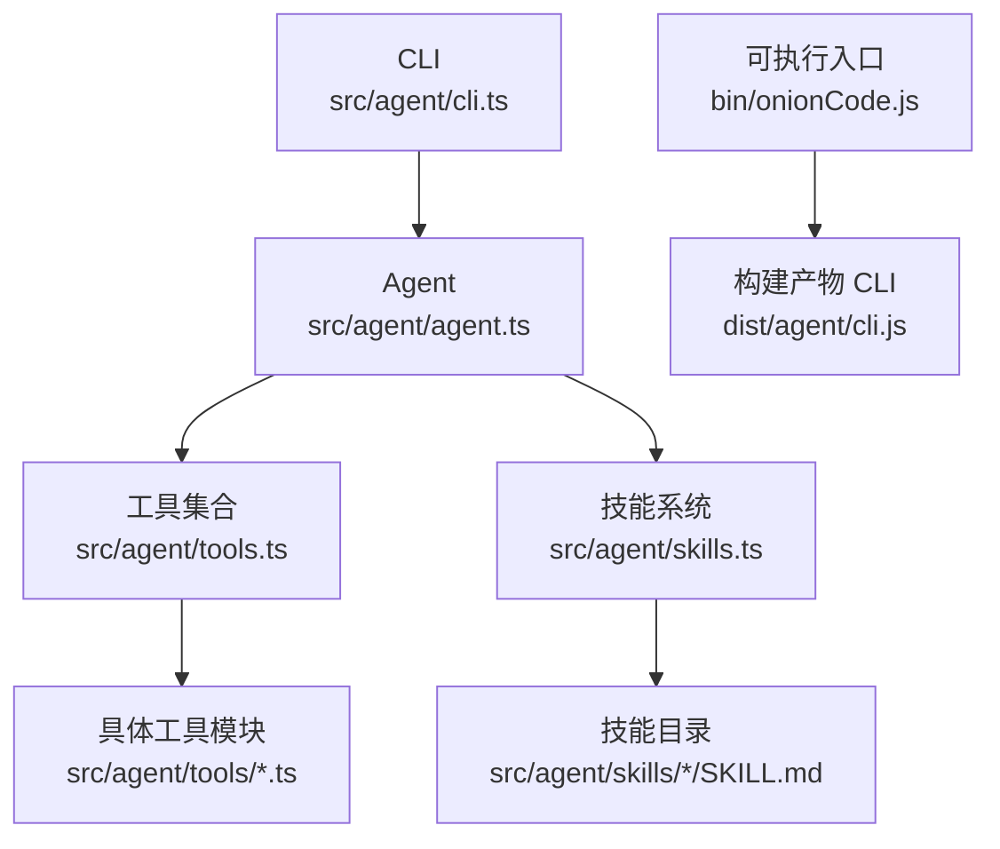
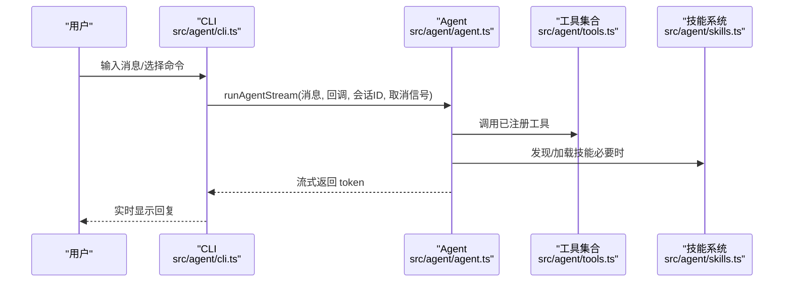
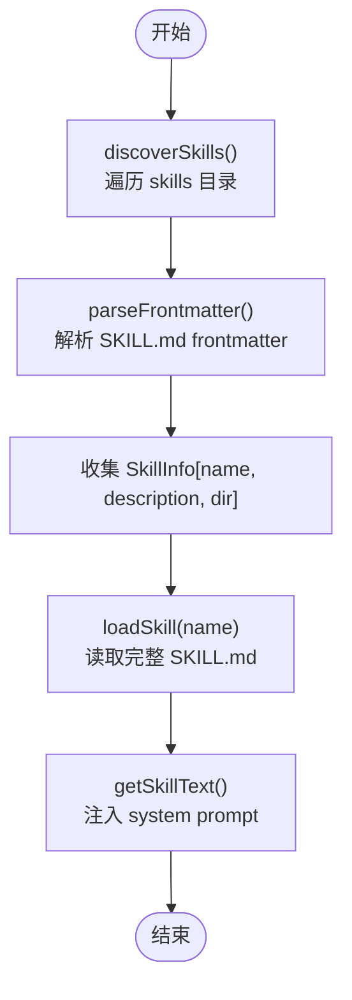
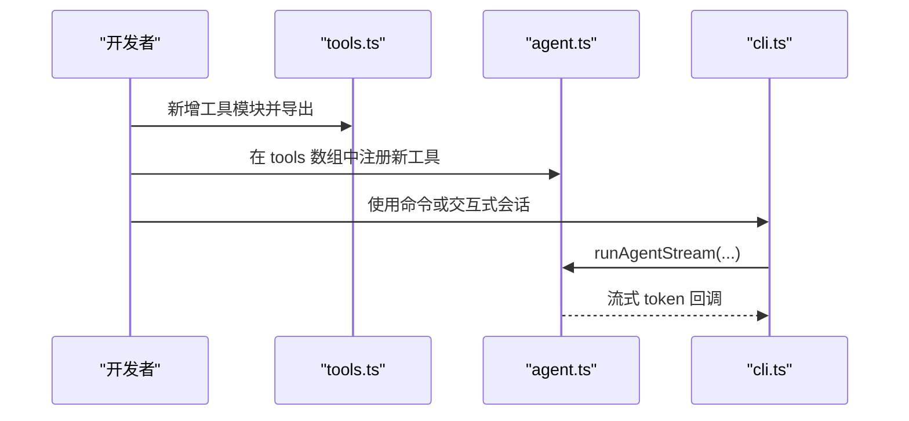
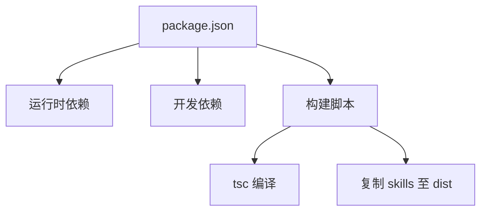

# 扩展开发指南

<cite>
**本文档引用的文件**
- [src/agent/tools.ts](file://src/agent/tools.ts)
- [src/agent/skills.ts](file://src/agent/skills.ts)
- [src/agent/agent.ts](file://src/agent/agent.ts)
- [src/agent/cli.ts](file://src/agent/cli.ts)
- [src/agent/tools/search.ts](file://src/agent/tools/search.ts)
- [src/agent/tools/load_skill.ts](file://src/agent/tools/load_skill.ts)
- [src/agent/tools/security.ts](file://src/agent/tools/security.ts)
- [src/agent/skills/travel-guide/SKILL.md](file://src/agent/skills/travel-guide/SKILL.md)
- [src/agent/skills/skill-creator/SKILL.md](file://src/agent/skills/skill-creator/SKILL.md)
- [bin/onionCode.js](file://bin/onionCode.js)
- [package.json](file://package.json)
- [tsconfig.json](file://tsconfig.json)
- [src/agent/tools/search.test.ts](file://src/agent/tools/search.test.ts)
- [src/agent/tools/load_skill.test.ts](file://src/agent/tools/load_skill.test.ts)
</cite>

## 目录
1. [简介](#简介)
2. [项目结构](#项目结构)
3. [核心组件](#核心组件)
4. [架构概览](#架构概览)
5. [详细组件分析](#详细组件分析)
6. [依赖分析](#依赖分析)
7. [性能考虑](#性能考虑)
8. [故障排除指南](#故障排除指南)
9. [结论](#结论)
10. [附录](#附录)

## 简介
本指南面向希望扩展 OnionCode 的开发者，系统讲解如何：
- 开发新的工具模块：工具接口规范、参数验证与错误处理
- 扩展技能系统：技能发现、加载与执行流程
- 自定义技能开发模板与最佳实践
- 工具与技能的注册机制与生命周期管理
- 性能优化与安全注意事项
- 新功能调试方法与测试策略
- 向后兼容性维护与版本升级指南

## 项目结构
项目采用“按功能分层”的组织方式，核心位于 src/agent 目录：
- 工具层：src/agent/tools 下的各类工具模块，统一导出入口在 tools.ts
- 技能层：src/agent/skills 下的技能目录，包含技能元数据解析与加载逻辑
- 代理层：agent.ts 负责创建代理、注册工具、拼接系统提示词
- CLI 层：cli.ts 提供命令行交互与错误格式化
- 构建与入口：package.json 定义构建脚本；bin/onionCode.js 作为可执行入口

图表来源
- [src/agent/cli.ts:1-126](file://src/agent/cli.ts#L1-L126)
- [src/agent/agent.ts:1-98](file://src/agent/agent.ts#L1-L98)
- [src/agent/tools.ts:1-10](file://src/agent/tools.ts#L1-L10)
- [src/agent/skills.ts:1-139](file://src/agent/skills.ts#L1-L139)
- [bin/onionCode.js:1-3](file://bin/onionCode.js#L1-L3)

章节来源
- [src/agent/tools.ts:1-10](file://src/agent/tools.ts#L1-L10)
- [src/agent/skills.ts:1-139](file://src/agent/skills.ts#L1-L139)
- [src/agent/agent.ts:1-98](file://src/agent/agent.ts#L1-L98)
- [src/agent/cli.ts:1-126](file://src/agent/cli.ts#L1-L126)
- [bin/onionCode.js:1-3](file://bin/onionCode.js#L1-L3)

## 核心组件
- 工具注册与导出：tools.ts 将各工具模块集中导出，便于 agent.ts 注册
- 技能发现与加载：skills.ts 提供 discoverSkills、loadSkill、getSkillText 等能力
- 代理创建与流式执行：agent.ts 创建 LangGraph Agent，注册工具并支持流式输出
- CLI 交互与错误格式化：cli.ts 提供 ask 与交互式聊天，格式化常见错误
- 安全扫描：security.ts 定义危险 API 模式检测规则
- 构建与入口：package.json 定义构建脚本与二进制入口；bin/onionCode.js 指向 dist 产物

章节来源
- [src/agent/tools.ts:1-10](file://src/agent/tools.ts#L1-L10)
- [src/agent/skills.ts:1-139](file://src/agent/skills.ts#L1-L139)
- [src/agent/agent.ts:1-98](file://src/agent/agent.ts#L1-L98)
- [src/agent/cli.ts:1-126](file://src/agent/cli.ts#L1-L126)
- [src/agent/tools/security.ts:1-27](file://src/agent/tools/security.ts#L1-L27)
- [package.json:1-38](file://package.json#L1-L38)
- [bin/onionCode.js:1-3](file://bin/onionCode.js#L1-L3)

## 架构概览
Agent 通过 LangGraph 与工具/技能协作，实现“工具调用 + 技能加载 + 流式响应”的闭环。

图表来源
- [src/agent/cli.ts:66-125](file://src/agent/cli.ts#L66-L125)
- [src/agent/agent.ts:61-97](file://src/agent/agent.ts#L61-L97)
- [src/agent/tools.ts:1-10](file://src/agent/tools.ts#L1-L10)
- [src/agent/skills.ts:53-138](file://src/agent/skills.ts#L53-L138)

## 详细组件分析

### 工具接口规范与参数验证
- 工具封装：使用 LangChain 工具包装器，声明 schema 进行参数校验
- 参数验证：Zod schema 定义必填字段与类型约束，未满足时自动抛错
- 错误处理：工具内部捕获异常并返回可读错误信息，CLI 层进一步格式化

示例参考路径
- [工具定义与参数校验:4-23](file://src/agent/tools/search.ts#L4-L23)
- [工具调用与错误格式化:10-38](file://src/agent/cli.ts#L10-L38)

章节来源
- [src/agent/tools/search.ts:1-24](file://src/agent/tools/search.ts#L1-L24)
- [src/agent/cli.ts:10-38](file://src/agent/cli.ts#L10-L38)

### 技能系统扩展机制
- 技能发现：遍历 skills 目录，读取每个子目录的 SKILL.md frontmatter，提取 name/description
- 技能加载：根据 name 查找并返回完整 SKILL.md 内容
- 系统提示注入：getSkillText 将可用技能列表注入 system prompt，辅助模型决策
- 加载工具：load_skill 工具先验证技能存在性，再加载内容返回

图表来源
- [src/agent/skills.ts:53-138](file://src/agent/skills.ts#L53-L138)

章节来源
- [src/agent/skills.ts:1-139](file://src/agent/skills.ts#L1-L139)
- [src/agent/skills/travel-guide/SKILL.md:1-105](file://src/agent/skills/travel-guide/SKILL.md#L1-L105)
- [src/agent/skills/skill-creator/SKILL.md:1-486](file://src/agent/skills/skill-creator/SKILL.md#L1-L486)

### 自定义技能开发模板与最佳实践
- 目录结构：每个技能以独立目录存放，根文件为 SKILL.md（包含 YAML frontmatter 与正文）
- Frontmatter 规范：至少包含 name 与 description；可选 compatibility 等
- 正文组织：工作流程、角色定位、注意事项、输出模板等
- 资源打包：可选 scripts/、references/、assets/ 等子目录
- 触发优化：通过描述优化脚本提升触发准确率

参考路径
- [技能模板与规范:1-105](file://src/agent/skills/travel-guide/SKILL.md#L1-L105)
- [技能创作与评测流程:45-486](file://src/agent/skills/skill-creator/SKILL.md#L45-L486)

章节来源
- [src/agent/skills/travel-guide/SKILL.md:1-105](file://src/agent/skills/travel-guide/SKILL.md#L1-L105)
- [src/agent/skills/skill-creator/SKILL.md:1-486](file://src/agent/skills/skill-creator/SKILL.md#L1-L486)

### 工具与技能的注册机制与生命周期
- 工具注册：tools.ts 导出各工具，agent.ts 在创建 Agent 时统一注册
- 生命周期：Agent 创建后长期驻留，工具与技能通过调用动态生效
- CLI 生命周期：启动 -> 交互循环 -> 流式输出 -> 退出

图表来源
- [src/agent/tools.ts:1-10](file://src/agent/tools.ts#L1-L10)
- [src/agent/agent.ts:36-51](file://src/agent/agent.ts#L36-L51)
- [src/agent/cli.ts:66-125](file://src/agent/cli.ts#L66-L125)

章节来源
- [src/agent/tools.ts:1-10](file://src/agent/tools.ts#L1-L10)
- [src/agent/agent.ts:1-98](file://src/agent/agent.ts#L1-L98)
- [src/agent/cli.ts:1-126](file://src/agent/cli.ts#L1-L126)

### 安全考虑与危险模式检测
- 危险模式检测：security.ts 定义多类危险 API 调用正则，覆盖 Node.js fs/child_process、Python shutil/os/subprocess 等
- 使用建议：在工具实现中对用户输入进行扫描，必要时拒绝或警告

参考路径
- [危险模式检测规则:4-26](file://src/agent/tools/security.ts#L4-L26)

章节来源
- [src/agent/tools/security.ts:1-27](file://src/agent/tools/security.ts#L1-L27)

### 调试新功能的方法与测试策略
- 单元测试：使用 Vitest 对工具行为进行断言
- 示例：search 工具与 load_skill 工具均提供测试用例
- 建议：新增工具时同步添加测试，覆盖正常/异常/边界场景

参考路径
- [search 工具测试:1-34](file://src/agent/tools/search.test.ts#L1-L34)
- [load_skill 工具测试:1-45](file://src/agent/tools/load_skill.test.ts#L1-L45)

章节来源
- [src/agent/tools/search.test.ts:1-34](file://src/agent/tools/search.test.ts#L1-L34)
- [src/agent/tools/load_skill.test.ts:1-45](file://src/agent/tools/load_skill.test.ts#L1-L45)

## 依赖分析
- 运行时依赖：LangChain 生态（core/langgraph/openai）、commander、dotenv、zod
- 开发依赖：TypeScript、ts-node、vitest 等
- 构建脚本：编译 TypeScript 并复制 skills 目录至 dist

图表来源
- [package.json:1-38](file://package.json#L1-L38)

章节来源
- [package.json:1-38](file://package.json#L1-L38)
- [tsconfig.json:1-20](file://tsconfig.json#L1-L20)

## 性能考虑
- 工具调用开销：尽量减少不必要的 IO 与外部请求，必要时缓存结果
- 技能加载策略：仅在需要时加载完整 SKILL.md，避免一次性加载过多内容
- 流式输出：保持流式传输，降低首 Token 延迟
- 并发控制：在 CLI 层监听 ESC 中断，及时释放资源

## 故障排除指南
- 常见错误分类与格式化：
  - 内容安全拦截：提示更换问法或简化查询
  - API Key 无效：检查 .env 中 OPENAI_API_KEY
  - 额度不足/429：检查账户余额
  - 网络超时：检查网络连接
- 建议排查步骤：
  - 检查环境变量与网络连通性
  - 确认工具参数 schema 与调用方式
  - 查看 CLI 输出的格式化错误信息

章节来源
- [src/agent/cli.ts:10-38](file://src/agent/cli.ts#L10-L38)

## 结论
通过本指南，开发者可以：
- 按照统一规范开发工具模块并完成参数验证与错误处理
- 基于 skills.ts 的发现/加载机制扩展技能生态
- 使用标准模板与最佳实践编写高质量技能
- 明确注册机制与生命周期，确保稳定运行
- 结合测试与安全扫描保障质量与安全
- 在性能与兼容性之间取得平衡，平滑演进版本

## 附录

### 工具开发模板（步骤指引）
- 在 src/agent/tools 下新增模块，使用工具包装器与 Zod schema
- 在 tools.ts 中导出并注册到 agent.ts 的 tools 数组
- 编写单元测试覆盖正常/异常/边界场景
- 如涉及文件/进程操作，使用危险模式检测并进行安全限制

参考路径
- [工具导出入口:1-10](file://src/agent/tools.ts#L1-L10)
- [工具注册位置:36-51](file://src/agent/agent.ts#L36-L51)
- [参数验证示例:16-22](file://src/agent/tools/search.ts#L16-L22)
- [危险模式检测:4-26](file://src/agent/tools/security.ts#L4-L26)

章节来源
- [src/agent/tools.ts:1-10](file://src/agent/tools.ts#L1-L10)
- [src/agent/agent.ts:36-51](file://src/agent/agent.ts#L36-L51)
- [src/agent/tools/search.ts:1-24](file://src/agent/tools/search.ts#L1-L24)
- [src/agent/tools/security.ts:1-27](file://src/agent/tools/security.ts#L1-L27)

### 技能开发模板（步骤指引）
- 在 src/agent/skills 下新建目录，编写 SKILL.md（frontmatter + 正文）
- 可选：scripts/、references/、assets/ 子目录
- 使用 load_skill 工具进行加载与验证
- 参考现有技能模板与评测流程

参考路径
- [旅行技能模板:1-105](file://src/agent/skills/travel-guide/SKILL.md#L1-L105)
- [技能创作流程:45-486](file://src/agent/skills/skill-creator/SKILL.md#L45-L486)
- [技能加载工具:5-33](file://src/agent/tools/load_skill.ts#L5-L33)

章节来源
- [src/agent/skills/travel-guide/SKILL.md:1-105](file://src/agent/skills/travel-guide/SKILL.md#L1-L105)
- [src/agent/skills/skill-creator/SKILL.md:1-486](file://src/agent/skills/skill-creator/SKILL.md#L1-L486)
- [src/agent/tools/load_skill.ts:1-34](file://src/agent/tools/load_skill.ts#L1-L34)

### 向后兼容性与版本升级指南
- 语义化版本：遵循 MAJOR.MINOR.PATCH，谨慎变更公共 API
- 构建与发布：使用 package.json 的构建脚本，确保 dist/agent/skills 复制正确
- CLI 入口：bin/onionCode.js 指向 dist 产物，保证可执行一致性
- 升级策略：优先保持工具/技能接口稳定，新增能力时提供兼容层或迁移指南

参考路径
- [构建脚本与二进制入口:11-16](file://package.json#L11-L16)
- [可执行入口映射:1-3](file://bin/onionCode.js#L1-L3)

章节来源
- [package.json:1-38](file://package.json#L1-L38)
- [bin/onionCode.js:1-3](file://bin/onionCode.js#L1-L3)