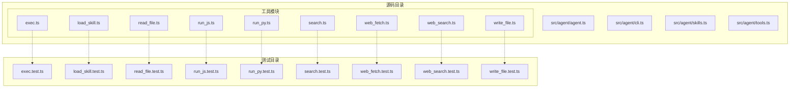
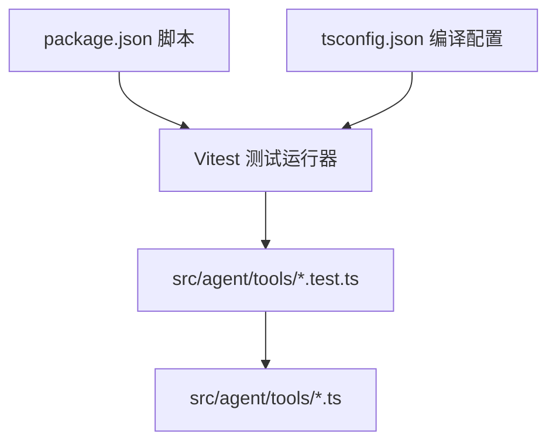
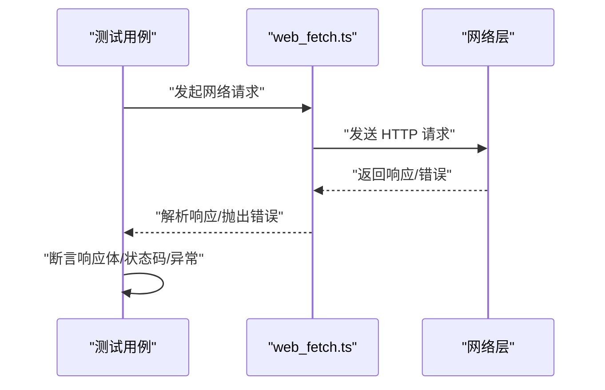
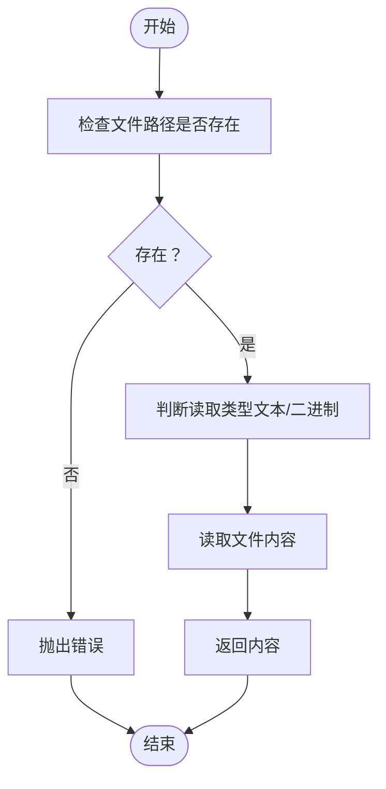
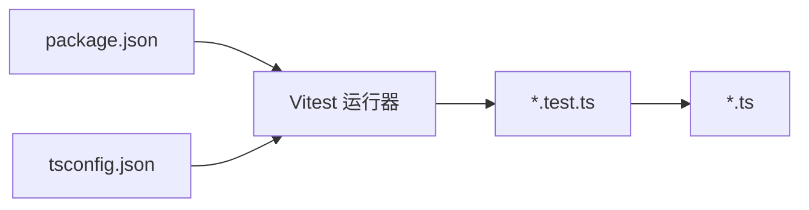

# 测试策略与实践

<cite>
**本文引用的文件**
- [package.json](file://package.json)
- [tsconfig.json](file://tsconfig.json)
- [src/agent/tools/exec.test.ts](file://src/agent/tools/exec.test.ts)
- [src/agent/tools/load_skill.test.ts](file://src/agent/tools/load_skill.test.ts)
- [src/agent/tools/read_file.test.ts](file://src/agent/tools/read_file.test.ts)
- [src/agent/tools/run_js.test.ts](file://src/agent/tools/run_js.test.ts)
- [src/agent/tools/run_py.test.ts](file://src/agent/tools/run_py.test.ts)
- [src/agent/tools/search.test.ts](file://src/agent/tools/search.test.ts)
- [src/agent/tools/web_fetch.test.ts](file://src/agent/tools/web_fetch.test.ts)
- [src/agent/tools/web_search.test.ts](file://src/agent/tools/web_search.test.ts)
- [src/agent/tools/write_file.test.ts](file://src/agent/tools/write_file.test.ts)
- [src/agent/tools/exec.ts](file://src/agent/tools/exec.ts)
- [src/agent/tools/load_skill.ts](file://src/agent/tools/load_skill.ts)
- [src/agent/tools/read_file.ts](file://src/agent/tools/read_file.ts)
- [src/agent/tools/run_js.ts](file://src/agent/tools/run_js.ts)
- [src/agent/tools/run_py.ts](file://src/agent/tools/run_py.ts)
- [src/agent/tools/search.ts](file://src/agent/tools/search.ts)
- [src/agent/tools/web_fetch.ts](file://src/agent/tools/web_fetch.ts)
- [src/agent/tools/web_search.ts](file://src/agent/tools/web_search.ts)
- [src/agent/tools/write_file.ts](file://src/agent/tools/write_file.ts)
</cite>

## 目录
1. [引言](#引言)
2. [项目结构](#项目结构)
3. [核心组件](#核心组件)
4. [架构总览](#架构总览)
5. [详细组件分析](#详细组件分析)
6. [依赖关系分析](#依赖关系分析)
7. [性能考量](#性能考量)
8. [故障排查指南](#故障排查指南)
9. [结论](#结论)
10. [附录](#附录)

## 引言
本文件面向本仓库的测试策略与实践，聚焦于 Vitest 测试框架的配置与使用、单元测试与集成测试的设计原则、测试文件命名规范与组织结构、模拟对象与测试数据管理、覆盖率要求与持续集成配置、以及测试调试与性能优化建议。通过对现有测试文件与工具模块的分析，总结可复用的测试模式，并给出可落地的实施建议。

## 项目结构
本项目采用按功能域分层的组织方式：核心逻辑位于 src/agent 下，工具模块集中于 src/agent/tools，配套测试文件以 .test.ts 结尾并紧邻被测模块。该布局便于进行单元测试与集成测试的组合验证。

图表来源
- [src/agent/tools/exec.ts](file://src/agent/tools/exec.ts)
- [src/agent/tools/load_skill.ts](file://src/agent/tools/load_skill.ts)
- [src/agent/tools/read_file.ts](file://src/agent/tools/read_file.ts)
- [src/agent/tools/run_js.ts](file://src/agent/tools/run_js.ts)
- [src/agent/tools/run_py.ts](file://src/agent/tools/run_py.ts)
- [src/agent/tools/search.ts](file://src/agent/tools/search.ts)
- [src/agent/tools/web_fetch.ts](file://src/agent/tools/web_fetch.ts)
- [src/agent/tools/web_search.ts](file://src/agent/tools/web_search.ts)
- [src/agent/tools/write_file.ts](file://src/agent/tools/write_file.ts)
- [src/agent/tools/exec.test.ts](file://src/agent/tools/exec.test.ts)
- [src/agent/tools/load_skill.test.ts](file://src/agent/tools/load_skill.test.ts)
- [src/agent/tools/read_file.test.ts](file://src/agent/tools/read_file.test.ts)
- [src/agent/tools/run_js.test.ts](file://src/agent/tools/run_js.test.ts)
- [src/agent/tools/run_py.test.ts](file://src/agent/tools/run_py.test.ts)
- [src/agent/tools/search.test.ts](file://src/agent/tools/search.test.ts)
- [src/agent/tools/web_fetch.test.ts](file://src/agent/tools/web_fetch.test.ts)
- [src/agent/tools/web_search.test.ts](file://src/agent/tools/web_search.test.ts)
- [src/agent/tools/write_file.test.ts](file://src/agent/tools/write_file.test.ts)

章节来源
- [package.json](file://package.json)
- [tsconfig.json](file://tsconfig.json)

## 核心组件
- 工具函数模块：包含执行命令、加载技能、文件读写、脚本运行（JS/Python）、搜索与网络抓取等能力，均配有对应的测试文件。
- 测试文件组织：每个被测模块均对应一个 .test.ts 文件，遵循“被测模块 + .test.ts”的命名约定，便于定位与维护。
- 配置基础：通过 package.json 的脚本与 tsconfig.json 的编译选项为 Vitest 提供基础支持；若无显式 Vitest 配置文件，则默认使用 Vitest 的默认行为。

章节来源
- [src/agent/tools/exec.ts](file://src/agent/tools/exec.ts)
- [src/agent/tools/load_skill.ts](file://src/agent/tools/load_skill.ts)
- [src/agent/tools/read_file.ts](file://src/agent/tools/read_file.ts)
- [src/agent/tools/run_js.ts](file://src/agent/tools/run_js.ts)
- [src/agent/tools/run_py.ts](file://src/agent/tools/run_py.ts)
- [src/agent/tools/search.ts](file://src/agent/tools/search.ts)
- [src/agent/tools/web_fetch.ts](file://src/agent/tools/web_fetch.ts)
- [src/agent/tools/web_search.ts](file://src/agent/tools/web_search.ts)
- [src/agent/tools/write_file.ts](file://src/agent/tools/write_file.ts)
- [src/agent/tools/exec.test.ts](file://src/agent/tools/exec.test.ts)
- [src/agent/tools/load_skill.test.ts](file://src/agent/tools/load_skill.test.ts)
- [src/agent/tools/read_file.test.ts](file://src/agent/tools/read_file.test.ts)
- [src/agent/tools/run_js.test.ts](file://src/agent/tools/run_js.test.ts)
- [src/agent/tools/run_py.test.ts](file://src/agent/tools/run_py.test.ts)
- [src/agent/tools/search.test.ts](file://src/agent/tools/search.test.ts)
- [src/agent/tools/web_fetch.test.ts](file://src/agent/tools/web_fetch.test.ts)
- [src/agent/tools/web_search.test.ts](file://src/agent/tools/web_search.test.ts)
- [src/agent/tools/write_file.test.ts](file://src/agent/tools/write_file.test.ts)

## 架构总览
下图展示了测试策略在系统中的位置：Vitest 作为测试运行器，扫描 src/agent/tools 下的 .test.ts 文件，调用被测模块的导出接口进行断言与覆盖统计。

图表来源
- [package.json](file://package.json)
- [tsconfig.json](file://tsconfig.json)
- [src/agent/tools/exec.test.ts](file://src/agent/tools/exec.test.ts)
- [src/agent/tools/load_skill.test.ts](file://src/agent/tools/load_skill.test.ts)
- [src/agent/tools/read_file.test.ts](file://src/agent/tools/read_file.test.ts)
- [src/agent/tools/run_js.test.ts](file://src/agent/tools/run_js.test.ts)
- [src/agent/tools/run_py.test.ts](file://src/agent/tools/run_py.test.ts)
- [src/agent/tools/search.test.ts](file://src/agent/tools/search.test.ts)
- [src/agent/tools/web_fetch.test.ts](file://src/agent/tools/web_fetch.test.ts)
- [src/agent/tools/web_search.test.ts](file://src/agent/tools/web_search.test.ts)
- [src/agent/tools/write_file.test.ts](file://src/agent/tools/write_file.test.ts)

## 详细组件分析

### 单元测试设计原则
- 隔离性：每个测试仅关注单一函数或类的行为，避免外部副作用影响。
- 可预测性：输入输出明确，断言清晰，便于回归。
- 可重复性：测试不依赖时间、随机数或外部状态，必要时使用模拟对象。
- 可维护性：测试命名与结构与被测模块保持一致，减少认知负担。

### 集成测试设计原则
- 模块间交互：验证多个工具模块协作时的正确性（如文件读写与脚本运行的组合）。
- 外部依赖：对网络请求、文件系统、进程执行等外部资源进行可控测试（见模拟对象与测试数据管理）。
- 端到端场景：从用户输入到最终结果的完整链路验证（可在更高层级补充端到端测试）。

### 测试文件命名规范与组织结构
- 命名规范：被测模块与测试文件一一对应，格式为“模块名.test.ts”，位于同一目录。
- 组织结构：按功能域划分（src/agent/tools），便于按模块快速定位测试与被测代码。

章节来源
- [src/agent/tools/exec.test.ts](file://src/agent/tools/exec.test.ts)
- [src/agent/tools/load_skill.test.ts](file://src/agent/tools/load_skill.test.ts)
- [src/agent/tools/read_file.test.ts](file://src/agent/tools/read_file.test.ts)
- [src/agent/tools/run_js.test.ts](file://src/agent/tools/run_js.test.ts)
- [src/agent/tools/run_py.test.ts](file://src/agent/tools/run_py.test.ts)
- [src/agent/tools/search.test.ts](file://src/agent/tools/search.test.ts)
- [src/agent/tools/web_fetch.test.ts](file://src/agent/tools/web_fetch.test.ts)
- [src/agent/tools/web_search.test.ts](file://src/agent/tools/web_search.test.ts)
- [src/agent/tools/write_file.test.ts](file://src/agent/tools/write_file.test.ts)

### 具体测试用例编写示例（基于现有文件）
以下示例基于已存在的测试文件，展示不同类型的测试场景与模式：

- 工具函数测试（以 read_file 为例）
  - 场景：读取存在与不存在的文件、读取二进制与文本内容、权限错误等。
  - 断言点：返回值类型、内容一致性、异常抛出与错误信息。
  - 参考路径：[src/agent/tools/read_file.test.ts](file://src/agent/tools/read_file.test.ts)

- 异步操作测试（以 web_fetch 为例）
  - 场景：网络请求成功、超时、DNS 解析失败、HTTP 错误码。
  - 断言点：响应体、状态码、错误类型与消息。
  - 参考路径：[src/agent/tools/web_fetch.test.ts](file://src/agent/tools/web_fetch.test.ts)

- 错误处理测试（以 exec 为例）
  - 场景：命令不存在、权限不足、子进程异常退出。
  - 断言点：错误对象属性、日志输出、返回码。
  - 参考路径：[src/agent/tools/exec.test.ts](file://src/agent/tools/exec.test.ts)

- 模拟对象与测试数据管理
  - 模拟对象：对文件系统、网络请求、子进程等外部依赖进行模拟，确保测试稳定与可重复。
  - 测试数据：使用临时文件、内存缓存或虚拟文件系统，避免真实环境污染。
  - 参考路径：[src/agent/tools/load_skill.test.ts](file://src/agent/tools/load_skill.test.ts)、[src/agent/tools/search.test.ts](file://src/agent/tools/search.test.ts)

- 覆盖率与持续集成
  - 覆盖率：建议对核心工具函数达到高行覆盖率与分支覆盖率，关键路径必须覆盖。
  - CI：在 CI 中固定 Vitest 运行参数，开启覆盖率报告，设置阈值失败策略。
  - 参考路径：[package.json](file://package.json)

章节来源
- [src/agent/tools/read_file.test.ts](file://src/agent/tools/read_file.test.ts)
- [src/agent/tools/web_fetch.test.ts](file://src/agent/tools/web_fetch.test.ts)
- [src/agent/tools/exec.test.ts](file://src/agent/tools/exec.test.ts)
- [src/agent/tools/load_skill.test.ts](file://src/agent/tools/load_skill.test.ts)
- [src/agent/tools/search.test.ts](file://src/agent/tools/search.test.ts)
- [package.json](file://package.json)

### 关键流程序列图（以 web_fetch 为例）

图表来源
- [src/agent/tools/web_fetch.test.ts](file://src/agent/tools/web_fetch.test.ts)
- [src/agent/tools/web_fetch.ts](file://src/agent/tools/web_fetch.ts)

### 算法流程图（以 read_file 为例）

图表来源
- [src/agent/tools/read_file.test.ts](file://src/agent/tools/read_file.test.ts)
- [src/agent/tools/read_file.ts](file://src/agent/tools/read_file.ts)

## 依赖关系分析
- 测试与被测模块：每个 .test.ts 文件直接依赖对应 .ts 模块的导出接口。
- 配置依赖：Vitest 运行依赖 package.json 的脚本与 tsconfig.json 的编译选项。
- 外部依赖：网络请求、文件系统、进程执行等外部资源需通过模拟或隔离容器进行测试。

图表来源
- [package.json](file://package.json)
- [tsconfig.json](file://tsconfig.json)
- [src/agent/tools/exec.test.ts](file://src/agent/tools/exec.test.ts)
- [src/agent/tools/load_skill.test.ts](file://src/agent/tools/load_skill.test.ts)
- [src/agent/tools/read_file.test.ts](file://src/agent/tools/read_file.test.ts)
- [src/agent/tools/run_js.test.ts](file://src/agent/tools/run_js.test.ts)
- [src/agent/tools/run_py.test.ts](file://src/agent/tools/run_py.test.ts)
- [src/agent/tools/search.test.ts](file://src/agent/tools/search.test.ts)
- [src/agent/tools/web_fetch.test.ts](file://src/agent/tools/web_fetch.test.ts)
- [src/agent/tools/web_search.test.ts](file://src/agent/tools/web_search.test.ts)
- [src/agent/tools/write_file.test.ts](file://src/agent/tools/write_file.test.ts)

章节来源
- [package.json](file://package.json)
- [tsconfig.json](file://tsconfig.json)

## 性能考量
- 测试并发：合理拆分测试用例，避免长耗时同步等待，利用异步与并行提升整体效率。
- 模拟策略：对外部依赖进行模拟，减少真实 I/O 与网络请求，提高稳定性与速度。
- 资源清理：在测试结束后释放临时文件、关闭连接、清理缓存，防止资源泄漏。
- 调试友好：为复杂流程添加日志与断点，便于定位问题与优化瓶颈。

## 故障排查指南
- 断言失败：核对输入参数、预期输出与边界条件，逐步缩小范围。
- 异常捕获：确认错误类型与消息是否符合预期，必要时打印堆栈信息。
- 资源问题：检查文件路径、权限与网络连通性，确保测试环境一致。
- 覆盖率低：针对未覆盖分支补充测试用例，特别是异常路径与边界输入。

## 结论
本项目已具备完善的工具模块与配套测试文件，建议在此基础上进一步完善 Vitest 配置、统一模拟对象与测试数据管理策略、设定覆盖率阈值并在 CI 中强制执行，从而形成从单元到集成的完整测试体系。

## 附录

### Vitest 配置与使用要点
- 使用 package.json 的脚本启动 Vitest，结合 tsconfig.json 的编译选项。
- 在 CI 中启用覆盖率报告与阈值校验，确保质量门槛。
- 参考路径：[package.json](file://package.json)、[tsconfig.json](file://tsconfig.json)

章节来源
- [package.json](file://package.json)
- [tsconfig.json](file://tsconfig.json)