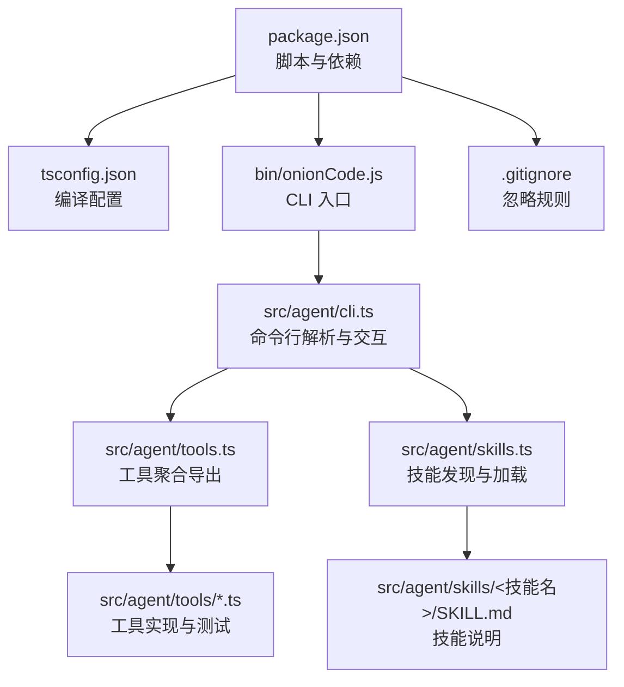
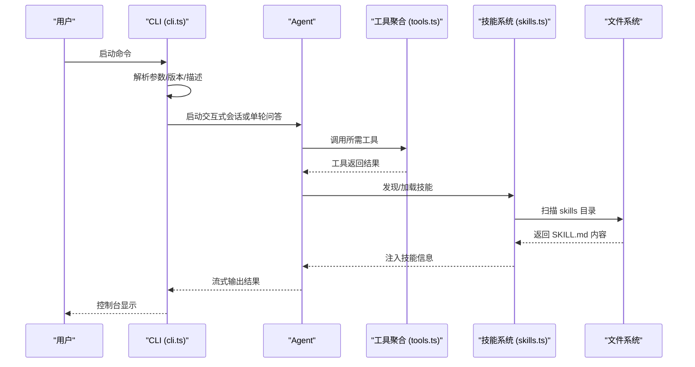
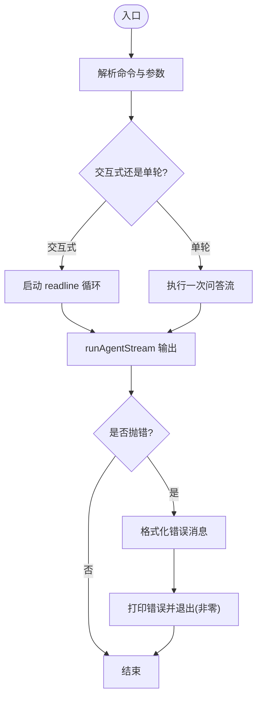
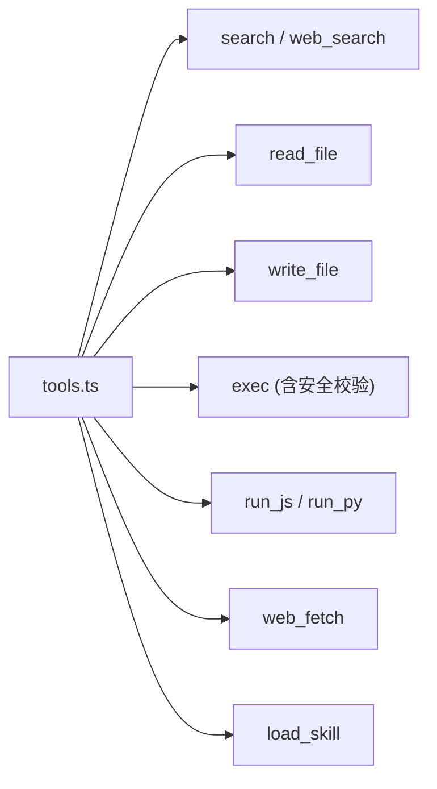
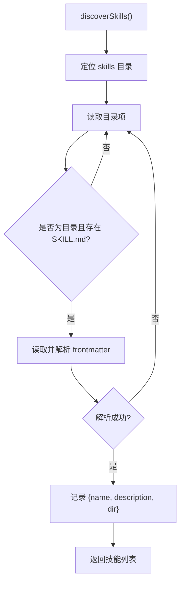
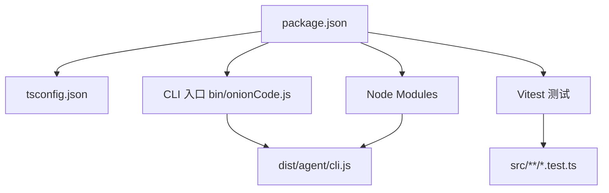

# 贡献流程指南

<cite>
**本文引用的文件**
- [package.json](file://package.json)
- [tsconfig.json](file://tsconfig.json)
- [.gitignore](file://.gitignore)
- [bin/onionCode.js](file://bin/onionCode.js)
- [src/agent/cli.ts](file://src/agent/cli.ts)
- [src/agent/tools.ts](file://src/agent/tools.ts)
- [src/agent/skills.ts](file://src/agent/skills.ts)
- [src/agent/skills/planner/SKILL.md](file://src/agent/skills/planner/SKILL.md)
- [src/agent/skills/skill-creator/SKILL.md](file://src/agent/skills/skill-creator/SKILL.md)
- [src/agent/skills/skill-creator/scripts/utils.py](file://src/agent/skills/skill-creator/scripts/utils.py)
- [src/agent/skills/skill-creator/scripts/quick_validate.py](file://src/agent/skills/skill-creator/scripts/quick_validate.py)
- [src/agent/tools/exec.test.ts](file://src/agent/tools/exec.test.ts)
- [src/agent/tools/write_file.test.ts](file://src/agent/tools/write_file.test.ts)
</cite>

## 目录
1. [简介](#简介)
2. [项目结构](#项目结构)
3. [核心组件](#核心组件)
4. [架构总览](#架构总览)
5. [详细组件分析](#详细组件分析)
6. [依赖关系分析](#依赖关系分析)
7. [性能与质量保障](#性能与质量保障)
8. [故障排查指南](#故障排查指南)
9. [结论](#结论)
10. [附录](#附录)

## 简介
本指南面向希望参与本开源项目的贡献者，提供从 Fork/Clone 到提交 PR、代码评审、测试与文档更新、Issue 报告与修复、发布与版本管理、以及社区行为与沟通的全流程规范。项目采用 TypeScript 开发并通过 Vitest 进行单元测试；CLI 提供交互式会话与单轮问答能力，并内置对常见错误的友好提示。

## 项目结构
仓库采用“源码在 src、构建产物在 dist”的组织方式，根目录包含包管理与脚本配置、CLI 入口、核心 Agent 与工具模块、以及技能（skills）目录。技能以独立目录形式存在，每个技能通过 SKILL.md 描述其用途、触发条件与使用方法。

图表来源
- [package.json:11-16](file://package.json#L11-L16)
- [tsconfig.json:1-20](file://tsconfig.json#L1-L20)
- [bin/onionCode.js:1-3](file://bin/onionCode.js#L1-L3)
- [src/agent/cli.ts:1-126](file://src/agent/cli.ts#L1-L126)
- [src/agent/tools.ts:1-10](file://src/agent/tools.ts#L1-L10)
- [src/agent/skills.ts:1-139](file://src/agent/skills.ts#L1-L139)
- [.gitignore:1-4](file://.gitignore#L1-L4)

章节来源
- [package.json:1-38](file://package.json#L1-L38)
- [tsconfig.json:1-20](file://tsconfig.json#L1-L20)
- [bin/onionCode.js:1-3](file://bin/onionCode.js#L1-L3)
- [src/agent/cli.ts:1-126](file://src/agent/cli.ts#L1-L126)
- [src/agent/tools.ts:1-10](file://src/agent/tools.ts#L1-L10)
- [src/agent/skills.ts:1-139](file://src/agent/skills.ts#L1-L139)
- [.gitignore:1-4](file://.gitignore#L1-L4)

## 核心组件
- 包与脚本：定义开发、构建、测试与启动脚本，便于本地调试与发布。
- 编译配置：统一目标环境、严格模式、声明文件生成等。
- CLI 入口与命令行逻辑：解析参数、处理交互式会话、错误格式化与退出码。
- 工具聚合：集中导出各类工具，便于上层 Agent 使用。
- 技能系统：扫描并加载技能目录中的 SKILL.md，支持动态注入可用技能列表。

章节来源
- [package.json:11-16](file://package.json#L11-L16)
- [tsconfig.json:9-16](file://tsconfig.json#L9-L16)
- [src/agent/cli.ts:8-38](file://src/agent/cli.ts#L8-L38)
- [src/agent/tools.ts:1-10](file://src/agent/tools.ts#L1-L10)
- [src/agent/skills.ts:53-139](file://src/agent/skills.ts#L53-L139)

## 架构总览
下图展示 CLI 启动、工具调用与技能加载的整体流程。

图表来源
- [src/agent/cli.ts:40-125](file://src/agent/cli.ts#L40-L125)
- [src/agent/tools.ts:1-10](file://src/agent/tools.ts#L1-L10)
- [src/agent/skills.ts:53-139](file://src/agent/skills.ts#L53-L139)

## 详细组件分析

### CLI 与错误处理
- 命令注册：提供默认交互式会话与单轮问答命令。
- 友好错误提示：针对内容安全拦截、认证失败、额度不足、超时等场景进行人性化提示。
- 退出码：异常时输出错误并以非零退出码结束，便于 CI/CD 识别。

图表来源
- [src/agent/cli.ts:40-125](file://src/agent/cli.ts#L40-L125)

章节来源
- [src/agent/cli.ts:8-38](file://src/agent/cli.ts#L8-L38)
- [src/agent/cli.ts:40-125](file://src/agent/cli.ts#L40-L125)

### 工具聚合与安全策略
- 工具聚合导出：集中暴露搜索、读写文件、执行命令、运行脚本、网页检索/抓取、加载技能等工具。
- 安全策略：对危险命令与 eval 注入进行阻断，防止破坏性操作与代码注入。

图表来源
- [src/agent/tools.ts:1-10](file://src/agent/tools.ts#L1-L10)

章节来源
- [src/agent/tools.ts:1-10](file://src/agent/tools.ts#L1-L10)
- [src/agent/tools/exec.test.ts:23-131](file://src/agent/tools/exec.test.ts#L23-L131)

### 技能系统与加载机制
- 技能发现：遍历 skills 目录，读取每个 SKILL.md 的 YAML frontmatter，提取 name 与 description。
- 动态注入：将可用技能列表注入到系统提示词中，供 Agent 选择使用。
- 目录回退：支持开发与构建两种环境下 skills 目录定位。

图表来源
- [src/agent/skills.ts:53-84](file://src/agent/skills.ts#L53-L84)

章节来源
- [src/agent/skills.ts:13-84](file://src/agent/skills.ts#L13-L84)
- [src/agent/skills.ts:85-139](file://src/agent/skills.ts#L85-L139)

### 技能编写与验证规范
- 触发条件与描述：描述字段决定技能是否被调用，需明确何时触发与做什么。
- 结构与层级：建议 SKILL.md 控制在合理长度，必要时增加层级并提供清晰指引。
- 输出格式：推荐使用固定模板与示例，提升一致性与可评估性。
- 名称与描述校验：名称采用 kebab-case，长度与字符约束；描述禁止尖括号并限制长度。

章节来源
- [src/agent/skills/skill-creator/SKILL.md:62-161](file://src/agent/skills/skill-creator/SKILL.md#L62-L161)
- [src/agent/skills/skill-creator/scripts/quick_validate.py:58-84](file://src/agent/skills/skill-creator/scripts/quick_validate.py#L58-L84)
- [src/agent/skills/skill-creator/scripts/utils.py:7-47](file://src/agent/skills/skill-creator/scripts/utils.py#L7-L47)

## 依赖关系分析
- 构建与运行：TypeScript 编译至 dist，CLI 入口指向构建产物。
- 测试：Vitest 负责单元测试，覆盖工具的安全与功能边界。
- 忽略规则：忽略 node_modules、dist 与 .env，确保构建产物与敏感配置不进入版本控制。

图表来源
- [package.json:11-16](file://package.json#L11-L16)
- [tsconfig.json:7-8](file://tsconfig.json#L7-L8)
- [bin/onionCode.js:1-3](file://bin/onionCode.js#L1-L3)
- [.gitignore:1-4](file://.gitignore#L1-L4)

章节来源
- [package.json:11-16](file://package.json#L11-L16)
- [tsconfig.json:7-8](file://tsconfig.json#L7-L8)
- [bin/onionCode.js:1-3](file://bin/onionCode.js#L1-L3)
- [.gitignore:1-4](file://.gitignore#L1-L4)

## 性能与质量保障
- 构建与打包：编译后复制技能资源，确保 CLI 运行时具备完整上下文。
- 测试覆盖率：围绕工具安全策略与核心功能编写测试用例，覆盖边界与异常路径。
- 类型安全：启用严格模式与声明文件生成，减少运行期错误。
- 产物隔离：构建输出与源码分离，避免污染。

章节来源
- [package.json:14](file://package.json#L14)
- [tsconfig.json:9-16](file://tsconfig.json#L9-L16)
- [src/agent/tools/exec.test.ts:1-150](file://src/agent/tools/exec.test.ts#L1-L150)
- [src/agent/tools/write_file.test.ts:1-47](file://src/agent/tools/write_file.test.ts#L1-L47)

## 故障排查指南
- CLI 错误提示：内容安全拦截、API Key 无效、额度不足、超时等均有明确提示与建议。
- 退出码：异常时以非零退出码结束，便于自动化流程识别。
- 测试先行：新增或修改功能前先编写/更新测试，确保回归稳定。

章节来源
- [src/agent/cli.ts:11-38](file://src/agent/cli.ts#L11-L38)
- [src/agent/cli.ts:52-56](file://src/agent/cli.ts#L52-L56)

## 结论
本指南提供了从开发到发布的完整流程规范，结合现有代码结构明确了贡献路径与质量标准。建议贡献者遵循分支与提交规范、完善测试与文档、按需更新技能与 CLI 行为，共同维护项目的可维护性与可扩展性。

## 附录

### 1. 开发环境与本地运行
- 安装依赖与构建
  - 安装：使用包管理器安装依赖
  - 构建：编译 TypeScript 并复制技能资源
  - 启动：运行 CLI 或开发模式
- 测试
  - 运行测试套件，确保所有用例通过

章节来源
- [package.json:11-16](file://package.json#L11-L16)
- [tsconfig.json:17-18](file://tsconfig.json#L17-L18)

### 2. Fork 与 Clone 步骤
- Fork：在上游仓库页面点击 Fork 按钮，创建个人副本
- Clone：克隆到本地工作目录
- 安装依赖：安装项目依赖
- 验证：运行构建与测试，确认环境正常

章节来源
- [package.json:11-16](file://package.json#L11-L16)

### 3. 分支命名规范
- feat：新增功能
- fix：缺陷修复
- refactor：重构但不改变行为
- docs：仅文档变更
- test：新增或修订测试
- chore：构建过程或辅助工具变动

### 4. 提交消息格式
- 格式：type(scope): subject
- 示例：feat(cli): 支持自定义模型参数
- 说明：subject 使用祈使句，简洁明了描述变更

### 5. Pull Request 创建流程
- 在 Fork 的仓库中创建分支并推送
- 在上游仓库发起 PR，填写模板化信息
- 关联 Issue（如适用）
- 等待代码评审与 CI 检查通过

### 6. 代码风格检查与测试
- 类型检查：确保通过严格类型检查
- 单元测试：为新增/修改功能补充测试用例
- 安全校验：工具相关变更需覆盖安全策略测试

章节来源
- [tsconfig.json:9-16](file://tsconfig.json#L9-L16)
- [src/agent/tools/exec.test.ts:1-150](file://src/agent/tools/exec.test.ts#L1-L150)
- [src/agent/tools/write_file.test.ts:1-47](file://src/agent/tools/write_file.test.ts#L1-L47)

### 7. 文档更新要求
- 新增/修改功能需同步更新相关文档
- 技能变更需更新对应 SKILL.md
- CLI 行为变更需更新 README 或相关说明

章节来源
- [src/agent/skills/planner/SKILL.md:1-91](file://src/agent/skills/planner/SKILL.md#L1-L91)
- [src/agent/skills/skill-creator/SKILL.md:1-486](file://src/agent/skills/skill-creator/SKILL.md#L1-L486)

### 8. Issue 报告模板与 Bug 修复流程
- 报告模板（建议）
  - 标题：简洁描述问题
  - 复现步骤：最小可复现步骤
  - 期望行为：预期结果
  - 实际行为：实际结果
  - 环境信息：操作系统、Node 版本、依赖版本
- 修复流程
  - 新建分支并编写测试用例
  - 修复问题并确保测试通过
  - 更新相关文档与 CHANGELOG（如适用）

### 9. 代码审查清单与质量标准
- 功能正确性：通过单元测试与集成测试
- 安全性：工具调用与外部命令需满足安全策略
- 可维护性：命名规范、模块职责清晰、注释充分
- 兼容性：避免破坏性变更，必要时提供迁移指导
- 文档：变更点均有相应文档说明

章节来源
- [src/agent/tools/exec.test.ts:23-131](file://src/agent/tools/exec.test.ts#L23-L131)

### 10. 发布流程与版本管理策略
- 版本号：采用语义化版本（主.次.补丁）
- 发布前检查：通过构建、测试与安全扫描
- 发布渠道：通过包管理器发布
- 变更记录：更新变更日志，记录重大变更与修复

章节来源
- [package.json:2-4](file://package.json#L2-L4)
- [package.json:14](file://package.json#L14)

### 11. 社区行为准则与沟通指南
- 尊重与包容：保持友善与专业
- 明确沟通：提供足够上下文与复现信息
- 积极反馈：建设性评审与建议
- 遵守法律与安全：不传播敏感信息，遵守开源许可