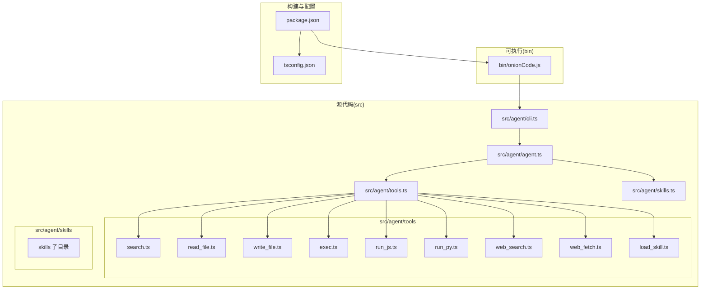
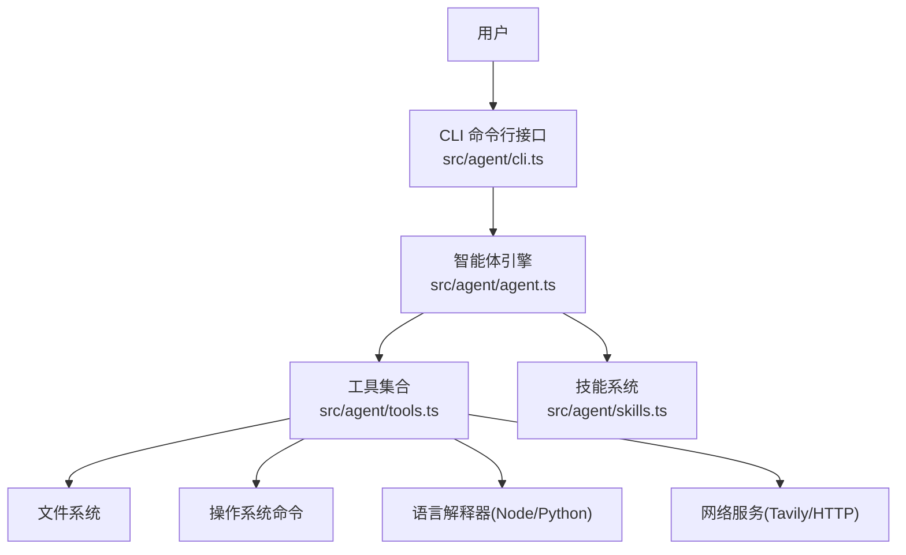
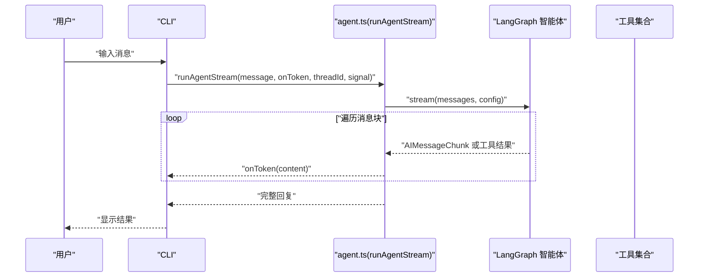
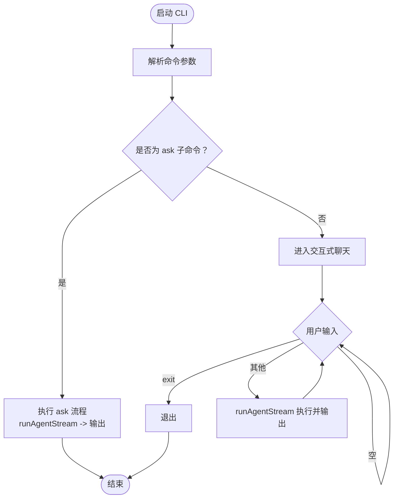
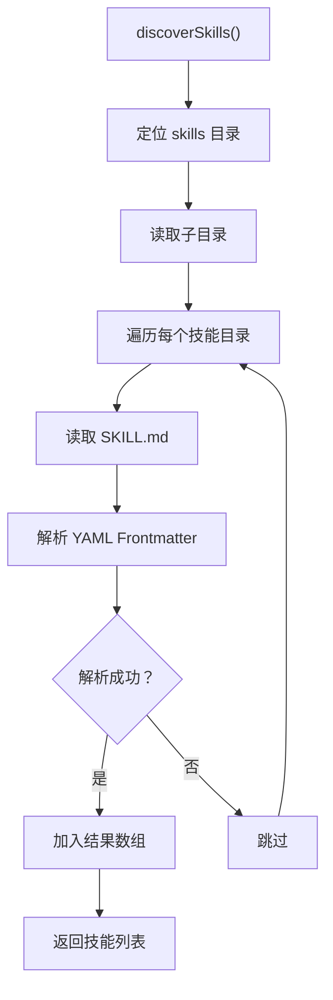
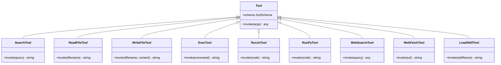
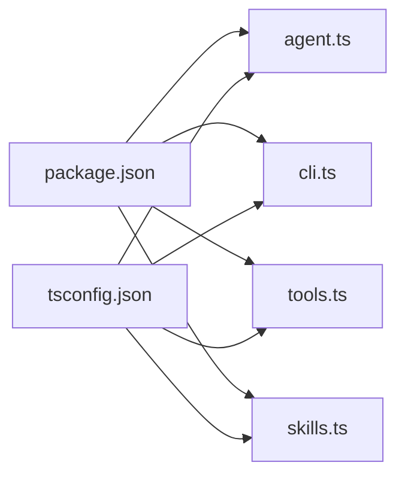

# 项目结构说明

<cite>
**本文档引用的文件**
- [package.json](file://package.json)
- [tsconfig.json](file://tsconfig.json)
- [bin/onionCode.js](file://bin/onionCode.js)
- [src/agent/agent.ts](file://src/agent/agent.ts)
- [src/agent/cli.ts](file://src/agent/cli.ts)
- [src/agent/tools.ts](file://src/agent/tools.ts)
- [src/agent/skills.ts](file://src/agent/skills.ts)
- [src/agent/tools/search.ts](file://src/agent/tools/search.ts)
- [src/agent/tools/read_file.ts](file://src/agent/tools/read_file.ts)
- [src/agent/tools/write_file.ts](file://src/agent/tools/write_file.ts)
- [src/agent/tools/exec.ts](file://src/agent/tools/exec.ts)
- [src/agent/tools/run_js.ts](file://src/agent/tools/run_js.ts)
- [src/agent/tools/run_py.ts](file://src/agent/tools/run_py.ts)
- [src/agent/tools/web_search.ts](file://src/agent/tools/web_search.ts)
- [src/agent/tools/web_fetch.ts](file://src/agent/tools/web_fetch.ts)
- [src/agent/tools/load_skill.ts](file://src/agent/tools/load_skill.ts)
</cite>

## 目录
1. [简介](#简介)
2. [项目结构](#项目结构)
3. [核心组件](#核心组件)
4. [架构总览](#架构总览)
5. [详细组件分析](#详细组件分析)
6. [依赖分析](#依赖分析)
7. [性能考虑](#性能考虑)
8. [故障排除指南](#故障排除指南)
9. [结论](#结论)
10. [附录](#附录)

## 简介
本项目是一个基于 CLI 的 AI 助手，具备工具调用能力（类似 OpenCode）。它通过 LangChain 构建智能体，结合多种工具（文件读写、命令执行、代码运行、网页搜索与抓取、技能加载等）实现交互式问答与任务执行。项目采用 TypeScript 开发，支持开发调试、构建打包与发布。

## 项目结构
仓库采用按功能模块划分的目录结构，核心位于 src/agent 下，包含智能体定义、命令行入口、工具集合与技能系统；bin 目录提供可执行脚本入口；构建配置通过 tsconfig.json 控制，包元信息与脚本在 package.json 中定义。

**图表来源**
- [src/agent/agent.ts:1-98](file://src/agent/agent.ts#L1-L98)
- [src/agent/cli.ts:1-126](file://src/agent/cli.ts#L1-L126)
- [src/agent/tools.ts:1-10](file://src/agent/tools.ts#L1-L10)
- [src/agent/skills.ts:1-139](file://src/agent/skills.ts#L1-L139)
- [bin/onionCode.js:1-3](file://bin/onionCode.js#L1-L3)
- [package.json:1-38](file://package.json#L1-L38)
- [tsconfig.json:1-20](file://tsconfig.json#L1-L20)

**章节来源**
- [package.json:1-38](file://package.json#L1-L38)
- [tsconfig.json:1-20](file://tsconfig.json#L1-L20)

## 核心组件
- 智能体定义与流式执行：在 agent.ts 中创建智能体实例，注册工具集合并提供流式输出接口，支持会话线程与中断控制。
- 命令行界面：在 cli.ts 中解析命令参数，提供 ask 单轮问答与交互式聊天模式，并对常见错误进行格式化提示。
- 工具聚合：tools.ts 汇总导出所有工具，便于统一引入与维护。
- 技能系统：skills.ts 实现技能发现、加载与注入提示词逻辑，支持动态扩展能力。
- 工具实现：各工具文件封装具体能力（文件读写、命令执行、代码运行、网页搜索与抓取、技能加载），并内置安全策略与错误处理。
- 可执行入口：bin/onionCode.js 将 CLI 作为 Node.js 可执行程序入口。

**章节来源**
- [src/agent/agent.ts:1-98](file://src/agent/agent.ts#L1-L98)
- [src/agent/cli.ts:1-126](file://src/agent/cli.ts#L1-L126)
- [src/agent/tools.ts:1-10](file://src/agent/tools.ts#L1-L10)
- [src/agent/skills.ts:1-139](file://src/agent/skills.ts#L1-L139)
- [bin/onionCode.js:1-3](file://bin/onionCode.js#L1-L3)

## 架构总览
系统采用“CLI → 智能体 → 工具”的分层架构。CLI 负责用户交互与错误提示；智能体负责对话与决策；工具负责具体能力执行；技能系统提供可插拔的能力模板。

**图表来源**
- [src/agent/cli.ts:1-126](file://src/agent/cli.ts#L1-L126)
- [src/agent/agent.ts:1-98](file://src/agent/agent.ts#L1-L98)
- [src/agent/tools.ts:1-10](file://src/agent/tools.ts#L1-L10)
- [src/agent/skills.ts:1-139](file://src/agent/skills.ts#L1-L139)

## 详细组件分析

### agent.ts：智能体与流式执行
- 职责
  - 初始化模型与内存检查点（MemorySaver）。
  - 注册九类工具：本地搜索、文件读写、命令执行、JS/Python 代码运行、网页搜索与抓取、技能加载。
  - 构造系统提示词，注入可用技能列表。
  - 提供 runAgentStream 流式执行函数，支持线程 ID 与中断信号。
- 关键点
  - 使用 dotenv 以项目根目录为基准加载环境变量。
  - 通过 langchain 的 createAgent 创建智能体，启用消息流式输出。
  - 过滤非 AI 消息块，仅将文本片段回调给调用方。
- 设计模式
  - 工厂模式：集中创建与配置智能体。
  - 观察者模式：onToken 回调逐字输出。
- 性能与安全
  - 流式输出减少等待时间。
  - 通过工具侧的安全策略降低风险。

**图表来源**
- [src/agent/agent.ts:61-97](file://src/agent/agent.ts#L61-L97)
- [src/agent/cli.ts:46-57](file://src/agent/cli.ts#L46-L57)

**章节来源**
- [src/agent/agent.ts:1-98](file://src/agent/agent.ts#L1-L98)

### cli.ts：命令行入口与交互
- 职责
  - 使用 commander 定义命令与版本信息。
  - 提供 ask 子命令与默认交互式聊天。
  - 对常见错误进行友好提示（内容安全、认证、配额、超时等）。
  - 支持 ESC 中断流式输出。
- 关键点
  - 交互式聊天循环，暂停/恢复标准输入监听。
  - 统一错误格式化与退出码。
- 设计模式
  - 命令模式：将命令解析与执行解耦。
  - 状态机：聊天状态切换与中断处理。

**图表来源**
- [src/agent/cli.ts:1-126](file://src/agent/cli.ts#L1-L126)

**章节来源**
- [src/agent/cli.ts:1-126](file://src/agent/cli.ts#L1-L126)

### tools.ts：工具聚合导出
- 职责
  - 统一导出九类工具，便于智能体与外部模块按需引入。
- 设计模式
  - 门面模式：对外暴露简洁接口，隐藏内部实现细节。

**章节来源**
- [src/agent/tools.ts:1-10](file://src/agent/tools.ts#L1-L10)

### skills.ts：技能发现与注入
- 职责
  - 发现 skills 目录下的技能（遍历子目录，读取 SKILL.md 的 YAML frontmatter）。
  - 加载指定技能的完整内容。
  - 生成技能列表文本注入系统提示词。
- 关键点
  - 多级回退定位 skills 目录（构建后复制、源码位置等）。
  - 安全与健壮性：异常捕获与空值返回。
- 设计模式
  - 策略模式：不同技能以独立目录与文档形式存在，统一加载策略。

**图表来源**
- [src/agent/skills.ts:53-84](file://src/agent/skills.ts#L53-L84)

**章节来源**
- [src/agent/skills.ts:1-139](file://src/agent/skills.ts#L1-L139)

### 工具实现概览
- search.ts：本地模拟搜索，根据关键词返回天气信息。
- read_file.ts：安全读取文件，限制在当前工作目录内。
- write_file.ts：安全写文件，禁止越界与危险内容。
- exec.ts：危险命令黑名单、eval 模式检测与危险 API 检测，限制超时与缓冲区大小。
- run_js.ts：Node.js 可用性检查，临时文件执行 JS，超时与清理。
- run_py.ts：Python3 可用性检查，临时文件执行 Python，超时与清理。
- web_search.ts：Tavily 搜索客户端封装，API Key 校验与错误处理。
- web_fetch.ts：URL 校验、超时控制、响应大小限制与错误分类。
- load_skill.ts：技能名称校验与内容加载，提供可用技能列表。

**图表来源**
- [src/agent/tools/search.ts:4-23](file://src/agent/tools/search.ts#L4-L23)
- [src/agent/tools/read_file.ts:6-40](file://src/agent/tools/read_file.ts#L6-L40)
- [src/agent/tools/write_file.ts:7-54](file://src/agent/tools/write_file.ts#L7-L54)
- [src/agent/tools/exec.ts:94-142](file://src/agent/tools/exec.ts#L94-L142)
- [src/agent/tools/run_js.ts:22-89](file://src/agent/tools/run_js.ts#L22-L89)
- [src/agent/tools/run_py.ts:22-89](file://src/agent/tools/run_py.ts#L22-L89)
- [src/agent/tools/web_search.ts:16-40](file://src/agent/tools/web_search.ts#L16-L40)
- [src/agent/tools/web_fetch.ts:20-82](file://src/agent/tools/web_fetch.ts#L20-L82)
- [src/agent/tools/load_skill.ts:5-33](file://src/agent/tools/load_skill.ts#L5-L33)

**章节来源**
- [src/agent/tools/search.ts:1-24](file://src/agent/tools/search.ts#L1-L24)
- [src/agent/tools/read_file.ts:1-41](file://src/agent/tools/read_file.ts#L1-L41)
- [src/agent/tools/write_file.ts:1-55](file://src/agent/tools/write_file.ts#L1-L55)
- [src/agent/tools/exec.ts:1-143](file://src/agent/tools/exec.ts#L1-L143)
- [src/agent/tools/run_js.ts:1-90](file://src/agent/tools/run_js.ts#L1-L90)
- [src/agent/tools/run_py.ts:1-90](file://src/agent/tools/run_py.ts#L1-L90)
- [src/agent/tools/web_search.ts:1-41](file://src/agent/tools/web_search.ts#L1-L41)
- [src/agent/tools/web_fetch.ts:1-83](file://src/agent/tools/web_fetch.ts#L1-L83)
- [src/agent/tools/load_skill.ts:1-34](file://src/agent/tools/load_skill.ts#L1-L34)

## 依赖分析
- 运行时依赖
  - LangChain 生态：@langchain/core、@langchain/langgraph、@langchain/openai、@langchain/tavily、langchain。
  - 命令行：commander。
  - 环境变量：dotenv。
  - 类型校验：zod。
- 开发依赖
  - TypeScript 编译与类型：typescript、@types/node。
  - 调试与测试：ts-node、tsx、vitest。
- 包脚本
  - dev：ts-node 直接运行 CLI。
  - start：node 运行编译产物。
  - build：TypeScript 编译并将 skills 目录复制到 dist。
  - test：运行单元测试。

**图表来源**
- [package.json:1-38](file://package.json#L1-L38)
- [tsconfig.json:1-20](file://tsconfig.json#L1-L20)

**章节来源**
- [package.json:1-38](file://package.json#L1-L38)
- [tsconfig.json:1-20](file://tsconfig.json#L1-L20)

## 性能考虑
- 流式输出：智能体以消息流方式返回，降低首 token 延迟。
- 超时与缓冲：命令执行与网络请求设置超时与最大缓冲，避免阻塞。
- 临时文件执行：JS/Python 代码通过临时文件执行，规避复杂转义问题。
- 资源清理：执行完成后清理临时文件，减少资源泄漏风险。
- 并发与中断：交互式场景支持 ESC 中断，提升用户体验。

## 故障排除指南
- 内容安全拦截：DeepSeek 审核拦截时，建议调整提问方式或简化查询。
- 认证失败：检查 OPENAI_API_KEY 是否正确配置。
- 配额不足：账户额度不足时出现 429，需充值或检查用量。
- 网络超时：检查网络连通性与代理设置。
- 文件访问：确保文件路径在当前工作目录内，避免越界。
- 危险操作：命令/代码/文件内容包含危险 API 或模式会被阻断。
- 技能加载：确认技能名称拼写正确，查看可用技能列表。

**章节来源**
- [src/agent/cli.ts:11-38](file://src/agent/cli.ts#L11-L38)
- [src/agent/tools/exec.ts:94-142](file://src/agent/tools/exec.ts#L94-L142)
- [src/agent/tools/run_js.ts:22-89](file://src/agent/tools/run_js.ts#L22-L89)
- [src/agent/tools/run_py.ts:22-89](file://src/agent/tools/run_py.ts#L22-L89)
- [src/agent/tools/web_search.ts:16-40](file://src/agent/tools/web_search.ts#L16-L40)
- [src/agent/tools/web_fetch.ts:20-82](file://src/agent/tools/web_fetch.ts#L20-L82)
- [src/agent/tools/load_skill.ts:5-33](file://src/agent/tools/load_skill.ts#L5-L33)

## 结论
本项目通过清晰的模块划分与安全的工具实现，构建了一个可扩展的 CLI AI 助手。agent.ts 作为核心枢纽，将工具与技能整合；cli.ts 提供用户交互入口；tools.ts 与 skills.ts 分别承担工具聚合与能力扩展。配合完善的错误处理与安全策略，系统在易用性与安全性之间取得良好平衡。

## 附录

### TypeScript 源码到编译产物的转换过程
- 编译目标与模块：ES2022，CommonJS，Node 解析。
- 输出目录：dist，根目录为 src。
- 类型声明：生成 .d.ts 文件。
- 构建脚本：tsc 执行编译；随后复制 src/agent/skills 到 dist/agent/skills。
- 运行入口：bin/onionCode.js require dist/agent/cli.js。

**章节来源**
- [tsconfig.json:1-20](file://tsconfig.json#L1-L20)
- [package.json:11-16](file://package.json#L11-L16)
- [bin/onionCode.js:1-3](file://bin/onionCode.js#L1-L3)

### 模块导入导出最佳实践与命名约定
- 导出风格
  - 工具统一在 tools.ts 聚合导出，便于按需引入与维护。
  - 智能体在 agent.ts 中集中创建与配置，避免分散初始化。
- 命名约定
  - 工具函数以动词短语命名（如 readFileTool、execTool）。
  - 工具对象统一以工具名加 Tool 后缀（如 readFileTool）。
  - 系统提示词与技能注入采用描述性常量与函数组合。
- 设计模式应用
  - 工厂模式：智能体工厂集中创建与配置。
  - 门面模式：tools.ts 作为统一门面。
  - 策略模式：skills 目录策略化扩展。
  - 命令模式：CLI 子命令解耦。
  - 观察者模式：流式输出回调。
- 安全与健壮性
  - 路径解析与越界检查。
  - 危险命令与 eval 模式黑名单。
  - 危险 API 模式扫描。
  - 超时与缓冲限制。
  - 异常捕获与错误分类。