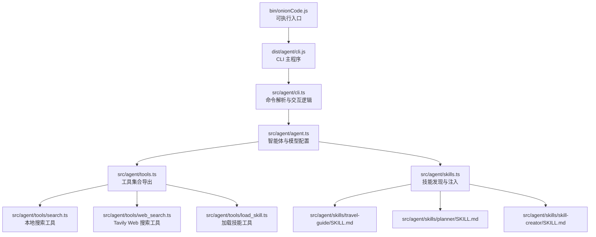
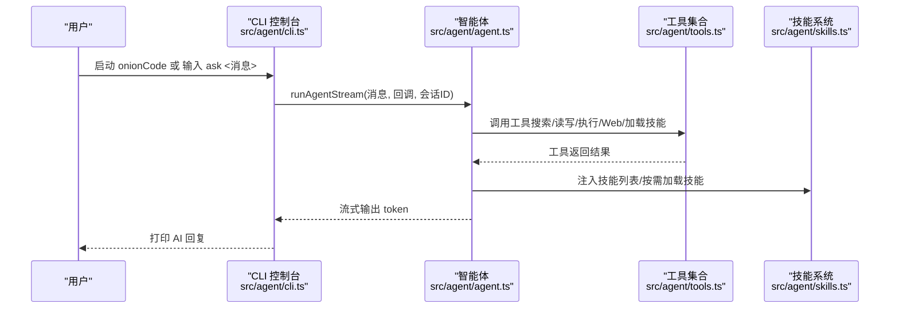
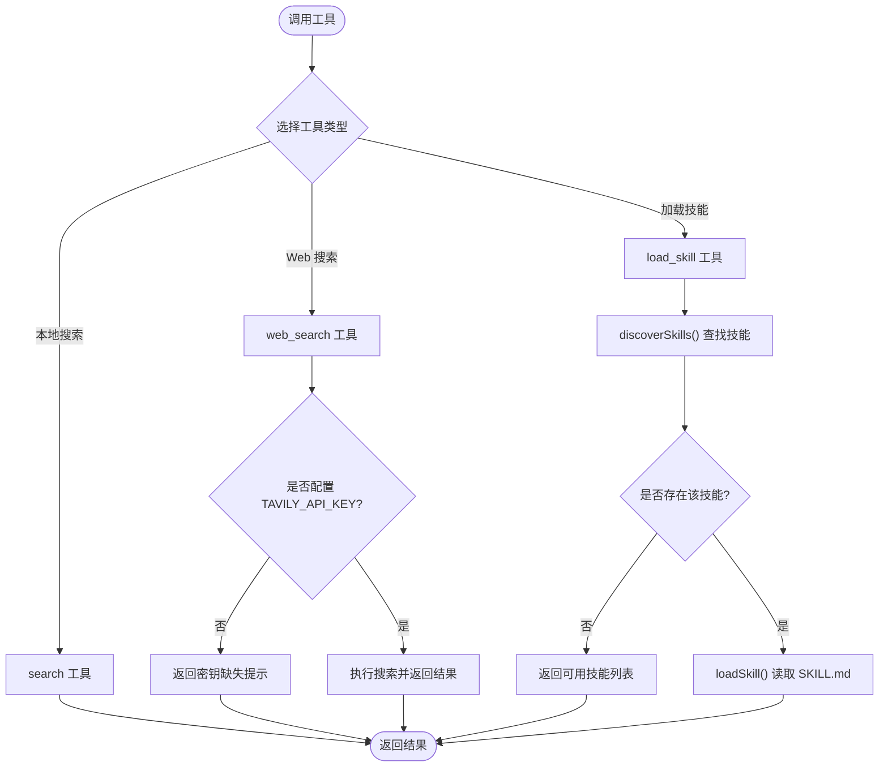
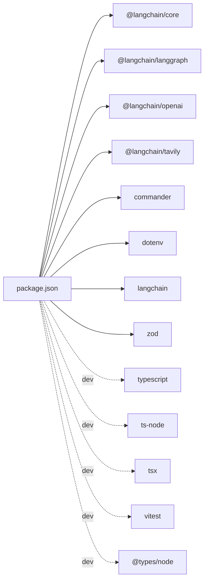

# 快速开始

<cite>
**本文引用的文件**
- [package.json](file://package.json)
- [bin/onionCode.js](file://bin/onionCode.js)
- [src/agent/cli.ts](file://src/agent/cli.ts)
- [src/agent/agent.ts](file://src/agent/agent.ts)
- [src/agent/tools.ts](file://src/agent/tools.ts)
- [src/agent/skills.ts](file://src/agent/skills.ts)
- [src/agent/tools/search.ts](file://src/agent/tools/search.ts)
- [src/agent/tools/web_search.ts](file://src/agent/tools/web_search.ts)
- [src/agent/tools/load_skill.ts](file://src/agent/tools/load_skill.ts)
- [src/agent/skills/travel-guide/SKILL.md](file://src/agent/skills/travel-guide/SKILL.md)
- [src/agent/skills/planner/SKILL.md](file://src/agent/skills/planner/SKILL.md)
- [src/agent/skills/skill-creator/SKILL.md](file://src/agent/skills/skill-creator/SKILL.md)
</cite>

## 目录
1. [简介](#简介)
2. [项目结构](#项目结构)
3. [核心组件](#核心组件)
4. [架构总览](#架构总览)
5. [详细组件解析](#详细组件解析)
6. [依赖分析](#依赖分析)
7. [性能考虑](#性能考虑)
8. [故障排除指南](#故障排除指南)
9. [结论](#结论)
10. [附录](#附录)

## 简介
本指南面向首次接触 Onion Code CLI 的用户，帮助你在 5 分钟内完成安装、环境配置与首次运行。你将学习如何安装依赖、配置 API 密钥、运行基本命令，并体验核心功能（交互式聊天、单轮问答、技能加载）。文档还提供了常见问题的排查方法与社区支持资源。

## 项目结构
Onion Code CLI 是一个基于 Node.js 的命令行工具，通过 LangChain 生态构建智能体，具备工具调用与“技能”系统能力。主要结构如下：
- 可执行入口位于 bin/onionCode.js，指向构建产物 dist/agent/cli.js
- CLI 命令定义于 src/agent/cli.ts，负责解析参数、启动交互式对话或执行单轮问答
- 智能体与模型配置位于 src/agent/agent.ts，使用 OpenAI 兼容接口（默认 DeepSeek）与内存检查点
- 工具集合位于 src/agent/tools.ts，导出多种工具（搜索、读写文件、执行脚本、Web 搜索、加载技能等）
- 技能系统位于 src/agent/skills.ts，负责发现与加载 SKILL.md 描述文件，注入系统提示词
- 示例技能包括旅行路书、计划助手、技能创建器等

图表来源
- [bin/onionCode.js:1-3](file://bin/onionCode.js#L1-L3)
- [src/agent/cli.ts:1-126](file://src/agent/cli.ts#L1-L126)
- [src/agent/agent.ts:1-98](file://src/agent/agent.ts#L1-L98)
- [src/agent/tools.ts:1-10](file://src/agent/tools.ts#L1-L10)
- [src/agent/skills.ts:1-139](file://src/agent/skills.ts#L1-L139)

章节来源
- [package.json:1-38](file://package.json#L1-L38)
- [bin/onionCode.js:1-3](file://bin/onionCode.js#L1-L3)
- [src/agent/cli.ts:1-126](file://src/agent/cli.ts#L1-L126)
- [src/agent/agent.ts:1-98](file://src/agent/agent.ts#L1-L98)
- [src/agent/tools.ts:1-10](file://src/agent/tools.ts#L1-L10)
- [src/agent/skills.ts:1-139](file://src/agent/skills.ts#L1-L139)

## 核心组件
- CLI 命令
  - 默认行为：进入交互式聊天控制台，支持 ESC 中断
  - 子命令：ask <message...> 执行一次问答并退出
- 智能体与模型
  - 使用 OpenAI 兼容接口（默认 DeepSeek），支持流式输出
  - 内存检查点实现会话续接
- 工具集
  - 本地搜索、文件读写、执行脚本、JS/Python 运行、Web 搜索、加载技能
- 技能系统
  - 发现并注入可用技能列表，按需加载完整技能内容

章节来源
- [src/agent/cli.ts:40-62](file://src/agent/cli.ts#L40-L62)
- [src/agent/agent.ts:25-51](file://src/agent/agent.ts#L25-L51)
- [src/agent/tools.ts:1-10](file://src/agent/tools.ts#L1-L10)
- [src/agent/skills.ts:53-138](file://src/agent/skills.ts#L53-L138)

## 架构总览
下面的序列图展示了从用户输入到智能体响应的关键流程，包括交互式聊天与单轮问答两种模式。

图表来源
- [src/agent/cli.ts:46-57](file://src/agent/cli.ts#L46-L57)
- [src/agent/cli.ts:66-125](file://src/agent/cli.ts#L66-L125)
- [src/agent/agent.ts:61-97](file://src/agent/agent.ts#L61-L97)
- [src/agent/tools.ts:1-10](file://src/agent/tools.ts#L1-L10)
- [src/agent/skills.ts:127-138](file://src/agent/skills.ts#L127-L138)

## 详细组件解析

### 安装与首次运行
- 安装依赖
  - 使用包管理器安装项目依赖（开发与运行时）
  - 构建产物包含 CLI 与技能资源
- 配置环境变量
  - 设置 OPENAI_API_KEY（用于 DeepSeek/OpenAI 兼容接口）
  - 如需实时网络搜索，设置 TAVILY_API_KEY
- 首次运行
  - 交互式聊天：直接运行命令进入控制台，输入 exit 退出
  - 单轮问答：使用 ask 子命令传入消息，立即获得回复

章节来源
- [package.json:11-16](file://package.json#L11-L16)
- [src/agent/agent.ts:26-33](file://src/agent/agent.ts#L26-L33)
- [src/agent/tools/web_search.ts:5-14](file://src/agent/tools/web_search.ts#L5-L14)
- [src/agent/cli.ts:66-125](file://src/agent/cli.ts#L66-L125)
- [src/agent/cli.ts:46-57](file://src/agent/cli.ts#L46-L57)

### 命令与用法
- 默认行为
  - 启动交互式聊天控制台，支持 ESC 中断当前回答
- 子命令
  - ask <message...>：执行一次问答，适合快速测试
- 会话与中断
  - 通过线程 ID 续接历史；监听 ESC 键中断流式输出

章节来源
- [src/agent/cli.ts:59-62](file://src/agent/cli.ts#L59-L62)
- [src/agent/cli.ts:66-125](file://src/agent/cli.ts#L66-L125)
- [src/agent/cli.ts:46-57](file://src/agent/cli.ts#L46-L57)

### 智能体与模型
- 模型配置
  - 默认使用 DeepSeek 兼容接口，可通过环境变量切换模型与基座地址
  - 支持流式输出，便于实时展示回复
- 内存检查点
  - 使用 MemorySaver 实现会话续接，同一 thread_id 自动续上历史

章节来源
- [src/agent/agent.ts:26-33](file://src/agent/agent.ts#L26-L33)
- [src/agent/agent.ts:22-23](file://src/agent/agent.ts#L22-L23)
- [src/agent/agent.ts:61-97](file://src/agent/agent.ts#L61-L97)

### 工具系统
- 工具导出
  - 搜索、读写文件、执行脚本、JS/Python 运行、Web 搜索、加载技能
- 本地搜索
  - 用于演示与快速信息检索
- Web 搜索
  - 依赖 Tavily 客户端，需配置 TAVILY_API_KEY
- 加载技能
  - 通过工具动态加载技能完整内容，增强上下文

图表来源
- [src/agent/tools.ts:1-10](file://src/agent/tools.ts#L1-L10)
- [src/agent/tools/search.ts:4-23](file://src/agent/tools/search.ts#L4-L23)
- [src/agent/tools/web_search.ts:16-40](file://src/agent/tools/web_search.ts#L16-L40)
- [src/agent/tools/load_skill.ts:5-33](file://src/agent/tools/load_skill.ts#L5-L33)
- [src/agent/skills.ts:53-84](file://src/agent/skills.ts#L53-L84)
- [src/agent/skills.ts:91-119](file://src/agent/skills.ts#L91-L119)

章节来源
- [src/agent/tools.ts:1-10](file://src/agent/tools.ts#L1-L10)
- [src/agent/tools/search.ts:4-23](file://src/agent/tools/search.ts#L4-L23)
- [src/agent/tools/web_search.ts:16-40](file://src/agent/tools/web_search.ts#L16-L40)
- [src/agent/tools/load_skill.ts:5-33](file://src/agent/tools/load_skill.ts#L5-L33)
- [src/agent/skills.ts:53-138](file://src/agent/skills.ts#L53-L138)

### 技能系统
- 技能发现
  - 自动扫描技能目录，解析 SKILL.md 的 YAML frontmatter，提取 name 与 description
- 技能注入
  - 将可用技能列表注入系统提示词，供智能体按需调用
- 技能加载
  - 通过 load_skill 工具按名称加载完整技能内容

章节来源
- [src/agent/skills.ts:14-28](file://src/agent/skills.ts#L14-L28)
- [src/agent/skills.ts:53-84](file://src/agent/skills.ts#L53-L84)
- [src/agent/skills.ts:127-138](file://src/agent/skills.ts#L127-L138)
- [src/agent/tools/load_skill.ts:5-33](file://src/agent/tools/load_skill.ts#L5-L33)

### 示例技能
- 旅行路书（travel-guide）
  - 用途：规划旅行路线、推荐景点/美食/住宿/交通
  - 适用场景：旅行攻略、行程安排、目的地推荐
- 计划助手（planner）
  - 用途：创建 todo list、项目计划、日程安排
  - 适用场景：任务分解、优先级排序、时间规划
- 技能创建器（skill-creator）
  - 用途：创建/改进技能、评测与基准对比、描述优化
  - 适用场景：技能工程化、质量评估、持续迭代

章节来源
- [src/agent/skills/travel-guide/SKILL.md:1-105](file://src/agent/skills/travel-guide/SKILL.md#L1-L105)
- [src/agent/skills/planner/SKILL.md:1-91](file://src/agent/skills/planner/SKILL.md#L1-L91)
- [src/agent/skills/skill-creator/SKILL.md:1-486](file://src/agent/skills/skill-creator/SKILL.md#L1-L486)

## 依赖分析
- 运行时依赖
  - LangChain 核心、LangGraph、OpenAI 客户端、Tavily 搜索、Commander、dotenv、Zod
- 开发依赖
  - TypeScript、ts-node、tsx、vitest、@types/node
- 构建与脚本
  - 构建后复制技能资源至 dist 目录
  - 开发与测试脚本分别用于调试与单元测试

图表来源
- [package.json:20-36](file://package.json#L20-L36)

章节来源
- [package.json:20-36](file://package.json#L20-L36)

## 性能考虑
- 流式输出
  - 智能体采用流式模式，逐 token 输出，降低首字延迟
- 工具调用
  - Web 搜索与外部服务存在网络开销，建议在本地搜索与文件操作优先
- 会话续接
  - 使用内存检查点续接历史，避免重复上下文传输

## 故障排除指南
- API Key 未配置或无效
  - 现象：出现 401 或 Incorrect API key 提示
  - 处理：确认 OPENAI_API_KEY 已正确设置
- 额度不足或限流
  - 现象：insufficient_quota 或 429
  - 处理：检查账户余额与配额，稍后再试
- 网络超时
  - 现象：ETIMEDOUT 或 timeout
  - 处理：检查网络连通性，重试请求
- 内容安全拦截
  - 现象：Content Exists Risk
  - 处理：更换问法或简化查询，避开敏感内容
- Web 搜索未生效
  - 现象：提示未配置 TAVILY_API_KEY
  - 处理：设置 TAVILY_API_KEY 并重试
- 技能加载失败
  - 现象：提示技能不存在或加载失败
  - 处理：使用 discoverSkills() 获取可用技能列表，确认名称拼写

章节来源
- [src/agent/cli.ts:11-38](file://src/agent/cli.ts#L11-L38)
- [src/agent/tools/web_search.ts:20-23](file://src/agent/tools/web_search.ts#L20-L23)
- [src/agent/tools/load_skill.ts:7-14](file://src/agent/tools/load_skill.ts#L7-L14)
- [src/agent/skills.ts:53-84](file://src/agent/skills.ts#L53-L84)

## 结论
通过本指南，你已掌握 Onion Code CLI 的安装、环境配置与基本使用方法。建议在熟悉交互式聊天与 ask 子命令后，尝试加载旅行路书、计划助手或技能创建器等技能，进一步体验智能体的工具与技能能力。遇到问题时，可参考故障排除部分进行快速定位与修复。

## 附录
- 社区支持
  - 仓库与问题反馈：请在项目仓库提交 Issue
  - 文档与示例：参考示例技能与工具源码
- 相关文件
  - CLI 入口与命令定义：[bin/onionCode.js:1-3](file://bin/onionCode.js#L1-L3)、[src/agent/cli.ts:1-126](file://src/agent/cli.ts#L1-L126)
  - 智能体与模型：[src/agent/agent.ts:1-98](file://src/agent/agent.ts#L1-L98)
  - 工具集合：[src/agent/tools.ts:1-10](file://src/agent/tools.ts#L1-L10)
  - 技能系统：[src/agent/skills.ts:1-139](file://src/agent/skills.ts#L1-L139)
  - 示例技能：[src/agent/skills/travel-guide/SKILL.md:1-105](file://src/agent/skills/travel-guide/SKILL.md#L1-L105)、[src/agent/skills/planner/SKILL.md:1-91](file://src/agent/skills/planner/SKILL.md#L1-L91)、[src/agent/skills/skill-creator/SKILL.md:1-486](file://src/agent/skills/skill-creator/SKILL.md#L1-L486)