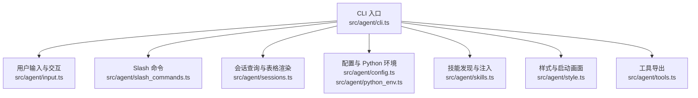
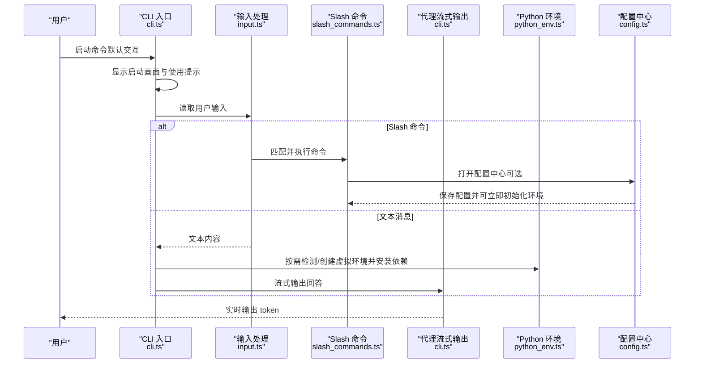
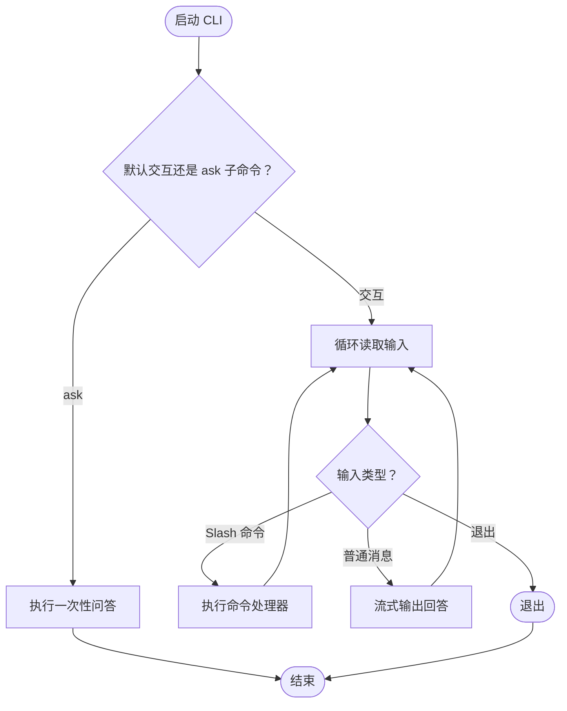
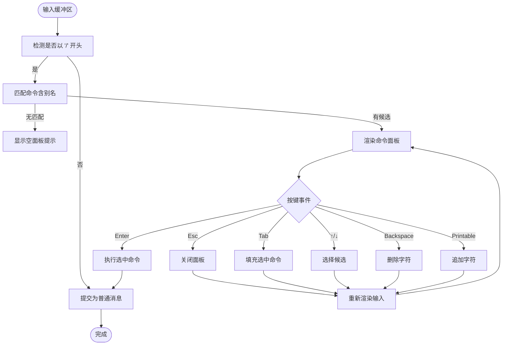
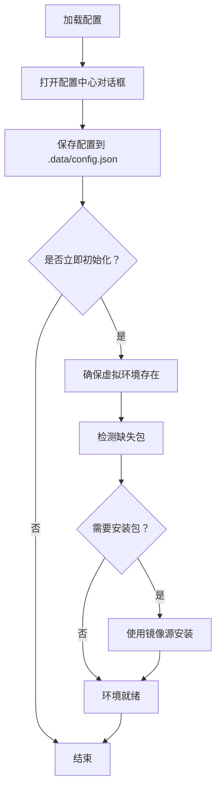
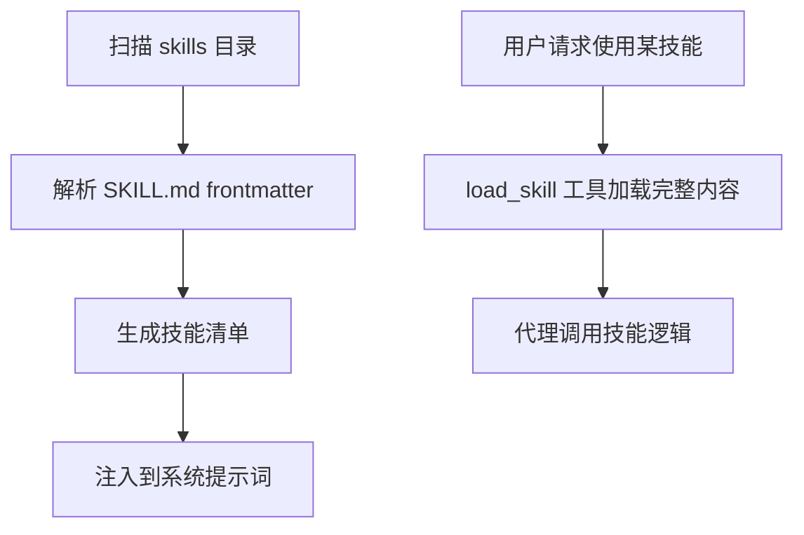
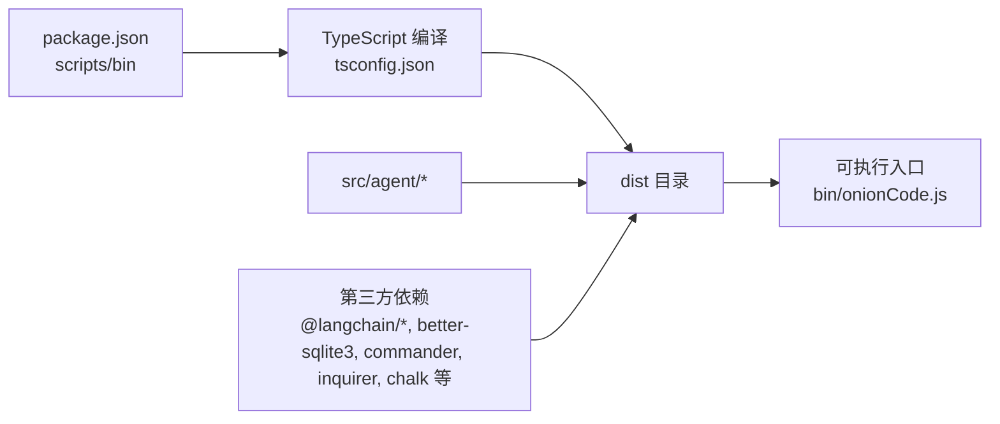

# 快速开始

<cite>
**本文引用的文件**
- [package.json](file://package.json)
- [tsconfig.json](file://tsconfig.json)
- [cli.ts](file://src/agent/cli.ts)
- [input.ts](file://src/agent/input.ts)
- [slash_commands.ts](file://src/agent/slash_commands.ts)
- [config.ts](file://src/agent/config.ts)
- [python_env.ts](file://src/agent/python_env.ts)
- [sessions.ts](file://src/agent/sessions.ts)
- [style.ts](file://src/agent/style.ts)
- [tools.ts](file://src/agent/tools.ts)
- [skills.ts](file://src/agent/skills.ts)
- [SKILL.md（planner）](file://src/agent/skills/planner/SKILL.md)
- [SKILL.md（pdf）](file://src/agent/skills/pdf/SKILL.md)
</cite>

## 目录
1. [简介](#简介)
2. [项目结构](#项目结构)
3. [核心组件](#核心组件)
4. [架构总览](#架构总览)
5. [详细组件解析](#详细组件解析)
6. [依赖关系分析](#依赖关系分析)
7. [性能与稳定性建议](#性能与稳定性建议)
8. [故障排查指南](#故障排查指南)
9. [结论](#结论)
10. [附录：常见操作清单](#附录常见操作清单)

## 简介
Onion Code 是一个基于 CLI 的智能体工具，支持工具调用、技能扩展、会话记忆与交互式对话。你可以通过命令行直接启动，进入交互式聊天；也可使用一次性问答命令快速获得结果。项目内置多种技能（如 PDF 处理、规划助手等），并通过 Python 虚拟环境管理数据分析类依赖。

## 项目结构
- 核心入口与 CLI：src/agent/cli.ts
- 用户输入与 Slash 命令：src/agent/input.ts、src/agent/slash_commands.ts
- 配置与 Python 环境：src/agent/config.ts、src/agent/python_env.ts
- 会话与持久化：src/agent/sessions.ts
- 技能发现与加载：src/agent/skills.ts
- 工具导出：src/agent/tools.ts
- 构建与类型配置：package.json、tsconfig.json
- 样例技能文档：src/agent/skills/*/SKILL.md



图表来源
- [cli.ts:1-186](file://src/agent/cli.ts#L1-L186)
- [input.ts:1-261](file://src/agent/input.ts#L1-L261)
- [slash_commands.ts:1-92](file://src/agent/slash_commands.ts#L1-L92)
- [config.ts:1-146](file://src/agent/config.ts#L1-L146)
- [python_env.ts:1-223](file://src/agent/python_env.ts#L1-L223)
- [sessions.ts:1-178](file://src/agent/sessions.ts#L1-L178)
- [style.ts:1-97](file://src/agent/style.ts#L1-L97)
- [tools.ts:1-10](file://src/agent/tools.ts#L1-L10)
- [skills.ts:1-139](file://src/agent/skills.ts#L1-L139)

章节来源
- [package.json:1-53](file://package.json#L1-L53)
- [tsconfig.json:1-20](file://tsconfig.json#L1-L20)

## 核心组件
- CLI 命令与默认行为：定义命令名称、描述、版本；提供 ask 单轮问答与交互式聊天两种模式。
- 交互式输入与补全：支持 TTY 下的增强输入、Slash 命令面板、上下键选择、Tab 补全、ESC 中断。
- Slash 命令：配置中心、会话浏览/回溯、新建会话、帮助、退出等。
- 配置与 Python 环境：默认 Python 虚拟环境路径、镜像源、自动安装策略；按需创建虚拟环境并安装常用数据包。
- 会话持久化：SQLite 检查点数据库，查询最近会话、渲染表格、按 thread_id 切换。
- 技能系统：扫描 skills 目录，解析 SKILL.md frontmatter，注入可用技能列表到系统提示词。
- 工具导出：统一导出搜索、文件读写、执行、JS/Python 运行、网页抓取/搜索、技能加载等工具。

章节来源
- [cli.ts:1-186](file://src/agent/cli.ts#L1-L186)
- [input.ts:1-261](file://src/agent/input.ts#L1-L261)
- [slash_commands.ts:1-92](file://src/agent/slash_commands.ts#L1-L92)
- [config.ts:1-146](file://src/agent/config.ts#L1-L146)
- [python_env.ts:1-223](file://src/agent/python_env.ts#L1-L223)
- [sessions.ts:1-178](file://src/agent/sessions.ts#L1-L178)
- [skills.ts:1-139](file://src/agent/skills.ts#L1-L139)
- [tools.ts:1-10](file://src/agent/tools.ts#L1-L10)

## 架构总览
下面的序列图展示了从启动到一次典型交互的关键流程。



图表来源
- [cli.ts:79-185](file://src/agent/cli.ts#L79-L185)
- [input.ts:138-260](file://src/agent/input.ts#L138-L260)
- [slash_commands.ts:21-77](file://src/agent/slash_commands.ts#L21-L77)
- [config.ts:71-145](file://src/agent/config.ts#L71-L145)
- [python_env.ts:161-170](file://src/agent/python_env.ts#L161-L170)

## 详细组件解析

### CLI 与交互式会话
- 默认行为：启动后进入交互式聊天循环，支持 ESC 中断当前输出。
- ask 子命令：一次性问答，适合快速验证能力。
- 错误格式化：针对常见错误（如认证失败、额度不足、超时、LangGraph 递归限制）提供友好提示。



图表来源
- [cli.ts:53-75](file://src/agent/cli.ts#L53-L75)
- [cli.ts:79-185](file://src/agent/cli.ts#L79-L185)

章节来源
- [cli.ts:1-186](file://src/agent/cli.ts#L1-L186)

### 输入与 Slash 命令
- TTY 增强输入：支持上下选择、Tab 补全、Ctrl+U 清空、Enter 执行、Esc 关闭面板。
- Slash 命令：以“/”开头，支持配置中心、会话浏览/回溯、新建会话、帮助、退出等。
- 命令匹配：前缀匹配与别名支持，高亮显示当前选中项。



图表来源
- [input.ts:138-260](file://src/agent/input.ts#L138-L260)
- [slash_commands.ts:79-91](file://src/agent/slash_commands.ts#L79-L91)

章节来源
- [input.ts:1-261](file://src/agent/input.ts#L1-L261)
- [slash_commands.ts:1-92](file://src/agent/slash_commands.ts#L1-L92)

### 配置与 Python 环境
- 默认配置：Python 虚拟环境路径、pip 镜像源、自动安装策略。
- 配置中心：交互式修改镜像源、自动安装开关，并可立即初始化环境。
- 环境准备：检测基础 Python、创建虚拟环境、检测缺失包并安装；支持按代码中导入语句动态推断所需包。



图表来源
- [config.ts:71-145](file://src/agent/config.ts#L71-L145)
- [python_env.ts:161-170](file://src/agent/python_env.ts#L161-L170)
- [python_env.ts:172-187](file://src/agent/python_env.ts#L172-L187)

章节来源
- [config.ts:1-146](file://src/agent/config.ts#L1-L146)
- [python_env.ts:1-223](file://src/agent/python_env.ts#L1-L223)

### 会话与历史记录
- 会话查询：从 SQLite 检查点数据库中提取最近 N 条会话，按活跃度排序。
- 表格渲染：输出包含 thread_id、最后用户输入、相对时间的表格。
- 会话回溯：通过 /rewind 切换到指定 thread_id 的历史会话。

```mermaid
sequenceDiagram
participant U as "用户"
participant SL as "Slash 命令"
participant SE as "会话查询<br/>sessions.ts"
participant DB as "SQLite 检查点"
U->>/sessions : 查看最近会话
SL->>SE : querySessions(20)
SE->>DB : 查询最近活跃的用户消息
DB-->>SE : 返回 rows
SE-->>SL : 解析并格式化为 SessionRow[]
SL-->>U : 渲染表格
U->>/rewind : 切换到指定 thread_id
SL->>SE : threadExists(threadId)
SE-->>SL : 存在/不存在
SL-->>U : 切换成功/失败提示
```

图表来源
- [slash_commands.ts:44-54](file://src/agent/slash_commands.ts#L44-L54)
- [sessions.ts:58-134](file://src/agent/sessions.ts#L58-L134)
- [sessions.ts:136-177](file://src/agent/sessions.ts#L136-L177)

章节来源
- [slash_commands.ts:1-92](file://src/agent/slash_commands.ts#L1-L92)
- [sessions.ts:1-178](file://src/agent/sessions.ts#L1-L178)

### 技能系统
- 发现与加载：遍历 skills 目录，解析 SKILL.md frontmatter，生成技能清单；按名称加载完整内容。
- 注入提示：将可用技能列表注入系统提示词，便于代理调用 load_skill 工具加载具体技能。



图表来源
- [skills.ts:53-83](file://src/agent/skills.ts#L53-L83)
- [skills.ts:90-118](file://src/agent/skills.ts#L90-L118)
- [skills.ts:124-138](file://src/agent/skills.ts#L124-L138)

章节来源
- [skills.ts:1-139](file://src/agent/skills.ts#L1-L139)
- [SKILL.md（planner）:1-91](file://src/agent/skills/planner/SKILL.md#L1-L91)
- [SKILL.md（pdf）:1-315](file://src/agent/skills/pdf/SKILL.md#L1-L315)

## 依赖关系分析
- 构建与运行：TypeScript 编译至 dist，构建脚本复制 skills 目录。
- CLI 入口：package.json 的 bin 指向可执行脚本，开发/运行脚本分别指向 TS 源或编译产物。
- 依赖生态：LangChain 生态（OpenAI、Tavily、LangGraph）、SQLite 检查点、命令行工具、终端美化与交互。



图表来源
- [package.json:13-17](file://package.json#L13-L17)
- [tsconfig.json:1-20](file://tsconfig.json#L1-L20)

章节来源
- [package.json:1-53](file://package.json#L1-L53)
- [tsconfig.json:1-20](file://tsconfig.json#L1-L20)

## 性能与稳定性建议
- 会话管理：合理使用 /sessions 与 /rewind，避免长时间无用会话占用存储。
- Python 环境：首次初始化可能较慢，建议在稳定网络环境下进行；可配置镜像源加速安装。
- 工具调用：大体量数据处理（如 PDF 表格提取）建议分批进行，避免单次请求过长。
- 超时与中断：遇到超时或长时间无响应，可使用 ESC 中断当前请求，稍后再试。

## 故障排查指南
- API Key 无效或未配置：检查环境变量中的 API Key 设置，确保与所用模型服务一致。
- 额度不足/429：账户余额不足或触发限流，检查服务端状态与配额。
- 内容安全拦截：某些平台的安全审查会拦截特定内容，尝试改写问题表述。
- LangGraph 递归限制：任务过于复杂导致步数超限，建议拆分为多个小步骤。
- 网络超时：检查本地网络连通性，必要时更换 DNS 或代理。
- Python 环境问题：确认已正确初始化虚拟环境并安装所需包；如自动安装被禁用，需手动安装。

章节来源
- [cli.ts:16-51](file://src/agent/cli.ts#L16-L51)
- [config.ts:71-145](file://src/agent/config.ts#L71-L145)
- [python_env.ts:134-159](file://src/agent/python_env.ts#L134-L159)

## 结论
通过本快速开始，你已经了解了 Onion Code 的安装方式、基本 CLI 使用方法、交互式工作流、配置与 Python 环境准备，以及如何使用样例技能。建议先完成环境初始化与 API Key 配置，然后尝试 ask 子命令与交互式聊天，逐步探索 Slash 命令与会话管理功能。

## 附录：常见操作清单
- 安装与构建
  - 安装依赖：使用包管理器安装项目依赖（构建脚本会复制技能目录）。
  - 构建产物：编译 TypeScript 并复制 skills 目录到 dist。
- 启动与使用
  - 交互式启动：直接运行 CLI，默认进入交互模式。
  - 一次性问答：使用 ask 子命令传入消息。
- 常用配置
  - 打开配置中心：/config，设置镜像源、自动安装策略，可立即初始化 Python 环境。
  - 查看会话：/sessions，查看最近 20 条会话。
  - 回溯会话：/rewind <thread_id>，切换到历史会话。
  - 新建会话：/new，生成新的 thread_id。
  - 帮助：/help，查看可用 Slash 命令。
  - 退出：/exit 或输入 exit。
- Python 环境
  - 自动检测基础 Python，创建虚拟环境，安装 pandas、numpy、openpyxl 等常用包。
  - 如代码中出现相关导入，将按需安装缺失包。
- 技能使用
  - 通过系统注入的技能列表了解可用能力，必要时使用 load_skill 工具加载具体技能内容。

章节来源
- [package.json:13-17](file://package.json#L13-L17)
- [cli.ts:53-75](file://src/agent/cli.ts#L53-L75)
- [slash_commands.ts:21-77](file://src/agent/slash_commands.ts#L21-L77)
- [config.ts:71-145](file://src/agent/config.ts#L71-L145)
- [python_env.ts:6-7](file://src/agent/python_env.ts#L6-L7)
- [python_env.ts:161-170](file://src/agent/python_env.ts#L161-L170)
- [skills.ts:124-138](file://src/agent/skills.ts#L124-L138)