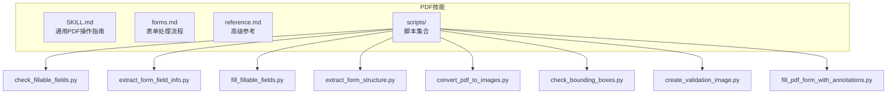
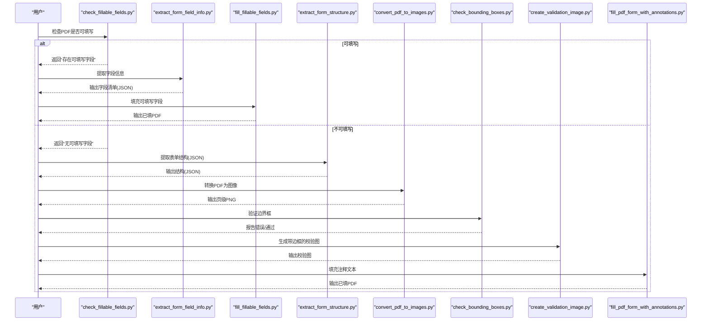
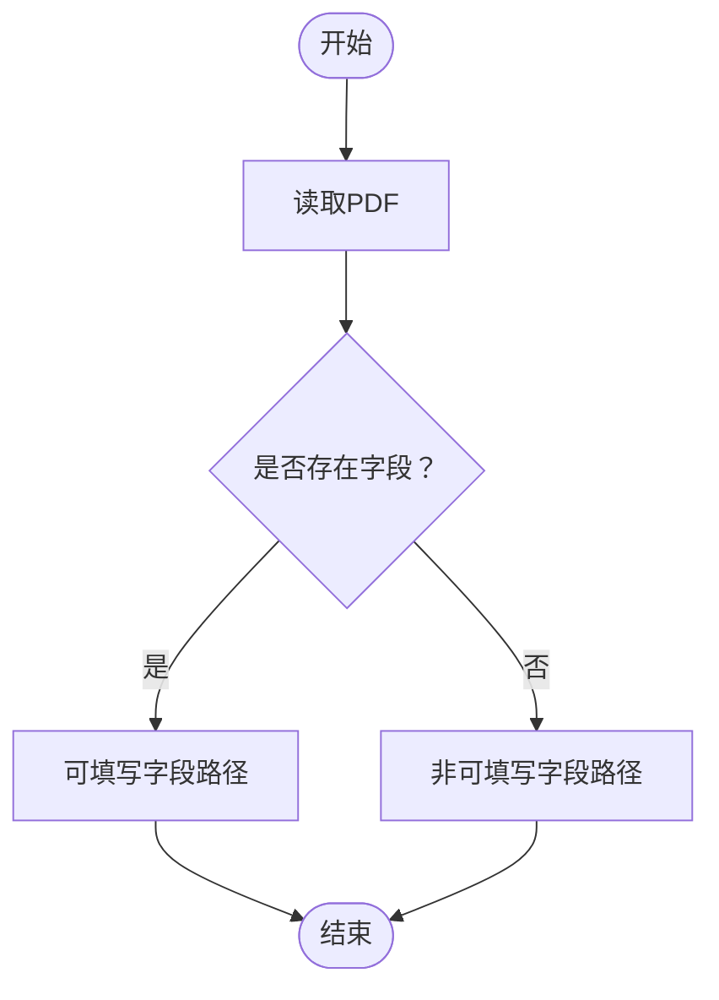
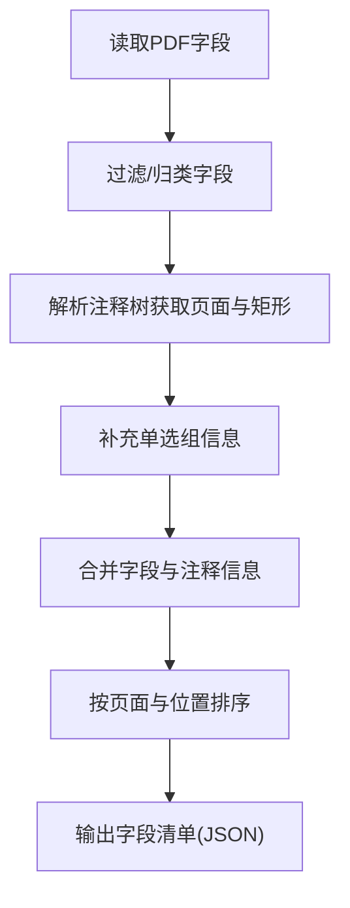
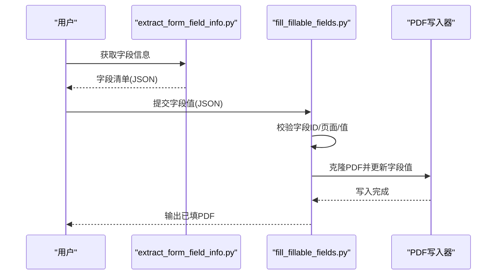
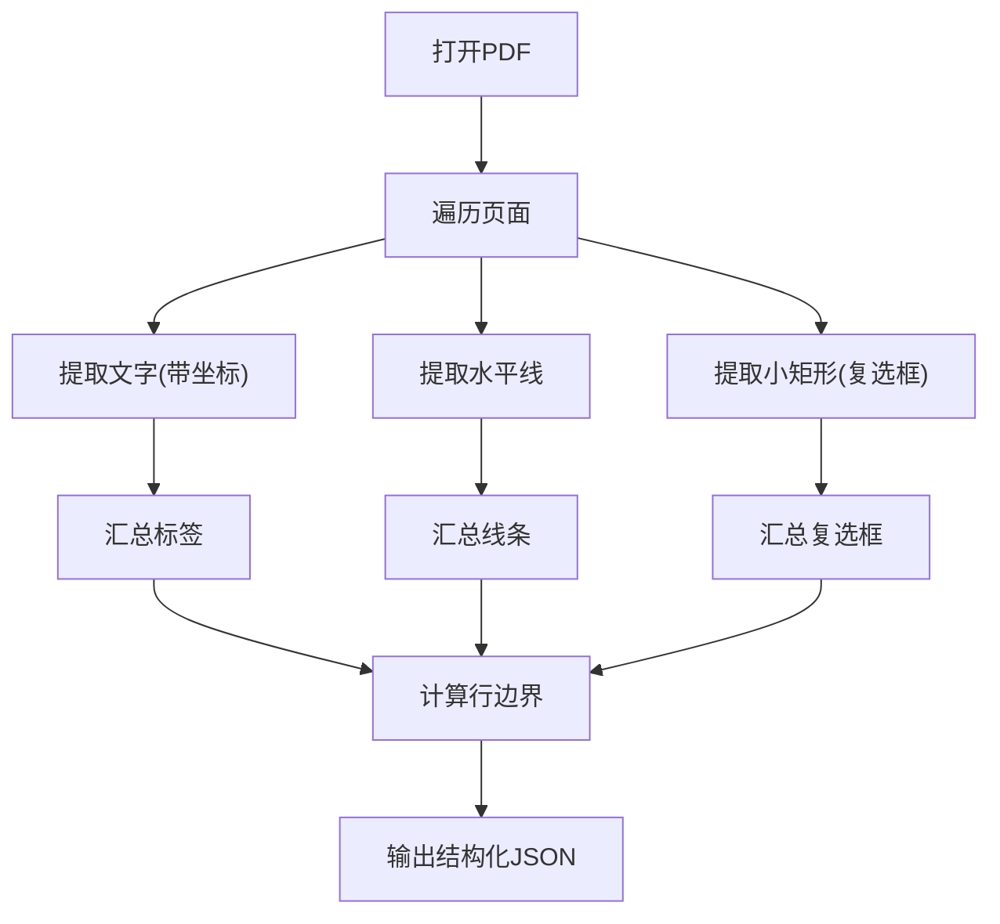
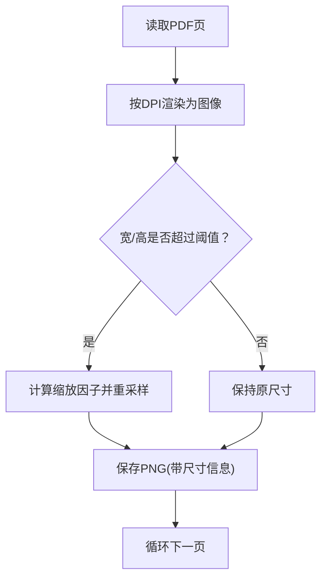
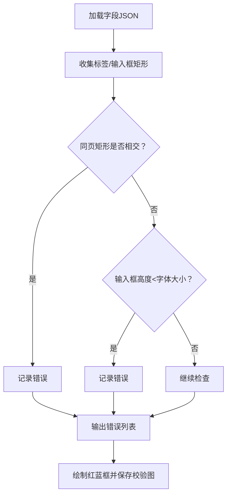
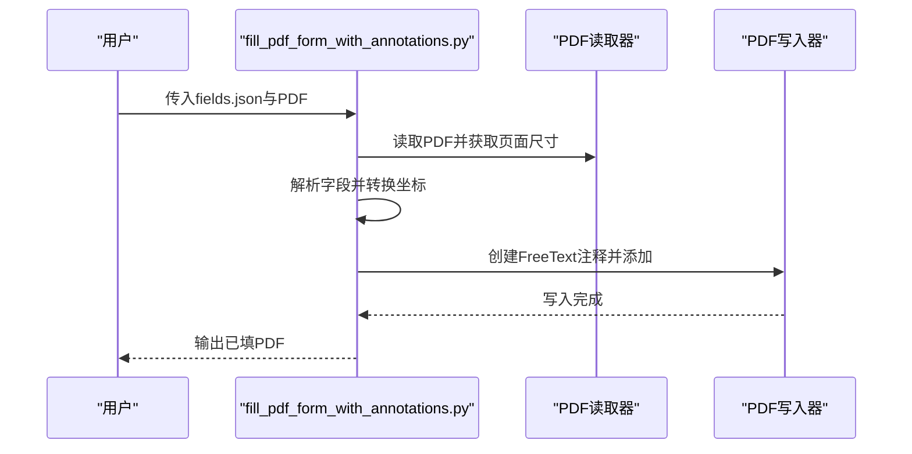
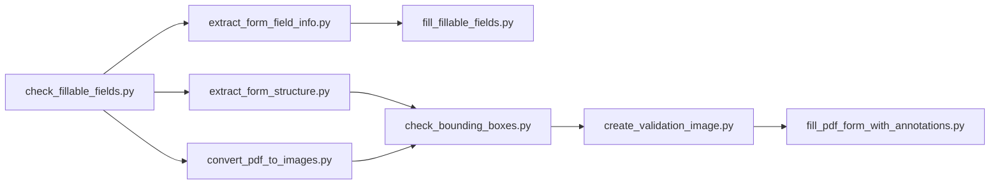

# PDF处理技能

<cite>
**本文引用的文件**
- [src/agent/skills/pdf/SKILL.md](file://src/agent/skills/pdf/SKILL.md)
- [src/agent/skills/pdf/forms.md](file://src/agent/skills/pdf/forms.md)
- [src/agent/skills/pdf/reference.md](file://src/agent/skills/pdf/reference.md)
- [src/agent/skills/pdf/scripts/check_fillable_fields.py](file://src/agent/skills/pdf/scripts/check_fillable_fields.py)
- [src/agent/skills/pdf/scripts/extract_form_field_info.py](file://src/agent/skills/pdf/scripts/extract_form_field_info.py)
- [src/agent/skills/pdf/scripts/fill_fillable_fields.py](file://src/agent/skills/pdf/scripts/fill_fillable_fields.py)
- [src/agent/skills/pdf/scripts/extract_form_structure.py](file://src/agent/skills/pdf/scripts/extract_form_structure.py)
- [src/agent/skills/pdf/scripts/convert_pdf_to_images.py](file://src/agent/skills/pdf/scripts/convert_pdf_to_images.py)
- [src/agent/skills/pdf/scripts/check_bounding_boxes.py](file://src/agent/skills/pdf/scripts/check_bounding_boxes.py)
- [src/agent/skills/pdf/scripts/create_validation_image.py](file://src/agent/skills/pdf/scripts/create_validation_image.py)
- [src/agent/skills/pdf/scripts/fill_pdf_form_with_annotations.py](file://src/agent/skills/pdf/scripts/fill_pdf_form_with_annotations.py)
- [package.json](file://package.json)
</cite>

## 目录
1. [简介](#简介)
2. [项目结构](#项目结构)
3. [核心组件](#核心组件)
4. [架构总览](#架构总览)
5. [详细组件分析](#详细组件分析)
6. [依赖关系分析](#依赖关系分析)
7. [性能考虑](#性能考虑)
8. [故障排查指南](#故障排查指南)
9. [结论](#结论)
10. [附录](#附录)

## 简介
本技能文档系统性阐述了PDF表单处理与注释填充的关键能力：可填写字段的自动检测、边界框验证与表单结构分析；PDF转图像的转换流程与图像质量优化策略；以及基于结构或视觉估计的表单字段信息提取与坐标定位技术。文档还提供了完整的注释填充工作流程（注释解析、位置计算与视觉效果保持），并给出实际使用步骤与常见问题解决方案。

## 项目结构
该技能以“脚本驱动 + 指南文档”的方式组织，核心由以下部分构成：
- 指南文档：SKILL.md（通用PDF操作）、forms.md（表单处理流程）、reference.md（高级参考）
- 脚本集合：位于 scripts/ 下，覆盖表单字段信息提取、结构提取、图像转换、边界框检查、注释填充等

图表来源
- [src/agent/skills/pdf/SKILL.md](file://src/agent/skills/pdf/SKILL.md)
- [src/agent/skills/pdf/forms.md](file://src/agent/skills/pdf/forms.md)
- [src/agent/skills/pdf/reference.md](file://src/agent/skills/pdf/reference.md)
- [src/agent/skills/pdf/scripts/check_fillable_fields.py](file://src/agent/skills/pdf/scripts/check_fillable_fields.py)
- [src/agent/skills/pdf/scripts/extract_form_field_info.py](file://src/agent/skills/pdf/scripts/extract_form_field_info.py)
- [src/agent/skills/pdf/scripts/fill_fillable_fields.py](file://src/agent/skills/pdf/scripts/fill_fillable_fields.py)
- [src/agent/skills/pdf/scripts/extract_form_structure.py](file://src/agent/skills/pdf/scripts/extract_form_structure.py)
- [src/agent/skills/pdf/scripts/convert_pdf_to_images.py](file://src/agent/skills/pdf/scripts/convert_pdf_to_images.py)
- [src/agent/skills/pdf/scripts/check_bounding_boxes.py](file://src/agent/skills/pdf/scripts/check_bounding_boxes.py)
- [src/agent/skills/pdf/scripts/create_validation_image.py](file://src/agent/skills/pdf/scripts/create_validation_image.py)
- [src/agent/skills/pdf/scripts/fill_pdf_form_with_annotations.py](file://src/agent/skills/pdf/scripts/fill_pdf_form_with_annotations.py)

章节来源
- [src/agent/skills/pdf/SKILL.md](file://src/agent/skills/pdf/SKILL.md)
- [src/agent/skills/pdf/forms.md](file://src/agent/skills/pdf/forms.md)
- [src/agent/skills/pdf/reference.md](file://src/agent/skills/pdf/reference.md)

## 核心组件
- 表单可填写性检测：通过读取PDF字段判断是否具备可填写表单，为后续流程提供分支依据
- 字段信息提取：解析PDF字段类型、页面、矩形坐标、选项值等，生成结构化字段清单
- 结构化表单提取：对非可填写PDF，从布局中抽取标签、横线、复选框等元素，构建字段坐标参考
- 图像转换与质量控制：将PDF按指定分辨率转为图像，并进行尺寸缩放与保存
- 边界框验证：检查标签/输入框交叠、输入框高度与字体大小匹配等
- 注释填充：根据字段坐标在PDF上添加自由文本注释，保持字体、字号、颜色一致
- 输出验证：将填充后的PDF转回图像，人工核验文本位置与排版

章节来源
- [src/agent/skills/pdf/scripts/check_fillable_fields.py](file://src/agent/skills/pdf/scripts/check_fillable_fields.py)
- [src/agent/skills/pdf/scripts/extract_form_field_info.py](file://src/agent/skills/pdf/scripts/extract_form_field_info.py)
- [src/agent/skills/pdf/scripts/extract_form_structure.py](file://src/agent/skills/pdf/scripts/extract_form_structure.py)
- [src/agent/skills/pdf/scripts/convert_pdf_to_images.py](file://src/agent/skills/pdf/scripts/convert_pdf_to_images.py)
- [src/agent/skills/pdf/scripts/check_bounding_boxes.py](file://src/agent/skills/pdf/scripts/check_bounding_boxes.py)
- [src/agent/skills/pdf/scripts/fill_pdf_form_with_annotations.py](file://src/agent/skills/pdf/scripts/fill_pdf_form_with_annotations.py)

## 架构总览
下图展示了从PDF到注释填充的端到端流程，涵盖可填写字段与非可填写字段两条路径：

图表来源
- [src/agent/skills/pdf/scripts/check_fillable_fields.py](file://src/agent/skills/pdf/scripts/check_fillable_fields.py)
- [src/agent/skills/pdf/scripts/extract_form_field_info.py](file://src/agent/skills/pdf/scripts/extract_form_field_info.py)
- [src/agent/skills/pdf/scripts/fill_fillable_fields.py](file://src/agent/skills/pdf/scripts/fill_fillable_fields.py)
- [src/agent/skills/pdf/scripts/extract_form_structure.py](file://src/agent/skills/pdf/scripts/extract_form_structure.py)
- [src/agent/skills/pdf/scripts/convert_pdf_to_images.py](file://src/agent/skills/pdf/scripts/convert_pdf_to_images.py)
- [src/agent/skills/pdf/scripts/check_bounding_boxes.py](file://src/agent/skills/pdf/scripts/check_bounding_boxes.py)
- [src/agent/skills/pdf/scripts/create_validation_image.py](file://src/agent/skills/pdf/scripts/create_validation_image.py)
- [src/agent/skills/pdf/scripts/fill_pdf_form_with_annotations.py](file://src/agent/skills/pdf/scripts/fill_pdf_form_with_annotations.py)

## 详细组件分析

### 组件A：可填写字段检测
- 功能：读取PDF并调用底层库接口获取字段，判断是否存在可填写表单
- 关键点：作为流程入口，决定后续采用“可填写字段填充”还是“注释填充”路径
- 使用建议：先执行此脚本，再进行下一步

图表来源
- [src/agent/skills/pdf/scripts/check_fillable_fields.py](file://src/agent/skills/pdf/scripts/check_fillable_fields.py)

章节来源
- [src/agent/skills/pdf/scripts/check_fillable_fields.py](file://src/agent/skills/pdf/scripts/check_fillable_fields.py)

### 组件B：字段信息提取（可填写字段）
- 功能：解析PDF字段类型（文本、复选框、选择框、单选组）、页面、矩形坐标、选项值等
- 复杂度：O(N)（N为字段数量），排序与注释关联为次要开销
- 错误处理：无法确定位置的字段会被忽略并提示
- 输出：按页面与位置排序的字段列表，供后续填充使用

图表来源
- [src/agent/skills/pdf/scripts/extract_form_field_info.py](file://src/agent/skills/pdf/scripts/extract_form_field_info.py)

章节来源
- [src/agent/skills/pdf/scripts/extract_form_field_info.py](file://src/agent/skills/pdf/scripts/extract_form_field_info.py)

### 组件C：可填写字段填充
- 功能：校验字段ID与页面一致性、值的有效性（含复选/单选/选择框），写入表单值并生成新PDF
- 关键点：值有效性检查、页面一致性检查、NeedAppearances标志设置
- 兼容性：内置对底层库返回选项格式的修补逻辑

图表来源
- [src/agent/skills/pdf/scripts/fill_fillable_fields.py](file://src/agent/skills/pdf/scripts/fill_fillable_fields.py)
- [src/agent/skills/pdf/scripts/extract_form_field_info.py](file://src/agent/skills/pdf/scripts/extract_form_field_info.py)

章节来源
- [src/agent/skills/pdf/scripts/fill_fillable_fields.py](file://src/agent/skills/pdf/scripts/fill_fillable_fields.py)

### 组件D：非可填写字段的结构化提取
- 功能：使用布局分析工具抽取文本标签、水平线、小矩形（复选框）等，形成结构化坐标
- 输出：包含页面尺寸、标签、线条、复选框、行边界等信息的JSON
- 应用：为“注释填充”提供精确的PDF坐标参考

图表来源
- [src/agent/skills/pdf/scripts/extract_form_structure.py](file://src/agent/skills/pdf/scripts/extract_form_structure.py)

章节来源
- [src/agent/skills/pdf/scripts/extract_form_structure.py](file://src/agent/skills/pdf/scripts/extract_form_structure.py)

### 组件E：PDF转图像与质量优化
- 功能：将每一页渲染为高分辨率图像，按最大边长进行缩放，保存为PNG
- 参数：默认DPI与最大边长阈值
- 输出：按页命名的PNG图像，便于人工核验与注释定位

图表来源
- [src/agent/skills/pdf/scripts/convert_pdf_to_images.py](file://src/agent/skills/pdf/scripts/convert_pdf_to_images.py)

章节来源
- [src/agent/skills/pdf/scripts/convert_pdf_to_images.py](file://src/agent/skills/pdf/scripts/convert_pdf_to_images.py)

### 组件F：边界框验证与可视化
- 功能：检查标签/输入框交叠、输入框高度与字体大小匹配；生成带红蓝框的校验图
- 输入：fields.json、页号、原始图像
- 输出：标注后的图像，便于人工复查

图表来源
- [src/agent/skills/pdf/scripts/check_bounding_boxes.py](file://src/agent/skills/pdf/scripts/check_bounding_boxes.py)
- [src/agent/skills/pdf/scripts/create_validation_image.py](file://src/agent/skills/pdf/scripts/create_validation_image.py)

章节来源
- [src/agent/skills/pdf/scripts/check_bounding_boxes.py](file://src/agent/skills/pdf/scripts/check_bounding_boxes.py)
- [src/agent/skills/pdf/scripts/create_validation_image.py](file://src/agent/skills/pdf/scripts/create_validation_image.py)

### 组件G：注释填充（自由文本注释）
- 功能：根据字段坐标在PDF上添加FreeText注释，支持字体、字号、颜色
- 坐标转换：支持直接PDF坐标或图像坐标，自动换算
- 输出：带注释的新PDF

图表来源
- [src/agent/skills/pdf/scripts/fill_pdf_form_with_annotations.py](file://src/agent/skills/pdf/scripts/fill_pdf_form_with_annotations.py)

章节来源
- [src/agent/skills/pdf/scripts/fill_pdf_form_with_annotations.py](file://src/agent/skills/pdf/scripts/fill_pdf_form_with_annotations.py)

## 依赖关系分析
- 脚本间耦合
  - 可填写字段路径：check_fillable_fields.py → extract_form_field_info.py → fill_fillable_fields.py
  - 注释填充路径：check_fillable_fields.py → extract_form_structure.py/convert_pdf_to_images.py → check_bounding_boxes.py → create_validation_image.py → fill_pdf_form_with_annotations.py
- 外部依赖
  - pypdf：PDF读写、字段与注释操作
  - pdfplumber：非可填写PDF的结构化布局提取
  - pdf2image/Pillow：图像转换与绘制
  - 命令行工具：poppler-utils（pdftotext/pdftoppm/pdfimages）、qpdf（高级PDF操作）

图表来源
- [src/agent/skills/pdf/scripts/check_fillable_fields.py](file://src/agent/skills/pdf/scripts/check_fillable_fields.py)
- [src/agent/skills/pdf/scripts/extract_form_field_info.py](file://src/agent/skills/pdf/scripts/extract_form_field_info.py)
- [src/agent/skills/pdf/scripts/fill_fillable_fields.py](file://src/agent/skills/pdf/scripts/fill_fillable_fields.py)
- [src/agent/skills/pdf/scripts/extract_form_structure.py](file://src/agent/skills/pdf/scripts/extract_form_structure.py)
- [src/agent/skills/pdf/scripts/convert_pdf_to_images.py](file://src/agent/skills/pdf/scripts/convert_pdf_to_images.py)
- [src/agent/skills/pdf/scripts/check_bounding_boxes.py](file://src/agent/skills/pdf/scripts/check_bounding_boxes.py)
- [src/agent/skills/pdf/scripts/create_validation_image.py](file://src/agent/skills/pdf/scripts/create_validation_image.py)
- [src/agent/skills/pdf/scripts/fill_pdf_form_with_annotations.py](file://src/agent/skills/pdf/scripts/fill_pdf_form_with_annotations.py)

章节来源
- [src/agent/skills/pdf/scripts/check_fillable_fields.py](file://src/agent/skills/pdf/scripts/check_fillable_fields.py)
- [src/agent/skills/pdf/scripts/extract_form_field_info.py](file://src/agent/skills/pdf/scripts/extract_form_field_info.py)
- [src/agent/skills/pdf/scripts/fill_fillable_fields.py](file://src/agent/skills/pdf/scripts/fill_fillable_fields.py)
- [src/agent/skills/pdf/scripts/extract_form_structure.py](file://src/agent/skills/pdf/scripts/extract_form_structure.py)
- [src/agent/skills/pdf/scripts/convert_pdf_to_images.py](file://src/agent/skills/pdf/scripts/convert_pdf_to_images.py)
- [src/agent/skills/pdf/scripts/check_bounding_boxes.py](file://src/agent/skills/pdf/scripts/check_bounding_boxes.py)
- [src/agent/skills/pdf/scripts/create_validation_image.py](file://src/agent/skills/pdf/scripts/create_validation_image.py)
- [src/agent/skills/pdf/scripts/fill_pdf_form_with_annotations.py](file://src/agent/skills/pdf/scripts/fill_pdf_form_with_annotations.py)

## 性能考虑
- 大PDF分块处理：按页或固定块数分批处理，避免一次性加载
- 渲染分辨率权衡：图像转PDF时，优先使用适中的DPI，必要时再提高分辨率
- 布局提取优化：仅在需要时启用高精度模式，减少不必要的计算
- I/O吞吐：批量导出图像时，尽量并行写入磁盘
- 字体与注释：注释填充时统一字体与字号，减少渲染差异带来的误差

## 故障排查指南
- 字段ID无效或页面不匹配
  - 现象：填充脚本报错并终止
  - 排查：确认字段ID与页面号与提取结果一致，修正后重试
- 输入框高度过小导致文字截断
  - 现象：边界框检查报错
  - 排查：增大输入框高度或减小字体大小
- 注释位置偏移
  - 现象：注释出现在错误位置
  - 排查：确认fields.json中使用的是PDF坐标还是图像坐标；若为图像坐标，确保图像尺寸与PDF尺寸一致
- 图像核验不准确
  - 现象：人工核验时位置偏差
  - 排查：重新生成校验图，检查坐标转换逻辑与缩放比例

章节来源
- [src/agent/skills/pdf/scripts/fill_fillable_fields.py](file://src/agent/skills/pdf/scripts/fill_fillable_fields.py)
- [src/agent/skills/pdf/scripts/check_bounding_boxes.py](file://src/agent/skills/pdf/scripts/check_bounding_boxes.py)
- [src/agent/skills/pdf/scripts/fill_pdf_form_with_annotations.py](file://src/agent/skills/pdf/scripts/fill_pdf_form_with_annotations.py)

## 结论
本技能通过“可填写字段路径”与“注释填充路径”双轨并行，实现了从字段识别、结构提取、图像转换、边界框验证到注释填充的全链路自动化。结合指南文档与脚本工具，用户可以高效地完成复杂PDF表单的自动处理与质量保证。

## 附录
- 实际使用示例（步骤说明）
  - 可填写字段路径
    1) 检查PDF可填写性：运行可填写字段检测脚本
    2) 提取字段信息：运行字段信息提取脚本，得到字段清单
    3) 准备字段值：编写字段值JSON（包含字段ID、页面、值）
    4) 填充可填写字段：运行可填写字段填充脚本，生成已填PDF
  - 注释填充路径
    1) 检查PDF可填写性：运行可填写字段检测脚本
    2) 提取表单结构或转换图像：结构路径使用结构提取脚本；图像路径使用图像转换脚本
    3) 生成fields.json：基于结构或图像估计生成字段坐标与文本
    4) 边界框验证：运行边界框检查脚本，修复问题
    5) 生成校验图：运行校验图生成脚本，人工复核
    6) 注释填充：运行注释填充脚本，生成已填PDF
- 常见问题
  - 字段ID不匹配：核对字段清单与字段值JSON
  - 坐标系统混淆：统一使用PDF坐标或正确转换图像坐标
  - 字体与框高不匹配：调整输入框高度或字体大小

章节来源
- [src/agent/skills/pdf/forms.md](file://src/agent/skills/pdf/forms.md)
- [src/agent/skills/pdf/reference.md](file://src/agent/skills/pdf/reference.md)
- [package.json](file://package.json)