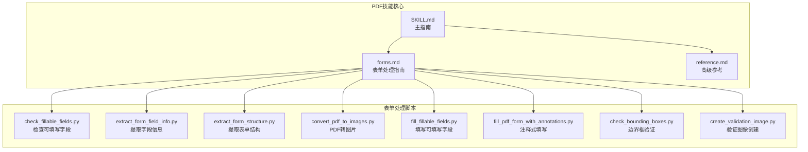
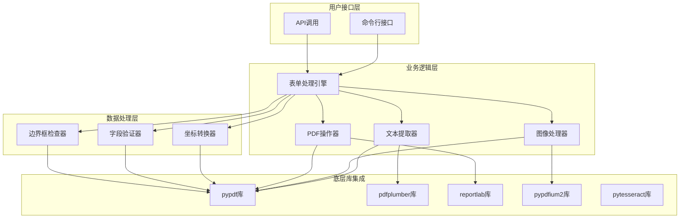
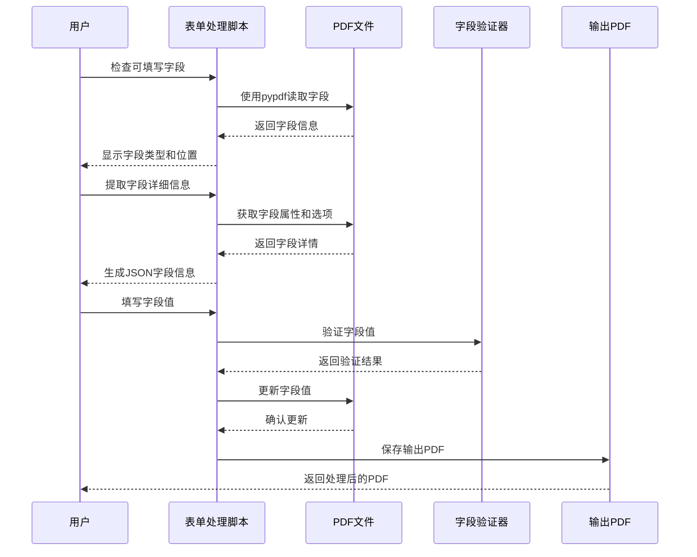
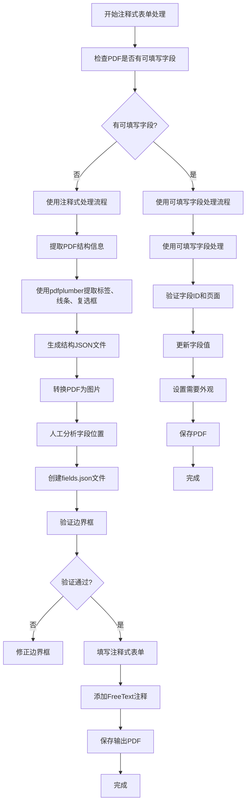
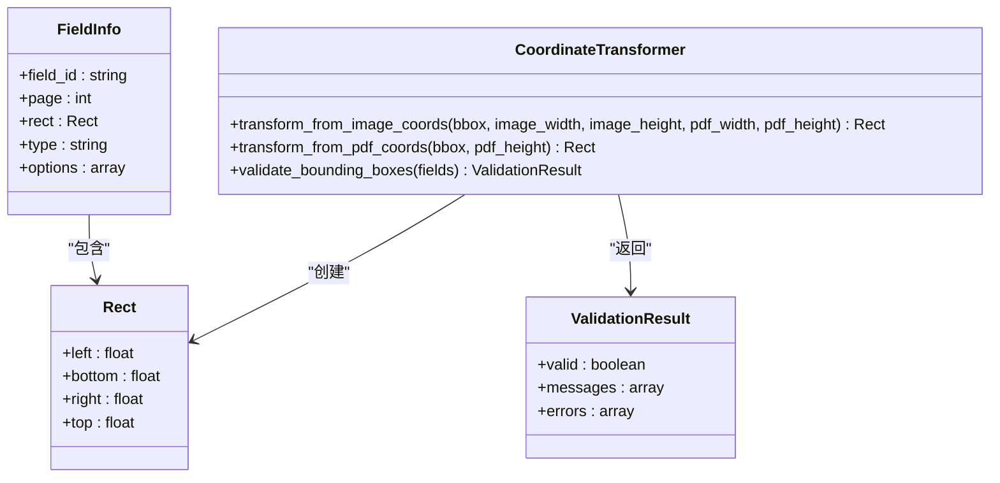
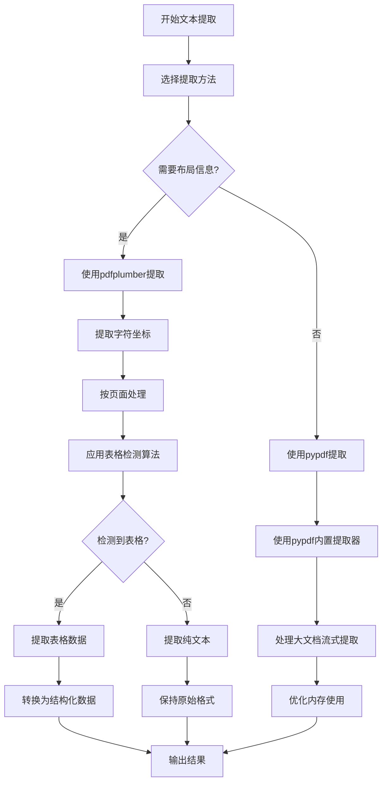
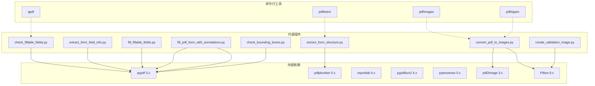

# PDF处理技能

<cite>
**本文档引用的文件**
- [SKILL.md](file://src/agent/skills/pdf/SKILL.md)
- [forms.md](file://src/agent/skills/pdf/forms.md)
- [reference.md](file://src/agent/skills/pdf/reference.md)
- [check_fillable_fields.py](file://src/agent/skills/pdf/scripts/check_fillable_fields.py)
- [extract_form_field_info.py](file://src/agent/skills/pdf/scripts/extract_form_field_info.py)
- [extract_form_structure.py](file://src/agent/skills/pdf/scripts/extract_form_structure.py)
- [convert_pdf_to_images.py](file://src/agent/skills/pdf/scripts/convert_pdf_to_images.py)
- [fill_fillable_fields.py](file://src/agent/skills/pdf/scripts/fill_fillable_fields.py)
- [fill_pdf_form_with_annotations.py](file://src/agent/skills/pdf/scripts/fill_pdf_form_with_annotations.py)
- [check_bounding_boxes.py](file://src/agent/skills/pdf/scripts/check_bounding_boxes.py)
- [create_validation_image.py](file://src/agent/skills/pdf/scripts/create_validation_image.py)
- [skills-lock.json](file://skills-lock.json)
</cite>

## 目录
1. [简介](#简介)
2. [项目结构](#项目结构)
3. [核心组件](#核心组件)
4. [架构概览](#架构概览)
5. [详细组件分析](#详细组件分析)
6. [依赖关系分析](#依赖关系分析)
7. [性能考虑](#性能考虑)
8. [故障排除指南](#故障排除指南)
9. [结论](#结论)

## 简介

PDF处理技能是一个综合性的PDF操作工具集，专为在各种场景下处理PDF文件而设计。该技能支持从基础的PDF合并、拆分、旋转等操作，到高级的表单填写、OCR识别、图像提取等功能。

该技能的核心价值在于提供了一套完整的PDF处理解决方案，包括：
- 基础PDF操作：合并、拆分、旋转、加密解密
- 高级文本处理：布局感知文本提取、表格识别
- 表单处理：可填写表单字段识别与填充、注释式表单填写
- 图像处理：PDF转图片、嵌入图像提取
- OCR支持：扫描版PDF的文字识别

## 项目结构

该项目采用模块化设计，将PDF处理功能分为多个专门的脚本和文档：

**图表来源**
- [SKILL.md:1-315](file://src/agent/skills/pdf/SKILL.md#L1-L315)
- [forms.md:1-295](file://src/agent/skills/pdf/forms.md#L1-L295)

**章节来源**
- [SKILL.md:1-315](file://src/agent/skills/pdf/SKILL.md#L1-L315)
- [forms.md:1-295](file://src/agent/skills/pdf/forms.md#L1-L295)

## 核心组件

### 主要功能模块

PDF处理技能包含以下核心功能模块：

#### 1. 基础PDF操作
- **合并PDF**：使用pypdf库将多个PDF文件合并为一个
- **拆分PDF**：按页面拆分单个PDF文件
- **页面旋转**：支持90度倍数的页面旋转
- **元数据提取**：获取PDF的标题、作者、主题等信息

#### 2. 文本和表格处理
- **布局感知文本提取**：使用pdfplumber保持原始布局
- **表格识别**：自动检测和提取PDF中的表格数据
- **OCR支持**：对扫描版PDF进行文字识别

#### 3. 表单处理系统
- **可填写字段识别**：自动检测PDF中的可填写表单字段
- **注释式表单填写**：通过PDF注释实现非可填写表单的文本输入
- **坐标系统转换**：支持PDF坐标和图像坐标的双向转换

#### 4. 高级功能
- **PDF创建**：使用reportlab库从头创建PDF文档
- **水印添加**：在PDF上添加水印
- **图像提取**：从PDF中提取嵌入的图片
- **密码保护**：为PDF文件添加密码保护

**章节来源**
- [SKILL.md:28-315](file://src/agent/skills/pdf/SKILL.md#L28-L315)
- [reference.md:1-612](file://src/agent/skills/pdf/reference.md#L1-L612)

## 架构概览

PDF处理技能采用分层架构设计，从底层的Python库操作到高层的用户界面：

**图表来源**
- [SKILL.md:1-315](file://src/agent/skills/pdf/SKILL.md#L1-L315)
- [reference.md:1-612](file://src/agent/skills/pdf/reference.md#L1-L612)

## 详细组件分析

### 表单处理工作流程

表单处理是PDF技能的核心功能，采用两种不同的处理策略：

#### 可填写表单处理流程

**图表来源**
- [check_fillable_fields.py:1-12](file://src/agent/skills/pdf/scripts/check_fillable_fields.py#L1-L12)
- [extract_form_field_info.py:1-123](file://src/agent/skills/pdf/scripts/extract_form_field_info.py#L1-L123)
- [fill_fillable_fields.py:1-99](file://src/agent/skills/pdf/scripts/fill_fillable_fields.py#L1-L99)

#### 注释式表单处理流程

**图表来源**
- [forms.md:1-295](file://src/agent/skills/pdf/forms.md#L1-L295)
- [extract_form_structure.py:1-116](file://src/agent/skills/pdf/scripts/extract_form_structure.py#L1-L116)
- [convert_pdf_to_images.py:1-34](file://src/agent/skills/pdf/scripts/convert_pdf_to_images.py#L1-L34)
- [fill_pdf_form_with_annotations.py:1-108](file://src/agent/skills/pdf/scripts/fill_pdf_form_with_annotations.py#L1-L108)

### 坐标系统转换机制

表单处理涉及复杂的坐标系统转换，支持PDF坐标和图像坐标的互换：

**图表来源**
- [fill_pdf_form_with_annotations.py:10-31](file://src/agent/skills/pdf/scripts/fill_pdf_form_with_annotations.py#L10-L31)
- [check_bounding_boxes.py:8-56](file://src/agent/skills/pdf/scripts/check_bounding_boxes.py#L8-L56)

**章节来源**
- [forms.md:120-295](file://src/agent/skills/pdf/forms.md#L120-L295)
- [fill_pdf_form_with_annotations.py:1-108](file://src/agent/skills/pdf/scripts/fill_pdf_form_with_annotations.py#L1-L108)
- [check_bounding_boxes.py:1-66](file://src/agent/skills/pdf/scripts/check_bounding_boxes.py#L1-L66)

### 文本提取和表格处理

文本提取功能提供了多种精度级别的处理方式：

#### 高级文本提取流程

**图表来源**
- [reference.md:345-383](file://src/agent/skills/pdf/reference.md#L345-L383)
- [SKILL.md:79-120](file://src/agent/skills/pdf/SKILL.md#L79-L120)

**章节来源**
- [reference.md:345-424](file://src/agent/skills/pdf/reference.md#L345-L424)
- [SKILL.md:79-120](file://src/agent/skills/pdf/SKILL.md#L79-L120)

## 依赖关系分析

PDF处理技能的依赖关系体现了清晰的分层架构：

**图表来源**
- [reference.md:603-612](file://src/agent/skills/pdf/reference.md#L603-L612)
- [SKILL.md:189-230](file://src/agent/skills/pdf/SKILL.md#L189-L230)

**章节来源**
- [reference.md:603-612](file://src/agent/skills/pdf/reference.md#L603-L612)
- [skills-lock.json:1-12](file://skills-lock.json#L1-L12)

## 性能考虑

PDF处理技能在设计时充分考虑了性能优化：

### 内存管理策略
- **流式处理**：对于大型PDF文件，采用分块处理方式，避免一次性加载整个文件
- **渐进式提取**：文本和图像提取采用逐步处理，减少内存占用
- **智能缓存**：对重复使用的中间结果进行缓存

### 处理效率优化
- **并行处理**：多页PDF的处理可以并行执行
- **增量更新**：只更新必要的页面和字段
- **预编译正则表达式**：对于复杂的文本匹配使用预编译模式

### 资源优化
- **图像质量平衡**：根据用途调整图像分辨率
- **压缩策略**：在保证质量的前提下进行适当的压缩
- **临时文件管理**：合理管理中间文件的创建和清理

## 故障排除指南

### 常见问题及解决方案

#### 表单处理问题
1. **字段ID不匹配**
   - 检查字段ID是否正确
   - 验证字段页面编号
   - 确认字段类型兼容性

2. **边界框错误**
   - 使用边界框验证脚本检查坐标
   - 确保字段高度大于字体大小
   - 避免字段重叠

#### 文本提取问题
1. **布局信息丢失**
   - 使用pdfplumber替代pypdf进行布局提取
   - 检查PDF的编码格式
   - 对于扫描版PDF启用OCR

2. **表格识别失败**
   - 调整表格检测参数
   - 手动指定表格区域
   - 使用更精确的坐标定位

#### 图像处理问题
1. **图像质量差**
   - 提高DPI设置
   - 使用高质量转换参数
   - 检查原始PDF质量

2. **内存不足**
   - 分批处理大文件
   - 降低图像分辨率
   - 清理临时文件

**章节来源**
- [check_bounding_boxes.py:15-56](file://src/agent/skills/pdf/scripts/check_bounding_boxes.py#L15-L56)
- [reference.md:567-601](file://src/agent/skills/pdf/reference.md#L567-L601)

## 结论

PDF处理技能提供了一个全面而强大的PDF操作解决方案。其设计特点包括：

### 技术优势
- **模块化设计**：功能清晰分离，便于维护和扩展
- **双路径处理**：同时支持可填写字段和注释式表单处理
- **坐标系统灵活**：支持PDF坐标和图像坐标的无缝转换
- **性能优化**：针对大文件和复杂操作进行了专门优化

### 应用价值
- **自动化程度高**：减少人工干预，提高处理效率
- **准确性强**：通过多重验证确保处理结果的准确性
- **适应性强**：能够处理各种类型的PDF文件和场景
- **易于集成**：提供清晰的API和脚本接口

该技能特别适用于需要批量处理PDF文件的企业应用场景，如文档管理系统、数据提取服务、电子政务平台等。通过合理的配置和参数调整，可以满足大多数PDF处理需求。