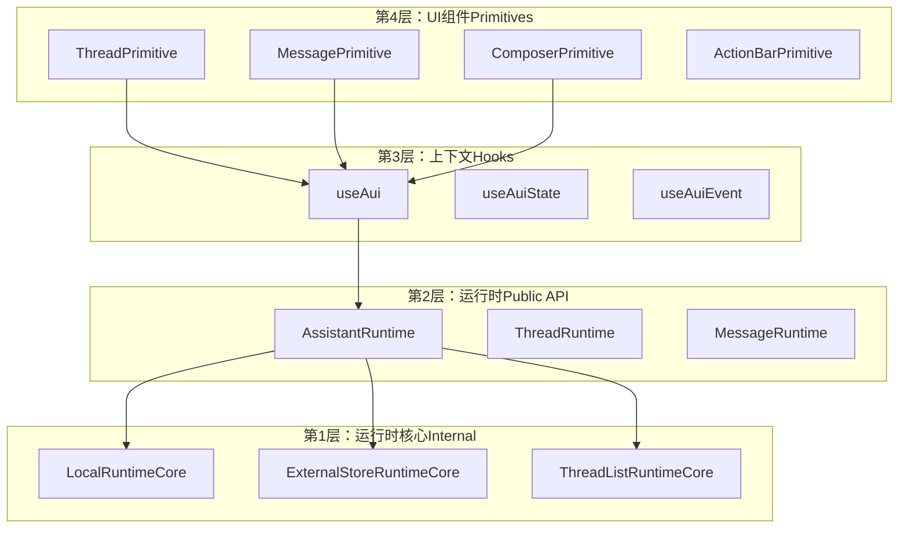
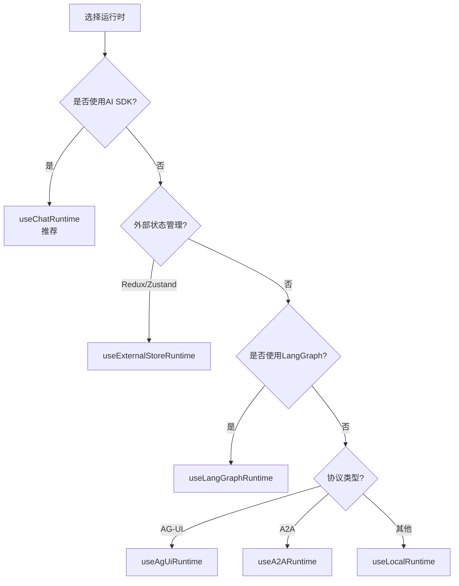
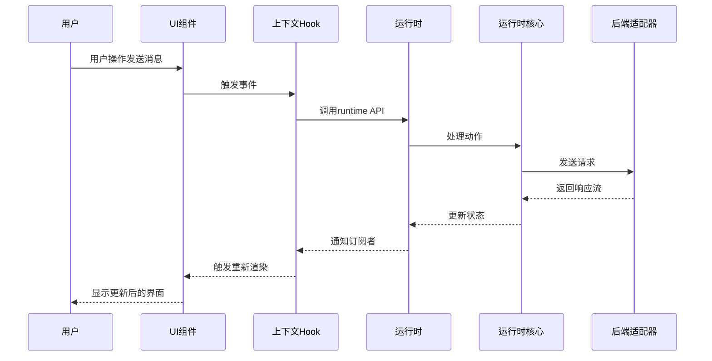
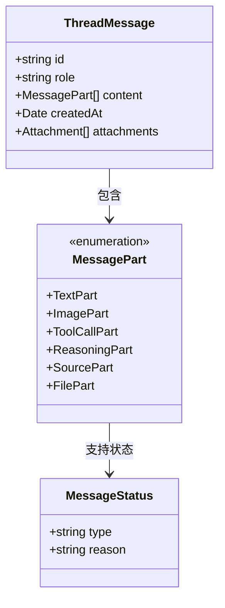
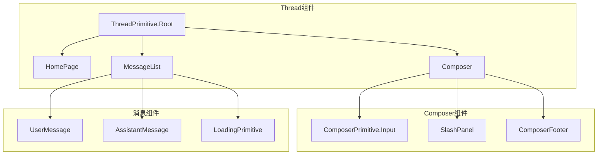
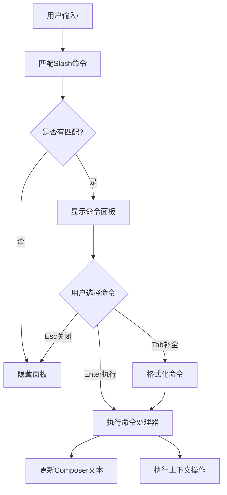
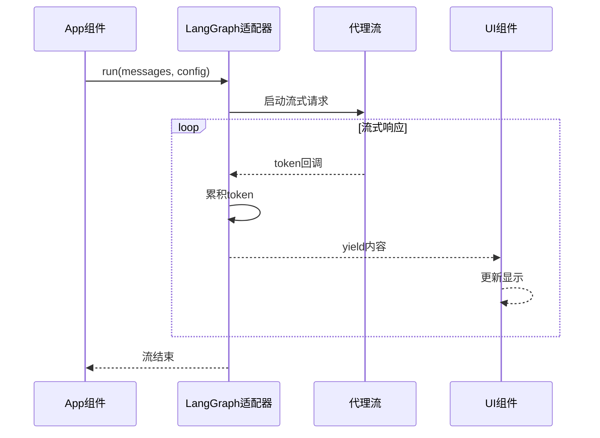
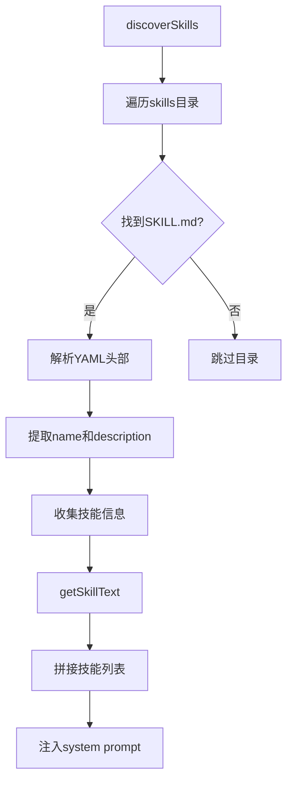
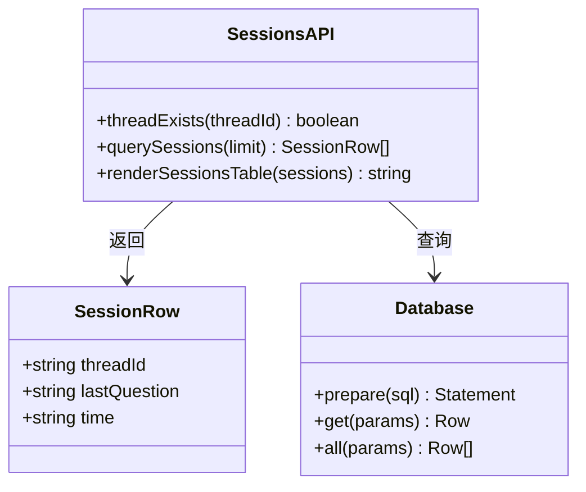

# assistant-ui 技能系统

<cite>
**本文档引用的文件**
- [SKILL.md](file://.agents/skills/assistant-ui/SKILL.md)
- [architecture.md](file://.agents/skills/assistant-ui/references/architecture.md)
- [packages.md](file://.agents/skills/assistant-ui/references/packages.md)
- [App.tsx](file://src/agent/ui/App.tsx)
- [Thread.tsx](file://src/agent/ui/Thread.tsx)
- [SlashPanel.tsx](file://src/agent/ui/SlashPanel.tsx)
- [adapter.ts](file://src/agent/ui/adapter.ts)
- [slash_commands.ts](file://src/agent/slash_commands.ts)
- [agent.ts](file://src/agent/agent.ts)
- [config.ts](file://src/agent/config.ts)
- [skills.ts](file://src/agent/skills.ts)
- [tools.ts](file://src/agent/tools.ts)
- [sessions.ts](file://src/agent/sessions.ts)
</cite>

## 目录
1. [简介](#简介)
2. [项目结构](#项目结构)
3. [核心组件](#核心组件)
4. [架构概览](#架构概览)
5. [详细组件分析](#详细组件分析)
6. [依赖关系分析](#依赖关系分析)
7. [性能考虑](#性能考虑)
8. [故障排除指南](#故障排除指南)
9. [结论](#结论)

## 简介

assistant-ui 技能系统是一个基于 React 的 AI 聊天界面构建库，专注于提供可组合的 UI 原语和强大的状态管理能力。该系统采用分层架构设计，通过 `@assistant-ui/react` 核心包和多种适配器包，实现了高度可定制的聊天界面解决方案。

系统的核心特性包括：
- 分层架构设计（RuntimeCore、Runtime、Context Hooks、Primitives）
- 多种运行时选择（AI SDK、LangGraph、自定义）
- 流式响应处理
- 多线程会话管理
- Slash 命令系统
- 终端友好的 Ink 组件

## 项目结构

该项目采用模块化的文件组织方式，主要分为以下几个部分：

```mermaid
graph TB
subgraph "技能系统核心"
A[.agents/skills/assistant-ui/]
A1[Arcitecture Reference]
A2[Packages Reference]
A3[Skill Definition]
end
subgraph "代理应用"
B[src/agent/]
B1[UI Components]
B2[Agent Logic]
B3[Tools & Skills]
B4[Configuration]
end
subgraph "核心包"
C[@assistant-ui/react]
D[@assistant-ui/react-ink]
E[assistant-stream]
end
A --> B
B --> C
B --> D
B --> E
```

**图表来源**
- [SKILL.md:1-118](file://.agents/skills/assistant-ui/SKILL.md#L1-L118)
- [architecture.md:1-174](file://.agents/skills/assistant-ui/references/architecture.md#L1-L174)

**章节来源**
- [SKILL.md:1-118](file://.agents/skills/assistant-ui/SKILL.md#L1-L118)
- [architecture.md:1-174](file://.agents/skills/assistant-ui/references/architecture.md#L1-L174)

## 核心组件

### 分层架构系统

assistant-ui 采用四层架构设计，每一层只依赖于其下方的层：



**图表来源**
- [architecture.md:3-52](file://.agents/skills/assistant-ui/references/architecture.md#L3-L52)

### 运行时选择策略

系统提供了多种运行时选择，根据不同的使用场景进行优化：



**图表来源**
- [SKILL.md:52-63](file://.agents/skills/assistant-ui/SKILL.md#L52-L63)

**章节来源**
- [architecture.md:1-174](file://.agents/skills/assistant-ui/references/architecture.md#L1-L174)
- [SKILL.md:52-63](file://.agents/skills/assistant-ui/SKILL.md#L52-L63)

## 架构概览

### 数据流架构

系统采用响应式数据流设计，从用户交互到最终渲染形成完整的数据链路：



**图表来源**
- [architecture.md:82-104](file://.agents/skills/assistant-ui/references/architecture.md#L82-L104)

### 消息模型

系统支持丰富的消息类型，包括文本、图像、工具调用、推理过程等：



**图表来源**
- [architecture.md:106-158](file://.agents/skills/assistant-ui/references/architecture.md#L106-L158)

**章节来源**
- [architecture.md:82-158](file://.agents/skills/assistant-ui/references/architecture.md#L82-L158)

## 详细组件分析

### 终端聊天界面组件

系统提供了完整的终端聊天界面实现，基于 Ink 组件库构建：



**图表来源**
- [Thread.tsx:343-363](file://src/agent/ui/Thread.tsx#L343-L363)

#### 应用根组件

应用的根组件负责设置运行时环境和全局状态：

**章节来源**
- [App.tsx:1-30](file://src/agent/ui/App.tsx#L1-L30)
- [Thread.tsx:343-363](file://src/agent/ui/Thread.tsx#L343-L363)

### Slash 命令系统

系统实现了类似 TipTap/OpenCode 的 Slash 命令功能：



**图表来源**
- [SlashPanel.tsx:15-52](file://src/agent/ui/SlashPanel.tsx#L15-L52)
- [slash_commands.ts:79-91](file://src/agent/slash_commands.ts#L79-L91)

**章节来源**
- [SlashPanel.tsx:1-53](file://src/agent/ui/SlashPanel.tsx#L1-L53)
- [slash_commands.ts:1-92](file://src/agent/slash_commands.ts#L1-L92)

### 代理适配器

系统提供了与 LangGraph 的适配器，实现流式响应处理：



**图表来源**
- [adapter.ts:16-86](file://src/agent/ui/adapter.ts#L16-L86)

**章节来源**
- [adapter.ts:1-87](file://src/agent/ui/adapter.ts#L1-L87)

### 技能管理系统

系统实现了动态技能发现和加载机制：



**图表来源**
- [skills.ts:56-86](file://src/agent/skills.ts#L56-L86)
- [skills.ts:127-141](file://src/agent/skills.ts#L127-L141)

**章节来源**
- [skills.ts:1-142](file://src/agent/skills.ts#L1-L142)

### 会话管理

系统提供了完整的会话查询和管理功能：



**图表来源**
- [sessions.ts:37-41](file://src/agent/sessions.ts#L37-L41)
- [sessions.ts:60-135](file://src/agent/sessions.ts#L60-L135)

**章节来源**
- [sessions.ts:1-172](file://src/agent/sessions.ts#L1-L172)

## 依赖关系分析

### 核心包依赖图

```mermaid
graph TB
subgraph "核心包"
A[@assistant-ui/react]
B[assistant-stream]
C[assistant-cloud]
end
subgraph "集成包"
D[@assistant-ui/react-ai-sdk]
E[@assistant-ui/react-langgraph]
F[@assistant-ui/react-ink]
end
subgraph "工具包"
G[@assistant-ui/react-markdown]
H[@assistant-ui/react-syntax-highlighter]
I[@assistant-ui/store]
end
A --> B
A --> C
D --> A
E --> A
F --> A
G --> A
H --> A
I --> A
```

**图表来源**
- [packages.md:10-38](file://.agents/skills/assistant-ui/references/packages.md#L10-L38)

### 代理工具依赖

系统集成了多种工具，形成完整的开发辅助能力：

**章节来源**
- [packages.md:84-130](file://.agents/skills/assistant-ui/references/packages.md#L84-L130)
- [tools.ts:1-10](file://src/agent/tools.ts#L1-L10)

## 性能考虑

### 流式处理优化

系统采用流式响应处理机制，通过以下方式优化性能：

- **增量渲染**：token 级别的增量更新，避免完整重渲染
- **背压控制**：通过队列机制控制流速，防止内存溢出
- **异步处理**：使用 Promise 和 async/await 实现非阻塞操作

### 缓存策略

- **会话缓存**：SQLite 持久化存储，支持快速恢复
- **组件缓存**：React.memo 优化频繁更新的组件
- **资源缓存**：工具函数结果缓存，减少重复计算

## 故障排除指南

### 常见问题诊断

1. **运行时选择错误**
   - 检查包版本兼容性
   - 验证适配器配置正确性

2. **流式响应中断**
   - 检查 AbortSignal 传递
   - 验证网络连接稳定性

3. **Slash 命令不工作**
   - 确认命令注册正确
   - 检查输入焦点状态

**章节来源**
- [config.ts:71-145](file://src/agent/config.ts#L71-L145)

### 调试技巧

- 使用 `assistant-ui/react-devtools` 进行状态调试
- 启用详细日志输出
- 检查数据库连接状态
- 验证环境变量配置

## 结论

assistant-ui 技能系统通过其精心设计的分层架构和丰富的组件生态，为构建高质量的 AI 聊天界面提供了完整的解决方案。系统的主要优势包括：

1. **模块化设计**：清晰的分层架构便于维护和扩展
2. **灵活的运行时选择**：支持多种后端集成方案
3. **强大的工具生态**：丰富的内置工具和插件支持
4. **优秀的开发者体验**：完善的调试工具和文档支持

该系统特别适合需要高度定制化聊天界面的应用场景，无论是企业级应用还是个人开发项目，都能提供稳定可靠的技术支撑。