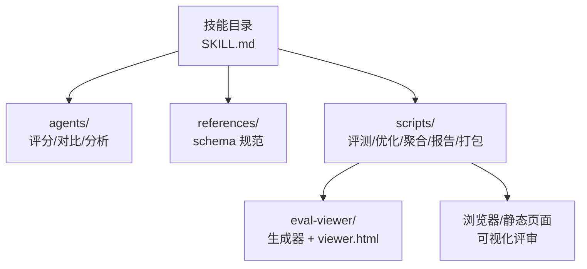
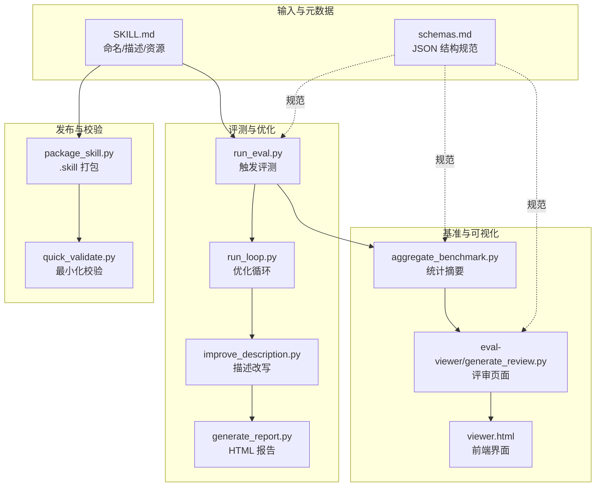
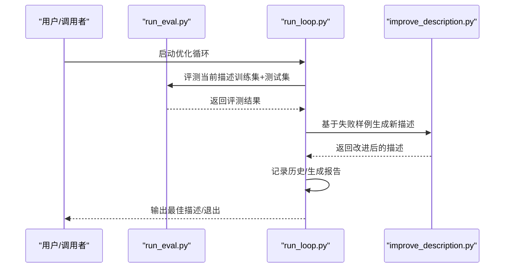
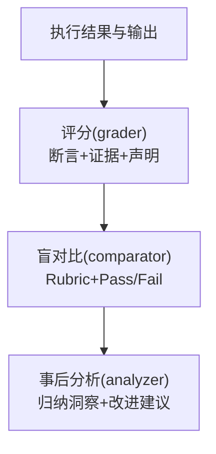
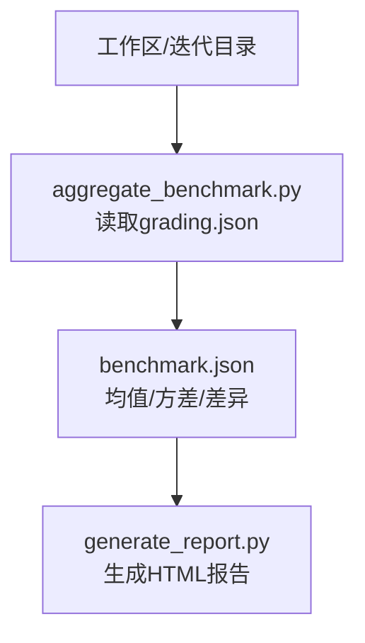
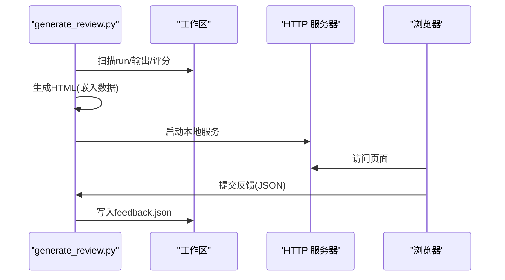
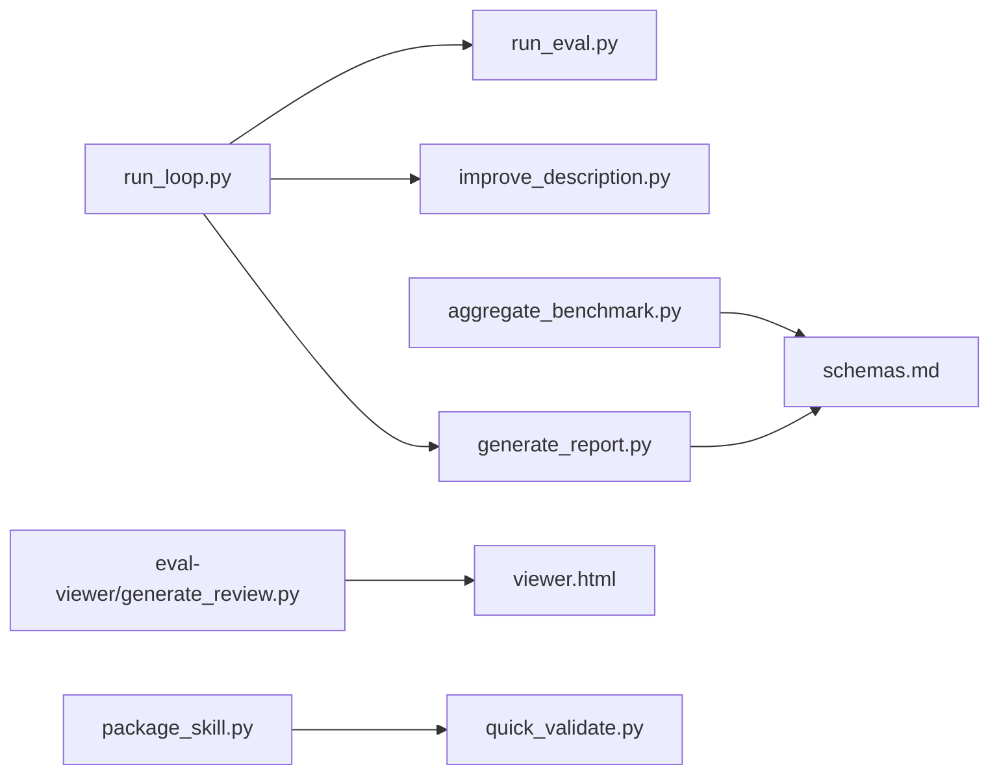

# 技能创建器

<cite>
**本文引用的文件**
- [src/agent/skills/skill-creator/SKILL.md](file://src/agent/skills/skill-creator/SKILL.md)
- [src/agent/skills/skill-creator/references/schemas.md](file://src/agent/skills/skill-creator/references/schemas.md)
- [src/agent/skills/skill-creator/agents/analyzer.md](file://src/agent/skills/skill-creator/agents/analyzer.md)
- [src/agent/skills/skill-creator/agents/comparator.md](file://src/agent/skills/skill-creator/agents/comparator.md)
- [src/agent/skills/skill-creator/agents/grader.md](file://src/agent/skills/skill-creator/agents/grader.md)
- [src/agent/skills/skill-creator/scripts/run_eval.py](file://src/agent/skills/skill-creator/scripts/run_eval.py)
- [src/agent/skills/skill-creator/scripts/run_loop.py](file://src/agent/skills/skill-creator/scripts/run_loop.py)
- [src/agent/skills/skill-creator/scripts/improve_description.py](file://src/agent/skills/skill-creator/scripts/improve_description.py)
- [src/agent/skills/skill-creator/scripts/aggregate_benchmark.py](file://src/agent/skills/skill-creator/scripts/aggregate_benchmark.py)
- [src/agent/skills/skill-creator/scripts/generate_report.py](file://src/agent/skills/skill-creator/scripts/generate_report.py)
- [src/agent/skills/skill-creator/scripts/package_skill.py](file://src/agent/skills/skill-creator/scripts/package_skill.py)
- [src/agent/skills/skill-creator/scripts/quick_validate.py](file://src/agent/skills/skill-creator/scripts/quick_validate.py)
- [src/agent/skills/skill-creator/scripts/utils.py](file://src/agent/skills/skill-creator/scripts/utils.py)
- [src/agent/skills/skill-creator/eval-viewer/generate_review.py](file://src/agent/skills/skill-creator/eval-viewer/generate_review.py)
- [src/agent/skills/skill-creator/eval-viewer/viewer.html](file://src/agent/skills/skill-creator/eval-viewer/viewer.html)
- [src/agent/skills/travel-guide/SKILL.md](file://src/agent/skills/travel-guide/SKILL.md)
</cite>

## 目录
1. [简介](#简介)
2. [项目结构](#项目结构)
3. [核心组件](#核心组件)
4. [架构总览](#架构总览)
5. [详细组件分析](#详细组件分析)
6. [依赖分析](#依赖分析)
7. [性能考虑](#性能考虑)
8. [故障排查指南](#故障排查指南)
9. [结论](#结论)
10. [附录](#附录)

## 简介
本指南面向希望创建、迭代与评测“自定义技能”的开发者与产品人员。技能创建器模块提供了从需求采集、技能草稿撰写、测试用例设计、量化评测、结果可视化、到持续改进与打包发布的完整工作流。文档以“标准架构”为主线，覆盖 SKILL.md 编写规范、schema 定义、评测与可视化工具链、以及发布与分发最佳实践。

## 项目结构
技能创建器位于 src/agent/skills/skill-creator 目录下，采用“脚本 + 模板 + 可视化”的组织方式：
- SKILL.md：技能元数据与指导文档
- agents/：子代理（评分、对比、分析）的执行指引
- references/schemas.md：评测与指标的 JSON 结构规范
- scripts/：触发评测、描述优化、基准聚合、报告生成、打包等自动化脚本
- eval-viewer/：评测可视化页面与生成器

图示来源
- [src/agent/skills/skill-creator/SKILL.md:1-486](file://src/agent/skills/skill-creator/SKILL.md#L1-L486)
- [src/agent/skills/skill-creator/agents/analyzer.md:1-275](file://src/agent/skills/skill-creator/agents/analyzer.md#L1-L275)
- [src/agent/skills/skill-creator/agents/comparator.md:1-203](file://src/agent/skills/skill-creator/agents/comparator.md#L1-L203)
- [src/agent/skills/skill-creator/agents/grader.md:1-224](file://src/agent/skills/skill-creator/agents/grader.md#L1-L224)
- [src/agent/skills/skill-creator/references/schemas.md:1-431](file://src/agent/skills/skill-creator/references/schemas.md#L1-L431)
- [src/agent/skills/skill-creator/scripts/run_eval.py:1-311](file://src/agent/skills/skill-creator/scripts/run_eval.py#L1-L311)
- [src/agent/skills/skill-creator/scripts/run_loop.py:1-329](file://src/agent/skills/skill-creator/scripts/run_loop.py#L1-L329)
- [src/agent/skills/skill-creator/scripts/improve_description.py:1-248](file://src/agent/skills/skill-creator/scripts/improve_description.py#L1-L248)
- [src/agent/skills/skill-creator/scripts/aggregate_benchmark.py:1-402](file://src/agent/skills/skill-creator/scripts/aggregate_benchmark.py#L1-L402)
- [src/agent/skills/skill-creator/scripts/generate_report.py:1-327](file://src/agent/skills/skill-creator/scripts/generate_report.py#L1-L327)
- [src/agent/skills/skill-creator/scripts/package_skill.py:1-137](file://src/agent/skills/skill-creator/scripts/package_skill.py#L1-L137)
- [src/agent/skills/skill-creator/eval-viewer/generate_review.py:1-472](file://src/agent/skills/skill-creator/eval-viewer/generate_review.py#L1-L472)
- [src/agent/skills/skill-creator/eval-viewer/viewer.html:1-800](file://src/agent/skills/skill-creator/eval-viewer/viewer.html#L1-L800)

章节来源
- [src/agent/skills/skill-creator/SKILL.md:1-486](file://src/agent/skills/skill-creator/SKILL.md#L1-L486)
- [src/agent/skills/skill-creator/references/schemas.md:1-431](file://src/agent/skills/skill-creator/references/schemas.md#L1-L431)

## 核心组件
- 技能元数据与流程指导：SKILL.md 提供技能命名、描述、触发条件、输出格式、资源组织与迭代流程的权威说明
- 子代理（Agents）：评分（grader）、盲对比（comparator）、事后分析（analyzer），分别承担“定性评测”“客观对比”“洞察提炼”的职责
- 评测与优化脚本：run_eval.py、run_loop.py、improve_description.py 构成“触发评测 + 描述优化循环”
- 基准聚合与报告：aggregate_benchmark.py 产出统计摘要；generate_report.py 生成可视化报告
- 可视化评审：eval-viewer/generate_review.py 生成可交互的评审页面，viewer.html 提供前端界面
- 打包与校验：package_skill.py 生成 .skill 分发包；quick_validate.py 进行最小化合规检查

章节来源
- [src/agent/skills/skill-creator/SKILL.md:1-486](file://src/agent/skills/skill-creator/SKILL.md#L1-L486)
- [src/agent/skills/skill-creator/agents/grader.md:1-224](file://src/agent/skills/skill-creator/agents/grader.md#L1-L224)
- [src/agent/skills/skill-creator/agents/comparator.md:1-203](file://src/agent/skills/skill-creator/agents/comparator.md#L1-L203)
- [src/agent/skills/skill-creator/agents/analyzer.md:1-275](file://src/agent/skills/skill-creator/agents/analyzer.md#L1-L275)
- [src/agent/skills/skill-creator/scripts/run_eval.py:1-311](file://src/agent/skills/skill-creator/scripts/run_eval.py#L1-L311)
- [src/agent/skills/skill-creator/scripts/run_loop.py:1-329](file://src/agent/skills/skill-creator/scripts/run_loop.py#L1-L329)
- [src/agent/skills/skill-creator/scripts/improve_description.py:1-248](file://src/agent/skills/skill-creator/scripts/improve_description.py#L1-L248)
- [src/agent/skills/skill-creator/scripts/aggregate_benchmark.py:1-402](file://src/agent/skills/skill-creator/scripts/aggregate_benchmark.py#L1-L402)
- [src/agent/skills/skill-creator/scripts/generate_report.py:1-327](file://src/agent/skills/skill-creator/scripts/generate_report.py#L1-L327)
- [src/agent/skills/skill-creator/eval-viewer/generate_review.py:1-472](file://src/agent/skills/skill-creator/eval-viewer/generate_review.py#L1-L472)
- [src/agent/skills/skill-creator/scripts/package_skill.py:1-137](file://src/agent/skills/skill-creator/scripts/package_skill.py#L1-L137)
- [src/agent/skills/skill-creator/scripts/quick_validate.py:1-103](file://src/agent/skills/skill-creator/scripts/quick_validate.py#L1-L103)

## 架构总览
技能创建器采用“流水线 + 可视化”的架构：先由 SKILL.md 明确意图与边界，再通过 run_eval/run_loop 对描述进行触发评测与自动优化；随后以 aggregate_benchmark 生成统计摘要，结合 generate_review 的可视化评审页面，驱动人机协同的迭代闭环；最终通过 package_skill 生成可分发的 .skill 包。

图示来源
- [src/agent/skills/skill-creator/SKILL.md:1-486](file://src/agent/skills/skill-creator/SKILL.md#L1-L486)
- [src/agent/skills/skill-creator/references/schemas.md:1-431](file://src/agent/skills/skill-creator/references/schemas.md#L1-L431)
- [src/agent/skills/skill-creator/scripts/run_eval.py:1-311](file://src/agent/skills/skill-creator/scripts/run_eval.py#L1-L311)
- [src/agent/skills/skill-creator/scripts/run_loop.py:1-329](file://src/agent/skills/skill-creator/scripts/run_loop.py#L1-L329)
- [src/agent/skills/skill-creator/scripts/improve_description.py:1-248](file://src/agent/skills/skill-creator/scripts/improve_description.py#L1-L248)
- [src/agent/skills/skill-creator/scripts/generate_report.py:1-327](file://src/agent/skills/skill-creator/scripts/generate_report.py#L1-L327)
- [src/agent/skills/skill-creator/scripts/aggregate_benchmark.py:1-402](file://src/agent/skills/skill-creator/scripts/aggregate_benchmark.py#L1-L402)
- [src/agent/skills/skill-creator/eval-viewer/generate_review.py:1-472](file://src/agent/skills/skill-creator/eval-viewer/generate_review.py#L1-L472)
- [src/agent/skills/skill-creator/eval-viewer/viewer.html:1-800](file://src/agent/skills/skill-creator/eval-viewer/viewer.html#L1-L800)
- [src/agent/skills/skill-creator/scripts/package_skill.py:1-137](file://src/agent/skills/skill-creator/scripts/package_skill.py#L1-L137)
- [src/agent/skills/skill-creator/scripts/quick_validate.py:1-103](file://src/agent/skills/skill-creator/scripts/quick_validate.py#L1-L103)

## 详细组件分析

### SKILL.md 编写与标准架构
- 元数据：name、description、compatibility 等字段必须符合规范，描述应具备“触发性”，即在恰当上下文中促使模型调用该技能
- 内容结构：建议采用“三段式加载”（元数据+正文+按需资源），正文控制在合理长度，资源按需引用
- 输出格式：明确期望输出结构与示例，便于后续评测断言
- 迭代流程：遵循“草稿→测试→评审→改进→重复→打包”的闭环

章节来源
- [src/agent/skills/skill-creator/SKILL.md:45-162](file://src/agent/skills/skill-creator/SKILL.md#L45-L162)
- [src/agent/skills/skill-creator/SKILL.md:163-323](file://src/agent/skills/skill-creator/SKILL.md#L163-L323)
- [src/agent/skills/skill-creator/SKILL.md:333-406](file://src/agent/skills/skill-creator/SKILL.md#L333-L406)
- [src/agent/skills/skill-creator/SKILL.md:408-456](file://src/agent/skills/skill-creator/SKILL.md#L408-L456)

### 评测与基准：run_eval.py 与 run_loop.py
- run_eval.py：对一组查询进行触发评测，支持多进程并发、超时控制、多次运行取均值，输出每条查询的触发率与通过状态
- run_loop.py：将评测与描述优化整合为循环，支持训练/测试集拆分、历史记录追踪、实时 HTML 报告、自动停止策略

图示来源
- [src/agent/skills/skill-creator/scripts/run_eval.py:184-256](file://src/agent/skills/skill-creator/scripts/run_eval.py#L184-L256)
- [src/agent/skills/skill-creator/scripts/run_loop.py:47-241](file://src/agent/skills/skill-creator/scripts/run_loop.py#L47-L241)
- [src/agent/skills/skill-creator/scripts/improve_description.py:50-191](file://src/agent/skills/skill-creator/scripts/improve_description.py#L50-L191)

章节来源
- [src/agent/skills/skill-creator/scripts/run_eval.py:1-311](file://src/agent/skills/skill-creator/scripts/run_eval.py#L1-L311)
- [src/agent/skills/skill-creator/scripts/run_loop.py:1-329](file://src/agent/skills/skill-creator/scripts/run_loop.py#L1-L329)
- [src/agent/skills/skill-creator/scripts/improve_description.py:1-248](file://src/agent/skills/skill-creator/scripts/improve_description.py#L1-L248)

### 评分与对比：grader.md、comparator.md、analyzer.md
- 评分（grader）：依据断言与输出证据判定通过/失败，提取隐含声明并提供改进建议
- 盲对比（comparator）：不透露来源地对两份输出进行客观打分，形成结构化对比结果
- 事后分析（analyzer）：解读对比结果，总结优劣原因并提出可操作的技能改进意见

图示来源
- [src/agent/skills/skill-creator/agents/grader.md:1-224](file://src/agent/skills/skill-creator/agents/grader.md#L1-L224)
- [src/agent/skills/skill-creator/agents/comparator.md:1-203](file://src/agent/skills/skill-creator/agents/comparator.md#L1-L203)
- [src/agent/skills/skill-creator/agents/analyzer.md:1-275](file://src/agent/skills/skill-creator/agents/analyzer.md#L1-L275)

章节来源
- [src/agent/skills/skill-creator/agents/grader.md:1-224](file://src/agent/skills/skill-creator/agents/grader.md#L1-L224)
- [src/agent/skills/skill-creator/agents/comparator.md:1-203](file://src/agent/skills/skill-creator/agents/comparator.md#L1-L203)
- [src/agent/skills/skill-creator/agents/analyzer.md:1-275](file://src/agent/skills/skill-creator/agents/analyzer.md#L1-L275)

### 基准聚合与报告：aggregate_benchmark.py 与 generate_report.py
- aggregate_benchmark.py：从多个 run 的 grading.json 中提取 pass_rate、time、tokens 等指标，计算均值/方差/极值，并生成 benchmark.json 与 benchmark.md
- generate_report.py：将 run_loop 的历史记录渲染为 HTML 报告，直观显示每次尝试的描述与每条查询的通过情况

图示来源
- [src/agent/skills/skill-creator/scripts/aggregate_benchmark.py:67-278](file://src/agent/skills/skill-creator/scripts/aggregate_benchmark.py#L67-L278)
- [src/agent/skills/skill-creator/scripts/generate_report.py:16-301](file://src/agent/skills/skill-creator/scripts/generate_report.py#L16-L301)

章节来源
- [src/agent/skills/skill-creator/scripts/aggregate_benchmark.py:1-402](file://src/agent/skills/skill-creator/scripts/aggregate_benchmark.py#L1-L402)
- [src/agent/skills/skill-creator/scripts/generate_report.py:1-327](file://src/agent/skills/skill-creator/scripts/generate_report.py#L1-L327)

### 可视化评审：eval-viewer/generate_review.py 与 viewer.html
- generate_review.py：扫描工作区中的 run，嵌入输出文件与评分，启动本地 HTTP 服务或导出静态 HTML，支持前后迭代对比与反馈收集
- viewer.html：前端页面，支持 Outputs/Benchmark 双标签页、自动保存反馈、键盘导航、下载输出文件

图示来源
- [src/agent/skills/skill-creator/eval-viewer/generate_review.py:308-472](file://src/agent/skills/skill-creator/eval-viewer/generate_review.py#L308-L472)
- [src/agent/skills/skill-creator/eval-viewer/viewer.html:1-800](file://src/agent/skills/skill-creator/eval-viewer/viewer.html#L1-L800)

章节来源
- [src/agent/skills/skill-creator/eval-viewer/generate_review.py:1-472](file://src/agent/skills/skill-creator/eval-viewer/generate_review.py#L1-L472)
- [src/agent/skills/skill-creator/eval-viewer/viewer.html:1-800](file://src/agent/skills/skill-creator/eval-viewer/viewer.html#L1-L800)

### 打包与校验：package_skill.py 与 quick_validate.py
- package_skill.py：将技能目录打包为 .skill 文件，自动排除构建产物与敏感目录，支持前置校验
- quick_validate.py：最小化校验 SKILL.md 的 frontmatter 字段、命名与描述长度等约束

章节来源
- [src/agent/skills/skill-creator/scripts/package_skill.py:1-137](file://src/agent/skills/skill-creator/scripts/package_skill.py#L1-L137)
- [src/agent/skills/skill-creator/scripts/quick_validate.py:1-103](file://src/agent/skills/skill-creator/scripts/quick_validate.py#L1-L103)

### 示例：从需求到发布的全流程
- 需求采集：参考 SKILL.md 的“捕获意图/面试与研究/写 SKILL.md”步骤，明确触发条件、输出格式与资源组织
- 测试用例：在 evals/evals.json 中定义 2-3 个真实任务提示，保存预期输出与输入文件列表
- 评测与迭代：使用 run_eval/run_loop 评测描述触发效果，结合 grader/comparator/analyzer 的结果进行改进
- 基准与可视化：aggregate_benchmark 生成统计摘要，generate_review 打开评审页面供用户审阅与反馈
- 发布：通过 package_skill 生成 .skill 文件，必要时使用 quick_validate 进行合规检查

章节来源
- [src/agent/skills/skill-creator/SKILL.md:45-162](file://src/agent/skills/skill-creator/SKILL.md#L45-L162)
- [src/agent/skills/skill-creator/SKILL.md:163-323](file://src/agent/skills/skill-creator/SKILL.md#L163-L323)
- [src/agent/skills/skill-creator/references/schemas.md:7-36](file://src/agent/skills/skill-creator/references/schemas.md#L7-L36)
- [src/agent/skills/skill-creator/scripts/run_eval.py:1-311](file://src/agent/skills/skill-creator/scripts/run_eval.py#L1-L311)
- [src/agent/skills/skill-creator/scripts/run_loop.py:1-329](file://src/agent/skills/skill-creator/scripts/run_loop.py#L1-L329)
- [src/agent/skills/skill-creator/scripts/aggregate_benchmark.py:1-402](file://src/agent/skills/skill-creator/scripts/aggregate_benchmark.py#L1-L402)
- [src/agent/skills/skill-creator/eval-viewer/generate_review.py:1-472](file://src/agent/skills/skill-creator/eval-viewer/generate_review.py#L1-L472)
- [src/agent/skills/skill-creator/scripts/package_skill.py:1-137](file://src/agent/skills/skill-creator/scripts/package_skill.py#L1-L137)

## 依赖分析
- 脚本间依赖：run_loop.py 依赖 run_eval.py 与 improve_description.py；generate_report.py 依赖 run_loop 输出；aggregate_benchmark.py 依赖 grading.json；generate_review.py 依赖工作区输出与可选 benchmark.json
- 数据契约：所有 JSON 结构严格遵循 schemas.md 的字段定义，确保跨组件一致性
- 外部工具：run_eval.py/improve_description.py 通过 claude -p 子进程调用；generate_review.py 使用 Python 标准库 HTTP 服务器

图示来源
- [src/agent/skills/skill-creator/scripts/run_loop.py:1-329](file://src/agent/skills/skill-creator/scripts/run_loop.py#L1-L329)
- [src/agent/skills/skill-creator/scripts/run_eval.py:1-311](file://src/agent/skills/skill-creator/scripts/run_eval.py#L1-L311)
- [src/agent/skills/skill-creator/scripts/improve_description.py:1-248](file://src/agent/skills/skill-creator/scripts/improve_description.py#L1-L248)
- [src/agent/skills/skill-creator/scripts/generate_report.py:1-327](file://src/agent/skills/skill-creator/scripts/generate_report.py#L1-L327)
- [src/agent/skills/skill-creator/scripts/aggregate_benchmark.py:1-402](file://src/agent/skills/skill-creator/scripts/aggregate_benchmark.py#L1-L402)
- [src/agent/skills/skill-creator/eval-viewer/generate_review.py:1-472](file://src/agent/skills/skill-creator/eval-viewer/generate_review.py#L1-L472)
- [src/agent/skills/skill-creator/eval-viewer/viewer.html:1-800](file://src/agent/skills/skill-creator/eval-viewer/viewer.html#L1-L800)
- [src/agent/skills/skill-creator/scripts/package_skill.py:1-137](file://src/agent/skills/skill-creator/scripts/package_skill.py#L1-L137)
- [src/agent/skills/skill-creator/scripts/quick_validate.py:1-103](file://src/agent/skills/skill-creator/scripts/quick_validate.py#L1-L103)
- [src/agent/skills/skill-creator/references/schemas.md:1-431](file://src/agent/skills/skill-creator/references/schemas.md#L1-L431)

章节来源
- [src/agent/skills/skill-creator/scripts/run_loop.py:1-329](file://src/agent/skills/skill-creator/scripts/run_loop.py#L1-L329)
- [src/agent/skills/skill-creator/scripts/aggregate_benchmark.py:1-402](file://src/agent/skills/skill-creator/scripts/aggregate_benchmark.py#L1-L402)
- [src/agent/skills/skill-creator/eval-viewer/generate_review.py:1-472](file://src/agent/skills/skill-creator/eval-viewer/generate_review.py#L1-L472)
- [src/agent/skills/skill-creator/references/schemas.md:1-431](file://src/agent/skills/skill-creator/references/schemas.md#L1-L431)

## 性能考虑
- 并行评测：run_eval.py 支持多进程并发，合理设置 worker 数量与超时，平衡吞吐与稳定性
- 触发阈值与重复运行：通过 runs-per-query 降低随机性影响，提升评测稳健性
- 输出内联与下载：viewer.html 对文本/图片/PDF/XLSX 等类型进行内联渲染或二进制下载，减少外部依赖
- 基准统计：aggregate_benchmark.py 使用样本方差计算标准差，关注均值与离散度的综合表现

## 故障排查指南
- 触发评测失败
  - 检查描述长度与内容是否符合限制（描述长度上限、不含尖括号等）
  - 确认查询集合覆盖充分，包含“应触发/不应触发”的混合样例
  - 使用 run_eval.py 的详细日志模式定位问题
- 评审页面空白或无反馈
  - 确认工作区中存在 outputs/grading.json 等必要文件
  - 若无本地浏览器，使用 --static 导出静态 HTML 并手动下载 feedback.json
- 基准聚合异常
  - 检查 grading.json 字段完整性（expectations 必须包含 text/passed/evidence）
  - 确保 run 目录命名规范（eval-N、run-N），避免遗漏 timing.json 或 metrics.json
- 打包失败
  - 使用 quick_validate.py 先行验证 frontmatter 与命名规范
  - 确认排除规则未误删关键资源（如 scripts/references/assets）

章节来源
- [src/agent/skills/skill-creator/scripts/run_eval.py:259-311](file://src/agent/skills/skill-creator/scripts/run_eval.py#L259-L311)
- [src/agent/skills/skill-creator/eval-viewer/generate_review.py:387-472](file://src/agent/skills/skill-creator/eval-viewer/generate_review.py#L387-L472)
- [src/agent/skills/skill-creator/scripts/aggregate_benchmark.py:114-173](file://src/agent/skills/skill-creator/scripts/aggregate_benchmark.py#L114-L173)
- [src/agent/skills/skill-creator/scripts/quick_validate.py:12-103](file://src/agent/skills/skill-creator/scripts/quick_validate.py#L12-L103)
- [src/agent/skills/skill-creator/scripts/package_skill.py:42-109](file://src/agent/skills/skill-creator/scripts/package_skill.py#L42-L109)

## 结论
技能创建器模块通过“元数据规范 + 自动评测 + 人工评审 + 基准统计 + 可视化报告 + 打包分发”的全链路设计，为自定义技能的高质量研发提供了标准化路径。遵循 SKILL.md 的编写规范与 schema 的数据契约，配合 agents 的评分/对比/分析能力，能够高效迭代并稳定交付可用技能。

## 附录
- 参考示例技能：travel-guide/SKILL.md 展示了清晰的结构与输出模板，可作为编写新技能的参照
- 关键文件索引
  - 元数据与规范：SKILL.md、schemas.md
  - 评测与优化：run_eval.py、run_loop.py、improve_description.py、generate_report.py
  - 基准与可视化：aggregate_benchmark.py、eval-viewer/generate_review.py、viewer.html
  - 发布与校验：package_skill.py、quick_validate.py、utils.py

章节来源
- [src/agent/skills/travel-guide/SKILL.md:1-105](file://src/agent/skills/travel-guide/SKILL.md#L1-L105)
- [src/agent/skills/skill-creator/scripts/utils.py:7-47](file://src/agent/skills/skill-creator/scripts/utils.py#L7-L47)