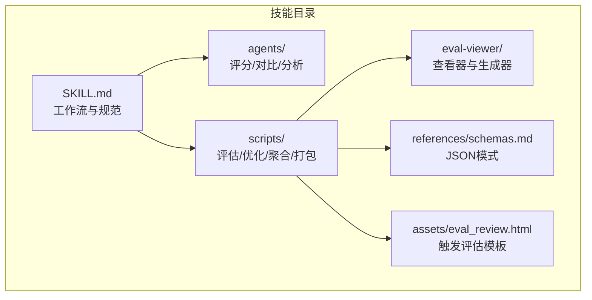
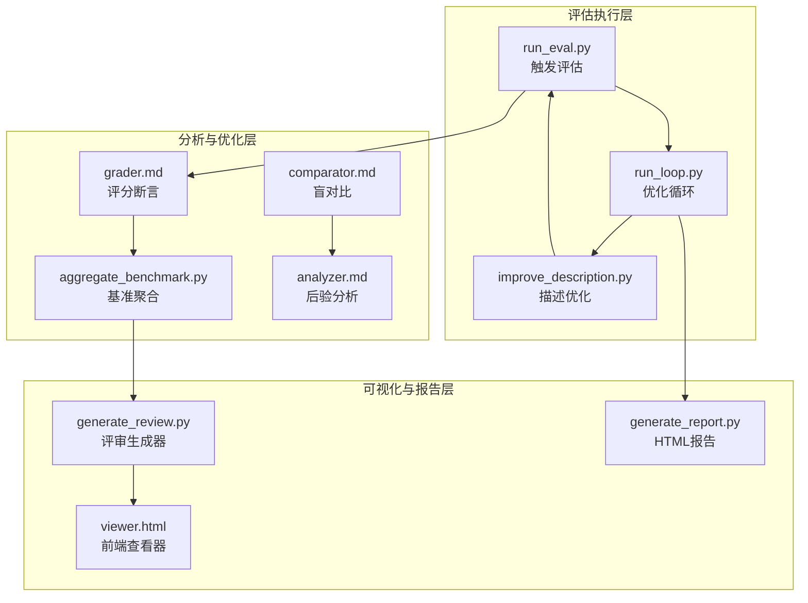
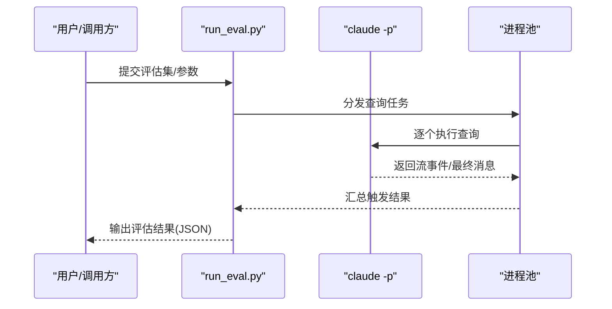
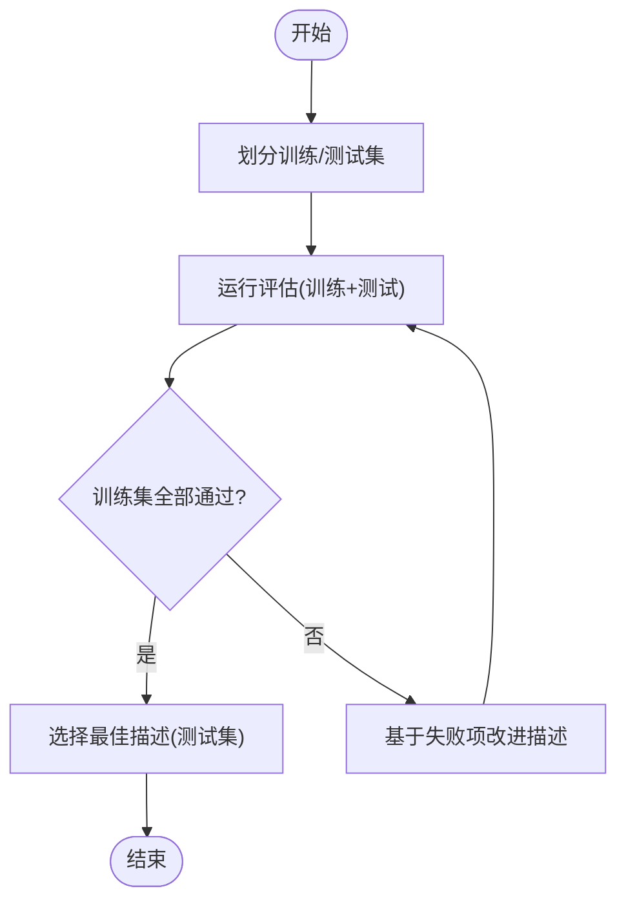
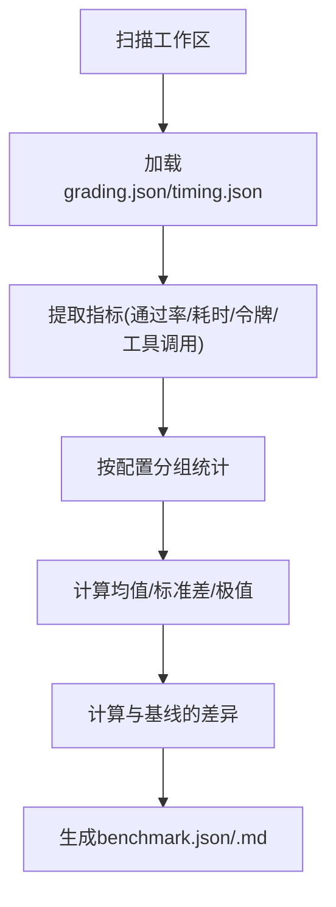
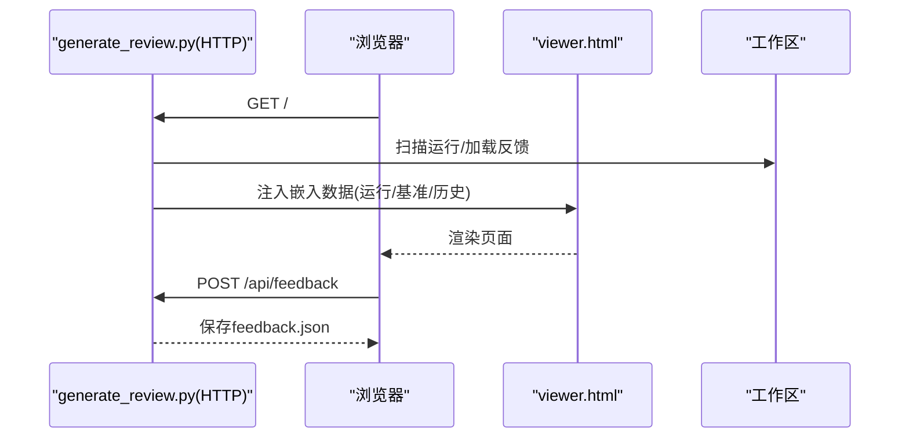
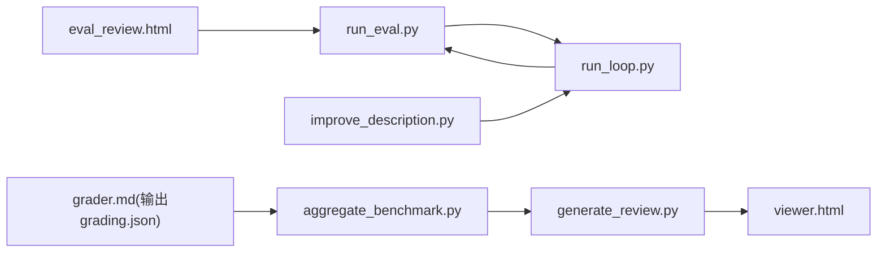

# 技能创建器技能

<cite>
**本文档引用的文件**
- [SKILL.md](file://src/agent/skills/skill-creator/SKILL.md)
- [analyzer.md](file://src/agent/skills/skill-creator/agents/analyzer.md)
- [comparator.md](file://src/agent/skills/skill-creator/agents/comparator.md)
- [grader.md](file://src/agent/skills/skill-creator/agents/grader.md)
- [run_eval.py](file://src/agent/skills/skill-creator/scripts/run_eval.py)
- [generate_report.py](file://src/agent/skills/skill-creator/scripts/generate_report.py)
- [aggregate_benchmark.py](file://src/agent/skills/skill-creator/scripts/aggregate_benchmark.py)
- [improve_description.py](file://src/agent/skills/skill-creator/scripts/improve_description.py)
- [run_loop.py](file://src/agent/skills/skill-creator/scripts/run_loop.py)
- [utils.py](file://src/agent/skills/skill-creator/scripts/utils.py)
- [quick_validate.py](file://src/agent/skills/skill-creator/scripts/quick_validate.py)
- [package_skill.py](file://src/agent/skills/skill-creator/scripts/package_skill.py)
- [viewer.html](file://src/agent/skills/skill-creator/eval-viewer/viewer.html)
- [generate_review.py](file://src/agent/skills/skill-creator/eval-viewer/generate_review.py)
- [eval_review.html](file://src/agent/skills/skill-creator/assets/eval_review.html)
- [schemas.md](file://src/agent/skills/skill-creator/references/schemas.md)
</cite>

## 目录
1. [简介](#简介)
2. [项目结构](#项目结构)
3. [核心组件](#核心组件)
4. [架构总览](#架构总览)
5. [详细组件分析](#详细组件分析)
6. [依赖关系分析](#依赖关系分析)
7. [性能考虑](#性能考虑)
8. [故障排查指南](#故障排查指南)
9. [结论](#结论)
10. [附录](#附录)

## 简介
本文件系统性阐述“技能创建器技能”的自动化评估与改进体系，覆盖从评估脚本执行、结果采集与分析报告生成，到技能迭代优化、批量评估与聚合分析、以及评估查看器的前端实现与交互流程。文档同时提供技能开发全生命周期管理与质量保证流程建议，帮助用户高效构建高质量、可复用、可评测的技能。

## 项目结构
技能创建器位于技能目录下，采用“技能元数据 + 脚本工具 + 评估资产 + 前端查看器”的分层组织方式：
- 核心技能说明：SKILL.md 定义工作流、迭代循环、触发机制与最佳实践
- 评估与分析代理：agents 下包含评分、对比、后验分析等子任务指令
- 批量评估与聚合：scripts 下提供触发评估、描述优化、基准聚合、报告生成等工具
- 评估查看器：eval-viewer 提供浏览器端的可视化评审与统计面板
- 参考与模式：references/schemas.md 规范各类 JSON 结构；assets 提供触发评估的 HTML 模板

图示来源
- [SKILL.md](file://src/agent/skills/skill-creator/SKILL.md)
- [run_loop.py](file://src/agent/skills/skill-creator/scripts/run_loop.py)
- [generate_review.py](file://src/agent/skills/skill-creator/eval-viewer/generate_review.py)
- [schemas.md](file://src/agent/skills/skill-creator/references/schemas.md)

章节来源
- [SKILL.md](file://src/agent/skills/skill-creator/SKILL.md)
- [schemas.md](file://src/agent/skills/skill-creator/references/schemas.md)

## 核心组件
- 自动化评估流水线：并行运行带/无技能配置，捕获计时与令牌消耗，自动评分断言并通过查看器展示
- 描述优化引擎：基于触发评估结果，通过多轮迭代与训练/测试集分离，生成更优触发描述
- 基准聚合器：从多个运行中提取指标，计算均值/标准差/极值，并给出与基线的差异
- 评估查看器：内嵌数据的单页应用，支持输出浏览、历史对比、正式评分、反馈收集与导出
- 质量保障工具链：快速校验、打包为 .skill 文件、安全排除规则

章节来源
- [run_eval.py](file://src/agent/skills/skill-creator/scripts/run_eval.py)
- [run_loop.py](file://src/agent/skills/skill-creator/scripts/run_loop.py)
- [aggregate_benchmark.py](file://src/agent/skills/skill-creator/scripts/aggregate_benchmark.py)
- [generate_review.py](file://src/agent/skills/skill-creator/eval-viewer/generate_review.py)
- [quick_validate.py](file://src/agent/skills/skill-creator/scripts/quick_validate.py)
- [package_skill.py](file://src/agent/skills/skill-creator/scripts/package_skill.py)

## 架构总览
整体架构由“评估执行层”“分析与优化层”“可视化与报告层”三部分组成，通过统一的 JSON 模式进行数据交换。

图示来源
- [run_eval.py](file://src/agent/skills/skill-creator/scripts/run_eval.py)
- [run_loop.py](file://src/agent/skills/skill-creator/scripts/run_loop.py)
- [improve_description.py](file://src/agent/skills/skill-creator/scripts/improve_description.py)
- [aggregate_benchmark.py](file://src/agent/skills/skill-creator/scripts/aggregate_benchmark.py)
- [grader.md](file://src/agent/skills/skill-creator/agents/grader.md)
- [comparator.md](file://src/agent/skills/skill-creator/agents/comparator.md)
- [analyzer.md](file://src/agent/skills/skill-creator/agents/analyzer.md)
- [generate_review.py](file://src/agent/skills/skill-creator/eval-viewer/generate_review.py)
- [viewer.html](file://src/agent/skills/skill-creator/eval-viewer/viewer.html)
- [generate_report.py](file://src/agent/skills/skill-creator/scripts/generate_report.py)

## 详细组件分析

### 评估脚本执行与触发评估（run_eval.py）
- 并行触发评估：使用进程池并发执行查询，支持多次重复以降低波动
- 流事件检测：通过 Claude CLI 的流事件提前判断是否触发技能，减少等待时间
- 结果汇总：按查询聚合触发次数，计算命中率并判定通过/失败
- 输出格式：返回包含每个查询的触发率、阈值与通过状态的结构化结果

图示来源
- [run_eval.py](file://src/agent/skills/skill-creator/scripts/run_eval.py)

章节来源
- [run_eval.py](file://src/agent/skills/skill-creator/scripts/run_eval.py)

### 描述优化与迭代循环（run_loop.py + improve_description.py）
- 训练/测试集划分：按 should_trigger 分层随机采样，防止过拟合
- 多轮优化：先评估训练集，再基于失败项生成新描述，直至全部通过或达到最大迭代
- 实时报告：生成自动刷新的 HTML 报告，展示每次迭代的描述与测试表现
- 历史记录：保存每次尝试的描述、分数与结果，便于回溯与分析

图示来源
- [run_loop.py](file://src/agent/skills/skill-creator/scripts/run_loop.py)
- [improve_description.py](file://src/agent/skills/skill-creator/scripts/improve_description.py)

章节来源
- [run_loop.py](file://src/agent/skills/skill-creator/scripts/run_loop.py)
- [improve_description.py](file://src/agent/skills/skill-creator/scripts/improve_description.py)

### 基准聚合与统计分析（aggregate_benchmark.py）
- 数据发现：递归扫描工作区，识别带/无技能配置下的运行目录
- 指标提取：从 grading.json/timing.json 中抽取通过率、耗时、令牌数、工具调用次数等
- 统计计算：为每配置计算均值、标准差、最小/最大值，并计算与基线的差异
- 报告生成：输出 benchmark.json 与 benchmark.md，供查看器与人工审阅

图示来源
- [aggregate_benchmark.py](file://src/agent/skills/skill-creator/scripts/aggregate_benchmark.py)

章节来源
- [aggregate_benchmark.py](file://src/agent/skills/skill-creator/scripts/aggregate_benchmark.py)
- [schemas.md](file://src/agent/skills/skill-creator/references/schemas.md)

### 评估查看器前端实现（generate_review.py + viewer.html）
- 数据注入：将运行列表、先前迭代反馈与基准数据嵌入前端模板
- 内容渲染：根据文件类型内联显示文本/图片/PDF/XLSX 或提供下载链接
- 交互功能：支持前后导航、键盘快捷键、自动保存反馈、折叠展开评分与历史输出
- 基准视图：在存在 benchmark.json 时展示统计表格与分析注释

图示来源
- [generate_review.py](file://src/agent/skills/skill-creator/eval-viewer/generate_review.py)
- [viewer.html](file://src/agent/skills/skill-creator/eval-viewer/viewer.html)

章节来源
- [generate_review.py](file://src/agent/skills/skill-creator/eval-viewer/generate_review.py)
- [viewer.html](file://src/agent/skills/skill-creator/eval-viewer/viewer.html)

### 评分与断言（agents/grader.md）
- 输入：期望断言、执行转录、输出目录
- 过程：检索证据、判定通过/失败、提取隐含声明、读取执行度量与计时
- 输出：断言清单、摘要统计、执行指标、计时信息、用户备注摘要与评估改进建议

章节来源
- [grader.md](file://src/agent/skills/skill-creator/agents/grader.md)

### 盲对比与后验分析（agents/comparator.md + agents/analyzer.md）
- 盲对比：不透露来源，依据内容与结构评分，必要时结合断言通过率决定胜负
- 后验分析：拆解赢家/输家差异，总结优势与弱点，提出可操作的改进点

章节来源
- [comparator.md](file://src/agent/skills/skill-creator/agents/comparator.md)
- [analyzer.md](file://src/agent/skills/skill-creator/agents/analyzer.md)

### 触发评估模板（assets/eval_review.html）
- 用户编辑：增删查询、切换 should_trigger、实时预览导出
- 导出：生成 eval_set.json，供 run_eval.py 使用

章节来源
- [eval_review.html](file://src/agent/skills/skill-creator/assets/eval_review.html)

### 工具与辅助（utils/quick_validate/package_skill）
- 解析 SKILL.md：解析 YAML frontmatter，提取名称/描述/全文
- 快速校验：检查字段合法性、命名规范、长度限制
- 打包：将技能目录压缩为 .skill 文件，排除缓存与无关文件

章节来源
- [utils.py](file://src/agent/skills/skill-creator/scripts/utils.py)
- [quick_validate.py](file://src/agent/skills/skill-creator/scripts/quick_validate.py)
- [package_skill.py](file://src/agent/skills/skill-creator/scripts/package_skill.py)

## 依赖关系分析
- 脚本间耦合
  - run_loop.py 依赖 run_eval.py 与 improve_description.py，形成“评估-改进”闭环
  - aggregate_benchmark.py 依赖 grading.json/timing.json，输出 benchmark.json
  - generate_review.py 依赖 viewer.html 与基准数据，生成可交互页面
- 外部依赖
  - Claude CLI（claude -p）用于触发评估与描述优化
  - Python 标准库实现 HTTP 服务器与文件处理
- 数据契约
  - 所有中间产物遵循 schemas.md 中的 JSON 字段约定，确保跨模块兼容

图示来源
- [run_eval.py](file://src/agent/skills/skill-creator/scripts/run_eval.py)
- [run_loop.py](file://src/agent/skills/skill-creator/scripts/run_loop.py)
- [improve_description.py](file://src/agent/skills/skill-creator/scripts/improve_description.py)
- [aggregate_benchmark.py](file://src/agent/skills/skill-creator/scripts/aggregate_benchmark.py)
- [generate_review.py](file://src/agent/skills/skill-creator/eval-viewer/generate_review.py)
- [viewer.html](file://src/agent/skills/skill-creator/eval-viewer/viewer.html)
- [eval_review.html](file://src/agent/skills/skill-creator/assets/eval_review.html)

章节来源
- [schemas.md](file://src/agent/skills/skill-creator/references/schemas.md)

## 性能考虑
- 并行评估：通过进程池并发执行查询，显著缩短评估周期
- 流事件早判：利用 Claude CLI 的流事件提前判断触发，避免等待完整响应
- 资源统计：在 timing.json 中精确记录总耗时与令牌消耗，便于成本控制
- 聚合统计：使用标准差识别高方差评估，定位不稳定因素
- 前端内联渲染：对常见文本/图片/PDF/XLSX 进行内联渲染，减少二次请求

## 故障排查指南
- 无法启动查看器
  - 端口占用：脚本会尝试终止占用进程并重试；若失败，可更换端口或使用静态输出
  - 无运行数据：确认工作区包含 outputs/ 目录且 grading.json 存在
- 评估结果异常
  - 触发率波动：增加 runs-per-query 或调整阈值；检查查询表述一致性
  - 描述过长：优化后的描述超过字符限制时，脚本会自动截短并提示
- JSON 结构错误
  - 严格遵循 schemas.md 字段名与层级；例如基准数据需将 pass_rate 放置在 result 下
- 权限问题
  - 打包 .skill 时如遇权限不足，先复制到可写路径再打包

章节来源
- [generate_review.py](file://src/agent/skills/skill-creator/eval-viewer/generate_review.py)
- [run_eval.py](file://src/agent/skills/skill-creator/scripts/run_eval.py)
- [improve_description.py](file://src/agent/skills/skill-creator/scripts/improve_description.py)
- [schemas.md](file://src/agent/skills/skill-creator/references/schemas.md)

## 结论
技能创建器技能通过“触发评估 + 描述优化 + 基准聚合 + 查看器评审”的闭环，实现了可重复、可观测、可改进的自动化评估体系。配合严格的 JSON 模式与前端可视化，能够高效地驱动技能质量迭代，适用于复杂工作流与多模态输出场景。

## 附录
- 技能开发全生命周期管理建议
  - 设计阶段：明确意图、触发条件、输出格式与验证断言
  - 验证阶段：编写测试集，运行并评审，收集反馈
  - 优化阶段：基于失败项改进描述与技能实现，重复迭代
  - 发布阶段：快速校验、打包为 .skill 文件，交付使用
- 质量保证流程
  - 使用 quick_validate.py 进行基础合规检查
  - 通过 run_loop.py 与 run_eval.py 进行触发评估与描述优化
  - 使用 aggregate_benchmark.py 生成基准报告，结合 analyzer.md 的观察要点进行深入分析
  - 通过 generate_review.py 生成评审页面，收集用户反馈并沉淀到历史记录

章节来源
- [SKILL.md](file://src/agent/skills/skill-creator/SKILL.md)
- [quick_validate.py](file://src/agent/skills/skill-creator/scripts/quick_validate.py)
- [run_loop.py](file://src/agent/skills/skill-creator/scripts/run_loop.py)
- [aggregate_benchmark.py](file://src/agent/skills/skill-creator/scripts/aggregate_benchmark.py)
- [generate_review.py](file://src/agent/skills/skill-creator/eval-viewer/generate_review.py)
- [analyzer.md](file://src/agent/skills/skill-creator/agents/analyzer.md)