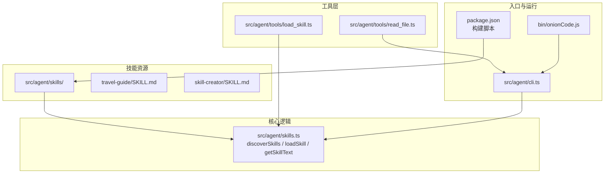
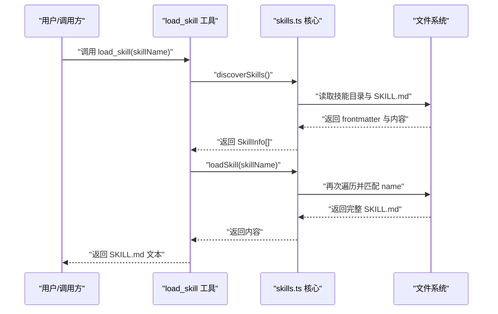
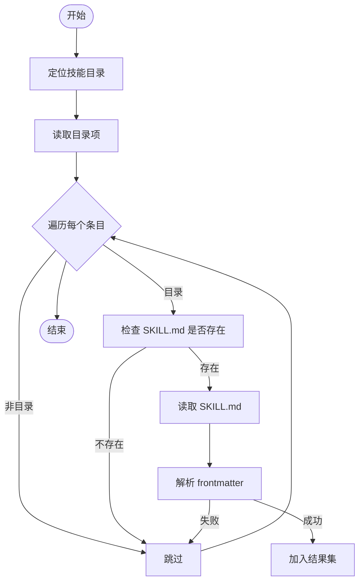
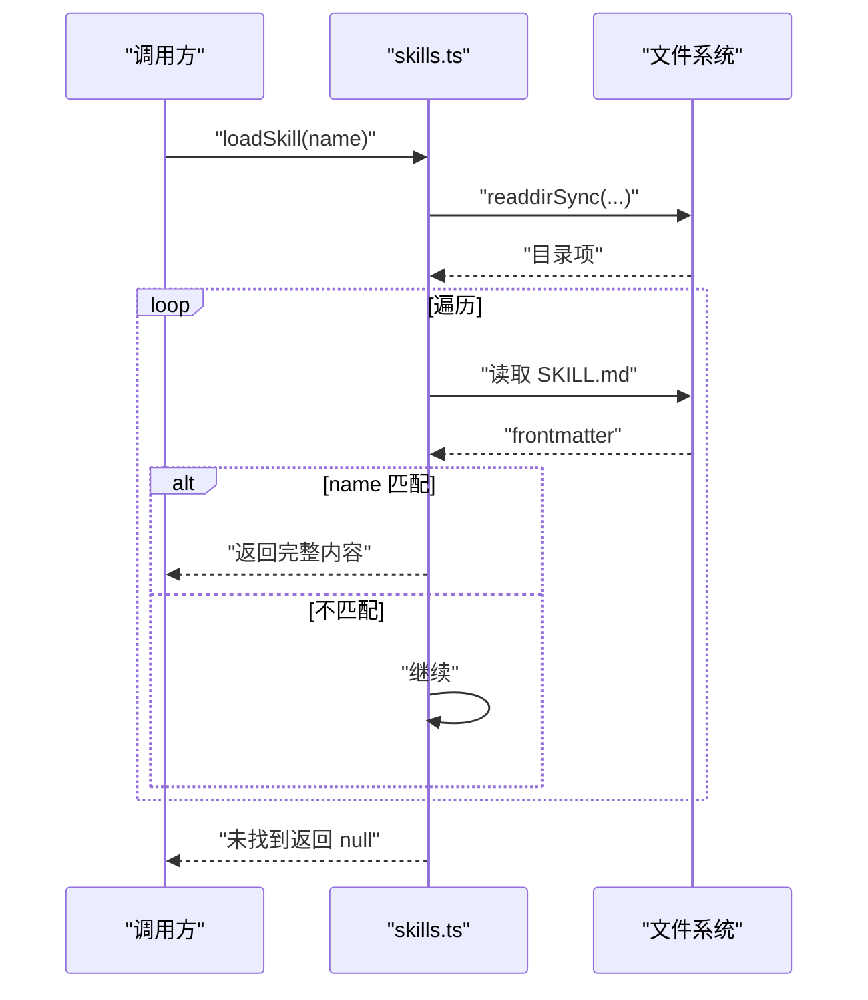
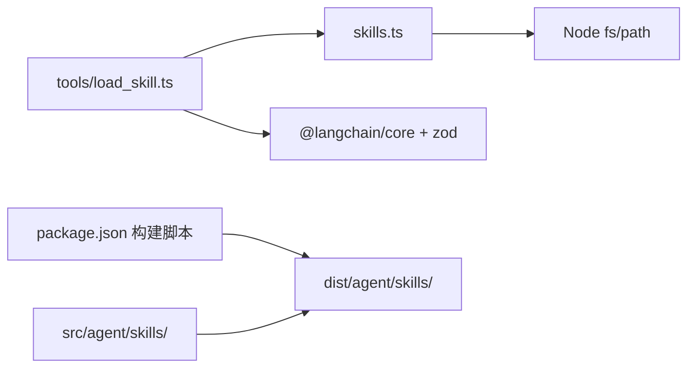

# 技能发现与加载

<cite>
**本文档引用的文件**
- [src/agent/skills.ts](file://src/agent/skills.ts)
- [src/agent/tools/load_skill.ts](file://src/agent/tools/load_skill.ts)
- [src/agent/tools/read_file.ts](file://src/agent/tools/read_file.ts)
- [src/agent/skills/skill-creator/SKILL.md](file://src/agent/skills/skill-creator/SKILL.md)
- [src/agent/skills/travel-guide/SKILL.md](file://src/agent/skills/travel-guide/SKILL.md)
- [src/agent/tools/load_skill.test.ts](file://src/agent/tools/load_skill.test.ts)
- [src/agent/tools/read_file.test.ts](file://src/agent/tools/read_file.test.ts)
- [package.json](file://package.json)
- [bin/onionCode.js](file://bin/onionCode.js)
- [src/agent/cli.ts](file://src/agent/cli.ts)
</cite>

## 更新摘要
**所做更改**
- 增强了技能发现机制的环境兼容性，改进了开发和生产环境的可靠定位
- 优化了错误处理策略，提供更好的健壮性和用户体验
- 完善了目录定位逻辑，确保在不同部署环境下都能稳定工作
- 改进了工具层的错误提示，提供更友好的用户反馈

## 目录
1. [引言](#引言)
2. [项目结构](#项目结构)
3. [核心组件](#核心组件)
4. [架构总览](#架构总览)
5. [详细组件分析](#详细组件分析)
6. [依赖分析](#依赖分析)
7. [性能考虑](#性能考虑)
8. [故障排查指南](#故障排查指南)
9. [结论](#结论)
10. [附录](#附录)

## 引言
本文件围绕"技能发现与加载"机制进行系统化技术说明，覆盖以下要点：
- 技能发现算法：目录遍历策略、SKILL.md 的 YAML frontmatter 解析、前端数据提取思路
- 技能加载流程：从名称匹配到完整内容读取的全过程
- 技能清单生成：技能信息结构体定义、错误处理策略与性能优化
- 实际使用示例：discoverSkills()、loadSkill()、getSkillText() 的调用方式与常见问题解决

**更新** 本次更新重点改进了技能发现机制的环境兼容性，增强了开发和生产环境的可靠性，并优化了错误处理策略。

## 项目结构
本项目采用"功能分层 + 目录即命名空间"的组织方式：
- 技能资源位于 src/agent/skills/ 下，每个子目录代表一个技能包，包含 SKILL.md 作为技能元数据与主体说明
- 工具层位于 src/agent/tools/，提供 load_skill 等工具，封装对技能系统的调用
- CLI 层位于 src/agent/cli.ts，负责启动交互式会话与错误格式化
- 构建脚本在 package.json 中定义，构建时会复制 src/agent/skills 到 dist/agent/skills

**图表来源**
- [src/agent/skills.ts:1-138](file://src/agent/skills.ts#L1-L138)
- [src/agent/tools/load_skill.ts:1-35](file://src/agent/tools/load_skill.ts#L1-L35)
- [src/agent/tools/read_file.ts:1-42](file://src/agent/tools/read_file.ts#L1-L42)
- [src/agent/skills/travel-guide/SKILL.md:1-105](file://src/agent/skills/travel-guide/SKILL.md#L1-L105)
- [src/agent/skills/skill-creator/SKILL.md:1-486](file://src/agent/skills/skill-creator/SKILL.md#L1-L486)
- [src/agent/cli.ts:1-127](file://src/agent/cli.ts#L1-L127)
- [bin/onionCode.js:1-3](file://bin/onionCode.js#L1-L3)
- [package.json:11-16](file://package.json#L11-L16)

**章节来源**
- [package.json:11-16](file://package.json#L11-L16)
- [bin/onionCode.js:1-3](file://bin/onionCode.js#L1-L3)
- [src/agent/cli.ts:1-127](file://src/agent/cli.ts#L1-L127)

## 核心组件
本节聚焦技能发现与加载的核心实现，包括接口定义、解析器、目录遍历与加载函数。

- 技能清单结构体
  - SkillManifest：name、description
  - SkillInfo：在 SkillManifest 基础上扩展 dir（技能目录路径）

- YAML frontmatter 解析
  - 使用正则匹配三短划线包裹的 YAML 区块
  - 提取 name 与 description 字段，若缺失则判定为无效

- 目录定位策略
  - 优先定位到 src/agent/skills（开发态与构建后同位置）
  - 若检测不到关键技能目录，则回退到 ../src/agent/skills（构建后未复制时的兜底）
  - 最终兜底仍指向主路径

- 发现与加载流程
  - discoverSkills：遍历技能目录，读取每个 SKILL.md 的 frontmatter，组装 SkillInfo[]
  - loadSkill：按 name 查找并返回完整 SKILL.md 文本
  - getSkillText：将所有技能 name/description 拼接为系统提示可用技能列表

**更新** 新增了增强的目录定位策略，通过存在性检查确保在不同环境下的可靠定位。

**章节来源**
- [src/agent/skills.ts:4-11](file://src/agent/skills.ts#L4-L11)
- [src/agent/skills.ts:14-28](file://src/agent/skills.ts#L14-L28)
- [src/agent/skills.ts:30-47](file://src/agent/skills.ts#L30-L47)
- [src/agent/skills.ts:53-84](file://src/agent/skills.ts#L53-L84)
- [src/agent/skills.ts:90-118](file://src/agent/skills.ts#L90-L118)
- [src/agent/skills.ts:126-137](file://src/agent/skills.ts#L126-L137)

## 架构总览
技能系统通过"工具层 -> 核心逻辑 -> 技能资源"的链路工作。工具层提供对外 API（如 load_skill），核心逻辑负责发现与加载，技能资源以 SKILL.md 为统一入口。

**图表来源**
- [src/agent/tools/load_skill.ts:6-34](file://src/agent/tools/load_skill.ts#L6-L34)
- [src/agent/skills.ts:53-84](file://src/agent/skills.ts#L53-L84)
- [src/agent/skills.ts:90-118](file://src/agent/skills.ts#L90-L118)

## 详细组件分析

### 技能发现算法（discoverSkills）
- 目录遍历策略
  - 使用同步 readdir，withFileTypes 获取目录项
  - 仅处理子目录，跳过非目录项
  - 对每个子目录拼接 SKILL.md 路径并判断存在性
- frontmatter 解析
  - 三短划线区块匹配
  - name/description 提取，任一缺失则丢弃该技能
- 结果聚合
  - 将 name、description、dir 组装为 SkillInfo 并加入数组
- 错误处理
  - 目录读取异常直接返回空数组
  - 单个技能读取失败时跳过，不影响其他技能

**图表来源**
- [src/agent/skills.ts:53-84](file://src/agent/skills.ts#L53-L84)
- [src/agent/skills.ts:14-28](file://src/agent/skills.ts#L14-L28)

**章节来源**
- [src/agent/skills.ts:53-84](file://src/agent/skills.ts#L53-L84)
- [src/agent/skills.ts:14-28](file://src/agent/skills.ts#L14-L28)

### SKILL.md 文件解析（frontmatter）
- 解析规则
  - YAML frontmatter 由三短划线包裹
  - 严格匹配 name 与 description 字段
- 前端数据提取思路
  - 识别 frontmatter 区块边界
  - 提取 name/description 作为元数据
  - 保留其余 Markdown 内容作为技能正文
- 兼容性与健壮性
  - 缺失字段或格式不规范时视为无效
  - 建议在前端渲染时对 name/description 进行必要校验与转义

**章节来源**
- [src/agent/skills.ts:14-28](file://src/agent/skills.ts#L14-L28)
- [src/agent/skills/skill-creator/SKILL.md:1-4](file://src/agent/skills/skill-creator/SKILL.md#L1-L4)
- [src/agent/skills/travel-guide/SKILL.md:1-4](file://src/agent/skills/travel-guide/SKILL.md#L1-L4)

### 技能加载流程（loadSkill）
- 名称匹配
  - 与 discoverSkills 同步遍历策略
  - 逐个读取 SKILL.md frontmatter，比较 name 字段
- 完整内容读取
  - 找到匹配项后返回完整文本
- 错误处理
  - 目录读取异常返回 null
  - 单个文件读取异常继续下一个

**图表来源**
- [src/agent/skills.ts:90-118](file://src/agent/skills.ts#L90-L118)

**章节来源**
- [src/agent/skills.ts:90-118](file://src/agent/skills.ts#L90-L118)

### 技能清单生成（getSkillText）
- 数据来源
  - 调用 discoverSkills 获取 SkillInfo[]
- 文本格式
  - 生成"可用技能"标题与列表
  - 每行格式为"- **技能名**: 描述"
  - 末尾添加使用指引
- 性能与健壮性
  - 当无技能时返回空字符串
  - 适合注入系统提示，帮助模型选择合适技能

**章节来源**
- [src/agent/skills.ts:126-137](file://src/agent/skills.ts#L126-L137)
- [src/agent/skills.ts:53-84](file://src/agent/skills.ts#L53-L84)

### 工具层集成（load_skill）
- 输入校验与错误提示
  - 先通过 discoverSkills 获取可用技能列表
  - 若目标技能不存在，返回包含可用技能列表的错误消息
- 输出
  - 成功时返回 SKILL.md 完整内容
  - 失败时返回通用错误消息

**更新** 改进了错误提示的友好性，提供更清晰的可用技能列表反馈。

**章节来源**
- [src/agent/tools/load_skill.ts:6-34](file://src/agent/tools/load_skill.ts#L6-L34)
- [src/agent/skills.ts:53-84](file://src/agent/skills.ts#L53-L84)
- [src/agent/skills.ts:90-118](file://src/agent/skills.ts#L90-L118)

### 目录定位与构建复制（getSkillsDir）
- 优先级
  - src/agent/skills（开发态与构建后）
  - ../src/agent/skills（构建后未复制时的回退）
  - 主路径兜底
- 构建脚本
  - package.json 的 build 脚本显式复制 src/agent/skills 到 dist/agent/skills

**更新** 新增了智能的目录定位策略，通过存在性检查确保在不同环境下的可靠工作。

**章节来源**
- [src/agent/skills.ts:30-47](file://src/agent/skills.ts#L30-L47)
- [package.json:14](file://package.json#L14)

### 前端数据提取方法（概念性说明）
- 识别 frontmatter 区块
  - 以 "---" 作为起止标记
- 提取字段
  - name：技能标识符
  - description：触发条件与能力描述
- 渲染建议
  - 将 name/description 用于技能卡片展示
  - 将正文内容用于"展开阅读"或"快速预览"

（本小节为概念性说明，不直接分析具体源码文件）

## 依赖分析
- 模块耦合
  - tools/load_skill.ts 依赖 skills.ts 的 discoverSkills 与 loadSkill
  - skills.ts 依赖 Node.js fs/path 标准库
- 外部依赖
  - @langchain/core/zod 用于工具定义与参数校验
  - 构建阶段复制技能资源至 dist

**图表来源**
- [src/agent/tools/load_skill.ts:1-35](file://src/agent/tools/load_skill.ts#L1-L35)
- [src/agent/skills.ts:1-138](file://src/agent/skills.ts#L1-L138)
- [package.json:14](file://package.json#L14)

**章节来源**
- [src/agent/tools/load_skill.ts:1-35](file://src/agent/tools/load_skill.ts#L1-L35)
- [src/agent/skills.ts:1-138](file://src/agent/skills.ts#L1-L138)
- [package.json:14](file://package.json#L14)

## 性能考虑
- 时间复杂度
  - discoverSkills：O(N) 遍历技能目录，N 为子目录数量；每次读取 frontmatter 为 O(M)，M 为 SKILL.md 行数
  - loadSkill：最坏 O(N×M)，命中后可提前返回
- I/O 优化
  - 使用同步 readdir 与读取，减少异步开销
  - 建议在高频场景引入缓存：对已读取的 SKILL.md 内容与 frontmatter 进行内存缓存
- 目录定位
  - getSkillsDir 通过存在性检查快速定位，避免不必要的路径拼接
- 构建复制
  - 构建脚本一次性复制技能资源，避免运行时动态扫描

**更新** 新增了智能的目录定位策略，通过存在性检查提高环境兼容性，减少路径解析错误。

## 故障排查指南
- "找不到技能"
  - 确认技能目录存在且包含 SKILL.md
  - 检查 frontmatter 是否包含合法的 name/description
  - 使用 getSkillText 确认系统提示中是否列出该技能
- "加载失败"
  - 检查文件权限与路径
  - 确认构建后 dist/agent/skills 是否正确复制
- "路径越权/安全限制"
  - read_file 工具对路径进行相对化检查，禁止越出当前目录
  - 写入与执行类工具同样具备危险 API 检测与阻断
- "环境兼容性问题"
  - getSkillsDir 会自动检测开发环境和生产环境的不同需求
  - 如果技能目录不存在，会自动回退到 ../src/agent/skills
- "测试用例参考"
  - load_skill.test.ts 展示了正常加载与错误返回的行为
  - read_file.test.ts 展示了路径越权与文件不存在的错误处理

**更新** 新增了环境兼容性问题的排查指导，包括智能目录定位和回退机制。

**章节来源**
- [src/agent/tools/load_skill.test.ts:1-45](file://src/agent/tools/load_skill.test.ts#L1-L45)
- [src/agent/tools/read_file.test.ts:1-47](file://src/agent/tools/read_file.test.ts#L1-L47)
- [src/agent/tools/read_file.ts:7-41](file://src/agent/tools/read_file.ts#L7-L41)

## 结论
本机制以"目录即技能包、SKILL.md 为统一入口"的设计，实现了简洁而可靠的技能发现与加载流程。通过 frontmatter 元数据驱动的匹配与系统提示注入，既保证了易用性，也为后续扩展（如触发优化、批量评估）提供了良好基础。建议在生产环境中结合缓存与监控，进一步提升稳定性与性能。

**更新** 本次更新显著增强了技能发现机制的环境兼容性和错误处理能力，通过智能目录定位和友好的错误提示，为用户提供更加可靠的技能管理体验。

## 附录

### API 一览（调用路径）
- discoverSkills()
  - 路径：[src/agent/skills.ts:53-84](file://src/agent/skills.ts#L53-L84)
- loadSkill(name)
  - 路径：[src/agent/skills.ts:90-118](file://src/agent/skills.ts#L90-L118)
- getSkillText()
  - 路径：[src/agent/skills.ts:126-137](file://src/agent/skills.ts#L126-L137)
- load_skill 工具
  - 路径：[src/agent/tools/load_skill.ts:6-34](file://src/agent/tools/load_skill.ts#L6-L34)

### 示例用法（调用路径）
- 在工具层调用
  - 路径：[src/agent/tools/load_skill.ts:6-34](file://src/agent/tools/load_skill.ts#L6-L34)
- 在 CLI 中触发
  - 路径：[src/agent/cli.ts:1-127](file://src/agent/cli.ts#L1-L127)
  - 入口脚本：[bin/onionCode.js:1-3](file://bin/onionCode.js#L1-L3)