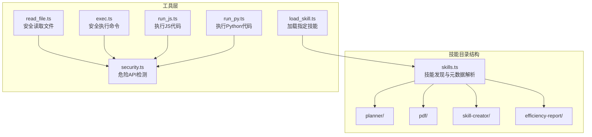
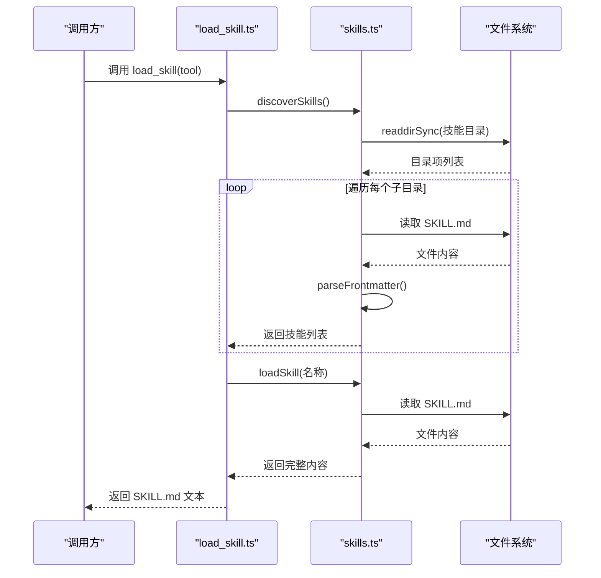
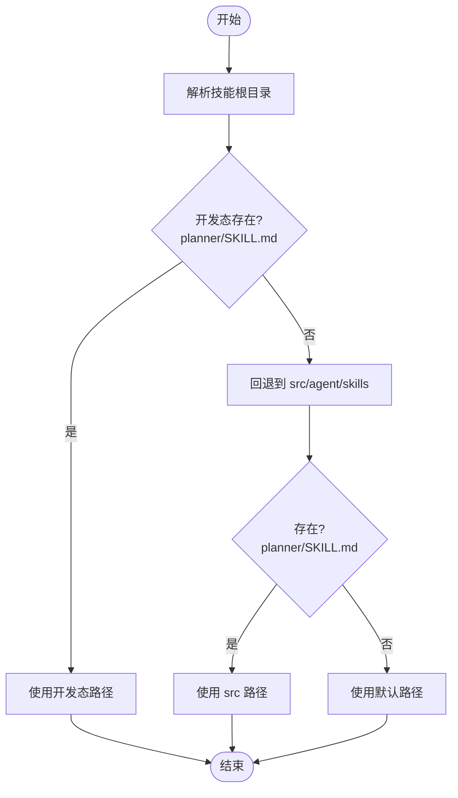
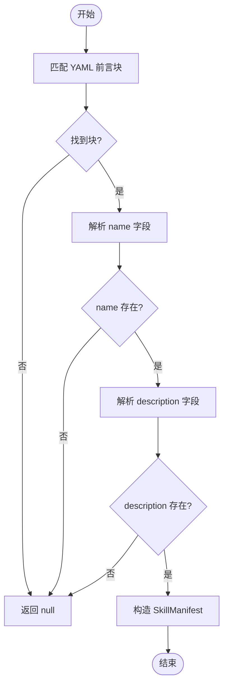
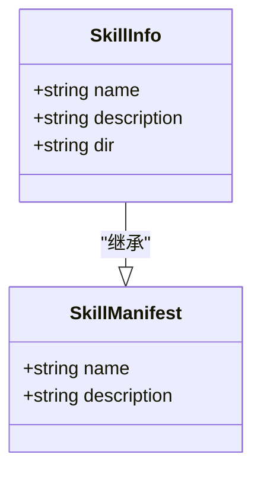
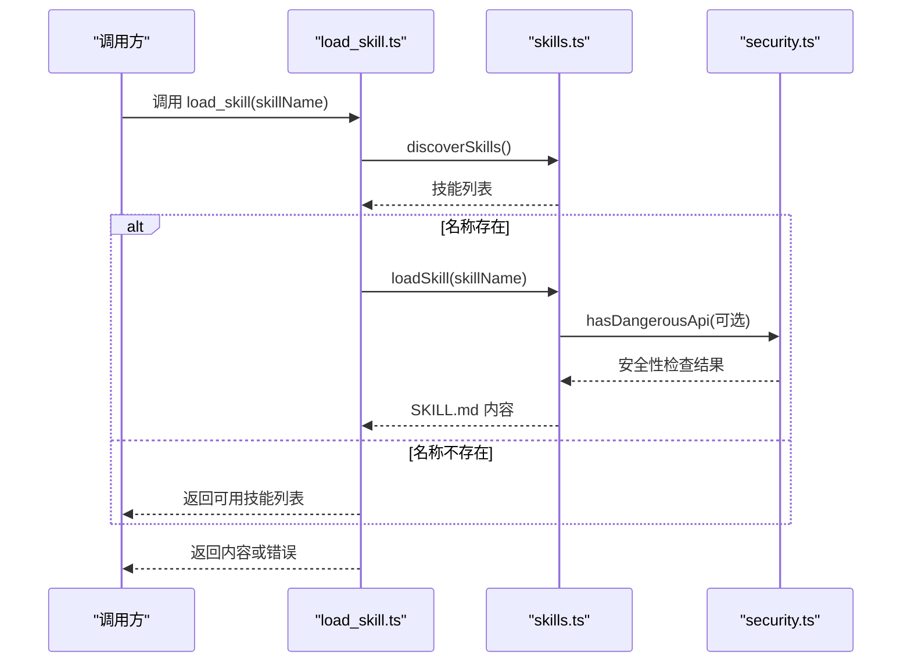

# 技能架构设计

<cite>
**本文引用的文件**
- [skills.ts](file://src/agent/skills.ts)
- [load_skill.ts](file://src/agent/tools/load_skill.ts)
- [read_file.ts](file://src/agent/tools/read_file.ts)
- [security.ts](file://src/agent/tools/security.ts)
- [exec.ts](file://src/agent/tools/exec.ts)
- [run_js.ts](file://src/agent/tools/run_js.ts)
- [run_py.ts](file://src/agent/tools/run_py.ts)
- [planner/SKILL.md](file://src/agent/skills/planner/SKILL.md)
- [pdf/SKILL.md](file://src/agent/skills/pdf/SKILL.md)
- [skill-creator/SKILL.md](file://src/agent/skills/skill-creator/SKILL.md)
- [efficiency-report/SKILL.md](file://src/agent/skills/efficiency-report/SKILL.md)
</cite>

## 目录
1. [简介](#简介)
2. [项目结构](#项目结构)
3. [核心组件](#核心组件)
4. [架构总览](#架构总览)
5. [详细组件分析](#详细组件分析)
6. [依赖关系分析](#依赖关系分析)
7. [性能考量](#性能考量)
8. [故障排查指南](#故障排查指南)
9. [结论](#结论)
10. [附录](#附录)

## 简介
本文件系统性阐述“技能架构”的设计与实现，围绕以下目标展开：
- 技能发现机制：getSkillsDir() 的路径解析逻辑与目录遍历策略
- YAML frontmatter 解析：SKILL.md 前言字段的匹配规则与错误处理
- 接口设计：SkillManifest 与 SkillInfo 的数据结构与职责边界
- 关键函数实现：discoverSkills() 与 loadSkill() 的文件系统操作、异常处理与性能优化
- 最佳实践：技能目录结构、命名规范与安全约束

## 项目结构
技能系统位于 src/agent/skills/ 下，每个技能以独立子目录组织，核心入口为 skills.ts；对外通过工具接口暴露能力，例如 load_skill.ts。



**图表来源**
- [skills.ts:1-142](file://src/agent/skills.ts#L1-L142)
- [load_skill.ts:1-32](file://src/agent/tools/load_skill.ts#L1-L32)
- [read_file.ts:1-40](file://src/agent/tools/read_file.ts#L1-L40)
- [exec.ts:1-142](file://src/agent/tools/exec.ts#L1-L142)
- [run_js.ts:1-89](file://src/agent/tools/run_js.ts#L1-L89)
- [run_py.ts:1-94](file://src/agent/tools/run_py.ts#L1-L94)
- [security.ts:1-27](file://src/agent/tools/security.ts#L1-L27)

**章节来源**
- [skills.ts:1-142](file://src/agent/skills.ts#L1-L142)

## 核心组件
- SkillManifest：技能元数据的最小集合，包含 name 与 description
- SkillInfo：在 SkillManifest 基础上增加 dir 字段，用于定位技能目录
- parseFrontmatter(content)：从 SKILL.md 中提取 YAML frontmatter 的 name 与 description
- getSkillsDir()：解析技能根目录，支持开发态与构建态两种布局
- discoverSkills()：遍历技能目录，收集所有可用技能的元数据
- loadSkill(name)：按名称精确加载完整 SKILL.md 内容
- getSkillText()：生成可用于系统提示词的技能清单文本

**章节来源**
- [skills.ts:7-141](file://src/agent/skills.ts#L7-L141)

## 架构总览
技能发现与加载的整体流程如下：



**图表来源**
- [load_skill.ts:5-22](file://src/agent/tools/load_skill.ts#L5-L22)
- [skills.ts:56-121](file://src/agent/skills.ts#L56-L121)

## 详细组件分析

### getSkillsDir() 路径解析与目录遍历策略
- 解析逻辑
  - 优先定位当前模块所在目录下的 skills 子目录
  - 通过存在性校验（如 planner/SKILL.md）判断是否为开发态或构建态
  - 若开发态不可用，则回退到 src/agent/skills
  - 默认回退到主路径，保证在极端情况下仍可工作
- 目录遍历策略
  - 使用同步 readdirSync 并 withFileTypes 获取目录项
  - 仅处理目录项，跳过文件
  - 对每个子目录检查是否存在 SKILL.md，不存在则跳过
  - 读取并解析 frontmatter，组装 SkillInfo 列表



**图表来源**
- [skills.ts:35-50](file://src/agent/skills.ts#L35-L50)

**章节来源**
- [skills.ts:35-50](file://src/agent/skills.ts#L35-L50)

### YAML Frontmatter 解析：匹配规则与错误处理
- 匹配规则
  - 使用三短划线界定的块，捕获块内文本
  - 逐行匹配 name 与 description 字段，支持换行与空白字符
  - 任一字段缺失即判定为无效 frontmatter
- 错误处理
  - 未找到 frontmatter 或字段缺失时返回空，上层逻辑将其忽略
  - 读取文件异常时捕获并跳过该技能，保证整体发现流程不中断



**图表来源**
- [skills.ts:17-31](file://src/agent/skills.ts#L17-L31)

**章节来源**
- [skills.ts:17-31](file://src/agent/skills.ts#L17-L31)

### 接口设计：SkillManifest 与 SkillInfo
- SkillManifest
  - 字段：name（字符串）、description（字符串）
  - 用途：作为最小元数据载体，用于技能列表展示与匹配
- SkillInfo
  - 继承：SkillManifest
  - 新增：dir（字符串，技能目录绝对路径）
  - 用途：在发现阶段附加目录信息，便于后续加载完整内容



**图表来源**
- [skills.ts:7-14](file://src/agent/skills.ts#L7-L14)

**章节来源**
- [skills.ts:7-14](file://src/agent/skills.ts#L7-L14)

### discoverSkills() 实现细节
- 文件系统操作
  - 同步读取目录，withFileTypes 获取类型信息
  - 遍历子目录，检查 SKILL.md 是否存在
  - 读取文件内容并解析 frontmatter
- 异常处理
  - 目录读取失败时直接返回空数组
  - 单个技能读取失败时捕获并跳过，不影响其他技能
- 性能优化
  - 使用同步 API 降低异步开销，适合启动期一次性扫描
  - 早期短路：未找到 frontmatter 即跳过，减少后续处理

**章节来源**
- [skills.ts:56-86](file://src/agent/skills.ts#L56-L86)

### loadSkill(name) 实现细节
- 匹配策略
  - 与 discoverSkills() 类似的目录遍历与 frontmatter 解析
  - 当 frontmatter.name 与请求名称一致时，返回完整 SKILL.md 内容
- 异常处理
  - 目录读取失败返回 null
  - 单个文件读取失败返回 null，保证健壮性
- 性能优化
  - 采用顺序扫描，复杂度 O(N)，N 为技能数量
  - 一旦命中立即返回，避免全量遍历

**章节来源**
- [skills.ts:93-121](file://src/agent/skills.ts#L93-L121)

### getSkillText()：系统提示词注入
- 功能
  - 生成技能清单文本，包含技能目录路径与技能条目
  - 为模型提供“新增技能”的指导信息
- 输出结构
  - 标题与目录路径
  - 技能列表（name 与 description）
  - 使用指引

**章节来源**
- [skills.ts:127-141](file://src/agent/skills.ts#L127-L141)

### 工具层与安全约束
- load_skill 工具
  - 先通过 discoverSkills() 验证名称存在性
  - 再调用 loadSkill() 获取内容
  - 若名称不存在，返回可用技能列表，便于用户修正
- 安全约束
  - readFile/exec/run_js/run_py 均集成危险 API 检测
  - 通过 hasDangerousApi() 与命令黑名单、eval 模式检测，阻断高危操作
  - 对路径进行相对化校验，防止目录穿越



**图表来源**
- [load_skill.ts:5-22](file://src/agent/tools/load_skill.ts#L5-L22)
- [skills.ts:56-121](file://src/agent/skills.ts#L56-L121)
- [security.ts:24-26](file://src/agent/tools/security.ts#L24-L26)

**章节来源**
- [load_skill.ts:5-22](file://src/agent/tools/load_skill.ts#L5-L22)
- [security.ts:1-27](file://src/agent/tools/security.ts#L1-L27)

## 依赖关系分析
- 模块耦合
  - skills.ts 与工具层通过导出函数解耦，工具层仅依赖 discoverSkills()/loadSkill()
  - 安全模块 security.ts 被 exec/run_js/run_py/read_file 等工具复用
- 外部依赖
  - Node.js 文件系统与路径模块
  - LangChain 工具装饰器与 Zod 参数校验
- 潜在循环依赖
  - 未见循环导入；工具层对 skills.ts 的依赖为单向

```mermaid
graph LR
ST["skills.ts"] <- --> LT["load_skill.ts"]
ST -.-> TXT["getSkillText()"]
SEC["security.ts"] --> EX["exec.ts"]
SEC --> RJ["run_js.ts"]
SEC --> RP["run_py.ts"]
SEC --> RF["read_file.ts"]
```

**图表来源**
- [skills.ts:1-142](file://src/agent/skills.ts#L1-L142)
- [load_skill.ts:1-32](file://src/agent/tools/load_skill.ts#L1-L32)
- [exec.ts:1-142](file://src/agent/tools/exec.ts#L1-L142)
- [run_js.ts:1-89](file://src/agent/tools/run_js.ts#L1-L89)
- [run_py.ts:1-94](file://src/agent/tools/run_py.ts#L1-L94)
- [read_file.ts:1-40](file://src/agent/tools/read_file.ts#L1-L40)
- [security.ts:1-27](file://src/agent/tools/security.ts#L1-L27)

**章节来源**
- [skills.ts:1-142](file://src/agent/skills.ts#L1-L142)
- [load_skill.ts:1-32](file://src/agent/tools/load_skill.ts#L1-L32)
- [exec.ts:1-142](file://src/agent/tools/exec.ts#L1-L142)
- [run_js.ts:1-89](file://src/agent/tools/run_js.ts#L1-L89)
- [run_py.ts:1-94](file://src/agent/tools/run_py.ts#L1-L94)
- [read_file.ts:1-40](file://src/agent/tools/read_file.ts#L1-L40)
- [security.ts:1-27](file://src/agent/tools/security.ts#L1-L27)

## 性能考量
- 发现阶段
  - 使用同步 readdirSync，避免异步调度开销，适合启动期一次性扫描
  - 早停策略：frontmatter 缺失即跳过，减少 IO 与解析成本
- 加载阶段
  - 顺序扫描，命中即返回；若需频繁按名称查询，可考虑缓存 discoverResults
- I/O 优化
  - 避免重复读取同一文件；在工具层已做存在性预检
- 并发与超时
  - 当前实现为同步阻塞；若未来引入并发，需设置超时与缓冲区上限

[本节为通用性能讨论，无需特定文件来源]

## 故障排查指南
- “找不到技能”
  - 现象：load_skill 返回错误，包含可用技能列表
  - 排查：确认名称大小写与拼写；检查 SKILL.md 是否存在且 frontmatter 完整
- “目录读取失败”
  - 现象：discoverSkills() 返回空数组
  - 排查：确认 getSkillsDir() 解析路径是否正确；检查权限与目录结构
- “frontmatter 解析失败”
  - 现象：某些技能未出现在列表中
  - 排查：确认 YAML 前言块格式正确，name/description 两行均存在
- “安全拦截”
  - 现象：exec/run_js/run_py/read_file 返回危险操作被阻止
  - 排查：检查内容是否包含危险 API 模式；避免目录穿越与 eval 注入

**章节来源**
- [load_skill.ts:11-19](file://src/agent/tools/load_skill.ts#L11-L19)
- [exec.ts:94-132](file://src/agent/tools/exec.ts#L94-L132)
- [run_js.ts:22-75](file://src/agent/tools/run_js.ts#L22-L75)
- [run_py.ts:11-82](file://src/agent/tools/run_py.ts#L11-L82)
- [read_file.ts:6-31](file://src/agent/tools/read_file.ts#L6-L31)
- [security.ts:4-22](file://src/agent/tools/security.ts#L4-L22)

## 结论
技能架构通过简洁的目录约定与稳定的解析流程，实现了可扩展、可维护的技能发现与加载体系。接口设计清晰，错误处理稳健，安全约束贯穿工具链。建议在大规模场景下引入缓存与并发优化，并持续完善 frontmatter 规范与命名约定。

[本节为总结性内容，无需特定文件来源]

## 附录

### 技能目录结构与命名规范
- 目录组织
  - 每个技能独立子目录，包含 SKILL.md 与可选的 scripts/references/assets
- SKILL.md 前言
  - 必填字段：name、description
  - 可选字段：license 等
- 命名建议
  - name 使用连字符分隔的小写标识
  - description 精确描述触发条件与能力边界
- 示例参考
  - planner、pdf、skill-creator、efficiency-report 的 SKILL.md 提供了良好的范式

**章节来源**
- [planner/SKILL.md:1-4](file://src/agent/skills/planner/SKILL.md#L1-L4)
- [pdf/SKILL.md:1-5](file://src/agent/skills/pdf/SKILL.md#L1-L5)
- [skill-creator/SKILL.md:1-4](file://src/agent/skills/skill-creator/SKILL.md#L1-L4)
- [efficiency-report/SKILL.md:1-4](file://src/agent/skills/efficiency-report/SKILL.md#L1-L4)