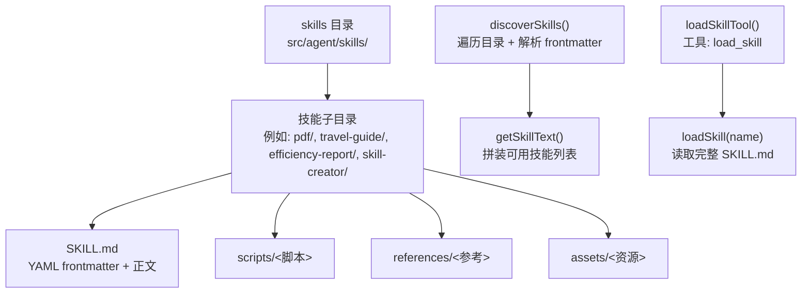
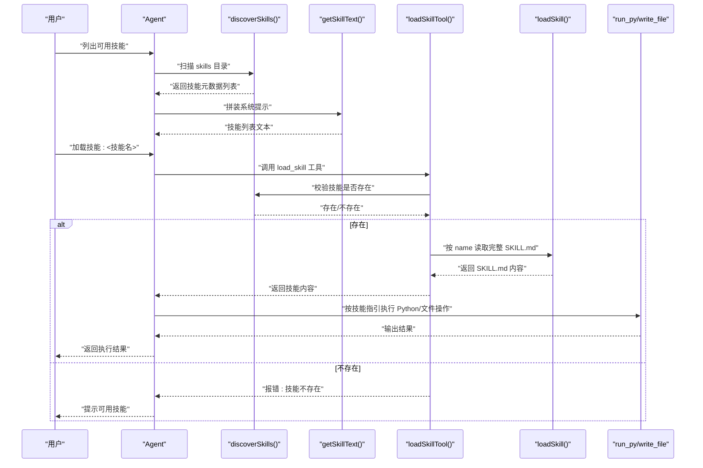
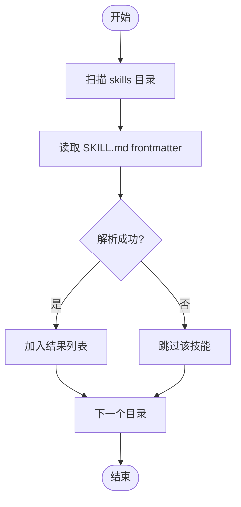
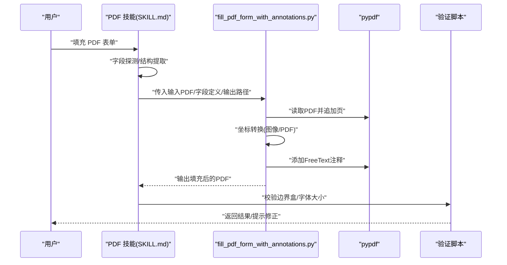
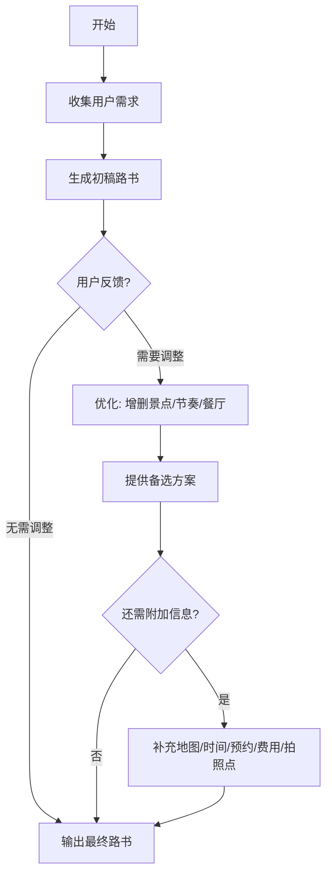
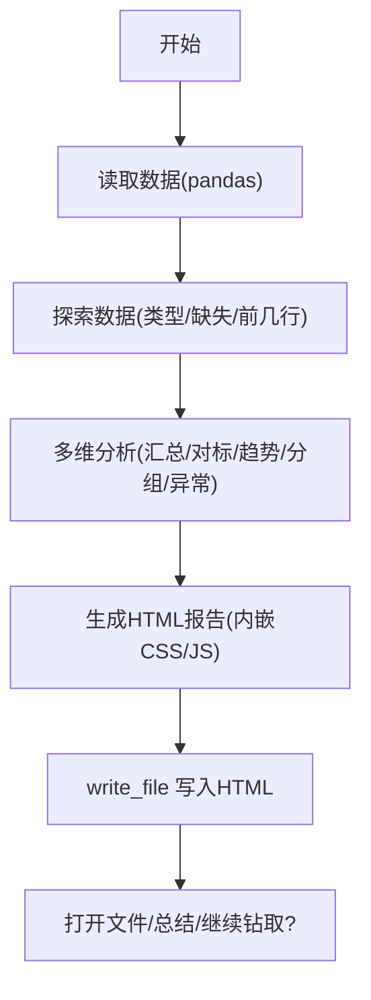
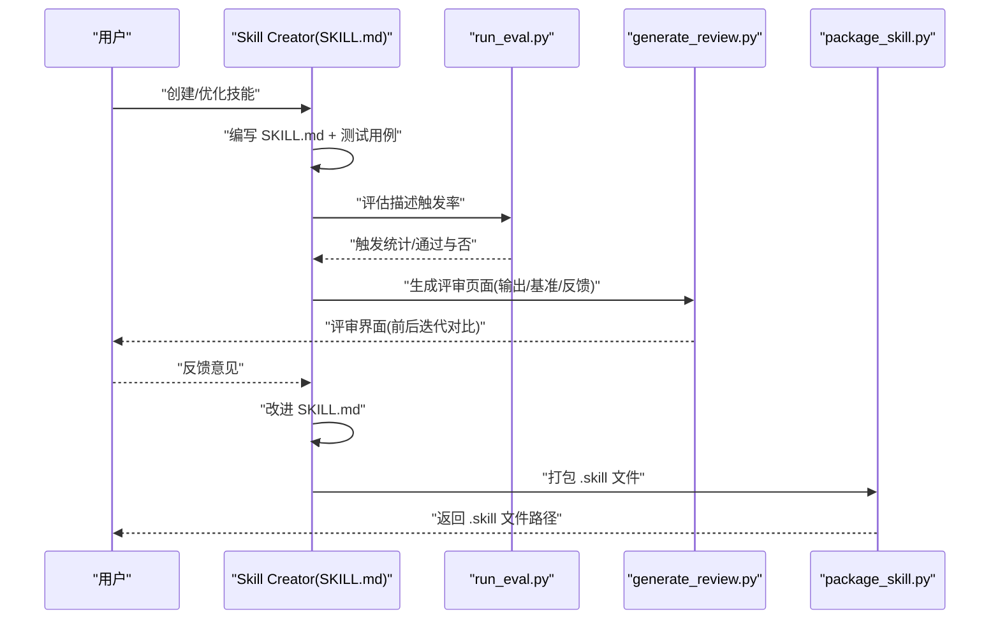
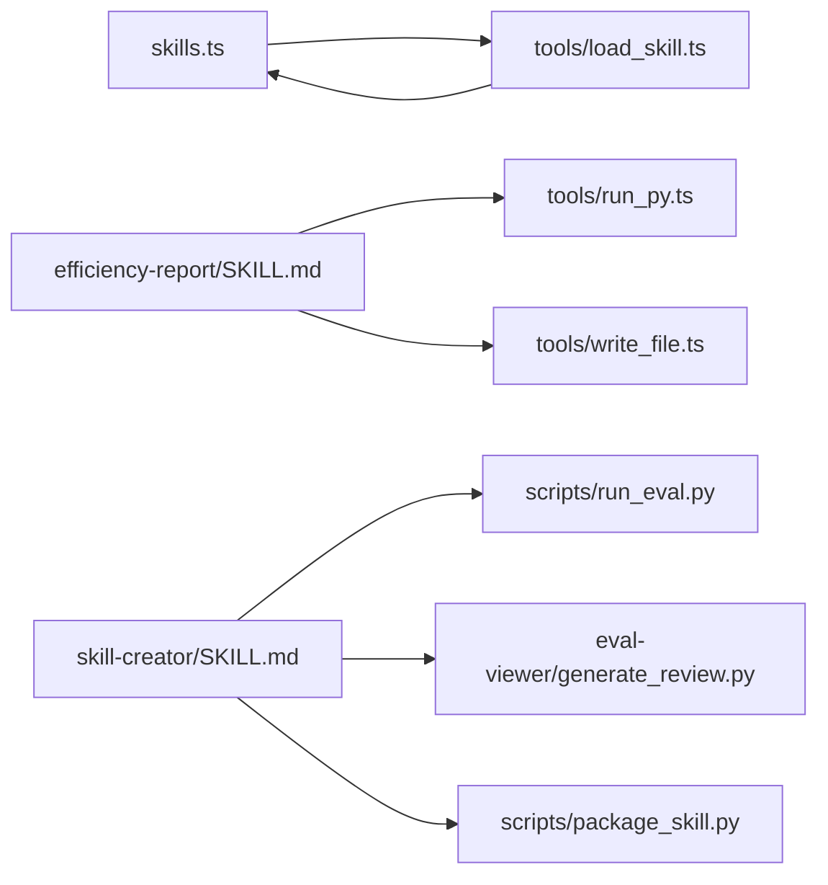

# 技能系统

<cite>
**本文引用的文件**
- [src/agent/skills.ts](file://src/agent/skills.ts)
- [src/agent/tools/load_skill.ts](file://src/agent/tools/load_skill.ts)
- [src/agent/skills/pdf/SKILL.md](file://src/agent/skills/pdf/SKILL.md)
- [src/agent/skills/pdf/forms.md](file://src/agent/skills/pdf/forms.md)
- [src/agent/skills/pdf/scripts/fill_pdf_form_with_annotations.py](file://src/agent/skills/pdf/scripts/fill_pdf_form_with_annotations.py)
- [src/agent/skills/travel-guide/SKILL.md](file://src/agent/skills/travel-guide/SKILL.md)
- [src/agent/skills/efficiency-report/SKILL.md](file://src/agent/skills/efficiency-report/SKILL.md)
- [src/agent/skills/skill-creator/SKILL.md](file://src/agent/skills/skill-creator/SKILL.md)
- [src/agent/skills/skill-creator/scripts/package_skill.py](file://src/agent/skills/skill-creator/scripts/package_skill.py)
- [src/agent/skills/skill-creator/scripts/run_eval.py](file://src/agent/skills/skill-creator/scripts/run_eval.py)
- [src/agent/skills/skill-creator/eval-viewer/generate_review.py](file://src/agent/skills/skill-creator/eval-viewer/generate_review.py)
- [src/agent/tools/run_py.ts](file://src/agent/tools/run_py.ts)
- [src/agent/tools/write_file.ts](file://src/agent/tools/write_file.ts)
</cite>

## 目录
1. [引言](#引言)
2. [项目结构](#项目结构)
3. [核心组件](#核心组件)
4. [架构总览](#架构总览)
5. [详细组件分析](#详细组件分析)
6. [依赖分析](#依赖分析)
7. [性能考虑](#性能考虑)
8. [故障排查指南](#故障排查指南)
9. [结论](#结论)
10. [附录](#附录)

## 引言
本文件系统性阐述该技能系统的动态加载机制与 SKILL.md 格式规范，详解技能发现、注册与执行流程；深入分析现有技能实现：PDF 处理技能的表单提取与填充、旅行指南技能的智能推荐流程、效率报告技能的数据分析管线、技能创建器的自动化评估体系；并提供技能开发的完整指南（模板编写、测试验证、打包发布）、协作与扩展机制说明。

## 项目结构
技能系统采用“技能即文档”的理念：每个技能以独立目录存放，根文件为 SKILL.md（包含 YAML frontmatter 与正文），可选地包含 scripts/、references/、assets/ 等资源目录。运行时通过扫描 skills 目录下的子目录，解析 SKILL.md 的 frontmatter 获取技能元数据，按需加载完整内容。

**图表来源**
- [src/agent/skills.ts:53-138](file://src/agent/skills.ts#L53-L138)
- [src/agent/tools/load_skill.ts:6-34](file://src/agent/tools/load_skill.ts#L6-L34)

**章节来源**
- [src/agent/skills.ts:30-47](file://src/agent/skills.ts#L30-L47)
- [src/agent/skills.ts:53-83](file://src/agent/skills.ts#L53-L83)
- [src/agent/skills.ts:124-138](file://src/agent/skills.ts#L124-L138)

## 核心组件
- 技能发现与元数据解析
  - discoverSkills：扫描 skills 目录，读取每个子目录的 SKILL.md，解析 YAML frontmatter（name/description），返回数组。
  - getSkillText：将已发现技能拼接为系统提示文本，指导用户新增技能的位置与方式。
- 动态加载
  - loadSkill：按 name 查找并返回完整 SKILL.md 文本。
  - loadSkillTool：LangChain 工具封装，校验技能是否存在，调用 loadSkill 并返回结果。
- 工具链
  - run_py：安全执行 Python 代码（写临时文件、超时控制、危险 API 检测）。
  - write_file：安全写文件（限制路径、危险内容检测）。

**章节来源**
- [src/agent/skills.ts:14-28](file://src/agent/skills.ts#L14-L28)
- [src/agent/skills.ts:53-83](file://src/agent/skills.ts#L53-L83)
- [src/agent/skills.ts:90-118](file://src/agent/skills.ts#L90-L118)
- [src/agent/skills.ts:124-138](file://src/agent/skills.ts#L124-L138)
- [src/agent/tools/load_skill.ts:6-34](file://src/agent/tools/load_skill.ts#L6-L34)
- [src/agent/tools/run_py.ts:12-95](file://src/agent/tools/run_py.ts#L12-L95)
- [src/agent/tools/write_file.ts:8-55](file://src/agent/tools/write_file.ts#L8-L55)

## 架构总览
技能系统由“发现-注册-执行”三层构成：发现层负责扫描与解析；注册层将技能元数据注入系统提示；执行层通过工具调用加载完整技能并在受控环境中运行。

**图表来源**
- [src/agent/skills.ts:53-83](file://src/agent/skills.ts#L53-L83)
- [src/agent/skills.ts:124-138](file://src/agent/skills.ts#L124-L138)
- [src/agent/tools/load_skill.ts:6-34](file://src/agent/tools/load_skill.ts#L6-L34)
- [src/agent/tools/run_py.ts:12-95](file://src/agent/tools/run_py.ts#L12-L95)
- [src/agent/tools/write_file.ts:8-55](file://src/agent/tools/write_file.ts#L8-L55)

## 详细组件分析

### SKILL.md 格式规范与动态加载机制
- 规范要点
  - frontmatter：name（技能标识）、description（触发条件与职责）、可选 license 等。
  - 正文：工作流、输出格式、示例、注意事项等。
  - 资源组织：scripts/（可复现的脚本）、references/（参考文档）、assets/（模板/图标/字体等）。
- 发现与加载
  - discoverSkills 遍历 skills 目录，读取每个 SKILL.md 的 frontmatter。
  - getSkillText 将技能列表注入系统提示，便于模型选择。
  - loadSkillTool 校验存在性后调用 loadSkill 返回完整内容，供执行阶段使用。

**图表来源**
- [src/agent/skills.ts:53-83](file://src/agent/skills.ts#L53-L83)
- [src/agent/skills.ts:14-28](file://src/agent/skills.ts#L14-L28)

**章节来源**
- [src/agent/skills.ts:14-28](file://src/agent/skills.ts#L14-L28)
- [src/agent/skills.ts:53-83](file://src/agent/skills.ts#L53-L83)
- [src/agent/skills.ts:124-138](file://src/agent/skills.ts#L124-L138)

### PDF 处理技能：表单提取与填充
- 能力概述
  - 支持可填写字段与注释两种填充路径：前者直接设置字段值；后者通过注释标注文本位置。
  - 提供结构化流程：字段探测、坐标转换、校验、填充、验证。
- 关键流程
  - 可填写字段：提取字段信息 → 生成字段值 → 调用脚本填充。
  - 非可填写字段：结构提取（标签、线条、复选框）或图像估计 → 坐标校验 → 注释填充。
- 脚本与工具
  - fill_pdf_form_with_annotations.py：将字段坐标转换为 PDF 坐标并添加 FreeText 注释。
  - 相关脚本：字段探测、结构提取、坐标校验、图像转换等（见 forms.md 与 scripts/）。

**图表来源**
- [src/agent/skills/pdf/SKILL.md:1-315](file://src/agent/skills/pdf/SKILL.md#L1-L315)
- [src/agent/skills/pdf/forms.md:1-295](file://src/agent/skills/pdf/forms.md#L1-L295)
- [src/agent/skills/pdf/scripts/fill_pdf_form_with_annotations.py:33-96](file://src/agent/skills/pdf/scripts/fill_pdf_form_with_annotations.py#L33-L96)

**章节来源**
- [src/agent/skills/pdf/SKILL.md:1-315](file://src/agent/skills/pdf/SKILL.md#L1-L315)
- [src/agent/skills/pdf/forms.md:1-295](file://src/agent/skills/pdf/forms.md#L1-L295)
- [src/agent/skills/pdf/scripts/fill_pdf_form_with_annotations.py:1-108](file://src/agent/skills/pdf/scripts/fill_pdf_form_with_annotations.py#L1-L108)

### 旅行指南技能：智能推荐算法与流程
- 角色与职责
  - 旅行规划师角色，依据用户偏好（天数、预算、兴趣、人数、交通方式、特殊需求）制定个性化路书。
- 工作流
  - 信息收集：目的地、天数、人数、预算、兴趣、交通、特殊需求。
  - 路书规划：按“行程总览/详细行程/美食/住宿/交通/实用贴士”结构输出。
  - 细化与调整：根据反馈优化，提供备选方案。
  - 附加信息：行程地图、时间预估、预约提醒、费用预估、拍照机位等。
- 注意事项
  - 信息时效性、节奏把控、饮食偏好、天气因素、安全提醒。

**图表来源**
- [src/agent/skills/travel-guide/SKILL.md:12-105](file://src/agent/skills/travel-guide/SKILL.md#L12-L105)

**章节来源**
- [src/agent/skills/travel-guide/SKILL.md:1-105](file://src/agent/skills/travel-guide/SKILL.md#L1-L105)

### 效率报告技能：数据分析与可视化
- 设计意图
  - 将原始效能数据转化为有洞察、有结论、有行动建议的结构化报告。
- 核心流程
  - Step 1：读取与探索数据（pandas 读取 Excel/CSV，识别列类型，展示前几行）。
  - Step 2：多维度分析（汇总统计、对标评估、趋势分析、分组对比、异常检测）。
  - Step 3：生成 HTML 报告（内嵌样式与图表，Chart.js + Font Awesome，响应式设计）。
  - Step 4：展示与解释（打开文件、总结性话语、后续钻取建议）。
- 执行约束
  - Python 代码通过 run_py 工具内联执行；HTML 文件写入使用 write_file 工具。

**图表来源**
- [src/agent/skills/efficiency-report/SKILL.md:20-319](file://src/agent/skills/efficiency-report/SKILL.md#L20-L319)
- [src/agent/tools/run_py.ts:12-95](file://src/agent/tools/run_py.ts#L12-L95)
- [src/agent/tools/write_file.ts:8-55](file://src/agent/tools/write_file.ts#L8-L55)

**章节来源**
- [src/agent/skills/efficiency-report/SKILL.md:1-319](file://src/agent/skills/efficiency-report/SKILL.md#L1-L319)
- [src/agent/tools/run_py.ts:12-95](file://src/agent/tools/run_py.ts#L12-L95)
- [src/agent/tools/write_file.ts:8-55](file://src/agent/tools/write_file.ts#L8-L55)

### 技能创建器：自动化评估与迭代
- 核心目标
  - 创建/修改/优化技能，运行评测，基准对比，描述优化，打包发布。
- 迭代闭环
  - 捕获意图 → 研究与面试 → 编写 SKILL.md → 测试用例 → 评测与评审 → 改进 → 扩展测试集 → 打包发布。
- 评测与评审
  - run_eval.py：通过 claude -p 模拟触发率评估，支持并发与阈值判定。
  - generate_review.py：生成浏览器端评审页面，支持前后迭代对比、定量基准、定性反馈。
  - package_skill.py：将技能目录打包为 .skill 文件（排除构建产物与敏感目录）。
- 描述优化
  - 自动生成触发评估查询集，评估描述触发准确率，迭代优化描述。

**图表来源**
- [src/agent/skills/skill-creator/SKILL.md:10-486](file://src/agent/skills/skill-creator/SKILL.md#L10-L486)
- [src/agent/skills/skill-creator/scripts/run_eval.py:184-256](file://src/agent/skills/skill-creator/scripts/run_eval.py#L184-L256)
- [src/agent/skills/skill-creator/eval-viewer/generate_review.py:387-472](file://src/agent/skills/skill-creator/eval-viewer/generate_review.py#L387-472)
- [src/agent/skills/skill-creator/scripts/package_skill.py:42-108](file://src/agent/skills/skill-creator/scripts/package_skill.py#L42-L108)

**章节来源**
- [src/agent/skills/skill-creator/SKILL.md:1-486](file://src/agent/skills/skill-creator/SKILL.md#L1-L486)
- [src/agent/skills/skill-creator/scripts/run_eval.py:1-311](file://src/agent/skills/skill-creator/scripts/run_eval.py#L1-L311)
- [src/agent/skills/skill-creator/eval-viewer/generate_review.py:1-472](file://src/agent/skills/skill-creator/eval-viewer/generate_review.py#L1-L472)
- [src/agent/skills/skill-creator/scripts/package_skill.py:1-137](file://src/agent/skills/skill-creator/scripts/package_skill.py#L1-L137)

## 依赖分析
- 组件耦合
  - skills.ts 与 tools/load_skill.ts 通过 loadSkill 接口耦合，前者提供发现与加载能力，后者作为工具暴露给模型。
  - 效率报告技能强依赖 run_py 与 write_file，确保代码执行与产物落盘的安全可控。
  - 技能创建器依赖 run_eval.py 与 generate_review.py 形成评测闭环。
- 外部依赖
  - Python 运行环境与第三方库（pypdf、pdfplumber、reportlab、pandas、numpy、openpyxl、pytesseract、pdf2image 等）由各技能自行管理，技能内通过脚本或工具调用执行。

**图表来源**
- [src/agent/skills.ts:53-118](file://src/agent/skills.ts#L53-L118)
- [src/agent/tools/load_skill.ts:6-34](file://src/agent/tools/load_skill.ts#L6-L34)
- [src/agent/tools/run_py.ts:12-95](file://src/agent/tools/run_py.ts#L12-L95)
- [src/agent/tools/write_file.ts:8-55](file://src/agent/tools/write_file.ts#L8-L55)
- [src/agent/skills/efficiency-report/SKILL.md:16-18](file://src/agent/skills/efficiency-report/SKILL.md#L16-L18)
- [src/agent/skills/skill-creator/SKILL.md:163-252](file://src/agent/skills/skill-creator/SKILL.md#L163-L252)
- [src/agent/skills/skill-creator/scripts/run_eval.py:184-256](file://src/agent/skills/skill-creator/scripts/run_eval.py#L184-L256)
- [src/agent/skills/skill-creator/eval-viewer/generate_review.py:387-472](file://src/agent/skills/skill-creator/eval-viewer/generate_review.py#L387-472)
- [src/agent/skills/skill-creator/scripts/package_skill.py:42-108](file://src/agent/skills/skill-creator/scripts/package_skill.py#L42-L108)

**章节来源**
- [src/agent/skills.ts:53-118](file://src/agent/skills.ts#L53-L118)
- [src/agent/tools/run_py.ts:12-95](file://src/agent/tools/run_py.ts#L12-L95)
- [src/agent/tools/write_file.ts:8-55](file://src/agent/tools/write_file.ts#L8-L55)

## 性能考虑
- 发现与加载
  - discoverSkills 遍历目录并读取 frontmatter，复杂度近似 O(N)（N 为技能数量），I/O 成本主要取决于磁盘性能。
  - getSkillText 拼装文本，成本与技能数量和描述长度线性相关。
- Python 执行
  - run_py 限制超时（默认 15 秒），避免长时间阻塞；临时文件写入与清理减少磁盘残留。
- 评测与评审
  - run_eval.py 支持多进程并发评估，提升大规模查询评估吞吐；generate_review.py 本地静态页面，零依赖，启动快。
- I/O 与安全
  - write_file 严格限制路径与内容，防止越权写入与危险内容落地。

[本节为通用性能讨论，不直接分析具体文件]

## 故障排查指南
- 技能未被发现
  - 确认 SKILL.md 存在且 frontmatter 含 name/description；检查目录权限与文件编码。
  - 参考：[src/agent/skills.ts:53-83](file://src/agent/skills.ts#L53-L83)
- 加载失败或返回空
  - 检查 loadSkill 的 name 是否与 frontmatter name 完全一致；查看系统日志。
  - 参考：[src/agent/skills.ts:90-118](file://src/agent/skills.ts#L90-L118)
- Python 执行被拦截
  - run_py 检测到危险 API（如删除、子进程、递归删除）会被拒绝；请使用受控工具链。
  - 参考：[src/agent/tools/run_py.ts:18-21](file://src/agent/tools/run_py.ts#L18-L21)
- 文件写入失败
  - write_file 检测路径越权或危险内容；确保在当前目录内写入，避免危险 API。
  - 参考：[src/agent/tools/write_file.ts:13-34](file://src/agent/tools/write_file.ts#L13-L34)
- 评测页面无法打开
  - generate_review.py 默认启动本地服务器；若端口占用或无显示，使用 --static 导出静态 HTML。
  - 参考：[src/agent/skills/skill-creator/eval-viewer/generate_review.py:431-472](file://src/agent/skills/skill-creator/eval-viewer/generate_review.py#L431-L472)

**章节来源**
- [src/agent/skills.ts:53-118](file://src/agent/skills.ts#L53-L118)
- [src/agent/tools/run_py.ts:18-21](file://src/agent/tools/run_py.ts#L18-L21)
- [src/agent/tools/write_file.ts:13-34](file://src/agent/tools/write_file.ts#L13-L34)
- [src/agent/skills/skill-creator/eval-viewer/generate_review.py:431-472](file://src/agent/skills/skill-creator/eval-viewer/generate_review.py#L431-L472)

## 结论
该技能系统以“文档即技能”的方式实现了高度模块化的动态加载与执行：通过 SKILL.md 的标准化 frontmatter 与正文，结合 discover/load 机制与受控工具链，既保证了技能的可发现性与可解释性，又确保了执行过程的安全与可控。现有技能覆盖 PDF 表单处理、旅行规划、效能分析与技能创建/评测/打包等关键场景，形成从“发现—注册—执行—评估—发布”的完整闭环。

[本节为总结性内容，不直接分析具体文件]

## 附录

### 技能开发完整指南
- 模板编写
  - 目录结构：技能根目录下至少包含 SKILL.md；必要时添加 scripts/、references/、assets/。
  - frontmatter：name（技能标识）、description（触发条件与职责）、license（可选）。
  - 正文：角色定位、工作流程、输出格式、示例、注意事项、快速参考、下一步。
  - 参考：[src/agent/skills/skill-creator/SKILL.md:71-110](file://src/agent/skills/skill-creator/SKILL.md#L71-L110)
- 测试验证
  - 编写测试用例（evals.json），在相同轮次内并行运行“含技能”与“基线”两条路径，捕获时长与 token。
  - 使用 generate_review.py 生成评审页面，进行定性与定量评估。
  - 参考：[src/agent/skills/skill-creator/SKILL.md:163-252](file://src/agent/skills/skill-creator/SKILL.md#L163-L252)
- 部署发布
  - 使用 package_skill.py 将技能目录打包为 .skill 文件，排除构建产物与敏感目录。
  - 参考：[src/agent/skills/skill-creator/scripts/package_skill.py:42-108](file://src/agent/skills/skill-creator/scripts/package_skill.py#L42-L108)

### 技能协作与扩展机制
- 协作模式
  - 评测评审：前后迭代对比，定性反馈与定量基准并重。
  - 描述优化：通过触发评估查询集优化描述，提升触发准确率。
  - 参考：[src/agent/skills/skill-creator/SKILL.md:333-405](file://src/agent/skills/skill-creator/SKILL.md#L333-L405)
- 扩展机制
  - 新增技能：在 skills 目录下创建子目录并添加 SKILL.md。
  - 资源复用：将可复现脚本放入 scripts/，参考文档放入 references/，模板与图标放入 assets/。
  - 参考：[src/agent/skills.ts:124-138](file://src/agent/skills.ts#L124-L138)