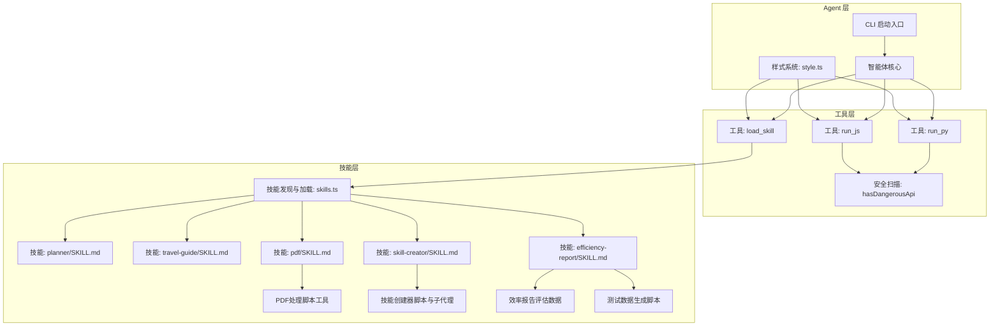
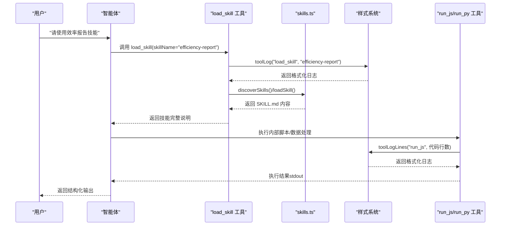
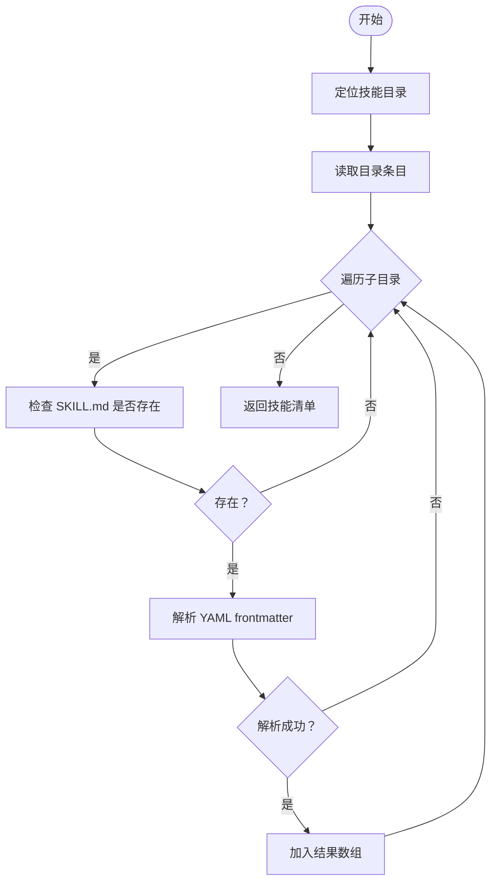
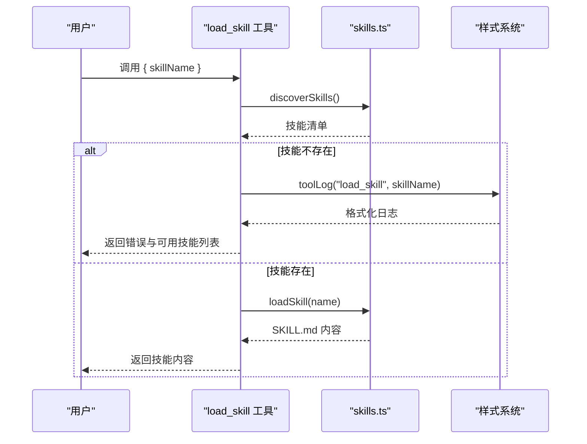
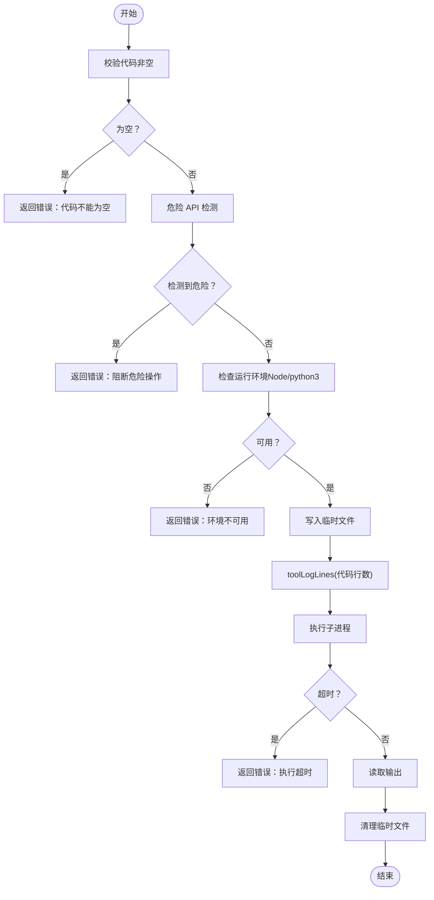
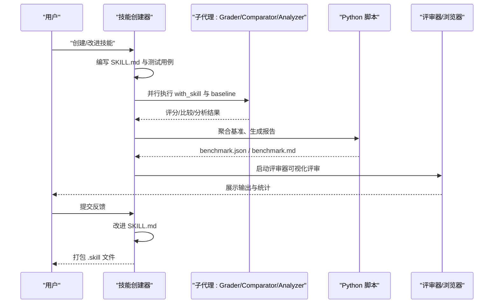
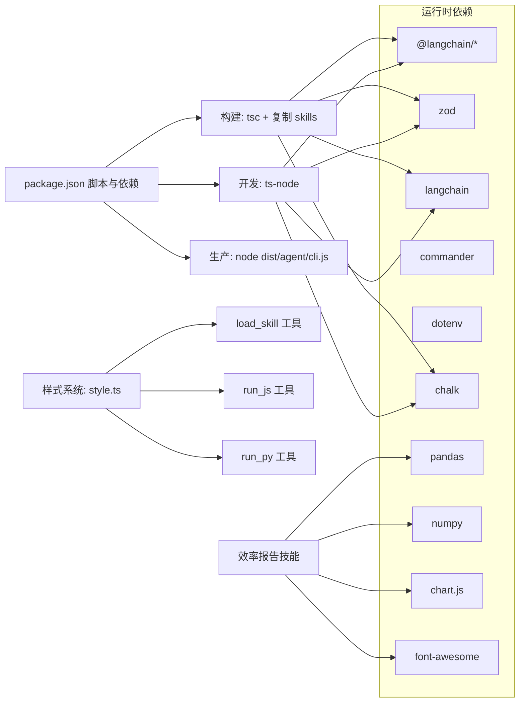

# 技能系统

<cite>
**本文引用的文件**
- [skills.ts](file://src/agent/skills.ts)
- [load_skill.ts](file://src/agent/tools/load_skill.ts)
- [style.ts](file://src/agent/style.ts)
- [run_js.ts](file://src/agent/tools/run_js.ts)
- [run_py.ts](file://src/agent/tools/run_py.ts)
- [security.ts](file://src/agent/tools/security.ts)
- [planner/SKILL.md](file://src/agent/skills/planner/SKILL.md)
- [travel-guide/SKILL.md](file://src/agent/skills/travel-guide/SKILL.md)
- [skill-creator/SKILL.md](file://src/agent/skills/skill-creator/SKILL.md)
- [pdf/SKILL.md](file://src/agent/skills/pdf/SKILL.md)
- [pdf/forms.md](file://src/agent/skills/pdf/forms.md)
- [pdf/reference.md](file://src/agent/skills/pdf/reference.md)
- [pdf/scripts/check_fillable_fields.py](file://src/agent/skills/pdf/scripts/check_fillable_fields.py)
- [pdf/scripts/extract_form_field_info.py](file://src/agent/skills/pdf/scripts/extract_form_field_info.py)
- [pdf/scripts/fill_fillable_fields.py](file://src/agent/skills/pdf/scripts/fill_fillable_fields.py)
- [pdf/scripts/extract_form_structure.py](file://src/agent/skills/pdf/scripts/extract_form_structure.py)
- [pdf/scripts/fill_pdf_form_with_annotations.py](file://src/agent/skills/pdf/scripts/fill_pdf_form_with_annotations.py)
- [package_skill.py](file://src/agent/skills/skill-creator/scripts/package_skill.py)
- [run_eval.py](file://src/agent/skills/skill-creator/scripts/run_eval.py)
- [analyzer.md](file://src/agent/skills/skill-creator/agents/analyzer.md)
- [comparator.md](file://src/agent/skills/skill-creator/agents/comparator.md)
- [grader.md](file://src/agent/skills/skill-creator/agents/grader.md)
- [efficiency-report/SKILL.md](file://src/agent/skills/efficiency-report/SKILL.md)
- [efficiency-report/evals/evals.json](file://src/agent/skills/efficiency-report/evals/evals.json)
- [efficiency-report/evals/gen_test_data.py](file://src/agent/skills/efficiency-report/evals/gen_test_data.py)
- [package.json](file://package.json)
</cite>

## 更新摘要
**变更内容**
- 新增效率报告技能模块，提供完整的工程效率数据分析和HTML报告生成功能
- 添加了Excel/CSV数据处理、多维度分析、行业基准对标、趋势分析、分组对比和异常检测等功能
- 更新了技能清单，现在包含五个示例技能
- 增强了技能系统的数据分析和可视化能力

## 目录
1. [简介](#简介)
2. [项目结构](#项目结构)
3. [核心组件](#核心组件)
4. [架构总览](#架构总览)
5. [详细组件分析](#详细组件分析)
6. [依赖分析](#依赖分析)
7. [性能考虑](#性能考虑)
8. [故障排查指南](#故障排查指南)
9. [结论](#结论)
10. [附录](#附录)

## 简介
本技能系统为一个以"技能"为核心的可扩展智能体工具集合，支持：
- 技能发现与加载：自动扫描技能目录，解析 SKILL.md 的 YAML frontmatter，提供技能清单与按名称加载能力。
- 技能清单管理：将可用技能汇总为系统提示文本，便于模型在对话中选择合适的技能。
- 技能开发与评测：内置"技能创建器"技能，提供从草稿到评测、迭代优化的全流程工作流，并配套子代理与脚本工具。
- 安全执行：对动态代码执行进行安全扫描与沙箱式临时文件执行，降低风险。
- **样式系统集成**：统一的工具调用日志输出格式，提供彩色、结构化的调试信息，提升可观测性。

系统已提供五个示例技能：
- 规划技能（planner）：帮助用户生成结构化的待办、项目计划或日程安排。
- 旅行指南技能（travel-guide）：为用户提供个性化旅行路书、美食、住宿与交通建议。
- PDF处理技能（pdf）：提供全面的PDF文件处理能力，包括文本提取、表格识别、表单填写、图像提取、OCR处理等。
- 技能创建器（skill-creator）：指导用户从零创建或改进技能，运行评测、基准对比与描述优化，并支持打包发布。
- **效率报告技能（efficiency-report）**：专门处理工程效率数据分析，生成完整的HTML可视化报告，包含Excel/CSV数据处理、多维度分析、行业基准对标等功能。

## 项目结构
仓库采用"功能模块 + 工具层 + 技能层"的分层组织：
- src/agent/skills：技能目录，每个子目录代表一个技能，包含 SKILL.md 与可选的脚本/资源。
- src/agent/tools：通用工具集，包括加载技能、执行 JS/Python、安全扫描等。
- src/agent/skills/skill-creator：技能创建器的完整工作流与配套脚本、子代理说明。
- src/agent/skills/pdf：PDF处理技能，包含完整的表单处理工作流和Python脚本工具。
- src/agent/skills/efficiency-report：**新增** 效率报告技能，提供工程效率数据分析和HTML报告生成功能。
- src/agent/style：样式系统，提供统一的日志输出格式和颜色编码。
- package.json：构建与运行脚本，包含构建时将 skills 目录复制到 dist 的逻辑。

**图表来源**
- [style.ts:16-31](file://src/agent/style.ts#L16-L31)
- [load_skill.ts:17](file://src/agent/tools/load_skill.ts#L17)
- [run_js.ts:53](file://src/agent/tools/run_js.ts#L53)
- [run_py.ts:53](file://src/agent/tools/run_py.ts#L53)

**章节来源**
- [package.json:14-14](file://package.json#L14-L14)

## 核心组件
- 技能发现与加载（skills.ts）
  - 发现技能：遍历 skills 目录，读取每个子目录下的 SKILL.md，解析 YAML frontmatter，返回技能清单（name/description/dir）。
  - 加载技能：按名称匹配 SKILL.md 的 name 字段，返回完整内容。
  - 生成技能文本：将技能清单拼接为系统提示文本，便于注入到系统提示中。
- 加载技能工具（load_skill.ts）
  - 对外暴露 load_skill 工具，先校验技能是否存在，再调用加载函数返回 SKILL.md 内容。
  - **新增样式系统集成**：使用 toolLog() 生成统一的彩色日志输出，格式为 "⚙ [工具名] called: "详情""。
- 样式系统（style.ts）
  - **工具调用日志**：toolLog() 和 toolLogLines() 函数提供统一的日志格式，包含工具名、调用状态和详细信息。
  - **品牌标识**：提供洋葱品牌的彩色输出格式。
  - **状态消息**：统一的错误、停止、再见等状态消息格式。
- 动态代码执行工具（run_js.ts、run_py.ts）
  - 安全扫描：通过正则匹配识别危险 API 调用，阻断高危操作。
  - 临时文件执行：将代码写入临时文件，使用子进程执行，设置超时与缓冲区限制，捕获错误并清理临时文件。
  - **样式系统集成**：使用 toolLogLines() 记录代码行数信息，便于调试和性能监控。
- 安全扫描（security.ts）
  - 定义危险 API 模式集合，统一供写文件与执行工具复用。

**章节来源**
- [skills.ts:53-138](file://src/agent/skills.ts#L53-L138)
- [load_skill.ts:5-34](file://src/agent/tools/load_skill.ts#L5-L34)
- [style.ts:16-31](file://src/agent/style.ts#L16-L31)
- [run_js.ts:22-89](file://src/agent/tools/run_js.ts#L22-L89)
- [run_py.ts:22-89](file://src/agent/tools/run_py.ts#L22-L89)
- [security.ts:24-26](file://src/agent/tools/security.ts#L24-L26)

## 架构总览
技能系统围绕"技能发现—技能加载—工具执行—评测与迭代"的闭环展开。智能体通过工具调用加载所需技能，结合动态代码执行工具完成复杂任务；技能创建器提供从草稿到发布的完整工作流，并通过子代理与脚本实现量化评测与可视化评审。**新增的样式系统为整个系统提供了统一的日志输出格式，增强了可观测性和调试体验。新增的效率报告技能进一步扩展了系统的数据分析和可视化能力。**

**图表来源**
- [load_skill.ts:17](file://src/agent/tools/load_skill.ts#L17)
- [style.ts:16-31](file://src/agent/style.ts#L16-L31)
- [run_js.ts:53](file://src/agent/tools/run_js.ts#L53)

## 详细组件分析

### 技能发现与加载（skills.ts）
- 设计要点
  - 使用正则解析 SKILL.md 的 YAML frontmatter，提取 name 与 description。
  - 自适应技能目录定位：优先使用 src/agent/skills，回退到 src/src/agent/skills，最终回退到原位置，确保开发与构建环境兼容。
  - 错误容忍：目录不存在或读取失败时返回空结果，避免中断主流程。
- 数据结构
  - SkillManifest：name、description
  - SkillInfo：在 SkillManifest 基础上增加 dir（技能目录绝对路径）
- 性能特征
  - O(N) 遍历技能目录，N 为技能数量；frontmatter 解析为常量开销。
  - 适合中小规模技能集（<100 个）。
- 安全与健壮性
  - 文件存在性检查与异常捕获，保证稳定性。

**图表来源**
- [skills.ts:53-84](file://src/agent/skills.ts#L53-L84)

**章节来源**
- [skills.ts:53-138](file://src/agent/skills.ts#L53-L138)

### 加载技能工具（load_skill.ts）
- 输入参数：skillName（字符串）
- 行为流程
  - discoverSkills() 校验技能是否存在，若不存在返回可用技能列表。
  - loadSkill() 按名称加载 SKILL.md 内容，返回完整文本或错误信息。
  - **新增样式系统集成**：使用 toolLog() 生成统一的彩色日志输出，格式为 "⚙ [工具名] called: "技能名""。
- 错误处理
  - 未找到技能：返回可用技能列表，便于用户修正。
  - 加载失败：返回失败提示。

**图表来源**
- [load_skill.ts:17](file://src/agent/tools/load_skill.ts#L17)
- [style.ts:16-21](file://src/agent/style.ts#L16-L21)

**章节来源**
- [load_skill.ts:5-34](file://src/agent/tools/load_skill.ts#L5-L34)

### 样式系统（style.ts）
- **工具调用日志函数**
  - toolLog(toolName: string, detail?: string): string
    - 生成带颜色的工具调用日志，格式：`⚙ [工具名] called: "详情"`
    - 使用黄色徽章显示工具名，灰色dim显示"called"标签，青色显示详细信息
  - toolLogLines(toolName: string, lines: number): string
    - 生成带代码行数的工具调用日志，格式：`⚙ [工具名] called: (行数行)`
    - 主要用于 run_js/run_py 等代码执行工具
- **品牌标识**
  - brand.onion：粗体品红色的"🧅 onion"标识
  - brand.prompt：绿色的用户输入提示符"❯ "
- **状态消息**
  - status.stopped：黄色的"⏹ 已停止"
  - status.bye：品红色的"👋 再见！"
  - status.error(msg: string)：红色的错误消息格式
- **欢迎横幅**
  - welcomeBanner(version: string)：生成统一的欢迎界面，包含品牌标识、版本号和退出提示

**章节来源**
- [style.ts:16-50](file://src/agent/style.ts#L16-L50)

### 动态代码执行工具（run_js.ts、run_py.ts）
- 安全策略
  - hasDangerousApi() 检测常见危险 API 调用（文件系统、子进程、系统调用等），阻断高危代码。
  - 临时文件执行：避免命令行转义问题，执行后清理临时文件。
- 超时与缓冲
  - 设置最大执行时间与输出缓冲上限，防止长时间运行与内存溢出。
- 错误处理
  - 捕获 stderr/stdout 与 ETIMEDOUT，返回可读错误信息。
- **样式系统集成**
  - 使用 toolLogLines() 记录代码执行的行数信息，便于调试和性能监控。
  - 日志格式：`⚙ [工具名] called: (代码行数行)`

**图表来源**
- [run_js.ts:53](file://src/agent/tools/run_js.ts#L53)
- [run_py.ts:53](file://src/agent/tools/run_py.ts#L53)
- [style.ts:26-31](file://src/agent/style.ts#L26-L31)

**章节来源**
- [run_js.ts:22-89](file://src/agent/tools/run_js.ts#L22-L89)
- [run_py.ts:22-89](file://src/agent/tools/run_py.ts#L22-L89)
- [security.ts:24-26](file://src/agent/tools/security.ts#L24-L26)

### 规划技能（planner）
- 触发条件：当用户提到"待办"、"todo"、"计划"、"任务清单"、"日程"、"schedule"、"plan"、"任务分解"、"行程"等关键词时触发。
- 核心原则：具体可执行、合理分组、明确优先级、具备时间感知。
- 输出格式：支持简单 Todo List、项目计划、日程安排三种模板，结构化展示与可读性优化。
- 注意事项：任务数量与粒度控制、语言一致性、目标拆解与灵活性。

**章节来源**
- [planner/SKILL.md:1-91](file://src/agent/skills/planner/SKILL.md#L1-L91)

### 旅行指南技能（travel-guide）
- 角色定位：经验丰富的旅行规划师，熟悉国内外热门目的地。
- 工作流程：信息收集（目的地、天数、人数、预算、兴趣、出行方式、特殊需求）、路书规划（行程总览、详细行程、美食、住宿、交通、实用贴士）、细化与调整、附加增值信息。
- 输出结构：Markdown 表格与清单，强调可读性与实用性。
- 注意事项：信息时效性、节奏把控、饮食偏好、天气因素、安全提醒。

**章节来源**
- [travel-guide/SKILL.md:1-105](file://src/agent/skills/travel-guide/SKILL.md#L1-L105)

### PDF处理技能（pdf）
- 触发条件：当用户提到".pdf"文件或需要处理PDF相关任务时触发。
- 核心功能：
  - 文本提取：支持普通文本和布局保持的文本提取
  - 表格识别：使用pdfplumber提取表格数据，支持结构化输出
  - PDF合并/分割：批量处理多个PDF文件
  - 图像提取：从PDF中提取嵌入的图片
  - 表单处理：支持可填写表单和非可填写表单的处理
  - OCR处理：对扫描版PDF进行文字识别
  - 加密/解密：PDF文件的密码保护和移除
  - 水印添加：在PDF上添加水印
- 技术特点：
  - **完整的表单处理工作流**：从表单字段检测到精确坐标计算，再到表单填充
  - **双模式处理**：支持可填写表单的直接填充和非可填写表单的注释标注
  - **坐标转换系统**：支持PDF坐标系和图像坐标系之间的精确转换
  - **多种工具库**：结合pypdf、pdfplumber、reportlab、pytesseract等多种专业库
- 输出格式：支持PDF、图片、文本、JSON等多种格式输出

**章节来源**
- [pdf/SKILL.md:1-315](file://src/agent/skills/pdf/SKILL.md#L1-L315)

### 效率报告技能（efficiency-report）
- **新增功能**：专门处理工程效率数据分析和HTML报告生成
- 触发条件：当用户提到"效能度量"、"研发效能"、"效率分析"、"效能报告"、"engineering efficiency"、"team metrics"、"研发度量"、"交付效能"、"团队绩效"等关键词，或者给出一份 Excel/CSV 格式的效能数据要求分析时触发。
- 核心流程：
  1. **Step 1：读取与探索数据** - 使用pandas读取Excel/CSV文件，输出基本信息，自动识别列类型（维度列、时间列、指标列）
  2. **Step 2：多维度分析** - 包括汇总统计、对标评估（DORA基准）、趋势分析、分组对比、异常检测
  3. **Step 3：生成 HTML 报告** - 创建完整的、自包含的HTML文件，包含图表可视化和专业样式
  4. **Step 4：展示与解释** - 打开HTML文件并提供总结性说明
- 技术特点：
  - **行业基准对标**：集成DORA研发效能基准和扩展基准
  - **多维度分析**：支持时间序列分析、分组对比、异常检测
  - **可视化报告**：使用Chart.js生成团队对比柱状图、趋势折线图等
  - **自动化处理**：从数据读取到报告生成的完整自动化流程
  - **安全执行**：所有Python代码通过run_py工具内联执行，确保安全性

**章节来源**
- [efficiency-report/SKILL.md:1-319](file://src/agent/skills/efficiency-report/SKILL.md#L1-L319)

### 技能创建器（skill-creator）
- 核心目标：创建新技能、修改与改进现有技能、测量技能性能、优化技能描述触发准确率。
- 开发流程（草稿→测试→评审→改进→重复→打包）
  - 捕捉意图、面试研究、编写 SKILL.md、渐进披露（元数据、正文、资源）。
  - 测试用例设计与运行（并行/串行两种模式）、基准聚合、分析器洞察、可视化评审。
  - 描述优化（触发查询集生成、评分与迭代、最佳描述应用）。
  - 打包与发布（package_skill）。
- 子代理与脚本
  - Grader：对期望项进行判定，提取并验证隐含声明，输出评分与改进建议。
  - Comparator：盲比较两个输出，依据内容与结构维度评分，给出胜负与理由。
  - Analyzer：解读盲比较结果，分析优劣原因并提出可操作的改进意见。
  - run_eval.py：触发评估，使用 claude -p 进行流事件检测，统计触发率并输出结果。
  - package_skill.py：将技能目录打包为 .skill 文件，排除构建产物与敏感目录。

**图表来源**
- [skill-creator/SKILL.md:1-486](file://src/agent/skills/skill-creator/SKILL.md#L1-L486)
- [grader.md:1-224](file://src/agent/skills/skill-creator/agents/grader.md#L1-L224)
- [comparator.md:1-203](file://src/agent/skills/skill-creator/agents/comparator.md#L1-L203)
- [analyzer.md:1-275](file://src/agent/skills/skill-creator/agents/analyzer.md#L1-L275)
- [run_eval.py:184-256](file://src/agent/skills/skill-creator/scripts/run_eval.py#L184-L256)
- [package_skill.py:42-109](file://src/agent/skills/skill-creator/scripts/package_skill.py#L42-L109)

**章节来源**
- [skill-creator/SKILL.md:1-486](file://src/agent/skills/skill-creator/SKILL.md#L1-L486)
- [grader.md:1-224](file://src/agent/skills/skill-creator/agents/grader.md#L1-L224)
- [comparator.md:1-203](file://src/agent/skills/skill-creator/agents/comparator.md#L1-L203)
- [analyzer.md:1-275](file://src/agent/skills/skill-creator/agents/analyzer.md#L1-L275)
- [run_eval.py:184-256](file://src/agent/skills/skill-creator/scripts/run_eval.py#L184-L256)
- [package_skill.py:42-109](file://src/agent/skills/skill-creator/scripts/package_skill.py#L42-L109)

## 依赖分析
- 运行时依赖
  - @langchain/*：工具定义与类型约束（zod）。
  - langchain：链式调用与工具集成。
  - commander：CLI 参数解析。
  - dotenv：环境变量加载。
  - **chalk：样式系统依赖，提供彩色输出支持。**
- 构建与运行脚本
  - build：TypeScript 编译并将 skills 目录复制到 dist，确保技能资源随包发布。
  - dev/start：分别支持开发与生产启动。
- 工具与技能的耦合
  - load_skill 工具强依赖 skills.ts 的发现与加载能力。
  - **load_skill 工具依赖 style.ts 的 toolLog() 函数进行日志输出。**
  - run_js/run_py 依赖 security.ts 的危险 API 检测。
  - **run_js/run_py 工具依赖 style.ts 的 toolLogLines() 函数进行代码行数日志记录。**
  - 技能创建器的评测与可视化依赖 Python 脚本与浏览器环境（可静态导出）。
  - **效率报告技能依赖pandas、numpy等Python数据分析库进行数据处理。**

**图表来源**
- [package.json:11-36](file://package.json#L11-L36)
- [style.ts:1](file://src/agent/style.ts#L1)

**章节来源**
- [package.json:11-36](file://package.json#L11-L36)

## 性能考虑
- 技能发现
  - 遍历目录为 O(N)，建议控制技能数量与层级深度，避免深层嵌套导致 IO 增加。
  - frontmatter 解析为常量时间，整体开销可忽略。
- 动态执行
  - 设置超时与缓冲上限，防止长时间运行与内存占用过高。
  - 临时文件执行避免命令行转义问题，减少 shell 交互带来的额外开销。
  - **样式系统开销极小**：toolLog() 和 toolLogLines() 仅在控制台输出，不影响核心执行性能。
- 评测与可视化
  - 并行执行测试用例可缩短总耗时，但需注意资源竞争与并发上限。
  - 基准聚合与评审器生成应尽量异步化，避免阻塞主线程。
- **PDF处理性能优化**
  - 大型PDF文件建议使用流式处理方式，避免一次性加载到内存。
  - 图像提取优先使用pdfimages命令行工具，比渲染页面更高效。
  - 表单处理前先进行字段检测，减少无效操作。
  - OCR处理使用适当的分辨率设置，平衡质量和性能。
- **效率报告技能性能优化**
  - **大数据集处理**：对于大型Excel/CSV文件，建议分块读取和处理，避免内存溢出。
  - **图表生成优化**：根据数据量动态调整图表复杂度，避免生成过多图表影响性能。
  - **HTML报告优化**：使用CSS内联和CDN资源缓存，减少网络请求次数。
  - **异常检测算法**：IQR法的时间复杂度为O(n log n)，对于大数据集可考虑使用更高效的异常检测算法。

## 故障排查指南
- 加载技能失败
  - 确认技能目录结构与 SKILL.md 是否存在，frontmatter 是否包含 name/description。
  - 使用 discoverSkills() 返回的可用技能列表核对名称。
  - **检查样式系统是否正常**：确认 chalk 依赖已正确安装，日志输出格式正常。
- 动态执行报错
  - 检查危险 API 模式匹配结果，避免使用 fs.rm/exec/spawn 等高危调用。
  - 确认 Node.js 或 Python3 是否安装且在 PATH 中。
  - 查看超时与输出缓冲限制，必要时增大超时或分批处理。
  - **检查样式系统日志**：观察工具调用日志是否正常输出，确认工具名和行数信息。
- 评测与评审异常
  - 确认 claude -p 可用且配置正确，项目根目录存在 .claude/commands。
  - 浏览器评审器在无显示环境下使用静态导出模式，确保下载 feedback.json 并导入下一次迭代。
- 打包失败
  - 确保技能目录包含 SKILL.md，排除构建产物与敏感目录（如 evals、__pycache__、node_modules）。
- **PDF处理异常**
  - 确认所需的Python库已安装：pypdf、pdfplumber、reportlab、pytesseract、pdf2image。
  - 检查命令行工具：pdftotext、pdfimages、qpdf等是否可用。
  - 验证PDF文件格式：加密文件需要正确的密码，损坏文件可能需要修复。
  - 检查坐标转换：确保PDF坐标系和图像坐标系的转换正确。
- **效率报告技能异常**
  - **数据读取失败**：检查Excel/CSV文件格式和编码，尝试不同的编码格式（utf-8、gbk、latin1）。
  - **pandas/numpy库缺失**：确认Python环境中已安装pandas和numpy库。
  - **图表生成错误**：检查Chart.js和Font Awesome CDN的可用性，确保网络连接正常。
  - **HTML文件生成失败**：确认桌面目录有写入权限，检查文件路径和命名规则。
  - **异常检测算法问题**：对于小样本数据，IQR法可能不够准确，建议使用其他异常检测方法。

**章节来源**
- [load_skill.ts:5-34](file://src/agent/tools/load_skill.ts#L5-L34)
- [run_js.ts:22-89](file://src/agent/tools/run_js.ts#L22-L89)
- [run_py.ts:22-89](file://src/agent/tools/run_py.ts#L22-L89)
- [run_eval.py:50-182](file://src/agent/skills/skill-creator/scripts/run_eval.py#L50-L182)
- [package_skill.py:42-109](file://src/agent/skills/skill-creator/scripts/package_skill.py#L42-L109)
- [efficiency-report/SKILL.md:16-18](file://src/agent/skills/efficiency-report/SKILL.md#L16-L18)

## 结论
该技能系统以"发现—加载—执行—评测—迭代—发布"为主线，提供了从开发到上线的完整闭环。通过结构化的 SKILL.md 与渐进披露机制，既能保持上下文简洁，又能按需加载资源；通过安全扫描与临时文件执行，兼顾灵活性与安全性；借助子代理与脚本工具，形成可量化的评测与可视化评审体系。**新增的样式系统为整个系统提供了统一的日志输出格式，增强了可观测性和调试体验，所有工具调用都遵循一致的颜色编码和格式规范。新增的效率报告技能进一步扩展了系统的数据分析和可视化能力，为工程团队提供了专业的效能分析解决方案。现有五个示例技能覆盖了日常任务规划、旅行场景、PDF处理、技能开发和工程效率分析等多个领域，为用户提供了全面的技能解决方案。**

## 附录

### 技能开发规范与模板使用
- 目录结构
  - 技能根目录包含 SKILL.md（必需）与可选的 scripts/、references/、assets/。
- YAML frontmatter
  - 必填字段：name、description；可选字段：compatibility 等。
- 渐进披露
  - 元数据（约 100 字）始终在上下文中；SKILL.md 正文建议 <500 行；资源按需加载。
- 写作与格式
  - 使用祈使句，明确定义输出格式与示例；对长文档提供目录索引。
  - 多领域支持时按变体组织（如 cloud-deploy/aws.md/gcp.md/azure.md）。
- 安全与合规
  - 严禁恶意内容与误导性技能；遵循"缺乏意外"原则。

**章节来源**
- [skill-creator/SKILL.md:71-114](file://src/agent/skills/skill-creator/SKILL.md#L71-L114)

### 参数定义与响应格式
- load_skill 工具
  - 输入：skillName（字符串）
  - 输出：技能完整内容或错误消息（包含可用技能列表）
  - **新增样式系统输出**：控制台输出格式为 "⚙ [load_skill] called: "技能名""
- run_js/run_py 工具
  - 输入：code（字符串，使用 console.log/print 输出结果）
  - 输出：stdout 或错误信息（包含超时、环境不可用、危险操作阻断等）
  - **样式系统输出**：控制台输出格式为 "⚙ [工具名] called: (代码行数行)"
- **效率报告技能参数**
  - 输入：Excel/CSV文件路径或用户提供的数据
  - 输出：HTML报告文件路径和总结性说明
  - **执行约束**：所有Python代码必须通过run_py工具内联执行，HTML文件写入使用write_file工具

**章节来源**
- [load_skill.ts:25-34](file://src/agent/tools/load_skill.ts#L25-L34)
- [run_js.ts:77-88](file://src/agent/tools/run_js.ts#L77-L88)
- [run_py.ts:77-88](file://src/agent/tools/run_py.ts#L77-L88)
- [efficiency-report/SKILL.md:16-18](file://src/agent/skills/efficiency-report/SKILL.md#L16-L18)

### 评估标准与指标
- 触发评估
  - 通过 run_eval.py 生成触发率与 PASS/FAIL 概要，支持阈值与多次运行统计。
- 基准评估
  - 聚合 benchmark.json 与 benchmark.md，关注 pass_rate、time、tokens 与方差。
- 盲比较与分析
  - Comparator 基于内容与结构维度评分；Analyzer 提出可操作的改进意见。
- **效率报告技能评估**
  - **数据质量评估**：检查数据完整性、准确性、一致性
  - **分析质量评估**：评估分析方法的适用性、结论的合理性、建议的可行性
  - **报告质量评估**：HTML报告的完整性、可视化效果、用户体验

**章节来源**
- [run_eval.py:184-256](file://src/agent/skills/skill-creator/scripts/run_eval.py#L184-L256)
- [comparator.md:37-86](file://src/agent/skills/skill-creator/agents/comparator.md#L37-L86)
- [analyzer.md:187-275](file://src/agent/skills/skill-creator/agents/analyzer.md#L187-L275)
- [efficiency-report/evals/evals.json:1-24](file://src/agent/skills/efficiency-report/evals/evals.json#L1-L24)

### 生命周期管理、版本控制与发布流程
- 生命周期
  - 草稿→测试→评审→改进→重复→打包→发布。
- 版本控制
  - 建议在技能目录中维护变更记录与迭代目录（iteration-N）。
- 发布流程
  - 使用 package_skill.py 打包为 .skill 文件，供用户安装与分发。

**章节来源**
- [skill-creator/SKILL.md:472-481](file://src/agent/skills/skill-creator/SKILL.md#L472-L481)
- [package_skill.py:42-109](file://src/agent/skills/skill-creator/scripts/package_skill.py#L42-L109)

### 最佳实践与性能优化建议
- 技能设计
  - 明确触发条件与输出格式；提供示例与边界处理；避免过度复杂的前置条件。
- 评测设计
  - 设计鉴别性强的期望项；覆盖关键路径与边缘场景；提供可验证证据。
- 执行与安全
  - 优先使用脚本与模板替代手工步骤；严格禁用危险 API；合理设置超时与缓冲。
- 性能优化
  - 控制技能正文长度；按需加载资源；并行执行测试用例；异步化评审与报告生成。
- **样式系统使用建议**
  - 统一使用 toolLog() 和 toolLogLines() 函数进行日志输出，保持格式一致性。
  - 在开发阶段启用详细日志，在生产环境可适当减少日志级别。
- **PDF处理最佳实践**
  - 使用适当的分辨率设置进行图像处理，平衡质量和性能。
  - 对大型PDF文件使用流式处理，避免内存溢出。
  - 在表单处理前先进行字段检测，确保坐标转换的准确性。
  - 使用缓存机制避免重复的PDF解析操作。
  - 对OCR处理设置合理的超时时间，避免长时间阻塞。
  - 在多线程环境中使用适当的锁机制，避免文件访问冲突。
- **效率报告技能最佳实践**
  - **数据准备**：确保Excel/CSV文件结构清晰，列名规范，数据格式正确。
  - **基准选择**：根据业务特点选择合适的行业基准，避免生搬硬套。
  - **可视化设计**：图表应简洁明了，颜色搭配合理，符合数据特点。
  - **报告解读**：提供专业的分析解读，避免简单的数字堆砌。
  - **性能优化**：对于大数据集，考虑分块处理和增量计算，避免内存溢出。
  - **错误处理**：完善异常处理机制，提供友好的错误提示和解决方案。