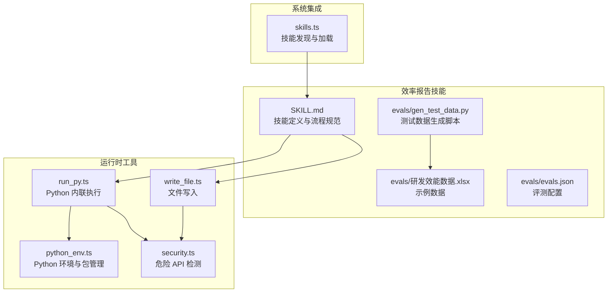
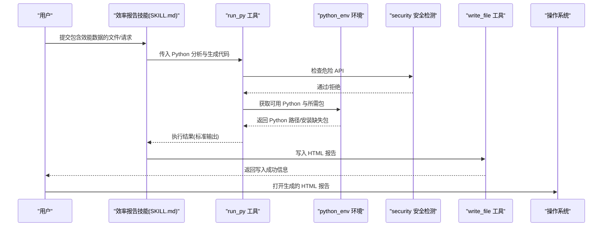
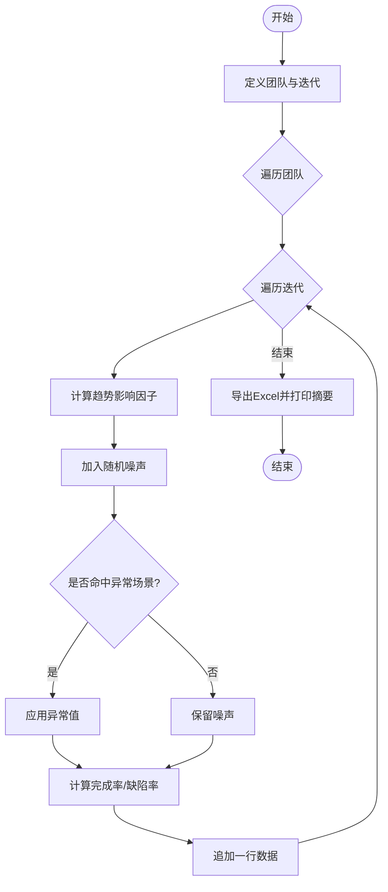
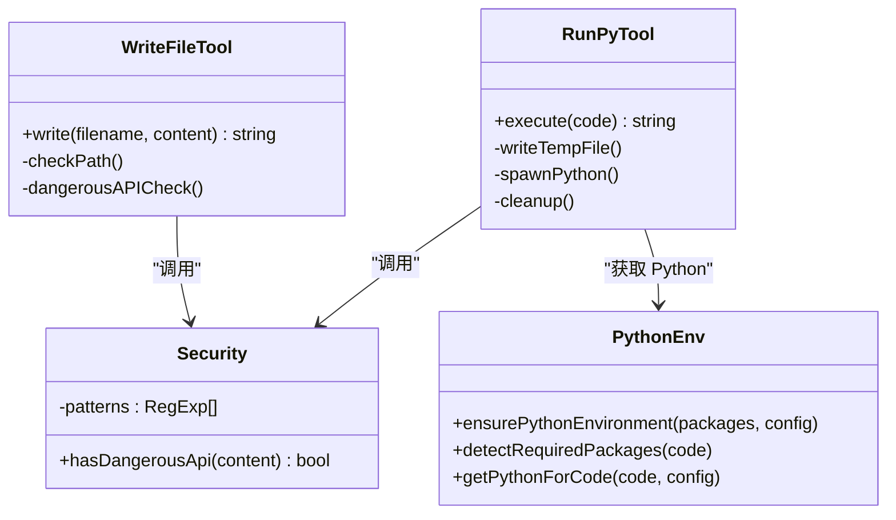
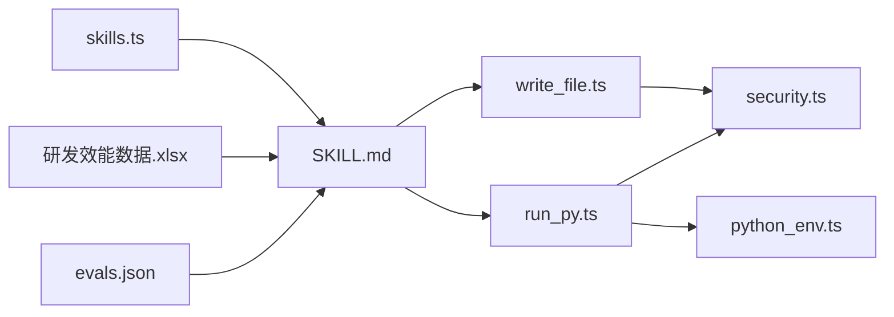

# 效率报告技能

<cite>
**本文引用的文件**
- [SKILL.md](file://src/agent/skills/efficiency-report/SKILL.md)
- [gen_test_data.py](file://src/agent/skills/efficiency-report/evals/gen_test_data.py)
- [evals.json](file://src/agent/skills/efficiency-report/evals/evals.json)
- [研发效能数据.xlsx](file://src/agent/skills/efficiency-report/evals/研发效能数据.xlsx)
- [run_py.ts](file://src/agent/tools/run_py.ts)
- [write_file.ts](file://src/agent/tools/write_file.ts)
- [security.ts](file://src/agent/tools/security.ts)
- [python_env.ts](file://src/agent/python_env.ts)
- [skills.ts](file://src/agent/skills.ts)
</cite>

## 目录
1. [简介](#简介)
2. [项目结构](#项目结构)
3. [核心组件](#核心组件)
4. [架构总览](#架构总览)
5. [详细组件分析](#详细组件分析)
6. [依赖关系分析](#依赖关系分析)
7. [性能考量](#性能考量)
8. [故障排查指南](#故障排查指南)
9. [结论](#结论)
10. [附录](#附录)

## 简介
本技能面向“研发效能”“工程效率”“团队绩效”等主题，提供从数据读取、探索、多维分析、对标评估、趋势与分组对比、异常检测到 HTML 报告生成的全流程自动化能力。报告以可直接在浏览器打开的 HTML 文件形式输出，内置图表与样式，强调“洞察”而非“罗列数据”，并遵循“诚实、有洞察、客观、适应性强”的原则。

## 项目结构
效率报告技能位于 skills 目录下的 efficiency-report 子目录，核心由以下部分组成：
- 技能定义与流程规范：SKILL.md
- 测试数据生成脚本：evals/gen_test_data.py
- 评测配置：evals/evals.json
- 示例数据：evals/研发效能数据.xlsx
- 运行环境与安全：tools/run_py.ts、tools/write_file.ts、tools/security.ts、python_env.ts
- 技能注册与发现：skills.ts

**图表来源**
- [SKILL.md:1-319](file://src/agent/skills/efficiency-report/SKILL.md#L1-L319)
- [gen_test_data.py:1-52](file://src/agent/skills/efficiency-report/evals/gen_test_data.py#L1-L52)
- [evals.json:1-24](file://src/agent/skills/efficiency-report/evals/evals.json#L1-L24)
- [run_py.ts:1-94](file://src/agent/tools/run_py.ts#L1-L94)
- [write_file.ts:1-54](file://src/agent/tools/write_file.ts#L1-L54)
- [security.ts:1-27](file://src/agent/tools/security.ts#L1-L27)
- [python_env.ts:1-223](file://src/agent/python_env.ts#L1-L223)
- [skills.ts:1-142](file://src/agent/skills.ts#L1-L142)

**章节来源**
- [SKILL.md:1-319](file://src/agent/skills/efficiency-report/SKILL.md#L1-L319)
- [gen_test_data.py:1-52](file://src/agent/skills/efficiency-report/evals/gen_test_data.py#L1-L52)
- [evals.json:1-24](file://src/agent/skills/efficiency-report/evals/evals.json#L1-L24)
- [run_py.ts:1-94](file://src/agent/tools/run_py.ts#L1-L94)
- [write_file.ts:1-54](file://src/agent/tools/write_file.ts#L1-L54)
- [security.ts:1-27](file://src/agent/tools/security.ts#L1-L27)
- [python_env.ts:1-223](file://src/agent/python_env.ts#L1-L223)
- [skills.ts:1-142](file://src/agent/skills.ts#L1-L142)

## 核心组件
- 数据读取与探索：支持 Excel/CSV，自动识别维度列、时间列、指标列；输出基础统计与缺失值情况。
- 多维分析：
  - 汇总统计：均值、中位数、标准差、极值、四分位数
  - 对标评估：基于 DORA 经典基准与扩展基准进行评级；若无对应指标，则采用分位数法分档
  - 趋势分析：按时间窗口聚合，识别趋势方向与显著拐点
  - 分组对比：按维度分组计算核心指标均值，排名与差距分析
  - 异常检测：使用 IQR 法识别异常值并给出可能原因
- HTML 报告生成：自包含 HTML，内嵌样式与图表，响应式布局，包含标题区、数据概览、核心指标分析、图表区、分组对比、异常与风险、综合结论等区块
- 执行与安全：通过 run_py 工具内联执行 Python 代码，write_file 工具写入报告文件；具备危险 API 检测与 Python 环境管理

**章节来源**
- [SKILL.md:20-90](file://src/agent/skills/efficiency-report/SKILL.md#L20-L90)
- [SKILL.md:91-140](file://src/agent/skills/efficiency-report/SKILL.md#L91-L140)
- [SKILL.md:141-287](file://src/agent/skills/efficiency-report/SKILL.md#L141-L287)

## 架构总览
整体执行流如下：用户输入触发技能，技能通过 run_py 执行数据分析与报告生成，最终通过 write_file 写入 HTML 文件并提示打开。

**图表来源**
- [SKILL.md:16-18](file://src/agent/skills/efficiency-report/SKILL.md#L16-L18)
- [run_py.ts:11-94](file://src/agent/tools/run_py.ts#L11-L94)
- [write_file.ts:7-54](file://src/agent/tools/write_file.ts#L7-L54)
- [security.ts:24-27](file://src/agent/tools/security.ts#L24-L27)
- [python_env.ts:161-187](file://src/agent/python_env.ts#L161-L187)

**章节来源**
- [SKILL.md:14-18](file://src/agent/skills/efficiency-report/SKILL.md#L14-L18)
- [run_py.ts:11-94](file://src/agent/tools/run_py.ts#L11-L94)
- [write_file.ts:7-54](file://src/agent/tools/write_file.ts#L7-L54)
- [security.ts:24-27](file://src/agent/tools/security.ts#L24-L27)
- [python_env.ts:161-187](file://src/agent/python_env.ts#L161-L187)

## 详细组件分析

### 数据读取与探索
- 支持 Excel（.xlsx/.xls）与 CSV
- 输出：行数、列数、数据类型、缺失值
- 列类型自动识别：维度列（分类变量）、时间列（datetime 或含“日期/时间/月份/周/月/年”关键词）、指标列（数值型）
- 若未提供文件路径，主动询问；读取失败时尝试不同编码并反馈问题

**章节来源**
- [SKILL.md:20-31](file://src/agent/skills/efficiency-report/SKILL.md#L20-L31)

### 多维分析
- 汇总统计：均值、中位数、标准差、最大/最小、四分位数
- 对标评估（核心）：
  - DORA 经典基准：部署频率、变更前置时间、故障恢复时间(MTTR)、变更失败率
  - 扩展基准：需求交付周期、缺陷率、代码覆盖率、任务完成率、吞吐量
  - 对标原则：基准为参考坐标系；若不完全匹配，做相对评估；无对应指标时用分位数法分档；每个评级附带解读
- 趋势分析：按时间窗口聚合，识别趋势方向与显著拐点（±20%）
- 分组对比：按维度分组计算核心指标均值，排名、最佳/最差比值、重点标注
- 异常检测：IQR 法识别异常值并简要分析可能原因

**章节来源**
- [SKILL.md:32-90](file://src/agent/skills/efficiency-report/SKILL.md#L32-L90)

### HTML 报告生成
- 保存路径：优先桌面，文件名包含时间戳
- 样式与资源：内嵌 CSS、Font Awesome、Chart.js CDN
- 结构：标题区、数据概览、核心指标分析（含评级标签）、图表区（团队对比柱状图、趋势折线图等）、分组对比、异常与风险、综合结论
- 图表颜色策略：缺陷率（越小越好，反向显示）、完成率/覆盖率（越大越好）、交付周期（越小越好）

**章节来源**
- [SKILL.md:91-140](file://src/agent/skills/efficiency-report/SKILL.md#L91-L140)
- [SKILL.md:266-287](file://src/agent/skills/efficiency-report/SKILL.md#L266-L287)

### 测试数据生成脚本
- 生成真实感研发效能数据：团队、迭代、需求计划/完成、缺陷数、代码覆盖率、平均交付周期
- 添加趋势与特定异常场景（如移动端迭代4缺陷突增、后端迭代5交付周期异常升高）
- 计算导出字段：完成率、缺陷率
- 输出 Excel 文件并打印摘要

**图表来源**
- [gen_test_data.py:10-52](file://src/agent/skills/efficiency-report/evals/gen_test_data.py#L10-L52)

**章节来源**
- [gen_test_data.py:1-52](file://src/agent/skills/efficiency-report/evals/gen_test_data.py#L1-L52)

### 评测配置与示例数据
- evals.json：定义评测用例，包含提示词、期望输出与文件路径
- 研发效能数据.xlsx：示例数据，用于验证技能流程与报告质量

**章节来源**
- [evals.json:1-24](file://src/agent/skills/efficiency-report/evals/evals.json#L1-L24)
- [研发效能数据.xlsx](file://src/agent/skills/efficiency-report/evals/研发效能数据.xlsx)

### 执行与安全机制
- run_py 工具：内联执行 Python 代码，自动写入临时文件、执行、清理；超时控制；危险 API 检测
- write_file 工具：限制写入路径不得逃逸当前目录；内容中禁止危险 API
- security.ts：统一的危险 API 模式检测
- python_env.ts：Python 环境探测、虚拟环境创建、包自动安装（pandas、numpy、openpyxl）

**图表来源**
- [run_py.ts:11-94](file://src/agent/tools/run_py.ts#L11-L94)
- [write_file.ts:7-54](file://src/agent/tools/write_file.ts#L7-L54)
- [security.ts:24-27](file://src/agent/tools/security.ts#L24-L27)
- [python_env.ts:161-187](file://src/agent/python_env.ts#L161-L187)

**章节来源**
- [run_py.ts:11-94](file://src/agent/tools/run_py.ts#L11-L94)
- [write_file.ts:7-54](file://src/agent/tools/write_file.ts#L7-L54)
- [security.ts:24-27](file://src/agent/tools/security.ts#L24-L27)
- [python_env.ts:161-187](file://src/agent/python_env.ts#L161-L187)

## 依赖关系分析
- 技能依赖：SKILL.md 定义流程与输出规范
- 工具依赖：run_py 与 write_file 是执行与输出的关键；security 提供安全保障；python_env 确保 Python 与必要包可用
- 数据依赖：evals.json 与研发效能数据.xlsx 用于评测与演示
- 系统集成：skills.ts 提供技能发现与加载能力，便于系统级集成

**图表来源**
- [SKILL.md:14-18](file://src/agent/skills/efficiency-report/SKILL.md#L14-L18)
- [run_py.ts:11-94](file://src/agent/tools/run_py.ts#L11-L94)
- [write_file.ts:7-54](file://src/agent/tools/write_file.ts#L7-L54)
- [security.ts:24-27](file://src/agent/tools/security.ts#L24-L27)
- [python_env.ts:161-187](file://src/agent/python_env.ts#L161-L187)
- [evals.json:1-24](file://src/agent/skills/efficiency-report/evals/evals.json#L1-L24)
- [研发效能数据.xlsx](file://src/agent/skills/efficiency-report/evals/研发效能数据.xlsx)
- [skills.ts:56-86](file://src/agent/skills.ts#L56-L86)

**章节来源**
- [SKILL.md:14-18](file://src/agent/skills/efficiency-report/SKILL.md#L14-L18)
- [run_py.ts:11-94](file://src/agent/tools/run_py.ts#L11-L94)
- [write_file.ts:7-54](file://src/agent/tools/write_file.ts#L7-L54)
- [security.ts:24-27](file://src/agent/tools/security.ts#L24-L27)
- [python_env.ts:161-187](file://src/agent/python_env.ts#L161-L187)
- [evals.json:1-24](file://src/agent/skills/efficiency-report/evals/evals.json#L1-L24)
- [研发效能数据.xlsx](file://src/agent/skills/efficiency-report/evals/研发效能数据.xlsx)
- [skills.ts:56-86](file://src/agent/skills.ts#L56-L86)

## 性能考量
- Python 执行超时：run_py 设置 15 秒超时，避免长时间阻塞
- 包安装与缓存：python_env 缓存已解析的 Python 路径，减少重复探测成本
- 临时文件清理：run_py 执行后清理临时文件，避免磁盘占用
- I/O 与图表生成：write_file 一次性写入完整 HTML，减少多次 I/O；Chart.js 通过 CDN 加载，降低本地体积

**章节来源**
- [run_py.ts:40-58](file://src/agent/tools/run_py.ts#L40-L58)
- [python_env.ts:20-30](file://src/agent/python_env.ts#L20-L30)
- [python_env.ts:161-170](file://src/agent/python_env.ts#L161-L170)

## 故障排查指南
- Python 环境不可用
  - 现象：返回“Python 3 未安装或不在 PATH”
  - 处理：检查系统 Python 版本与路径；启用自动安装配置（若允许）
- 缺失包
  - 现象：提示缺少 pandas、numpy、openpyxl
  - 处理：开启自动安装或手动安装相应包
- 危险 API 拦截
  - 现象：run_py 或 write_file 返回“包含危险操作”
  - 处理：移除危险 API 调用（如 os.remove、subprocess 等）
- 文件写入路径错误
  - 现象：返回“无法写入到当前目录之外”
  - 处理：确保输出路径在当前工作目录范围内
- 数据读取失败
  - 现象：编码问题或格式不支持
  - 处理：尝试不同编码（utf-8、gbk、latin1）；确认文件格式与列名

**章节来源**
- [python_env.ts:84-103](file://src/agent/python_env.ts#L84-L103)
- [python_env.ts:134-159](file://src/agent/python_env.ts#L134-L159)
- [security.ts:24-27](file://src/agent/tools/security.ts#L24-L27)
- [write_file.ts:12-28](file://src/agent/tools/write_file.ts#L12-L28)
- [run_py.ts:48-58](file://src/agent/tools/run_py.ts#L48-L58)

## 结论
效率报告技能以“诚实、有洞察、客观、适应性强”为核心原则，结合 DORA 与扩展基准，提供从数据读取到 HTML 报告的完整闭环。通过 run_py 与 write_file 的安全执行与写入机制，以及 python_env 的环境与包管理，确保在受限环境中稳定运行。测试数据生成脚本为技能验证与演示提供了真实场景的数据基础。

## 附录
- 实际应用场景
  - 团队/部门研发效能评估与对比
  - 项目周期与交付质量趋势跟踪
  - 异常与风险点识别与预警
  - 跨团队协作与瓶颈定位
- 报告解读要点
  - 评级解读：结合业务背景理解“优秀/良好/一般/需关注”的实际意义
  - 趋势解读：关注拐点与持续性变化，避免短期波动误导
  - 分组对比：聚焦最佳与最差团队的差异化因素
  - 异常解读：结合上下文（版本、流程、资源）分析可能原因