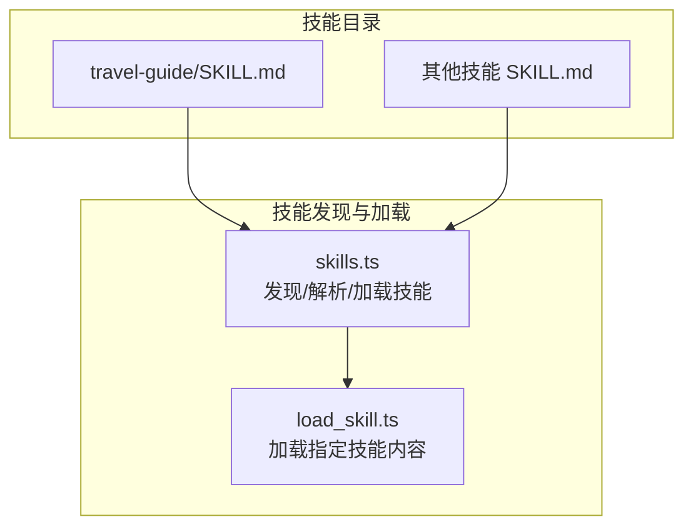
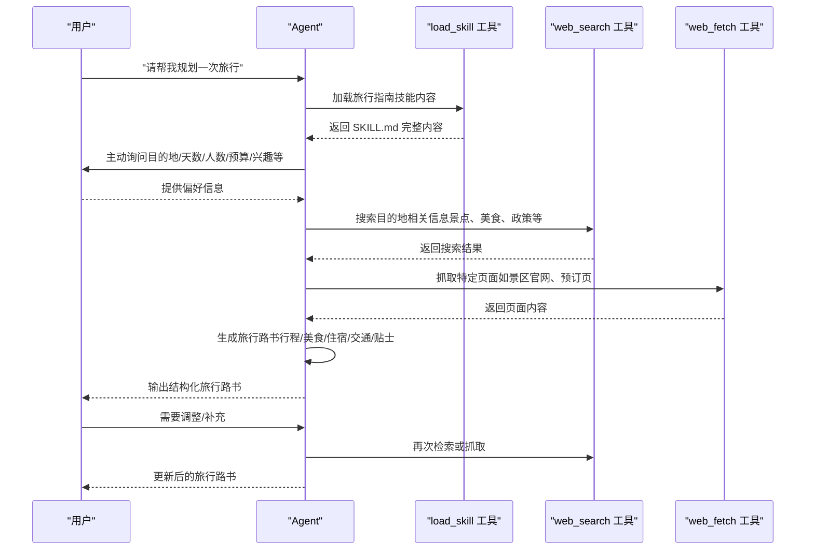
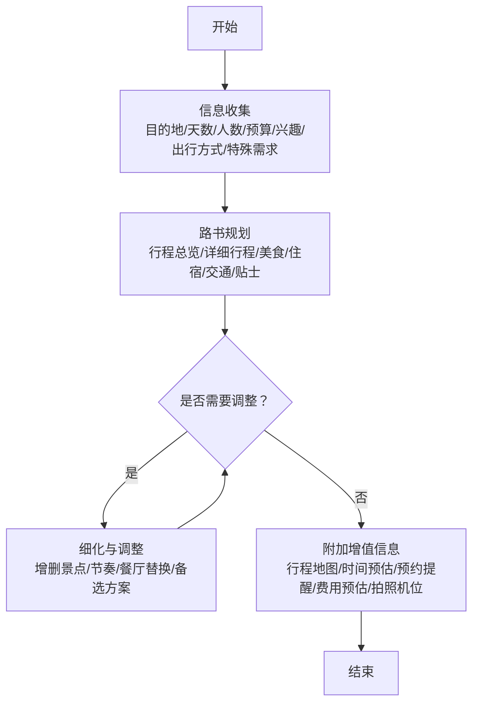
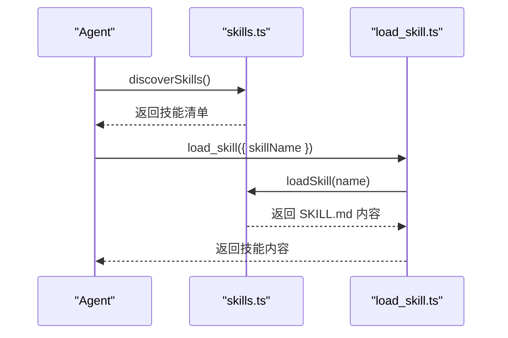
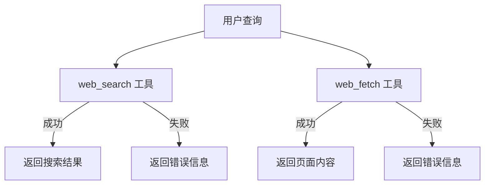
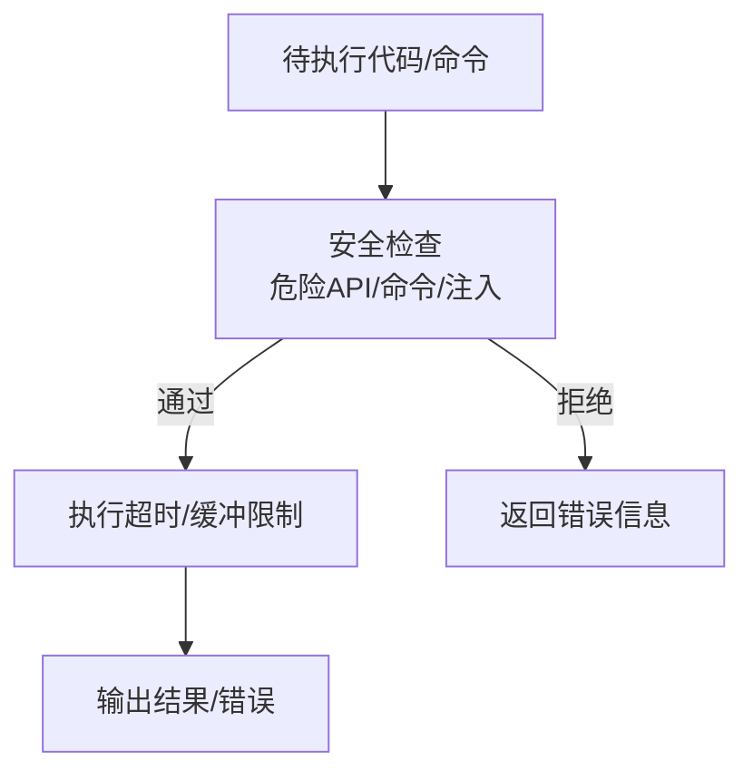
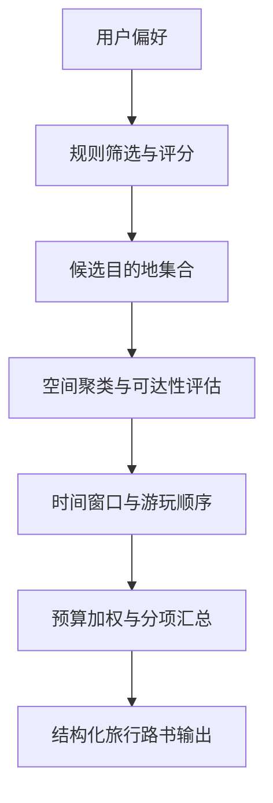
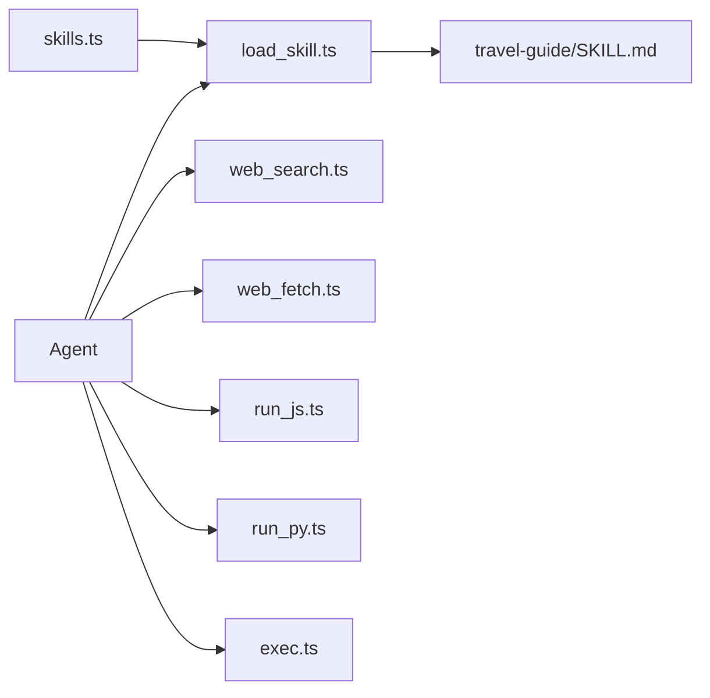

# 旅行指南技能

<cite>
**本文引用的文件**
- [travel-guide/SKILL.md](file://src/agent/skills/travel-guide/SKILL.md)
- [skills.ts](file://src/agent/skills.ts)
- [load_skill.ts](file://src/agent/tools/load_skill.ts)
- [web_search.ts](file://src/agent/tools/web_search.ts)
- [web_fetch.ts](file://src/agent/tools/web_fetch.ts)
- [search.ts](file://src/agent/tools/search.ts)
- [run_js.ts](file://src/agent/tools/run_js.ts)
- [run_py.ts](file://src/agent/tools/run_py.ts)
- [exec.ts](file://src/agent/tools/exec.ts)
</cite>

## 目录
1. [引言](#引言)
2. [项目结构](#项目结构)
3. [核心组件](#核心组件)
4. [架构总览](#架构总览)
5. [详细组件分析](#详细组件分析)
6. [依赖分析](#依赖分析)
7. [性能考虑](#性能考虑)
8. [故障排查指南](#故障排查指南)
9. [结论](#结论)
10. [附录](#附录)

## 引言
本文件面向“旅行指南技能”，系统化阐述其工作原理与实现要点，重点覆盖：
- 智能旅行推荐算法的思路与落地（目的地选择策略、行程规划逻辑、个性化定制机制）
- 旅行建议生成的技术实现（地理信息处理、时间安排优化、预算控制算法）
- 动态内容生成流程（实时数据获取、内容过滤、格式化输出）
- 使用案例与最佳实践

旅行指南技能以“旅行路书”为核心产物，围绕用户输入（目的地、天数、人数、预算、兴趣、出行方式、特殊需求等）进行个性化规划，并提供行程总览、详细行程、美食、住宿、交通与实用贴士等模块化输出。

## 项目结构
旅行指南技能位于 skills 子目录中，采用“技能即文档”的结构：每个技能以独立子目录存放，核心入口为 SKILL.md（包含 YAML frontmatter 与 Markdown 描述）。系统通过通用的技能发现与加载机制，将技能注入到 Agent 的可用能力集合中。

图示来源
- [travel-guide/SKILL.md](file://src/agent/skills/travel-guide/SKILL.md)
- [skills.ts](file://src/agent/skills.ts)
- [load_skill.ts](file://src/agent/tools/load_skill.ts)

章节来源
- [travel-guide/SKILL.md](file://src/agent/skills/travel-guide/SKILL.md)
- [skills.ts](file://src/agent/skills.ts)

## 核心组件
- 旅行指南技能定义（SKILL.md）
  - 角色定位：旅行规划师，依据用户偏好制定个性化路书
  - 工作流程：信息收集 → 路书规划 → 细化与调整 → 附加增值信息
  - 输出模板：行程总览、详细行程、美食、住宿、交通、实用贴士等
  - 注意事项：信息时效性、节奏把控、饮食偏好、天气与安全提醒

- 技能发现与加载（skills.ts、load_skill.ts）
  - 自动扫描 skills 目录，解析 SKILL.md 的 YAML frontmatter，构建技能清单
  - 提供按名称加载完整技能内容的能力，便于在对话中注入具体指令

- 实时数据获取与内容处理（web_search.ts、web_fetch.ts、search.ts）
  - web_search：调用 Tavily 搜索引擎，获取实时网络信息
  - web_fetch：安全抓取网页内容，限制超时与响应大小，校验 URL 合法性
  - search：占位/演示工具，实际旅行场景建议使用 web_search

- 代码执行与安全（run_js.ts、run_py.ts、exec.ts）
  - run_js/run_py：在受控沙箱中执行脚本，阻断危险 API，支持超时与缓冲限制
  - exec：阻断高危命令与 eval 注入，保障系统安全

章节来源
- [travel-guide/SKILL.md](file://src/agent/skills/travel-guide/SKILL.md)
- [skills.ts](file://src/agent/skills.ts)
- [load_skill.ts](file://src/agent/tools/load_skill.ts)
- [web_search.ts](file://src/agent/tools/web_search.ts)
- [web_fetch.ts](file://src/agent/tools/web_fetch.ts)
- [search.ts](file://src/agent/tools/search.ts)
- [run_js.ts](file://src/agent/tools/run_js.ts)
- [run_py.ts](file://src/agent/tools/run_py.ts)
- [exec.ts](file://src/agent/tools/exec.ts)

## 架构总览
旅行指南技能的端到端流程由“信息收集 → 数据获取 → 规划生成 → 输出与迭代”构成。系统通过技能发现与加载机制将旅行指南的指令注入 Agent；Agent 可调用搜索与抓取工具获取实时信息；最终以结构化 Markdown 输出旅行路书，并支持后续细化与调整。

图示来源
- [load_skill.ts](file://src/agent/tools/load_skill.ts)
- [web_search.ts](file://src/agent/tools/web_search.ts)
- [web_fetch.ts](file://src/agent/tools/web_fetch.ts)
- [travel-guide/SKILL.md](file://src/agent/skills/travel-guide/SKILL.md)

## 详细组件分析

### 1) 旅行指南技能定义与工作流
- 角色定位与职责边界清晰，强调个性化与实用性
- 工作流分阶段推进：信息收集、路书规划、细化调整、附加增值
- 输出结构标准化，便于统一渲染与扩展

章节来源
- [travel-guide/SKILL.md](file://src/agent/skills/travel-guide/SKILL.md)

### 2) 技能发现与加载机制
- skills.ts
  - 解析 SKILL.md 的 YAML frontmatter，提取 name/description
  - 支持 dev 与 dist 两种运行环境下的目录回退策略
  - 提供 discoverSkills 与 loadSkill 两个核心接口
- load_skill.ts
  - 对外暴露 load_skill 工具，按名称加载完整技能内容
  - 若技能不存在，返回可用技能列表，提升交互体验

图示来源
- [skills.ts](file://src/agent/skills.ts)
- [load_skill.ts](file://src/agent/tools/load_skill.ts)

章节来源
- [skills.ts](file://src/agent/skills.ts)
- [load_skill.ts](file://src/agent/tools/load_skill.ts)

### 3) 实时数据获取与内容处理
- web_search.ts
  - 基于 Tavily 的搜索工具，适合获取实时网络信息
  - 通过环境变量配置密钥，异常时返回明确错误提示
- web_fetch.ts
  - 严格校验 URL 协议与格式，限制超时与响应大小
  - 捕获常见网络错误（DNS、连接被拒、重置等），返回可读错误信息
- search.ts
  - 示例/演示用途，实际旅行场景建议使用 web_search

图示来源
- [web_search.ts](file://src/agent/tools/web_search.ts)
- [web_fetch.ts](file://src/agent/tools/web_fetch.ts)
- [search.ts](file://src/agent/tools/search.ts)

章节来源
- [web_search.ts](file://src/agent/tools/web_search.ts)
- [web_fetch.ts](file://src/agent/tools/web_fetch.ts)
- [search.ts](file://src/agent/tools/search.ts)

### 4) 代码执行与安全控制
- run_js.ts / run_py.ts
  - 通过临时文件执行，避免命令行转义问题
  - 阻断危险 API 调用，设置超时与缓冲上限
- exec.ts
  - 黑名单命令、eval 注入模式与危险 API 三重防护
  - 明确超时与错误返回，防止资源滥用

图示来源
- [run_js.ts](file://src/agent/tools/run_js.ts)
- [run_py.ts](file://src/agent/tools/run_py.ts)
- [exec.ts](file://src/agent/tools/exec.ts)

章节来源
- [run_js.ts](file://src/agent/tools/run_js.ts)
- [run_py.ts](file://src/agent/tools/run_py.ts)
- [exec.ts](file://src/agent/tools/exec.ts)

### 5) 智能旅行推荐算法（概念性说明）
以下为旅行指南技能在“算法层面”的概念性实现思路，帮助理解如何将用户偏好转化为可执行的规划步骤。由于仓库未包含专用算法实现文件，本节仅提供方法论与流程图，不涉及具体代码。

- 目的地选择策略
  - 输入：用户偏好（预算、兴趣、人数、特殊需求）、实时政策（如开放时间、预约要求）
  - 输出：候选目的地集合与评分排序
  - 方法：基于规则筛选（如预算阈值、无障碍设施要求）与评分函数（综合评分=权重×热度×性价比×距离）

- 行程规划逻辑
  - 输入：目的地、天数、每日可游玩数量上限（建议不超过 3-4 个）
  - 输出：每日上午/下午/晚上活动安排
  - 方法：贪心策略（优先级=兴趣匹配度×时间窗口契合度），结合邻近景点的空间聚类与交通耗时估计

- 个性化定制机制
  - 输入：饮食偏好（素食、过敏、清真）、天气与季节、出行方式
  - 输出：餐厅/住宿/交通的个性化推荐
  - 方法：基于标签匹配与上下文权重（如雨天备选、预约提醒）

- 地理信息处理
  - 输入：景点经纬度、城市行政区划
  - 输出：空间关系描述、最优路径建议
  - 方法：使用距离矩阵与最短路径算法（如简化版 Dijkstra 或启发式近似）

- 时间安排优化
  - 输入：景点游玩时长、交通耗时、用户出发时间
  - 输出：每日时间表与总览表格
  - 方法：线性规划或贪心调度，确保不拥挤且留有缓冲

- 预算控制算法
  - 输入：交通、门票、餐饮、住宿单价与数量
  - 输出：总预算估算与分项汇总
  - 方法：加权求和与区间估计（考虑汇率波动与临时加价）

[本图为概念性流程图，不对应具体源码文件，故无图示来源]

## 依赖分析
- 技能发现与加载
  - skills.ts 依赖 Node FS 与路径模块，解析 SKILL.md 并构建技能清单
  - load_skill.ts 依赖 skills.ts 的 loadSkill 接口，提供对外工具能力

- 工具链依赖
  - web_search.ts 依赖 Tavily 客户端（通过环境变量配置）
  - web_fetch.ts 依赖浏览器/Node fetch，内置超时与大小限制
  - run_js/ts 与 run_py/ts 依赖 Node 子进程与临时文件系统
  - exec.ts 依赖危险命令黑名单与 eval 注入模式检测

图示来源
- [skills.ts](file://src/agent/skills.ts)
- [load_skill.ts](file://src/agent/tools/load_skill.ts)
- [web_search.ts](file://src/agent/tools/web_search.ts)
- [web_fetch.ts](file://src/agent/tools/web_fetch.ts)
- [run_js.ts](file://src/agent/tools/run_js.ts)
- [run_py.ts](file://src/agent/tools/run_py.ts)
- [exec.ts](file://src/agent/tools/exec.ts)
- [travel-guide/SKILL.md](file://src/agent/skills/travel-guide/SKILL.md)

章节来源
- [skills.ts](file://src/agent/skills.ts)
- [load_skill.ts](file://src/agent/tools/load_skill.ts)
- [web_search.ts](file://src/agent/tools/web_search.ts)
- [web_fetch.ts](file://src/agent/tools/web_fetch.ts)
- [run_js.ts](file://src/agent/tools/run_js.ts)
- [run_py.ts](file://src/agent/tools/run_py.ts)
- [exec.ts](file://src/agent/tools/exec.ts)
- [travel-guide/SKILL.md](file://src/agent/skills/travel-guide/SKILL.md)

## 性能考虑
- 搜索与抓取
  - 控制并发与请求频率，避免触发目标站点限流
  - 缓存热点目的地的基础信息（如开放时间、票价），减少重复请求
- 输出渲染
  - 旅行路书采用 Markdown 表格与标题层级，便于前端快速渲染
  - 分块输出（先总览，再详细行程），降低一次性渲染压力
- 安全与稳定性
  - 执行类工具设置超时与缓冲上限，防止长时间占用
  - 网络请求设置超时与最大响应大小，避免内存溢出

[本节为通用指导，不直接分析具体文件，故无章节来源]

## 故障排查指南
- 技能加载失败
  - 现象：返回“技能未找到”或空列表
  - 排查：确认 SKILL.md 存在且 YAML frontmatter 完整；检查 skills 目录路径
  - 参考
    - [load_skill.ts](file://src/agent/tools/load_skill.ts)
    - [skills.ts](file://src/agent/skills.ts)

- 搜索工具报错
  - 现象：返回“未找到 API 密钥”或“网络错误”
  - 排查：确认环境变量已配置；检查网络连通性与代理设置
  - 参考
    - [web_search.ts](file://src/agent/tools/web_search.ts)

- 抓取工具报错
  - 现象：返回“URL 不合法/超时/响应过大/HTTP 错误”
  - 排查：核对 URL 协议与域名；缩短抓取范围；检查目标站点状态
  - 参考
    - [web_fetch.ts](file://src/agent/tools/web_fetch.ts)

- 执行类工具报错
  - 现象：返回“危险操作被阻止/超时/未安装运行时”
  - 排查：避免使用危险 API；确认 Node/Python 可用；缩短执行时间
  - 参考
    - [run_js.ts](file://src/agent/tools/run_js.ts)
    - [run_py.ts](file://src/agent/tools/run_py.ts)
    - [exec.ts](file://src/agent/tools/exec.ts)

章节来源
- [load_skill.ts](file://src/agent/tools/load_skill.ts)
- [skills.ts](file://src/agent/skills.ts)
- [web_search.ts](file://src/agent/tools/web_search.ts)
- [web_fetch.ts](file://src/agent/tools/web_fetch.ts)
- [run_js.ts](file://src/agent/tools/run_js.ts)
- [run_py.ts](file://src/agent/tools/run_py.ts)
- [exec.ts](file://src/agent/tools/exec.ts)

## 结论
旅行指南技能以“结构化指令 + 工具链组合”的方式，实现了从信息收集到旅行路书输出的闭环。通过技能发现与加载机制，系统能够灵活接入多类技能；借助搜索与抓取工具，可获取实时数据；通过安全可控的代码执行能力，可扩展个性化算法与后处理逻辑。建议在实际部署中强化缓存与并发控制，完善错误日志与可观测性，持续优化推荐与调度策略。

[本节为总结性内容，不直接分析具体文件，故无章节来源]

## 附录

### A. 使用案例与最佳实践
- 案例一：国内周末游
  - 输入：目的地（某二线城市）、天数（2 天）、人数（情侣）、预算（舒适型）、兴趣（美食/文化）
  - 流程：先用搜索工具获取景点与餐厅信息，再抓取热门餐厅的营业时间与套餐，最后生成包含“行程总览/详细行程/美食/交通/贴士”的路书
  - 最佳实践：控制每日景点数量在 3 以内；为午餐/晚餐预留 1 小时缓冲；标注预约与排队信息

- 案例二：亲子家庭出境游
  - 输入：目的地（东南亚海岛）、天数（5 天）、人数（家庭）、预算（舒适型）、特殊需求（带老人/小孩）
  - 流程：优先筛选无障碍设施与儿童友好项目；对比多家住宿的价格与位置；规划往返交通与市内交通
  - 最佳实践：提前预约热门景点；准备常用药品与防晒用品；记录紧急联系信息

- 案例三：自由行+深度体验
  - 输入：目的地（小众古镇）、天数（3 天）、人数（朋友）、预算（经济型）、兴趣（摄影/徒步）
  - 流程：搜索当地摄影点与徒步路线；抓取民宿评价与价格；设计“拍照机位 + 徒步路线 + 当地美食”的组合
  - 最佳实践：避开节假日高峰；准备轻便装备；关注天气变化

[本节为概念性说明，不直接分析具体文件，故无章节来源]