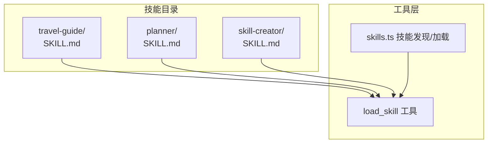
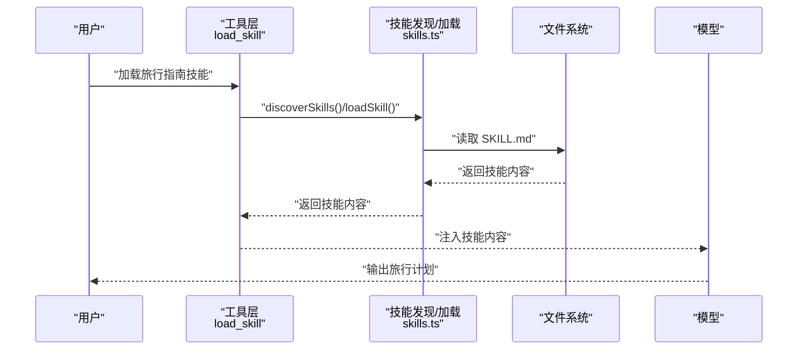
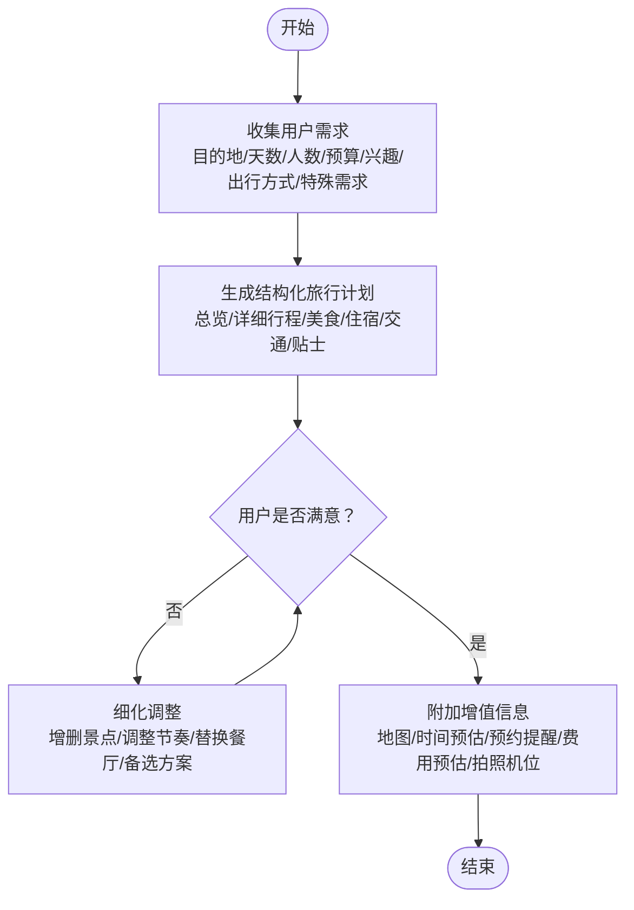
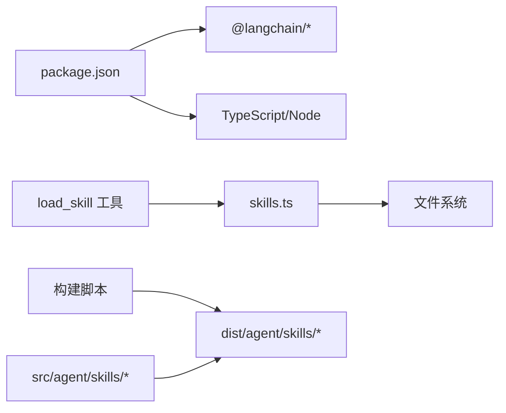

# 旅行指南技能

<cite>
**本文引用的文件**
- [src/agent/skills/travel-guide/SKILL.md](file://src/agent/skills/travel-guide/SKILL.md)
- [src/agent/skills.ts](file://src/agent/skills.ts)
- [src/agent/tools.ts](file://src/agent/tools.ts)
- [src/agent/tools/load_skill.ts](file://src/agent/tools/load_skill.ts)
- [src/agent/skills/planner/SKILL.md](file://src/agent/skills/planner/SKILL.md)
- [src/agent/skills/skill-creator/SKILL.md](file://src/agent/skills/skill-creator/SKILL.md)
- [package.json](file://package.json)
</cite>

## 更新摘要
**所做更改**
- 移除了对示例行程文件 '3-day-tokyo-itinerary.md' 的引用，因为该文件已被移除
- 更新了项目结构图以反映当前的模块化架构
- 删除了与示例文件相关的具体示例和流程说明
- 保持了旅行指南技能的核心功能描述和使用指南

## 目录
1. [简介](#简介)
2. [项目结构](#项目结构)
3. [核心组件](#核心组件)
4. [架构总览](#架构总览)
5. [详细组件分析](#详细组件分析)
6. [依赖分析](#依赖分析)
7. [性能考虑](#性能考虑)
8. [故障排查指南](#故障排查指南)
9. [结论](#结论)
10. [附录](#附录)

## 简介
本指南面向"旅行指南"技能模块，系统讲解旅行规划能力的使用方法与工作原理，覆盖地点推荐、路线优化与个性化配置。旅行指南技能通过标准化的信息收集与结构化输出，为用户提供可落地的旅行计划。技能模块采用模块化设计，支持独立开发、测试和部署，便于扩展新的旅行规划功能。

## 项目结构
旅行指南技能位于 skills 目录下的独立子模块，通过统一的技能发现与加载机制接入主系统。当前架构包含三个主要技能模块：旅行指南、规划器和技能创建器，每个模块都有独立的功能定位和使用场景。



**图表来源**
- [src/agent/skills/travel-guide/SKILL.md](file://src/agent/skills/travel-guide/SKILL.md)
- [src/agent/skills/planner/SKILL.md](file://src/agent/skills/planner/SKILL.md)
- [src/agent/skills/skill-creator/SKILL.md](file://src/agent/skills/skill-creator/SKILL.md)
- [src/agent/tools/load_skill.ts](file://src/agent/tools/load_skill.ts)
- [src/agent/skills.ts](file://src/agent/skills.ts)

**章节来源**
- [src/agent/skills.ts](file://src/agent/skills.ts)
- [src/agent/tools.ts](file://src/agent/tools.ts)
- [src/agent/tools/load_skill.ts](file://src/agent/tools/load_skill.ts)
- [src/agent/skills/travel-guide/SKILL.md](file://src/agent/skills/travel-guide/SKILL.md)

## 核心组件
- **旅行指南技能定义**：提供目的地、天数、人数、预算、兴趣偏好、出行方式、特殊需求等关键信息收集，按结构化模板输出行程总览、详细行程、美食推荐、住宿推荐、交通指南与实用贴士，并支持细化调整与附加增值信息。
- **技能发现与加载**：系统通过扫描 skills 目录，解析 SKILL.md 的 YAML frontmatter，构建可用技能清单；load_skill 工具负责按名称加载完整技能内容。
- **模块化架构**：采用独立技能模块设计，每个技能都有自己的目录结构，包含 SKILL.md 定义文件和可选的资源文件。

**章节来源**
- [src/agent/skills/travel-guide/SKILL.md](file://src/agent/skills/travel-guide/SKILL.md)
- [src/agent/skills.ts](file://src/agent/skills.ts)
- [src/agent/tools/load_skill.ts](file://src/agent/tools/load_skill.ts)

## 架构总览
旅行指南技能的调用链路如下：客户端发起请求，系统通过工具层调用 load_skill，读取 travel-guide 的 SKILL.md 并注入上下文，随后由模型依据技能指令生成旅行计划。



**图表来源**
- [src/agent/tools/load_skill.ts](file://src/agent/tools/load_skill.ts)
- [src/agent/skills.ts](file://src/agent/skills.ts)
- [src/agent/skills/travel-guide/SKILL.md](file://src/agent/skills/travel-guide/SKILL.md)

## 详细组件分析

### 旅行指南技能工作流
- **信息收集**：主动询问目的地、天数、人数、预算、兴趣偏好、出行方式、特殊需求等，确保个性化定制。
- **路书规划**：按结构化模板输出，包含行程总览、详细行程、美食推荐、住宿推荐、交通指南与实用贴士。
- **细化与调整**：根据用户反馈进行增删景点、调整节奏、替换餐厅等优化，并提供备选方案。
- **附加增值信息**：在基础路书之外，可提供行程地图、时间预估、预约提醒、费用预估、拍照机位等。



**图表来源**
- [src/agent/skills/travel-guide/SKILL.md](file://src/agent/skills/travel-guide/SKILL.md)

**章节来源**
- [src/agent/skills/travel-guide/SKILL.md](file://src/agent/skills/travel-guide/SKILL.md)

### 技能发现与加载机制
- **技能发现**：遍历 skills 目录，读取每个子目录中的 SKILL.md，解析 YAML frontmatter，生成技能清单。
- **技能加载**：根据名称加载完整 SKILL.md 内容，供模型在对话中使用。
- **工具导出**：工具层统一导出 load_skill 工具，便于在系统中调用。

```mermaid
classDiagram
class SkillsTS {
+discoverSkills() SkillInfo[]
+loadSkill(name) string|null
+getSkillText() string
}
class LoadSkillTool {
+invoke({skillName}) Promise<string>
}
SkillsTS <.. LoadSkillTool : "被调用"
```

**图表来源**
- [src/agent/skills.ts](file://src/agent/skills.ts)
- [src/agent/tools/load_skill.ts](file://src/agent/tools/load_skill.ts)

**章节来源**
- [src/agent/skills.ts](file://src/agent/skills.ts)
- [src/agent/tools.ts](file://src/agent/tools.ts)
- [src/agent/tools/load_skill.ts](file://src/agent/tools/load_skill.ts)

## 依赖分析
- **运行时依赖**：项目使用 LangChain 生态与 TypeScript 构建，技能系统通过工具层与文件系统交互。
- **技能加载依赖**：load_skill 工具依赖 skills.ts 的发现与加载函数；skills.ts 依赖 Node.js 文件系统 API。
- **打包与复制**：构建脚本会复制 src/agent/skills/* 到 dist/agent/skills/，确保技能资源在运行时可用。



**图表来源**
- [package.json](file://package.json)
- [src/agent/tools/load_skill.ts](file://src/agent/tools/load_skill.ts)
- [src/agent/skills.ts](file://src/agent/skills.ts)

**章节来源**
- [package.json](file://package.json)
- [src/agent/skills.ts](file://src/agent/skills.ts)
- [src/agent/tools/load_skill.ts](file://src/agent/tools/load_skill.ts)

## 性能考虑
- **技能体积控制**：SKILL.md 建议保持在合理字数范围内，避免过长导致上下文开销过大。
- **资源按需加载**：技能可包含脚本与参考文件，按需读取以减少初始上下文负担。
- **输出格式稳定**：采用固定模板与表格，提升生成一致性与可读性，降低后处理成本。

## 故障排查指南
- **技能未找到**：确认技能名称与 SKILL.md frontmatter 中 name 字段一致；检查 skills 目录是否存在且权限可读。
- **加载失败**：检查文件编码与 frontmatter 格式；确保 YAML frontmatter 含有 name 与 description。
- **构建缺失**：若 dist/agent/skills 缺失，请确认构建脚本已执行并正确复制资源。

**章节来源**
- [src/agent/tools/load_skill.ts](file://src/agent/tools/load_skill.ts)
- [src/agent/skills.ts](file://src/agent/skills.ts)

## 结论
旅行指南技能通过标准化的信息收集与结构化输出，为用户提供可落地的旅行计划。配合模块化架构与工具层的加载机制，用户可快速生成并迭代高质量行程。建议在实际使用中结合个人偏好与实时信息，持续优化生成结果。

## 附录
- **参数配置与个性化设置**
  - 目的地：明确城市或区域，便于匹配景点与交通
  - 天数：影响每日节奏与景点密度，建议控制在 3-4 个核心景点以内
  - 人数：决定住宿与餐饮规模与类型
  - 预算：经济型/舒适型/豪华型，影响住宿与餐厅选择
  - 兴趣偏好：自然/文化/美食/购物/打卡，驱动景点与活动排序
  - 出行方式：自驾/公交/包车，影响交通与换乘策略
  - 特殊需求：老人/小孩/宠物/无障碍，纳入备选与替代方案

- **自定义与扩展**
  - 可在 SKILL.md 中新增字段与模板片段，结合 scripts/ 与 references/ 扩展资源
  - 参考现有技能模块，将旅行指南功能迁移到新技能中，形成可复用的旅行计划生成器

- **最佳实践与实用技巧**
  - 控制每日节奏，避免过度紧凑；预留弹性时间应对突发状况
  - 关注天气与节假日信息，及时更新景点开放与预约政策
  - 提前规划交通卡与网络，确保导航与支付便利
  - 记录实用贴士与可选加游，提升行程丰富度与灵活性

**章节来源**
- [src/agent/skills/travel-guide/SKILL.md](file://src/agent/skills/travel-guide/SKILL.md)