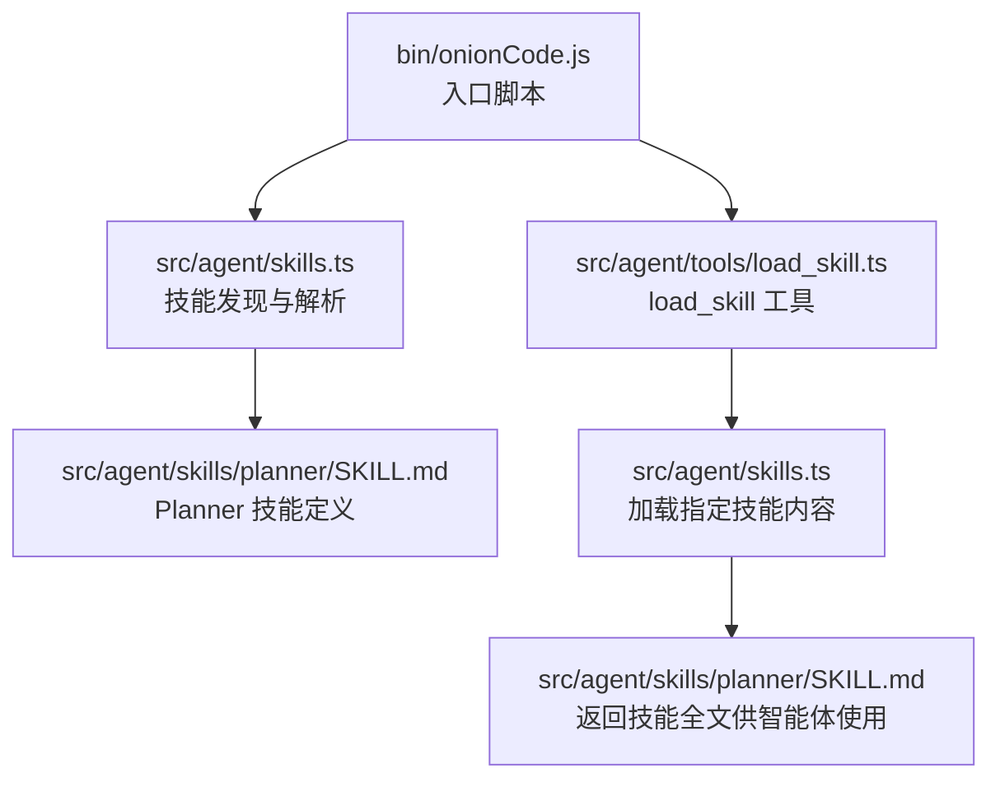
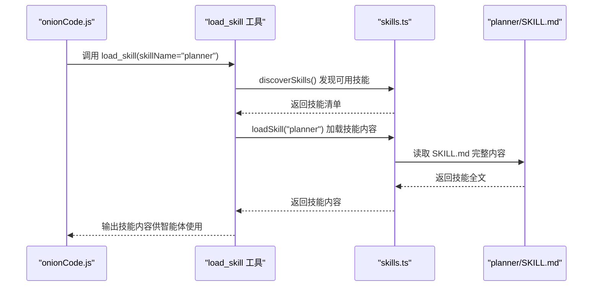
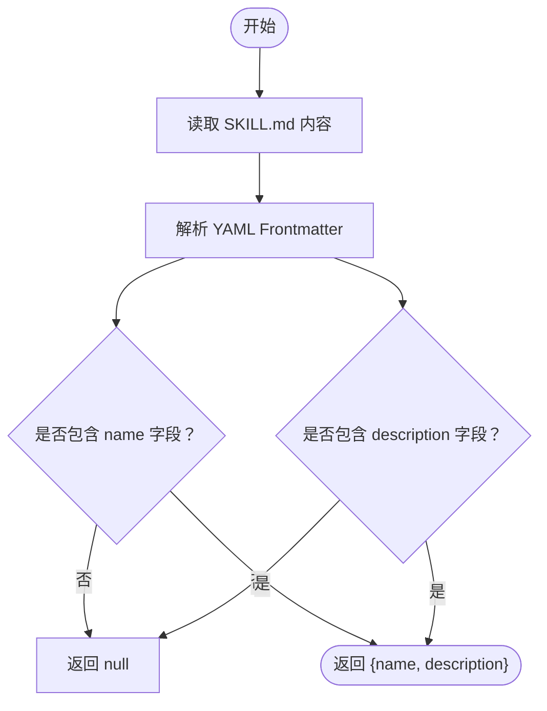
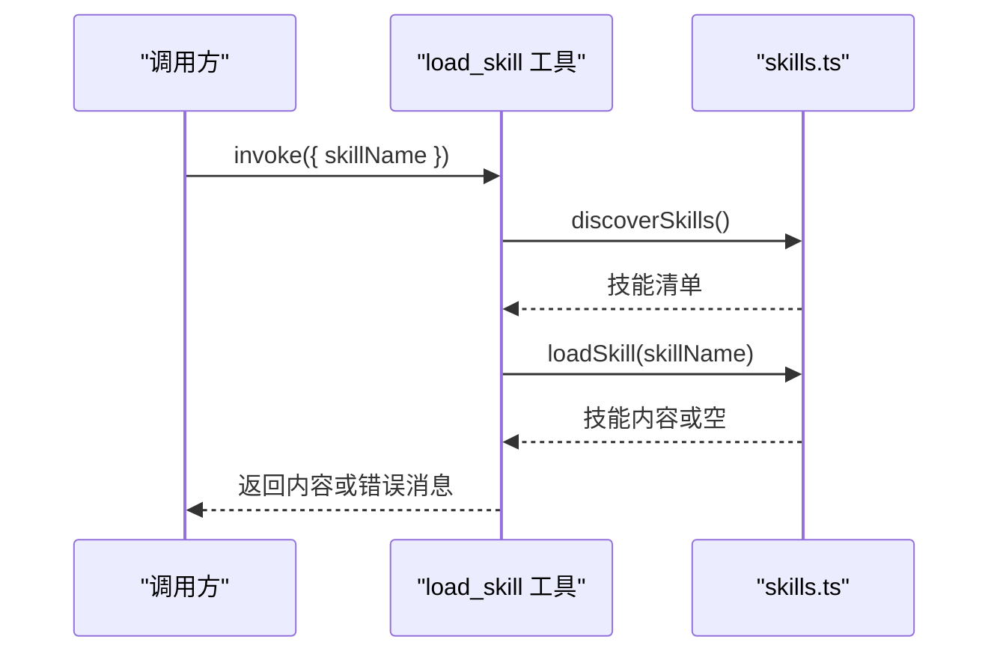
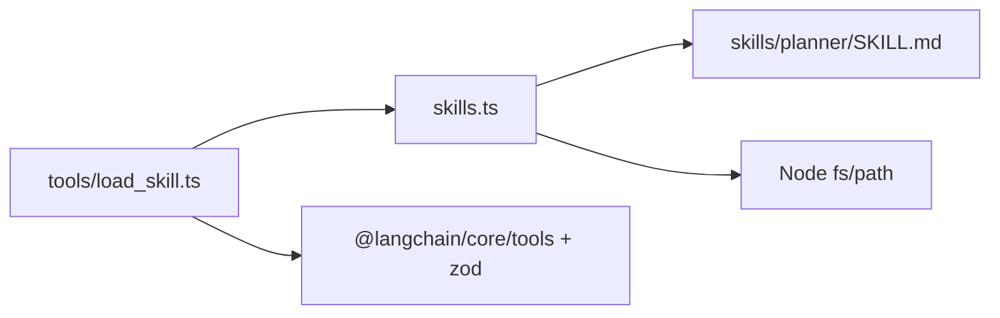

# 规划技能

<cite>
**本文引用的文件**
- [src/agent/skills.ts](file://src/agent/skills.ts)
- [src/agent/tools/load_skill.ts](file://src/agent/tools/load_skill.ts)
- [src/agent/tools/load_skill.test.ts](file://src/agent/tools/load_skill.test.ts)
- [src/agent/skills/planner/SKILL.md](file://src/agent/skills/planner/SKILL.md)
- [src/agent/skills/travel-guide/SKILL.md](file://src/agent/skills/travel-guide/SKILL.md)
- [bin/onionCode.js](file://bin/onionCode.js)
- [package.json](file://package.json)
- [tsconfig.json](file://tsconfig.json)
</cite>

## 目录
1. [简介](#简介)
2. [项目结构](#项目结构)
3. [核心组件](#核心组件)
4. [架构总览](#架构总览)
5. [详细组件分析](#详细组件分析)
6. [依赖分析](#依赖分析)
7. [性能考虑](#性能考虑)
8. [故障排查指南](#故障排查指南)
9. [结论](#结论)
10. [附录](#附录)

## 简介
本文件为“规划技能”的使用文档，目标是帮助用户理解并高效使用系统中的规划能力。根据仓库现有内容，“规划技能”以“Planner”技能的形式存在，其核心职责是协助用户创建待办清单与任务管理。本文将从系统架构、组件关系、数据与处理流程、参数与输入输出规范、使用示例、最佳实践与常见问题等方面进行全面说明。

## 项目结构
规划技能位于“skills”目录下的“planner”子目录中，并通过工具层提供的“load_skill”工具进行加载与激活。整体结构围绕“技能发现—技能加载—技能内容投喂给智能体”的流程展开。

图表来源
- [bin/onionCode.js](file://bin/onionCode.js)
- [src/agent/skills.ts](file://src/agent/skills.ts)
- [src/agent/tools/load_skill.ts](file://src/agent/tools/load_skill.ts)
- [src/agent/skills/planner/SKILL.md](file://src/agent/skills/planner/SKILL.md)

章节来源
- [src/agent/skills.ts:1-47](file://src/agent/skills.ts#L1-L47)
- [src/agent/tools/load_skill.ts:1-33](file://src/agent/tools/load_skill.ts#L1-L33)
- [src/agent/skills/planner/SKILL.md:1-10](file://src/agent/skills/planner/SKILL.md#L1-L10)

## 核心组件
- 技能发现与解析：负责扫描“skills”目录，定位各技能的元信息与定义文件（如“SKILL.md”），并解析其中的YAML frontmatter（名称与描述）。
- 加载工具：对外暴露“load_skill”工具，用于按名称加载指定技能的完整内容，供智能体调用。
- Planner 技能定义：位于“skills/planner/SKILL.md”，提供技能名称、描述及具体使用说明，作为智能体执行任务的指导。

章节来源
- [src/agent/skills.ts:14-28](file://src/agent/skills.ts#L14-L28)
- [src/agent/tools/load_skill.ts:5-33](file://src/agent/tools/load_skill.ts#L5-L33)
- [src/agent/skills/planner/SKILL.md:1-10](file://src/agent/skills/planner/SKILL.md#L1-L10)

## 架构总览
下图展示了从入口脚本到技能加载与使用的端到端流程：

图表来源
- [bin/onionCode.js](file://bin/onionCode.js)
- [src/agent/tools/load_skill.ts](file://src/agent/tools/load_skill.ts)
- [src/agent/skills.ts](file://src/agent/skills.ts)
- [src/agent/skills/planner/SKILL.md](file://src/agent/skills/planner/SKILL.md)

## 详细组件分析

### 组件一：技能发现与解析（skills.ts）
- 功能要点
  - 解析“SKILL.md”的YAML frontmatter，提取技能名称与描述。
  - 自动定位“skills”目录，支持开发环境与构建后环境的路径回退策略。
  - 提供“discoverSkills”与“loadSkill”接口，分别用于枚举与加载技能内容。
- 关键行为
  - 使用正则匹配frontmatter区域与字段，确保名称与描述均存在。
  - 通过文件系统检测“planner/SKILL.md”是否存在，决定当前工作目录。
- 复杂度与性能
  - 前端解析为O(n)（n为frontmatter文本长度），I/O开销取决于文件大小与磁盘性能。
  - 路径探测最多两次尝试，常数级额外开销。
- 错误处理
  - 若frontmatter缺失或字段不全，返回空；若找不到技能或加载失败，上层工具会给出明确错误提示。

图表来源
- [src/agent/skills.ts:14-28](file://src/agent/skills.ts#L14-L28)

章节来源
- [src/agent/skills.ts:14-28](file://src/agent/skills.ts#L14-L28)
- [src/agent/skills.ts:30-47](file://src/agent/skills.ts#L30-L47)

### 组件二：加载工具（load_skill）
- 功能要点
  - 对外暴露Zod Schema，要求传入字符串类型的“skillName”。
  - 先通过“discoverSkills”校验技能是否存在，再调用“loadSkill”加载内容。
  - 返回技能全文，供智能体直接使用。
- 输入输出
  - 输入：{ skillName: string }
  - 输出：string（技能全文）或错误消息字符串。
- 错误处理
  - 当技能不存在时，列出所有可用技能名称，便于用户修正。
  - 当加载失败时，返回失败提示。

图表来源
- [src/agent/tools/load_skill.ts:5-33](file://src/agent/tools/load_skill.ts#L5-L33)
- [src/agent/skills.ts:30-47](file://src/agent/skills.ts#L30-L47)

章节来源
- [src/agent/tools/load_skill.ts:5-33](file://src/agent/tools/load_skill.ts#L5-L33)
- [src/agent/tools/load_skill.test.ts:6-30](file://src/agent/tools/load_skill.test.ts#L6-L30)

### 组件三：Planner 技能定义（SKILL.md）
- 文件位置与用途
  - 位于“skills/planner/SKILL.md”，定义了“Planner”技能的名称、描述与使用说明。
- 使用场景
  - 协助用户创建待办清单与任务管理，适合日常事务规划与执行跟踪。
- 与其他技能的关系
  - 与“travel-guide/SKILL.md”同属“skills”目录，共同构成可被智能体加载的技能集合。

章节来源
- [src/agent/skills/planner/SKILL.md:1-10](file://src/agent/skills/planner/SKILL.md#L1-L10)
- [src/agent/skills/travel-guide/SKILL.md:1-10](file://src/agent/skills/travel-guide/SKILL.md#L1-L10)

## 依赖分析
- 模块耦合
  - “load_skill”工具强依赖“skills.ts”的“discoverSkills”与“loadSkill”能力。
  - “skills.ts”对文件系统有直接依赖，且依赖“planner/SKILL.md”的存在性。
- 外部依赖
  - 使用Zod进行Schema校验，确保输入参数类型安全。
  - 使用Node标准库fs与path进行文件与路径操作。
- 可能的循环依赖
  - 当前设计为单向依赖（工具→技能解析），无循环依赖风险。

图表来源
- [src/agent/tools/load_skill.ts:1-33](file://src/agent/tools/load_skill.ts#L1-L33)
- [src/agent/skills.ts:1-47](file://src/agent/skills.ts#L1-L47)
- [src/agent/skills/planner/SKILL.md](file://src/agent/skills/planner/SKILL.md)

章节来源
- [src/agent/tools/load_skill.ts:1-33](file://src/agent/tools/load_skill.ts#L1-L33)
- [src/agent/skills.ts:1-47](file://src/agent/skills.ts#L1-L47)

## 性能考虑
- I/O优化
  - 将“SKILL.md”保持较小体积，避免在加载时产生过多I/O压力。
  - 避免频繁重复加载同一技能内容，可在上层缓存已加载的技能文本。
- 路径探测
  - “skills.ts”的路径探测仅进行有限次尝试，对启动时间影响极小。
- 并发加载
  - 若同时请求多个技能，建议串行化首次加载，后续复用缓存结果，减少重复解析。

## 故障排查指南
- 无法加载“planner”技能
  - 确认“skills/planner/SKILL.md”存在且包含有效的YAML frontmatter（name与description）。
  - 检查“load_skill”工具的输入参数是否正确传递了“skillName”。
- 报错显示“技能不存在”
  - 工具会列出所有可用技能名称，请核对拼写或选择列表中的名称。
- 加载失败
  - 检查文件权限与路径是否正确；确认Node运行环境具备读取文件的权限。

章节来源
- [src/agent/tools/load_skill.ts:11-14](file://src/agent/tools/load_skill.ts#L11-L14)
- [src/agent/tools/load_skill.ts:18-21](file://src/agent/tools/load_skill.ts#L18-L21)
- [src/agent/tools/load_skill.test.ts:22-30](file://src/agent/tools/load_skill.test.ts#L22-L30)

## 结论
“规划技能（Planner）”通过清晰的技能定义与加载机制，为智能体提供了稳定的任务管理能力。结合“load_skill”工具，用户可以便捷地激活并使用该技能，完成待办清单创建与任务规划。建议在实际应用中遵循本文的最佳实践与故障排查建议，以获得更稳定高效的使用体验。

## 附录

### 使用示例（概念性说明）
- 场景：用户希望创建一个待办清单并跟踪执行进度。
- 步骤概览：
  1) 通过“load_skill”工具加载“planner”技能。
  2) 将技能内容作为上下文提供给智能体。
  3) 向智能体提出任务规划需求（例如“帮我制定本周的学习计划”）。
  4) 智能体基于“Planner”技能的指导生成任务清单与执行建议。
- 注意事项：
  - 确保“SKILL.md”内容完整且描述准确，以便智能体正确理解技能边界与职责。
  - 如需扩展规划能力，可参考“skill-creator”相关文件，学习如何迭代改进技能模板与工作流。

### 参数与输入输出规范
- load_skill 工具
  - 输入：{ skillName: string }（必填）
  - 输出：string（技能全文）或错误消息字符串
- Planner 技能
  - 名称：planner
  - 描述：见“skills/planner/SKILL.md”

章节来源
- [src/agent/tools/load_skill.ts:25-32](file://src/agent/tools/load_skill.ts#L25-L32)
- [src/agent/skills/planner/SKILL.md:1-10](file://src/agent/skills/planner/SKILL.md#L1-L10)