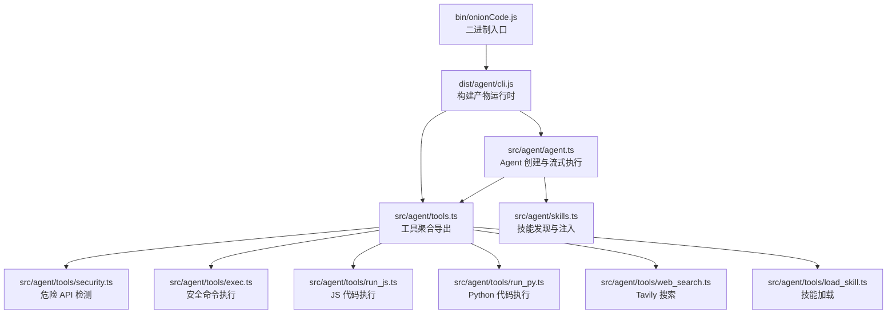
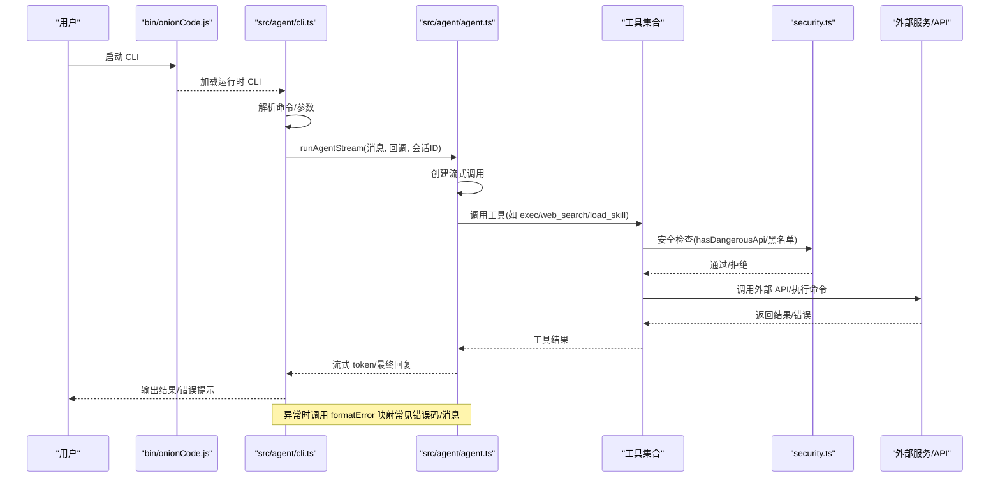
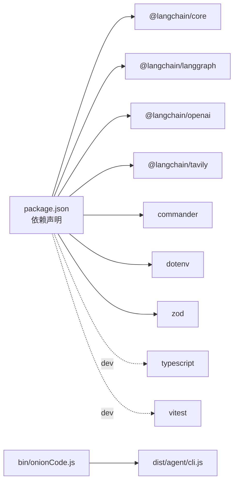

# 故障排除

<cite>
**本文引用的文件**
- [package.json](file://package.json)
- [bin/onionCode.js](file://bin/onionCode.js)
- [src/agent/cli.ts](file://src/agent/cli.ts)
- [src/agent/agent.ts](file://src/agent/agent.ts)
- [src/agent/tools.ts](file://src/agent/tools.ts)
- [src/agent/tools/security.ts](file://src/agent/tools/security.ts)
- [src/agent/tools/exec.ts](file://src/agent/tools/exec.ts)
- [src/agent/tools/run_js.ts](file://src/agent/tools/run_js.ts)
- [src/agent/tools/run_py.ts](file://src/agent/tools/run_py.ts)
- [src/agent/tools/web_search.ts](file://src/agent/tools/web_search.ts)
- [src/agent/skills.ts](file://src/agent/skills.ts)
- [src/agent/tools/load_skill.ts](file://src/agent/tools/load_skill.ts)
</cite>

## 目录
1. [简介](#简介)
2. [项目结构](#项目结构)
3. [核心组件](#核心组件)
4. [架构总览](#架构总览)
5. [详细组件分析](#详细组件分析)
6. [依赖分析](#依赖分析)
7. [性能考虑](#性能考虑)
8. [故障排除指南](#故障排除指南)
9. [结论](#结论)
10. [附录](#附录)

## 简介
本指南面向使用 onion-code CLI 的用户与维护者，提供系统化的故障排除流程与调试方法。内容涵盖安装与环境准备、配置错误定位、运行时异常与错误码解读、性能问题排查与优化建议，并给出资源使用监控与社区支持渠道，帮助快速定位并解决问题。

## 项目结构
onion-code 是一个基于 LangChain 的 CLI AI 助手，支持工具调用、技能加载与流式对话。核心入口为二进制脚本，运行时加载 CLI 控制台与 Agent；Agent 使用 LangGraph 与 LangChain OpenAI 模型，结合一组内置工具完成任务。

图表来源
- [bin/onionCode.js:1-3](file://bin/onionCode.js#L1-L3)
- [src/agent/cli.ts:1-126](file://src/agent/cli.ts#L1-L126)
- [src/agent/agent.ts:1-98](file://src/agent/agent.ts#L1-L98)
- [src/agent/tools.ts:1-10](file://src/agent/tools.ts#L1-L10)
- [src/agent/tools/security.ts:1-27](file://src/agent/tools/security.ts#L1-L27)
- [src/agent/tools/exec.ts:1-143](file://src/agent/tools/exec.ts#L1-L143)
- [src/agent/tools/run_js.ts:1-90](file://src/agent/tools/run_js.ts#L1-L90)
- [src/agent/tools/run_py.ts:1-90](file://src/agent/tools/run_py.ts#L1-L90)
- [src/agent/tools/web_search.ts:1-41](file://src/agent/tools/web_search.ts#L1-L41)
- [src/agent/skills.ts:1-139](file://src/agent/skills.ts#L1-L139)
- [src/agent/tools/load_skill.ts:1-34](file://src/agent/tools/load_skill.ts#L1-L34)

章节来源
- [package.json:1-38](file://package.json#L1-L38)
- [bin/onionCode.js:1-3](file://bin/onionCode.js#L1-L3)
- [src/agent/cli.ts:1-126](file://src/agent/cli.ts#L1-L126)
- [src/agent/agent.ts:1-98](file://src/agent/agent.ts#L1-L98)

## 核心组件
- CLI 入口与交互
  - 二进制入口加载构建产物，提供 ask 命令与交互式聊天两种模式。
  - 对运行期异常进行格式化输出，包含常见错误场景的友好提示。
- Agent 与模型
  - 使用 LangChain OpenAI 模型（默认 DeepSeek 基座），启用流式响应与内存检查点。
  - 将技能注入系统提示，增强能力边界。
- 工具集
  - 文件读写、系统命令执行、JS/Python 代码执行、网页搜索、技能加载等。
  - 执行层均内置安全策略，阻断高危命令与危险 API 调用。
- 技能系统
  - 发现并解析 SKILL.md 的 YAML frontmatter，动态注入可用技能列表。

章节来源
- [src/agent/cli.ts:1-126](file://src/agent/cli.ts#L1-L126)
- [src/agent/agent.ts:1-98](file://src/agent/agent.ts#L1-L98)
- [src/agent/tools.ts:1-10](file://src/agent/tools.ts#L1-L10)
- [src/agent/skills.ts:1-139](file://src/agent/skills.ts#L1-L139)

## 架构总览
以下序列图展示 CLI 与 Agent 的交互流程，以及关键错误处理路径。

图表来源
- [bin/onionCode.js:1-3](file://bin/onionCode.js#L1-L3)
- [src/agent/cli.ts:1-126](file://src/agent/cli.ts#L1-L126)
- [src/agent/agent.ts:1-98](file://src/agent/agent.ts#L1-L98)
- [src/agent/tools/exec.ts:1-143](file://src/agent/tools/exec.ts#L1-L143)
- [src/agent/tools/web_search.ts:1-41](file://src/agent/tools/web_search.ts#L1-L41)
- [src/agent/tools/load_skill.ts:1-34](file://src/agent/tools/load_skill.ts#L1-L34)
- [src/agent/tools/security.ts:1-27](file://src/agent/tools/security.ts#L1-L27)

## 详细组件分析

### CLI 与交互式会话
- ask 命令：一次性问答，流式输出，异常统一格式化。
- 交互式聊天：支持 ESC 中断、线程会话续写、异常捕获与提示。
- 错误映射：针对内容安全拦截、API Key/认证、配额/429、网络超时等场景提供明确提示。

章节来源
- [src/agent/cli.ts:1-126](file://src/agent/cli.ts#L1-L126)

### Agent 与流式执行
- 模型配置：默认使用 DeepSeek 基座，可通过环境变量覆盖模型与基座地址。
- 内存检查点：支持多轮会话续写。
- 流式处理：仅提取 AI 角色的消息片段，过滤工具中间结果，回调逐 token 输出。

章节来源
- [src/agent/agent.ts:1-98](file://src/agent/agent.ts#L1-L98)

### 工具与安全策略
- exec 工具
  - 黑名单命令、eval 注入模式、危险 API 检测三道防线。
  - 超时与缓冲限制，异常时返回标准错误信息。
- JS/Python 执行工具
  - 依赖本地运行时可用性检测，写入临时文件执行，清理临时文件。
  - 超时与缓冲限制，异常时返回标准错误信息。
- Web 搜索工具
  - 依赖 Tavily 客户端与 API Key，缺失时直接提示配置。
- 技能加载工具
  - 先校验可用技能列表，再按名称加载完整内容，失败时返回可诊断信息。

章节来源
- [src/agent/tools/exec.ts:1-143](file://src/agent/tools/exec.ts#L1-L143)
- [src/agent/tools/run_js.ts:1-90](file://src/agent/tools/run_js.ts#L1-L90)
- [src/agent/tools/run_py.ts:1-90](file://src/agent/tools/run_py.ts#L1-L90)
- [src/agent/tools/web_search.ts:1-41](file://src/agent/tools/web_search.ts#L1-L41)
- [src/agent/tools/load_skill.ts:1-34](file://src/agent/tools/load_skill.ts#L1-L34)
- [src/agent/tools/security.ts:1-27](file://src/agent/tools/security.ts#L1-L27)

### 技能系统
- 发现策略：优先使用构建产物目录下的 skills，回退到源目录，保证运行稳定性。
- 解析规则：提取 SKILL.md 的 YAML frontmatter，生成技能清单文本注入系统提示。
- 加载逻辑：按名称匹配并返回完整内容，失败时返回可诊断信息。

章节来源
- [src/agent/skills.ts:1-139](file://src/agent/skills.ts#L1-L139)

## 依赖分析
- 运行时依赖
  - LangChain 生态（LangGraph、OpenAI、Tavily）与 commander、dotenv、zod。
- 开发与测试
  - TypeScript、ts-node、vitest 等。
- 二进制入口
  - 通过 dist/agent/cli.js 运行 CLI。

图表来源
- [package.json:1-38](file://package.json#L1-L38)
- [bin/onionCode.js:1-3](file://bin/onionCode.js#L1-L3)

章节来源
- [package.json:1-38](file://package.json#L1-L38)
- [bin/onionCode.js:1-3](file://bin/onionCode.js#L1-L3)

## 性能考虑
- 流式输出
  - 采用消息流模式逐 token 输出，降低首字延迟，提升交互体验。
- 超时与缓冲
  - 工具执行设置超时与最大缓冲，避免长时间阻塞与内存膨胀。
- 会话续写
  - 使用 MemorySaver 持久化检查点，减少重复上下文传输。
- 临时文件清理
  - JS/Python 执行工具在 finally 中清理临时文件，避免磁盘占用累积。

章节来源
- [src/agent/agent.ts:1-98](file://src/agent/agent.ts#L1-L98)
- [src/agent/tools/exec.ts:1-143](file://src/agent/tools/exec.ts#L1-L143)
- [src/agent/tools/run_js.ts:1-90](file://src/agent/tools/run_js.ts#L1-L90)
- [src/agent/tools/run_py.ts:1-90](file://src/agent/tools/run_py.ts#L1-L90)

## 故障排除指南

### 一、安装与环境准备
- 缺少 Node.js 运行时
  - 症状：JS/Python 执行工具报“运行时不可用”。
  - 排查：确认系统 PATH 中存在 node/python3。
  - 修复：安装 Node.js 与 Python 3，并重新安装依赖。
- 依赖未安装或版本不兼容
  - 症状：构建/运行时报错。
  - 排查：检查 package.json 与 lock 文件一致性。
  - 修复：使用推荐包管理器重建依赖缓存并重装依赖。
- 二进制入口不可用
  - 症状：执行二进制命令失败。
  - 排查：确认 dist/agent/cli.js 存在且可执行。
  - 修复：先执行构建脚本，再运行二进制。

章节来源
- [src/agent/tools/run_js.ts:1-90](file://src/agent/tools/run_js.ts#L1-L90)
- [src/agent/tools/run_py.ts:1-90](file://src/agent/tools/run_py.ts#L1-L90)
- [package.json:1-38](file://package.json#L1-L38)
- [bin/onionCode.js:1-3](file://bin/onionCode.js#L1-L3)

### 二、配置错误
- 环境变量缺失
  - OPENAI_API_KEY：导致认证失败或额度相关错误。
  - OPENAI_MODEL/baseURL：影响模型选择与访问。
  - TAVILY_API_KEY：Web 搜索工具不可用。
  - 修复：在项目根目录创建 .env 并填入对应键值。
- 构建产物中缺少 skills
  - 症状：技能列表为空或加载失败。
  - 排查：确认构建脚本是否复制 src/agent/skills 至 dist。
  - 修复：重新执行构建脚本，确保复制步骤成功。

章节来源
- [src/agent/agent.ts:1-98](file://src/agent/agent.ts#L1-L98)
- [src/agent/skills.ts:1-139](file://src/agent/skills.ts#L1-L139)
- [package.json:1-38](file://package.json#L1-L38)

### 三、运行时异常与错误码解读
- 内容安全拦截（DeepSeek）
  - 症状：提示内容风险拦截。
  - 修复：更换提问方式或简化查询语句。
- 认证失败（401/Incorrect API key）
  - 症状：返回 401 或“API Key 无效”。
  - 修复：检查 OPENAI_API_KEY 是否正确配置。
- 额度不足/限流（insufficient_quota/429）
  - 症状：返回 429 或配额不足。
  - 修复：充值账户或等待配额恢复。
- 网络超时（ETIMEDOUT/timeout）
  - 症状：请求超时。
  - 修复：检查网络连通性，重试或调整超时策略。
- 工具执行错误
  - 症状：exec/run_js/run_py 返回错误信息。
  - 排查：确认命令/代码是否触发安全策略或运行时不可用。
  - 修复：移除高危命令/代码，安装必要运行时，缩短执行时间。
- Web 搜索失败
  - 症状：提示未配置 TAVILY_API_KEY。
  - 修复：配置 TAVILY_API_KEY 并重试。
- 技能加载失败
  - 症状：提示技能不存在或加载失败。
  - 修复：确认技能名称拼写与可用列表一致，检查 SKILL.md 格式。

章节来源
- [src/agent/cli.ts:1-126](file://src/agent/cli.ts#L1-L126)
- [src/agent/tools/exec.ts:1-143](file://src/agent/tools/exec.ts#L1-L143)
- [src/agent/tools/run_js.ts:1-90](file://src/agent/tools/run_js.ts#L1-L90)
- [src/agent/tools/run_py.ts:1-90](file://src/agent/tools/run_py.ts#L1-L90)
- [src/agent/tools/web_search.ts:1-41](file://src/agent/tools/web_search.ts#L1-L41)
- [src/agent/tools/load_skill.ts:1-34](file://src/agent/tools/load_skill.ts#L1-L34)

### 四、调试工具与日志解读
- CLI 日志
  - 工具调用会在控制台打印调用日志，便于定位具体步骤。
- 流式输出
  - 通过 onToken 回调逐 token 输出，观察中断点与异常位置。
- 中断机制
  - 交互式会话支持 ESC 中断，避免长时间等待。
- 环境变量与模型配置
  - 检查 .env 与模型参数，确保与实际服务一致。

章节来源
- [src/agent/agent.ts:1-98](file://src/agent/agent.ts#L1-L98)
- [src/agent/cli.ts:1-126](file://src/agent/cli.ts#L1-L126)

### 五、性能问题排查与优化
- 减少上下文长度
  - 合理使用会话 ID，避免历史过长导致延迟增加。
- 降低工具调用频率
  - 优先使用本地计算与缓存，减少外部 API 调用次数。
- 调整超时与缓冲
  - 根据任务复杂度适当提高超时与缓冲上限，避免误判。
- 监控资源使用
  - 使用系统自带监控工具观察 CPU/内存/IO，定位瓶颈。

章节来源
- [src/agent/agent.ts:1-98](file://src/agent/agent.ts#L1-L98)
- [src/agent/tools/exec.ts:1-143](file://src/agent/tools/exec.ts#L1-L143)
- [src/agent/tools/run_js.ts:1-90](file://src/agent/tools/run_js.ts#L1-L90)
- [src/agent/tools/run_py.ts:1-90](file://src/agent/tools/run_py.ts#L1-L90)

### 六、内存泄漏与资源使用监控
- 临时文件清理
  - JS/Python 执行工具在 finally 中清理临时文件，避免泄漏。
- 超时保护
  - 所有外部调用设置超时，防止长时间占用进程。
- 建议
  - 长时间运行时定期重启进程，释放潜在隐式占用。

章节来源
- [src/agent/tools/run_js.ts:1-90](file://src/agent/tools/run_js.ts#L1-L90)
- [src/agent/tools/run_py.ts:1-90](file://src/agent/tools/run_py.ts#L1-L90)

### 七、社区支持与技术论坛
- 本项目未内置社区链接或论坛地址。建议：
  - 在 GitHub Issues 提交问题，附带环境信息、错误日志与最小复现步骤。
  - 参考 LangChain 官方文档与社区资源获取支持。

[本节不涉及具体文件分析，故无章节来源]

## 结论
通过本指南，您可以系统地定位与解决安装、配置、运行时与性能相关问题。建议在排查过程中优先核对环境变量与依赖完整性，结合 CLI 的友好错误提示与工具日志，逐步缩小范围并采取针对性修复措施。对于持续性性能问题，建议配合系统监控工具与合理的超时/缓冲配置进行优化。

## 附录

### 常见错误码与含义速查
- 401：认证失败，检查 API Key。
- 429：额度不足或限流，检查账户状态。
- ETIMEDOUT/timeout：网络或执行超时，检查网络与超时配置。
- Content Exists Risk：内容安全拦截，更换表述或简化查询。

章节来源
- [src/agent/cli.ts:1-126](file://src/agent/cli.ts#L1-L126)