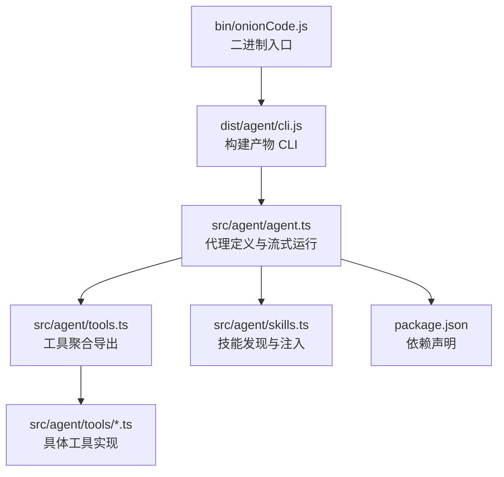
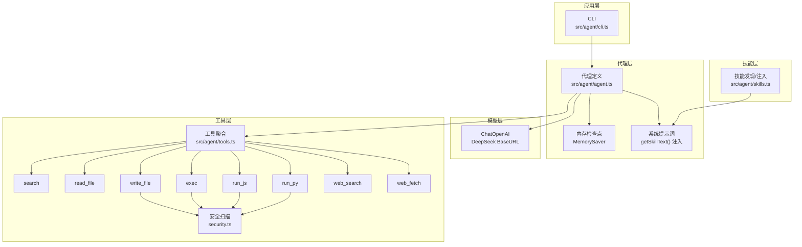
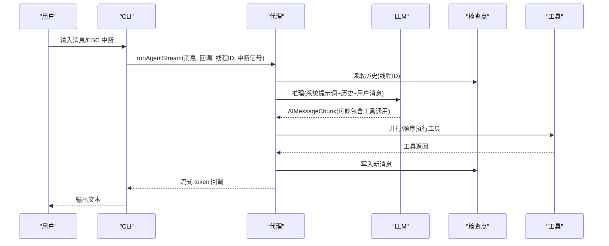
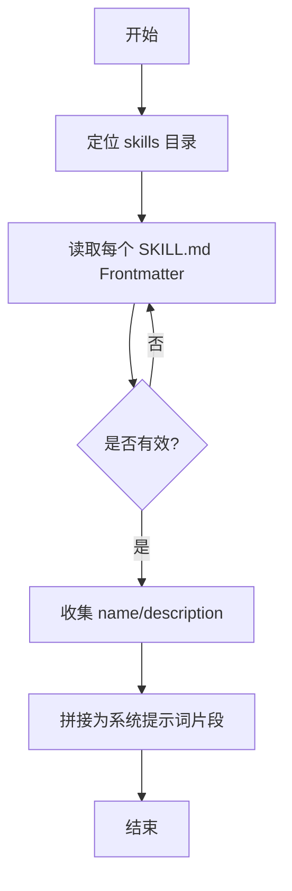
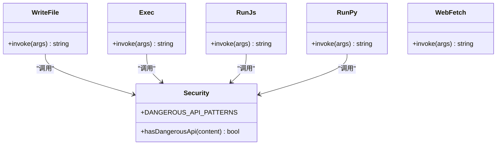
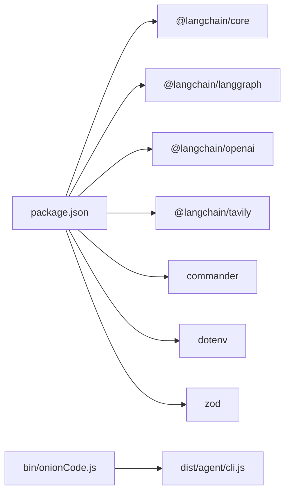

# 代理架构设计

<cite>
**本文引用的文件**
- [agent.ts](file://src/agent/agent.ts)
- [tools.ts](file://src/agent/tools.ts)
- [skills.ts](file://src/agent/skills.ts)
- [cli.ts](file://src/agent/cli.ts)
- [search.ts](file://src/agent/tools/search.ts)
- [read_file.ts](file://src/agent/tools/read_file.ts)
- [write_file.ts](file://src/agent/tools/write_file.ts)
- [exec.ts](file://src/agent/tools/exec.ts)
- [run_js.ts](file://src/agent/tools/run_js.ts)
- [run_py.ts](file://src/agent/tools/run_py.ts)
- [web_search.ts](file://src/agent/tools/web_search.ts)
- [web_fetch.ts](file://src/agent/tools/web_fetch.ts)
- [security.ts](file://src/agent/tools/security.ts)
- [package.json](file://package.json)
- [onionCode.js](file://bin/onionCode.js)
</cite>

## 目录
1. [简介](#简介)
2. [项目结构](#项目结构)
3. [核心组件](#核心组件)
4. [架构总览](#架构总览)
5. [详细组件分析](#详细组件分析)
6. [依赖关系分析](#依赖关系分析)
7. [性能考量](#性能考量)
8. [故障排查指南](#故障排查指南)
9. [结论](#结论)
10. [附录](#附录)

## 简介
本文件面向 Onion Code 代理架构，系统性阐述其基于 LangGraph 的代理核心架构模式、LangChain 集成方式、模型与工具链配置、技能注入机制、初始化流程、内存检查点（MemorySaver）与系统提示词策略、工具调用管理、多模态响应处理以及状态一致性保障。文档同时给出架构决策的技术背景、性能与扩展性设计建议，并提供可直接参考的代码片段路径以指导最佳实践。

## 项目结构
Onion Code 采用“功能域+分层”的组织方式：
- 顶层入口通过二进制脚本启动构建产物中的 CLI。
- CLI 负责解析命令、交互式对话与错误格式化。
- 代理核心位于 agent 目录，包含代理定义、工具集合、技能发现与注入逻辑。
- 工具按职责拆分，统一通过集中导出入口聚合。
- 依赖通过包管理器声明，LangGraph、LangChain OpenAI 适配器与 Tavily 搜索作为外部能力接入。

图示来源
- [onionCode.js:1-3](file://bin/onionCode.js#L1-L3)
- [package.json:1-38](file://package.json#L1-L38)

章节来源
- [onionCode.js:1-3](file://bin/onionCode.js#L1-L3)
- [package.json:1-38](file://package.json#L1-L38)

## 核心组件
- 代理定义与运行
  - 使用 LangGraph 的 createAgent 构建代理，绑定模型、工具集、系统提示词与内存检查点。
  - 提供 runAgentStream 实现流式输出，支持中断信号与线程 ID（会话上下文）。
- 工具集合
  - 聚合搜索、文件读写、命令执行、JS/Python 代码执行、网页检索与抓取等工具。
  - 工具均通过 Zod Schema 声明参数类型，确保 LLM 推理时的结构化调用。
- 技能系统
  - 发现 skills 目录下的技能清单，解析 SKILL.md Frontmatter 注入系统提示词。
  - 支持按名称加载完整技能内容，便于在推理过程中动态选择使用。
- CLI 交互
  - 提供 ask 单轮问答与默认交互式聊天两种模式，支持 ESC 中断与错误友好提示。

章节来源
- [agent.ts:1-98](file://src/agent/agent.ts#L1-L98)
- [tools.ts:1-10](file://src/agent/tools.ts#L1-L10)
- [skills.ts:1-139](file://src/agent/skills.ts#L1-L139)
- [cli.ts:1-126](file://src/agent/cli.ts#L1-L126)

## 架构总览
Onion Code 的代理架构以 LangGraph 为核心，结合 LangChain OpenAI 适配器与 Tavily 搜索，形成“提示词驱动 + 工具调用 + 内存检查点”的闭环。系统通过环境变量配置模型与 API Key，工具链提供文件系统、命令执行、编程语言执行与网络访问能力，技能系统将领域知识以结构化方式注入提示词，增强代理在特定任务上的表现力。

图示来源
- [agent.ts:1-98](file://src/agent/agent.ts#L1-L98)
- [tools.ts:1-10](file://src/agent/tools.ts#L1-L10)
- [skills.ts:1-139](file://src/agent/skills.ts#L1-L139)
- [cli.ts:1-126](file://src/agent/cli.ts#L1-L126)
- [security.ts:1-27](file://src/agent/tools/security.ts#L1-L27)

## 详细组件分析

### 代理初始化与运行流程
- 初始化步骤
  - 通过 dotenv 以项目根目录为基准加载 .env，确保 OPENAI_API_KEY、TAVILY_API_KEY 等可用。
  - 创建 MemorySaver 作为检查点存储，实现消息历史的持久化与恢复。
  - 构造 ChatOpenAI，使用 DeepSeek 的 base URL 与自定义模型名，开启流式输出。
  - 调用 createAgent 创建代理，注入工具集与系统提示词（含技能清单）。
  - 提供 runAgentStream，接收用户消息、线程 ID 与可选中断信号，按消息流式输出。
- 流式输出细节
  - 仅提取类型为 AI 的消息块，忽略工具返回等中间消息。
  - 对 AIMessageChunk 的 content 字段进行拼接，回调上层渲染。
  - 支持 AbortSignal 中断，便于用户通过 ESC 停止生成。

图示来源
- [agent.ts:61-97](file://src/agent/agent.ts#L61-L97)
- [cli.ts:66-125](file://src/agent/cli.ts#L66-L125)

章节来源
- [agent.ts:19-51](file://src/agent/agent.ts#L19-L51)
- [agent.ts:61-97](file://src/agent/agent.ts#L61-L97)
- [cli.ts:66-125](file://src/agent/cli.ts#L66-L125)

### 系统提示词与技能注入机制
- 技能发现
  - 动态定位 skills 目录（优先 dist 后 dev fallback），遍历子目录读取 SKILL.md 的 YAML Frontmatter，提取 name/description。
- 技能注入
  - 将技能清单拼接为系统提示词的一部分，明确告知代理“可用技能”及使用方式。
  - 提供按名称加载完整技能内容的能力，便于在推理中动态选择使用。
- 优势
  - 无需硬编码技能描述，易于扩展与维护。
  - 通过结构化清单提升 LLM 对可用能力的认知与调用准确性。

图示来源
- [skills.ts:30-84](file://src/agent/skills.ts#L30-L84)
- [skills.ts:127-138](file://src/agent/skills.ts#L127-L138)

章节来源
- [skills.ts:14-28](file://src/agent/skills.ts#L14-L28)
- [skills.ts:53-84](file://src/agent/skills.ts#L53-L84)
- [skills.ts:91-119](file://src/agent/skills.ts#L91-L119)
- [skills.ts:127-138](file://src/agent/skills.ts#L127-L138)
- [agent.ts:49](file://src/agent/agent.ts#L49)

### 工具集成与安全策略
- 工具分类与职责
  - 搜索类：本地 search、在线 web_search。
  - 文件类：read_file、write_file（含安全扫描）。
  - 命令执行：exec（多层安全策略）。
  - 编程执行：run_js、run_py（Node/python 环境检测与临时文件执行）。
  - 网络访问：web_fetch（URL 校验、超时与大小限制）。
- 安全策略
  - 黑名单命令、eval 注入模式、危险 API 调用三道防线。
  - 文件写入前对内容进行危险 API 检测；命令执行前综合判定。
  - 临时文件执行后清理，避免残留。
- 多模态响应
  - web_fetch 返回网页文本内容；web_search 返回结构化搜索结果；其他工具返回纯文本或结构化 JSON 文本。
  - 代理通过系统提示词引导 LLM 对不同工具返回进行整合与自然语言回复。

图示来源
- [security.ts:1-27](file://src/agent/tools/security.ts#L1-L27)
- [write_file.ts:7-54](file://src/agent/tools/write_file.ts#L7-L54)
- [exec.ts:94-142](file://src/agent/tools/exec.ts#L94-L142)
- [run_js.ts:22-89](file://src/agent/tools/run_js.ts#L22-L89)
- [run_py.ts:22-89](file://src/agent/tools/run_py.ts#L22-L89)
- [web_fetch.ts:20-82](file://src/agent/tools/web_fetch.ts#L20-L82)

章节来源
- [tools.ts:1-10](file://src/agent/tools.ts#L1-L10)
- [search.ts:4-23](file://src/agent/tools/search.ts#L4-L23)
- [read_file.ts:6-40](file://src/agent/tools/read_file.ts#L6-L40)
- [write_file.ts:7-54](file://src/agent/tools/write_file.ts#L7-L54)
- [exec.ts:66-142](file://src/agent/tools/exec.ts#L66-L142)
- [run_js.ts:22-89](file://src/agent/tools/run_js.ts#L22-L89)
- [run_py.ts:22-89](file://src/agent/tools/run_py.ts#L22-L89)
- [web_search.ts:16-40](file://src/agent/tools/web_search.ts#L16-L40)
- [web_fetch.ts:20-82](file://src/agent/tools/web_fetch.ts#L20-L82)
- [security.ts:1-27](file://src/agent/tools/security.ts#L1-L27)

### 内存检查点与状态一致性
- 检查点机制
  - 使用 MemorySaver 保存与恢复消息历史，通过 configurable.thread_id 区分会话。
  - runAgentStream 默认使用固定线程 ID，CLI 交互场景下保持同一会话上下文。
- 状态一致性
  - 仅当消息类型为 AI 且不包含工具调用块时才视为可输出的文本片段，避免重复或中间状态输出。
  - 工具调用与返回由 LangGraph 自动推进，代理只负责筛选与拼接最终文本。

章节来源
- [agent.ts:23](file://src/agent/agent.ts#L23)
- [agent.ts:61-97](file://src/agent/agent.ts#L61-L97)
- [cli.ts:66-125](file://src/agent/cli.ts#L66-L125)

### CLI 与错误处理
- 命令与行为
  - onionCode ask <message...>：单轮问答，直接输出流式结果。
  - 默认交互式聊天：循环读取用户输入，支持 ESC 中断。
- 错误映射
  - 将常见错误（内容安全拦截、API Key 无效、额度不足、超时等）映射为用户可理解的提示信息。
- 中断机制
  - 通过 AbortController 与 stdin 监听 ESC（ASCII 0x1b）实现即时中断。

章节来源
- [cli.ts:10-38](file://src/agent/cli.ts#L10-L38)
- [cli.ts:40-57](file://src/agent/cli.ts#L40-L57)
- [cli.ts:66-125](file://src/agent/cli.ts#L66-L125)

## 依赖关系分析
- LangGraph 与 LangChain
  - createAgent、MemorySaver、ChatOpenAI、@langchain/tavily 等构成核心依赖。
- 项目脚本
  - dev/start/build/test 分别对应开发、运行、构建与测试。
- 二进制入口
  - bin/onionCode.js 直接加载 dist/agent/cli.js，确保生产环境可直接运行。

图示来源
- [package.json:20-36](file://package.json#L20-L36)
- [onionCode.js:1-3](file://bin/onionCode.js#L1-L3)

章节来源
- [package.json:11-16](file://package.json#L11-L16)
- [package.json:20-36](file://package.json#L20-L36)
- [onionCode.js:1-3](file://bin/onionCode.js#L1-L3)

## 性能考量
- 流式输出
  - 开启 streaming 降低首 Token 延迟，适合终端交互体验。
- 工具执行限制
  - 命令执行设置超时与缓冲区上限，避免长时间阻塞与内存溢出。
  - JS/Python 执行通过临时文件规避复杂转义，减少错误与资源占用。
- 网络访问约束
  - web_fetch 设置超时与最大响应大小，防止大体积响应拖垮代理。
- 模型成本与稳定性
  - 使用 DeepSeek BaseURL 与自定义模型名，便于在不同供应商间切换。
- 可扩展性
  - 新增工具通过统一导出入口聚合，不影响代理配置。
  - 技能系统通过文件系统自动发现，无需修改代码即可扩展领域能力。

## 故障排查指南
- 内容安全拦截
  - 若出现内容风险拦截提示，尝试简化查询或更换表述方式。
- API Key 与配额
  - 401/Incorrect API key：检查 .env 中 OPENAI_API_KEY 是否正确。
  - 429/insufficient_quota：检查账户余额与配额状态。
- 网络与超时
  - ETIMEDOUT：检查网络连通性与代理超时设置。
- 工具调用失败
  - 文件读写：确认文件名与当前工作目录相对路径合法。
  - 命令执行：检查是否命中危险命令/eval 注入/危险 API 模式。
  - JS/Python 执行：确认 Node/python3 可用与临时文件清理成功。
  - 网页抓取：确认 URL 协议为 http/https 且未超时/过大。

章节来源
- [cli.ts:10-38](file://src/agent/cli.ts#L10-L38)
- [read_file.ts:11-15](file://src/agent/tools/read_file.ts#L11-L15)
- [write_file.ts:12-16](file://src/agent/tools/write_file.ts#L12-L16)
- [exec.ts:94-142](file://src/agent/tools/exec.ts#L94-L142)
- [run_js.ts:22-89](file://src/agent/tools/run_js.ts#L22-L89)
- [run_py.ts:22-89](file://src/agent/tools/run_py.ts#L22-L89)
- [web_fetch.ts:20-82](file://src/agent/tools/web_fetch.ts#L20-L82)

## 结论
Onion Code 的代理架构以 LangGraph 为内核，结合 LangChain 生态与自研工具链，实现了“可扩展、可注入、可安全”的智能体系统。通过 MemorySaver 保证会话连续性，通过技能系统与系统提示词增强领域能力，通过多层安全策略与执行限制保障运行安全。该设计在性能与扩展性之间取得平衡，适合在终端与 CLI 场景下提供稳定、可控的智能代理服务。

## 附录
- 最佳实践清单
  - 在 .env 中集中配置 OPENAI_API_KEY/TAVILY_API_KEY 等敏感信息。
  - 使用线程 ID 管理会话上下文，避免跨会话状态污染。
  - 新增工具时遵循 Zod Schema 规范，确保参数校验与 LLM 推理一致。
  - 对高危操作（文件写入、命令执行、编程执行）严格启用安全扫描。
  - 在 CLI 中保留 ESC 中断能力，提升用户体验与安全性。
- 参考代码片段路径
  - 代理初始化与系统提示词注入：[agent.ts:25-51](file://src/agent/agent.ts#L25-L51)
  - 流式运行与中断处理：[agent.ts:61-97](file://src/agent/agent.ts#L61-L97)
  - 技能发现与注入：[skills.ts:53-84](file://src/agent/skills.ts#L53-L84)、[skills.ts:127-138](file://src/agent/skills.ts#L127-L138)
  - 工具聚合导出：[tools.ts:1-10](file://src/agent/tools.ts#L1-L10)
  - 文件读写安全策略：[read_file.ts:6-40](file://src/agent/tools/read_file.ts#L6-L40)、[write_file.ts:7-54](file://src/agent/tools/write_file.ts#L7-L54)
  - 命令执行安全策略：[exec.ts:66-142](file://src/agent/tools/exec.ts#L66-L142)
  - JS/Python 执行安全策略：[run_js.ts:22-89](file://src/agent/tools/run_js.ts#L22-L89)、[run_py.ts:22-89](file://src/agent/tools/run_py.ts#L22-L89)
  - 网络抓取限制：[web_fetch.ts:20-82](file://src/agent/tools/web_fetch.ts#L20-L82)
  - CLI 交互与错误映射：[cli.ts:10-38](file://src/agent/cli.ts#L10-L38)、[cli.ts:66-125](file://src/agent/cli.ts#L66-L125)
  - 二进制入口与构建脚本：[onionCode.js:1-3](file://bin/onionCode.js#L1-L3)、[package.json:11-16](file://package.json#L11-L16)