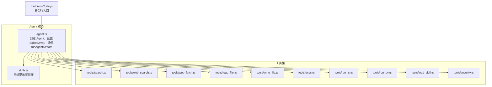
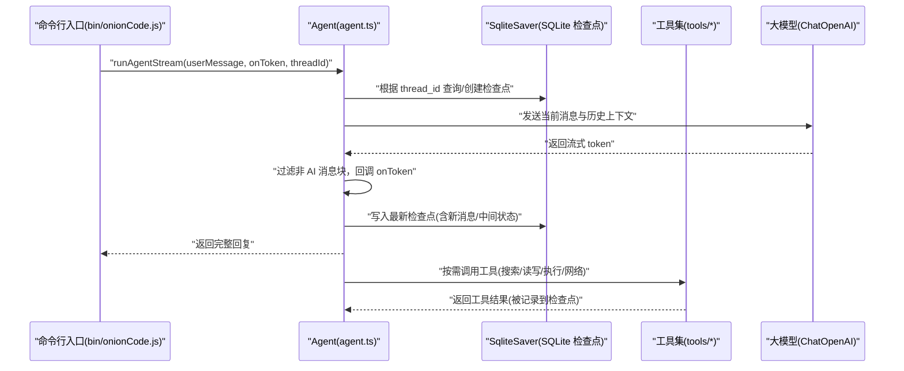
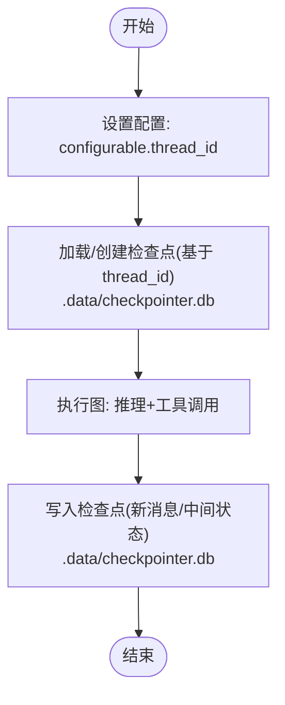
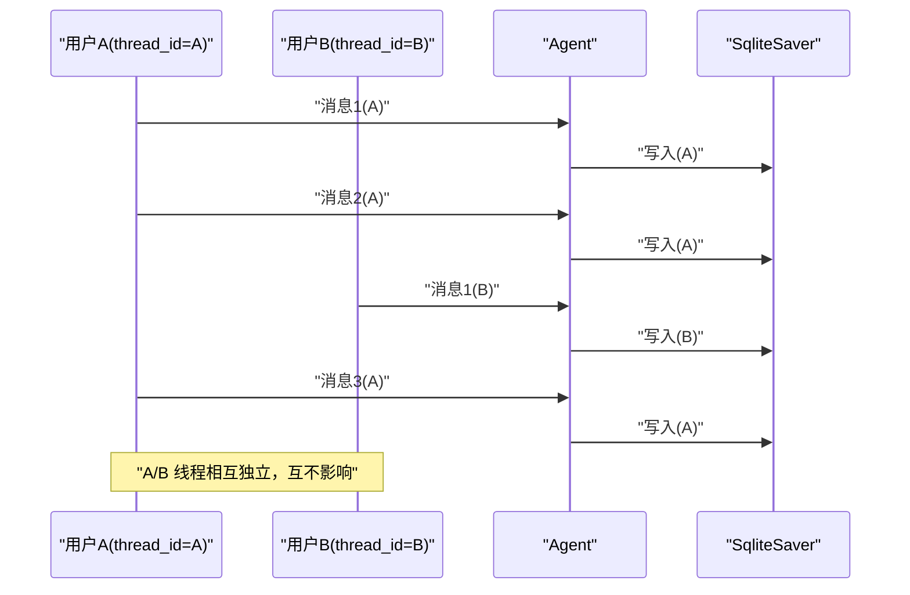
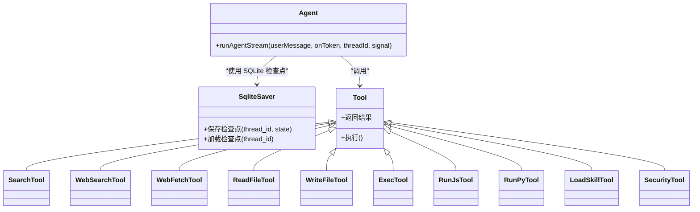
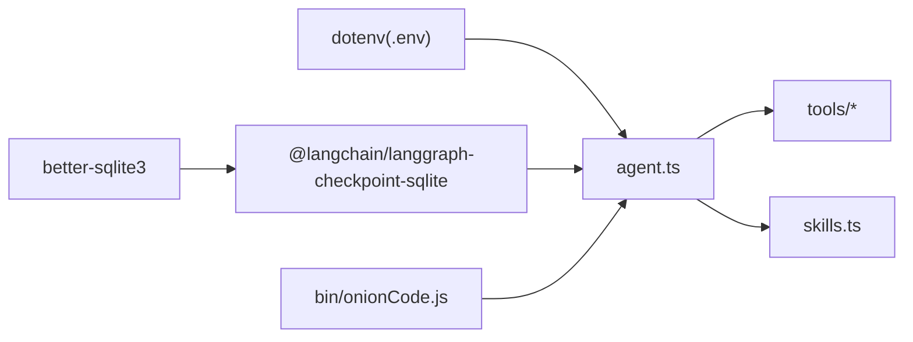

# 会话管理机制

<cite>
**本文档引用的文件**
- [src/agent/agent.ts](file://src/agent/agent.ts)
- [src/agent/tools/load_skill.ts](file://src/agent/tools/load_skill.ts)
- [src/agent/tools/read_file.ts](file://src/agent/tools/read_file.ts)
- [src/agent/tools/write_file.ts](file://src/agent/tools/write_file.ts)
- [src/agent/tools/search.ts](file://src/agent/tools/search.ts)
- [src/agent/tools/web_search.ts](file://src/agent/tools/web_search.ts)
- [src/agent/tools/web_fetch.ts](file://src/agent/tools/web_fetch.ts)
- [src/agent/tools/exec.ts](file://src/agent/tools/exec.ts)
- [src/agent/tools/run_js.ts](file://src/agent/tools/run_js.ts)
- [src/agent/tools/run_py.ts](file://src/agent/tools/run_py.ts)
- [src/agent/tools/security.ts](file://src/agent/tools/security.ts)
- [src/agent/skills.ts](file://src/agent/skills.ts)
- [bin/onionCode.js](file://bin/onionCode.js)
</cite>

## 目录
1. [引言](#引言)
2. [项目结构](#项目结构)
3. [核心组件](#核心组件)
4. [架构总览](#架构总览)
5. [详细组件分析](#详细组件分析)
6. [依赖关系分析](#依赖关系分析)
7. [性能考虑](#性能考虑)
8. [故障排查指南](#故障排查指南)
9. [结论](#结论)
10. [附录](#附录)

## 引言
本文件围绕 Onion Code 的会话管理机制展开，重点解释基于 LangGraph 的 SqliteSaver SQLite 数据库存储检查点（Checkpointer）如何实现"线程 ID（thread_id）"驱动的多会话隔离与历史续接；并结合项目中的 Agent 构建与工具集，系统阐述会话状态的创建、更新、恢复与清理流程，以及在并发场景下的注意事项与性能优化建议。文档同时提供可定位到源码位置的示例路径，帮助读者快速定位实现细节。

## 项目结构
Onion Code 的会话管理主要集中在 src/agent 目录中：
- agent.ts：定义模型、工具与 Agent，配置 SqliteSaver 作为 SQLite 数据库存储检查点，并提供流式执行接口 runAgentStream。
- tools/*：封装各类工具（搜索、文件读写、执行脚本、网络检索/抓取、加载技能等），供 Agent 在推理过程中调用。
- skills.ts：提供技能文本注入能力，用于动态拼接系统提示词。
- bin/onionCode.js：命令行入口，负责解析参数并调用 Agent 执行逻辑。

**图表来源**
- [src/agent/agent.ts:1-51](file://src/agent/agent.ts#L1-L51)
- [src/agent/skills.ts:1-200](file://src/agent/skills.ts#L1-L200)
- [bin/onionCode.js:1-200](file://bin/onionCode.js#L1-L200)

**章节来源**
- [src/agent/agent.ts:1-51](file://src/agent/agent.ts#L1-L51)
- [src/agent/skills.ts:1-200](file://src/agent/skills.ts#L1-L200)
- [bin/onionCode.js:1-200](file://bin/onionCode.js#L1-L200)

## 核心组件
- SqliteSaver（SQLite 检查点存储器）
  - 作用：在 SQLite 数据库中持久化图的状态快照（检查点），使不同调用之间能够基于 thread_id 续接历史消息与中间状态。
  - 配置位置：在 agent.ts 中通过 SqliteSaver.fromConnString() 初始化，连接到 .data/checkpointer.db 文件。
  - 存储位置：检查点数据存储在项目根目录的 .data 目录下的 checkpointer.db SQLite 数据库文件中。
- Agent 流式执行函数 runAgentStream
  - 作用：接收用户消息，按 thread_id 配置检查点，启动流式推理，逐 token 回调并聚合完整回复。
  - 关键点：使用 configurable.thread_id 将会话标识传递给检查点系统；过滤非 AI 消息块，仅对有效内容进行回调。
- 工具集
  - 提供搜索、文件读写、执行脚本、网络检索/抓取、加载技能等能力，Agent 在推理过程中按需调用，其状态变更会被 SqliteSaver 记录到对应 thread_id 的检查点中。

**章节来源**
- [src/agent/agent.ts:59-64](file://src/agent/agent.ts#L59-L64)
- [src/agent/agent.ts:53-97](file://src/agent/agent.ts#L53-L97)

## 架构总览
下图展示了从命令行入口到 Agent 执行再到工具调用的整体流程，以及 SqliteSaver 如何基于 thread_id 管理会话历史：

**图表来源**
- [src/agent/agent.ts:53-97](file://src/agent/agent.ts#L53-L97)
- [src/agent/agent.ts:59-64](file://src/agent/agent.ts#L59-L64)
- [bin/onionCode.js:1-200](file://bin/onionCode.js#L1-L200)

## 详细组件分析

### SqliteSaver 与 SQLite 检查点机制
- 工作原理
  - SqliteSaver 将图的"检查点"保存在 SQLite 数据库中，每个 thread_id 对应一个独立的检查点树。
  - 当传入相同的 thread_id 时，LangGraph 会自动从该线程的历史中续接消息与中间状态，从而实现"会话"的连续性。
  - 检查点数据存储在 .data/checkpointer.db 文件中，支持跨进程持久化。
- 与 Agent 的集成
  - 在 agent.ts 中，通过 SqliteSaver.fromConnString() 注入 SQLite 检查点存储；随后在 runAgentStream 中以 configurable.thread_id 选择目标线程。
- 并发与隔离
  - 不同 thread_id 互不干扰，天然支持多用户或多轮对话的隔离管理。
  - 同一线程内，后续调用会合并新的消息与工具结果，形成连续的历史。

**图表来源**
- [src/agent/agent.ts:59-64](file://src/agent/agent.ts#L59-L64)
- [src/agent/agent.ts:53-97](file://src/agent/agent.ts#L53-L97)

**章节来源**
- [src/agent/agent.ts:59-64](file://src/agent/agent.ts#L59-L64)
- [src/agent/agent.ts:53-97](file://src/agent/agent.ts#L53-L97)

### 线程 ID（thread_id）管理与多会话隔离
- 会话创建
  - 首次使用某个 thread_id 调用 runAgentStream 时，若检查点不存在，则创建新的空检查点树。
- 会话更新
  - 每次调用都会将本次消息与工具结果写入对应线程的检查点，历史得以累积。
- 会话恢复
  - 使用相同 thread_id 再次调用，会自动从上次保存的位置续接，无需手动传入历史。
- 多用户/多轮对话隔离
  - 通过为不同用户或不同轮次分配不同的 thread_id，即可实现完全隔离的会话空间。

**图表来源**
- [src/agent/agent.ts:53-97](file://src/agent/agent.ts#L53-L97)
- [src/agent/agent.ts:59-64](file://src/agent/agent.ts#L59-L64)

**章节来源**
- [src/agent/agent.ts:53-97](file://src/agent/agent.ts#L53-L97)

### 会话生命周期与状态清理
- 生命周期阶段
  - 创建：首次以某 thread_id 调用 runAgentStream。
  - 运行：多次调用，消息与工具结果持续写入检查点。
  - 清理：SqliteSaver 使用 SQLite 数据库存储，重启后检查点仍然存在；可通过删除 .data 目录或数据库文件实现清理。
- 存储位置
  - 检查点数据存储在 .data/checkpointer.db SQLite 数据库文件中。
  - 自动创建 .data 目录用于存储检查点文件。
- 清理策略
  - 进程级：重启后检查点仍然存在，支持持久化会话。
  - 手动清理：删除 .data 目录或其中的 checkpointer.db 文件可清除所有会话历史。
  - 建议：生产环境推荐使用 SQLite 持久化，确保会话历史跨进程保留。

**章节来源**
- [src/agent/agent.ts:59-64](file://src/agent/agent.ts#L59-L64)

### 工具调用与状态传播
- 工具调用链路
  - Agent 在推理过程中可能调用多种工具（搜索、文件读写、执行脚本、网络检索/抓取、加载技能等）。
  - 工具的输入输出与中间状态会被记录到 SQLite 检查点中，确保后续推理能基于完整上下文进行。
- 示例路径
  - 搜索工具：[src/agent/tools/search.ts](file://src/agent/tools/search.ts)
  - 网络检索：[src/agent/tools/web_search.ts](file://src/agent/tools/web_search.ts)
  - 网络抓取：[src/agent/tools/web_fetch.ts](file://src/agent/tools/web_fetch.ts)
  - 文件读写：[src/agent/tools/read_file.ts](file://src/agent/tools/read_file.ts)、[src/agent/tools/write_file.ts](file://src/agent/tools/write_file.ts)
  - 执行脚本：[src/agent/tools/exec.ts](file://src/agent/tools/exec.ts)、[src/agent/tools/run_js.ts](file://src/agent/tools/run_js.ts)、[src/agent/tools/run_py.ts](file://src/agent/tools/run_py.ts)
  - 加载技能：[src/agent/tools/load_skill.ts](file://src/agent/tools/load_skill.ts)
  - 安全策略：[src/agent/tools/security.ts](file://src/agent/tools/security.ts)

**图表来源**
- [src/agent/agent.ts:59-64](file://src/agent/agent.ts#L59-L64)
- [src/agent/tools/search.ts](file://src/agent/tools/search.ts)
- [src/agent/tools/web_search.ts](file://src/agent/tools/web_search.ts)
- [src/agent/tools/web_fetch.ts](file://src/agent/tools/web_fetch.ts)
- [src/agent/tools/read_file.ts](file://src/agent/tools/read_file.ts)
- [src/agent/tools/write_file.ts](file://src/agent/tools/write_file.ts)
- [src/agent/tools/exec.ts](file://src/agent/tools/exec.ts)
- [src/agent/tools/run_js.ts](file://src/agent/tools/run_js.ts)
- [src/agent/tools/run_py.ts](file://src/agent/tools/run_py.ts)
- [src/agent/tools/load_skill.ts](file://src/agent/tools/load_skill.ts)
- [src/agent/tools/security.ts](file://src/agent/tools/security.ts)

**章节来源**
- [src/agent/agent.ts:59-64](file://src/agent/agent.ts#L59-L64)
- [src/agent/tools/search.ts](file://src/agent/tools/search.ts)
- [src/agent/tools/web_search.ts](file://src/agent/tools/web_search.ts)
- [src/agent/tools/web_fetch.ts](file://src/agent/tools/web_fetch.ts)
- [src/agent/tools/read_file.ts](file://src/agent/tools/read_file.ts)
- [src/agent/tools/write_file.ts](file://src/agent/tools/write_file.ts)
- [src/agent/tools/exec.ts](file://src/agent/tools/exec.ts)
- [src/agent/tools/run_js.ts](file://src/agent/tools/run_js.ts)
- [src/agent/tools/run_py.ts](file://src/agent/tools/run_py.ts)
- [src/agent/tools/load_skill.ts](file://src/agent/tools/load_skill.ts)
- [src/agent/tools/security.ts](file://src/agent/tools/security.ts)

### 会话状态查询与清理操作（示例路径）
- 会话创建与续接
  - 使用指定 thread_id 首次调用 runAgentStream 即完成创建；后续使用相同 thread_id 即为续接。
  - 示例路径：[src/agent/agent.ts:53-97](file://src/agent/agent.ts#L53-L97)
- 状态查询（检查点）
  - 通过 SqliteSaver 的加载能力获取指定 thread_id 的检查点状态（内部实现，不暴露于公共 API）。
  - 检查点存储位置：.data/checkpointer.db
  - 示例路径：[src/agent/agent.ts:59-64](file://src/agent/agent.ts#L59-L64)
- 状态清理
  - SqliteSaver 使用 SQLite 数据库存储，重启后检查点仍然存在；可通过删除 .data 目录实现清理。
  - 示例路径：[src/agent/agent.ts:59-64](file://src/agent/agent.ts#L59-L64)

**章节来源**
- [src/agent/agent.ts:59-64](file://src/agent/agent.ts#L59-L64)
- [src/agent/agent.ts:53-97](file://src/agent/agent.ts#L53-L97)

## 依赖关系分析
- 外部依赖
  - langchain：提供 createAgent、ChatOpenAI、SqliteSaver 等核心能力。
  - @langchain/langgraph-checkpoint-sqlite：提供 SQLite 检查点存储实现。
  - better-sqlite3：SQLite 数据库驱动程序。
  - dotenv：从项目根目录加载环境变量（如 OPENAI_API_KEY、OPENAI_MODEL）。
- 内部依赖
  - agent.ts 依赖 tools/* 与 skills.ts；bin/onionCode.js 依赖 agent.ts 的导出接口。

**图表来源**
- [src/agent/agent.ts:1-51](file://src/agent/agent.ts#L1-L51)
- [bin/onionCode.js:1-200](file://bin/onionCode.js#L1-L200)

**章节来源**
- [src/agent/agent.ts:1-51](file://src/agent/agent.ts#L1-L51)
- [bin/onionCode.js:1-200](file://bin/onionCode.js#L1-L200)

## 性能考虑
- 流式输出
  - runAgentStream 采用流式模式，逐 token 回调，降低首 Token 延迟并提升交互体验。
  - 示例路径：[src/agent/agent.ts:53-97](file://src/agent/agent.ts#L53-L97)
- 检查点写入频率
  - SqliteSaver 在每次推理步中写入检查点，保证一致性；在高并发场景下建议：
    - 控制 thread_id 数量，避免过多线程导致频繁写入。
    - 对长对话进行周期性摘要或截断，减少检查点体积。
    - SQLite 数据库支持事务操作，写入性能优于文件系统。
- 工具调用开销
  - 搜索、网络检索/抓取、文件读写、脚本执行等工具可能带来额外延迟；建议：
    - 合理设计工具调用顺序与条件分支，避免不必要的工具调用。
    - 对外部资源访问增加超时与重试策略（在工具层实现）。
- 模型配置
  - 通过环境变量控制模型与基础地址，确保与服务端兼容；必要时开启本地缓存或代理以降低网络抖动影响。
  - 示例路径：[src/agent/agent.ts:25-33](file://src/agent/agent.ts#L25-L33)

**章节来源**
- [src/agent/agent.ts:53-97](file://src/agent/agent.ts#L53-L97)
- [src/agent/agent.ts:25-33](file://src/agent/agent.ts#L25-L33)

## 故障排查指南
- 无法加载环境变量
  - 现象：API 密钥或模型名未生效。
  - 排查：确认 .env 文件位于项目根目录，且 agent.ts 中使用了基于项目根目录的路径加载。
  - 示例路径：[src/agent/agent.ts:56-57](file://src/agent/agent.ts#L56-L57)
- 会话历史未续接
  - 现象：每次调用都像"全新会话"。
  - 排查：确保调用 runAgentStream 时传入了正确的 thread_id，并保持一致；检查 SqliteSaver 是否被正确注入。
  - 示例路径：[src/agent/agent.ts:53-97](file://src/agent/agent.ts#L53-L97)
- SQLite 数据库文件问题
  - 现象：检查点无法保存或加载。
  - 排查：确认 .data 目录具有写入权限；检查 checkpointer.db 文件是否存在且可访问。
  - 示例路径：[src/agent/agent.ts:59-64](file://src/agent/agent.ts#L59-L64)
- 流式回调异常中断
  - 现象：中途被中断或回调缺失。
  - 排查：检查调用侧是否设置了 AbortSignal；确认过滤逻辑仅跳过非 AI 消息块。
  - 示例路径：[src/agent/agent.ts:53-97](file://src/agent/agent.ts#L53-L97)
- 工具调用失败
  - 现象：搜索/读写/执行/网络请求报错。
  - 排查：检查对应工具的实现与权限；在网络相关工具中增加超时与错误处理。
  - 示例路径：[src/agent/tools/web_search.ts](file://src/agent/tools/web_search.ts)、[src/agent/tools/web_fetch.ts](file://src/agent/tools/web_fetch.ts)、[src/agent/tools/read_file.ts](file://src/agent/tools/read_file.ts)、[src/agent/tools/exec.ts](file://src/agent/tools/exec.ts)

**章节来源**
- [src/agent/agent.ts:56-57](file://src/agent/agent.ts#L56-L57)
- [src/agent/agent.ts:53-97](file://src/agent/agent.ts#L53-L97)
- [src/agent/agent.ts:59-64](file://src/agent/agent.ts#L59-L64)
- [src/agent/tools/web_search.ts](file://src/agent/tools/web_search.ts)
- [src/agent/tools/web_fetch.ts](file://src/agent/tools/web_fetch.ts)
- [src/agent/tools/read_file.ts](file://src/agent/tools/read_file.ts)
- [src/agent/tools/exec.ts](file://src/agent/tools/exec.ts)

## 结论
Onion Code 的会话管理以 SqliteSaver 为核心，借助 thread_id 实现多会话隔离与历史续接，配合流式执行与丰富的工具集，满足多轮对话与复杂任务编排的需求。SQLite 数据库存储提供了可靠的持久化能力，支持跨进程会话恢复。在生产环境中，建议合理配置 SQLite 存储路径，结合合理的会话生命周期管理与性能优化策略，以获得更稳定与高效的用户体验。

## 附录
- 命令行入口与参数
  - 入口文件：[bin/onionCode.js](file://bin/onionCode.js)
  - 功能：解析用户输入，调用 Agent 执行推理与工具调用。
- 技能文本注入
  - 作用：将技能描述动态拼接到系统提示词中，增强 Agent 的上下文能力。
  - 示例路径：[src/agent/skills.ts](file://src/agent/skills.ts)
- 检查点存储位置
  - SQLite 数据库文件：.data/checkpointer.db
  - 自动创建目录：.data/
  - 示例路径：[src/agent/agent.ts:59-64](file://src/agent/agent.ts#L59-L64)

**章节来源**
- [bin/onionCode.js:1-200](file://bin/onionCode.js#L1-L200)
- [src/agent/skills.ts](file://src/agent/skills.ts)
- [src/agent/agent.ts:59-64](file://src/agent/agent.ts#L59-L64)