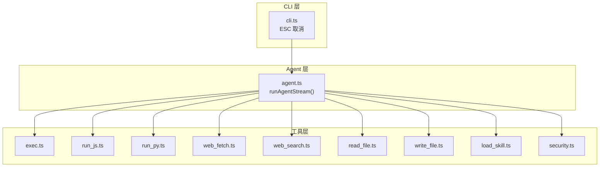
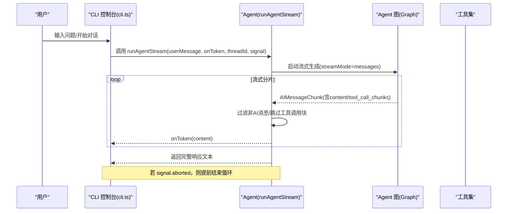
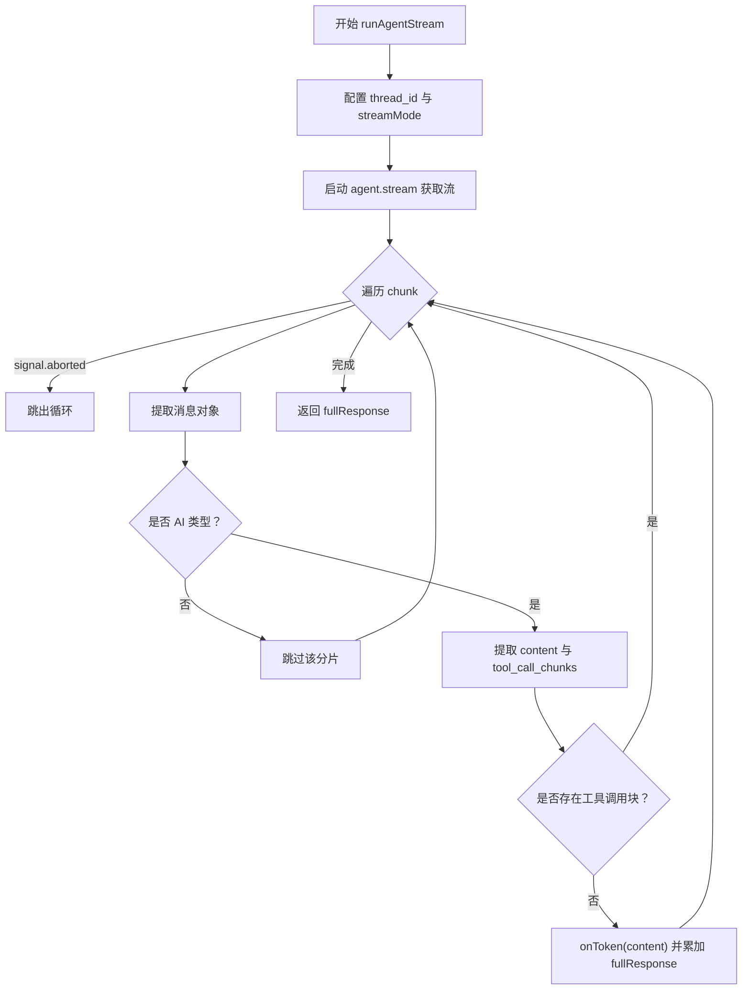
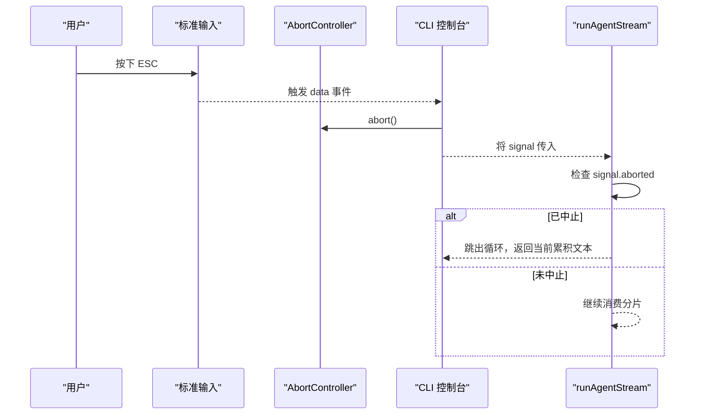
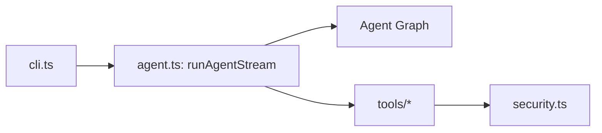

# 响应流式处理

<cite>
**本文引用的文件**
- [src/agent/agent.ts](file://src/agent/agent.ts)
- [src/agent/cli.ts](file://src/agent/cli.ts)
- [src/agent/tools/exec.ts](file://src/agent/tools/exec.ts)
- [src/agent/tools/run_js.ts](file://src/agent/tools/run_js.ts)
- [src/agent/tools/run_py.ts](file://src/agent/tools/run_py.ts)
- [src/agent/tools/web_fetch.ts](file://src/agent/tools/web_fetch.ts)
- [src/agent/tools/web_search.ts](file://src/agent/tools/web_search.ts)
- [src/agent/tools/read_file.ts](file://src/agent/tools/read_file.ts)
- [src/agent/tools/write_file.ts](file://src/agent/tools/write_file.ts)
- [src/agent/tools/load_skill.ts](file://src/agent/tools/load_skill.ts)
- [src/agent/tools/security.ts](file://src/agent/tools/security.ts)
</cite>

## 目录
1. [简介](#简介)
2. [项目结构](#项目结构)
3. [核心组件](#核心组件)
4. [架构总览](#架构总览)
5. [详细组件分析](#详细组件分析)
6. [依赖关系分析](#依赖关系分析)
7. [性能考虑](#性能考虑)
8. [故障排查指南](#故障排查指南)
9. [结论](#结论)
10. [附录](#附录)

## 简介
本文件聚焦于 Onion Code 的“响应流式处理”机制，围绕以下目标展开：  
- 解释流式响应的实现原理与 token 级别处理流程  
- 说明 runAgentStream 的工作流程、AbortSignal 取消机制与错误处理策略  
- 阐述如何过滤非 AI 消息、处理工具调用块以及构建完整响应文本  
- 提供性能优化、内存管理与用户体验设计建议  
- 给出可直接参考的代码片段路径，便于集成与扩展  

## 项目结构
Onion Code 的流式处理主要位于 agent 子模块中，核心入口为 runAgentStream 函数，配合 CLI 控制台进行交互；工具集提供外部能力（如执行脚本、网络请求、文件读写、技能加载等）。整体采用“Agent 流式生成 + 工具调用”的模式，通过消息流分片逐步产出 token，并在回调中实时呈现。

图示来源
- [src/agent/agent.ts](file://src/agent/agent.ts)
- [src/agent/cli.ts](file://src/agent/cli.ts)
- [src/agent/tools/exec.ts](file://src/agent/tools/exec.ts)
- [src/agent/tools/run_js.ts](file://src/agent/tools/run_js.ts)
- [src/agent/tools/run_py.ts](file://src/agent/tools/run_py.ts)
- [src/agent/tools/web_fetch.ts](file://src/agent/tools/web_fetch.ts)
- [src/agent/tools/web_search.ts](file://src/agent/tools/web_search.ts)
- [src/agent/tools/read_file.ts](file://src/agent/tools/read_file.ts)
- [src/agent/tools/write_file.ts](file://src/agent/tools/write_file.ts)
- [src/agent/tools/load_skill.ts](file://src/agent/tools/load_skill.ts)
- [src/agent/tools/security.ts](file://src/agent/tools/security.ts)

章节来源
- [src/agent/agent.ts](file://src/agent/agent.ts)
- [src/agent/cli.ts](file://src/agent/cli.ts)

## 核心组件
- runAgentStream：负责启动 Agent 流式生成、消费消息分片、过滤非 AI 内容、触发 token 回调并累积完整文本。  
- CLI 控制台：提供 ESC 中断能力，将 AbortSignal 传递给 runAgentStream，实现用户主动取消。  
- 工具集：提供多种外部能力，可能在流式过程中产生工具调用分片，需被正确识别与跳过。  
- 安全策略：对工具调用进行安全检查，避免危险操作。

章节来源
- [src/agent/agent.ts](file://src/agent/agent.ts)
- [src/agent/cli.ts](file://src/agent/cli.ts)
- [src/agent/tools/security.ts](file://src/agent/tools/security.ts)

## 架构总览
下图展示了从 CLI 到 Agent 再到工具的端到端流式处理链路，以及取消信号的传播路径。

图示来源
- [src/agent/agent.ts](file://src/agent/agent.ts)
- [src/agent/cli.ts](file://src/agent/cli.ts)

## 详细组件分析

### runAgentStream 流程与 token 处理
- 启动流式生成：以 messages 形式传入当前用户输入，配置 thread_id 与 streamMode 为 messages，获得异步迭代器。  
- 分片消费与取消：遍历每个 chunk，若 AbortSignal 已中止则跳出；否则提取首个消息对象。  
- 过滤非 AI 消息：仅保留类型为“ai”的消息，跳过工具结果等中间消息，但仍继续推进流以保证图的完整性。  
- 工具调用块过滤：当存在 tool_call_chunks 时视为工具调用阶段，不作为最终文本输出，继续等待 AI 内容。  
- 实时回调：对有效 content 触发 onToken 回调，同时累积到 fullResponse。  
- 返回值：返回完整 AI 回复文本，供上层使用。

图示来源
- [src/agent/agent.ts](file://src/agent/agent.ts)

章节来源
- [src/agent/agent.ts](file://src/agent/agent.ts)

### AbortSignal 取消机制
- CLI 侧：监听标准输入数据，遇到 ESC（ASCII 0x1b）时触发 AbortController.abort()，向下游传播中止信号。  
- Agent 侧：在每次分片消费前检查 signal.aborted，一旦为真立即跳出循环，避免继续占用资源。  
- 用户体验：用户可在任意时刻按 ESC 中断生成，提升交互可控性。

图示来源
- [src/agent/cli.ts](file://src/agent/cli.ts)
- [src/agent/agent.ts](file://src/agent/agent.ts)

章节来源
- [src/agent/cli.ts](file://src/agent/cli.ts)
- [src/agent/agent.ts](file://src/agent/agent.ts)

### 工具调用块与非 AI 消息过滤
- 工具调用块：当 AIMessageChunk 包含 tool_call_chunks 时，表示正在生成或执行工具调用，此时 content 为空或无效，应跳过，等待后续 AI 内容分片。  
- 非 AI 消息：通过消息对象的类型判断（例如 _getType() 返回值），仅处理“ai”类型的消息，其他中间状态（如工具结果、计划变更等）均忽略。  
- 目的：确保 onToken 回调只收到最终可显示的自然语言内容，避免将工具描述、JSON 输入或中间日志混入用户界面。

章节来源
- [src/agent/agent.ts](file://src/agent/agent.ts)

### 完整响应文本构建与返回
- 累积策略：在过滤后，将每个有效 content 拼接到 fullResponse，形成完整回复文本。  
- 返回时机：当流结束或被取消时，返回当前累积的 fullResponse，供上层记录或进一步处理。  
- 注意：若中途被取消，返回的是“部分响应”，上层可根据需要决定是否提示用户“未完整”。

章节来源
- [src/agent/agent.ts](file://src/agent/agent.ts)

### 工具集与安全策略
- 执行类工具：支持在受控环境中执行 JS/Python 代码，具备安全扫描与阻断逻辑，防止危险指令执行。  
- 网络类工具：支持 HTTP/HTTPS 请求与搜索，具备超时与协议限制等安全策略。  
- 文件类工具：支持读写文件，结合安全策略限制敏感路径与操作。  
- 技能加载：支持动态加载技能包，便于扩展 Agent 的能力边界。  
- 安全策略：统一的安全检查模块，贯穿工具调用的输入校验与行为约束。

章节来源
- [src/agent/tools/exec.ts](file://src/agent/tools/exec.ts)
- [src/agent/tools/run_js.ts](file://src/agent/tools/run_js.ts)
- [src/agent/tools/run_py.ts](file://src/agent/tools/run_py.ts)
- [src/agent/tools/web_fetch.ts](file://src/agent/tools/web_fetch.ts)
- [src/agent/tools/web_search.ts](file://src/agent/tools/web_search.ts)
- [src/agent/tools/read_file.ts](file://src/agent/tools/read_file.ts)
- [src/agent/tools/write_file.ts](file://src/agent/tools/write_file.ts)
- [src/agent/tools/load_skill.ts](file://src/agent/tools/load_skill.ts)
- [src/agent/tools/security.ts](file://src/agent/tools/security.ts)

## 依赖关系分析
- runAgentStream 依赖 Agent 图的流式生成能力，消费 AIMessageChunk 并通过回调输出 token。  
- CLI 通过 AbortController 与 runAgentStream 协作，实现用户中断。  
- 工具集为 Agent 的能力扩展，可能在流过程中产生工具调用分片，需被正确过滤。  
- 安全策略贯穿工具调用，保障运行时安全。

图示来源
- [src/agent/cli.ts](file://src/agent/cli.ts)
- [src/agent/agent.ts](file://src/agent/agent.ts)
- [src/agent/tools/security.ts](file://src/agent/tools/security.ts)

章节来源
- [src/agent/agent.ts](file://src/agent/agent.ts)
- [src/agent/cli.ts](file://src/agent/cli.ts)
- [src/agent/tools/security.ts](file://src/agent/tools/security.ts)

## 性能考虑
- 流式消费与增量回调：采用 for-await-of 遍历流，边生成边回调，降低首 token 延迟与内存峰值。  
- 取消早停：AbortSignal 使长耗时生成可即时终止，避免无意义的计算与 IO。  
- 过滤开销最小化：仅进行简单类型判断与字段存在性检查，避免复杂解析。  
- 文本累积：字符串拼接在 JS 中为不可变操作，建议在高频场景下考虑使用数组收集后 join，减少多次分配。  
- 工具调用并发：若未来引入多工具并行，需评估线程池与资源配额，避免阻塞主流。  
- 缓冲与背压：CLI 输出侧若为终端，注意写缓冲区大小与刷新策略，避免卡顿。

## 故障排查指南
- 无法中断：确认 CLI 是否正确注册 ESC 监听并在按下 ESC 时调用 abort()，同时确保 runAgentStream 正确接收并检查 signal。  
- token 不显示：检查 AIMessageChunk 的 content 字段是否存在，以及是否被工具调用块过滤；确认 _getType 判断逻辑是否命中“ai”。  
- 响应不完整：若中途取消，返回的是部分响应；可在 UI 上提示“已中断”并允许重新发起请求。  
- 工具报错：若工具执行失败，通常会返回错误信息字符串；建议在 onToken 中区分“普通 token”与“错误提示”，并在 UI 上高亮显示。  
- 网络/超时：网络工具可能因超时返回特定错误字符串；建议在 UI 上提示“网络异常/超时”，并提供重试按钮。  
- 安全拦截：若工具被安全策略拦截，会返回“blocked”等提示；请检查输入是否符合白名单规则。

章节来源
- [src/agent/cli.ts](file://src/agent/cli.ts)
- [src/agent/agent.ts](file://src/agent/agent.ts)
- [src/agent/tools/web_fetch.ts](file://src/agent/tools/web_fetch.ts)

## 结论
Onion Code 的流式响应机制通过“消息分片 + 类型过滤 + 工具调用块屏蔽 + 实时回调”的组合，实现了低延迟、可中断、可扩展的对话体验。结合 AbortSignal 与 CLI 中断，用户可以随时停止生成；通过工具集与安全策略，系统在开放能力的同时保持稳健。建议在生产集成中关注内存累积策略、UI 反馈与错误提示的一致性，以提升整体用户体验。

## 附录
- 代码片段路径参考（不含具体代码内容）：
  - [runAgentStream 定义与实现](file://src/agent/agent.ts)
  - [CLI 中断与信号传递](file://src/agent/cli.ts)
  - [工具集：执行与安全](file://src/agent/tools/exec.ts)
  - [工具集：JS 运行](file://src/agent/tools/run_js.ts)
  - [工具集：Python 运行](file://src/agent/tools/run_py.ts)
  - [工具集：网络抓取](file://src/agent/tools/web_fetch.ts)
  - [工具集：网络搜索](file://src/agent/tools/web_search.ts)
  - [工具集：文件读写](file://src/agent/tools/read_file.ts)
  - [工具集：文件写入](file://src/agent/tools/write_file.ts)
  - [工具集：技能加载](file://src/agent/tools/load_skill.ts)
  - [安全策略](file://src/agent/tools/security.ts)