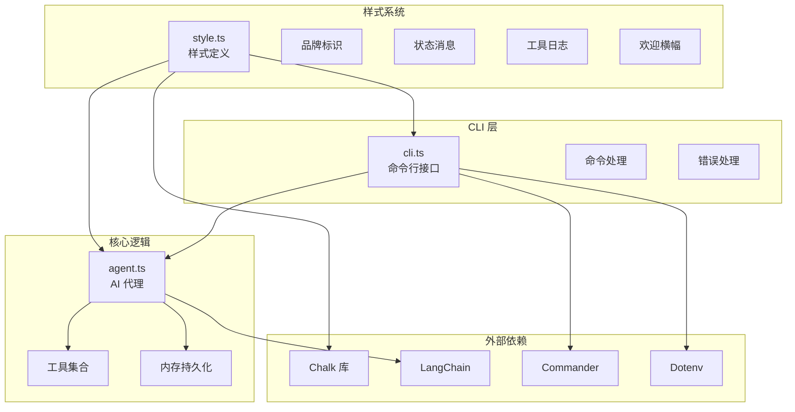
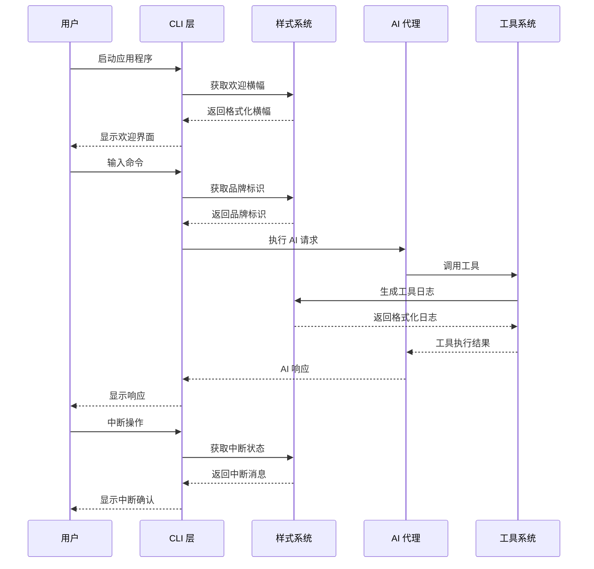
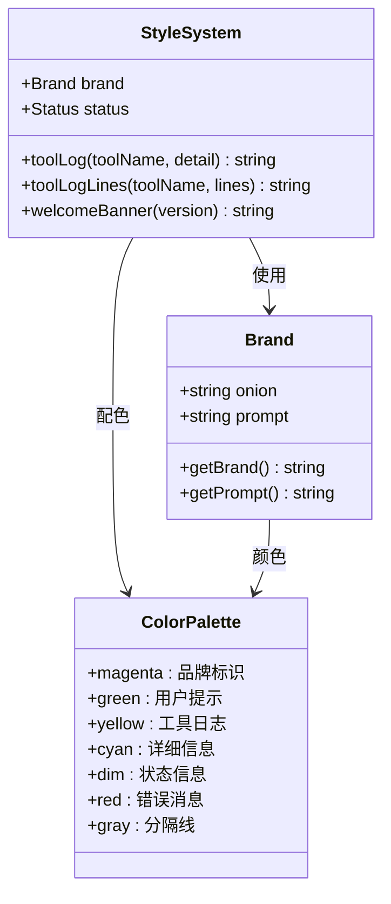
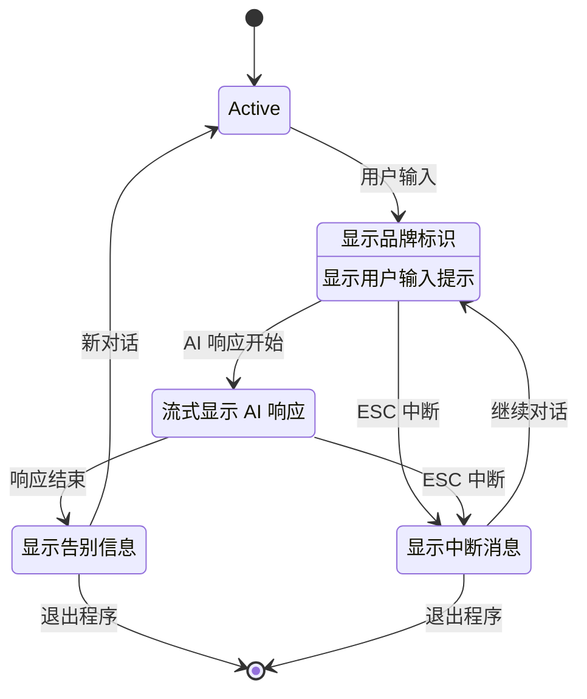
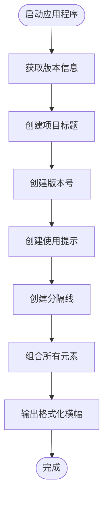
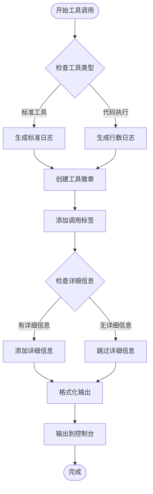
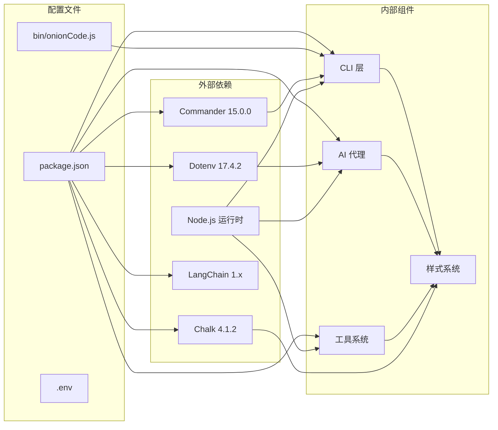

# 样式系统

<cite>
**本文档引用的文件**
- [src/agent/style.ts](file://src/agent/style.ts)
- [src/agent/cli.ts](file://src/agent/cli.ts)
- [src/agent/agent.ts](file://src/agent/agent.ts)
- [package.json](file://package.json)
- [bin/onionCode.js](file://bin/onionCode.js)
- [src/agent/tools/run_js.ts](file://src/agent/tools/run_js.ts)
- [src/agent/tools/exec.ts](file://src/agent/tools/exec.ts)
- [src/agent/tools/search.ts](file://src/agent/tools/search.ts)
</cite>

## 更新摘要
**变更内容**
- 新增了完整的统一日志和样式系统，包括品牌标识、工具调用日志、状态消息和欢迎横幅
- 增强了调试体验，通过详细的工具调用日志追踪工具使用情况
- 改进了视觉一致性，通过统一的颜色方案和格式化选项提升用户体验
- 完善了错误处理机制，提供更友好的错误消息和状态反馈
- 优化了工具调用日志系统，支持标准日志和行数日志两种模式

## 目录
1. [简介](#简介)
2. [项目结构](#项目结构)
3. [核心组件](#核心组件)
4. [架构概览](#架构概览)
5. [详细组件分析](#详细组件分析)
6. [工具调用日志系统](#工具调用日志系统)
7. [依赖分析](#依赖分析)
8. [性能考虑](#性能考虑)
9. [故障排除指南](#故障排除指南)
10. [结论](#结论)

## 简介

样式系统是 onionCode 项目中的一个关键组成部分，负责为命令行界面提供一致且美观的视觉呈现。该系统基于 chalk 库构建，实现了品牌标识、状态消息、工具调用日志和欢迎横幅等功能。通过精心设计的颜色搭配和格式化选项，样式系统显著提升了用户体验，使命令行交互更加直观和友好。

该项目是一个基于 LangChain 的 CLI AI 助手，支持多种工具调用、技能系统和内存持久化功能。样式系统在整个应用中发挥着重要作用，为用户提供清晰的视觉反馈和良好的交互体验。

**章节来源**
- [src/agent/style.ts:1-50](file://src/agent/style.ts#L1-L50)
- [src/agent/cli.ts:1-127](file://src/agent/cli.ts#L1-L127)
- [src/agent/agent.ts:1-129](file://src/agent/agent.ts#L1-L129)

## 项目结构

项目采用模块化的组织方式，样式系统位于 `src/agent/style.ts` 文件中，与其他核心组件协同工作：



**图表来源**
- [src/agent/style.ts:1-50](file://src/agent/style.ts#L1-L50)
- [src/agent/cli.ts:1-127](file://src/agent/cli.ts#L1-L127)
- [src/agent/agent.ts:1-129](file://src/agent/agent.ts#L1-L129)

**章节来源**
- [src/agent/style.ts:1-50](file://src/agent/style.ts#L1-L50)
- [src/agent/cli.ts:1-127](file://src/agent/cli.ts#L1-L127)
- [src/agent/agent.ts:1-129](file://src/agent/agent.ts#L1-L129)

## 核心组件

样式系统包含四个主要组件，每个都针对特定的用户界面需求进行了优化：

### 品牌标识组件
品牌标识组件负责维护项目的视觉识别系统，包括主品牌标签和用户输入提示符。该组件使用品红色粗体字体显示 "🧅 onion" 标识，并提供绿色的用户输入箭头符号。

### 状态消息组件
状态消息组件管理应用程序的各种状态显示，包括中断状态、告别信息和错误消息。所有消息都经过精心设计的颜色编码，确保用户能够快速识别不同类型的信息。

### 工具调用日志组件
工具调用日志组件提供了详细的工具使用跟踪功能，支持两种模式：
- 标准工具日志：显示工具名称和详细信息
- 行数工具日志：专门用于代码执行工具，显示执行的代码行数

### 欢迎横幅组件
欢迎横幅组件创建了专业的启动界面，包含项目名称、版本号和使用提示，为用户提供了清晰的开始界面。

**章节来源**
- [src/agent/style.ts:4-49](file://src/agent/style.ts#L4-L49)

## 架构概览

样式系统在整个应用程序架构中扮演着重要的视觉层角色，与 CLI 层和核心逻辑层紧密集成：



**图表来源**
- [src/agent/cli.ts:110-126](file://src/agent/cli.ts#L110-L126)
- [src/agent/style.ts:16-41](file://src/agent/style.ts#L16-L41)
- [src/agent/agent.ts:61-97](file://src/agent/agent.ts#L61-L97)

## 详细组件分析

### 品牌标识系统

品牌标识系统通过精心设计的颜色和格式化选项，建立了统一的品牌视觉识别：



**图表来源**
- [src/agent/style.ts:4-9](file://src/agent/style.ts#L4-L9)
- [src/agent/style.ts:16-31](file://src/agent/style.ts#L16-L31)

品牌标识系统的核心特点：
- **一致性**：所有品牌元素使用相同的颜色方案
- **可读性**：颜色对比度经过优化，确保在各种终端环境下都能清晰显示
- **语义化**：不同颜色代表不同的信息类型和重要程度

### 状态消息管理系统

状态消息管理系统提供了完整的应用程序状态可视化：



**图表来源**
- [src/agent/cli.ts:79-125](file://src/agent/cli.ts#L79-L125)
- [src/agent/style.ts:34-41](file://src/agent/style.ts#L34-L41)

### 欢迎横幅组件

欢迎横幅组件创建了专业的启动界面，包含项目名称、版本号和使用提示：



**图表来源**
- [src/agent/style.ts:44-49](file://src/agent/style.ts#L44-L49)

**章节来源**
- [src/agent/style.ts:4-49](file://src/agent/style.ts#L4-L49)

## 工具调用日志系统

工具调用日志系统提供了详细的工具使用跟踪和调试信息，是样式系统中最复杂的组件之一：



**图表来源**
- [src/agent/style.ts:16-31](file://src/agent/style.ts#L16-L31)

### 标准工具日志
标准工具日志适用于大多数工具调用，提供工具名称和详细信息的完整显示。例如：
- `toolLog("search", query)` 输出：`⚙ [search] called: "weather"`
- `toolLog("read_file", filename)` 输出：`⚙ [read_file] called: "src/agent/style.ts"`

### 行数工具日志
行数工具日志专门用于代码执行工具，如 JavaScript 和 Python 执行器，显示执行的代码行数：
- `toolLogLines("run_js", 50)` 输出：`⚙ [run_js] called: (50 lines)`
- `toolLogLines("run_py", 25)` 输出：`⚙ [run_py] called: (25 lines)`

### 工具调用日志的实际应用

工具调用日志在各个工具中的使用示例：

**搜索工具**：
```typescript
console.log(toolLog("search", query));
```

**文件读取工具**：
```typescript
console.log(toolLog("read_file", filename));
```

**JavaScript 执行工具**：
```typescript
console.log(toolLogLines("run_js", code.split("\n").length));
```

**章节来源**
- [src/agent/style.ts:16-31](file://src/agent/style.ts#L16-L31)
- [src/agent/tools/run_js.ts:54](file://src/agent/tools/run_js.ts#L54)
- [src/agent/tools/exec.ts:119](file://src/agent/tools/exec.ts#L119)
- [src/agent/tools/search.ts:7](file://src/agent/tools/search.ts#L7)

## 依赖分析

样式系统与项目其他组件的依赖关系体现了清晰的分层架构：



**图表来源**
- [package.json:20-30](file://package.json#L20-L30)
- [bin/onionCode.js:1-3](file://bin/onionCode.js#L1-L3)

依赖关系分析：
- **chalk**：作为唯一的外部依赖，提供了丰富的颜色和格式化功能
- **commander**：用于命令行参数解析和命令定义
- **langchain**：AI 代理的核心框架
- **dotenv**：环境变量管理
- **模块化设计**：样式系统独立于其他组件，便于维护和测试
- **轻量级依赖**：仅依赖必要的第三方库，减少项目复杂度

**章节来源**
- [package.json:1-39](file://package.json#L1-L39)
- [bin/onionCode.js:1-3](file://bin/onionCode.js#L1-L3)

## 性能考虑

样式系统在性能方面的设计考虑：

### 内存使用优化
- **延迟计算**：颜色和格式化字符串在需要时才进行计算
- **字符串缓存**：重复使用的静态字符串避免重复创建
- **最小依赖**：仅使用必要的 chalk 功能，避免额外开销

### 渲染性能
- **同步输出**：所有样式输出都是同步操作，确保顺序正确
- **最小化重绘**：通过合理的颜色组合减少终端重绘次数
- **流式处理**：支持流式输出，避免大量数据缓冲

### 可扩展性
- **模块化设计**：易于添加新的样式组件
- **配置灵活性**：支持通过环境变量调整样式行为
- **向后兼容**：新版本保持现有 API 兼容

## 故障排除指南

### 常见问题及解决方案

**问题：颜色显示异常**
- 检查终端是否支持彩色输出
- 验证 chalk 库版本兼容性
- 确认终端配色方案设置

**问题：样式不生效**
- 确认样式系统正确导入
- 检查 Node.js 版本要求
- 验证依赖安装完整性

**问题：输出格式错误**
- 检查字符串拼接逻辑
- 验证参数传递正确性
- 确认字符编码设置

### 调试技巧
- 使用简单的测试用例验证样式功能
- 检查不同终端环境下的显示效果
- 监控内存使用情况，避免不必要的字符串创建

**章节来源**
- [src/agent/style.ts:16-49](file://src/agent/style.ts#L16-L49)

## 结论

样式系统作为 onionCode 项目的重要组成部分，成功地实现了以下目标：

### 设计成就
- **一致性**：建立了统一的品牌视觉识别系统
- **可用性**：通过颜色和格式化提升了用户体验
- **可维护性**：模块化设计便于未来的扩展和修改
- **调试友好**：通过详细的工具调用日志增强了调试体验

### 技术优势
- **轻量级**：仅依赖单一的第三方库，减少项目复杂度
- **高效性**：优化的渲染和内存使用策略
- **可靠性**：稳定的颜色和格式化功能
- **可扩展性**：灵活的组件设计支持未来功能扩展

### 未来发展方向
- **主题系统**：可以考虑添加可配置的主题支持
- **国际化**：支持多语言环境下的本地化样式
- **无障碍**：增强对视觉障碍用户的友好性
- **性能优化**：进一步优化颜色计算和字符串处理性能

样式系统为整个 onionCode 项目奠定了坚实的视觉基础，通过精心设计的颜色方案和格式化选项，为用户提供了专业而友好的命令行体验。其简洁而强大的设计理念使其成为类似项目中样式系统的优秀参考。新增的完整统一日志和样式系统显著增强了调试体验和视觉一致性，为用户提供了更加丰富和直观的交互界面。